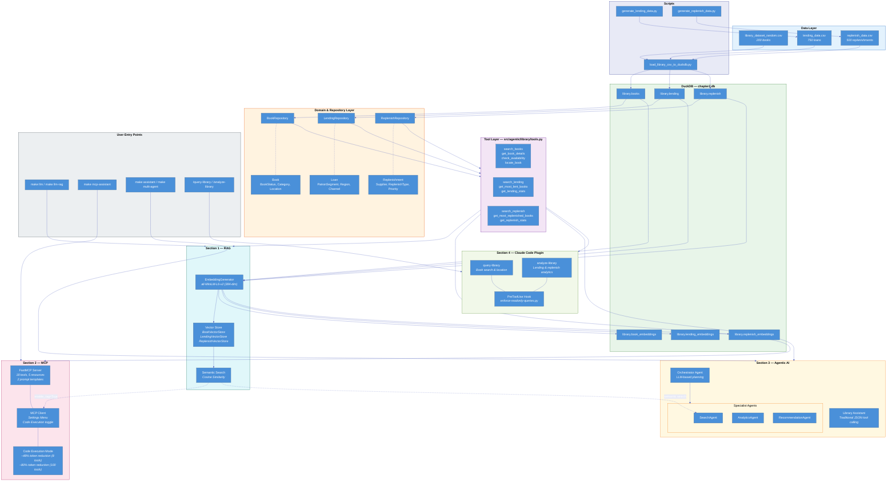

# Chapter 2: AI Engineering with Library Management Data

This chapter demonstrates modern AI engineering patterns using a Library Management dataset. The content follows the book structure: **RAG** → **MCP** → **Agentic AI**.

---

## Architecture Overview



**Data Lifecycle:** Replenish (books IN) → Books (inventory) → Lending (books OUT)

---

## Section 1: RAG (Retrieval-Augmented Generation)

RAG enables LLMs to answer questions about private data they've never seen during training. This section demonstrates the core RAG pattern: **Retrieve** → **Augment** → **Generate**.

### Quick Start

```bash
# 1. Setup environment
make dev-setup

# 2. Configure LLM API
cp .env.example .env
# Edit .env and set LLM_BASE_URL, LLM_API_KEY, and LLM_MODEL
```

### Step 1: Try the LLM Without RAG

```bash
make llm
```

Ask: **"Who wrote 'The Quantum Garden'?"**

The LLM will likely hallucinate an answer or say it doesn't know - because this is a fictional book that doesn't exist in its training data.

### Step 2: Try the LLM With RAG

```bash
make llm-rag
```

Ask the same question: **"Who wrote 'The Quantum Garden'?"**

Now the LLM correctly answers: **"Dr. Elena Voss"** - because RAG retrieved the book data and added it to the prompt.

### What's Happening?

| Mode | What the LLM Sees | Result |
|------|-------------------|--------|
| `make llm` | Just your question | Hallucination or "I don't know" |
| `make llm-rag` | Your question + retrieved book data | Accurate answer |

This is the core RAG pattern:
1. **Retrieve**: Find relevant documents (our 5 fictional books)
2. **Augment**: Add retrieved data to the LLM prompt
3. **Generate**: LLM answers using the provided context

### Production RAG with DuckDB VSS

For the full library dataset (200 books), we use vector embeddings and semantic search.
This requires database setup:

### Prerequisites (Database Setup)

RAG LLM, MCP and Agentic sections require the library database so if you set this now you don't need to repeat again:

```bash
# Load 200 books + 750 loans + 500 replenishments into DuckDB
make load-data
make verify-data    # Expected: ✓ Found 200 books
```

```bash
# Generate embeddings (after load-data)
make generate-embeddings

# Interactive semantic search
make semantic-search

# Assistant with RAG enabled
make assistant-rag
```

**Example Semantic Queries:**
- "books about time travel adventures"
- "something about Python programming"
- "mystery novels with detective stories"

### RAG Make Commands

| Command | Description |
|---------|-------------|
| `make llm` | Chat with plain LLM (no RAG) - see hallucinations |
| `make llm-rag` | Chat with LLM + RAG - see accurate answers |
| `make generate-embeddings` | Generate book embeddings (requires DB) |
| `make semantic-search` | Interactive semantic search (requires DB) |
| `make assistant-rag` | Library Assistant with RAG (requires DB) |

---

## Section 2: MCP (Model Context Protocol)

MCP exposes your tools to AI applications like MCP Client and MCP host. This section shows how MCP tools work and how to deploy an MCP server.

* Make sure to finish [prerequisites](#prerequisites-database-setup) if not already done, while executing RAG section

### Configure MCP Settings

```bash
make mcp-client
```

This opens an interactive settings menu where you can toggle:
- **Code Execution** - ON by default (token efficient mode)
- **RAG** - Semantic search functionality
- **Dummy Tools** - 100 enterprise tools for scale testing
- **Show Tool Calls** - Display generated code during execution

Settings are persisted to `.mcp_config.json` and shared with `mcp-assistant`.

### MCP Assistant (Interactive Chat)

```bash
make mcp-assistant
```

Chat with an AI assistant that uses MCP tools to answer library questions. Code execution mode is enabled by default for token efficiency.

```bash
# With RAG enabled
make mcp-assistant ARGS="--rag"

# Traditional JSON tools (disable code execution)
make mcp-assistant ARGS="--no-code-execution"
```

### Available MCP Tools

| Tool | Description |
|------|-------------|
| `search_books` | Search by title, author, or keyword |
| `get_book_details` | Get complete book information |
| `check_availability` | Check if a book is available |
| `list_by_category` | List books in a category |
| `list_by_status` | List books by status (Present/Missing/Checked Out) |
| `locate_book` | Get physical location (Cabinet/Rack/Row) |
| `find_books_in_cabinet` | List books in a cabinet location |
| `get_weak_signal_books` | Find books needing RFID maintenance |

### 2.1 Code Execution Pattern

The MCP assistant uses sandboxed Python execution by default for token efficiency:

```bash
# Compare Traditional vs Code Execution modes
make mcp-compare-modes

# Run MCP token benchmark
make mcp-benchmark
```

**Why Code Execution?**

Traditional tool calling sends full JSON schemas for every tool in every request. Code execution sends tools once, then executes Python code—dramatically reducing tokens.

**Expected Results:**
- Traditional: ~4,000 tokens
- Code Execution: ~2,100 tokens
- **Reduction: ~48%**

### 2.2 Enterprise Scale (100+ Tools)

At enterprise scale with many tools, the difference is dramatic:

```bash
# Interactive demo with 100 tools
make mcp-compare-modes-enterprise

# Automated full benchmark with 100 tools
make mcp-compare-modes-enterprise-all
```

**Enterprise Results (100 dummy tools):**
- Traditional: ~131,000 tokens
- Code Execution: ~25,000 tokens
- **Reduction: 80%+**

This demonstrates insights from Anthropic's "Advanced Tool Use" paper.

### MCP Make Commands

| Command | Description |
|---------|-------------|
| `make mcp-client` | Settings menu to configure MCP options |
| `make mcp-assistant` | AI Chat (code execution ON by default) |
| `make mcp-assistant ARGS="--rag"` | Chat with RAG enabled |
| `make mcp-assistant ARGS="--no-code-execution"` | Traditional JSON tools mode |
| `make mcp-compare-modes` | Compare Traditional vs Code Execution |
| `make mcp-benchmark` | Run MCP token comparison benchmark |
| `make mcp-compare-modes-enterprise` | Enterprise scale (100 tools, interactive) |
| `make mcp-compare-modes-enterprise-all` | Enterprise scale (100 tools, automated) |
| `make mcp-server` | Start MCP server (for Claude Desktop) |
| `make mcp-dev` | Start MCP Inspector for debugging |

---

## Section 3: Agentic AI

This section covers multi-agent orchestration and traditional tool-calling patterns.

### 3.1 Traditional Tool Use

The Library Assistant uses JSON schema-based tool calling:

```bash
make assistant
```

**In-App Commands:**
- `/help` - Show available commands
- `/tools` - Toggle tool call display
- `/stats` - Show token usage statistics
- `/quit` - Exit

**Example Queries:**
- "What programming books are available?"
- "Show me books by John Smith"
- "Which books are missing?"

### 3.2 Multi-Agent System

Orchestrated specialist agents handle complex queries:

```bash
make multi-agent
```

**Specialist Agents:**
- **SearchAgent** - Book discovery and semantic search
- **AnalyticsAgent** - Statistics and reporting
- **RecommendationAgent** - Suggestions with quality filters

**Example Multi-Agent Queries:**
- "Find available programming books and recommend one with good signal"
- "How many books are missing? Show breakdown by category"
- "Search for fiction books and analyze their availability patterns"

### Agentic Make Commands

| Command | Description |
|---------|-------------|
| `make assistant` | Traditional tool-calling assistant |
| `make data-analysis` | Start data analysis agent |
| `make multi-agent` | Start multi-agent orchestrator |

### 3.3 IDE Integrations

**Claude Desktop Configuration:**

Add to `~/Library/Application Support/Claude/claude_desktop_config.json`:

```json
{
  "mcpServers": {
    "library": {
      "command": "uv",
      "args": ["run", "fastmcp", "run", "src/mcp/library_server.py"],
      "cwd": "/path/to/chapter-2"
    }
  }
}
```

---

## Section 4: Plugins (Library Assistant)

This section packages the Library Assistant as a Claude Code plugin, demonstrating how to
extend Claude Code with domain-specific skills, read-only enforcement hooks, and agent knowledge.

### Plugin Structure

The plugin lives in `library-assistant-plugin/` and is defined by
`library-assistant-plugin/.claude-plugin/plugin.json`.
The marketplace manifest is at `.claude-plugin/marketplace.json`.

| Path | Purpose |
|------|---------|
| `library-assistant-plugin/skills/` | Skill definitions (`query-library`, `analyze-library`) |
| `library-assistant-plugin/hooks/` | PreToolUse hook for read-only query enforcement |
| `library-assistant-plugin/scripts/` | Hook scripts (`enforce-readonly-queries.py`) |
| `library-assistant-plugin/agents/` | Agent reference docs (domain knowledge) |

### Installing the Plugin

From the repo root:

```bash
/plugin marketplace add ./chapter-2
/plugin install library-assistant-plugin@rdewai-plugins
```

### Skills

- **query-library**: Search books, check availability, locate by cabinet/rack/row,
  list by category or status, identify weak RFID signal books, get library stats.
- **analyze-library**: Analyze lending data — most lent books, fees by segment/region/channel,
  monthly trends, per-book lending breakdown.

### Hooks

The plugin includes a **PreToolUse** hook that blocks any write operations against
the DuckDB database before execution. Only read-only `SELECT` queries are permitted.

---

## All Make Commands (End of Chapter 2 excercise. From here it is for debugging or extra help)

### Setup

| Command | Description |
|---------|-------------|
| `make help` | Show all available targets |
| `make dev-setup` | Install dependencies (uv sync) |
| `make clean` | Clean generated files |

### Data (Required for Prouduction setup of RAG & MCP & Agentic)

| Command | Description |
|---------|-------------|
| `make load-data` | Load 200 books into DuckDB |
| `make verify-data` | Verify data loaded correctly |

### Testing & Quality

| Command | Description |
|---------|-------------|
| `make test` | Run all tests |
| `make test-unit` | Run unit tests only |
| `make test-integration` | Run integration tests only |
| `make test-multi-agent` | Run multi-agent system tests |
| `make lint` | Run ruff linter |
| `make format` | Auto-format code |

---

## Environment Variables

| Variable | Description | Default |
|----------|-------------|---------|
| `LLM_BASE_URL` | LLM API base URL | `https://openrouter.ai/api/v1` |
| `LLM_API_KEY` | API key (required for OpenRouter/OpenAI) | Required |
| `LLM_MODEL` | Model identifier | `openai/gpt-4o-mini` |
| `LLM_ENABLE_USAGE_TRACKING` | Enable token usage tracking | `true` |
| `DB_PATH` | DuckDB database path | `data/duckdb/chapter2.db` |
| `LOG_LEVEL` | Logging level | `INFO` |

**Supported LLM Providers:**
| Provider | `LLM_BASE_URL` | API Key |
|----------|----------------|---------|
| OpenRouter | `https://openrouter.ai/api/v1` | Required |
| OpenAI | `https://api.openai.com/v1` | Required |
| Ollama | `http://localhost:11434/v1` | Not needed |

---

## Project Structure

```
chapter-2/
├── src/
│   ├── rag/                     # Section 1: Simple RAG demo
│   │   └── simple_rag.py        # Minimal RAG implementation
│   ├── mcp/                     # Section 2: MCP server & client
│   │   ├── library_server.py    # FastMCP server with tools/resources
│   │   └── client.py            # MCP settings menu and assistant
│   └── agentic/                 # Section 3: Agentic AI
│       ├── rag/                 # Production RAG (embeddings, vector store)
│       ├── library/             # Data layer (domain, repository)
│       ├── llm/                 # LLM abstraction (OpenRouter, Ollama)
│       ├── agents/              # All agents and assistants
│       ├── code_execution/      # Sandbox for code execution
│       ├── tools/               # Tool registry and search
│       └── a2a/                 # Agent-to-Agent protocol
├── data/
│   ├── raw/library/             # Source CSV files
│   └── duckdb/                  # DuckDB database
├── scripts/                     # Utility scripts
├── benchmarks/                  # Performance benchmarks
├── docs/                        # Detailed documentation
└── tests/                       # Unit and integration tests
```

---

## Troubleshooting

### "LLM_API_KEY not set" or "API key required"
```bash
# Add to .env file
LLM_BASE_URL=https://openrouter.ai/api/v1
LLM_API_KEY=your-api-key-here
LLM_MODEL=openai/gpt-4o-mini
```

### "Database not found"
```bash
make load-data
```

### "No module named 'fastmcp'"
```bash
uv sync
```

### "Embeddings table empty"
```bash
make generate-embeddings
```

### "Could not set lock on file" (DuckDB)
```bash
# Close other terminals running chapter-2 commands
lsof data/duckdb/chapter2.db
# Kill orphaned processes if needed
```

### "MCP server not connecting"
1. Check server is running: `make mcp-server`
2. Verify config path in Claude Desktop settings
3. Restart Claude Desktop completely

---

## Resources

- [FastMCP Documentation](https://gofastmcp.com/)
- [OpenRouter API](https://openrouter.ai/docs)
- [DuckDB VSS Extension](https://duckdb.org/docs/stable/core_extensions/vss)
- [Anthropic: Code Execution with MCP](https://www.anthropic.com/engineering/code-execution-with-mcp)
- [Anthropic: Advanced Tool Use](https://www.anthropic.com/engineering/advanced-tool-use)

---

## License

Part of the "Redefining Data Engineering with AI" project.
