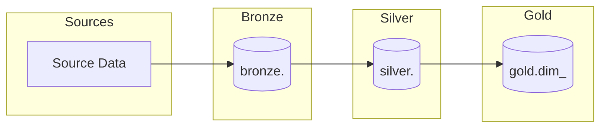

# PAD (Pipeline Architecture Document) Validation

## Format Requirements

- **Format**: Markdown (.md)
- **Header**: Must start with `# Pipeline Architecture Document`
- **Diagrams**: Use Mermaid (NOT ASCII art)
- **No code fences** around entire document

## Required Sections

1. **Architecture Overview** - High-level design with Mermaid flowchart
2. **Data Layers** - Bronze, Silver, Gold layer definitions
3. **Pipeline Components** - Ingestion and transformation stages
4. **Data Models** - ERD with Mermaid diagram
5. **Technology Stack** - Tools and rationale
6. **Data Quality Framework** - Quality gates and monitoring
7. **Error Handling** - Retry strategy, DLQ, alerting
8. **Security & Governance** - Access control, data masking
9. **Performance Considerations** - Partitioning, caching, scaling
10. **Implementation Phases** - Phased rollout plan

## Mermaid Diagram Requirements

- **Flowcharts** for data flow visualization
- **ERD** for entity relationships
- **NO ASCII art** (┌ ─ ┐ │ └ ┘ ► ▶)

## Validation Checklist

Format checks:
- [ ] Document starts with `# Pipeline Architecture Document`
- [ ] No ``` markers wrapping entire document
- [ ] No ASCII art characters
- [ ] Contains Mermaid diagrams

Content checks:
- [ ] All 10 sections present
- [ ] At least 2 Mermaid diagrams
- [ ] Technology choices specified with rationale
- [ ] All three layers defined (bronze, silver, gold)
- [ ] References entities from DRD
- [ ] Minimum 30 non-empty lines

## Common Issues

### 1. ASCII art instead of Mermaid
**BAD:**
```
┌─────────┐     ┌─────────┐
│ Source  │ ──► │ Bronze  │
└─────────┘     └─────────┘
```
**GOOD:**


### 2. Missing layer definitions
**BAD:** Only mentions "raw" and "processed"
**GOOD:** Defines bronze, silver, and gold layers

### 3. No technology specifics
**BAD:** "Use a database" or "some ETL tool"
**GOOD:** "DuckDB for analytics, Python for transformations"

### 4. Missing Mermaid diagrams
**BAD:** Only text descriptions
**GOOD:** Flowchart for data flow + ERD for data model

## Example Valid PAD Structure

```markdown
# Pipeline Architecture Document (PAD)

## 1. Architecture Overview
### 1.1 High-Level Design


### 1.2 Architecture Pattern
- **Pattern**: Batch Processing
- **Approach**: ELT (Extract-Load-Transform)
- **Data Model**: Star Schema

## 2. Data Layers
### 2.1 Bronze Layer (Raw)
- **Purpose**: Landing zone for raw source data
- **Tables**: bronze.<table_1>, bronze.<table_2>

### 2.2 Silver Layer (Cleaned)
- **Purpose**: Cleaned and standardized data
- **Tables**: silver.<table_1>, silver.<table_2>

### 2.3 Gold Layer (Business)
- **Purpose**: Business-ready aggregates and dimensions
- **Tables**: gold.dim_<entity>, gold.fact_<entity>

## 3. Pipeline Components
| Component | Description | Technology |
|-----------|-------------|------------|
| Ingestion | Source to Bronze | Python + DuckDB |
| Bronze→Silver | Data cleaning | SQL transforms |

## 4. Data Models
### 4.1 Entity Relationship Diagram
```mermaid
erDiagram
    ENTITY_A ||--o{ ENTITY_B : has
    ENTITY_A {
        varchar <primary_key> PK
        date <date_field>
        varchar <attribute>
    }
    ENTITY_B {
        varchar <primary_key> PK
        varchar <foreign_key> FK
        date <date_field>
    }
```

## 5. Technology Stack
| Component | Technology | Rationale |
|-----------|------------|-----------|
| Database | DuckDB | Fast analytics, embedded |
| Processing | Python | Flexibility, ecosystem |
```

## Cross-Reference Validation

When validating PAD against DRD:
- All entities from DRD should appear in layer definitions
- Data model should reflect DRD entity relationships
- Technology choices should support DRD requirements
