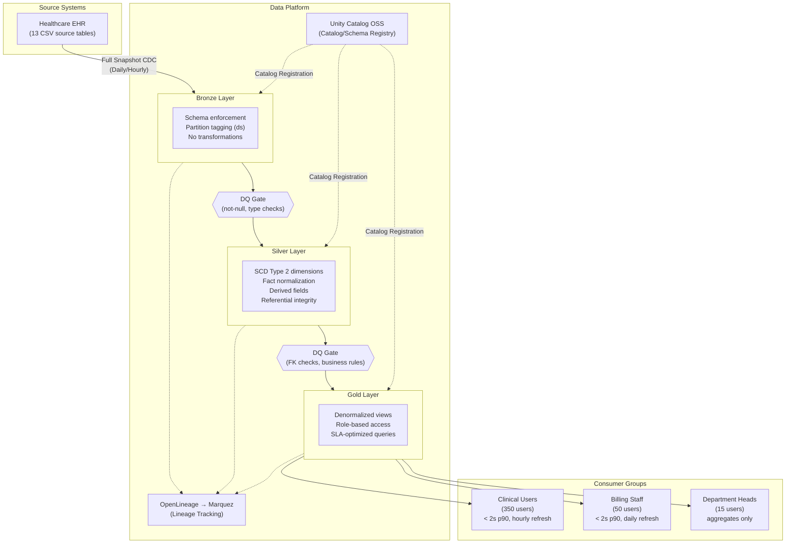

# High-Level Design: Patient 360 Medallion Pipeline

| Field | Value |
|-------|-------|
| **Version** | 1.0 |
| **Created** | 2026-03-15 |
| **Last Modified** | 2026-03-15 |
| **Author** | Architect Agent |
| **Status** | Draft — Pending Review |
| **DRD Reference** | DRD-2026-02-11-patient-360-v1.md (v1.1) |

---

## 1. Executive Summary

The Patient 360 pipeline consolidates 13 Synthea healthcare source tables into a
unified patient view serving 415+ clinical, billing, and administrative users
across five role groups. The architecture uses a Medallion pattern
(Bronze → Silver → Gold) with Delta Lake for ACID guarantees and SCD Type 2
tracking on patient dimensions. This design satisfies the DRD's 1-hour clinical
latency SLA [DRD §4.4] and 2-second query response target [DRD §4.3] while
keeping implementation within the team's demonstrated proficiency in batch Spark
pipelines and Delta Lake MERGE INTO [team-capabilities.md §2].

---

## 2. Architecture Overview

### 2.1 Selected Pattern

**Pattern**: Medallion Architecture (Bronze → Silver → Gold)

**Justification**: The DRD [§4.4] requires a maximum of 1-hour latency for
clinical users and 24-hour latency for billing/reporting consumers. The team has
demonstrated high proficiency in Medallion patterns, Delta Lake MERGE INTO, and
SCD Type 2 [team-capabilities.md §2] — making Medallion the lowest-risk,
highest-velocity choice. The 5,767-patient dataset with ~6.9M total rows
[DRD §2.3] is well within local-mode Spark capacity and does not justify a
streaming architecture.

### 2.2 Alternatives Considered

| Option | Description | Why Not Selected |
|--------|-------------|------------------|
| Medallion (Bronze/Silver/Gold) | 3-layer batch pipeline with Delta Lake | **Selected** — team proficient, satisfies all DRD SLAs |
| Lambda Architecture | Dual batch + streaming paths | Over-engineered: DRD requires only 1-hour latency, not sub-minute; team has no streaming experience |
| Kappa Architecture | Streaming-only with Kafka/Flink reprocessing | Requires infrastructure not in technology catalog; team gap in streaming |
| Data Vault | Hub-satellite modeling with surrogate keys | Team awareness-level only; longer timeline; no audit-trail requirement that mandates Data Vault |

**Trade-off**: Medallion batch cannot achieve sub-minute data freshness. The
DRD [§4.4] confirms 1-hour maximum latency for clinical users is acceptable.
Medications and allergies have sub-minute source sync [DRD §2.2] but Phase 1
uses hourly batch as a compromise.

### 2.3 Architecture Diagram

### 2.4 Key Design Principles

- **Idempotency**: All layers partition by `ds` (YYYY-MM-DD); re-running same `ds` replaces that partition only via `replaceWhere` [infrastructure-constraints.md §2]
- **Schema enforcement**: All 13 source tables use explicit `StructType` schemas; no schema inference
- **Traceability**: Every pipeline job emits OpenLineage events to Marquez; lineage graph visible across all layers
- **Separation of concerns**: Bronze = raw copy; Silver = conformed with SCD2; Gold = business-ready aggregations
- **Read-only source**: Source database accessed via `-readonly` flag only [DRD §1.5]

---

## 3. Data Architecture

### 3.1 Layer Strategy

**Bronze Layer**: Preserves source data exactly as received from Synthea CSVs.
No transformations — only type casting, schema enforcement, and partition tagging.
Serves as the immutable audit record. All 13 Phase 1 tables land here with
idempotent partition replacement per `ds` date [DRD §2.2].

**Silver Layer**: Applies SCD Type 2 to dimension tables (patients, providers,
payers, organizations) for historical tracking using SHA-256 change detection.
Fact tables (encounters, conditions, medications, observations, allergies, claims,
immunizations, careplans, procedures) use insert-only pattern with partition
overwrite. Derived fields computed here: `calculated_age`, `medication_status`,
`is_30_day_readmission` [DRD §5.2]. Referential integrity enforced [DRD §3.3].

**Gold Layer**: Produces three denormalized, consumer-specific aggregation tables
aligned to the DRD's consumer groups [DRD §4.1]: patient_summary (clinical users),
patient_clinical_history (physicians/nurses), and patient_billing_summary
(billing staff). Optimized for sub-2-second query response [DRD §4.3].

> Detailed table inventories, column schemas, and per-table write strategies are
> documented in the **Data Model Specification (DMS)**.

### 3.2 Data Domain Map

**Clinical domain** (patients, encounters, conditions, medications, observations,
allergies, immunizations, procedures, careplans) flows through all three layers.
This is the core domain serving the Patient 360 use case.

**Reference domain** (organizations, providers, payers) lands in Bronze and
becomes SCD Type 2 dimensions in Silver. These are slowly changing reference
tables supporting FK relationships.

**Financial domain** (claims) flows Bronze → Silver → Gold billing summary.
Restricted to billing staff role per DRD [§5.5].

### 3.3 SCD Strategy

| Dimension Type | SCD Approach | Rationale |
|----------------|-------------|-----------|
| Patient demographics | SCD Type 2 | Track address/name changes over time for clinical accuracy [DRD §1.2] |
| Provider attributes | SCD Type 2 | Track specialty and organization changes |
| Payer information | SCD Type 2 | Track plan changes for billing accuracy |
| Organization data | SCD Type 2 | Track organizational restructuring |

### 3.4 Data Quality Strategy

**Bronze gate**: Schema validation (all expected columns present, types match),
not-null checks on identity fields (patient id), valid range checks (birthdate,
future dates). Actions: `fail` for identity fields, `drop` for invalid ranges,
`warn` for optional fields [DRD §3.1, §3.2].

**Silver gate**: Referential integrity (FK checks — encounter → patient,
condition → encounter). Null tolerance enforcement per DRD [§3.4]: 0% for
patient name/DOB, 0% for allergy description, 60% for allergy severity.
Business rule validation for derived fields.

**Gold gate**: Column-level assertions on consumer-facing fields:
`patient_id NOT NULL`, `full_name NOT NULL`, allergy array never suppressed
[DRD §5.4].

---

## 4. Technology Decisions

| Component | Selected Tool | Why |
|-----------|--------------|-----|
| Processing Engine | Apache Spark (PySpark) | Team high proficiency; handles 4.4M-row observations table; Delta Lake integration [team-capabilities.md §2] |
| Table Format | Delta Lake | ACID writes, time travel, MERGE INTO for SCD2; mandated by infrastructure constraints [infrastructure-constraints.md §2] |
| Metastore | Unity Catalog OSS | Catalog/schema hierarchy (`spark_catalog.bronze.patients`), REST API for consumer access [technology-catalog.md §2] |
| Lineage | OpenLineage + Marquez | HIPAA audit trail requirement [DRD §7.5]; captures Bronze → Silver → Gold lineage |
| Data Quality | Spark Expectations | Rule-based DQ enforcement at each layer boundary; JSON/YAML rule definitions |
| Language | Python | Team high proficiency; PySpark + pytest ecosystem [team-capabilities.md §1] |
| Containerization | Docker + Docker Compose | UC OSS + Marquez + PostgreSQL services; local dev environment |

> Detailed technology versions, JAR coordinates, and deployment configurations
> belong in the **Low-Level Design (LLD)** document.

### 4.1 Key Compatibility Constraints

- Spark 4.x requires Scala 2.13 JARs and Java 11 or 17 (not Java 21) [infrastructure-constraints.md §1]
- UC OSS catalog name must be `spark_catalog` — Spark's default [infrastructure-constraints.md §5]
- OpenLineage port remapped to 5001 on macOS due to AirPlay conflict [infrastructure-constraints.md §3]
- `uc_init.py` bootstrap must run once after `docker compose up` before first pipeline execution

### 4.2 Technology Trade-offs

- **Delta Lake vendor lock-in**: Acceptable for local dev; Iceberg migration path exists if multi-engine portability needed in production
- **UC OSS 0.4.0 limitations**: No column-level lineage REST API; requires Databricks UC or DataHub for column lineage — deferred to Phase 2
- **Local Spark mode**: Sufficient for 6.9M rows; cluster mode needed if dataset grows 10x+

---

## 5. Integration Architecture

### 5.1 Source Systems

| Source | Type | Access Pattern | Tables Consumed |
|--------|------|---------------|-----------------|
| Synthea Healthcare EHR | CSV files (DuckDB-backed) | File read for ingestion; DuckDB readonly for validation | All 13 Phase 1 tables per DRD §2.2 |

### 5.2 Consumer Access Pattern

| Consumer Group | Access Method | Gold Tables | SLA |
|---------------|--------------|-------------|-----|
| Physicians (120) | Unity Catalog REST API | patient_summary, patient_clinical_history | < 2s at p90 [DRD §4.3] |
| Nurses (200) | Unity Catalog REST API | patient_summary, patient_clinical_history | < 2s at p90 [DRD §4.3] |
| Care Coordinators (30) | Unity Catalog REST API | patient_summary | < 2s at p90 [DRD §4.3] |
| Billing Staff (50) | Unity Catalog REST API | patient_billing_summary | < 2s at p90 [DRD §4.3] |
| Department Heads (15) | Unity Catalog REST API | patient_summary (aggregates) | < 2s at p90 [DRD §4.3] |

### 5.3 Observability Strategy

Every pipeline job emits OpenLineage events capturing job-level lineage (input
datasets → output datasets). The Marquez backend stores these events and provides
a web UI for visualizing the full Bronze → Silver → Gold lineage graph. Spark
Expectations DQ results are logged per layer with pass/fail/warn counts.

---

## 6. Scalability & Capacity Model

### 6.1 Current Scale

Total dataset: ~6.9M rows across 13 tables (~3.8 GB as Delta, 636 MB raw CSV).
Largest table: observations at 4.37M rows (~3.2 GB Delta). Patient count: 5,767.
Full pipeline runtime: ~15 minutes on local Spark. All volumes verified against
the source database.

### 6.2 Growth Model

| Metric | Current | Year 1 | Year 3 | Assumption |
|--------|---------|--------|--------|------------|
| Patient count | 5,767 | ~6,000 | ~6,500 | ~200 new patients/year (~3.5% growth) |
| Total rows (all tables) | ~6.9M | ~7.1M | ~7.6M | Linear growth proportional to patients |
| Storage (Delta) | ~3.8 GB | ~4.2 GB | ~5.0 GB | Delta compression ~30% vs CSV |
| Pipeline runtime (full) | ~15 min | ~16 min | ~18 min | Linear growth with row count |

### 6.3 Scaling Levers

- At 10x patient volume (~60K): move from `local[*]` to Spark cluster mode
- At 50 GB Delta storage: evaluate cloud object storage (S3/GCS/ADLS)
- Observations table: increase shuffle partitions if pipeline runtime exceeds 30 min
- Weekly VACUUM to control Delta small-file proliferation

### 6.4 Cost Model

Phase 1 is local dev with $0 infrastructure cost (developer workstation + Docker).
Cloud migration cost scales linearly with compute hours (vCPU-hour) and storage
volume (GB/month). Cloud platform decision pending [Open Question #2].

> Detailed compute sizing (memory allocations, Spark configs, shuffle partitions)
> and monthly cost breakdowns belong in the **Low-Level Design (LLD)** document.

---

## 7. Security & Compliance

### 7.1 Data Classification

| Classification | Examples | Handling Strategy |
|---------------|----------|-------------------|
| PHI - Confidential | Patient demographics (name, DOB, SSN, address) | Encrypted at rest (Phase 2); SSN masked to last 4 digits [DRD §3.5, §5.3]; role-based access |
| PHI - Clinical | Conditions, medications, allergies, observations | Clinical role access only [DRD §5.5]; allergy severity never suppressed [DRD §5.4] |
| Financial | Claims, encounter costs | Billing role only [DRD §5.5]; hidden from clinical views |
| Internal | Reference data (organizations, providers, payers) | Standard access controls |

### 7.2 Access Strategy

| Role Group | Layer Access | Restrictions | Phase |
|-----------|-------------|-------------|-------|
| Clinical users (350) | Gold READ | No cost columns; masked SSN; city/state only for non-physicians | Phase 1 (app-layer masking) |
| Billing staff (50) | Gold READ | No clinical notes | Phase 1 |
| Department heads (15) | Gold READ | Aggregates only; no individual PHI | Phase 1 |
| Data engineers | All layers WRITE | No restrictions | Phase 1 (service account) |
| Full RBAC + SSO + MFA | All layers | Column-level enforcement | Phase 2 [DRD §7.4] |

### 7.3 Compliance Requirements

HIPAA compliance is a separate workstream per DRD [§6.1 Assumptions]. Phase 1
focuses on data consolidation with application-layer masking. Full HIPAA
technical safeguards — encryption at rest (AES-256), TLS 1.3 in transit,
comprehensive audit logging of all patient record access [DRD §7.5] — are
deferred to Phase 2 when the production environment is selected.

> Column-level masking rules, specific authentication methods, and encryption
> key management details belong in the **Low-Level Design (LLD)** document.

---

## 8. Operational Considerations

### 8.1 CDC Strategy

All source tables use Full Snapshot in Phase 1. The source database has no
reliable `updated_at` or `modified_at` columns (verified via
`information_schema.columns` query), making Timestamp Watermark unreliable.
Log-Based CDC (Debezium) requires Kafka infrastructure not in the technology
catalog. SCD Type 2 in Silver detects changes via SHA-256 hash comparison.

| Source Type | CDC Method | Frequency | Rationale |
|------------|-----------|-----------|-----------|
| Static reference tables (orgs, providers, payers) | Full Snapshot | Weekly | <1.1K rows each; changes rare |
| Medium transactional tables (conditions, allergies, immunizations, careplans) | Full Snapshot | Daily/Hourly | Daily batch satisfies clinical SLA; hourly for meds/allergies as Phase 1 compromise |
| Large transactional tables (encounters, observations, claims, procedures) | Full Snapshot | Daily | 340K-4.4M rows; daily full reload acceptable at current scale |

**Phase 2**: Evaluate Timestamp Watermark when source systems provide reliable
update timestamps. True sub-minute CDC for medications/allergies deferred.

### 8.2 Recovery Strategy

| Metric | Target | Justification |
|--------|--------|---------------|
| RTO | 4 hours | Read-only system; source CSVs are authoritative; rebuild from source within 4 hours |
| RPO | 24 hours (last batch) | Daily batch cadence; source EHR is system of record |
| Production RTO/RPO | [TBD - Phase 2] | Requires decision from Jennifer Martinez (Compliance) per DRD §7.6 |

### 8.3 Backup Approach

Source CSVs are immutable and re-ingestible at any time. Delta Lake time travel
provides 7-day rollback window. Unity Catalog and Marquez metadata stored in
named Docker volumes with daily backup. Pipeline code versioned in Git.

> Detailed recovery runbooks and per-table CDC configurations belong in the
> **Low-Level Design (LLD)** document.

---

## 9. Decision Log

### Decision 1: Architecture Pattern — Medallion vs. Lambda/Kappa/Data Vault

**Options Considered**:
1. Medallion (Bronze/Silver/Gold) — batch pipeline, team high proficiency
2. Lambda Architecture — dual batch + streaming paths
3. Kappa Architecture — streaming-only with reprocessing
4. Data Vault — hub-satellite with surrogate keys for audit trails

**Selected**: Medallion (Bronze/Silver/Gold)

**Rationale**: DRD [§4.4] requires 1-hour maximum latency for clinical users and
24-hour for others — no sub-minute requirement at the query level. Team has
demonstrated high proficiency in Medallion + Delta Lake [team-capabilities.md §2].
Infrastructure is local Docker with no Kafka/Flink [technology-catalog.md].

**Trade-off**: Cannot achieve sub-minute data freshness. Hourly batch is the
Phase 1 acceptable compromise for medications and allergies.

### Decision 2: Storage Format — Delta Lake vs. Iceberg vs. Hudi

**Options Considered**:
1. Delta Lake — ACID, time travel, MERGE INTO, team high proficiency
2. Apache Iceberg — multi-engine, no team experience
3. Apache Hudi — upsert-optimized, no team experience

**Selected**: Delta Lake

**Rationale**: Infrastructure constraints mandate Delta Lake exclusively
[infrastructure-constraints.md §2]. Team has high proficiency in Delta MERGE INTO
for SCD2 [team-capabilities.md §2].

**Trade-off**: Vendor lock-in to Databricks ecosystem. Acceptable for local dev;
Iceberg migration path exists if multi-engine portability needed in production.

### Decision 3: CDC Method — Full Snapshot vs. Timestamp vs. Log-Based

**Options Considered**:
1. Full Snapshot — reload entire table each run
2. Timestamp Watermark — filter by `updated_at` column
3. Log-Based CDC — Debezium / transaction log capture

**Selected**: Full Snapshot for all tables in Phase 1

**Rationale**: Source database verified to have no `updated_at` columns. Log-Based
CDC requires infrastructure not in technology catalog. Full Snapshot with Delta
`replaceWhere` is idempotent and sufficient for current dataset sizes.

**Trade-off**: Full Snapshot scans entire source table each run. For observations
(4.4M rows), this adds ~5 min to pipeline runtime. Evaluate Timestamp Watermark
in Phase 2 when sources provide reliable update timestamps.

### Decision 4: Gold Table Design — 3 Consumer-Aligned Tables

**Options Considered**:
1. 3 consumer-aligned tables (patient_summary, clinical_history, billing_summary)
2. 1 wide denormalized patient_360 table for all consumers
3. Per-consumer tables (5+ tables, one per role)

**Selected**: 3 consumer-aligned tables

**Rationale**: DRD [§4.1] identifies three distinct consumer groups with different
data needs. DRD [§5.5] requires cost data hidden from non-billing roles — separate
tables enforce this at the schema level.

**Trade-off**: 3 Gold tables require 3 separate pipeline jobs instead of 1.
Acceptable because Gold tables are small (5,767 rows) and compute is minimal.

---

## 10. Open Questions & Risks

### Open Questions

| # | Question | Assigned To | Due Date | Status |
|---|----------|-------------|----------|--------|
| 1 | Will medications and allergies have a true sub-minute CDC path in Phase 2? | Michael Torres (CIO) | 2026-04-15 | Open |
| 2 | Which cloud platform for production deployment (Databricks, EMR, Dataproc)? | Michael Torres (CIO) | 2026-06-01 | Open |
| 3 | What are the production RTO/RPO targets per DRD §7.6? | Jennifer Martinez (Compliance) | 2026-04-30 | Open |
| 4 | Should schema evolution use `mergeSchema = true` or versioned schemas? | Data Engineering Team | 2026-04-15 | Open |
| 5 | Column-level lineage strategy for production (DataHub vs. Databricks UC)? | Data Engineering Team | 2026-06-01 | Open |

### Key Risks

| Risk | Impact | Likelihood | Mitigation |
|------|--------|-----------|------------|
| Observations table (4.4M rows) exceeds local Spark memory | Pipeline failures, SLA breach | Low (well within 6 GB driver) | Monitor runtime; scale to cluster mode at 10x volume |
| HIPAA audit requirements not met in Phase 1 | Compliance gap | Medium | Phase 2 adds encryption + audit logging; Phase 1 is dev-only |
| Team unfamiliar with UC OSS 0.4.0 (medium proficiency) | Slower development, misconfiguration | Medium | Allocate upskilling time; use `spark_catalog` default to reduce complexity |
| Source database adds new columns without notice | Bronze schema failures | Low | Use `mergeSchema` in Bronze; enforce schema-on-write in Silver |

---

## 11. Appendix

### Version History

| Version | Date | Author | Changes |
|---------|------|--------|---------|
| 1.0 | 2026-03-15 | Architect Agent | Initial HLD: Medallion pattern selected; Full Snapshot CDC; 4h RTO / 24h RPO for Phase 1 |

### Approval

| Role | Name | Date | Signature |
|------|------|------|-----------|
| Technical Sponsor | Michael Torres | _Pending_ | __________ |
| Business Sponsor | Dr. Sarah Chen | _Pending_ | __________ |
| Data Architecture Lead | [TBD] | _Pending_ | __________ |
| Security/Compliance | Jennifer Martinez | _Pending_ | __________ |

### Related Documents

- **DRD**: DRD-2026-02-11-patient-360-v1.md (v1.1) — source requirements
- **DMS**: Data Model Specification (downstream — defines table schemas, column details, and write strategies)
- **LLD**: Low-Level Design (downstream — defines deployment configs, technology versions, JAR coordinates, and operational runbooks)
