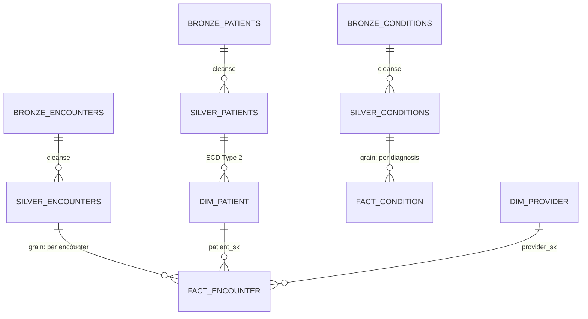

# Data Model Specification: Patient 360 Dimensional Model

| Field | Value |
|-------|-------|
| **Version** | 1.0 |
| **Created** | 2026-03-16 |
| **Last Modified** | 2026-03-16 |
| **Author** | Data Modeler Agent |
| **Status** | Draft |
| **HLD Reference** | HLD-2026-03-15-patient-360-pipeline.md |
| **DRD Reference** | DRD-2026-02-10-patient-360.md |

---

## 1. Design Overview

### 1.1 Modeling Approach

This DMS implements a **Medallion Architecture** dimensional model for the Patient 360 use case, translating the HLD's three-layer specification into concrete, build-ready schemas. The modeling approach uses:

- **Bronze**: Source-aligned ingestion of all 18 Synthea tables with pipeline metadata columns. No transformations — raw data preserved exactly as extracted for audit and reprocessing.
- **Silver**: Canonical business entities with standardized naming, type conversions, null handling per DRD business rules, and PHI exclusions per governance policy. Silver tables are the "single version of truth" before dimensional modeling.
- **Gold**: Star schema dimensional model with SCD Type 2 patient dimensions, fact tables at encounter grain, and pre-aggregated readmission scoring tables.

The dual-format approach (markdown narrative + embedded YAML schema blocks) ensures human reviewers understand design rationale while downstream agents (Mapping Engineer, DQ Engineer) can parse schemas programmatically.

### 1.2 Layer Summary

| Layer | Purpose | Table Count | Key Characteristics |
|-------|---------|-------------|---------------------|
| Bronze | Raw ingestion with metadata | 18 | Source-aligned, partitioned by `_ingested_date`, Delta Lake format |
| Silver | Cleansed canonical entities | 12 | Standardized types, PK/FK enforced, PHI columns dropped (SSN, DRIVERS, PASSPORT) |
| Gold | Dimensional model for analytics | 8 | Star schema, SCD Type 2 dimensions, surrogate keys, pre-computed aggregates |

### 1.3 HLD Traceability

This DMS implements the layer specifications defined in HLD-2026-03-15-patient-360-pipeline.md.

| DMS Section | HLD Section | Notes |
|-------------|-------------|-------|
| Bronze Layer Schemas | §2.1 Bronze Layer Spec | Source-aligned ingestion with metadata columns |
| Silver Layer Schemas | §2.2 Silver Layer Spec | Cleansing, conforming, business rule application |
| Gold Layer Schemas | §2.3 Gold Layer Spec | Dimensional model with SCD and aggregations |
| Naming Conventions | §2.4 Standards | Enterprise naming standards applied |
| SCD Strategy | §2.3 Gold Layer Spec | Per-attribute SCD type decisions |
| Physical Design | §3 Technology Stack | Delta Lake format, partitioning, clustering |



---

## 2. Bronze Layer Schemas

### synthea_patients (Bronze)

Source-aligned patient demographics table. All 26 source columns preserved exactly as extracted from Synthea, plus pipeline metadata columns for audit and change detection.

**Source**: synthea.patients [HLD §3]

```yaml
table: synthea_patients
layer: bronze
schema: bronze
source_table: synthea.patients
partition_by: _ingested_date
write_strategy: append
columns:
  - name: ID
    type: VARCHAR
    nullable: false
    source: synthea.patients.ID
    description: Unique patient identifier (UUID format)
  - name: BIRTHDATE
    type: VARCHAR
    nullable: false
    source: synthea.patients.BIRTHDATE
    description: Date of birth as string (YYYY-MM-DD)
  - name: DEATHDATE
    type: VARCHAR
    nullable: true
    source: synthea.patients.DEATHDATE
    description: Date of death if deceased, null if alive
  - name: SSN
    type: VARCHAR
    nullable: true
    source: synthea.patients.SSN
    description: Social Security Number — PHI, dropped at Silver boundary
  - name: DRIVERS
    type: VARCHAR
    nullable: true
    source: synthea.patients.DRIVERS
    description: Driver's license number — PII, dropped at Silver boundary
  - name: PASSPORT
    type: VARCHAR
    nullable: true
    source: synthea.patients.PASSPORT
    description: Passport number — PII, dropped at Silver boundary
  - name: PREFIX
    type: VARCHAR
    nullable: true
    source: synthea.patients.PREFIX
    description: Name prefix (Mr., Mrs., Dr.)
  - name: FIRST
    type: VARCHAR
    nullable: false
    source: synthea.patients.FIRST
    description: Patient first name — PHI
  - name: LAST
    type: VARCHAR
    nullable: false
    source: synthea.patients.LAST
    description: Patient last name — PHI
  - name: SUFFIX
    type: VARCHAR
    nullable: true
    source: synthea.patients.SUFFIX
    description: Name suffix (Jr., Sr., III)
  - name: MAIDEN
    type: VARCHAR
    nullable: true
    source: synthea.patients.MAIDEN
    description: Maiden name
  - name: MARITAL
    type: VARCHAR
    nullable: true
    source: synthea.patients.MARITAL
    description: Marital status code (M, S, W, D)
  - name: RACE
    type: VARCHAR
    nullable: true
    source: synthea.patients.RACE
    description: Race classification
  - name: ETHNICITY
    type: VARCHAR
    nullable: true
    source: synthea.patients.ETHNICITY
    description: Ethnicity classification
  - name: GENDER
    type: VARCHAR
    nullable: false
    source: synthea.patients.GENDER
    description: Gender (M, F)
  - name: BIRTHPLACE
    type: VARCHAR
    nullable: true
    source: synthea.patients.BIRTHPLACE
    description: City and state of birth
  - name: ADDRESS
    type: VARCHAR
    nullable: true
    source: synthea.patients.ADDRESS
    description: Street address — PHI
  - name: CITY
    type: VARCHAR
    nullable: true
    source: synthea.patients.CITY
    description: City of residence
  - name: STATE
    type: VARCHAR
    nullable: true
    source: synthea.patients.STATE
    description: State of residence
  - name: COUNTY
    type: VARCHAR
    nullable: true
    source: synthea.patients.COUNTY
    description: County of residence
  - name: FIPS
    type: VARCHAR
    nullable: true
    source: synthea.patients.FIPS
    description: FIPS county code
  - name: ZIP
    type: VARCHAR
    nullable: true
    source: synthea.patients.ZIP
    description: ZIP code — PHI
  - name: LAT
    type: VARCHAR
    nullable: true
    source: synthea.patients.LAT
    description: Latitude of residence
  - name: LON
    type: VARCHAR
    nullable: true
    source: synthea.patients.LON
    description: Longitude of residence
  - name: HEALTHCARE_EXPENSES
    type: VARCHAR
    nullable: true
    source: synthea.patients.HEALTHCARE_EXPENSES
    description: Total lifetime healthcare expenses
  - name: HEALTHCARE_COVERAGE
    type: VARCHAR
    nullable: true
    source: synthea.patients.HEALTHCARE_COVERAGE
    description: Total lifetime healthcare coverage amount
  # Metadata columns (added by pipeline)
  - name: _ingested_at
    type: TIMESTAMP
    nullable: false
    source: system
    description: Pipeline ingestion timestamp
  - name: _source_batch_id
    type: VARCHAR
    nullable: false
    source: system
    description: Pipeline run identifier
  - name: _source_file
    type: VARCHAR
    nullable: true
    source: system
    description: Source file path (file-based ingestion)
  - name: _record_hash
    type: VARCHAR
    nullable: false
    source: system
    description: SHA-256 hash of all business columns for change detection
```

### synthea_encounters (Bronze)

Source-aligned encounter records. Each row represents one patient-provider interaction with class, timing, cost, and coding information.

**Source**: synthea.encounters [HLD §3]

```yaml
table: synthea_encounters
layer: bronze
schema: bronze
source_table: synthea.encounters
partition_by: _ingested_date
write_strategy: append
columns:
  - name: ID
    type: VARCHAR
    nullable: false
    source: synthea.encounters.ID
    description: Unique encounter identifier (UUID)
  - name: START
    type: VARCHAR
    nullable: false
    source: synthea.encounters.START
    description: Encounter start timestamp as string
  - name: STOP
    type: VARCHAR
    nullable: true
    source: synthea.encounters.STOP
    description: Encounter end timestamp, null if still active
  - name: PATIENT
    type: VARCHAR
    nullable: false
    source: synthea.encounters.PATIENT
    description: Patient UUID — FK to patients.ID
  - name: ORGANIZATION
    type: VARCHAR
    nullable: true
    source: synthea.encounters.ORGANIZATION
    description: Organization UUID — FK to organizations.ID
  - name: PROVIDER
    type: VARCHAR
    nullable: true
    source: synthea.encounters.PROVIDER
    description: Provider UUID — FK to providers.ID
  - name: PAYER
    type: VARCHAR
    nullable: true
    source: synthea.encounters.PAYER
    description: Payer UUID — FK to payers.ID
  - name: ENCOUNTERCLASS
    type: VARCHAR
    nullable: true
    source: synthea.encounters.ENCOUNTERCLASS
    description: Encounter classification (inpatient, outpatient, ambulatory, etc.)
  - name: CODE
    type: VARCHAR
    nullable: true
    source: synthea.encounters.CODE
    description: SNOMED-CT encounter reason code
  - name: DESCRIPTION
    type: VARCHAR
    nullable: true
    source: synthea.encounters.DESCRIPTION
    description: Human-readable encounter description
  - name: BASE_ENCOUNTER_COST
    type: VARCHAR
    nullable: true
    source: synthea.encounters.BASE_ENCOUNTER_COST
    description: Base cost of the encounter
  - name: TOTAL_CLAIM_COST
    type: VARCHAR
    nullable: true
    source: synthea.encounters.TOTAL_CLAIM_COST
    description: Total claimed cost
  - name: PAYER_COVERAGE
    type: VARCHAR
    nullable: true
    source: synthea.encounters.PAYER_COVERAGE
    description: Amount covered by payer
  - name: REASONCODE
    type: VARCHAR
    nullable: true
    source: synthea.encounters.REASONCODE
    description: SNOMED-CT code for the reason of the encounter
  # Metadata columns (added by pipeline)
  - name: _ingested_at
    type: TIMESTAMP
    nullable: false
    source: system
    description: Pipeline ingestion timestamp
  - name: _source_batch_id
    type: VARCHAR
    nullable: false
    source: system
    description: Pipeline run identifier
  - name: _source_file
    type: VARCHAR
    nullable: true
    source: system
    description: Source file path (file-based ingestion)
  - name: _record_hash
    type: VARCHAR
    nullable: false
    source: system
    description: SHA-256 hash of all business columns for change detection
```

### synthea_conditions (Bronze)

Source-aligned patient condition/diagnosis records with onset and resolution dates, coded in SNOMED-CT.

**Source**: synthea.conditions [HLD §3]

```yaml
table: synthea_conditions
layer: bronze
schema: bronze
source_table: synthea.conditions
partition_by: _ingested_date
write_strategy: append
columns:
  - name: START
    type: VARCHAR
    nullable: false
    source: synthea.conditions.START
    description: Condition onset date as string
  - name: STOP
    type: VARCHAR
    nullable: true
    source: synthea.conditions.STOP
    description: Condition resolution date, null if ongoing
  - name: PATIENT
    type: VARCHAR
    nullable: false
    source: synthea.conditions.PATIENT
    description: Patient UUID — FK to patients.ID
  - name: ENCOUNTER
    type: VARCHAR
    nullable: false
    source: synthea.conditions.ENCOUNTER
    description: Encounter UUID — FK to encounters.ID
  - name: CODE
    type: VARCHAR
    nullable: false
    source: synthea.conditions.CODE
    description: SNOMED-CT condition code
  - name: DESCRIPTION
    type: VARCHAR
    nullable: true
    source: synthea.conditions.DESCRIPTION
    description: Human-readable condition description
  # Metadata columns (added by pipeline)
  - name: _ingested_at
    type: TIMESTAMP
    nullable: false
    source: system
    description: Pipeline ingestion timestamp
  - name: _source_batch_id
    type: VARCHAR
    nullable: false
    source: system
    description: Pipeline run identifier
  - name: _source_file
    type: VARCHAR
    nullable: true
    source: system
    description: Source file path (file-based ingestion)
  - name: _record_hash
    type: VARCHAR
    nullable: false
    source: system
    description: SHA-256 hash of all business columns for change detection
```

---

## 3. Silver Layer Schemas

### clinical_patients (Silver)

Canonical patient entity. Standardized from bronze `synthea_patients` per HLD §3 Silver Layer spec. PHI columns SSN, DRIVERS, and PASSPORT are excluded per data governance policy. Names are standardized to proper case, dates converted from string to DATE type, gender mapped to canonical enumeration.

**Business Purpose**: Single source of truth for patient demographics, supporting Patient 360 search, clinical dashboards, and readmission analytics [HLD §3]

```yaml
table: clinical_patients
layer: silver
schema: clinical
primary_key: patient_id
partition_by: _ingested_date
columns:
  - name: patient_id
    type: VARCHAR
    nullable: false
    source: bronze.synthea_patients.ID
    transform: "CAST(ID AS VARCHAR)"
    null_handling: "reject record — patient_id is critical"
    business_rule: BR-CORE-001
    description: Unique patient identifier (natural key from source)
  - name: first_name
    type: VARCHAR
    nullable: false
    source: bronze.synthea_patients.FIRST
    transform: "INITCAP(TRIM(FIRST))"
    null_handling: "reject record — name is required for Patient 360 search"
    business_rule: BR-PAT-001
    description: Patient first name (proper case) — PHI
  - name: last_name
    type: VARCHAR
    nullable: false
    source: bronze.synthea_patients.LAST
    transform: "INITCAP(TRIM(LAST))"
    null_handling: "reject record — name is required for Patient 360 search"
    business_rule: BR-PAT-001
    description: Patient last name (proper case) — PHI
  - name: name_prefix
    type: VARCHAR(10)
    nullable: true
    source: bronze.synthea_patients.PREFIX
    transform: "TRIM(PREFIX)"
    null_handling: "pass through null"
    business_rule: ~
    description: Name prefix (Mr., Mrs., Dr.)
  - name: name_suffix
    type: VARCHAR(10)
    nullable: true
    source: bronze.synthea_patients.SUFFIX
    transform: "TRIM(SUFFIX)"
    null_handling: "pass through null"
    business_rule: ~
    description: Name suffix (Jr., Sr., III)
  - name: maiden_name
    type: VARCHAR
    nullable: true
    source: bronze.synthea_patients.MAIDEN
    transform: "INITCAP(TRIM(MAIDEN))"
    null_handling: "pass through null"
    business_rule: ~
    description: Maiden name (proper case)
  - name: birth_date
    type: DATE
    nullable: false
    source: bronze.synthea_patients.BIRTHDATE
    transform: "CAST(BIRTHDATE AS DATE)"
    null_handling: "reject record — birth_date required for age calculation"
    business_rule: BR-PAT-002
    description: Date of birth
  - name: death_date
    type: DATE
    nullable: true
    source: bronze.synthea_patients.DEATHDATE
    transform: "CAST(DEATHDATE AS DATE)"
    null_handling: "pass through null — null means patient is alive"
    business_rule: BR-PAT-003
    description: Date of death, null if patient is alive
  - name: gender
    type: VARCHAR(10)
    nullable: false
    source: bronze.synthea_patients.GENDER
    transform: "CASE WHEN UPPER(TRIM(GENDER)) IN ('M', 'MALE') THEN 'MALE' WHEN UPPER(TRIM(GENDER)) IN ('F', 'FEMALE') THEN 'FEMALE' ELSE 'UNKNOWN' END"
    null_handling: "default to UNKNOWN, log DQ warning"
    business_rule: BR-PAT-004
    description: Standardized gender enumeration (MALE, FEMALE, OTHER, UNKNOWN)
  - name: race
    type: VARCHAR(50)
    nullable: true
    source: bronze.synthea_patients.RACE
    transform: "INITCAP(TRIM(RACE))"
    null_handling: "pass through null"
    business_rule: ~
    description: Race classification
  - name: ethnicity
    type: VARCHAR(50)
    nullable: true
    source: bronze.synthea_patients.ETHNICITY
    transform: "INITCAP(TRIM(ETHNICITY))"
    null_handling: "pass through null"
    business_rule: ~
    description: Ethnicity classification
  - name: marital_status
    type: VARCHAR(20)
    nullable: true
    source: bronze.synthea_patients.MARITAL
    transform: "CASE WHEN MARITAL = 'M' THEN 'MARRIED' WHEN MARITAL = 'S' THEN 'SINGLE' WHEN MARITAL = 'W' THEN 'WIDOWED' WHEN MARITAL = 'D' THEN 'DIVORCED' ELSE MARITAL END"
    null_handling: "pass through null"
    business_rule: ~
    description: Marital status (standardized from code to full word)
  - name: address
    type: VARCHAR
    nullable: true
    source: bronze.synthea_patients.ADDRESS
    transform: "TRIM(ADDRESS)"
    null_handling: "pass through null"
    business_rule: ~
    description: Street address — PHI
  - name: city
    type: VARCHAR
    nullable: true
    source: bronze.synthea_patients.CITY
    transform: "INITCAP(TRIM(CITY))"
    null_handling: "pass through null"
    business_rule: ~
    description: City of residence
  - name: state
    type: VARCHAR(2)
    nullable: true
    source: bronze.synthea_patients.STATE
    transform: "UPPER(TRIM(STATE))"
    null_handling: "pass through null"
    business_rule: ~
    description: State code (two-letter abbreviation)
  - name: zip
    type: VARCHAR(10)
    nullable: true
    source: bronze.synthea_patients.ZIP
    transform: "TRIM(ZIP)"
    null_handling: "pass through null"
    business_rule: ~
    description: ZIP code — PHI
  - name: county
    type: VARCHAR
    nullable: true
    source: bronze.synthea_patients.COUNTY
    transform: "INITCAP(TRIM(COUNTY))"
    null_handling: "pass through null"
    business_rule: ~
    description: County of residence
  - name: healthcare_expenses
    type: DECIMAL(12,2)
    nullable: true
    source: bronze.synthea_patients.HEALTHCARE_EXPENSES
    transform: "CAST(HEALTHCARE_EXPENSES AS DECIMAL(12,2))"
    null_handling: "default to 0.00"
    business_rule: BR-FIN-001
    description: Total lifetime healthcare expenses
  - name: healthcare_coverage
    type: DECIMAL(12,2)
    nullable: true
    source: bronze.synthea_patients.HEALTHCARE_COVERAGE
    transform: "CAST(HEALTHCARE_COVERAGE AS DECIMAL(12,2))"
    null_handling: "default to 0.00"
    business_rule: BR-FIN-002
    description: Total lifetime healthcare coverage amount
  - name: patient_age
    type: INTEGER
    nullable: true
    source: derived
    transform: "DATEDIFF(year, birth_date, COALESCE(death_date, CURRENT_DATE))"
    null_handling: "null if birth_date is null"
    business_rule: BR-PAT-005
    description: Current age (or age at death) in years
  - name: is_deceased
    type: BOOLEAN
    nullable: false
    source: derived
    transform: "death_date IS NOT NULL"
    null_handling: "always non-null (derived)"
    business_rule: BR-PAT-003
    description: Whether the patient is deceased
foreign_keys:
  - column: ~
    references: ~
```

### clinical_encounters (Silver)

Canonical encounter entity. Each row represents one patient-provider interaction. Encounter class standardized to canonical enumeration, timestamps converted from string, costs cast to DECIMAL.

**Business Purpose**: Foundation for encounter-level analytics, readmission scoring, and care coordination [HLD §3]

```yaml
table: clinical_encounters
layer: silver
schema: clinical
primary_key: encounter_id
partition_by: encounter_date
columns:
  - name: encounter_id
    type: VARCHAR
    nullable: false
    source: bronze.synthea_encounters.ID
    transform: "CAST(ID AS VARCHAR)"
    null_handling: "reject record — encounter_id is critical"
    business_rule: BR-CORE-001
    description: Unique encounter identifier (natural key)
  - name: patient_id
    type: VARCHAR
    nullable: false
    source: bronze.synthea_encounters.PATIENT
    transform: "CAST(PATIENT AS VARCHAR)"
    null_handling: "reject record — orphan encounters not allowed"
    business_rule: BR-CORE-002
    description: Patient identifier — FK to clinical_patients.patient_id
  - name: provider_id
    type: VARCHAR
    nullable: true
    source: bronze.synthea_encounters.PROVIDER
    transform: "CAST(PROVIDER AS VARCHAR)"
    null_handling: "pass through null — some encounters lack provider"
    business_rule: ~
    description: Provider identifier — FK to reference_providers.provider_id
  - name: organization_id
    type: VARCHAR
    nullable: true
    source: bronze.synthea_encounters.ORGANIZATION
    transform: "CAST(ORGANIZATION AS VARCHAR)"
    null_handling: "pass through null"
    business_rule: ~
    description: Organization identifier — FK to reference_organizations.organization_id
  - name: payer_id
    type: VARCHAR
    nullable: true
    source: bronze.synthea_encounters.PAYER
    transform: "CAST(PAYER AS VARCHAR)"
    null_handling: "pass through null — self-pay encounters may lack payer"
    business_rule: ~
    description: Payer identifier — FK to reference_payers.payer_id
  - name: start_date
    type: TIMESTAMP
    nullable: false
    source: bronze.synthea_encounters.START
    transform: "CAST(START AS TIMESTAMP)"
    null_handling: "reject record — start_date is critical"
    business_rule: BR-ENC-001
    description: Encounter start timestamp
  - name: stop_date
    type: TIMESTAMP
    nullable: true
    source: bronze.synthea_encounters.STOP
    transform: "CAST(STOP AS TIMESTAMP)"
    null_handling: "pass through null — null means encounter is still active"
    business_rule: BR-ENC-002
    description: Encounter end timestamp, null if still active
  - name: encounter_date
    type: DATE
    nullable: false
    source: derived
    transform: "CAST(start_date AS DATE)"
    null_handling: "derived from start_date (always non-null)"
    business_rule: ~
    description: Encounter date (date portion of start_date) — used for partitioning
  - name: encounter_class
    type: VARCHAR(20)
    nullable: false
    source: bronze.synthea_encounters.ENCOUNTERCLASS
    transform: "UPPER(TRIM(ENCOUNTERCLASS))"
    null_handling: "default to UNKNOWN, log DQ warning"
    business_rule: BR-ENC-003
    description: Standardized encounter class (INPATIENT, OUTPATIENT, AMBULATORY, EMERGENCY, WELLNESS, URGENTCARE, OTHER)
  - name: encounter_duration_hours
    type: DECIMAL(10,2)
    nullable: true
    source: derived
    transform: "DATEDIFF(hour, start_date, stop_date)"
    null_handling: "null if stop_date is null (encounter still active)"
    business_rule: BR-ENC-004
    description: Duration of encounter in hours
  - name: snomed_code
    type: VARCHAR(20)
    nullable: true
    source: bronze.synthea_encounters.CODE
    transform: "TRIM(CODE)"
    null_handling: "pass through null"
    business_rule: ~
    description: SNOMED-CT encounter reason code
  - name: encounter_description
    type: VARCHAR
    nullable: true
    source: bronze.synthea_encounters.DESCRIPTION
    transform: "TRIM(DESCRIPTION)"
    null_handling: "pass through null"
    business_rule: ~
    description: Human-readable encounter description
  - name: base_encounter_cost
    type: DECIMAL(12,2)
    nullable: true
    source: bronze.synthea_encounters.BASE_ENCOUNTER_COST
    transform: "CAST(BASE_ENCOUNTER_COST AS DECIMAL(12,2))"
    null_handling: "default to 0.00"
    business_rule: BR-FIN-003
    description: Base cost of the encounter
  - name: total_claim_cost
    type: DECIMAL(12,2)
    nullable: true
    source: bronze.synthea_encounters.TOTAL_CLAIM_COST
    transform: "CAST(TOTAL_CLAIM_COST AS DECIMAL(12,2))"
    null_handling: "default to 0.00"
    business_rule: BR-FIN-004
    description: Total claimed cost
  - name: payer_coverage
    type: DECIMAL(12,2)
    nullable: true
    source: bronze.synthea_encounters.PAYER_COVERAGE
    transform: "CAST(PAYER_COVERAGE AS DECIMAL(12,2))"
    null_handling: "default to 0.00"
    business_rule: BR-FIN-005
    description: Amount covered by payer
  - name: reason_code
    type: VARCHAR(20)
    nullable: true
    source: bronze.synthea_encounters.REASONCODE
    transform: "TRIM(REASONCODE)"
    null_handling: "pass through null"
    business_rule: ~
    description: SNOMED-CT code for the encounter reason
foreign_keys:
  - column: patient_id
    references: clinical_patients.patient_id
  - column: provider_id
    references: reference_providers.provider_id
  - column: organization_id
    references: reference_organizations.organization_id
  - column: payer_id
    references: reference_payers.payer_id
```

### clinical_conditions (Silver)

Canonical condition/diagnosis entity. Each row represents a diagnosed condition for a patient at an encounter, with onset and optional resolution dates.

**Business Purpose**: Supports condition-based Patient 360 search, comorbidity analysis, and clinical decision support [HLD §3]

```yaml
table: clinical_conditions
layer: silver
schema: clinical
primary_key: condition_id
partition_by: onset_date
columns:
  - name: condition_id
    type: VARCHAR
    nullable: false
    source: derived
    transform: "MD5(CONCAT(PATIENT, ENCOUNTER, CODE, START))"
    null_handling: "always non-null (derived composite key)"
    business_rule: BR-CORE-001
    description: Synthetic unique condition identifier (composite hash)
  - name: patient_id
    type: VARCHAR
    nullable: false
    source: bronze.synthea_conditions.PATIENT
    transform: "CAST(PATIENT AS VARCHAR)"
    null_handling: "reject record — orphan conditions not allowed"
    business_rule: BR-CORE-002
    description: Patient identifier — FK to clinical_patients.patient_id
  - name: encounter_id
    type: VARCHAR
    nullable: false
    source: bronze.synthea_conditions.ENCOUNTER
    transform: "CAST(ENCOUNTER AS VARCHAR)"
    null_handling: "reject record — conditions must link to encounter"
    business_rule: BR-CORE-002
    description: Encounter identifier — FK to clinical_encounters.encounter_id
  - name: onset_date
    type: DATE
    nullable: false
    source: bronze.synthea_conditions.START
    transform: "CAST(START AS DATE)"
    null_handling: "reject record — onset date is critical"
    business_rule: BR-COND-001
    description: Condition onset date
  - name: resolution_date
    type: DATE
    nullable: true
    source: bronze.synthea_conditions.STOP
    transform: "CAST(STOP AS DATE)"
    null_handling: "pass through null — null means condition is ongoing"
    business_rule: BR-COND-002
    description: Condition resolution date, null if still active
  - name: snomed_code
    type: VARCHAR(20)
    nullable: false
    source: bronze.synthea_conditions.CODE
    transform: "TRIM(CODE)"
    null_handling: "reject record — condition code is critical"
    business_rule: BR-COND-003
    description: SNOMED-CT condition code
  - name: condition_description
    type: VARCHAR
    nullable: true
    source: bronze.synthea_conditions.DESCRIPTION
    transform: "TRIM(DESCRIPTION)"
    null_handling: "pass through null"
    business_rule: ~
    description: Human-readable condition description
  - name: condition_status
    type: VARCHAR(10)
    nullable: false
    source: derived
    transform: "CASE WHEN resolution_date IS NULL THEN 'ACTIVE' ELSE 'RESOLVED' END"
    null_handling: "always non-null (derived)"
    business_rule: BR-COND-004
    description: Whether condition is ACTIVE or RESOLVED
  - name: condition_duration_days
    type: INTEGER
    nullable: true
    source: derived
    transform: "DATEDIFF(day, onset_date, resolution_date)"
    null_handling: "null if condition is ongoing (no resolution date)"
    business_rule: ~
    description: Duration of condition in days
foreign_keys:
  - column: patient_id
    references: clinical_patients.patient_id
  - column: encounter_id
    references: clinical_encounters.encounter_id
```

---

## 4. Gold Layer Schemas

### dim_patient (Gold)

Patient dimension with SCD Type 2 history tracking. Tracks changes to address, marital status, and insurance coverage over time so analytics can use point-in-time accurate demographics. New version rows created when tracked attributes change.

**Consumer**: Clinical dashboard (Patient 360 search), readmission scoring model, care coordination team [DRD §4]

```yaml
table: dim_patient
layer: gold
schema: analytics
grain: one row per patient per version (SCD Type 2)
scd_type: 2
surrogate_key: patient_sk
effective_from: effective_from
effective_to: effective_to
is_current: is_current
columns:
  - name: patient_sk
    type: BIGINT
    nullable: false
    description: Surrogate key — auto-generated sequence
  - name: patient_id
    type: VARCHAR
    nullable: false
    description: Natural key from source (degenerate dimension)
  - name: first_name
    type: VARCHAR
    nullable: false
    description: Patient first name — PHI
    scd_type: 1
  - name: last_name
    type: VARCHAR
    nullable: false
    description: Patient last name — PHI
    scd_type: 1
  - name: birth_date
    type: DATE
    nullable: false
    description: Date of birth
    scd_type: 1
  - name: death_date
    type: DATE
    nullable: true
    description: Date of death, null if alive
    scd_type: 1
  - name: gender
    type: VARCHAR(10)
    nullable: false
    description: Standardized gender (MALE, FEMALE, OTHER, UNKNOWN)
    scd_type: 1
  - name: race
    type: VARCHAR(50)
    nullable: true
    description: Race classification
    scd_type: 1
  - name: ethnicity
    type: VARCHAR(50)
    nullable: true
    description: Ethnicity classification
    scd_type: 1
  - name: marital_status
    type: VARCHAR(20)
    nullable: true
    description: Marital status — tracked historically
    scd_type: 2
  - name: address
    type: VARCHAR
    nullable: true
    description: Street address — tracked historically for geographic health analytics
    scd_type: 2
  - name: city
    type: VARCHAR
    nullable: true
    description: City of residence — tracked historically
    scd_type: 2
  - name: state
    type: VARCHAR(2)
    nullable: true
    description: State code — tracked historically
    scd_type: 2
  - name: zip
    type: VARCHAR(10)
    nullable: true
    description: ZIP code — tracked historically
    scd_type: 2
  - name: patient_age
    type: INTEGER
    nullable: true
    description: Current age (or age at death)
    scd_type: 1
  - name: is_deceased
    type: BOOLEAN
    nullable: false
    description: Whether patient is deceased
    scd_type: 1
  - name: effective_from
    type: DATE
    nullable: false
    description: SCD Type 2 row version start date
  - name: effective_to
    type: DATE
    nullable: false
    description: SCD Type 2 row version end date (9999-12-31 for current)
  - name: is_current
    type: BOOLEAN
    nullable: false
    description: TRUE for the active version of this patient
foreign_keys: []
```

### dim_provider (Gold)

Provider dimension with SCD Type 1 (overwrite). Provider attributes change infrequently and historical provider state is not analytically useful for Patient 360.

**Consumer**: Clinical dashboard (provider lookup), encounter analysis [DRD §4]

```yaml
table: dim_provider
layer: gold
schema: analytics
grain: one row per provider
scd_type: 1
surrogate_key: provider_sk
columns:
  - name: provider_sk
    type: BIGINT
    nullable: false
    description: Surrogate key — auto-generated sequence
  - name: provider_id
    type: VARCHAR
    nullable: false
    description: Natural key from source
  - name: provider_name
    type: VARCHAR
    nullable: true
    description: Provider full name
  - name: gender
    type: VARCHAR(10)
    nullable: true
    description: Provider gender
  - name: speciality
    type: VARCHAR(100)
    nullable: true
    description: Medical speciality
    scd_type: 1
  - name: organization_id
    type: VARCHAR
    nullable: true
    description: Associated organization natural key
  - name: address
    type: VARCHAR
    nullable: true
    description: Practice address
  - name: city
    type: VARCHAR
    nullable: true
    description: Practice city
  - name: state
    type: VARCHAR(2)
    nullable: true
    description: Practice state
  - name: zip
    type: VARCHAR(10)
    nullable: true
    description: Practice ZIP code
foreign_keys: []
```

### fact_encounter (Gold)

Encounter fact table at the individual encounter grain. Each row represents one patient-provider interaction with timing, cost, classification, and readmission flag. Foreign keys link to patient, provider, and organization dimensions.

**Consumer**: Readmission scoring model, encounter cost analysis, clinical operations dashboard [DRD §6]

```yaml
table: fact_encounter
layer: gold
schema: analytics
grain: one row per encounter
columns:
  - name: encounter_sk
    type: BIGINT
    nullable: false
    description: Surrogate key for the encounter
  - name: encounter_id
    type: VARCHAR
    nullable: false
    description: Natural key (degenerate dimension)
  - name: patient_sk
    type: BIGINT
    nullable: false
    description: FK to dim_patient — point-in-time patient version
  - name: provider_sk
    type: BIGINT
    nullable: true
    description: FK to dim_provider
  - name: encounter_date
    type: DATE
    nullable: false
    description: Date of encounter (date portion of start timestamp)
  - name: start_date
    type: TIMESTAMP
    nullable: false
    description: Encounter start timestamp
  - name: stop_date
    type: TIMESTAMP
    nullable: true
    description: Encounter end timestamp, null if still active
  - name: encounter_class
    type: VARCHAR(20)
    nullable: false
    description: Encounter classification (INPATIENT, OUTPATIENT, etc.)
  - name: encounter_duration_hours
    type: DECIMAL(10,2)
    nullable: true
    description: Duration in hours
  - name: los_days
    type: INTEGER
    nullable: true
    description: Length of stay in days (inpatient encounters)
  - name: base_encounter_cost
    type: DECIMAL(12,2)
    nullable: true
    description: Base cost of the encounter
  - name: total_claim_cost
    type: DECIMAL(12,2)
    nullable: true
    description: Total claimed cost
  - name: payer_coverage
    type: DECIMAL(12,2)
    nullable: true
    description: Amount covered by payer
  - name: patient_out_of_pocket
    type: DECIMAL(12,2)
    nullable: true
    description: "total_claim_cost - payer_coverage"
  - name: is_readmission
    type: BOOLEAN
    nullable: false
    description: "Inpatient encounter within 30 days of previous inpatient discharge (DRD BR-003)"
  - name: days_since_last_discharge
    type: INTEGER
    nullable: true
    description: Calendar days since most recent prior inpatient discharge, null for first encounter
  - name: snomed_code
    type: VARCHAR(20)
    nullable: true
    description: SNOMED-CT encounter reason code
  - name: encounter_description
    type: VARCHAR
    nullable: true
    description: Human-readable encounter description
foreign_keys:
  - column: patient_sk
    references: dim_patient.patient_sk
  - column: provider_sk
    references: dim_provider.provider_sk
```

### fact_condition (Gold)

Condition fact table at the patient-condition grain. Each row represents a diagnosed condition for a patient, supporting comorbidity analysis and clinical decision support.

**Consumer**: Clinical dashboard (condition history), comorbidity analysis, care gap identification [DRD §5]

```yaml
table: fact_condition
layer: gold
schema: analytics
grain: one row per patient-condition diagnosis
columns:
  - name: condition_sk
    type: BIGINT
    nullable: false
    description: Surrogate key for the condition record
  - name: patient_sk
    type: BIGINT
    nullable: false
    description: FK to dim_patient — point-in-time patient version
  - name: encounter_sk
    type: BIGINT
    nullable: false
    description: FK to fact_encounter — diagnosing encounter
  - name: onset_date
    type: DATE
    nullable: false
    description: Condition onset date
  - name: resolution_date
    type: DATE
    nullable: true
    description: Condition resolution date, null if still active
  - name: snomed_code
    type: VARCHAR(20)
    nullable: false
    description: SNOMED-CT condition code
  - name: condition_description
    type: VARCHAR
    nullable: true
    description: Human-readable condition description
  - name: condition_status
    type: VARCHAR(10)
    nullable: false
    description: ACTIVE or RESOLVED
  - name: condition_duration_days
    type: INTEGER
    nullable: true
    description: Duration in days, null if ongoing
foreign_keys:
  - column: patient_sk
    references: dim_patient.patient_sk
  - column: encounter_sk
    references: fact_encounter.encounter_sk
```

---

## 5. Naming Conventions

### Table Naming

| Layer | Convention | Example |
|-------|-----------|---------|
| Bronze | `synthea_{source_table}` — source system prefix | `synthea_patients`, `synthea_encounters` |
| Silver | `{domain}_{entity}` — domain prefix | `clinical_patients`, `billing_claims`, `reference_providers` |
| Gold — Dimension | `dim_{entity}` | `dim_patient`, `dim_provider` |
| Gold — Fact | `fact_{event}` | `fact_encounter`, `fact_condition` |
| Gold — Aggregate | `agg_{metric_scope}` | `agg_readmission_30d` |

### Column Naming

| Rule | Description | Example |
|------|-------------|---------|
| Natural keys | `{entity}_id` suffix | `patient_id`, `encounter_id` |
| Surrogate keys | `{entity}_sk` suffix | `patient_sk`, `provider_sk` |
| Timestamps | `{event}_at` suffix | `_ingested_at`, `created_at` |
| Dates | `{event}_date` suffix | `birth_date`, `encounter_date` |
| Booleans | `is_` or `has_` prefix | `is_readmission`, `is_current`, `is_deceased` |
| Amounts | `{what}_amount` or `{what}_cost` | `total_claim_cost`, `payer_coverage` |
| Durations | `{what}_{unit}` | `encounter_duration_hours`, `los_days` |
| Codes | `{system}_code` | `snomed_code`, `rxnorm_code` |
| All columns | `snake_case`, no abbreviations except approved list | `condition_description` not `cond_desc` |

### Schema Organization

| Schema | Contents | Example Tables |
|--------|----------|----------------|
| `bronze` | Source-aligned raw tables | `synthea_patients`, `synthea_encounters` |
| `clinical` | Silver clinical entities | `clinical_patients`, `clinical_encounters`, `clinical_conditions` |
| `billing` | Silver financial entities | `billing_claims`, `billing_payer_transitions` |
| `reference` | Silver reference/lookup entities | `reference_providers`, `reference_organizations`, `reference_payers` |
| `analytics` | Gold dimensional model | `dim_patient`, `dim_provider`, `fact_encounter`, `fact_condition` |

---

## 6. SCD Strategy

### Dimension Attribute SCD Types

| Dimension | Attribute | SCD Type | Rationale | DRD Reference |
|-----------|-----------|----------|-----------|---------------|
| dim_patient | first_name | Type 1 | Name corrections are corrections, not history | BR-PAT-001 |
| dim_patient | last_name | Type 1 | Name corrections are corrections, not history | BR-PAT-001 |
| dim_patient | birth_date | Type 1 | Birth date corrections are corrections | BR-PAT-002 |
| dim_patient | gender | Type 1 | Gender changes are corrections per governance policy | BR-PAT-004 |
| dim_patient | race | Type 1 | Race corrections are corrections | ~ |
| dim_patient | marital_status | Type 2 | Marriage status changes are historically relevant for demographic analytics | DRD §4 |
| dim_patient | address | Type 2 | Address history needed for geographic health analytics (readmission by region) | DRD §4, §6 |
| dim_patient | city | Type 2 | Part of address — tracked with address changes | DRD §4 |
| dim_patient | state | Type 2 | Part of address — tracked with address changes | DRD §4 |
| dim_patient | zip | Type 2 | Part of address — tracked with address changes | DRD §4 |
| dim_patient | is_deceased | Type 1 | Death is a one-way state change, no history needed | BR-PAT-003 |
| dim_provider | speciality | Type 1 | Provider specialty changes are rare; historical specialty not analytically useful | ~ |
| dim_provider | address | Type 1 | Provider practice location history not needed | ~ |

### SCD Implementation Notes

- SCD Type 2 uses Delta Lake MERGE INTO with hash comparison on tracked columns
- `effective_from` = date the change was detected by the pipeline (not the date the change occurred in the source)
- `effective_to` = `9999-12-31` for current rows, previous pipeline run date for expired rows
- `is_current` = TRUE for the latest version, FALSE for all historical versions
- Fact tables join to dimensions using the surrogate key that was current at the time of the event (`effective_from <= encounter_date <= effective_to`)

---

## 7. Physical Design Notes

### Partition Strategy

| Table | Partition Column | Rationale |
|-------|-----------------|-----------|
| All bronze tables | `_ingested_date` | Enables incremental processing and time-travel queries by load date |
| clinical_encounters | `encounter_date` | Most queries filter by encounter date; partition pruning improves performance |
| clinical_conditions | `onset_date` | Condition queries typically filter by onset date range |
| fact_encounter | `encounter_date` | Aligns with most analytical query patterns |
| dim_patient | None | Small table (~1K patients); partitioning adds overhead without benefit |

### Clustering / Sort Keys

| Table | Cluster Columns | Rationale |
|-------|----------------|-----------|
| clinical_patients | `patient_id` | Primary lookup key for Patient 360 search |
| clinical_encounters | `patient_id, encounter_date` | Most queries look up encounters by patient and date range |
| fact_encounter | `patient_sk, encounter_date` | Readmission scoring queries by patient across time |
| dim_patient | `patient_id, is_current` | Patient lookup typically wants the current version |

### Compression & Storage

All tables stored in Delta Lake format with default Snappy compression. Delta Lake provides:
- ACID transactions for reliable concurrent writes
- Time travel for audit and recovery (30-day retention)
- Schema enforcement preventing accidental schema drift
- Optimistic concurrency control for parallel pipeline tasks
- Z-ordering on clustering columns for improved read performance

---

## 8. Traceability Matrix

| Gold Column | Silver Source | Bronze Source | Raw Source | Transform Summary |
|-------------|-------------|-------------|------------|-------------------|
| `dim_patient.patient_sk` | Generated | — | — | Auto-generated surrogate key |
| `dim_patient.patient_id` | `clinical_patients.patient_id` | `synthea_patients.ID` | `synthea.patients.ID` | Direct pass-through |
| `dim_patient.first_name` | `clinical_patients.first_name` | `synthea_patients.FIRST` | `synthea.patients.FIRST` | INITCAP(TRIM()) |
| `dim_patient.birth_date` | `clinical_patients.birth_date` | `synthea_patients.BIRTHDATE` | `synthea.patients.BIRTHDATE` | CAST to DATE |
| `dim_patient.gender` | `clinical_patients.gender` | `synthea_patients.GENDER` | `synthea.patients.GENDER` | CASE mapping M→MALE, F→FEMALE |
| `dim_patient.address` | `clinical_patients.address` | `synthea_patients.ADDRESS` | `synthea.patients.ADDRESS` | TRIM() |
| `fact_encounter.encounter_id` | `clinical_encounters.encounter_id` | `synthea_encounters.ID` | `synthea.encounters.ID` | Direct pass-through |
| `fact_encounter.patient_sk` | `clinical_encounters.patient_id` → dim lookup | `synthea_encounters.PATIENT` | `synthea.encounters.PATIENT` | Surrogate key lookup via dim_patient |
| `fact_encounter.encounter_class` | `clinical_encounters.encounter_class` | `synthea_encounters.ENCOUNTERCLASS` | `synthea.encounters.ENCOUNTERCLASS` | UPPER(TRIM()) |
| `fact_encounter.total_claim_cost` | `clinical_encounters.total_claim_cost` | `synthea_encounters.TOTAL_CLAIM_COST` | `synthea.encounters.TOTAL_CLAIM_COST` | CAST to DECIMAL(12,2) |
| `fact_encounter.is_readmission` | Derived from `clinical_encounters` | — | — | Inpatient within 30 days of prior inpatient discharge |
| `fact_condition.snomed_code` | `clinical_conditions.snomed_code` | `synthea_conditions.CODE` | `synthea.conditions.CODE` | TRIM() |

---

## 9. Version History

| Version | Date | Author | Changes |
|---------|------|--------|---------|
| 1.0 | 2026-03-16 | Data Modeler Agent | Initial DMS — bronze (3 tables shown), silver (3 tables), gold (4 tables), SCD strategy, naming conventions |

---

## 10. Open Questions

| # | Question | Assigned To | Due Date | Status |
|---|----------|-------------|----------|--------|
| 1 | Should medications and allergies be modeled as separate fact/bridge tables or embedded in dim_patient? | Data Modeler | 2026-03-23 | Open |
| 2 | What is the expected SCD Type 2 change frequency for patient address — should we batch-detect weekly or daily? | Data Engineer | 2026-03-20 | Open |
| 3 | Should observations (labs, vitals) be a separate fact table or merged into encounters? | Clinical Stakeholder | 2026-03-25 | Open |

---

## 11. Approval

| Role | Name | Date | Signature |
|------|------|------|-----------|
| Data Modeler | | | |
| Data Architect | | | |
| Tech Lead | | | |
| Product Owner | | | |
