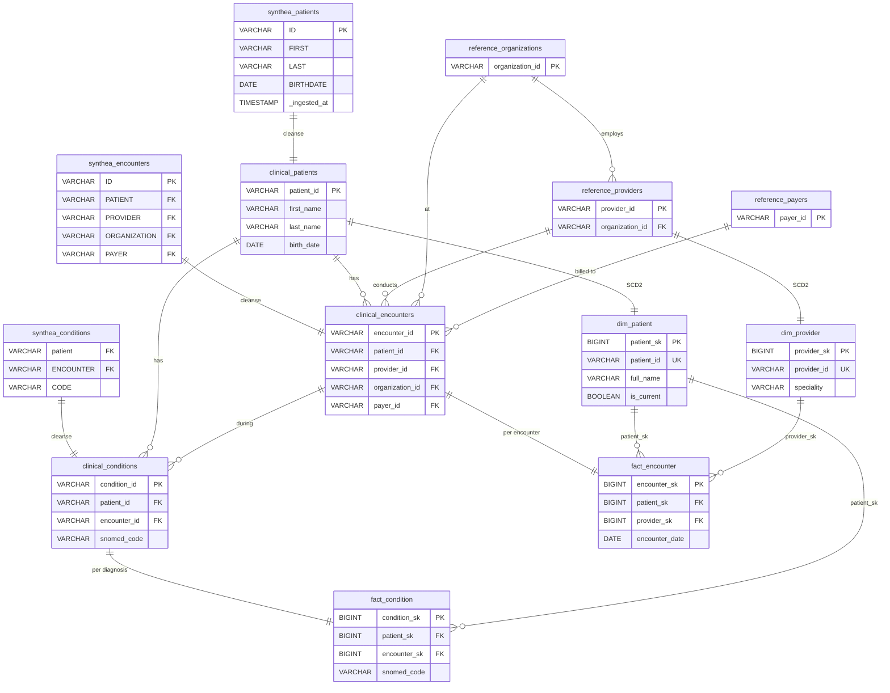
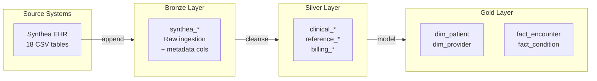

# Data Model Specification: Patient 360 Dimensional Model

| Field | Value |
|-------|-------|
| **Version** | 2.0 |
| **Created** | 2026-03-16 |
| **Last Modified** | 2026-03-16 |
| **Author** | Data Modeler Agent |
| **Status** | Draft |
| **HLD Reference** | HLD-2026-03-16-patient-360-pipeline.md |
| **DRD Reference** | DRD-2026-02-10-patient-360.md |

---

## 1. Design Overview

### 1.1 Modeling Approach

This DMS implements a **Medallion Architecture** dimensional
model for the Patient 360 use case, translating the HLD
into concrete, build-ready schemas:

- **Bronze**: Source-aligned ingestion of all 18 Synthea
  tables with pipeline metadata. No transforms; raw data
  preserved for audit and reprocessing.
- **Silver**: Canonical business entities with standardized
  naming, type conversions, and PHI exclusions.
- **Gold**: Star schema with SCD Type 2 patient dimensions,
  encounter-grain facts, and readmission scoring.

### 1.2 Layer Summary

| Layer | Purpose | Tables | Key Characteristics |
|-------|---------|--------|---------------------|
| Bronze | Raw ingestion | 18 | Source-aligned, `_ingested_date` |
| Silver | Cleansed entities | 12 | PK/FK enforced, PHI dropped |
| Gold | Dimensional model | 8 | SCD Type 2, surrogate keys |

### 1.3 HLD Traceability

This DMS implements the specifications defined in
HLD-2026-03-16-patient-360-pipeline.md.

| DMS Section | HLD Section | Notes |
|-------------|-------------|-------|
| Bronze Layer | HLD §3 | Source-aligned with metadata |
| Silver Layer | HLD §3 | Cleansing, business rules |
| Gold Layer | HLD §3 | Dimensional model with SCD |
| Naming | HLD §3 | Enterprise naming standards |
| SCD Strategy | HLD §3 | Per-attribute SCD types |
| Physical Design | HLD §4 | Delta Lake, partitioning |

### 1.4 Holistic Entity Relationship Diagram



### 1.5 Layer Architecture



### 1.6 Scope & Boundaries

This DMS defines **table schemas, column types, keys,
source mappings, and business rules**. Out of scope:

| Concern | Owned By | Document |
|---------|----------|----------|
| Transform expressions | Mapping Engineer | **STM** |
| Null handling/defaults | DQ Engineer | **DQS** |
| Storage format/codec | Platform Engineer | **LLD** |
| Retention policies | Platform Engineer | **LLD** |

---

## 2. Bronze Layer Schemas

### synthea_patients (Bronze)

Source-aligned patient demographics. All 26 source columns
preserved plus 4 metadata columns.

**Source**: synthea.patients [HLD §3]

```yaml
table: synthea_patients
layer: bronze
schema: bronze
source_table: synthea.patients
partition_by: _ingested_date
write_strategy: append
columns:
  - {name: ID, type: VARCHAR, nullable: false,
     source: synthea.patients.ID,
     description: "Patient UUID"}
  - {name: BIRTHDATE, type: VARCHAR, nullable: false,
     source: synthea.patients.BIRTHDATE,
     description: "DOB string (YYYY-MM-DD)"}
  - {name: FIRST, type: VARCHAR, nullable: false,
     source: synthea.patients.FIRST,
     description: "First name -- PHI"}
  - {name: LAST, type: VARCHAR, nullable: false,
     source: synthea.patients.LAST,
     description: "Last name -- PHI"}
  - {name: GENDER, type: VARCHAR, nullable: false,
     source: synthea.patients.GENDER,
     description: "Gender (M, F)"}
  # --- 21 additional source columns omitted ---
  # DEATHDATE, SSN, DRIVERS, PASSPORT, PREFIX,
  # SUFFIX, MAIDEN, MARITAL, RACE, ETHNICITY,
  # BIRTHPLACE, ADDRESS, CITY, STATE, COUNTY,
  # FIPS, ZIP, LAT, LON,
  # HEALTHCARE_EXPENSES, HEALTHCARE_COVERAGE
  # --- Pipeline metadata ---
  - {name: _ingested_at, type: TIMESTAMP,
     nullable: false, source: system,
     description: "Pipeline ingestion timestamp"}
  - {name: _source_batch_id, type: VARCHAR,
     nullable: false, source: system,
     description: "Pipeline run identifier"}
  - {name: _source_file, type: VARCHAR,
     nullable: true, source: system,
     description: "Source file path"}
  - {name: _record_hash, type: VARCHAR,
     nullable: false, source: system,
     description: "SHA-256 hash for change detection"}
```

### Bronze Schema Summary

All 18 source tables follow the same pattern: source
columns as VARCHAR plus 4 metadata columns.

| Bronze Table | Source | Cols | partition_by |
|-------------|--------|------|--------------|
| synthea_patients | synthea.patients | 30 | _ingested_date |
| synthea_encounters | synthea.encounters | 18 | _ingested_date |
| synthea_conditions | synthea.conditions | 10 | _ingested_date |
| synthea_medications | synthea.medications | 17 | _ingested_date |
| synthea_observations | synthea.observations | 12 | _ingested_date |
| synthea_allergies | synthea.allergies | 12 | _ingested_date |
| synthea_immunizations | synthea.immunizations | 12 | _ingested_date |
| synthea_procedures | synthea.procedures | 12 | _ingested_date |
| synthea_claims | synthea.claims | 24 | _ingested_date |
| synthea_careplans | synthea.careplans | 12 | _ingested_date |
| synthea_organizations | synthea.organizations | 12 | _ingested_date |
| synthea_providers | synthea.providers | 12 | _ingested_date |
| synthea_payers | synthea.payers | 16 | _ingested_date |
| synthea_devices | synthea.devices | 10 | _ingested_date |
| synthea_supplies | synthea.supplies | 8 | _ingested_date |
| synthea_imaging_studies | synthea.imaging_studies | 12 | _ingested_date |
| synthea_payer_transitions | synthea.payer_transitions | 10 | _ingested_date |
| synthea_claims_transactions | synthea.claims_transactions | 14 | _ingested_date |

---

## 3. Silver Layer Schemas

### clinical_patients (Silver)

Canonical patient entity. PHI columns SSN, DRIVERS, and
PASSPORT excluded per governance policy.

**Business Purpose**: Single source of truth for patient
demographics [HLD §3]

```yaml
table: clinical_patients
layer: silver
schema: clinical
primary_key: patient_id
partition_by: _ingested_date
columns:
  - {name: patient_id, type: VARCHAR, nullable: false,
     source: bronze.synthea_patients.ID,
     business_rule: BR-CORE-001,
     description: "Natural patient key"}
  - {name: first_name, type: VARCHAR, nullable: false,
     source: bronze.synthea_patients.FIRST,
     business_rule: BR-PAT-001,
     description: "First name (proper case) -- PHI"}
  - {name: last_name, type: VARCHAR, nullable: false,
     source: bronze.synthea_patients.LAST,
     business_rule: BR-PAT-001,
     description: "Last name (proper case) -- PHI"}
  - {name: birth_date, type: DATE, nullable: false,
     source: bronze.synthea_patients.BIRTHDATE,
     business_rule: BR-PAT-002,
     description: "Date of birth"}
  - {name: death_date, type: DATE, nullable: true,
     source: bronze.synthea_patients.DEATHDATE,
     business_rule: BR-PAT-003,
     description: "Date of death, null if alive"}
  - {name: gender, type: "VARCHAR(10)", nullable: false,
     source: bronze.synthea_patients.GENDER,
     business_rule: BR-PAT-004,
     description: "MALE, FEMALE, UNKNOWN"}
  - {name: race, type: "VARCHAR(50)", nullable: true,
     source: bronze.synthea_patients.RACE,
     description: "Race classification"}
  - {name: marital_status, type: "VARCHAR(20)",
     nullable: true,
     source: bronze.synthea_patients.MARITAL,
     description: "MARRIED, SINGLE, etc."}
  - {name: city, type: VARCHAR, nullable: true,
     source: bronze.synthea_patients.CITY,
     description: "City of residence"}
  - {name: state, type: "VARCHAR(2)", nullable: true,
     source: bronze.synthea_patients.STATE,
     description: "State code (two-letter)"}
  - {name: zip, type: "VARCHAR(10)", nullable: true,
     source: bronze.synthea_patients.ZIP,
     description: "ZIP code -- PHI"}
  - {name: healthcare_expenses, type: "DECIMAL(12,2)",
     nullable: true,
     source: bronze.synthea_patients.HEALTHCARE_EXPENSES,
     business_rule: BR-FIN-001,
     description: "Lifetime healthcare expenses"}
  # --- 9 additional columns omitted ---
  # name_prefix, name_suffix, maiden_name, ethnicity,
  # address, county, healthcare_coverage,
  # patient_age (derived), is_deceased (derived)
foreign_keys:
  - column: ~
    references: ~
```

### clinical_encounters (Silver)

Canonical encounter entity. One row per patient-provider
interaction with standardized class and typed costs.

**Business Purpose**: Foundation for encounter analytics,
readmission scoring [HLD §3]

```yaml
table: clinical_encounters
layer: silver
schema: clinical
primary_key: encounter_id
partition_by: encounter_date
columns:
  - {name: encounter_id, type: VARCHAR, nullable: false,
     source: bronze.synthea_encounters.ID,
     business_rule: BR-CORE-001,
     description: "Unique encounter identifier"}
  - {name: patient_id, type: VARCHAR, nullable: false,
     source: bronze.synthea_encounters.PATIENT,
     business_rule: BR-CORE-002,
     description: "FK to clinical_patients"}
  - {name: provider_id, type: VARCHAR, nullable: true,
     source: bronze.synthea_encounters.PROVIDER,
     description: "FK to reference_providers"}
  - {name: organization_id, type: VARCHAR,
     nullable: true,
     source: bronze.synthea_encounters.ORGANIZATION,
     description: "FK to reference_organizations"}
  - {name: payer_id, type: VARCHAR, nullable: true,
     source: bronze.synthea_encounters.PAYER,
     description: "FK to reference_payers"}
  - {name: start_date, type: TIMESTAMP, nullable: false,
     source: bronze.synthea_encounters.START,
     business_rule: BR-ENC-001,
     description: "Encounter start timestamp"}
  - {name: stop_date, type: TIMESTAMP, nullable: true,
     source: bronze.synthea_encounters.STOP,
     business_rule: BR-ENC-002,
     description: "End timestamp, null if active"}
  - {name: encounter_date, type: DATE, nullable: false,
     source: derived,
     description: "Date of start_date (partition)"}
  - {name: encounter_class, type: "VARCHAR(20)",
     nullable: false,
     source: bronze.synthea_encounters.ENCOUNTERCLASS,
     business_rule: BR-ENC-003,
     description: "INPATIENT, OUTPATIENT, etc."}
  - {name: encounter_duration_hours,
     type: "DECIMAL(10,2)", nullable: true,
     source: derived, business_rule: BR-ENC-004,
     description: "Duration in hours"}
  - {name: snomed_code, type: "VARCHAR(20)",
     nullable: true,
     source: bronze.synthea_encounters.CODE,
     description: "SNOMED-CT reason code"}
  - {name: encounter_description, type: VARCHAR,
     nullable: true,
     source: bronze.synthea_encounters.DESCRIPTION,
     description: "Encounter description"}
  - {name: base_encounter_cost, type: "DECIMAL(12,2)",
     nullable: true,
     source: bronze.synthea_encounters.BASE_ENCOUNTER_COST,
     business_rule: BR-FIN-003,
     description: "Base cost"}
  - {name: total_claim_cost, type: "DECIMAL(12,2)",
     nullable: true,
     source: bronze.synthea_encounters.TOTAL_CLAIM_COST,
     business_rule: BR-FIN-004,
     description: "Total claimed cost"}
  - {name: payer_coverage, type: "DECIMAL(12,2)",
     nullable: true,
     source: bronze.synthea_encounters.PAYER_COVERAGE,
     business_rule: BR-FIN-005,
     description: "Amount covered by payer"}
  - {name: reason_code, type: "VARCHAR(20)",
     nullable: true,
     source: bronze.synthea_encounters.REASONCODE,
     description: "SNOMED-CT encounter reason"}
foreign_keys:
  - column: patient_id
    references: clinical_patients.patient_id
  - column: provider_id
    references: reference_providers.provider_id
  - column: organization_id
    references: reference_organizations.organization_id
  - column: payer_id
    references: reference_payers.payer_id
```

### clinical_conditions (Silver)

Canonical condition/diagnosis entity. One row per
diagnosed condition at an encounter.

**Business Purpose**: Condition-based search, comorbidity
analysis [HLD §3]

```yaml
table: clinical_conditions
layer: silver
schema: clinical
primary_key: condition_id
partition_by: onset_date
columns:
  - {name: condition_id, type: VARCHAR, nullable: false,
     source: derived, business_rule: BR-CORE-001,
     description: "Synthetic ID (composite hash)"}
  - {name: patient_id, type: VARCHAR, nullable: false,
     source: bronze.synthea_conditions.PATIENT,
     business_rule: BR-CORE-002,
     description: "FK to clinical_patients"}
  - {name: encounter_id, type: VARCHAR, nullable: false,
     source: bronze.synthea_conditions.ENCOUNTER,
     business_rule: BR-CORE-002,
     description: "FK to clinical_encounters"}
  - {name: onset_date, type: DATE, nullable: false,
     source: bronze.synthea_conditions.START,
     business_rule: BR-COND-001,
     description: "Condition onset date"}
  - {name: resolution_date, type: DATE, nullable: true,
     source: bronze.synthea_conditions.STOP,
     business_rule: BR-COND-002,
     description: "Resolution date, null if active"}
  - {name: snomed_code, type: "VARCHAR(20)",
     nullable: false,
     source: bronze.synthea_conditions.CODE,
     business_rule: BR-COND-003,
     description: "SNOMED-CT condition code"}
  - {name: condition_description, type: VARCHAR,
     nullable: true,
     source: bronze.synthea_conditions.DESCRIPTION,
     description: "Condition description"}
  - {name: condition_status, type: "VARCHAR(10)",
     nullable: false, source: derived,
     business_rule: BR-COND-004,
     description: "ACTIVE or RESOLVED"}
  - {name: condition_duration_days, type: INTEGER,
     nullable: true, source: derived,
     description: "Duration in days, null if ongoing"}
foreign_keys:
  - column: patient_id
    references: clinical_patients.patient_id
  - column: encounter_id
    references: clinical_encounters.encounter_id
```

---

## 4. Gold Layer Schemas

### dim_patient (Gold)

SCD Type 2 patient dimension. Tracks changes to address
and marital status for point-in-time analytics.

**Consumer**: Patient 360 search, readmission scoring,
care coordination [DRD §4]

```yaml
table: dim_patient
layer: gold
schema: analytics
grain: one row per patient per version (SCD Type 2)
scd_type: 2
surrogate_key: patient_sk
effective_from: effective_from
effective_to: effective_to
is_current: is_current
columns:
  - {name: patient_sk, type: BIGINT, nullable: false,
     description: "Surrogate key (auto-generated)"}
  - {name: patient_id, type: VARCHAR, nullable: false,
     description: "Natural key from source"}
  - {name: first_name, type: VARCHAR, nullable: false,
     description: "First name -- PHI", scd_type: 1}
  - {name: last_name, type: VARCHAR, nullable: false,
     description: "Last name -- PHI", scd_type: 1}
  - {name: full_name, type: VARCHAR, nullable: false,
     description: "Derived: first + ' ' + last"}
  - {name: birth_date, type: DATE, nullable: false,
     description: "Date of birth", scd_type: 1}
  - {name: death_date, type: DATE, nullable: true,
     description: "Death date, null if alive",
     scd_type: 1}
  - {name: gender, type: "VARCHAR(10)", nullable: false,
     description: "MALE, FEMALE, UNKNOWN", scd_type: 1}
  - {name: race, type: "VARCHAR(50)", nullable: true,
     description: "Race classification", scd_type: 1}
  - {name: ethnicity, type: "VARCHAR(50)",
     nullable: true,
     description: "Ethnicity", scd_type: 1}
  - {name: marital_status, type: "VARCHAR(20)",
     nullable: true,
     description: "Tracked historically", scd_type: 2}
  - {name: address, type: VARCHAR, nullable: true,
     description: "Street -- tracked", scd_type: 2}
  - {name: city, type: VARCHAR, nullable: true,
     description: "City -- tracked", scd_type: 2}
  - {name: state, type: "VARCHAR(2)", nullable: true,
     description: "State -- tracked", scd_type: 2}
  - {name: zip, type: "VARCHAR(10)", nullable: true,
     description: "ZIP -- tracked", scd_type: 2}
  - {name: patient_age, type: INTEGER, nullable: true,
     description: "Age (or age at death)", scd_type: 1}
  - {name: is_deceased, type: BOOLEAN, nullable: false,
     description: "Deceased flag", scd_type: 1}
  - {name: effective_from, type: DATE, nullable: false,
     description: "SCD2 version start"}
  - {name: effective_to, type: DATE, nullable: false,
     description: "SCD2 version end"}
  - {name: is_current, type: BOOLEAN, nullable: false,
     description: "TRUE for active version"}
foreign_keys: []
```

### dim_provider (Gold)

SCD Type 1 provider dimension. Historical state not
analytically useful for Patient 360.

**Consumer**: Provider lookup, encounter analysis [DRD §4]

```yaml
table: dim_provider
layer: gold
schema: analytics
grain: one row per provider
scd_type: 1
surrogate_key: provider_sk
columns:
  - {name: provider_sk, type: BIGINT, nullable: false,
     description: "Surrogate key (auto-generated)"}
  - {name: provider_id, type: VARCHAR, nullable: false,
     description: "Natural key from source"}
  - {name: provider_name, type: VARCHAR, nullable: true,
     description: "Provider full name"}
  - {name: gender, type: "VARCHAR(10)", nullable: true,
     description: "Provider gender"}
  - {name: speciality, type: "VARCHAR(100)",
     nullable: true,
     description: "Medical speciality", scd_type: 1}
  - {name: organization_id, type: VARCHAR,
     nullable: true,
     description: "Associated organization key"}
  - {name: address, type: VARCHAR, nullable: true,
     description: "Practice address"}
  - {name: city, type: VARCHAR, nullable: true,
     description: "Practice city"}
  - {name: state, type: "VARCHAR(2)", nullable: true,
     description: "Practice state"}
  - {name: zip, type: "VARCHAR(10)", nullable: true,
     description: "Practice ZIP"}
foreign_keys: []
```

### fact_encounter (Gold)

Encounter fact at individual encounter grain. Links to
patient and provider dimensions.

**Consumer**: Readmission scoring, cost analysis [DRD §6]

```yaml
table: fact_encounter
layer: gold
schema: analytics
grain: one row per encounter
columns:
  - {name: encounter_sk, type: BIGINT, nullable: false,
     description: "Surrogate key"}
  - {name: encounter_id, type: VARCHAR, nullable: false,
     description: "Natural key (degenerate)"}
  - {name: patient_sk, type: BIGINT, nullable: false,
     description: "FK to dim_patient (point-in-time)"}
  - {name: provider_sk, type: BIGINT, nullable: true,
     description: "FK to dim_provider"}
  - {name: encounter_date, type: DATE, nullable: false,
     description: "Date of encounter"}
  - {name: start_date, type: TIMESTAMP, nullable: false,
     description: "Start timestamp"}
  - {name: stop_date, type: TIMESTAMP, nullable: true,
     description: "End timestamp, null if active"}
  - {name: encounter_class, type: "VARCHAR(20)",
     nullable: false,
     description: "INPATIENT, OUTPATIENT, etc."}
  - {name: encounter_duration_hours,
     type: "DECIMAL(10,2)", nullable: true,
     description: "Duration in hours"}
  - {name: los_days, type: INTEGER, nullable: true,
     description: "Length of stay (inpatient)"}
  - {name: base_encounter_cost, type: "DECIMAL(12,2)",
     nullable: true, description: "Base cost"}
  - {name: total_claim_cost, type: "DECIMAL(12,2)",
     nullable: true, description: "Total claimed cost"}
  - {name: payer_coverage, type: "DECIMAL(12,2)",
     nullable: true, description: "Payer coverage"}
  - {name: patient_out_of_pocket,
     type: "DECIMAL(12,2)", nullable: true,
     description: "Derived: claim minus coverage"}
  - {name: is_readmission, type: BOOLEAN,
     nullable: false,
     description: "Derived: inpatient within 30d"}
  - {name: days_since_last_discharge, type: INTEGER,
     nullable: true,
     description: "Derived: days since prior discharge"}
  - {name: snomed_code, type: "VARCHAR(20)",
     nullable: true, description: "SNOMED-CT reason"}
  - {name: encounter_description, type: VARCHAR,
     nullable: true, description: "Description"}
foreign_keys:
  - column: patient_sk
    references: dim_patient.patient_sk
  - column: provider_sk
    references: dim_provider.provider_sk
```

### fact_condition (Gold)

Condition fact at patient-condition grain. Supports
comorbidity analysis and care gap identification.

**Consumer**: Condition history, comorbidity [DRD §5]

```yaml
table: fact_condition
layer: gold
schema: analytics
grain: one row per patient-condition diagnosis
columns:
  - {name: condition_sk, type: BIGINT, nullable: false,
     description: "Surrogate key"}
  - {name: patient_sk, type: BIGINT, nullable: false,
     description: "FK to dim_patient (point-in-time)"}
  - {name: encounter_sk, type: BIGINT, nullable: false,
     description: "FK to fact_encounter"}
  - {name: onset_date, type: DATE, nullable: false,
     description: "Condition onset date"}
  - {name: resolution_date, type: DATE, nullable: true,
     description: "Resolution, null if active"}
  - {name: snomed_code, type: "VARCHAR(20)",
     nullable: false,
     description: "SNOMED-CT condition code"}
  - {name: condition_description, type: VARCHAR,
     nullable: true, description: "Description"}
  - {name: condition_status, type: "VARCHAR(10)",
     nullable: false,
     description: "ACTIVE or RESOLVED"}
  - {name: condition_duration_days, type: INTEGER,
     nullable: true,
     description: "Days, null if ongoing"}
foreign_keys:
  - column: patient_sk
    references: dim_patient.patient_sk
  - column: encounter_sk
    references: fact_encounter.encounter_sk
```

---

## 5. Naming Conventions

### Table Naming

| Layer | Convention | Example |
|-------|-----------|---------|
| Bronze | `synthea_{source}` | `synthea_patients` |
| Silver | `{domain}_{entity}` | `clinical_patients` |
| Gold Dim | `dim_{entity}` | `dim_patient` |
| Gold Fact | `fact_{event}` | `fact_encounter` |
| Gold Agg | `agg_{scope}` | `agg_readmission_30d` |

### Column Naming

| Rule | Example |
|------|---------|
| Natural keys: `{entity}_id` | `patient_id` |
| Surrogate keys: `{entity}_sk` | `patient_sk` |
| Timestamps: `{event}_at` | `_ingested_at` |
| Dates: `{event}_date` | `birth_date` |
| Booleans: `is_` / `has_` prefix | `is_readmission` |
| Amounts: `{what}_cost` | `total_claim_cost` |
| Durations: `{what}_{unit}` | `los_days` |
| Codes: `{system}_code` | `snomed_code` |
| All: `snake_case`, no abbrevs | `condition_description` |

### Schema Organization

| Schema | Contents |
|--------|----------|
| `bronze` | Source-aligned raw tables |
| `clinical` | Silver clinical entities |
| `billing` | Silver financial entities |
| `reference` | Silver reference/lookup entities |
| `analytics` | Gold dimensional model |

---

## 6. SCD Strategy

### Dimension Attribute SCD Types

| Dimension | Attribute | SCD | Rationale |
|-----------|-----------|-----|-----------|
| dim_patient | first_name | 1 | Corrections only |
| dim_patient | last_name | 1 | Corrections only |
| dim_patient | birth_date | 1 | Corrections only |
| dim_patient | gender | 1 | Per governance policy |
| dim_patient | race | 1 | Corrections only |
| dim_patient | marital_status | 2 | Historically relevant |
| dim_patient | address | 2 | Geographic analytics |
| dim_patient | city | 2 | Tracked with address |
| dim_patient | state | 2 | Tracked with address |
| dim_patient | zip | 2 | Tracked with address |
| dim_patient | is_deceased | 1 | One-way state change |
| dim_provider | speciality | 1 | Rare, no history |
| dim_provider | address | 1 | No history needed |

### SCD Implementation Notes

- SCD Type 2 uses Delta Lake MERGE INTO with hash
  comparison on tracked columns
- `effective_from` = date change detected by pipeline
- `effective_to` = `9999-12-31` for current rows
- `is_current` = TRUE for latest version only
- Fact tables join via surrogate key current at event
  time (`effective_from <= date <= effective_to`)

---

## 7. Physical Design Notes

### Partition Strategy

| Table | Partition Column | Rationale |
|-------|-----------------|-----------|
| All bronze | `_ingested_date` | Incremental by load date |
| clinical_encounters | `encounter_date` | Partition pruning |
| clinical_conditions | `onset_date` | Onset date filters |
| fact_encounter | `encounter_date` | Analytical queries |
| dim_patient | None | Small table |

### Clustering / Sort Keys

| Table | Cluster Columns | Rationale |
|-------|----------------|-----------|
| clinical_patients | `patient_id` | Primary lookup |
| clinical_encounters | `patient_id, encounter_date` | Patient+date |
| fact_encounter | `patient_sk, encounter_date` | Readmission |
| dim_patient | `patient_id, is_current` | Current lookup |

> Storage format, compression codec, and retention
> policies are defined in the **Low-Level Design (LLD)**
> document.

---

## 8. Traceability Matrix

### 8.1 Table-Level Lineage

| Gold Table | Silver Source | Bronze Source | Key Decisions |
|------------|--------------|--------------|---------------|
| dim_patient | clinical_patients | synthea_patients | SCD2 address+marital; PHI dropped |
| dim_provider | reference_providers | synthea_providers | SCD1; no history needed |
| fact_encounter | clinical_encounters | synthea_encounters | Readmission 30-day flag |
| fact_condition | clinical_conditions | synthea_conditions | Hash key; derived status |

### 8.2 Downstream Document References

- **STM**: Column-level transform expressions for
  every Bronze-to-Silver and Silver-to-Gold mapping.
- **DQS**: Null handling, defaults, rejection
  thresholds, DQ gate rules per layer boundary.
- **LLD**: Storage format, codec, VACUUM schedules,
  retention, Spark configs, deployment runbooks.

---

## 9. Version History

| Version | Date | Author | Changes |
|---------|------|--------|---------|
| 1.0 | 2026-03-16 | Data Modeler Agent | Initial DMS |
| 2.0 | 2026-03-16 | Data Modeler Agent | Remove transforms/null handling |

---

## 10. Open Questions

| # | Question | Owner | Due | Status |
|---|----------|-------|-----|--------|
| 1 | Meds/allergies: separate facts or dim? | Modeler | 03-23 | Open |
| 2 | SCD2 address detection: weekly or daily? | Engineer | 03-20 | Open |
| 3 | Observations: separate fact or merge? | Clinical | 03-25 | Open |

---

## 11. Approval

| Role | Name | Date | Signature |
|------|------|------|-----------|
| Data Modeler | | | |
| Data Architect | | | |
| Tech Lead | | | |
| Product Owner | | | |
