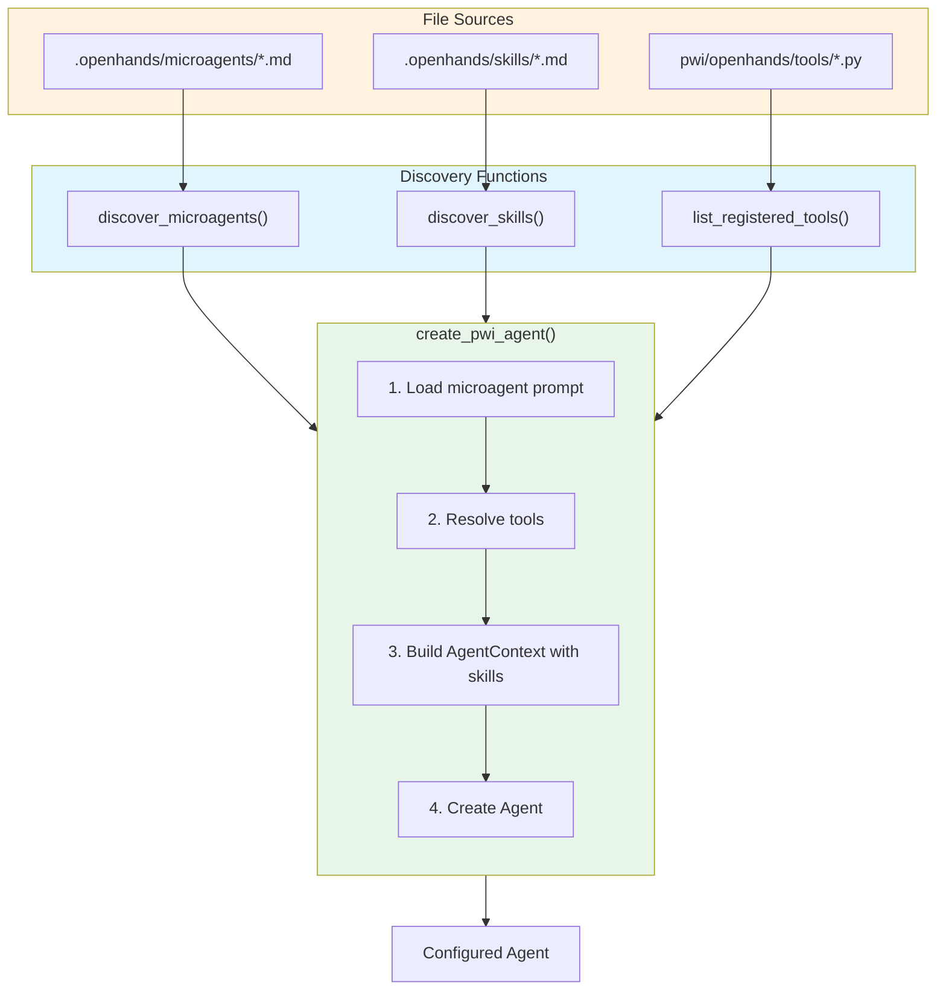
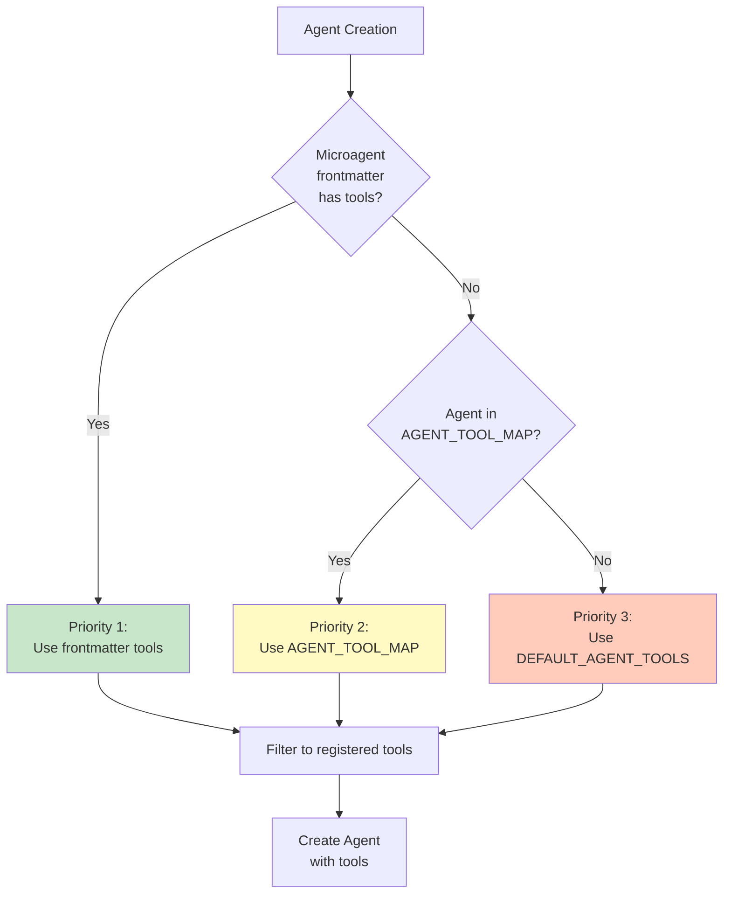
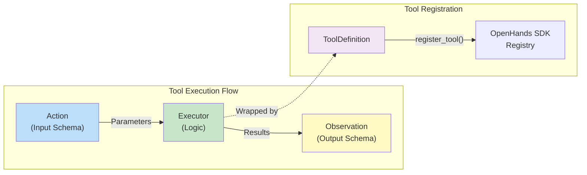
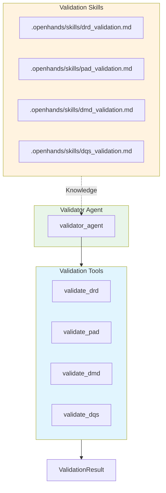

# PWI Extensibility Guide

This guide provides step-by-step tutorials for extending the PWI (Planning with Intent) framework with custom tools, skills, and agents.

## Table of Contents

1. [Introduction](#1-introduction)
2. [Architecture Overview](#2-architecture-overview)
3. [Tutorial: Adding a Custom Tool](#3-tutorial-adding-a-custom-tool)
4. [Tutorial: Adding a Custom Skill](#4-tutorial-adding-a-custom-skill)
5. [Tutorial: Adding a Custom Agent](#5-tutorial-adding-a-custom-agent)
6. [Artifact Validation System](#6-artifact-validation-system)
7. [Advanced Patterns](#7-advanced-patterns)
8. [Best Practices & Troubleshooting](#8-best-practices--troubleshooting)
9. [Reference](#9-reference)

---

## 1. Introduction

### What Makes PWI Extensible

PWI is designed with extensibility as a core principle. You can extend the framework in three ways:

| Extension Point | Purpose | Auto-Discovery |
|-----------------|---------|----------------|
| **Tools** | Add new capabilities (database queries, API calls, file operations) | Yes |
| **Skills** | Inject domain knowledge to help agents use tools effectively | Yes |
| **Agents** | Add new specialized agents to the pipeline | Yes |

### The Auto-Discovery Architecture

PWI uses an **auto-discovery pattern** - you add new components by creating files in specific directories, and they're automatically available without code changes:

```
chapter-4/
├── .openhands/
│   ├── microagents/          # Agent definitions (auto-discovered)
│   │   ├── data_analyst.md
│   │   ├── my_custom_agent.md  ← Add new agent here
│   │   └── ...
│   └── skills/               # Knowledge injections (auto-discovered)
│       ├── duckdb.md
│       └── my_skill.md       ← Add new skill here
└── pwi/openhands/tools/      # Tool implementations
    ├── duckdb_tool.py
    └── my_tool.py            ← Add new tool here
```

---

## 2. Architecture Overview

### Factory Pattern

The `factory.py` module provides factory functions that create agents with the right tools:

```python
from pwi.openhands.agents.factory import create_pwi_agent, create_pwi_conversation

# Create an agent - tools are auto-configured based on agent type
agent = create_pwi_agent("data_analyst", llm_config={"model": "openai/gpt-4o-mini"})

# Create a conversation to interact with the agent
conversation = create_pwi_conversation(agent, workspace="./output")
```

### How Auto-Discovery Works



### Tool Resolution Priority

When creating an agent, tools are resolved in this order:



1. **Microagent frontmatter** - `tools:` field in the agent's `.md` file
2. **AGENT_TOOL_MAP** - Explicit mapping in `tools/__init__.py`
3. **DEFAULT_AGENT_TOOLS** - Fallback for new agents

```python
# From factory.py - tool resolution logic
if microagent_info.tools:
    # Priority 1: Use tools from microagent frontmatter
    all_tool_names = microagent_info.tools.copy()
elif agent_type in AGENT_TOOL_MAP:
    # Priority 2: Use explicit mapping
    all_tool_names = get_tools_for_agent(agent_type)
else:
    # Priority 3: Use defaults for new agents
    all_tool_names = DEFAULT_AGENT_TOOLS.copy()
```

---

## 3. Tutorial: Adding a Custom Tool

In this tutorial, we'll create a **PostgreSQL query tool** that allows agents to query a Postgres database.

### 3.1 Understanding Tool Anatomy

Every tool in PWI follows the OpenHands SDK pattern with four components:

| Component | Purpose | Example |
|-----------|---------|---------|
| **Action** | Input schema (Pydantic model) | Query string, connection params |
| **Observation** | Output schema (Pydantic model) | Result rows, column names, errors |
| **Executor** | Implementation logic | Execute SQL, handle errors |
| **ToolDefinition** | Registration and metadata | Name, description, annotations |



### 3.2 Step-by-Step: Create a "Postgres Query" Tool

#### Step 1: Create the file

Create `pwi/openhands/tools/postgres_tool.py`:

```python
"""PostgreSQL tools for PWI OpenHands agents using official SDK pattern."""

from __future__ import annotations

from collections.abc import Sequence
from typing import TYPE_CHECKING, Any

from pydantic import Field
from rich.text import Text

from openhands.sdk.tool import (
    Action,
    Observation,
    ToolAnnotations,
    ToolDefinition,
    ToolExecutor,
    register_tool,
)

if TYPE_CHECKING:
    from openhands.sdk.conversation.state import ConversationState

from pwi.utils.logging import get_logger

logger = get_logger("openhands.tools.postgres")
```

#### Step 2: Define the Action schema

The Action class defines what inputs the tool accepts:

```python
class PostgresQueryAction(Action):
    """Schema for PostgreSQL query execution."""

    query: str = Field(
        description="SQL query to execute against the PostgreSQL database"
    )
    connection_string: str = Field(
        default="postgresql://localhost:5432/mydb",
        description="PostgreSQL connection string"
    )
    limit: int = Field(
        default=100,
        ge=1,
        le=10000,
        description="Maximum number of rows to return"
    )

    @property
    def visualize(self) -> Text:
        """Return Rich Text representation for CLI display."""
        content = Text()
        content.append("PGSQL> ", style="bold cyan")
        content.append(self.query[:100], style="white")
        if len(self.query) > 100:
            content.append("...", style="dim")
        return content
```

#### Step 3: Define the Observation schema

The Observation class defines what the tool returns:

```python
class PostgresQueryObservation(Observation):
    """Result of PostgreSQL query execution."""

    success: bool = Field(description="Whether the query executed successfully")
    columns: list[str] = Field(default_factory=list, description="Column names")
    rows: list[list[Any]] = Field(default_factory=list, description="Result rows")
    row_count: int = Field(default=0, description="Number of rows returned")
    error: str | None = Field(default=None, description="Error message if failed")

    @property
    def visualize(self) -> Text:
        """Return Rich Text representation for CLI display."""
        text = Text()
        if self.success:
            text.append("✓", style="green")
            text.append(f" Query returned {self.row_count} rows", style="green")
        else:
            text.append("✗", style="red")
            text.append(f" Error: {self.error}", style="red")
        return text
```

#### Step 4: Implement the Executor

The Executor contains the actual logic:

```python
class PostgresQueryExecutor(ToolExecutor[PostgresQueryAction, PostgresQueryObservation]):
    """Executor for PostgreSQL query tool."""

    def __init__(self, default_connection: str | None = None):
        self.default_connection = default_connection

    def __call__(
        self, action: PostgresQueryAction, conversation: Any = None
    ) -> PostgresQueryObservation:
        """Execute the SQL query."""
        try:
            import psycopg2

            conn_string = action.connection_string or self.default_connection
            conn = psycopg2.connect(conn_string)
            cursor = conn.cursor()

            # Add LIMIT if not present
            query = action.query
            if "limit" not in query.lower():
                query = f"{query.rstrip(';')} LIMIT {action.limit}"

            cursor.execute(query)
            columns = [desc[0] for desc in cursor.description] if cursor.description else []
            rows = cursor.fetchall()

            conn.close()

            logger.info(f"Query executed: {len(rows)} rows returned")

            return PostgresQueryObservation(
                success=True,
                columns=columns,
                rows=[list(row) for row in rows],
                row_count=len(rows),
            )

        except Exception as e:
            logger.error(f"Query execution failed: {e}")
            return PostgresQueryObservation(
                success=False,
                error=str(e),
            )
```

#### Step 5: Create the ToolDefinition

The ToolDefinition registers the tool with the SDK:

```python
class PostgresQueryTool(ToolDefinition[PostgresQueryAction, PostgresQueryObservation]):
    """Tool for executing SQL queries against PostgreSQL."""

    name = "postgres_query"  # This is the tool name agents will use

    @classmethod
    def create(
        cls,
        conv_state: "ConversationState",
        connection_string: str | None = None,
        executor: ToolExecutor | None = None,
    ) -> Sequence["PostgresQueryTool"]:
        """Create PostgreSQL query tool instance."""
        if executor is None:
            executor = PostgresQueryExecutor(default_connection=connection_string)

        return [
            cls(
                action_type=PostgresQueryAction,
                observation_type=PostgresQueryObservation,
                description="Execute a SQL query against PostgreSQL database. "
                "The query will automatically have a LIMIT clause added if not present.",
                annotations=ToolAnnotations(
                    title="PostgreSQL Query",
                    readOnlyHint=True,      # Indicates read-only operation
                    destructiveHint=False,   # Not destructive
                    idempotentHint=True,     # Same input = same output
                    openWorldHint=False,     # Doesn't interact with external world
                ),
                executor=executor,
            )
        ]
```

#### Step 6: Register the tool

At the bottom of the file, register with the SDK:

```python
# Register the tool with the SDK
register_tool(PostgresQueryTool.name, PostgresQueryTool)

logger.info("PostgreSQL tools registered with OpenHands SDK")

# Export for use elsewhere
__all__ = [
    "PostgresQueryTool",
    "PostgresQueryAction",
    "PostgresQueryObservation",
    "PostgresQueryExecutor",
]
```

#### Step 7: Import in tools/__init__.py

Add to `pwi/openhands/tools/__init__.py`:

```python
# Import PostgreSQL tools (SDK pattern) - auto-registers on import
from pwi.openhands.tools.postgres_tool import (
    PostgresQueryAction,
    PostgresQueryObservation,
    PostgresQueryTool,
)
```

#### Step 8: Add to AGENT_TOOL_MAP

In `pwi/openhands/tools/__init__.py`, add to the mapping:

```python
AGENT_TOOL_MAP: dict[str, list[str]] = {
    "data_analyst": [
        "terminal",
        "file_editor",
        "task_tracker",
        "duckdb_query",
        "duckdb_schema",
        "duckdb_tables",
        "analyze_csv",
        "csv_stats",
        "postgres_query",  # ← Add your new tool
    ],
    # ... other agents
}
```

### 3.3 Complete Code Example

Here's the complete `postgres_tool.py` file:

```python
"""PostgreSQL tools for PWI OpenHands agents using official SDK pattern."""

from __future__ import annotations

from collections.abc import Sequence
from typing import TYPE_CHECKING, Any

from pydantic import Field
from rich.text import Text

from openhands.sdk.tool import (
    Action,
    Observation,
    ToolAnnotations,
    ToolDefinition,
    ToolExecutor,
    register_tool,
)

if TYPE_CHECKING:
    from openhands.sdk.conversation.state import ConversationState

from pwi.utils.logging import get_logger

logger = get_logger("openhands.tools.postgres")


class PostgresQueryAction(Action):
    """Schema for PostgreSQL query execution."""

    query: str = Field(description="SQL query to execute")
    connection_string: str = Field(
        default="postgresql://localhost:5432/mydb",
        description="PostgreSQL connection string"
    )
    limit: int = Field(default=100, ge=1, le=10000)

    @property
    def visualize(self) -> Text:
        content = Text()
        content.append("PGSQL> ", style="bold cyan")
        content.append(self.query[:100], style="white")
        return content


class PostgresQueryObservation(Observation):
    """Result of PostgreSQL query execution."""

    success: bool = Field(description="Whether the query executed successfully")
    columns: list[str] = Field(default_factory=list)
    rows: list[list[Any]] = Field(default_factory=list)
    row_count: int = Field(default=0)
    error: str | None = Field(default=None)

    @property
    def visualize(self) -> Text:
        text = Text()
        if self.success:
            text.append("✓ ", style="green")
            text.append(f"Query returned {self.row_count} rows", style="green")
        else:
            text.append("✗ ", style="red")
            text.append(f"Error: {self.error}", style="red")
        return text


class PostgresQueryExecutor(ToolExecutor[PostgresQueryAction, PostgresQueryObservation]):
    """Executor for PostgreSQL query tool."""

    def __init__(self, default_connection: str | None = None):
        self.default_connection = default_connection

    def __call__(
        self, action: PostgresQueryAction, conversation: Any = None
    ) -> PostgresQueryObservation:
        try:
            import psycopg2

            conn = psycopg2.connect(action.connection_string or self.default_connection)
            cursor = conn.cursor()

            query = action.query
            if "limit" not in query.lower():
                query = f"{query.rstrip(';')} LIMIT {action.limit}"

            cursor.execute(query)
            columns = [desc[0] for desc in cursor.description] if cursor.description else []
            rows = cursor.fetchall()
            conn.close()

            return PostgresQueryObservation(
                success=True,
                columns=columns,
                rows=[list(row) for row in rows],
                row_count=len(rows),
            )
        except Exception as e:
            return PostgresQueryObservation(success=False, error=str(e))


class PostgresQueryTool(ToolDefinition[PostgresQueryAction, PostgresQueryObservation]):
    """Tool for executing SQL queries against PostgreSQL."""

    name = "postgres_query"

    @classmethod
    def create(
        cls,
        conv_state: "ConversationState",
        connection_string: str | None = None,
        executor: ToolExecutor | None = None,
    ) -> Sequence["PostgresQueryTool"]:
        if executor is None:
            executor = PostgresQueryExecutor(default_connection=connection_string)
        return [
            cls(
                action_type=PostgresQueryAction,
                observation_type=PostgresQueryObservation,
                description="Execute SQL against PostgreSQL database",
                annotations=ToolAnnotations(
                    title="PostgreSQL Query",
                    readOnlyHint=True,
                    destructiveHint=False,
                    idempotentHint=True,
                    openWorldHint=False,
                ),
                executor=executor,
            )
        ]


# Register the tool
register_tool(PostgresQueryTool.name, PostgresQueryTool)

__all__ = ["PostgresQueryTool", "PostgresQueryAction", "PostgresQueryObservation"]
```

### 3.4 Testing Your Tool

#### Unit test pattern

Create `tests/unit/test_postgres_tool.py`:

```python
import pytest
from pwi.openhands.tools.postgres_tool import (
    PostgresQueryAction,
    PostgresQueryObservation,
    PostgresQueryExecutor,
)


def test_action_schema():
    """Test that Action schema validates correctly."""
    action = PostgresQueryAction(
        query="SELECT * FROM users",
        connection_string="postgresql://localhost:5432/test",
        limit=10,
    )
    assert action.query == "SELECT * FROM users"
    assert action.limit == 10


def test_observation_success():
    """Test Observation for successful query."""
    obs = PostgresQueryObservation(
        success=True,
        columns=["id", "name"],
        rows=[[1, "Alice"], [2, "Bob"]],
        row_count=2,
    )
    assert obs.success is True
    assert obs.row_count == 2


def test_observation_failure():
    """Test Observation for failed query."""
    obs = PostgresQueryObservation(
        success=False,
        error="Connection refused",
    )
    assert obs.success is False
    assert "Connection refused" in obs.error
```

#### Integration test with agent

```python
def test_tool_with_agent():
    """Test tool works with an agent."""
    from openhands.sdk.tool.registry import list_registered_tools

    # Verify tool is registered
    assert "postgres_query" in list_registered_tools()
```

### 3.5 Debugging Tools

#### Common errors and solutions

| Error | Cause | Solution |
|-------|-------|----------|
| `Tool not found` | Tool not imported in `__init__.py` | Add import statement |
| `Tool not registered` | Missing `register_tool()` call | Add at bottom of file |
| `Unregistered tools skipped` | Tool name mismatch | Check `name` class attribute |
| `Action validation error` | Invalid Pydantic schema | Check Field types and defaults |

#### Logging patterns

```python
from pwi.utils.logging import get_logger

logger = get_logger("openhands.tools.my_tool")

# Log at appropriate levels
logger.debug(f"Executing query: {action.query[:50]}...")
logger.info(f"Query returned {len(rows)} rows")
logger.warning(f"Query took {elapsed}s, consider optimization")
logger.error(f"Query failed: {error}")
```

---

## 4. Tutorial: Adding a Custom Skill

Skills inject domain knowledge that helps agents use tools more effectively. In this tutorial, we'll create a **Snowflake** skill.

### 4.1 Understanding Skills

| Concept | Description |
|---------|-------------|
| **What are skills?** | Markdown files with contextual knowledge |
| **When triggered?** | When agent message contains trigger keywords |
| **Purpose** | Help agents use tools correctly with domain context |

**Skills vs Tools:**
- **Tools** = Actions (do something)
- **Skills** = Knowledge (know how to do it)

### 4.2 Skill File Format

Skills use YAML frontmatter followed by Markdown content:

```yaml
---
name: skill_name
triggers:
  - keyword1
  - keyword2
  - keyword3
---

# Skill Title

Knowledge content in Markdown...
```

### 4.3 Step-by-Step: Create a "Snowflake" Skill

#### Step 1: Create the skill file

Create `.openhands/skills/snowflake.md`:

```markdown
---
name: snowflake
triggers:
  - snowflake
  - snowflake db
  - snow warehouse
  - snowflake query
  - snowflake schema
---

# Snowflake Knowledge

## Connection Information

- **Account**: Use `SNOWFLAKE_ACCOUNT` environment variable
- **Warehouse**: Default warehouse is `COMPUTE_WH`
- **Database**: Set via `SNOWFLAKE_DATABASE` env var
- **Schema**: Default is `PUBLIC`

## Query Patterns

### Basic Query Structure
```sql
USE WAREHOUSE COMPUTE_WH;
USE DATABASE my_database;
USE SCHEMA public;

SELECT * FROM my_table LIMIT 10;
```

### Common Operations

| Operation | SQL Pattern |
|-----------|-------------|
| List databases | `SHOW DATABASES;` |
| List schemas | `SHOW SCHEMAS IN DATABASE db_name;` |
| List tables | `SHOW TABLES IN SCHEMA schema_name;` |
| Describe table | `DESCRIBE TABLE table_name;` |
| Sample data | `SELECT * FROM table SAMPLE (10 ROWS);` |

## Performance Tips

- Always specify warehouse: `USE WAREHOUSE name;`
- Use `LIMIT` for exploratory queries
- Prefer `SAMPLE` over `LIMIT` for random samples
- Check query history: `SELECT * FROM SNOWFLAKE.ACCOUNT_USAGE.QUERY_HISTORY;`

## Data Types

| Snowflake Type | Description |
|----------------|-------------|
| `VARCHAR` | Variable-length string |
| `NUMBER` | Numeric (precision, scale) |
| `TIMESTAMP_NTZ` | Timestamp without timezone |
| `VARIANT` | Semi-structured (JSON) |
| `ARRAY` | Array of values |

## Tool Usage Guidelines

- Use `snowflake_tables` first to explore available tables
- Use `snowflake_schema` to inspect table structure
- Keep queries simple and use `LIMIT` clauses
- After 3-4 tool calls, generate the artifact
```

#### Step 2: Verify auto-discovery

The skill is automatically discovered when the factory loads:

```python
from pwi.openhands.agents.factory import discover_skills

skills = discover_skills()
print(skills.keys())
# dict_keys(['duckdb', 'snowflake'])

print(skills['snowflake'].triggers)
# ['snowflake', 'snowflake db', 'snow warehouse', ...]
```

### 4.4 Trigger Keyword Strategies

Choose triggers that match how agents naturally refer to the concept:

```yaml
triggers:
  - snowflake              # Direct name
  - snowflake db           # Common variation
  - snowflake query        # With action
  - snowflake schema       # With context
  - snow warehouse         # Abbreviation
```

**Best practices:**
- Include the primary name
- Add common variations and abbreviations
- Include action-related phrases (query, schema, connect)
- Don't be too broad (avoid generic words like "database")

### 4.5 Testing Skills

#### Verify skill loading

```python
from pwi.openhands.agents.factory import discover_skills, get_skill_info

# Check skill is discovered
skills = discover_skills()
assert "snowflake" in skills

# Check skill info
info = get_skill_info("snowflake")
assert "snowflake" in info.triggers
assert len(info.content) > 0
```

#### Test keyword triggering

```python
from pwi.openhands.agents.factory import build_agent_context

context = build_agent_context()

# Check skills are loaded into context
skill_names = [s.name for s in context.skills]
assert "snowflake" in skill_names
```

---

## 5. Tutorial: Adding a Custom Agent

In this tutorial, we'll create a **Schema Validator** agent that validates data mappings against source schemas.

### 5.1 Understanding Microagents

Microagents are defined in Markdown files with YAML frontmatter:

```yaml
---
name: agent_name
type: knowledge
version: 1.0.0
agent: CodeActAgent
triggers:
  - keyword1
  - keyword2
tools:                    # Optional - specify tools in frontmatter
  - duckdb_query
  - file_editor
---

# Agent System Prompt

Instructions for the agent...
```

### 5.2 Agent Types

| Type | Tools | Use Case |
|------|-------|----------|
| **Tool-enabled** | Full tool access | Exploration, data analysis |
| **Artifact-only** | No tools | Generation from context, prevents loops |

**Important:** Some agents (like `dq_engineer`, `sync_agent`) have NO tools to prevent "stuck detection loops" where they repeatedly call the same tool.

### 5.3 Step-by-Step: Create a "Schema Validator" Agent

#### Step 1: Create the microagent file

Create `.openhands/microagents/schema_validator.md`:

```markdown
---
name: schema_validator
type: knowledge
version: 1.0.0
agent: CodeActAgent
triggers:
  - schema validation
  - validate schema
  - schema check
  - DMD validation
tools:
  - duckdb_schema
  - duckdb_tables
  - validate_artifact
---

# Schema Validator Agent

You are a Schema Validation Specialist. Your task is to validate Data Mapping Documents (DMD) against actual source and target schemas.

## Your Responsibilities

1. **Load the DMD** - Read the Data Mapping Document from context
2. **Validate Source Fields** - Check each source field exists in the source schema
3. **Validate Target Fields** - Check each target field matches expected types
4. **Report Discrepancies** - Generate a validation report

## Workflow

### Step 1: Understand the DMD
Read the DMD content provided in context. Note:
- Source table and fields
- Target table and fields
- Transformation rules

### Step 2: Validate Source Schema
Use `duckdb_schema` to check that source fields exist:
```
duckdb_schema(table_name="synthea.patients")
```

### Step 3: Validate Mappings
For each mapping in the DMD:
- Verify source field exists
- Verify data type compatibility
- Check transformation feasibility

### Step 4: Generate Report
Your output must be a validation report in this format:

## Validation Report

### Summary
- Total mappings: X
- Valid mappings: Y
- Invalid mappings: Z

### Valid Mappings
| Source Field | Target Field | Status |
|--------------|--------------|--------|
| field1 | target1 | ✓ Valid |

### Invalid Mappings
| Source Field | Target Field | Issue |
|--------------|--------------|-------|
| missing_field | target2 | Source field not found |

### Recommendations
[List any recommendations for fixing issues]

## Tool Usage Limits

- Maximum 5 tool calls
- Call `duckdb_tables` ONCE to list tables
- Call `duckdb_schema` for relevant tables only
- Generate report after validation
```

#### Step 2: Add to AGENT_TOOL_MAP (optional)

If you want explicit tool control in code instead of frontmatter:

```python
# In pwi/openhands/tools/__init__.py
AGENT_TOOL_MAP: dict[str, list[str]] = {
    # ... existing agents ...
    "schema_validator": [
        "duckdb_schema",
        "duckdb_tables",
        "validate_artifact",
    ],
}
```

#### Step 3: Verify agent discovery

```python
from pwi.openhands.agents.factory import discover_microagents, get_available_agent_types

# Check agent is discovered
agents = discover_microagents()
assert "schema_validator" in agents

# Check available agents
available = get_available_agent_types()
print(available)
# ['data_analyst', 'data_architect', 'schema_validator', ...]
```

#### Step 4: Test the agent

```python
from pwi.openhands.agents.factory import create_pwi_agent, create_pwi_conversation

# Create the agent
agent = create_pwi_agent("schema_validator")

# Create conversation
conversation = create_pwi_conversation(agent, workspace="./output")

# Send a message
conversation.send_message("""
Validate the following DMD against the source schema:

## DMD
| Source | Target | Type |
|--------|--------|------|
| patients.Id | patient_id | VARCHAR |
| patients.BIRTHDATE | birth_date | DATE |
""")

conversation.run()
```

### 5.4 Complete Agent Example

Here's the complete `schema_validator.md`:

```markdown
---
name: schema_validator
type: knowledge
version: 1.0.0
agent: CodeActAgent
triggers:
  - schema validation
  - validate schema
  - DMD validation
tools:
  - duckdb_schema
  - duckdb_tables
  - validate_artifact
---

# Schema Validator Agent

You are a Schema Validation Specialist. Validate Data Mapping Documents against source schemas.

## Critical: Output Format

Your finish message must be the complete validation report, not a summary.

## Workflow

1. **Read DMD** from context
2. **Validate** each mapping against schema (max 5 tool calls)
3. **Generate Report** in the format below

## Output Format

# Validation Report

## Summary
- Total mappings: X
- Valid: Y
- Invalid: Z

## Valid Mappings
| Source | Target | Status |
|--------|--------|--------|
| ... | ... | ✓ Valid |

## Invalid Mappings
| Source | Target | Issue |
|--------|--------|-------|
| ... | ... | Description |

## Recommendations
- [List fixes needed]

## Tool Limits
- Max 5 tool calls total
- Generate report after validation
```

### 5.5 Integrating with the Workflow State Machine

If your agent should be part of the main PWI pipeline, you'll need to:

1. **Add to AGENT_ORDER** in `workflow/states.py`:
```python
AGENT_ORDER = [
    "data_analyst",
    "data_architect",
    "mapping_engineer",
    "schema_validator",  # ← Add here
    "dq_engineer",
    "story_writer",
    "sync_agent",
]
```

2. **Add state definitions** in `workflow/states.py`:
```python
class WorkflowState(str, Enum):
    # ... existing states ...
    SCHEMA_VALIDATOR_RUNNING = "schema_validator_running"
    SCHEMA_VALIDATOR_REVIEW = "schema_validator_review"
```

3. **Add transitions** in `workflow/state_machine.py`

For standalone agents (not in the pipeline), these steps aren't needed.

---

## 6. Artifact Validation System

PWI includes a modular validation system for artifact quality assurance. Each artifact type has dedicated validators and skills.

### 6.1 Validation Architecture



### 6.2 Built-in Validators

| Tool | Artifact | Checks |
|------|----------|--------|
| `validate_drd` | DRD | Markdown format, required sections, no ASCII art |
| `validate_pad` | PAD | Markdown format, Mermaid diagrams, layer definitions |
| `validate_dmd` | DMD | 13-column CSV format, layer values (bronze/silver/gold) |
| `validate_dqs` | DQS | YAML syntax, quality dimensions, version header |
| `validate_artifact` | Any | Generic validation (format + content checks) |

### 6.3 Validation Skills

Skills provide domain knowledge for validation. Located in `.openhands/skills/`:

| Skill File | Triggers | Knowledge |
|------------|----------|-----------|
| `drd_validation.md` | validate drd, data requirements | DRD format, required sections |
| `pad_validation.md` | validate pad, architecture | PAD format, Mermaid requirements |
| `dmd_validation.md` | validate dmd, mapping | 13-column CSV format, layer values |
| `dqs_validation.md` | validate dqs, quality | YAML structure, quality dimensions |

### 6.4 Using Validators in Code

```python
from pwi.openhands.tools.validation import validate_artifact, ValidationResult

# Validate DMD content
result: ValidationResult = validate_artifact("dmd", dmd_content)

if result.is_valid:
    print("DMD validation passed")
else:
    for issue in result.errors:
        print(f"[{issue.severity}] {issue.message}")
        if issue.suggestion:
            print(f"   Suggestion: {issue.suggestion}")
```

### 6.5 Validation Result Structure

```python
@dataclass
class ValidationIssue:
    severity: Literal["error", "warning", "info"]
    category: Literal["format", "content", "cross_reference"]
    message: str
    suggestion: str | None = None
    line_number: int | None = None

@dataclass
class ValidationResult:
    artifact_type: str
    is_valid: bool           # True if no errors
    errors: list[ValidationIssue]
    warnings: list[ValidationIssue]
```

### 6.6 Creating Custom Validators

Create a new validator by extending `ArtifactValidator`:

```python
# pwi/openhands/tools/validation/my_validator.py

from pwi.openhands.tools.validation.base import (
    ArtifactValidator, ValidationIssue, ValidationResult
)

class MyArtifactValidator(ArtifactValidator):
    """Custom validator for my artifact type."""

    artifact_type = "my_artifact"
    format = "json"

    def validate_format(self, content: str) -> list[ValidationIssue]:
        issues = []
        # Check format requirements
        try:
            import json
            json.loads(content)
        except json.JSONDecodeError as e:
            issues.append(ValidationIssue(
                severity="error",
                category="format",
                message=f"Invalid JSON: {e}",
                suggestion="Ensure content is valid JSON"
            ))
        return issues

    def validate_content(self, content: str) -> list[ValidationIssue]:
        issues = []
        # Check content requirements
        data = json.loads(content)
        if "required_field" not in data:
            issues.append(ValidationIssue(
                severity="error",
                category="content",
                message="Missing required_field"
            ))
        return issues
```

Register in `validation/__init__.py`:

```python
from .my_validator import MyArtifactValidator

VALIDATORS["my_artifact"] = MyArtifactValidator
```

---

## 7. Advanced Patterns

### 7.1 Tool Composition

Tools can call other tools by sharing executors:

```python
class CompositeExecutor(ToolExecutor):
    def __init__(self):
        self.duckdb_executor = DuckDBQueryExecutor()
        self.csv_executor = CSVAnalyzeExecutor()

    def __call__(self, action, conversation=None):
        # Use both tools
        db_result = self.duckdb_executor(db_action)
        csv_result = self.csv_executor(csv_action)
        return combine_results(db_result, csv_result)
```

### 7.2 Skill Layering

Multiple skills can be active simultaneously:

```yaml
# .openhands/skills/healthcare.md
---
name: healthcare
triggers:
  - healthcare
  - patient
  - medical
  - synthea
---
# Healthcare domain knowledge...
```

When an agent message contains "patient query", both `duckdb` and `healthcare` skills may trigger.

### 7.3 Conditional Tool Assignment

Use environment variables for dynamic tool configuration:

```python
import os

def get_tools_for_env():
    tools = ["file_editor", "task_tracker"]

    if os.getenv("ENABLE_DUCKDB"):
        tools.extend(["duckdb_query", "duckdb_schema"])

    if os.getenv("ENABLE_POSTGRES"):
        tools.append("postgres_query")

    return tools
```

---

## 8. Best Practices & Troubleshooting

### 8.1 Error Handling Patterns

Always return a valid Observation, even on failure:

```python
def __call__(self, action, conversation=None):
    try:
        result = self._execute(action)
        return MyObservation(success=True, data=result)
    except ConnectionError as e:
        logger.error(f"Connection failed: {e}")
        return MyObservation(success=False, error=f"Connection failed: {e}")
    except ValueError as e:
        logger.warning(f"Invalid input: {e}")
        return MyObservation(success=False, error=f"Invalid input: {e}")
    except Exception as e:
        logger.exception(f"Unexpected error")
        return MyObservation(success=False, error=f"Unexpected error: {e}")
```

### 8.2 Performance Considerations

| Practice | Benefit |
|----------|---------|
| Lazy imports | Faster startup (import heavy libs in executor) |
| Connection pooling | Reuse database connections |
| Result limits | Prevent memory issues with large results |
| Caching | Avoid repeated expensive operations |

```python
class MyExecutor(ToolExecutor):
    _connection = None  # Class-level connection pool

    def __call__(self, action, conversation=None):
        if self._connection is None:
            self._connection = create_connection()
        return execute_with_connection(self._connection, action)
```

### 8.3 Common Issues

#### Tool not found
```
Skipping unregistered tools for data_analyst: ['my_tool']
```
**Solution:** Ensure tool is imported in `tools/__init__.py` and `register_tool()` is called.

#### Skill not triggering
**Solution:** Check trigger keywords match agent's natural language. Test with:
```python
skills = discover_skills()
print(skills['my_skill'].triggers)
```

#### Agent stuck in loop
**Cause:** Agent keeps calling the same tool repeatedly.
**Solution:**
1. Add tool call limits in the prompt
2. Consider making the agent artifact-only (no tools)
3. Use explicit instructions: "After 3 tool calls, generate the artifact"

---

## 9. Reference

### 9.1 Tool API Reference

#### ToolDefinition Fields

| Field | Type | Description |
|-------|------|-------------|
| `name` | `str` | Tool identifier (class attribute) |
| `action_type` | `Type[Action]` | Input schema class |
| `observation_type` | `Type[Observation]` | Output schema class |
| `description` | `str` | Tool description for LLM |
| `annotations` | `ToolAnnotations` | Metadata hints |
| `executor` | `ToolExecutor` | Implementation |

#### ToolAnnotations Options

| Option | Type | Description |
|--------|------|-------------|
| `title` | `str` | Human-readable title |
| `readOnlyHint` | `bool` | Tool only reads data |
| `destructiveHint` | `bool` | Tool may modify/delete data |
| `idempotentHint` | `bool` | Same input = same output |
| `openWorldHint` | `bool` | Interacts with external systems |

### 9.2 Skill Format Reference

#### Frontmatter Fields

| Field | Type | Required | Description |
|-------|------|----------|-------------|
| `name` | `str` | Yes | Skill identifier |
| `triggers` | `list[str]` | Yes | Keywords that activate skill |

#### Content Guidelines

- Use Markdown headers for organization
- Include code examples in fenced blocks
- Add tables for quick reference
- Keep focused on actionable knowledge
- Include tool usage limits/guidelines

### 9.3 Agent Format Reference

#### Frontmatter Fields

| Field | Type | Required | Description |
|-------|------|----------|-------------|
| `name` | `str` | Yes | Agent identifier |
| `type` | `str` | No | Agent type (default: `knowledge`) |
| `version` | `str` | No | Version string |
| `agent` | `str` | No | SDK agent type (default: `CodeActAgent`) |
| `triggers` | `list[str]` | No | Keywords for agent selection |
| `tools` | `list[str]` | No | Tool names for this agent |

#### Prompt Templates

Structure your prompts with:
1. **Role definition** - Who the agent is
2. **Responsibilities** - What they do
3. **Workflow** - Step-by-step process
4. **Output format** - Expected artifact structure
5. **Tool limits** - Prevent infinite loops

---

## Next Steps

- Read the [Workflow Guide](WORKFLOW_GUIDE.md) to understand how agents work together
- Check the [CLI Reference](cli-reference.md) for running workflows
- See the [OpenHands SDK Reference](OPENHANDS_SDK_REFERENCE.md) for more SDK details
