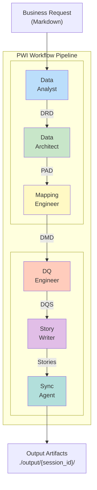
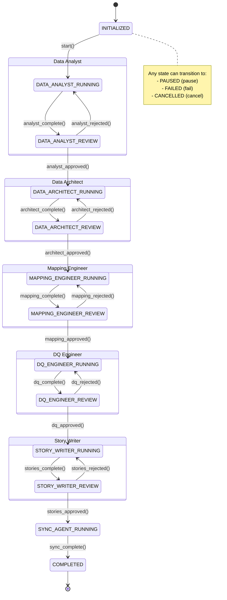
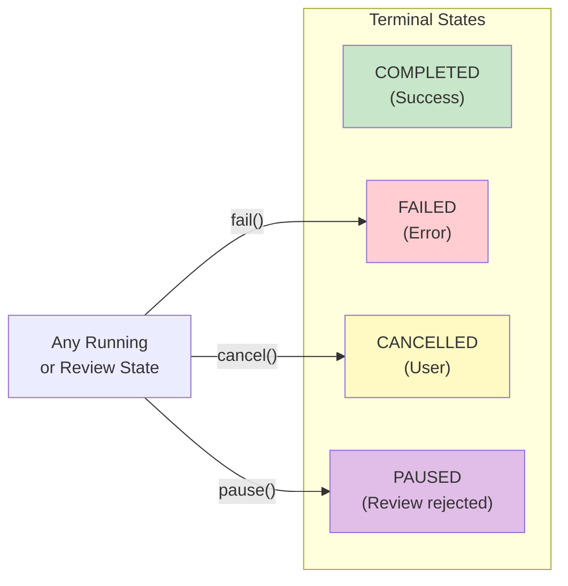
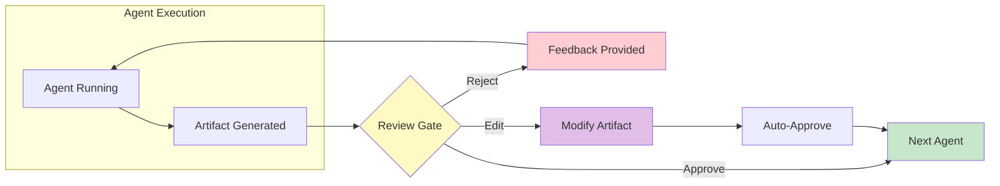
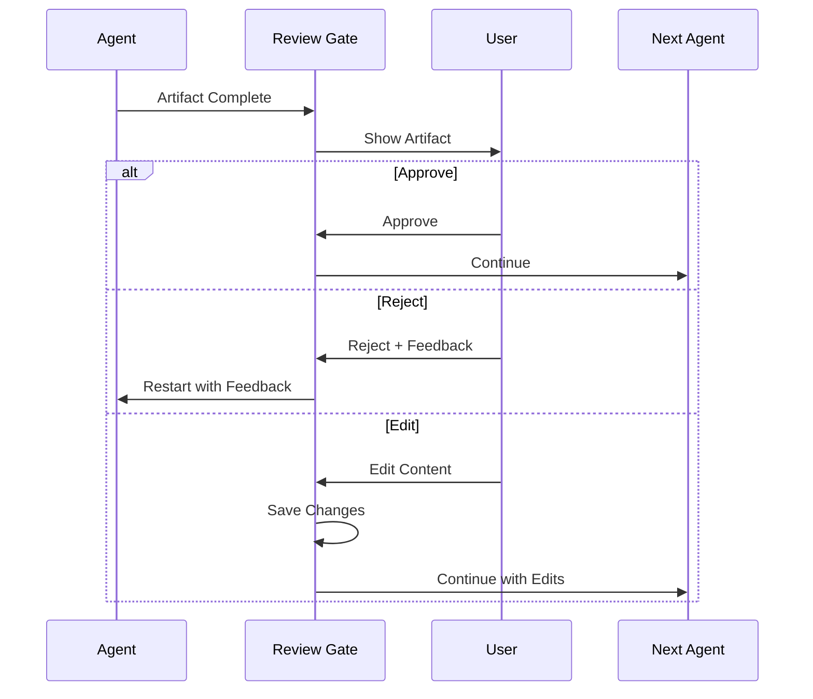
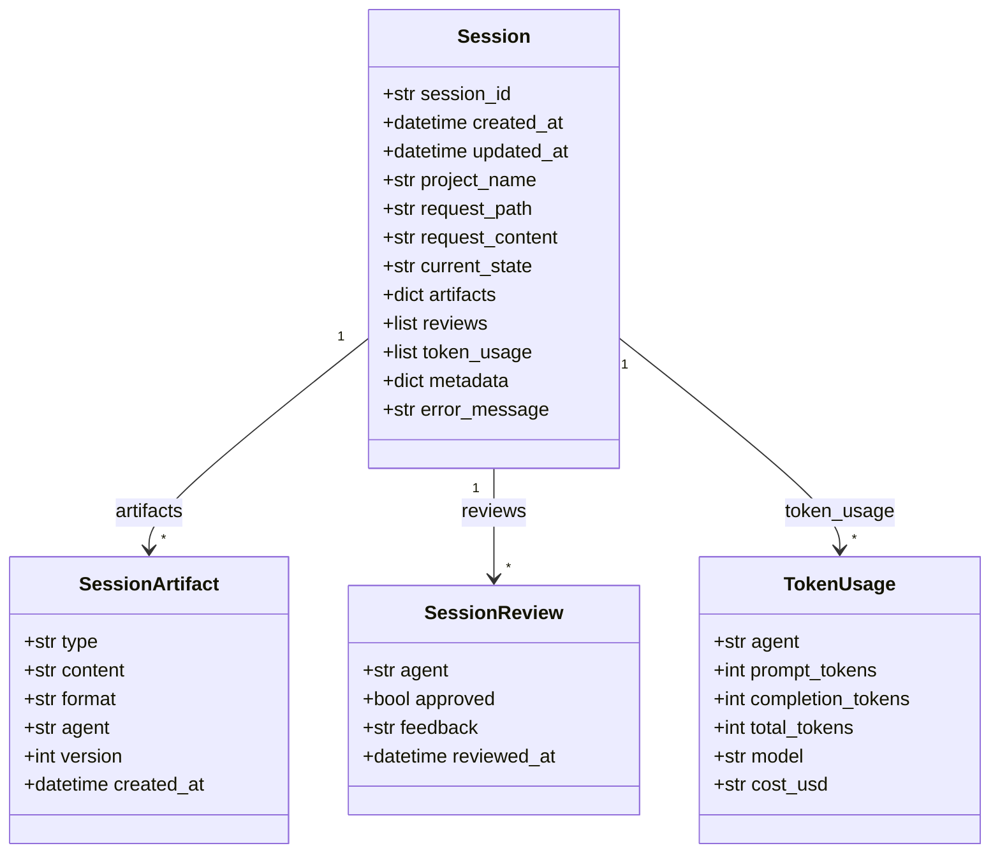
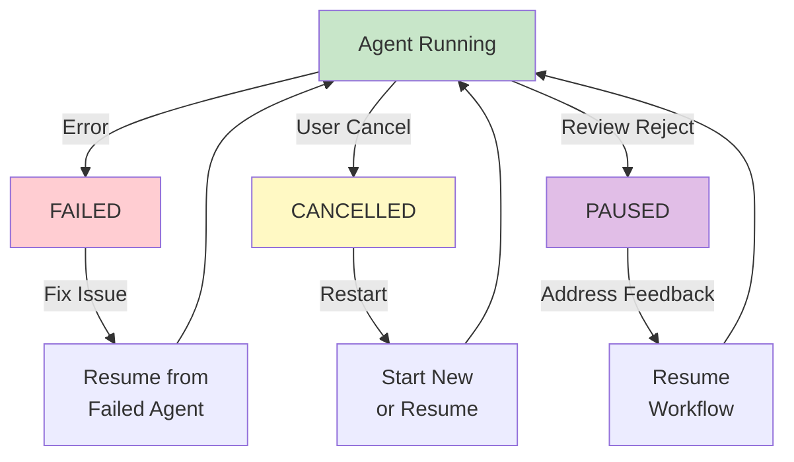

# PWI Workflow Guide

This guide provides a comprehensive tutorial on how the PWI (Planning with Intent) workflow executes, including the state machine, review gates, session management, and artifact generation.

## Table of Contents

1. [Introduction](#1-introduction)
2. [Workflow Architecture](#2-workflow-architecture)
3. [State Machine Deep Dive](#3-state-machine-deep-dive)
4. [Tutorial: Running a Complete Workflow](#4-tutorial-running-a-complete-workflow)
5. [Review Gates](#5-review-gates)
6. [Session Management](#6-session-management)
7. [Artifact Deep Dive](#7-artifact-deep-dive)
8. [Error Handling & Recovery](#8-error-handling--recovery)
9. [Advanced Usage](#9-advanced-usage)
10. [Reference](#10-reference)

---

## 1. Introduction

### What PWI Workflow Accomplishes

PWI transforms a **business request** into **structured data engineering artifacts** through a 6-agent sequential pipeline. Each agent specializes in one aspect of the data engineering process.



### Key Concepts

| Concept | Description |
|---------|-------------|
| **Session** | A workflow execution instance with unique ID |
| **State** | Current position in the workflow pipeline |
| **Artifact** | Output document from an agent (DRD, PAD, DMD, DQS, Stories, Package) |
| **Review Gate** | Approval checkpoint between agents |
| **Context Chaining** | Previous artifacts are passed to next agent |

---

## 2. Workflow Architecture

### 2.1 The 6-Agent Pipeline

| Order | Agent | Artifact | Format | Tools | Purpose |
|-------|-------|----------|--------|-------|---------|
| 1 | **Data Analyst** | DRD | Markdown | DuckDB, CSV | Explores data, generates requirements |
| 2 | **Data Architect** | PAD | Markdown | file_editor | Designs pipeline architecture from DRD |
| 3 | **Mapping Engineer** | DMD | CSV | DuckDB, CSV, Metadata | Maps source fields to target fields |
| 4 | **DQ Engineer** | DQS | YAML | None | Defines data quality rules |
| 5 | **Story Writer** | Stories | Markdown | file_editor | Creates epics and user stories |
| 6 | **Sync Agent** | Package | Markdown | None | Consolidates all artifacts |

### 2.2 Artifact Flow

Each agent receives context from all previous agents:

```mermaid
flowchart LR
    subgraph Context["Context Accumulation"]
        direction TB
        DA["data_analyst"] --> DRD["DRD"]
        DAr["data_architect"] --> PAD["PAD"]
        ME["mapping_engineer"] --> DMD["DMD"]
        DQ["dq_engineer"] --> DQS["DQS"]
        SW["story_writer"] --> Stories["Stories"]
        SA["sync_agent"] --> Package["Package"]
    end

    subgraph Receives["What Each Agent Receives"]
        direction TB
        C1["DRD"]
        C2["DRD + PAD"]
        C3["DRD + PAD + DMD"]
        C4["DRD + PAD + DMD + DQS"]
        C5["All Artifacts"]
    end

    DRD -.-> C1
    PAD -.-> C2
    DMD -.-> C3
    DQS -.-> C4
    Stories -.-> C5

    C1 -->|"Input to"| DAr
    C2 -->|"Input to"| ME
    C3 -->|"Input to"| DQ
    C4 -->|"Input to"| SW
    C5 -->|"Input to"| SA

    style DRD fill:#bbdefb
    style PAD fill:#c8e6c9
    style DMD fill:#fff9c4
    style DQS fill:#ffccbc
    style Stories fill:#e1bee7
    style Package fill:#b2dfdb
```



### 2.3 Why Some Agents Have No Tools

Agents like `dq_engineer` and `sync_agent` have **no tools** by design:

| Agent | Tools | Reason |
|-------|-------|--------|
| dq_engineer | None | Generates YAML directly from context; tools cause "stuck detection" loops |
| sync_agent | None | Consolidates text; no exploration needed |

This prevents agents from getting stuck repeatedly calling the same tool.

---

## 3. State Machine Deep Dive

### 3.1 State Overview

The workflow has **16 states** managed by a finite state machine using the `transitions` library:

| Category | States | Count |
|----------|--------|-------|
| Initial | `INITIALIZED` | 1 |
| Running | `*_RUNNING` (one per agent) | 6 |
| Review | `*_REVIEW` (5 agents, sync has none) | 5 |
| Terminal | `COMPLETED`, `FAILED`, `CANCELLED`, `PAUSED` | 4 |

### 3.2 State Diagram



**Terminal States:**



### 3.3 Transitions Table

| Trigger | Source State | Destination State |
|---------|--------------|-------------------|
| `start()` | INITIALIZED | DATA_ANALYST_RUNNING |
| `analyst_complete()` | DATA_ANALYST_RUNNING | DATA_ANALYST_REVIEW |
| `analyst_approved()` | DATA_ANALYST_REVIEW | DATA_ARCHITECT_RUNNING |
| `analyst_rejected()` | DATA_ANALYST_REVIEW | DATA_ANALYST_RUNNING |
| `architect_complete()` | DATA_ARCHITECT_RUNNING | DATA_ARCHITECT_REVIEW |
| `architect_approved()` | DATA_ARCHITECT_REVIEW | MAPPING_ENGINEER_RUNNING |
| `architect_rejected()` | DATA_ARCHITECT_REVIEW | DATA_ARCHITECT_RUNNING |
| `mapping_complete()` | MAPPING_ENGINEER_RUNNING | MAPPING_ENGINEER_REVIEW |
| `mapping_approved()` | MAPPING_ENGINEER_REVIEW | DQ_ENGINEER_RUNNING |
| `mapping_rejected()` | MAPPING_ENGINEER_REVIEW | MAPPING_ENGINEER_RUNNING |
| `dq_complete()` | DQ_ENGINEER_RUNNING | DQ_ENGINEER_REVIEW |
| `dq_approved()` | DQ_ENGINEER_REVIEW | STORY_WRITER_RUNNING |
| `dq_rejected()` | DQ_ENGINEER_REVIEW | DQ_ENGINEER_RUNNING |
| `stories_complete()` | STORY_WRITER_RUNNING | STORY_WRITER_REVIEW |
| `stories_approved()` | STORY_WRITER_REVIEW | SYNC_AGENT_RUNNING |
| `stories_rejected()` | STORY_WRITER_REVIEW | STORY_WRITER_RUNNING |
| `sync_complete()` | SYNC_AGENT_RUNNING | COMPLETED |
| `pause()` | Any non-terminal | PAUSED |
| `fail()` | Any non-terminal | FAILED |
| `cancel()` | Any non-terminal | CANCELLED |

### 3.4 State Machine in Code

The state machine is implemented in `pwi/workflow/state_machine.py`:

```python
from transitions import Machine

class PWIWorkflow:
    states = [state.value for state in WorkflowState]

    transitions = [
        {"trigger": "start", "source": "initialized", "dest": "data_analyst_running"},
        {"trigger": "analyst_complete", "source": "data_analyst_running", "dest": "data_analyst_review"},
        # ... more transitions
    ]

    def __init__(self, session, session_manager):
        self.machine = Machine(
            model=self,
            states=self.states,
            transitions=self.transitions,
            initial=session.current_state,
        )
```

---

## 4. Tutorial: Running a Complete Workflow

### 4.1 Preparing Your Request

Create a request file in `requests/` directory:

```markdown
# requests/healthcare-pipeline.md

# Healthcare Analytics Pipeline

## Business Context
We need to build a data pipeline to analyze patient encounters
and outcomes from our Synthea healthcare data.

## Requirements
1. Load patient and encounter data from DuckDB
2. Create a dimensional model for analytics
3. Track patient journey across encounters
4. Ensure data quality for regulatory compliance

## Data Sources
- DuckDB database at: ../data/duckdb/raw.db
- Schema: synthea
- Key tables: patients, encounters, conditions, observations

## Target
- Analytics-ready dimensional model
- Daily refresh cadence
- 99.9% data quality threshold
```

### 4.2 Step-by-Step Execution

#### Step 1: Initialize the project (first time only)

```bash
cd chapter-4
pwi init --type data_engineering
```

This creates:
- `pwi.yaml` configuration file
- `.pwi/sessions/` directory for session storage
- `output/` directory for artifacts

#### Step 2: Start the workflow

```bash
pwi plan run requests/healthcare-pipeline.md
```

Output:
```
Session created: abc12345
Workflow started in state: data_analyst_running

⠋ Running Data Analyst...
✓ Data Analyst complete

═══════════════════════════════════════════════════════
Review: Data Analyst - DRD (Data Requirements Document)
═══════════════════════════════════════════════════════

# Data Requirements Document (DRD)

## 1. Executive Summary
Analysis of Synthea healthcare data for patient journey tracking...

[Approve/Reject/Edit] (a/r/e): a

✓ Approved

⠋ Running Data Architect...
```

#### Step 3: Monitor progress

In another terminal:
```bash
pwi session status abc12345
```

Output:
```
Session: abc12345
State: data_architect_review
Progress: 2/6 agents complete

Artifacts:
  ✓ DRD (markdown) - 2.3 KB
  ✓ PAD (markdown) - 1.8 KB

Token Usage:
  data_analyst: 4,521 tokens ($0.0045)
  data_architect: 3,102 tokens ($0.0031)
  Total: 7,623 tokens ($0.0076)
```

#### Step 4: Handle review gates

At each review gate, you can:
- **Approve (a)**: Accept the artifact and proceed
- **Reject (r)**: Send back to the agent with feedback
- **Edit (e)**: Modify the artifact before approving

```
[Approve/Reject/Edit] (a/r/e): r
Feedback: Please add more detail about the patient ID field
```

#### Step 5: Workflow completion

```
⠋ Running Sync Agent...
✓ Sync Agent complete

═══════════════════════════════════════════════════════
Workflow Completed Successfully!
═══════════════════════════════════════════════════════

Session: abc12345
Duration: 4m 32s
Total Tokens: 28,451 ($0.0285)

Artifacts exported to: output/abc12345/
  - drd.md
  - pad.md
  - dmd.csv
  - dqs.yaml
  - stories.md
  - package.md
```

### 4.3 What Happens at Each Stage

#### Data Analyst Stage

**Input:** Business request markdown
**Process:**
1. Agent uses `duckdb_tables` to list available tables
2. Agent uses `duckdb_schema` on relevant tables (max 3 calls)
3. Agent generates DRD based on exploration

**Output:** Data Requirements Document (DRD)

#### Data Architect Stage

**Input:** DRD + Business request
**Process:**
1. Analyzes requirements from DRD
2. Designs pipeline architecture
3. Identifies data sources, transformations, targets

**Output:** Pipeline Architecture Document (PAD)

#### Mapping Engineer Stage

**Input:** DRD + PAD + Business request
**Process:**
1. Uses `duckdb_schema` to examine source tables
2. Uses `csv_sample` for data profiling
3. Maps source fields to target fields

**Output:** Data Mapping Document (DMD) as CSV

#### DQ Engineer Stage

**Input:** DRD + PAD + DMD + Business request
**Process:**
1. Analyzes data requirements and mappings
2. Defines quality rules for each field
3. Sets thresholds and validation logic

**Output:** Data Quality Specification (DQS) as YAML

#### Story Writer Stage

**Input:** All previous artifacts + Business request
**Process:**
1. Reviews all artifacts
2. Breaks down into implementable stories
3. Creates epics and acceptance criteria

**Output:** Epics & User Stories as Markdown

#### Sync Agent Stage

**Input:** All artifacts
**Process:**
1. Consolidates all artifacts
2. Generates summary and cross-references
3. Creates final package

**Output:** Consolidated Package as Markdown

---

## 5. Review Gates

### 5.1 Review Gate Concept

After each agent completes (except sync_agent), a **review gate** pauses the workflow for human approval:



**Review Flow Summary:**



### 5.2 CLI Review Mode

Interactive terminal-based review (default):

```bash
═══════════════════════════════════════════════════════
Review: Data Analyst - DRD (Data Requirements Document)
═══════════════════════════════════════════════════════

# Data Requirements Document (DRD)

## 1. Executive Summary
[First 50 lines shown...]

[Approve/Reject/Edit] (a/r/e): _
```

Commands:
- `a` or `approve` - Accept and continue
- `r` or `reject` - Reject with feedback
- `e` or `edit` - Open in editor
- `f` or `full` - Show full content
- `q` or `quit` - Pause workflow

### 5.3 File-Based Review Mode

For async workflows, use file-based review:

```yaml
# pwi.yaml
review:
  enabled: true
  mode: file  # Write artifact to file for review
  timeout_minutes: 60
```

How it works:
1. Artifact is written to `output/review/{agent}_artifact.md`
2. Workflow waits for timeout or file modification
3. Modified content is used as the approved artifact

### 5.4 Auto-Approval Mode

For testing or trusted scenarios:

```bash
pwi plan run requests/my-request.md --auto-approve
```

Or in configuration:
```yaml
# pwi.yaml
review:
  enabled: true
  mode: auto  # Auto-approve all gates
```

### 5.5 Skip Mode

Skip all review gates entirely:

```bash
pwi plan run requests/my-request.md --skip-review
```

Or in configuration:
```yaml
# pwi.yaml
review:
  enabled: false
```

### 5.6 Per-Agent Review Configuration

Configure review behavior per agent:

```yaml
# pwi.yaml
review:
  enabled: true
  default_mode: cli
  gates:
    data_analyst:
      enabled: true
      mode: cli
    data_architect:
      enabled: true
      mode: file
    dq_engineer:
      enabled: false  # Auto-approve DQ
```

---

## 6. Session Management

### 6.1 Session Structure

A session tracks the complete state of a workflow execution:



```python
class Session(BaseModel):
    session_id: str          # Unique 8-char ID (e.g., "abc12345")
    created_at: datetime     # When workflow started
    updated_at: datetime     # Last state change
    project_name: str        # Project identifier
    request_path: str        # Path to request file
    request_content: str     # Full request content
    current_state: str       # Current state machine state
    artifacts: dict          # Generated artifacts by type
    reviews: list            # Review decisions history
    token_usage: list        # Token usage per agent
    metadata: dict           # Custom metadata
    error_message: str       # Error if failed
```

### 6.2 Session Persistence

Sessions use **file-based storage** with each session stored as a directory containing individual artifact files:

```
.pwi/sessions/
├── abc12345/                    # Session directory
│   ├── session.json             # Metadata only (~600 bytes)
│   ├── drd.md                   # Data Requirements Document
│   ├── pad.md                   # Pipeline Architecture Document
│   ├── dmd.csv                  # Data Mapping Document
│   ├── dqs.yaml                 # Data Quality Specification
│   ├── stories.md               # User Stories
│   └── package.md               # Final Package
├── def67890/
│   └── ...
└── ghi11111/
    └── ...
```

**Benefits of file-based storage:**
- Artifacts viewable/editable directly in filesystem
- Smaller JSON files (metadata only)
- Clean git diffs
- Individual artifact versioning

Example session.json (metadata only):
```json
{
  "session_id": "abc12345",
  "created_at": "2024-01-15T10:30:00Z",
  "current_state": "data_architect_review",
  "artifacts": {
    "drd": {
      "type": "drd",
      "format": "markdown",
      "filename": "drd.md",
      "agent": "data_analyst",
      "version": 1
    }
  },
  "reviews": [
    {
      "agent": "data_analyst",
      "approved": true,
      "feedback": null,
      "reviewed_at": "2024-01-15T10:35:00Z"
    }
  ],
  "token_usage": [
    {
      "agent": "data_analyst",
      "prompt_tokens": 2500,
      "completion_tokens": 2021,
      "total_tokens": 4521,
      "model": "openai/gpt-4o-mini",
      "cost_usd": "0.0045"
    }
  ]
}
```

### 6.3 Migrating Existing Sessions

If you have sessions in the legacy inline format, migrate them:

```bash
# Preview changes
python scripts/migrate_sessions.py --dry-run

# Execute migration
python scripts/migrate_sessions.py

# Migrate specific session
python scripts/migrate_sessions.py --session abc12345
```

### 6.3 Tutorial: Resuming a Paused Workflow

#### Step 1: List sessions

```bash
pwi session list
```

Output:
```
Sessions:

  abc12345  data_architect_review  2024-01-15 10:30  healthcare-pipeline
  def67890  completed              2024-01-14 15:20  sales-analytics
  ghi11111  failed                 2024-01-13 09:00  inventory-tracker
```

#### Step 2: Check session status

```bash
pwi session status abc12345
```

Output:
```
Session: abc12345
Created: 2024-01-15 10:30:00
State: data_architect_review (paused at review gate)

Progress: 2/6 agents
  ✓ data_analyst (DRD)
  ✓ data_architect (PAD) - awaiting review
  ○ mapping_engineer
  ○ dq_engineer
  ○ story_writer
  ○ sync_agent

Token Usage: 7,623 tokens ($0.0076)
```

#### Step 3: Resume the workflow

Resume from where it stopped:
```bash
pwi session resume abc12345
```

Or resume from a specific agent:
```bash
pwi session resume abc12345 --from mapping_engineer
```

### 6.4 Token Usage Tracking

Track costs per agent and total:

```bash
pwi session usage abc12345
```

Output:
```
Token Usage for abc12345:

Agent            Prompt    Completion    Total      Cost
─────────────────────────────────────────────────────────
data_analyst      2,500        2,021     4,521    $0.0045
data_architect    1,800        1,302     3,102    $0.0031
mapping_engineer  3,200        2,456     5,656    $0.0057
─────────────────────────────────────────────────────────
Total            7,500        5,779    13,279    $0.0133
```

---

## 7. Artifact Deep Dive

### 7.1 DRD (Data Requirements Document)

**Format:** Markdown
**Agent:** data_analyst
**Purpose:** Capture data requirements from exploration

**Structure:**
```markdown
# Data Requirements Document (DRD)

## 1. Executive Summary
Brief overview of data requirements and scope.

## 2. Data Sources
### 2.1 [Source Name]
- **Type**: Database/API/File
- **Location**: Connection string or path
- **Tables/Files**: List of tables
- **Refresh**: Update frequency
- **Volume**: Row count estimates

## 3. Entity Definitions
### 3.1 [Entity Name]
- **Description**: What this entity represents
- **Source**: Source table/file
- **Grain**: Level of detail (one row per...)

#### Attributes
| Field | Type | Description | Nullable | Rules |
|-------|------|-------------|----------|-------|

## 4. Relationships
Entity relationships with cardinality (1:1, 1:N, N:M)

## 5. Business Rules
Calculations and transformation logic

## 6. Data Quality Requirements
Completeness, validity, accuracy rules

## 7. SLA Requirements
Freshness and availability needs

## 8. Open Questions
Clarifications needed from stakeholders
```

### 7.2 PAD (Pipeline Architecture Document)

**Format:** Markdown
**Agent:** data_architect
**Purpose:** Design the data pipeline architecture

**Structure:**
```markdown
# Pipeline Architecture Document (PAD)

## 1. Overview
High-level architecture description.

## 2. Source Systems
### 2.1 [Source Name]
- Connection details
- Extraction method
- Scheduling

## 3. Target Systems
### 3.1 [Target Name]
- Storage type (data warehouse, lake, etc.)
- Schema design
- Partitioning strategy

## 4. Data Flow
```
[Source] → [Extract] → [Transform] → [Load] → [Target]
```

## 5. Transformation Logic
### 5.1 [Transform Name]
- Input: Source tables
- Output: Target table
- Logic: SQL/Python description

## 6. Scheduling
- Frequency: Daily/Hourly/Real-time
- Dependencies: Upstream dependencies
- SLA: Expected completion time

## 7. Monitoring
- Alerts: Failure notifications
- Metrics: Row counts, latency, quality scores

## 8. Security
- Access control
- Encryption
- Compliance requirements
```

### 7.3 DMD (Data Mapping Document)

**Format:** CSV (13 columns)
**Agent:** mapping_engineer
**Purpose:** Map source fields to target fields with layer information

**Structure:**
```csv
source_system,source_table,source_column,source_type,target_table,target_column,target_type,transformation,business_rule,nullable,default_value,notes,layer
synthea,patients,Id,VARCHAR,bronze.patients,id,VARCHAR,Id,BR001,No,,Raw copy from source,bronze
synthea,patients,Id,VARCHAR,silver.patients,patient_id,VARCHAR,TRIM(Id),BR001,No,,Primary key cleaned,silver
synthea,patients,BIRTHDATE,DATE,bronze.patients,birthdate,DATE,BIRTHDATE,BR002,No,,Raw date,bronze
synthea,patients,BIRTHDATE,DATE,silver.patients,birth_date,DATE,CAST(BIRTHDATE AS DATE),BR002,No,,Date conversion,silver
synthea,patients,GENDER,VARCHAR,silver.patients,gender,VARCHAR,UPPER(GENDER),BR003,No,,Standardize case,silver
synthea,encounters,START,TIMESTAMP,silver.encounters,start_timestamp,TIMESTAMP,CAST(START AS TIMESTAMP),BR004,No,,,silver
synthea,encounters,PATIENT,VARCHAR,gold.fact_encounter,patient_id,VARCHAR,PATIENT,BR005,No,,FK to dim_patient,gold
```

**Required Columns (13 total):**

| # | Column | Description |
|---|--------|-------------|
| 1 | source_system | Source system identifier (e.g., synthea) |
| 2 | source_table | Source table name |
| 3 | source_column | Source column name |
| 4 | source_type | Source data type |
| 5 | target_table | Target table name (e.g., bronze.patients) |
| 6 | target_column | Target column name |
| 7 | target_type | Target data type |
| 8 | transformation | SQL/DuckDB transformation expression |
| 9 | business_rule | Business rule reference (e.g., BR001) |
| 10 | nullable | Whether field allows nulls (Yes/No) |
| 11 | default_value | Default value if null |
| 12 | notes | Additional documentation |
| 13 | layer | Target layer: `bronze`, `silver`, or `gold` |

**Layer Values:**
- **bronze**: Raw source data with minimal transformation
- **silver**: Cleaned, standardized, type-converted data
- **gold**: Aggregated, business-ready, dimensional data

### 7.4 DQS (Data Quality Specification)

**Format:** YAML
**Agent:** dq_engineer
**Purpose:** Define data quality rules

**Structure:**
```yaml
# Data Quality Specification

version: "1.0"
generated_at: "2024-01-15T10:45:00Z"

global_settings:
  default_threshold: 0.99
  alert_channel: "data-quality-alerts"

tables:
  dim_patient:
    description: "Patient dimension table"
    row_count_expectation:
      min: 1000
      max: 1000000

    columns:
      patient_id:
        type: VARCHAR
        nullable: false
        unique: true
        rules:
          - name: not_null
            threshold: 1.0
          - name: unique
            threshold: 1.0

      birth_date:
        type: DATE
        nullable: false
        rules:
          - name: not_null
            threshold: 0.99
          - name: date_range
            min: "1900-01-01"
            max: "today"

      gender:
        type: VARCHAR
        nullable: false
        rules:
          - name: allowed_values
            values: ["M", "F", "O", "U"]
            threshold: 0.999

  fact_encounter:
    description: "Encounter fact table"
    freshness:
      max_age_hours: 24

    columns:
      patient_id:
        type: VARCHAR
        nullable: false
        rules:
          - name: referential_integrity
            reference_table: dim_patient
            reference_column: patient_id
            threshold: 1.0
```

### 7.5 Stories (Epics & User Stories)

**Format:** Markdown
**Agent:** story_writer
**Purpose:** Break down implementation into stories

**Structure:**
```markdown
# Implementation Stories

## Epic 1: Data Extraction Layer

### Story 1.1: Patient Data Extraction
**As a** data engineer
**I want to** extract patient data from DuckDB
**So that** I can load it into the analytics warehouse

**Acceptance Criteria:**
- [ ] Connect to DuckDB database
- [ ] Extract all records from synthea.patients
- [ ] Handle incremental updates based on last_modified
- [ ] Log extraction metrics (row count, duration)

**Story Points:** 3
**Priority:** High

### Story 1.2: Encounter Data Extraction
...

## Epic 2: Transformation Layer

### Story 2.1: Patient Dimension Transform
**As a** data engineer
**I want to** transform raw patient data into dim_patient
**So that** analysts can query standardized patient information

**Acceptance Criteria:**
- [ ] Apply field mappings from DMD
- [ ] Implement gender standardization
- [ ] Generate surrogate keys
- [ ] Add audit columns (created_at, updated_at)

**Story Points:** 5
**Priority:** High

## Epic 3: Data Quality Implementation
...
```

### 7.6 Package (Final Consolidated Output)

**Format:** Markdown
**Agent:** sync_agent
**Purpose:** Consolidate all artifacts into final deliverable

**Structure:**
```markdown
# Healthcare Analytics Pipeline - Final Package

## Executive Summary
This package contains all artifacts for the Healthcare Analytics
Pipeline as specified in the business request.

## Artifact Summary

| Artifact | Type | Version | Agent |
|----------|------|---------|-------|
| DRD | Markdown | 1 | data_analyst |
| PAD | Markdown | 1 | data_architect |
| DMD | CSV | 1 | mapping_engineer |
| DQS | YAML | 1 | dq_engineer |
| Stories | Markdown | 1 | story_writer |

## Key Decisions

1. **Data Model**: Dimensional model with 2 dimensions, 1 fact table
2. **Refresh**: Daily batch processing at 2 AM
3. **Quality**: 99.9% threshold for critical fields

## Implementation Roadmap

1. **Week 1**: Set up extraction layer (Stories 1.1-1.3)
2. **Week 2**: Build transformation layer (Stories 2.1-2.3)
3. **Week 3**: Implement DQ framework (Stories 3.1-3.2)
4. **Week 4**: Testing and deployment

## Appendix

### A. Data Requirements Document
[Full DRD content]

### B. Pipeline Architecture Document
[Full PAD content]

### C. Data Mapping Document
[Full DMD content]

### D. Data Quality Specification
[Full DQS content]

### E. Implementation Stories
[Full Stories content]
```

---

## 8. Error Handling & Recovery

### 8.1 Failure States



| State | Cause | Recovery |
|-------|-------|----------|
| `FAILED` | Agent error, LLM timeout, tool failure | Fix issue, resume from failed agent |
| `CANCELLED` | User cancelled | Resume or start new session |
| `PAUSED` | Review rejection or manual pause | Resume after addressing feedback |

### 8.2 Common Errors

#### Agent Timeout
```
Error: Agent execution timed out after 300 seconds
```
**Solution:** Increase timeout in config or simplify the request

```yaml
# pwi.yaml
agents:
  data_analyst:
    timeout_seconds: 600  # Increase from default 300
```

#### Tool Execution Failure
```
Error: DuckDB connection failed: Database file not found
```
**Solution:** Check database path in config and ensure file exists

```yaml
# pwi.yaml
data:
  duckdb_path: ../data/duckdb/raw.db  # Verify path
```

#### LLM API Errors
```
Error: OpenAI API rate limit exceeded
```
**Solution:** Wait and retry, or use a different model

```bash
pwi session resume abc12345  # Retry after waiting
```

### 8.3 Recovery Strategies

#### Resume from failure point

```bash
# Check where it failed
pwi session status abc12345

# Resume from that agent
pwi session resume abc12345
```

#### Restart specific agent

```bash
# Resume from a specific agent (re-runs that agent)
pwi session resume abc12345 --from mapping_engineer
```

#### Manual artifact injection

If you need to manually fix an artifact:

```bash
# Export current artifacts
pwi session export abc12345 --output ./temp/

# Edit the artifact
vim ./temp/drd.md

# Import fixed artifact
pwi session import abc12345 --artifact drd --file ./temp/drd.md

# Resume from next agent
pwi session resume abc12345 --from data_architect
```

---

## 9. Advanced Usage

### 9.1 Custom Agent Order

To skip or reorder agents, use the `--agents` flag:

```bash
# Run only specific agents
pwi plan run request.md --agents data_analyst,mapping_engineer
```

### 9.2 Parallel Agents (Experimental)

Some agents can theoretically run in parallel (if they don't depend on each other's output). This is experimental:

```yaml
# pwi.yaml (experimental)
workflow:
  parallel_groups:
    - [data_analyst]
    - [data_architect]
    - [mapping_engineer, dq_engineer]  # Run in parallel
    - [story_writer]
    - [sync_agent]
```

### 9.3 Webhook Notifications

Configure webhooks for workflow events:

```yaml
# pwi.yaml
notifications:
  webhook_url: https://api.example.com/pwi-events
  events:
    - workflow_started
    - agent_completed
    - review_pending
    - workflow_completed
    - workflow_failed
```

### 9.4 CI/CD Integration

Run PWI in CI/CD pipelines:

```yaml
# .github/workflows/data-pipeline.yml
jobs:
  generate-artifacts:
    runs-on: ubuntu-latest
    steps:
      - uses: actions/checkout@v3

      - name: Setup PWI
        run: |
          cd chapter-4
          uv sync

      - name: Run PWI
        env:
          LLM_API_KEY: ${{ secrets.LLM_API_KEY }}
        run: |
          cd chapter-4
          pwi plan run requests/pipeline.md --auto-approve

      - name: Upload Artifacts
        uses: actions/upload-artifact@v3
        with:
          name: pwi-artifacts
          path: chapter-4/output/
```

---

## 10. Reference

### 10.1 CLI Command Reference

| Command | Description |
|---------|-------------|
| `pwi init` | Initialize a new project |
| `pwi plan run <request.md>` | Run planning workflow |
| `pwi session list` | List all sessions |
| `pwi session status <id>` | Show session status |
| `pwi session resume <id>` | Resume a paused session |
| `pwi session export <id>` | Export session artifacts |
| `pwi review show <id>` | Show pending review |
| `pwi review approve <id>` | Approve pending artifact |
| `pwi review reject <id>` | Reject with feedback |
| `pwi dashboard` | Start web UI |

### 10.2 Configuration Reference

```yaml
# pwi.yaml - Full configuration reference

project:
  name: my-project
  output_dir: ./output
  session_dir: ./.pwi/sessions

llm:
  provider: openrouter  # or openai, anthropic
  api_key: ${LLM_API_KEY}  # From environment
  base_url: https://openrouter.ai/api/v1
  default_model: openai/gpt-4o-mini
  models:
    fast: openai/gpt-4o-mini
    balanced: anthropic/claude-3-5-sonnet
    powerful: anthropic/claude-3-opus

agents:
  data_analyst:
    model: balanced
    temperature: 0.7
    max_tokens: 4096
    timeout_seconds: 300
  data_architect:
    model: fast
    temperature: 0.5
  # ... other agents

review:
  enabled: true
  default_mode: cli  # cli, file, auto
  timeout_minutes: 60
  gates:
    data_analyst:
      enabled: true
      mode: cli
    dq_engineer:
      enabled: false  # Auto-approve

data:
  duckdb_path: ../data/duckdb/raw.db
  csv_dir: ../data/raw/
```

### 10.3 Environment Variables

| Variable | Description | Required |
|----------|-------------|----------|
| `LLM_API_KEY` | API key for LLM provider | Yes |
| `LLM_BASE_URL` | Base URL for API (e.g., OpenRouter) | No |
| `LLM_MODEL` | Default model to use | No |
| `PWI_SESSION_DIR` | Custom session directory | No |
| `PWI_OUTPUT_DIR` | Custom output directory | No |
| `PWI_LOG_LEVEL` | Logging level (DEBUG, INFO, WARNING) | No |

---

## Next Steps

- Read the [Extensibility Guide](EXTENSIBILITY.md) to add custom tools, skills, and agents
- Check the [CLI Reference](cli-reference.md) for all available commands
- See [Quick Start](quickstart.md) for a rapid introduction
