# Data Model Specification: Patient 360 Medallion Pipeline

| Field | Value |
|-------|-------|
| **Version** | 1.0 |
| **Created** | 2026-03-16 |
| **Last Modified** | 2026-03-16 |
| **Author** | Data Modeler Agent |
| **Status** | Draft |
| **HLD Reference** | HLD-2026-03-16-patient-360-pipeline.md (v1.0) |
| **DRD Reference** | DRD-2026-02-11-patient-360.md (v1.1) |

---

## 1. Design Overview

### 1.1 Modeling Approach

This DMS implements a **Medallion Architecture** (Bronze, Silver, Gold) dimensional model for the Patient 360 use case, translating the HLD layer specifications into concrete, build-ready schemas. The Gold layer uses a two-tier design: a traditional star schema foundation (dimension and fact tables) with three consumer-aligned aggregate tables on top, satisfying both ad-hoc analytical flexibility and the DRD's consumer-specific access patterns [HLD SS3.1, DRD SS4.1].

- **Bronze** (13 tables): Source-aligned ingestion of all Phase 1 Synthea tables with pipeline metadata. No business transformations; raw data preserved for audit and reprocessing [HLD SS3.1].
- **Silver** (13 tables): Canonical business entities with standardized naming, type conversions, PK/FK enforcement, and PHI exclusions (SSN, DRIVERS, PASSPORT dropped) [HLD SS3.1, governance-policies SS2.1].
- **Gold** (10 tables): Star schema with SCD Type 2 patient dimensions (mixed per-attribute SCD per governance policy), encounter-grain facts, and three consumer-aligned aggregate tables [HLD SS3.1, HLD SS3.3].

### 1.2 Layer Summary

| Layer | Purpose | Table Count | Key Characteristics |
|-------|---------|-------------|---------------------|
| Bronze | Raw immutable ingestion | 13 | Source-aligned columns, `_ingested_at` metadata, partition by `ds`, Full Snapshot CDC [HLD SS3.1, SS8.1] |
| Silver | Canonical business entities | 13 | PK/FK enforced, PHI dropped, snake_case naming, type standardization [HLD SS3.1] |
| Gold | Dimensional model + consumer tables | 10 | SCD Type 2 dimensions, surrogate keys, 3 consumer aggregate tables [HLD SS3.1, SS3.3] |

### 1.3 HLD Traceability

This DMS implements the layer specifications defined in HLD-2026-03-16-patient-360-pipeline.md.

| DMS Section | HLD Section | Notes |
|-------------|-------------|-------|
| Bronze Layer (SS2) | HLD SS3.1 — Bronze Layer | Source-aligned with metadata columns, partition by ds |
| Silver Layer (SS3) | HLD SS3.1 — Silver Layer | SCD Type 2 dimensions, derived fields, RI enforcement |
| Gold Layer (SS4) | HLD SS3.1 — Gold Layer, SS3.3 | Star schema + 3 consumer-aligned tables |
| Naming Conventions (SS5) | HLD SS3.1, enterprise-naming-standards.md | Enterprise naming standards applied |
| SCD Strategy (SS6) | HLD SS3.3 | Per-attribute SCD types per governance policy |
| Physical Design (SS7) | HLD SS2.5, SS8.1 | Delta Lake, ds partitioning, idempotent writes |

### 1.4 Holistic Entity Relationship Diagram

```mermaid
erDiagram
    %% Bronze Layer (source-aligned, key tables shown)
    synthea_patients {
        VARCHAR Id PK
        DATE BIRTHDATE
        VARCHAR FIRST
        VARCHAR LAST
        VARCHAR GENDER
        TIMESTAMP _ingested_at
    }
    synthea_encounters {
        VARCHAR Id PK
        VARCHAR PATIENT FK
        VARCHAR PROVIDER FK
        VARCHAR ORGANIZATION FK
        VARCHAR PAYER FK
        TIMESTAMP _ingested_at
    }
    synthea_conditions {
        VARCHAR PATIENT FK
        VARCHAR ENCOUNTER FK
        BIGINT CODE
        TIMESTAMP _ingested_at
    }
    synthea_medications {
        VARCHAR PATIENT FK
        VARCHAR ENCOUNTER FK
        BIGINT CODE
        TIMESTAMP _ingested_at
    }
    synthea_allergies {
        VARCHAR PATIENT FK
        VARCHAR ENCOUNTER FK
        BIGINT CODE
        TIMESTAMP _ingested_at
    }
    synthea_observations {
        VARCHAR PATIENT FK
        VARCHAR ENCOUNTER FK
        VARCHAR CODE
        TIMESTAMP _ingested_at
    }
    synthea_providers {
        VARCHAR Id PK
        VARCHAR ORGANIZATION FK
        TIMESTAMP _ingested_at
    }
    synthea_organizations {
        VARCHAR Id PK
        TIMESTAMP _ingested_at
    }
    synthea_payers {
        VARCHAR Id PK
        TIMESTAMP _ingested_at
    }

    %% Silver Layer (canonical entities)
    clinical_patients {
        VARCHAR patient_id PK
        VARCHAR first_name
        VARCHAR last_name
        DATE birth_date
        VARCHAR gender
    }
    clinical_encounters {
        VARCHAR encounter_id PK
        VARCHAR patient_id FK
        VARCHAR provider_id FK
        VARCHAR organization_id FK
        VARCHAR payer_id FK
        DATE encounter_date
    }
    clinical_conditions {
        VARCHAR condition_id PK
        VARCHAR patient_id FK
        VARCHAR encounter_id FK
        VARCHAR snomed_code
    }
    clinical_medications {
        VARCHAR medication_id PK
        VARCHAR patient_id FK
        VARCHAR encounter_id FK
        VARCHAR rxnorm_code
    }
    clinical_allergies {
        VARCHAR allergy_id PK
        VARCHAR patient_id FK
        VARCHAR encounter_id FK
        VARCHAR snomed_code
    }
    clinical_observations {
        VARCHAR observation_id PK
        VARCHAR patient_id FK
        VARCHAR encounter_id FK
        VARCHAR loinc_code
    }
    clinical_procedures {
        VARCHAR procedure_id PK
        VARCHAR patient_id FK
        VARCHAR encounter_id FK
        VARCHAR snomed_code
    }
    clinical_immunizations {
        VARCHAR immunization_id PK
        VARCHAR patient_id FK
        VARCHAR encounter_id FK
        VARCHAR cvx_code
    }
    clinical_careplans {
        VARCHAR careplan_id PK
        VARCHAR patient_id FK
        VARCHAR encounter_id FK
    }
    billing_claims {
        VARCHAR claim_id PK
        VARCHAR patient_id FK
        VARCHAR provider_id FK
    }
    reference_providers {
        VARCHAR provider_id PK
        VARCHAR organization_id FK
    }
    reference_organizations {
        VARCHAR organization_id PK
    }
    reference_payers {
        VARCHAR payer_id PK
    }

    %% Gold Layer (dimensional model)
    dim_patient {
        BIGINT patient_sk PK
        VARCHAR patient_id
        VARCHAR full_name
        BOOLEAN is_current
        DATE effective_from
        DATE effective_to
    }
    dim_provider {
        BIGINT provider_sk PK
        VARCHAR provider_id
        VARCHAR provider_name
        VARCHAR speciality
    }
    dim_organization {
        BIGINT organization_sk PK
        VARCHAR organization_id
        VARCHAR organization_name
    }
    dim_payer {
        BIGINT payer_sk PK
        VARCHAR payer_id
        VARCHAR payer_name
    }
    fact_encounter {
        BIGINT encounter_sk PK
        BIGINT patient_sk FK
        BIGINT provider_sk FK
        BIGINT organization_sk FK
        BIGINT payer_sk FK
        DATE encounter_date
    }
    fact_condition {
        BIGINT condition_sk PK
        BIGINT patient_sk FK
        BIGINT encounter_sk FK
    }
    fact_medication {
        BIGINT medication_sk PK
        BIGINT patient_sk FK
        BIGINT encounter_sk FK
    }
    patient_summary {
        VARCHAR patient_id PK
        VARCHAR full_name
        INTEGER patient_age
    }
    patient_clinical_history {
        VARCHAR patient_id FK
        VARCHAR encounter_id
        DATE encounter_date
    }
    patient_billing_summary {
        VARCHAR patient_id FK
        VARCHAR encounter_id
        DECIMAL total_visit_cost
    }

    %% Bronze to Silver (cleansing)
    synthea_patients ||--|| clinical_patients : "cleanse"
    synthea_encounters ||--|| clinical_encounters : "cleanse"
    synthea_conditions ||--|| clinical_conditions : "cleanse"
    synthea_medications ||--|| clinical_medications : "cleanse"
    synthea_allergies ||--|| clinical_allergies : "cleanse"
    synthea_observations ||--|| clinical_observations : "cleanse"
    synthea_providers ||--|| reference_providers : "cleanse"
    synthea_organizations ||--|| reference_organizations : "cleanse"
    synthea_payers ||--|| reference_payers : "cleanse"

    %% Silver internal relationships
    clinical_patients ||--o{ clinical_encounters : "has"
    clinical_patients ||--o{ clinical_conditions : "has"
    clinical_patients ||--o{ clinical_medications : "prescribed"
    clinical_patients ||--o{ clinical_allergies : "has"
    clinical_patients ||--o{ clinical_observations : "measured"
    clinical_patients ||--o{ clinical_procedures : "undergoes"
    clinical_patients ||--o{ clinical_immunizations : "receives"
    clinical_patients ||--o{ clinical_careplans : "follows"
    clinical_patients ||--o{ billing_claims : "billed"
    clinical_encounters ||--o{ clinical_conditions : "during"
    clinical_encounters ||--o{ clinical_medications : "during"
    clinical_encounters ||--o{ clinical_observations : "during"
    clinical_encounters ||--o{ clinical_procedures : "during"
    clinical_encounters ||--o{ clinical_immunizations : "during"
    clinical_encounters ||--o{ clinical_careplans : "for"
    reference_providers ||--o{ clinical_encounters : "conducts"
    reference_organizations ||--o{ clinical_encounters : "at"
    reference_organizations ||--o{ reference_providers : "employs"
    reference_payers ||--o{ clinical_encounters : "covers"

    %% Silver to Gold (dimensional model)
    clinical_patients ||--|| dim_patient : "SCD2"
    reference_providers ||--|| dim_provider : "SCD1"
    reference_organizations ||--|| dim_organization : "SCD1"
    reference_payers ||--|| dim_payer : "SCD1"
    clinical_encounters ||--|| fact_encounter : "per encounter"
    clinical_conditions ||--|| fact_condition : "per diagnosis"
    clinical_medications ||--|| fact_medication : "per prescription"

    %% Gold internal relationships (star schema)
    dim_patient ||--o{ fact_encounter : "patient_sk"
    dim_provider ||--o{ fact_encounter : "provider_sk"
    dim_organization ||--o{ fact_encounter : "organization_sk"
    dim_payer ||--o{ fact_encounter : "payer_sk"
    dim_patient ||--o{ fact_condition : "patient_sk"
    fact_encounter ||--o{ fact_condition : "encounter_sk"
    dim_patient ||--o{ fact_medication : "patient_sk"
    fact_encounter ||--o{ fact_medication : "encounter_sk"

    %% Gold consumer tables
    dim_patient ||--o{ patient_summary : "patient_id"
    dim_patient ||--o{ patient_clinical_history : "patient_id"
    dim_patient ||--o{ patient_billing_summary : "patient_id"
```



### 1.5 Scope & Boundaries

This DMS defines the **logical data model**: table structures, column definitions, data types, primary/foreign key relationships, grain statements, and SCD strategies.

| Concern | Downstream Document |
|---------|-------------------|
| Column-level transform expressions (CASE, COALESCE, CAST) | Source-to-Target Mapping (STM) |
| Null handling rules, rejection thresholds, DQ gate definitions | Data Quality Specification (DQS) |
| Storage format, compression, retention, Spark configs | Low-Level Design (LLD) |

### 1.6 Layer Architecture

```mermaid
flowchart LR
    subgraph SRC["Source Systems"]
        A1["Synthea Healthcare EHR\n13 Phase 1 tables\nDuckDB read-only"]
    end
    subgraph BRZ["Bronze Layer (bronze schema)"]
        B1["synthea_patients"]
        B2["synthea_encounters"]
        B3["synthea_conditions"]
        B4["synthea_medications"]
        B5["synthea_observations"]
        B6["synthea_allergies"]
        B7["synthea_immunizations"]
        B8["synthea_procedures"]
        B9["synthea_claims"]
        B10["synthea_careplans"]
        B11["synthea_organizations"]
        B12["synthea_providers"]
        B13["synthea_payers"]
    end
    subgraph SLV["Silver Layer"]
        direction TB
        subgraph CLIN["clinical schema"]
            S1["clinical_patients"]
            S2["clinical_encounters"]
            S3["clinical_conditions"]
            S4["clinical_medications"]
            S5["clinical_observations"]
            S6["clinical_allergies"]
            S7["clinical_procedures"]
            S8["clinical_immunizations"]
            S9["clinical_careplans"]
        end
        subgraph REF["reference schema"]
            S10["reference_organizations"]
            S11["reference_providers"]
            S12["reference_payers"]
        end
        subgraph BIL["billing schema"]
            S13["billing_claims"]
        end
    end
    subgraph GLD["Gold Layer (analytics schema)"]
        direction TB
        subgraph STAR["Star Schema"]
            G1["dim_patient"]
            G2["dim_provider"]
            G3["dim_organization"]
            G4["dim_payer"]
            G5["fact_encounter"]
            G6["fact_condition"]
            G7["fact_medication"]
        end
        subgraph CONS["Consumer Tables"]
            G8["patient_summary"]
            G9["patient_clinical_history"]
            G10["patient_billing_summary"]
        end
    end
    A1 -->|"Full Snapshot\nHourly batch"| BRZ
    BRZ -->|"DQ Gate 1\nSchema + null checks"| SLV
    SLV -->|"DQ Gate 2\nFK + business rules"| GLD
```



---

## 2. Bronze Layer Schemas

Bronze tables mirror the source structure exactly. All 13 Phase 1 tables follow a consistent pattern: source columns preserved with original names and types, plus four pipeline metadata columns. No business transformations are applied [HLD SS3.1].

### Decision: Bronze Column Type Preservation

**Options Considered**:
1. Preserve source types as-is from DuckDB (VARCHAR, DATE, TIMESTAMP, DOUBLE, BIGINT)
2. Cast all columns to VARCHAR at Bronze for maximum flexibility

**Selected**: Option 1 -- Preserve source types as-is

**Rationale**: The HLD specifies "schema enforcement" at Bronze with explicit StructType schemas [HLD SS2.5]. Preserving actual source types enables schema drift detection at ingestion time.

**Trade-off**: Source type changes will break Bronze schema enforcement, requiring schema evolution handling. This is preferable to silent type mismatches discovered only at Silver.

### synthea_patients (Bronze)

Source-aligned patient demographics. All 26 source columns preserved plus 4 metadata columns. Contains PHI columns (SSN, DRIVERS, PASSPORT) that will be dropped at Bronze-to-Silver boundary [governance-policies SS2.1].

**Source**: synthea.patients [HLD SS3.1]

```yaml
table: synthea_patients
layer: bronze
schema: bronze
source_table: synthea.patients
partition_by: ds
write_strategy: replace_partition
row_count: 5767
columns:
  - name: Id
    type: VARCHAR
    nullable: false
    source: synthea.patients.Id
    description: "Patient UUID -- natural key"
  - name: BIRTHDATE
    type: DATE
    nullable: false
    source: synthea.patients.BIRTHDATE
    description: "Date of birth -- PHI"
  - name: DEATHDATE
    type: DATE
    nullable: true
    source: synthea.patients.DEATHDATE
    description: "Date of death, NULL if alive (86.7% NULL)"
  - name: SSN
    type: VARCHAR
    nullable: true
    source: synthea.patients.SSN
    description: "Social Security Number -- PII, dropped at Silver boundary"
  - name: DRIVERS
    type: VARCHAR
    nullable: true
    source: synthea.patients.DRIVERS
    description: "Driver license number -- PII, dropped at Silver boundary"
  - name: PASSPORT
    type: VARCHAR
    nullable: true
    source: synthea.patients.PASSPORT
    description: "Passport number -- PII, dropped at Silver boundary"
  - name: PREFIX
    type: VARCHAR
    nullable: true
    source: synthea.patients.PREFIX
    description: "Name prefix (Mr., Mrs., etc.) -- 81.8% filled"
  - name: FIRST
    type: VARCHAR
    nullable: false
    source: synthea.patients.FIRST
    description: "First name -- PHI"
  - name: MIDDLE
    type: VARCHAR
    nullable: true
    source: synthea.patients.MIDDLE
    description: "Middle name -- PHI, 80.8% filled"
  - name: LAST
    type: VARCHAR
    nullable: false
    source: synthea.patients.LAST
    description: "Last name -- PHI"
  - name: SUFFIX
    type: VARCHAR
    nullable: true
    source: synthea.patients.SUFFIX
    description: "Name suffix (Jr., III, etc.) -- 1.0% filled"
  - name: MAIDEN
    type: VARCHAR
    nullable: true
    source: synthea.patients.MAIDEN
    description: "Maiden name -- 27.9% filled"
  - name: MARITAL
    type: VARCHAR
    nullable: true
    source: synthea.patients.MARITAL
    description: "Marital status code (M, S, W, D) -- 68.4% filled"
  - name: RACE
    type: VARCHAR
    nullable: true
    source: synthea.patients.RACE
    description: "Race (white, black, asian, hawaiian, native, other)"
  - name: ETHNICITY
    type: VARCHAR
    nullable: true
    source: synthea.patients.ETHNICITY
    description: "Ethnicity (hispanic, nonhispanic)"
  - name: GENDER
    type: VARCHAR
    nullable: false
    source: synthea.patients.GENDER
    description: "Gender code (M, F)"
  - name: BIRTHPLACE
    type: VARCHAR
    nullable: true
    source: synthea.patients.BIRTHPLACE
    description: "Birth location (City State Country)"
  - name: ADDRESS
    type: VARCHAR
    nullable: true
    source: synthea.patients.ADDRESS
    description: "Street address -- PHI"
  - name: CITY
    type: VARCHAR
    nullable: true
    source: synthea.patients.CITY
    description: "City of residence"
  - name: STATE
    type: VARCHAR
    nullable: true
    source: synthea.patients.STATE
    description: "State full name (e.g., Massachusetts) -- not 2-letter code"
  - name: COUNTY
    type: VARCHAR
    nullable: true
    source: synthea.patients.COUNTY
    description: "County name"
  - name: FIPS
    type: BIGINT
    nullable: true
    source: synthea.patients.FIPS
    description: "FIPS county code"
  - name: ZIP
    type: VARCHAR
    nullable: true
    source: synthea.patients.ZIP
    description: "ZIP code -- PHI"
  - name: LAT
    type: DOUBLE
    nullable: true
    source: synthea.patients.LAT
    description: "Latitude"
  - name: LON
    type: DOUBLE
    nullable: true
    source: synthea.patients.LON
    description: "Longitude"
  - name: HEALTHCARE_EXPENSES
    type: DOUBLE
    nullable: true
    source: synthea.patients.HEALTHCARE_EXPENSES
    description: "Lifetime healthcare expenses"
  - name: HEALTHCARE_COVERAGE
    type: DOUBLE
    nullable: true
    source: synthea.patients.HEALTHCARE_COVERAGE
    description: "Lifetime healthcare coverage"
  - name: INCOME
    type: BIGINT
    nullable: true
    source: synthea.patients.INCOME
    description: "Annual income"
  # Pipeline metadata columns
  - name: _ingested_at
    type: TIMESTAMP
    nullable: false
    source: system
    description: "Pipeline ingestion timestamp"
  - name: _source_batch_id
    type: VARCHAR
    nullable: false
    source: system
    description: "Pipeline run identifier"
  - name: _source_file
    type: VARCHAR
    nullable: true
    source: system
    description: "Source file path (file-based ingestion)"
  - name: _record_hash
    type: VARCHAR
    nullable: false
    source: system
    description: "SHA-256 hash of all business columns for change detection"
```

### synthea_encounters (Bronze)

Source-aligned encounter records. One row per patient-provider interaction.

**Source**: synthea.encounters [HLD SS3.1]

```yaml
table: synthea_encounters
layer: bronze
schema: bronze
source_table: synthea.encounters
partition_by: ds
write_strategy: replace_partition
row_count: 340532
columns:
  - name: Id
    type: VARCHAR
    nullable: false
    source: synthea.encounters.Id
    description: "Encounter UUID -- natural key"
  - name: START
    type: TIMESTAMP
    nullable: false
    source: synthea.encounters.START
    description: "Encounter start timestamp"
  - name: STOP
    type: TIMESTAMP
    nullable: true
    source: synthea.encounters.STOP
    description: "Encounter stop timestamp (100% filled)"
  - name: PATIENT
    type: VARCHAR
    nullable: false
    source: synthea.encounters.PATIENT
    description: "FK to patients.Id"
  - name: ORGANIZATION
    type: VARCHAR
    nullable: true
    source: synthea.encounters.ORGANIZATION
    description: "FK to organizations.Id"
  - name: PROVIDER
    type: VARCHAR
    nullable: true
    source: synthea.encounters.PROVIDER
    description: "FK to providers.Id"
  - name: PAYER
    type: VARCHAR
    nullable: true
    source: synthea.encounters.PAYER
    description: "FK to payers.Id"
  - name: ENCOUNTERCLASS
    type: VARCHAR
    nullable: false
    source: synthea.encounters.ENCOUNTERCLASS
    description: "Encounter type (ambulatory, emergency, home, hospice, inpatient, outpatient, snf, urgentcare, virtual, wellness)"
  - name: CODE
    type: BIGINT
    nullable: true
    source: synthea.encounters.CODE
    description: "SNOMED-CT encounter type code"
  - name: DESCRIPTION
    type: VARCHAR
    nullable: true
    source: synthea.encounters.DESCRIPTION
    description: "Encounter description"
  - name: BASE_ENCOUNTER_COST
    type: DOUBLE
    nullable: true
    source: synthea.encounters.BASE_ENCOUNTER_COST
    description: "Base encounter cost"
  - name: TOTAL_CLAIM_COST
    type: DOUBLE
    nullable: true
    source: synthea.encounters.TOTAL_CLAIM_COST
    description: "Total claim cost"
  - name: PAYER_COVERAGE
    type: DOUBLE
    nullable: true
    source: synthea.encounters.PAYER_COVERAGE
    description: "Amount covered by payer"
  - name: REASONCODE
    type: BIGINT
    nullable: true
    source: synthea.encounters.REASONCODE
    description: "SNOMED-CT reason code (63.5% filled)"
  - name: REASONDESCRIPTION
    type: VARCHAR
    nullable: true
    source: synthea.encounters.REASONDESCRIPTION
    description: "Reason description"
  # Pipeline metadata columns
  - name: _ingested_at
    type: TIMESTAMP
    nullable: false
    source: system
    description: "Pipeline ingestion timestamp"
  - name: _source_batch_id
    type: VARCHAR
    nullable: false
    source: system
    description: "Pipeline run identifier"
  - name: _source_file
    type: VARCHAR
    nullable: true
    source: system
    description: "Source file path"
  - name: _record_hash
    type: VARCHAR
    nullable: false
    source: system
    description: "SHA-256 hash of all business columns"
```

### synthea_conditions (Bronze)

Source-aligned condition/diagnosis records. No natural key in source; composite key derived at Silver.

**Source**: synthea.conditions [HLD SS3.1]

```yaml
table: synthea_conditions
layer: bronze
schema: bronze
source_table: synthea.conditions
partition_by: ds
write_strategy: replace_partition
row_count: 209767
columns:
  - name: START
    type: DATE
    nullable: false
    source: synthea.conditions.START
    description: "Condition onset date"
  - name: STOP
    type: DATE
    nullable: true
    source: synthea.conditions.STOP
    description: "Condition resolution date (74.5% filled)"
  - name: PATIENT
    type: VARCHAR
    nullable: false
    source: synthea.conditions.PATIENT
    description: "FK to patients.Id"
  - name: ENCOUNTER
    type: VARCHAR
    nullable: false
    source: synthea.conditions.ENCOUNTER
    description: "FK to encounters.Id"
  - name: SYSTEM
    type: VARCHAR
    nullable: true
    source: synthea.conditions.SYSTEM
    description: "Code system (SNOMED-CT)"
  - name: CODE
    type: BIGINT
    nullable: false
    source: synthea.conditions.CODE
    description: "SNOMED-CT condition code"
  - name: DESCRIPTION
    type: VARCHAR
    nullable: true
    source: synthea.conditions.DESCRIPTION
    description: "Condition description"
  # Pipeline metadata columns
  - name: _ingested_at
    type: TIMESTAMP
    nullable: false
    source: system
    description: "Pipeline ingestion timestamp"
  - name: _source_batch_id
    type: VARCHAR
    nullable: false
    source: system
    description: "Pipeline run identifier"
  - name: _source_file
    type: VARCHAR
    nullable: true
    source: system
    description: "Source file path"
  - name: _record_hash
    type: VARCHAR
    nullable: false
    source: system
    description: "SHA-256 hash of all business columns"
```

### synthea_medications (Bronze)

Source-aligned medication prescription records.

**Source**: synthea.medications [HLD SS3.1]

```yaml
table: synthea_medications
layer: bronze
schema: bronze
source_table: synthea.medications
partition_by: ds
write_strategy: replace_partition
row_count: 290136
columns:
  - name: START
    type: TIMESTAMP
    nullable: false
    source: synthea.medications.START
    description: "Prescription start timestamp"
  - name: STOP
    type: TIMESTAMP
    nullable: true
    source: synthea.medications.STOP
    description: "Prescription stop timestamp (94.8% filled)"
  - name: PATIENT
    type: VARCHAR
    nullable: false
    source: synthea.medications.PATIENT
    description: "FK to patients.Id"
  - name: PAYER
    type: VARCHAR
    nullable: true
    source: synthea.medications.PAYER
    description: "FK to payers.Id"
  - name: ENCOUNTER
    type: VARCHAR
    nullable: false
    source: synthea.medications.ENCOUNTER
    description: "FK to encounters.Id"
  - name: CODE
    type: BIGINT
    nullable: false
    source: synthea.medications.CODE
    description: "RxNorm medication code"
  - name: DESCRIPTION
    type: VARCHAR
    nullable: true
    source: synthea.medications.DESCRIPTION
    description: "Medication description"
  - name: BASE_COST
    type: DOUBLE
    nullable: true
    source: synthea.medications.BASE_COST
    description: "Base medication cost"
  - name: PAYER_COVERAGE
    type: DOUBLE
    nullable: true
    source: synthea.medications.PAYER_COVERAGE
    description: "Amount covered by payer"
  - name: DISPENSES
    type: BIGINT
    nullable: true
    source: synthea.medications.DISPENSES
    description: "Number of dispenses"
  - name: TOTALCOST
    type: DOUBLE
    nullable: true
    source: synthea.medications.TOTALCOST
    description: "Total medication cost"
  - name: REASONCODE
    type: BIGINT
    nullable: true
    source: synthea.medications.REASONCODE
    description: "SNOMED-CT reason code (81.1% filled)"
  - name: REASONDESCRIPTION
    type: VARCHAR
    nullable: true
    source: synthea.medications.REASONDESCRIPTION
    description: "Reason description"
  # Pipeline metadata columns
  - name: _ingested_at
    type: TIMESTAMP
    nullable: false
    source: system
    description: "Pipeline ingestion timestamp"
  - name: _source_batch_id
    type: VARCHAR
    nullable: false
    source: system
    description: "Pipeline run identifier"
  - name: _source_file
    type: VARCHAR
    nullable: true
    source: system
    description: "Source file path"
  - name: _record_hash
    type: VARCHAR
    nullable: false
    source: system
    description: "SHA-256 hash of all business columns"
```

### synthea_observations (Bronze)

Source-aligned clinical observation records. Largest table at 4.37M rows.

**Source**: synthea.observations [HLD SS3.1]

```yaml
table: synthea_observations
layer: bronze
schema: bronze
source_table: synthea.observations
partition_by: ds
write_strategy: replace_partition
row_count: 4366447
columns:
  - name: DATE
    type: TIMESTAMP
    nullable: false
    source: synthea.observations.DATE
    description: "Observation timestamp"
  - name: PATIENT
    type: VARCHAR
    nullable: false
    source: synthea.observations.PATIENT
    description: "FK to patients.Id"
  - name: ENCOUNTER
    type: VARCHAR
    nullable: false
    source: synthea.observations.ENCOUNTER
    description: "FK to encounters.Id"
  - name: CATEGORY
    type: VARCHAR
    nullable: true
    source: synthea.observations.CATEGORY
    description: "Observation category"
  - name: CODE
    type: VARCHAR
    nullable: false
    source: synthea.observations.CODE
    description: "LOINC observation code (VARCHAR in source, not BIGINT)"
  - name: DESCRIPTION
    type: VARCHAR
    nullable: true
    source: synthea.observations.DESCRIPTION
    description: "Observation description"
  - name: VALUE
    type: VARCHAR
    nullable: true
    source: synthea.observations.VALUE
    description: "Observation value (mixed types: numeric, text, coded)"
  - name: UNITS
    type: VARCHAR
    nullable: true
    source: synthea.observations.UNITS
    description: "Measurement units"
  - name: TYPE
    type: VARCHAR
    nullable: true
    source: synthea.observations.TYPE
    description: "Observation type"
  # Pipeline metadata columns
  - name: _ingested_at
    type: TIMESTAMP
    nullable: false
    source: system
    description: "Pipeline ingestion timestamp"
  - name: _source_batch_id
    type: VARCHAR
    nullable: false
    source: system
    description: "Pipeline run identifier"
  - name: _source_file
    type: VARCHAR
    nullable: true
    source: system
    description: "Source file path"
  - name: _record_hash
    type: VARCHAR
    nullable: false
    source: system
    description: "SHA-256 hash of all business columns"
```

### synthea_allergies (Bronze)

Source-aligned allergy records. No natural key in source. STOP is 0% filled (all allergies lifelong). SEVERITY1 is 43.6% filled.

**Source**: synthea.allergies [HLD SS3.1]

```yaml
table: synthea_allergies
layer: bronze
schema: bronze
source_table: synthea.allergies
partition_by: ds
write_strategy: replace_partition
row_count: 5607
columns:
  - name: START
    type: DATE
    nullable: false
    source: synthea.allergies.START
    description: "Allergy onset date"
  - name: STOP
    type: VARCHAR
    nullable: true
    source: synthea.allergies.STOP
    description: "Allergy resolution date (0% filled -- all NULL)"
  - name: PATIENT
    type: VARCHAR
    nullable: false
    source: synthea.allergies.PATIENT
    description: "FK to patients.Id"
  - name: ENCOUNTER
    type: VARCHAR
    nullable: true
    source: synthea.allergies.ENCOUNTER
    description: "FK to encounters.Id"
  - name: CODE
    type: BIGINT
    nullable: false
    source: synthea.allergies.CODE
    description: "SNOMED-CT allergy code"
  - name: SYSTEM
    type: VARCHAR
    nullable: true
    source: synthea.allergies.SYSTEM
    description: "Code system (SNOMED-CT)"
  - name: DESCRIPTION
    type: VARCHAR
    nullable: false
    source: synthea.allergies.DESCRIPTION
    description: "Allergy description -- safety critical"
  - name: TYPE
    type: VARCHAR
    nullable: true
    source: synthea.allergies.TYPE
    description: "Allergy type"
  - name: CATEGORY
    type: VARCHAR
    nullable: true
    source: synthea.allergies.CATEGORY
    description: "Allergy category"
  - name: REACTION1
    type: BIGINT
    nullable: true
    source: synthea.allergies.REACTION1
    description: "Primary reaction SNOMED code"
  - name: DESCRIPTION1
    type: VARCHAR
    nullable: true
    source: synthea.allergies.DESCRIPTION1
    description: "Primary reaction description"
  - name: SEVERITY1
    type: VARCHAR
    nullable: true
    source: synthea.allergies.SEVERITY1
    description: "Primary reaction severity (43.6% filled)"
  - name: REACTION2
    type: BIGINT
    nullable: true
    source: synthea.allergies.REACTION2
    description: "Secondary reaction SNOMED code (26.8% filled)"
  - name: DESCRIPTION2
    type: VARCHAR
    nullable: true
    source: synthea.allergies.DESCRIPTION2
    description: "Secondary reaction description"
  - name: SEVERITY2
    type: VARCHAR
    nullable: true
    source: synthea.allergies.SEVERITY2
    description: "Secondary reaction severity (26.8% filled)"
  # Pipeline metadata columns
  - name: _ingested_at
    type: TIMESTAMP
    nullable: false
    source: system
    description: "Pipeline ingestion timestamp"
  - name: _source_batch_id
    type: VARCHAR
    nullable: false
    source: system
    description: "Pipeline run identifier"
  - name: _source_file
    type: VARCHAR
    nullable: true
    source: system
    description: "Source file path"
  - name: _record_hash
    type: VARCHAR
    nullable: false
    source: system
    description: "SHA-256 hash of all business columns"
```

### synthea_immunizations (Bronze)

Source-aligned immunization records.

**Source**: synthea.immunizations [HLD SS3.1]

```yaml
table: synthea_immunizations
layer: bronze
schema: bronze
source_table: synthea.immunizations
partition_by: ds
write_strategy: replace_partition
row_count: 82605
columns:
  - name: DATE
    type: TIMESTAMP
    nullable: false
    source: synthea.immunizations.DATE
    description: "Immunization timestamp"
  - name: PATIENT
    type: VARCHAR
    nullable: false
    source: synthea.immunizations.PATIENT
    description: "FK to patients.Id"
  - name: ENCOUNTER
    type: VARCHAR
    nullable: false
    source: synthea.immunizations.ENCOUNTER
    description: "FK to encounters.Id"
  - name: CODE
    type: VARCHAR
    nullable: false
    source: synthea.immunizations.CODE
    description: "CVX vaccine code (VARCHAR in source)"
  - name: DESCRIPTION
    type: VARCHAR
    nullable: true
    source: synthea.immunizations.DESCRIPTION
    description: "Immunization description"
  - name: BASE_COST
    type: DOUBLE
    nullable: true
    source: synthea.immunizations.BASE_COST
    description: "Immunization cost"
  # Pipeline metadata columns
  - name: _ingested_at
    type: TIMESTAMP
    nullable: false
    source: system
    description: "Pipeline ingestion timestamp"
  - name: _source_batch_id
    type: VARCHAR
    nullable: false
    source: system
    description: "Pipeline run identifier"
  - name: _source_file
    type: VARCHAR
    nullable: true
    source: system
    description: "Source file path"
  - name: _record_hash
    type: VARCHAR
    nullable: false
    source: system
    description: "SHA-256 hash of all business columns"
```

### synthea_procedures (Bronze)

Source-aligned procedure records.

**Source**: synthea.procedures [HLD SS3.1]

```yaml
table: synthea_procedures
layer: bronze
schema: bronze
source_table: synthea.procedures
partition_by: ds
write_strategy: replace_partition
row_count: 946498
columns:
  - name: START
    type: TIMESTAMP
    nullable: false
    source: synthea.procedures.START
    description: "Procedure start timestamp"
  - name: STOP
    type: TIMESTAMP
    nullable: true
    source: synthea.procedures.STOP
    description: "Procedure stop timestamp"
  - name: PATIENT
    type: VARCHAR
    nullable: false
    source: synthea.procedures.PATIENT
    description: "FK to patients.Id"
  - name: ENCOUNTER
    type: VARCHAR
    nullable: false
    source: synthea.procedures.ENCOUNTER
    description: "FK to encounters.Id"
  - name: SYSTEM
    type: VARCHAR
    nullable: true
    source: synthea.procedures.SYSTEM
    description: "Code system (SNOMED-CT)"
  - name: CODE
    type: BIGINT
    nullable: false
    source: synthea.procedures.CODE
    description: "SNOMED-CT procedure code"
  - name: DESCRIPTION
    type: VARCHAR
    nullable: true
    source: synthea.procedures.DESCRIPTION
    description: "Procedure description"
  - name: BASE_COST
    type: DOUBLE
    nullable: true
    source: synthea.procedures.BASE_COST
    description: "Base procedure cost"
  - name: REASONCODE
    type: BIGINT
    nullable: true
    source: synthea.procedures.REASONCODE
    description: "SNOMED-CT reason code"
  - name: REASONDESCRIPTION
    type: VARCHAR
    nullable: true
    source: synthea.procedures.REASONDESCRIPTION
    description: "Reason description"
  # Pipeline metadata columns
  - name: _ingested_at
    type: TIMESTAMP
    nullable: false
    source: system
    description: "Pipeline ingestion timestamp"
  - name: _source_batch_id
    type: VARCHAR
    nullable: false
    source: system
    description: "Pipeline run identifier"
  - name: _source_file
    type: VARCHAR
    nullable: true
    source: system
    description: "Source file path"
  - name: _record_hash
    type: VARCHAR
    nullable: false
    source: system
    description: "SHA-256 hash of all business columns"
```

### synthea_claims (Bronze)

Source-aligned insurance claim records. Complex table with 29 source columns including multiple diagnosis codes and billing statuses.

**Source**: synthea.claims [HLD SS3.1]

```yaml
table: synthea_claims
layer: bronze
schema: bronze
source_table: synthea.claims
partition_by: ds
write_strategy: replace_partition
row_count: 630668
columns:
  - name: Id
    type: VARCHAR
    nullable: false
    source: synthea.claims.Id
    description: "Claim UUID -- natural key"
  - name: PATIENTID
    type: VARCHAR
    nullable: false
    source: synthea.claims.PATIENTID
    description: "FK to patients.Id"
  - name: PROVIDERID
    type: VARCHAR
    nullable: true
    source: synthea.claims.PROVIDERID
    description: "FK to providers.Id"
  - name: PRIMARYPATIENTINSURANCEID
    type: VARCHAR
    nullable: true
    source: synthea.claims.PRIMARYPATIENTINSURANCEID
    description: "FK to payers.Id (primary insurance)"
  - name: SECONDARYPATIENTINSURANCEID
    type: VARCHAR
    nullable: true
    source: synthea.claims.SECONDARYPATIENTINSURANCEID
    description: "FK to payers.Id (secondary insurance)"
  - name: DEPARTMENTID
    type: BIGINT
    nullable: true
    source: synthea.claims.DEPARTMENTID
    description: "Department identifier"
  - name: PATIENTDEPARTMENTID
    type: BIGINT
    nullable: true
    source: synthea.claims.PATIENTDEPARTMENTID
    description: "Patient department identifier"
  - name: DIAGNOSIS1
    type: BIGINT
    nullable: true
    source: synthea.claims.DIAGNOSIS1
    description: "Primary diagnosis SNOMED code"
  - name: DIAGNOSIS2
    type: BIGINT
    nullable: true
    source: synthea.claims.DIAGNOSIS2
    description: "Secondary diagnosis code"
  - name: DIAGNOSIS3
    type: BIGINT
    nullable: true
    source: synthea.claims.DIAGNOSIS3
    description: "Tertiary diagnosis code"
  - name: DIAGNOSIS4
    type: BIGINT
    nullable: true
    source: synthea.claims.DIAGNOSIS4
    description: "Diagnosis code 4"
  - name: DIAGNOSIS5
    type: BIGINT
    nullable: true
    source: synthea.claims.DIAGNOSIS5
    description: "Diagnosis code 5"
  - name: DIAGNOSIS6
    type: BIGINT
    nullable: true
    source: synthea.claims.DIAGNOSIS6
    description: "Diagnosis code 6"
  - name: DIAGNOSIS7
    type: BIGINT
    nullable: true
    source: synthea.claims.DIAGNOSIS7
    description: "Diagnosis code 7"
  - name: DIAGNOSIS8
    type: BIGINT
    nullable: true
    source: synthea.claims.DIAGNOSIS8
    description: "Diagnosis code 8"
  - name: REFERRINGPROVIDERID
    type: VARCHAR
    nullable: true
    source: synthea.claims.REFERRINGPROVIDERID
    description: "Referring provider FK"
  - name: APPOINTMENTID
    type: VARCHAR
    nullable: true
    source: synthea.claims.APPOINTMENTID
    description: "Associated encounter/appointment FK"
  - name: CURRENTILLNESSDATE
    type: TIMESTAMP
    nullable: true
    source: synthea.claims.CURRENTILLNESSDATE
    description: "Current illness onset timestamp"
  - name: SERVICEDATE
    type: TIMESTAMP
    nullable: true
    source: synthea.claims.SERVICEDATE
    description: "Service date timestamp"
  - name: SUPERVISINGPROVIDERID
    type: VARCHAR
    nullable: true
    source: synthea.claims.SUPERVISINGPROVIDERID
    description: "Supervising provider FK"
  - name: STATUS1
    type: VARCHAR
    nullable: true
    source: synthea.claims.STATUS1
    description: "Primary claim status"
  - name: STATUS2
    type: VARCHAR
    nullable: true
    source: synthea.claims.STATUS2
    description: "Secondary claim status"
  - name: STATUSP
    type: VARCHAR
    nullable: true
    source: synthea.claims.STATUSP
    description: "Patient claim status"
  - name: OUTSTANDING1
    type: DOUBLE
    nullable: true
    source: synthea.claims.OUTSTANDING1
    description: "Primary outstanding amount"
  - name: OUTSTANDING2
    type: DOUBLE
    nullable: true
    source: synthea.claims.OUTSTANDING2
    description: "Secondary outstanding amount"
  - name: OUTSTANDINGP
    type: DOUBLE
    nullable: true
    source: synthea.claims.OUTSTANDINGP
    description: "Patient outstanding amount"
  - name: LASTBILLEDDATE1
    type: TIMESTAMP
    nullable: true
    source: synthea.claims.LASTBILLEDDATE1
    description: "Primary last billed date"
  - name: LASTBILLEDDATE2
    type: TIMESTAMP
    nullable: true
    source: synthea.claims.LASTBILLEDDATE2
    description: "Secondary last billed date"
  - name: LASTBILLEDDATEP
    type: TIMESTAMP
    nullable: true
    source: synthea.claims.LASTBILLEDDATEP
    description: "Patient last billed date"
  - name: HEALTHCARECLAIMTYPEID1
    type: BIGINT
    nullable: true
    source: synthea.claims.HEALTHCARECLAIMTYPEID1
    description: "Primary claim type ID"
  - name: HEALTHCARECLAIMTYPEID2
    type: BIGINT
    nullable: true
    source: synthea.claims.HEALTHCARECLAIMTYPEID2
    description: "Secondary claim type ID"
  # Pipeline metadata columns
  - name: _ingested_at
    type: TIMESTAMP
    nullable: false
    source: system
    description: "Pipeline ingestion timestamp"
  - name: _source_batch_id
    type: VARCHAR
    nullable: false
    source: system
    description: "Pipeline run identifier"
  - name: _source_file
    type: VARCHAR
    nullable: true
    source: system
    description: "Source file path"
  - name: _record_hash
    type: VARCHAR
    nullable: false
    source: system
    description: "SHA-256 hash of all business columns"
```

### synthea_careplans (Bronze)

Source-aligned care plan records.

**Source**: synthea.careplans [HLD SS3.1]

```yaml
table: synthea_careplans
layer: bronze
schema: bronze
source_table: synthea.careplans
partition_by: ds
write_strategy: replace_partition
row_count: 19478
columns:
  - name: Id
    type: VARCHAR
    nullable: false
    source: synthea.careplans.Id
    description: "Care plan UUID -- natural key"
  - name: START
    type: DATE
    nullable: false
    source: synthea.careplans.START
    description: "Care plan start date"
  - name: STOP
    type: DATE
    nullable: true
    source: synthea.careplans.STOP
    description: "Care plan end date (51.4% filled)"
  - name: PATIENT
    type: VARCHAR
    nullable: false
    source: synthea.careplans.PATIENT
    description: "FK to patients.Id"
  - name: ENCOUNTER
    type: VARCHAR
    nullable: false
    source: synthea.careplans.ENCOUNTER
    description: "FK to encounters.Id"
  - name: CODE
    type: BIGINT
    nullable: false
    source: synthea.careplans.CODE
    description: "SNOMED-CT care plan code"
  - name: DESCRIPTION
    type: VARCHAR
    nullable: true
    source: synthea.careplans.DESCRIPTION
    description: "Care plan description"
  - name: REASONCODE
    type: BIGINT
    nullable: true
    source: synthea.careplans.REASONCODE
    description: "SNOMED-CT reason code"
  - name: REASONDESCRIPTION
    type: VARCHAR
    nullable: true
    source: synthea.careplans.REASONDESCRIPTION
    description: "Reason description"
  # Pipeline metadata columns
  - name: _ingested_at
    type: TIMESTAMP
    nullable: false
    source: system
    description: "Pipeline ingestion timestamp"
  - name: _source_batch_id
    type: VARCHAR
    nullable: false
    source: system
    description: "Pipeline run identifier"
  - name: _source_file
    type: VARCHAR
    nullable: true
    source: system
    description: "Source file path"
  - name: _record_hash
    type: VARCHAR
    nullable: false
    source: system
    description: "SHA-256 hash of all business columns"
```

### synthea_organizations (Bronze)

Source-aligned healthcare organization reference data.

**Source**: synthea.organizations [HLD SS3.1]

```yaml
table: synthea_organizations
layer: bronze
schema: bronze
source_table: synthea.organizations
partition_by: ds
write_strategy: replace_partition
row_count: 1080
columns:
  - name: Id
    type: VARCHAR
    nullable: false
    source: synthea.organizations.Id
    description: "Organization UUID -- natural key"
  - name: NAME
    type: VARCHAR
    nullable: true
    source: synthea.organizations.NAME
    description: "Organization name"
  - name: ADDRESS
    type: VARCHAR
    nullable: true
    source: synthea.organizations.ADDRESS
    description: "Street address"
  - name: CITY
    type: VARCHAR
    nullable: true
    source: synthea.organizations.CITY
    description: "City"
  - name: STATE
    type: VARCHAR
    nullable: true
    source: synthea.organizations.STATE
    description: "State full name"
  - name: ZIP
    type: VARCHAR
    nullable: true
    source: synthea.organizations.ZIP
    description: "ZIP code"
  - name: LAT
    type: DOUBLE
    nullable: true
    source: synthea.organizations.LAT
    description: "Latitude"
  - name: LON
    type: DOUBLE
    nullable: true
    source: synthea.organizations.LON
    description: "Longitude"
  - name: PHONE
    type: VARCHAR
    nullable: true
    source: synthea.organizations.PHONE
    description: "Phone number"
  - name: REVENUE
    type: DOUBLE
    nullable: true
    source: synthea.organizations.REVENUE
    description: "Organization revenue"
  - name: UTILIZATION
    type: BIGINT
    nullable: true
    source: synthea.organizations.UTILIZATION
    description: "Utilization count"
  # Pipeline metadata columns
  - name: _ingested_at
    type: TIMESTAMP
    nullable: false
    source: system
    description: "Pipeline ingestion timestamp"
  - name: _source_batch_id
    type: VARCHAR
    nullable: false
    source: system
    description: "Pipeline run identifier"
  - name: _source_file
    type: VARCHAR
    nullable: true
    source: system
    description: "Source file path"
  - name: _record_hash
    type: VARCHAR
    nullable: false
    source: system
    description: "SHA-256 hash of all business columns"
```

### synthea_providers (Bronze)

Source-aligned healthcare provider reference data.

**Source**: synthea.providers [HLD SS3.1]

```yaml
table: synthea_providers
layer: bronze
schema: bronze
source_table: synthea.providers
partition_by: ds
write_strategy: replace_partition
row_count: 1080
columns:
  - name: Id
    type: VARCHAR
    nullable: false
    source: synthea.providers.Id
    description: "Provider UUID -- natural key"
  - name: ORGANIZATION
    type: VARCHAR
    nullable: true
    source: synthea.providers.ORGANIZATION
    description: "FK to organizations.Id"
  - name: NAME
    type: VARCHAR
    nullable: true
    source: synthea.providers.NAME
    description: "Provider full name"
  - name: GENDER
    type: VARCHAR
    nullable: true
    source: synthea.providers.GENDER
    description: "Provider gender (M, F)"
  - name: SPECIALITY
    type: VARCHAR
    nullable: true
    source: synthea.providers.SPECIALITY
    description: "Medical specialty"
  - name: ADDRESS
    type: VARCHAR
    nullable: true
    source: synthea.providers.ADDRESS
    description: "Practice address"
  - name: CITY
    type: VARCHAR
    nullable: true
    source: synthea.providers.CITY
    description: "Practice city"
  - name: STATE
    type: VARCHAR
    nullable: true
    source: synthea.providers.STATE
    description: "State full name"
  - name: ZIP
    type: VARCHAR
    nullable: true
    source: synthea.providers.ZIP
    description: "ZIP code"
  - name: LAT
    type: DOUBLE
    nullable: true
    source: synthea.providers.LAT
    description: "Latitude"
  - name: LON
    type: DOUBLE
    nullable: true
    source: synthea.providers.LON
    description: "Longitude"
  - name: ENCOUNTERS
    type: BIGINT
    nullable: true
    source: synthea.providers.ENCOUNTERS
    description: "Total encounter count"
  - name: PROCEDURES
    type: BIGINT
    nullable: true
    source: synthea.providers.PROCEDURES
    description: "Total procedure count"
  # Pipeline metadata columns
  - name: _ingested_at
    type: TIMESTAMP
    nullable: false
    source: system
    description: "Pipeline ingestion timestamp"
  - name: _source_batch_id
    type: VARCHAR
    nullable: false
    source: system
    description: "Pipeline run identifier"
  - name: _source_file
    type: VARCHAR
    nullable: true
    source: system
    description: "Source file path"
  - name: _record_hash
    type: VARCHAR
    nullable: false
    source: system
    description: "SHA-256 hash of all business columns"
```

### synthea_payers (Bronze)

Source-aligned insurance payer reference data.

**Source**: synthea.payers [HLD SS3.1]

```yaml
table: synthea_payers
layer: bronze
schema: bronze
source_table: synthea.payers
partition_by: ds
write_strategy: replace_partition
row_count: 10
columns:
  - name: Id
    type: VARCHAR
    nullable: false
    source: synthea.payers.Id
    description: "Payer UUID -- natural key"
  - name: NAME
    type: VARCHAR
    nullable: true
    source: synthea.payers.NAME
    description: "Payer/insurance company name"
  - name: OWNERSHIP
    type: VARCHAR
    nullable: true
    source: synthea.payers.OWNERSHIP
    description: "Ownership type"
  - name: ADDRESS
    type: VARCHAR
    nullable: true
    source: synthea.payers.ADDRESS
    description: "Headquarters address"
  - name: CITY
    type: VARCHAR
    nullable: true
    source: synthea.payers.CITY
    description: "Headquarters city"
  - name: STATE_HEADQUARTERED
    type: VARCHAR
    nullable: true
    source: synthea.payers.STATE_HEADQUARTERED
    description: "State of headquarters"
  - name: ZIP
    type: VARCHAR
    nullable: true
    source: synthea.payers.ZIP
    description: "Headquarters ZIP"
  - name: PHONE
    type: VARCHAR
    nullable: true
    source: synthea.payers.PHONE
    description: "Phone number"
  - name: AMOUNT_COVERED
    type: DOUBLE
    nullable: true
    source: synthea.payers.AMOUNT_COVERED
    description: "Total amount covered"
  - name: AMOUNT_UNCOVERED
    type: DOUBLE
    nullable: true
    source: synthea.payers.AMOUNT_UNCOVERED
    description: "Total amount uncovered"
  - name: REVENUE
    type: DOUBLE
    nullable: true
    source: synthea.payers.REVENUE
    description: "Revenue"
  - name: COVERED_ENCOUNTERS
    type: BIGINT
    nullable: true
    source: synthea.payers.COVERED_ENCOUNTERS
    description: "Count of covered encounters"
  - name: UNCOVERED_ENCOUNTERS
    type: BIGINT
    nullable: true
    source: synthea.payers.UNCOVERED_ENCOUNTERS
    description: "Count of uncovered encounters"
  - name: COVERED_MEDICATIONS
    type: BIGINT
    nullable: true
    source: synthea.payers.COVERED_MEDICATIONS
    description: "Count of covered medications"
  - name: UNCOVERED_MEDICATIONS
    type: BIGINT
    nullable: true
    source: synthea.payers.UNCOVERED_MEDICATIONS
    description: "Count of uncovered medications"
  - name: COVERED_PROCEDURES
    type: BIGINT
    nullable: true
    source: synthea.payers.COVERED_PROCEDURES
    description: "Count of covered procedures"
  - name: UNCOVERED_PROCEDURES
    type: BIGINT
    nullable: true
    source: synthea.payers.UNCOVERED_PROCEDURES
    description: "Count of uncovered procedures"
  - name: COVERED_IMMUNIZATIONS
    type: BIGINT
    nullable: true
    source: synthea.payers.COVERED_IMMUNIZATIONS
    description: "Count of covered immunizations"
  - name: UNCOVERED_IMMUNIZATIONS
    type: BIGINT
    nullable: true
    source: synthea.payers.UNCOVERED_IMMUNIZATIONS
    description: "Count of uncovered immunizations"
  - name: UNIQUE_CUSTOMERS
    type: BIGINT
    nullable: true
    source: synthea.payers.UNIQUE_CUSTOMERS
    description: "Unique customer count"
  - name: QOLS_AVG
    type: DOUBLE
    nullable: true
    source: synthea.payers.QOLS_AVG
    description: "Average quality of life score"
  - name: MEMBER_MONTHS
    type: BIGINT
    nullable: true
    source: synthea.payers.MEMBER_MONTHS
    description: "Total member months"
  # Pipeline metadata columns
  - name: _ingested_at
    type: TIMESTAMP
    nullable: false
    source: system
    description: "Pipeline ingestion timestamp"
  - name: _source_batch_id
    type: VARCHAR
    nullable: false
    source: system
    description: "Pipeline run identifier"
  - name: _source_file
    type: VARCHAR
    nullable: true
    source: system
    description: "Source file path"
  - name: _record_hash
    type: VARCHAR
    nullable: false
    source: system
    description: "SHA-256 hash of all business columns"
```

### Bronze Layer Summary

| Bronze Table | Source | Source Columns | + Metadata | Partition | Write Strategy | Rows |
|-------------|--------|---------------|------------|-----------|---------------|------|
| synthea_patients | synthea.patients | 26 | 4 | ds | replace_partition | 5,767 |
| synthea_encounters | synthea.encounters | 15 | 4 | ds | replace_partition | 340,532 |
| synthea_conditions | synthea.conditions | 7 | 4 | ds | replace_partition | 209,767 |
| synthea_medications | synthea.medications | 13 | 4 | ds | replace_partition | 290,136 |
| synthea_observations | synthea.observations | 9 | 4 | ds | replace_partition | 4,366,447 |
| synthea_allergies | synthea.allergies | 15 | 4 | ds | replace_partition | 5,607 |
| synthea_immunizations | synthea.immunizations | 6 | 4 | ds | replace_partition | 82,605 |
| synthea_procedures | synthea.procedures | 10 | 4 | ds | replace_partition | 946,498 |
| synthea_claims | synthea.claims | 29 | 4 | ds | replace_partition | 630,668 |
| synthea_careplans | synthea.careplans | 9 | 4 | ds | replace_partition | 19,478 |
| synthea_organizations | synthea.organizations | 11 | 4 | ds | replace_partition | 1,080 |
| synthea_providers | synthea.providers | 13 | 4 | ds | replace_partition | 1,080 |
| synthea_payers | synthea.payers | 22 | 4 | ds | replace_partition | 10 |

---

## 3. Silver Layer Schemas

Silver tables represent canonical business entities with standardized naming, enforced data types, and PK/FK relationships. PHI columns SSN, DRIVERS, and PASSPORT are excluded per governance policy [governance-policies SS2.1]. Dimension tables (patients, providers, organizations, payers) use SCD Type 2 with SHA-256 change detection via Delta MERGE INTO [HLD SS3.1, SS3.3]. Fact tables use insert-only with partition overwrite [HLD SS3.3].

### clinical_patients (Silver)

Canonical patient entity. Single source of truth for patient demographics. PHI columns SSN, DRIVERS, PASSPORT excluded per governance policy [governance-policies SS2.1]. Coordinate columns (LAT, LON) and financial summary columns (INCOME, HEALTHCARE_EXPENSES, HEALTHCARE_COVERAGE) excluded from clinical schema as they serve no clinical search use case [DRD SS1.1].

**Business Purpose**: Foundation for Patient 360 search, patient dimension source [HLD SS3.1]

```yaml
table: clinical_patients
layer: silver
schema: clinical
primary_key: patient_id
partition_by: ds
write_strategy: merge_scd2
columns:
  - name: patient_id
    type: VARCHAR
    nullable: false
    source: bronze.synthea_patients.Id
    description: "Natural patient key (UUID from source)"
  - name: name_prefix
    type: VARCHAR(10)
    nullable: true
    source: bronze.synthea_patients.PREFIX
    description: "Name prefix (Mr., Mrs., Dr.) -- 81.8% filled"
  - name: first_name
    type: VARCHAR
    nullable: false
    source: bronze.synthea_patients.FIRST
    description: "Patient first name -- PHI"
  - name: middle_name
    type: VARCHAR
    nullable: true
    source: bronze.synthea_patients.MIDDLE
    description: "Patient middle name -- PHI, 80.8% filled"
  - name: last_name
    type: VARCHAR
    nullable: false
    source: bronze.synthea_patients.LAST
    description: "Patient last name -- PHI"
  - name: name_suffix
    type: VARCHAR(10)
    nullable: true
    source: bronze.synthea_patients.SUFFIX
    description: "Name suffix (Jr., III) -- 1.0% filled"
  - name: maiden_name
    type: VARCHAR
    nullable: true
    source: bronze.synthea_patients.MAIDEN
    description: "Maiden name -- 27.9% filled"
  - name: birth_date
    type: DATE
    nullable: false
    source: bronze.synthea_patients.BIRTHDATE
    description: "Date of birth -- PHI"
  - name: death_date
    type: DATE
    nullable: true
    source: bronze.synthea_patients.DEATHDATE
    description: "Date of death, NULL if alive -- 13.3% filled"
  - name: gender
    type: VARCHAR(10)
    nullable: false
    source: bronze.synthea_patients.GENDER
    business_rule: "Standardize M->MALE, F->FEMALE per data-dictionary SS5.2"
    description: "Standardized gender (MALE, FEMALE)"
  - name: race
    type: VARCHAR(50)
    nullable: true
    source: bronze.synthea_patients.RACE
    business_rule: "UPPER(TRIM()) per data-dictionary SS5"
    description: "Race classification (WHITE, BLACK, ASIAN, HAWAIIAN, NATIVE, OTHER)"
  - name: ethnicity
    type: VARCHAR(50)
    nullable: true
    source: bronze.synthea_patients.ETHNICITY
    business_rule: "UPPER(TRIM()) per data-dictionary SS5"
    description: "Ethnicity (HISPANIC, NONHISPANIC)"
  - name: marital_status
    type: VARCHAR(20)
    nullable: true
    source: bronze.synthea_patients.MARITAL
    description: "Marital status code (M, S, W, D) -- 68.4% filled, NULL passed through"
  - name: birthplace
    type: VARCHAR
    nullable: true
    source: bronze.synthea_patients.BIRTHPLACE
    description: "Birth location (City State Country)"
  - name: address
    type: VARCHAR
    nullable: true
    source: bronze.synthea_patients.ADDRESS
    description: "Street address -- PHI"
  - name: city
    type: VARCHAR
    nullable: true
    source: bronze.synthea_patients.CITY
    description: "City of residence"
  - name: state
    type: VARCHAR(50)
    nullable: true
    source: bronze.synthea_patients.STATE
    description: "State full name (source uses full name, e.g., Massachusetts)"
  - name: county
    type: VARCHAR
    nullable: true
    source: bronze.synthea_patients.COUNTY
    description: "County name"
  - name: zip
    type: VARCHAR(10)
    nullable: true
    source: bronze.synthea_patients.ZIP
    description: "ZIP code -- PHI"
  - name: patient_age
    type: INTEGER
    nullable: true
    source: derived
    business_rule: "DATEDIFF(year, birth_date, COALESCE(death_date, CURRENT_DATE)) per data-dictionary SS3"
    description: "Calculated age (at death if deceased, current if alive)"
  - name: is_deceased
    type: BOOLEAN
    nullable: false
    source: derived
    business_rule: "death_date IS NOT NULL per data-dictionary SS5.3"
    description: "Deceased flag"
  - name: _ingested_at
    type: TIMESTAMP
    nullable: false
    source: system
    description: "Pipeline ingestion timestamp"
  - name: _source_batch_id
    type: VARCHAR
    nullable: false
    source: system
    description: "Pipeline run identifier"
  - name: _record_hash
    type: VARCHAR
    nullable: false
    source: system
    description: "SHA-256 hash of business columns for SCD2 change detection"
foreign_keys: []
```

### clinical_encounters (Silver)

Canonical encounter entity. One row per patient-provider interaction with standardized encounter class and typed cost fields.

**Business Purpose**: Foundation for encounter analytics, readmission scoring, cost analysis [HLD SS3.1, DRD SS5.2]

```yaml
table: clinical_encounters
layer: silver
schema: clinical
primary_key: encounter_id
partition_by: encounter_date
write_strategy: replace_partition
columns:
  - name: encounter_id
    type: VARCHAR
    nullable: false
    source: bronze.synthea_encounters.Id
    description: "Unique encounter identifier (UUID from source)"
  - name: patient_id
    type: VARCHAR
    nullable: false
    source: bronze.synthea_encounters.PATIENT
    description: "FK to clinical_patients.patient_id"
  - name: provider_id
    type: VARCHAR
    nullable: true
    source: bronze.synthea_encounters.PROVIDER
    description: "FK to reference_providers.provider_id"
  - name: organization_id
    type: VARCHAR
    nullable: true
    source: bronze.synthea_encounters.ORGANIZATION
    description: "FK to reference_organizations.organization_id"
  - name: payer_id
    type: VARCHAR
    nullable: true
    source: bronze.synthea_encounters.PAYER
    description: "FK to reference_payers.payer_id"
  - name: start_date
    type: TIMESTAMP
    nullable: false
    source: bronze.synthea_encounters.START
    description: "Encounter start timestamp"
  - name: stop_date
    type: TIMESTAMP
    nullable: true
    source: bronze.synthea_encounters.STOP
    description: "Encounter stop timestamp"
  - name: encounter_date
    type: DATE
    nullable: false
    source: derived
    business_rule: "CAST(start_date AS DATE) -- partition column"
    description: "Date portion of start_date, used for partitioning"
  - name: encounter_class
    type: VARCHAR(20)
    nullable: false
    source: bronze.synthea_encounters.ENCOUNTERCLASS
    business_rule: "UPPER(TRIM()) per data-dictionary SS5.1; source has 10 values including hospice and snf not in standard enums"
    description: "Standardized encounter class (INPATIENT, OUTPATIENT, AMBULATORY, EMERGENCY, WELLNESS, URGENTCARE, HOME, VIRTUAL, HOSPICE, SNF)"
  - name: snomed_code
    type: VARCHAR(20)
    nullable: true
    source: bronze.synthea_encounters.CODE
    business_rule: "CAST(BIGINT to VARCHAR) per data-dictionary SS4"
    description: "SNOMED-CT encounter type code"
  - name: encounter_description
    type: VARCHAR
    nullable: true
    source: bronze.synthea_encounters.DESCRIPTION
    description: "Human-readable encounter description"
  - name: base_encounter_cost
    type: DECIMAL(12,2)
    nullable: true
    source: bronze.synthea_encounters.BASE_ENCOUNTER_COST
    business_rule: "CAST DOUBLE to DECIMAL(12,2); NULL treated as 0 per DRD SS5.1"
    description: "Base encounter cost"
  - name: total_claim_cost
    type: DECIMAL(12,2)
    nullable: true
    source: bronze.synthea_encounters.TOTAL_CLAIM_COST
    business_rule: "CAST DOUBLE to DECIMAL(12,2); NULL treated as 0 per DRD SS5.1"
    description: "Total claim cost"
  - name: payer_coverage
    type: DECIMAL(12,2)
    nullable: true
    source: bronze.synthea_encounters.PAYER_COVERAGE
    business_rule: "CAST DOUBLE to DECIMAL(12,2); NULL treated as 0 per DRD SS5.1"
    description: "Amount covered by payer"
  - name: reason_code
    type: VARCHAR(20)
    nullable: true
    source: bronze.synthea_encounters.REASONCODE
    business_rule: "CAST(BIGINT to VARCHAR) -- 63.5% filled"
    description: "SNOMED-CT reason code"
  - name: reason_description
    type: VARCHAR
    nullable: true
    source: bronze.synthea_encounters.REASONDESCRIPTION
    description: "Reason description"
  - name: encounter_duration_hours
    type: DECIMAL(10,2)
    nullable: true
    source: derived
    business_rule: "DATEDIFF(hour, start_date, stop_date) per data-dictionary SS3"
    description: "Duration in hours, NULL if stop_date is NULL"
  - name: los_days
    type: INTEGER
    nullable: true
    source: derived
    business_rule: "DATEDIFF(day, start_date, stop_date) per data-dictionary SS3"
    description: "Length of stay in days"
  - name: is_readmission
    type: BOOLEAN
    nullable: false
    source: derived
    business_rule: "Inpatient encounter within 30 days of prior inpatient discharge per DRD SS5.2"
    description: "30-day readmission flag"
  - name: _ingested_at
    type: TIMESTAMP
    nullable: false
    source: system
    description: "Pipeline ingestion timestamp"
  - name: _source_batch_id
    type: VARCHAR
    nullable: false
    source: system
    description: "Pipeline run identifier"
  - name: _record_hash
    type: VARCHAR
    nullable: false
    source: system
    description: "SHA-256 hash of business columns"
foreign_keys:
  - column: patient_id
    references: clinical_patients.patient_id
  - column: provider_id
    references: reference_providers.provider_id
  - column: organization_id
    references: reference_organizations.organization_id
  - column: payer_id
    references: reference_payers.payer_id
```

### clinical_conditions (Silver)

Canonical condition/diagnosis entity. No natural key in source; synthetic composite key generated from patient + encounter + code + onset date.

**Business Purpose**: Condition-based search, comorbidity analysis, care gap identification [HLD SS3.1, DRD SS4.2]

```yaml
table: clinical_conditions
layer: silver
schema: clinical
primary_key: condition_id
partition_by: onset_date
write_strategy: replace_partition
columns:
  - name: condition_id
    type: VARCHAR
    nullable: false
    source: derived
    business_rule: "SHA-256 hash of (PATIENT, ENCOUNTER, CODE, START)"
    description: "Synthetic primary key (composite hash)"
  - name: patient_id
    type: VARCHAR
    nullable: false
    source: bronze.synthea_conditions.PATIENT
    description: "FK to clinical_patients.patient_id"
  - name: encounter_id
    type: VARCHAR
    nullable: false
    source: bronze.synthea_conditions.ENCOUNTER
    description: "FK to clinical_encounters.encounter_id"
  - name: onset_date
    type: DATE
    nullable: false
    source: bronze.synthea_conditions.START
    description: "Condition onset date"
  - name: resolution_date
    type: DATE
    nullable: true
    source: bronze.synthea_conditions.STOP
    description: "Condition resolution date, NULL if active -- 74.5% filled"
  - name: snomed_code
    type: VARCHAR(20)
    nullable: false
    source: bronze.synthea_conditions.CODE
    business_rule: "CAST(BIGINT to VARCHAR) per data-dictionary SS4"
    description: "SNOMED-CT condition code"
  - name: condition_description
    type: VARCHAR
    nullable: true
    source: bronze.synthea_conditions.DESCRIPTION
    description: "Human-readable condition description"
  - name: code_system
    type: VARCHAR(20)
    nullable: true
    source: bronze.synthea_conditions.SYSTEM
    description: "Code system identifier (SNOMED-CT)"
  - name: condition_status
    type: VARCHAR(10)
    nullable: false
    source: derived
    business_rule: "ACTIVE if resolution_date IS NULL, RESOLVED otherwise per data-dictionary SS5.4"
    description: "Condition status (ACTIVE, RESOLVED)"
  - name: condition_duration_days
    type: INTEGER
    nullable: true
    source: derived
    business_rule: "DATEDIFF(day, onset_date, resolution_date) per data-dictionary SS3"
    description: "Duration in days, NULL if condition is ongoing"
  - name: _ingested_at
    type: TIMESTAMP
    nullable: false
    source: system
    description: "Pipeline ingestion timestamp"
  - name: _source_batch_id
    type: VARCHAR
    nullable: false
    source: system
    description: "Pipeline run identifier"
  - name: _record_hash
    type: VARCHAR
    nullable: false
    source: system
    description: "SHA-256 hash of business columns"
foreign_keys:
  - column: patient_id
    references: clinical_patients.patient_id
  - column: encounter_id
    references: clinical_encounters.encounter_id
```

### clinical_medications (Silver)

Canonical medication prescription entity. Tracks active vs discontinued medications.

**Business Purpose**: Medication verification, active medication display [HLD SS3.1, DRD SS5.2]

```yaml
table: clinical_medications
layer: silver
schema: clinical
primary_key: medication_id
partition_by: start_date
write_strategy: replace_partition
columns:
  - name: medication_id
    type: VARCHAR
    nullable: false
    source: derived
    business_rule: "SHA-256 hash of (PATIENT, ENCOUNTER, CODE, START)"
    description: "Synthetic primary key (composite hash)"
  - name: patient_id
    type: VARCHAR
    nullable: false
    source: bronze.synthea_medications.PATIENT
    description: "FK to clinical_patients.patient_id"
  - name: encounter_id
    type: VARCHAR
    nullable: false
    source: bronze.synthea_medications.ENCOUNTER
    description: "FK to clinical_encounters.encounter_id"
  - name: payer_id
    type: VARCHAR
    nullable: true
    source: bronze.synthea_medications.PAYER
    description: "FK to reference_payers.payer_id"
  - name: start_date
    type: TIMESTAMP
    nullable: false
    source: bronze.synthea_medications.START
    description: "Prescription start timestamp"
  - name: stop_date
    type: TIMESTAMP
    nullable: true
    source: bronze.synthea_medications.STOP
    description: "Prescription stop timestamp -- 94.8% filled"
  - name: rxnorm_code
    type: VARCHAR(20)
    nullable: false
    source: bronze.synthea_medications.CODE
    business_rule: "CAST(BIGINT to VARCHAR) per data-dictionary SS4"
    description: "RxNorm medication code"
  - name: medication_description
    type: VARCHAR
    nullable: true
    source: bronze.synthea_medications.DESCRIPTION
    description: "Human-readable medication description"
  - name: base_cost
    type: DECIMAL(12,2)
    nullable: true
    source: bronze.synthea_medications.BASE_COST
    business_rule: "CAST DOUBLE to DECIMAL(12,2); NULL treated as 0 per DRD SS5.1"
    description: "Base medication cost"
  - name: payer_coverage
    type: DECIMAL(12,2)
    nullable: true
    source: bronze.synthea_medications.PAYER_COVERAGE
    business_rule: "CAST DOUBLE to DECIMAL(12,2)"
    description: "Amount covered by payer"
  - name: dispenses
    type: INTEGER
    nullable: true
    source: bronze.synthea_medications.DISPENSES
    description: "Number of dispenses"
  - name: total_cost
    type: DECIMAL(12,2)
    nullable: true
    source: bronze.synthea_medications.TOTALCOST
    business_rule: "CAST DOUBLE to DECIMAL(12,2); NULL treated as 0 per DRD SS5.1"
    description: "Total medication cost"
  - name: reason_code
    type: VARCHAR(20)
    nullable: true
    source: bronze.synthea_medications.REASONCODE
    business_rule: "CAST(BIGINT to VARCHAR) -- 81.1% filled"
    description: "SNOMED-CT reason code"
  - name: reason_description
    type: VARCHAR
    nullable: true
    source: bronze.synthea_medications.REASONDESCRIPTION
    description: "Reason description"
  - name: medication_status
    type: VARCHAR(15)
    nullable: false
    source: derived
    business_rule: "ACTIVE if stop IS NULL or stop > CURRENT_DATE, else DISCONTINUED per DRD SS5.2"
    description: "Medication status (ACTIVE, DISCONTINUED)"
  - name: _ingested_at
    type: TIMESTAMP
    nullable: false
    source: system
    description: "Pipeline ingestion timestamp"
  - name: _source_batch_id
    type: VARCHAR
    nullable: false
    source: system
    description: "Pipeline run identifier"
  - name: _record_hash
    type: VARCHAR
    nullable: false
    source: system
    description: "SHA-256 hash of business columns"
foreign_keys:
  - column: patient_id
    references: clinical_patients.patient_id
  - column: encounter_id
    references: clinical_encounters.encounter_id
  - column: payer_id
    references: reference_payers.payer_id
```

### clinical_observations (Silver)

Canonical clinical observation entity. Largest table (4.37M rows). VALUE remains VARCHAR due to mixed data types (numeric measurements, text results, coded values).

**Business Purpose**: Lab results, vitals, clinical measurements for patient review [HLD SS3.1, DRD SS4.2]

```yaml
table: clinical_observations
layer: silver
schema: clinical
primary_key: observation_id
partition_by: observation_date
write_strategy: replace_partition
columns:
  - name: observation_id
    type: VARCHAR
    nullable: false
    source: derived
    business_rule: "SHA-256 hash of (PATIENT, ENCOUNTER, CODE, DATE)"
    description: "Synthetic primary key (composite hash)"
  - name: patient_id
    type: VARCHAR
    nullable: false
    source: bronze.synthea_observations.PATIENT
    description: "FK to clinical_patients.patient_id"
  - name: encounter_id
    type: VARCHAR
    nullable: false
    source: bronze.synthea_observations.ENCOUNTER
    description: "FK to clinical_encounters.encounter_id"
  - name: observation_date
    type: DATE
    nullable: false
    source: bronze.synthea_observations.DATE
    business_rule: "CAST(TIMESTAMP to DATE) -- partition column"
    description: "Observation date"
  - name: observation_timestamp
    type: TIMESTAMP
    nullable: false
    source: bronze.synthea_observations.DATE
    description: "Full observation timestamp"
  - name: category
    type: VARCHAR(50)
    nullable: true
    source: bronze.synthea_observations.CATEGORY
    description: "Observation category"
  - name: loinc_code
    type: VARCHAR(20)
    nullable: false
    source: bronze.synthea_observations.CODE
    description: "LOINC observation code (VARCHAR in source)"
  - name: observation_description
    type: VARCHAR
    nullable: true
    source: bronze.synthea_observations.DESCRIPTION
    description: "Human-readable observation description"
  - name: observation_value
    type: VARCHAR
    nullable: true
    source: bronze.synthea_observations.VALUE
    description: "Observation value (mixed types: numeric, text, coded -- kept as VARCHAR)"
  - name: units
    type: VARCHAR(30)
    nullable: true
    source: bronze.synthea_observations.UNITS
    description: "Measurement units"
  - name: observation_type
    type: VARCHAR(20)
    nullable: true
    source: bronze.synthea_observations.TYPE
    description: "Observation type"
  - name: _ingested_at
    type: TIMESTAMP
    nullable: false
    source: system
    description: "Pipeline ingestion timestamp"
  - name: _source_batch_id
    type: VARCHAR
    nullable: false
    source: system
    description: "Pipeline run identifier"
  - name: _record_hash
    type: VARCHAR
    nullable: false
    source: system
    description: "SHA-256 hash of business columns"
foreign_keys:
  - column: patient_id
    references: clinical_patients.patient_id
  - column: encounter_id
    references: clinical_encounters.encounter_id
```

### clinical_allergies (Silver)

Canonical allergy entity. Safety-critical: allergies must never be suppressed regardless of NULL severity [DRD SS5.4]. STOP is 0% filled (all allergies are lifelong in this dataset).

**Business Purpose**: Allergy alerts, patient safety -- zero tolerance for missed allergies [HLD SS3.1, DRD SS1.3]

```yaml
table: clinical_allergies
layer: silver
schema: clinical
primary_key: allergy_id
partition_by: ds
write_strategy: replace_partition
columns:
  - name: allergy_id
    type: VARCHAR
    nullable: false
    source: derived
    business_rule: "SHA-256 hash of (PATIENT, CODE, START)"
    description: "Synthetic primary key (composite hash)"
  - name: patient_id
    type: VARCHAR
    nullable: false
    source: bronze.synthea_allergies.PATIENT
    description: "FK to clinical_patients.patient_id"
  - name: encounter_id
    type: VARCHAR
    nullable: true
    source: bronze.synthea_allergies.ENCOUNTER
    description: "FK to clinical_encounters.encounter_id"
  - name: onset_date
    type: DATE
    nullable: false
    source: bronze.synthea_allergies.START
    description: "Allergy onset date"
  - name: resolution_date
    type: DATE
    nullable: true
    source: bronze.synthea_allergies.STOP
    business_rule: "CAST VARCHAR to DATE; currently 0% filled -- all NULL"
    description: "Allergy resolution date (currently all NULL)"
  - name: snomed_code
    type: VARCHAR(20)
    nullable: false
    source: bronze.synthea_allergies.CODE
    business_rule: "CAST(BIGINT to VARCHAR) per data-dictionary SS4"
    description: "SNOMED-CT allergy code"
  - name: code_system
    type: VARCHAR(20)
    nullable: true
    source: bronze.synthea_allergies.SYSTEM
    description: "Code system identifier (SNOMED-CT)"
  - name: allergy_description
    type: VARCHAR
    nullable: false
    source: bronze.synthea_allergies.DESCRIPTION
    description: "Allergy description -- safety critical, never suppress"
  - name: allergy_type
    type: VARCHAR(30)
    nullable: true
    source: bronze.synthea_allergies.TYPE
    description: "Allergy type (allergy, intolerance)"
  - name: allergy_category
    type: VARCHAR(30)
    nullable: true
    source: bronze.synthea_allergies.CATEGORY
    description: "Allergy category (environment, food, medication)"
  - name: reaction1_code
    type: VARCHAR(20)
    nullable: true
    source: bronze.synthea_allergies.REACTION1
    business_rule: "CAST(BIGINT to VARCHAR)"
    description: "Primary reaction SNOMED code"
  - name: reaction1_description
    type: VARCHAR
    nullable: true
    source: bronze.synthea_allergies.DESCRIPTION1
    description: "Primary reaction description"
  - name: severity1
    type: VARCHAR(20)
    nullable: true
    source: bronze.synthea_allergies.SEVERITY1
    business_rule: "NULL displayed as Unknown per DRD SS5.1 -- 43.6% filled"
    description: "Primary reaction severity (MILD, MODERATE, SEVERE, NULL->Unknown)"
  - name: reaction2_code
    type: VARCHAR(20)
    nullable: true
    source: bronze.synthea_allergies.REACTION2
    business_rule: "CAST(BIGINT to VARCHAR) -- 26.8% filled"
    description: "Secondary reaction SNOMED code"
  - name: reaction2_description
    type: VARCHAR
    nullable: true
    source: bronze.synthea_allergies.DESCRIPTION2
    description: "Secondary reaction description"
  - name: severity2
    type: VARCHAR(20)
    nullable: true
    source: bronze.synthea_allergies.SEVERITY2
    description: "Secondary reaction severity -- 26.8% filled"
  - name: _ingested_at
    type: TIMESTAMP
    nullable: false
    source: system
    description: "Pipeline ingestion timestamp"
  - name: _source_batch_id
    type: VARCHAR
    nullable: false
    source: system
    description: "Pipeline run identifier"
  - name: _record_hash
    type: VARCHAR
    nullable: false
    source: system
    description: "SHA-256 hash of business columns"
foreign_keys:
  - column: patient_id
    references: clinical_patients.patient_id
  - column: encounter_id
    references: clinical_encounters.encounter_id
```

### clinical_procedures (Silver)

Canonical procedure entity.

**Business Purpose**: Procedure history for clinical review [HLD SS3.1, DRD SS4.2]

```yaml
table: clinical_procedures
layer: silver
schema: clinical
primary_key: procedure_id
partition_by: procedure_date
write_strategy: replace_partition
columns:
  - name: procedure_id
    type: VARCHAR
    nullable: false
    source: derived
    business_rule: "SHA-256 hash of (PATIENT, ENCOUNTER, CODE, START)"
    description: "Synthetic primary key (composite hash)"
  - name: patient_id
    type: VARCHAR
    nullable: false
    source: bronze.synthea_procedures.PATIENT
    description: "FK to clinical_patients.patient_id"
  - name: encounter_id
    type: VARCHAR
    nullable: false
    source: bronze.synthea_procedures.ENCOUNTER
    description: "FK to clinical_encounters.encounter_id"
  - name: procedure_date
    type: DATE
    nullable: false
    source: bronze.synthea_procedures.START
    business_rule: "CAST(TIMESTAMP to DATE) -- partition column"
    description: "Procedure start date"
  - name: start_date
    type: TIMESTAMP
    nullable: false
    source: bronze.synthea_procedures.START
    description: "Procedure start timestamp"
  - name: stop_date
    type: TIMESTAMP
    nullable: true
    source: bronze.synthea_procedures.STOP
    description: "Procedure stop timestamp"
  - name: snomed_code
    type: VARCHAR(20)
    nullable: false
    source: bronze.synthea_procedures.CODE
    business_rule: "CAST(BIGINT to VARCHAR) per data-dictionary SS4"
    description: "SNOMED-CT procedure code"
  - name: procedure_description
    type: VARCHAR
    nullable: true
    source: bronze.synthea_procedures.DESCRIPTION
    description: "Human-readable procedure description"
  - name: code_system
    type: VARCHAR(20)
    nullable: true
    source: bronze.synthea_procedures.SYSTEM
    description: "Code system identifier (SNOMED-CT)"
  - name: base_cost
    type: DECIMAL(12,2)
    nullable: true
    source: bronze.synthea_procedures.BASE_COST
    business_rule: "CAST DOUBLE to DECIMAL(12,2); NULL treated as 0 per DRD SS5.1"
    description: "Base procedure cost"
  - name: reason_code
    type: VARCHAR(20)
    nullable: true
    source: bronze.synthea_procedures.REASONCODE
    business_rule: "CAST(BIGINT to VARCHAR)"
    description: "SNOMED-CT reason code"
  - name: reason_description
    type: VARCHAR
    nullable: true
    source: bronze.synthea_procedures.REASONDESCRIPTION
    description: "Reason description"
  - name: _ingested_at
    type: TIMESTAMP
    nullable: false
    source: system
    description: "Pipeline ingestion timestamp"
  - name: _source_batch_id
    type: VARCHAR
    nullable: false
    source: system
    description: "Pipeline run identifier"
  - name: _record_hash
    type: VARCHAR
    nullable: false
    source: system
    description: "SHA-256 hash of business columns"
foreign_keys:
  - column: patient_id
    references: clinical_patients.patient_id
  - column: encounter_id
    references: clinical_encounters.encounter_id
```

### clinical_immunizations (Silver)

Canonical immunization entity.

**Business Purpose**: Immunization history for clinical review [HLD SS3.1, DRD SS4.2]

```yaml
table: clinical_immunizations
layer: silver
schema: clinical
primary_key: immunization_id
partition_by: immunization_date
write_strategy: replace_partition
columns:
  - name: immunization_id
    type: VARCHAR
    nullable: false
    source: derived
    business_rule: "SHA-256 hash of (PATIENT, ENCOUNTER, CODE, DATE)"
    description: "Synthetic primary key (composite hash)"
  - name: patient_id
    type: VARCHAR
    nullable: false
    source: bronze.synthea_immunizations.PATIENT
    description: "FK to clinical_patients.patient_id"
  - name: encounter_id
    type: VARCHAR
    nullable: false
    source: bronze.synthea_immunizations.ENCOUNTER
    description: "FK to clinical_encounters.encounter_id"
  - name: immunization_date
    type: DATE
    nullable: false
    source: bronze.synthea_immunizations.DATE
    business_rule: "CAST(TIMESTAMP to DATE) -- partition column"
    description: "Immunization date"
  - name: immunization_timestamp
    type: TIMESTAMP
    nullable: false
    source: bronze.synthea_immunizations.DATE
    description: "Full immunization timestamp"
  - name: cvx_code
    type: VARCHAR(20)
    nullable: false
    source: bronze.synthea_immunizations.CODE
    description: "CVX vaccine code (VARCHAR in source)"
  - name: immunization_description
    type: VARCHAR
    nullable: true
    source: bronze.synthea_immunizations.DESCRIPTION
    description: "Human-readable immunization description"
  - name: base_cost
    type: DECIMAL(12,2)
    nullable: true
    source: bronze.synthea_immunizations.BASE_COST
    business_rule: "CAST DOUBLE to DECIMAL(12,2)"
    description: "Immunization cost"
  - name: _ingested_at
    type: TIMESTAMP
    nullable: false
    source: system
    description: "Pipeline ingestion timestamp"
  - name: _source_batch_id
    type: VARCHAR
    nullable: false
    source: system
    description: "Pipeline run identifier"
  - name: _record_hash
    type: VARCHAR
    nullable: false
    source: system
    description: "SHA-256 hash of business columns"
foreign_keys:
  - column: patient_id
    references: clinical_patients.patient_id
  - column: encounter_id
    references: clinical_encounters.encounter_id
```

### clinical_careplans (Silver)

Canonical care plan entity.

**Business Purpose**: Active care plan tracking for care coordination [HLD SS3.1, DRD SS4.2]

```yaml
table: clinical_careplans
layer: silver
schema: clinical
primary_key: careplan_id
partition_by: ds
write_strategy: replace_partition
columns:
  - name: careplan_id
    type: VARCHAR
    nullable: false
    source: bronze.synthea_careplans.Id
    description: "Care plan UUID from source"
  - name: patient_id
    type: VARCHAR
    nullable: false
    source: bronze.synthea_careplans.PATIENT
    description: "FK to clinical_patients.patient_id"
  - name: encounter_id
    type: VARCHAR
    nullable: false
    source: bronze.synthea_careplans.ENCOUNTER
    description: "FK to clinical_encounters.encounter_id"
  - name: start_date
    type: DATE
    nullable: false
    source: bronze.synthea_careplans.START
    description: "Care plan start date"
  - name: stop_date
    type: DATE
    nullable: true
    source: bronze.synthea_careplans.STOP
    description: "Care plan end date -- 51.4% filled"
  - name: snomed_code
    type: VARCHAR(20)
    nullable: false
    source: bronze.synthea_careplans.CODE
    business_rule: "CAST(BIGINT to VARCHAR) per data-dictionary SS4"
    description: "SNOMED-CT care plan code"
  - name: careplan_description
    type: VARCHAR
    nullable: true
    source: bronze.synthea_careplans.DESCRIPTION
    description: "Human-readable care plan description"
  - name: reason_code
    type: VARCHAR(20)
    nullable: true
    source: bronze.synthea_careplans.REASONCODE
    business_rule: "CAST(BIGINT to VARCHAR)"
    description: "SNOMED-CT reason code"
  - name: reason_description
    type: VARCHAR
    nullable: true
    source: bronze.synthea_careplans.REASONDESCRIPTION
    description: "Reason description"
  - name: is_active
    type: BOOLEAN
    nullable: false
    source: derived
    business_rule: "stop_date IS NULL per data-dictionary SS5.4 pattern"
    description: "Active care plan flag"
  - name: _ingested_at
    type: TIMESTAMP
    nullable: false
    source: system
    description: "Pipeline ingestion timestamp"
  - name: _source_batch_id
    type: VARCHAR
    nullable: false
    source: system
    description: "Pipeline run identifier"
  - name: _record_hash
    type: VARCHAR
    nullable: false
    source: system
    description: "SHA-256 hash of business columns"
foreign_keys:
  - column: patient_id
    references: clinical_patients.patient_id
  - column: encounter_id
    references: clinical_encounters.encounter_id
```

### billing_claims (Silver)

Canonical insurance claim entity. Restricted to billing staff access only [DRD SS5.5]. Simplifies the complex source claims table to core billing fields.

**Business Purpose**: Claims verification, payment tracking, encounter-claims reconciliation [HLD SS3.1, DRD SS4.2]

```yaml
table: billing_claims
layer: silver
schema: billing
primary_key: claim_id
partition_by: service_date
write_strategy: replace_partition
columns:
  - name: claim_id
    type: VARCHAR
    nullable: false
    source: bronze.synthea_claims.Id
    description: "Claim UUID from source"
  - name: patient_id
    type: VARCHAR
    nullable: false
    source: bronze.synthea_claims.PATIENTID
    description: "FK to clinical_patients.patient_id"
  - name: provider_id
    type: VARCHAR
    nullable: true
    source: bronze.synthea_claims.PROVIDERID
    description: "FK to reference_providers.provider_id"
  - name: primary_payer_id
    type: VARCHAR
    nullable: true
    source: bronze.synthea_claims.PRIMARYPATIENTINSURANCEID
    description: "FK to reference_payers.payer_id (primary insurance)"
  - name: secondary_payer_id
    type: VARCHAR
    nullable: true
    source: bronze.synthea_claims.SECONDARYPATIENTINSURANCEID
    description: "FK to reference_payers.payer_id (secondary insurance)"
  - name: appointment_id
    type: VARCHAR
    nullable: true
    source: bronze.synthea_claims.APPOINTMENTID
    description: "FK to clinical_encounters.encounter_id"
  - name: service_date
    type: DATE
    nullable: true
    source: bronze.synthea_claims.SERVICEDATE
    business_rule: "CAST(TIMESTAMP to DATE) -- partition column"
    description: "Date of service"
  - name: current_illness_date
    type: DATE
    nullable: true
    source: bronze.synthea_claims.CURRENTILLNESSDATE
    business_rule: "CAST(TIMESTAMP to DATE)"
    description: "Current illness onset date"
  - name: diagnosis1_code
    type: VARCHAR(20)
    nullable: true
    source: bronze.synthea_claims.DIAGNOSIS1
    business_rule: "CAST(BIGINT to VARCHAR)"
    description: "Primary diagnosis SNOMED code"
  - name: diagnosis2_code
    type: VARCHAR(20)
    nullable: true
    source: bronze.synthea_claims.DIAGNOSIS2
    business_rule: "CAST(BIGINT to VARCHAR)"
    description: "Secondary diagnosis SNOMED code"
  - name: status_primary
    type: VARCHAR(20)
    nullable: true
    source: bronze.synthea_claims.STATUS1
    description: "Primary claim status"
  - name: status_secondary
    type: VARCHAR(20)
    nullable: true
    source: bronze.synthea_claims.STATUS2
    description: "Secondary claim status"
  - name: status_patient
    type: VARCHAR(20)
    nullable: true
    source: bronze.synthea_claims.STATUSP
    description: "Patient claim status"
  - name: outstanding_primary
    type: DECIMAL(12,2)
    nullable: true
    source: bronze.synthea_claims.OUTSTANDING1
    business_rule: "CAST DOUBLE to DECIMAL(12,2); NULL treated as 0 per DRD SS5.1"
    description: "Primary outstanding amount"
  - name: outstanding_secondary
    type: DECIMAL(12,2)
    nullable: true
    source: bronze.synthea_claims.OUTSTANDING2
    business_rule: "CAST DOUBLE to DECIMAL(12,2)"
    description: "Secondary outstanding amount"
  - name: outstanding_patient
    type: DECIMAL(12,2)
    nullable: true
    source: bronze.synthea_claims.OUTSTANDINGP
    business_rule: "CAST DOUBLE to DECIMAL(12,2)"
    description: "Patient outstanding amount"
  - name: last_billed_date
    type: DATE
    nullable: true
    source: bronze.synthea_claims.LASTBILLEDDATE1
    business_rule: "CAST(TIMESTAMP to DATE)"
    description: "Primary last billed date"
  - name: _ingested_at
    type: TIMESTAMP
    nullable: false
    source: system
    description: "Pipeline ingestion timestamp"
  - name: _source_batch_id
    type: VARCHAR
    nullable: false
    source: system
    description: "Pipeline run identifier"
  - name: _record_hash
    type: VARCHAR
    nullable: false
    source: system
    description: "SHA-256 hash of business columns"
foreign_keys:
  - column: patient_id
    references: clinical_patients.patient_id
  - column: provider_id
    references: reference_providers.provider_id
  - column: primary_payer_id
    references: reference_payers.payer_id
  - column: secondary_payer_id
    references: reference_payers.payer_id
  - column: appointment_id
    references: clinical_encounters.encounter_id
```

### reference_organizations (Silver)

Canonical organization reference entity. SCD Type 1 per governance policy [governance-policies SS6].

**Business Purpose**: Organization lookup for encounter and provider references [HLD SS3.1, SS3.2]

```yaml
table: reference_organizations
layer: silver
schema: reference
primary_key: organization_id
partition_by: ds
write_strategy: merge_scd2
columns:
  - name: organization_id
    type: VARCHAR
    nullable: false
    source: bronze.synthea_organizations.Id
    description: "Organization UUID from source"
  - name: organization_name
    type: VARCHAR
    nullable: true
    source: bronze.synthea_organizations.NAME
    description: "Organization name"
  - name: address
    type: VARCHAR
    nullable: true
    source: bronze.synthea_organizations.ADDRESS
    description: "Street address"
  - name: city
    type: VARCHAR
    nullable: true
    source: bronze.synthea_organizations.CITY
    description: "City"
  - name: state
    type: VARCHAR(50)
    nullable: true
    source: bronze.synthea_organizations.STATE
    description: "State full name"
  - name: zip
    type: VARCHAR(10)
    nullable: true
    source: bronze.synthea_organizations.ZIP
    description: "ZIP code"
  - name: phone
    type: VARCHAR(20)
    nullable: true
    source: bronze.synthea_organizations.PHONE
    description: "Phone number"
  - name: revenue
    type: DECIMAL(14,2)
    nullable: true
    source: bronze.synthea_organizations.REVENUE
    business_rule: "CAST DOUBLE to DECIMAL(14,2)"
    description: "Organization revenue"
  - name: utilization
    type: INTEGER
    nullable: true
    source: bronze.synthea_organizations.UTILIZATION
    description: "Utilization count"
  - name: _ingested_at
    type: TIMESTAMP
    nullable: false
    source: system
    description: "Pipeline ingestion timestamp"
  - name: _source_batch_id
    type: VARCHAR
    nullable: false
    source: system
    description: "Pipeline run identifier"
  - name: _record_hash
    type: VARCHAR
    nullable: false
    source: system
    description: "SHA-256 hash of business columns for change detection"
foreign_keys: []
```

### reference_providers (Silver)

Canonical provider reference entity. SCD Type 1 per governance policy [governance-policies SS6].

**Business Purpose**: Provider lookup for encounters, care team identification [HLD SS3.1, SS3.2]

```yaml
table: reference_providers
layer: silver
schema: reference
primary_key: provider_id
partition_by: ds
write_strategy: merge_scd2
columns:
  - name: provider_id
    type: VARCHAR
    nullable: false
    source: bronze.synthea_providers.Id
    description: "Provider UUID from source"
  - name: organization_id
    type: VARCHAR
    nullable: true
    source: bronze.synthea_providers.ORGANIZATION
    description: "FK to reference_organizations.organization_id"
  - name: provider_name
    type: VARCHAR
    nullable: true
    source: bronze.synthea_providers.NAME
    description: "Provider full name"
  - name: gender
    type: VARCHAR(10)
    nullable: true
    source: bronze.synthea_providers.GENDER
    business_rule: "Standardize M->MALE, F->FEMALE per data-dictionary SS5.2"
    description: "Provider gender"
  - name: speciality
    type: VARCHAR(100)
    nullable: true
    source: bronze.synthea_providers.SPECIALITY
    description: "Medical specialty"
  - name: address
    type: VARCHAR
    nullable: true
    source: bronze.synthea_providers.ADDRESS
    description: "Practice address"
  - name: city
    type: VARCHAR
    nullable: true
    source: bronze.synthea_providers.CITY
    description: "Practice city"
  - name: state
    type: VARCHAR(50)
    nullable: true
    source: bronze.synthea_providers.STATE
    description: "State full name"
  - name: zip
    type: VARCHAR(10)
    nullable: true
    source: bronze.synthea_providers.ZIP
    description: "Practice ZIP"
  - name: encounter_count
    type: INTEGER
    nullable: true
    source: bronze.synthea_providers.ENCOUNTERS
    description: "Total encounter count"
  - name: procedure_count
    type: INTEGER
    nullable: true
    source: bronze.synthea_providers.PROCEDURES
    description: "Total procedure count"
  - name: _ingested_at
    type: TIMESTAMP
    nullable: false
    source: system
    description: "Pipeline ingestion timestamp"
  - name: _source_batch_id
    type: VARCHAR
    nullable: false
    source: system
    description: "Pipeline run identifier"
  - name: _record_hash
    type: VARCHAR
    nullable: false
    source: system
    description: "SHA-256 hash of business columns for change detection"
foreign_keys:
  - column: organization_id
    references: reference_organizations.organization_id
```

### reference_payers (Silver)

Canonical payer reference entity. SCD Type 1 per governance policy [governance-policies SS6].

**Business Purpose**: Insurance payer lookup for encounters and claims [HLD SS3.1, SS3.2]

```yaml
table: reference_payers
layer: silver
schema: reference
primary_key: payer_id
partition_by: ds
write_strategy: merge_scd2
columns:
  - name: payer_id
    type: VARCHAR
    nullable: false
    source: bronze.synthea_payers.Id
    description: "Payer UUID from source"
  - name: payer_name
    type: VARCHAR
    nullable: true
    source: bronze.synthea_payers.NAME
    description: "Insurance company name"
  - name: ownership
    type: VARCHAR(50)
    nullable: true
    source: bronze.synthea_payers.OWNERSHIP
    description: "Ownership type"
  - name: address
    type: VARCHAR
    nullable: true
    source: bronze.synthea_payers.ADDRESS
    description: "Headquarters address"
  - name: city
    type: VARCHAR
    nullable: true
    source: bronze.synthea_payers.CITY
    description: "Headquarters city"
  - name: state
    type: VARCHAR(50)
    nullable: true
    source: bronze.synthea_payers.STATE_HEADQUARTERED
    description: "State of headquarters"
  - name: zip
    type: VARCHAR(10)
    nullable: true
    source: bronze.synthea_payers.ZIP
    description: "Headquarters ZIP"
  - name: phone
    type: VARCHAR(20)
    nullable: true
    source: bronze.synthea_payers.PHONE
    description: "Phone number"
  - name: amount_covered
    type: DECIMAL(14,2)
    nullable: true
    source: bronze.synthea_payers.AMOUNT_COVERED
    business_rule: "CAST DOUBLE to DECIMAL(14,2)"
    description: "Total amount covered"
  - name: amount_uncovered
    type: DECIMAL(14,2)
    nullable: true
    source: bronze.synthea_payers.AMOUNT_UNCOVERED
    business_rule: "CAST DOUBLE to DECIMAL(14,2)"
    description: "Total amount uncovered"
  - name: unique_customers
    type: INTEGER
    nullable: true
    source: bronze.synthea_payers.UNIQUE_CUSTOMERS
    description: "Unique customer count"
  - name: member_months
    type: INTEGER
    nullable: true
    source: bronze.synthea_payers.MEMBER_MONTHS
    description: "Total member months"
  - name: _ingested_at
    type: TIMESTAMP
    nullable: false
    source: system
    description: "Pipeline ingestion timestamp"
  - name: _source_batch_id
    type: VARCHAR
    nullable: false
    source: system
    description: "Pipeline run identifier"
  - name: _record_hash
    type: VARCHAR
    nullable: false
    source: system
    description: "SHA-256 hash of business columns for change detection"
foreign_keys: []
```

---

## 4. Gold Layer Schemas

The Gold layer implements a two-tier design:

1. **Star Schema Foundation** (7 tables): Four dimension tables (dim_patient, dim_provider, dim_organization, dim_payer) and three fact tables (fact_encounter, fact_condition, fact_medication) supporting ad-hoc analytical queries.
2. **Consumer Aggregate Tables** (3 tables): patient_summary, patient_clinical_history, and patient_billing_summary -- each aligned to a specific DRD consumer group [DRD SS4.1, HLD SS3.1].

### Decision: Gold Layer Two-Tier Design

**Options Considered**:
1. Consumer tables only -- 3 HLD tables, simpler, matches HLD exactly
2. Star schema only -- traditional dim/fact model, more flexible
3. Both -- star schema foundation plus 3 consumer tables on top

**Selected**: Option 3 -- Both star schema and consumer tables

**Rationale**: The star schema provides ad-hoc analytical flexibility for department heads and future consumers [HLD SS3.1]. The consumer tables satisfy the DRD's three distinct access patterns with pre-computed, role-optimized views [DRD SS4.1, SS5.5]. Cost data is physically absent from non-billing tables, enforcing separation at the schema level [HLD Decision 5].

**Trade-off**: 10 Gold tables instead of 3 increases maintenance and compute for Gold pipeline jobs. Acceptable because all Gold tables derive from small base data (5,767 patients, 340K encounters) and compute cost is minimal [HLD SS6.1].

### dim_patient (Gold)

SCD Type 2 patient dimension with mixed per-attribute SCD types per governance policy. Tracks address and marital status changes historically; overwrites corrections to name, birth date, gender, race, and ethnicity.

**Consumer**: All consumer groups -- foundation dimension [DRD SS4.1]

```yaml
table: dim_patient
layer: gold
schema: analytics
grain: "one row per patient per version (SCD Type 2 versioning on address, marital_status)"
scd_type: 2
surrogate_key: patient_sk
effective_from: effective_from
effective_to: effective_to
is_current: is_current
columns:
  - name: patient_sk
    type: BIGINT
    nullable: false
    description: "Surrogate key (monotonic auto-generated)"
  - name: patient_id
    type: VARCHAR
    nullable: false
    description: "Natural key from source (UUID)"
  - name: name_prefix
    type: VARCHAR(10)
    nullable: true
    description: "Name prefix"
    scd_type: 1
  - name: first_name
    type: VARCHAR
    nullable: false
    description: "Patient first name -- PHI"
    scd_type: 1
  - name: middle_name
    type: VARCHAR
    nullable: true
    description: "Patient middle name -- PHI"
    scd_type: 1
  - name: last_name
    type: VARCHAR
    nullable: false
    description: "Patient last name -- PHI"
    scd_type: 1
  - name: name_suffix
    type: VARCHAR(10)
    nullable: true
    description: "Name suffix"
    scd_type: 1
  - name: full_name
    type: VARCHAR
    nullable: false
    description: "Derived: concatenation of prefix + first + middle + last + suffix, omitting NULLs [DRD SS5.3]"
    scd_type: 1
  - name: birth_date
    type: DATE
    nullable: false
    description: "Date of birth -- PHI"
    scd_type: 1
  - name: death_date
    type: DATE
    nullable: true
    description: "Date of death, NULL if alive"
    scd_type: 1
  - name: gender
    type: VARCHAR(10)
    nullable: false
    description: "Standardized gender (MALE, FEMALE)"
    scd_type: 1
  - name: race
    type: VARCHAR(50)
    nullable: true
    description: "Race classification -- corrections only"
    scd_type: 1
  - name: ethnicity
    type: VARCHAR(50)
    nullable: true
    description: "Ethnicity -- corrections only"
    scd_type: 1
  - name: marital_status
    type: VARCHAR(20)
    nullable: true
    description: "Marital status -- tracked historically"
    scd_type: 2
  - name: address
    type: VARCHAR
    nullable: true
    description: "Street address -- PHI, tracked historically"
    scd_type: 2
  - name: city
    type: VARCHAR
    nullable: true
    description: "City -- tracked with address"
    scd_type: 2
  - name: state
    type: VARCHAR(50)
    nullable: true
    description: "State full name -- tracked with address"
    scd_type: 2
  - name: county
    type: VARCHAR
    nullable: true
    description: "County -- tracked with address"
    scd_type: 2
  - name: zip
    type: VARCHAR(10)
    nullable: true
    description: "ZIP code -- PHI, tracked with address"
    scd_type: 2
  - name: patient_age
    type: INTEGER
    nullable: true
    description: "Calculated age (at death if deceased, current if alive)"
    scd_type: 1
  - name: is_deceased
    type: BOOLEAN
    nullable: false
    description: "Deceased flag -- one-way state change"
    scd_type: 1
  - name: effective_from
    type: DATE
    nullable: false
    description: "SCD Type 2 version start date"
  - name: effective_to
    type: DATE
    nullable: false
    description: "SCD Type 2 version end date (9999-12-31 for current)"
  - name: is_current
    type: BOOLEAN
    nullable: false
    description: "TRUE for the active/current version"
foreign_keys: []
```

### dim_provider (Gold)

SCD Type 1 provider dimension. Historical tracking not needed for Patient 360 use case per governance policy [governance-policies SS6].

**Consumer**: Encounter analysis, provider lookup [DRD SS4.2]

```yaml
table: dim_provider
layer: gold
schema: analytics
grain: "one row per provider (SCD Type 1 -- overwrite)"
scd_type: 1
surrogate_key: provider_sk
columns:
  - name: provider_sk
    type: BIGINT
    nullable: false
    description: "Surrogate key (monotonic auto-generated)"
  - name: provider_id
    type: VARCHAR
    nullable: false
    description: "Natural key from source (UUID)"
  - name: provider_name
    type: VARCHAR
    nullable: true
    description: "Provider full name"
  - name: gender
    type: VARCHAR(10)
    nullable: true
    description: "Provider gender (MALE, FEMALE)"
  - name: speciality
    type: VARCHAR(100)
    nullable: true
    description: "Medical specialty"
    scd_type: 1
  - name: organization_sk
    type: BIGINT
    nullable: true
    description: "FK to dim_organization.organization_sk"
  - name: address
    type: VARCHAR
    nullable: true
    description: "Practice address"
    scd_type: 1
  - name: city
    type: VARCHAR
    nullable: true
    description: "Practice city"
    scd_type: 1
  - name: state
    type: VARCHAR(50)
    nullable: true
    description: "State full name"
    scd_type: 1
  - name: zip
    type: VARCHAR(10)
    nullable: true
    description: "Practice ZIP"
    scd_type: 1
foreign_keys:
  - column: organization_sk
    references: dim_organization.organization_sk
```

### dim_organization (Gold)

SCD Type 1 organization dimension. Reference data with no historical tracking requirement [governance-policies SS6].

**Consumer**: Facility analysis, encounter context [DRD SS4.2]

```yaml
table: dim_organization
layer: gold
schema: analytics
grain: "one row per organization (SCD Type 1 -- overwrite)"
scd_type: 1
surrogate_key: organization_sk
columns:
  - name: organization_sk
    type: BIGINT
    nullable: false
    description: "Surrogate key (monotonic auto-generated)"
  - name: organization_id
    type: VARCHAR
    nullable: false
    description: "Natural key from source (UUID)"
  - name: organization_name
    type: VARCHAR
    nullable: true
    description: "Organization name"
    scd_type: 1
  - name: address
    type: VARCHAR
    nullable: true
    description: "Organization address"
    scd_type: 1
  - name: city
    type: VARCHAR
    nullable: true
    description: "City"
    scd_type: 1
  - name: state
    type: VARCHAR(50)
    nullable: true
    description: "State full name"
    scd_type: 1
  - name: zip
    type: VARCHAR(10)
    nullable: true
    description: "ZIP code"
    scd_type: 1
  - name: phone
    type: VARCHAR(20)
    nullable: true
    description: "Phone number"
    scd_type: 1
foreign_keys: []
```

### dim_payer (Gold)

SCD Type 1 payer dimension. Only 10 rows; reference data with no historical tracking requirement [governance-policies SS6].

**Consumer**: Billing analysis, insurance lookup [DRD SS4.2]

```yaml
table: dim_payer
layer: gold
schema: analytics
grain: "one row per payer (SCD Type 1 -- overwrite)"
scd_type: 1
surrogate_key: payer_sk
columns:
  - name: payer_sk
    type: BIGINT
    nullable: false
    description: "Surrogate key (monotonic auto-generated)"
  - name: payer_id
    type: VARCHAR
    nullable: false
    description: "Natural key from source (UUID)"
  - name: payer_name
    type: VARCHAR
    nullable: true
    description: "Insurance company name"
    scd_type: 1
  - name: ownership
    type: VARCHAR(50)
    nullable: true
    description: "Ownership type"
    scd_type: 1
  - name: city
    type: VARCHAR
    nullable: true
    description: "Headquarters city"
    scd_type: 1
  - name: state
    type: VARCHAR(50)
    nullable: true
    description: "State of headquarters"
    scd_type: 1
  - name: phone
    type: VARCHAR(20)
    nullable: true
    description: "Phone number"
    scd_type: 1
foreign_keys: []
```

### fact_encounter (Gold)

Encounter fact at individual encounter grain. Central fact table linking to all four dimensions. Includes derived readmission flag and cost breakdowns.

**Consumer**: Clinical history, readmission scoring, cost analysis [DRD SS4.2, SS5.2]

```yaml
table: fact_encounter
layer: gold
schema: analytics
grain: "one row per encounter"
scd_type: null
surrogate_key: encounter_sk
columns:
  - name: encounter_sk
    type: BIGINT
    nullable: false
    description: "Surrogate key (monotonic auto-generated)"
  - name: encounter_id
    type: VARCHAR
    nullable: false
    description: "Natural key (degenerate dimension)"
  - name: patient_sk
    type: BIGINT
    nullable: false
    description: "FK to dim_patient (point-in-time version via effective_from/to)"
  - name: provider_sk
    type: BIGINT
    nullable: true
    description: "FK to dim_provider"
  - name: organization_sk
    type: BIGINT
    nullable: true
    description: "FK to dim_organization"
  - name: payer_sk
    type: BIGINT
    nullable: true
    description: "FK to dim_payer"
  - name: encounter_date
    type: DATE
    nullable: false
    description: "Date of encounter (partition column)"
  - name: start_date
    type: TIMESTAMP
    nullable: false
    description: "Encounter start timestamp"
  - name: stop_date
    type: TIMESTAMP
    nullable: true
    description: "Encounter stop timestamp"
  - name: encounter_class
    type: VARCHAR(20)
    nullable: false
    description: "Standardized encounter class (INPATIENT, OUTPATIENT, etc.)"
  - name: snomed_code
    type: VARCHAR(20)
    nullable: true
    description: "SNOMED-CT encounter type code"
  - name: encounter_description
    type: VARCHAR
    nullable: true
    description: "Encounter description"
  - name: encounter_duration_hours
    type: DECIMAL(10,2)
    nullable: true
    description: "Duration in hours"
  - name: los_days
    type: INTEGER
    nullable: true
    description: "Length of stay in days"
  - name: base_encounter_cost
    type: DECIMAL(12,2)
    nullable: true
    description: "Base encounter cost"
  - name: total_claim_cost
    type: DECIMAL(12,2)
    nullable: true
    description: "Total claim cost"
  - name: payer_coverage
    type: DECIMAL(12,2)
    nullable: true
    description: "Amount covered by payer"
  - name: patient_out_of_pocket
    type: DECIMAL(12,2)
    nullable: true
    description: "Derived: total_claim_cost - payer_coverage"
  - name: total_visit_cost
    type: DECIMAL(12,2)
    nullable: true
    description: "Derived: base_encounter_cost + sum(procedure costs) + sum(medication costs) per DRD SS5.2"
  - name: is_readmission
    type: BOOLEAN
    nullable: false
    description: "30-day inpatient readmission flag per DRD SS5.2"
  - name: days_since_last_discharge
    type: INTEGER
    nullable: true
    description: "Days since prior inpatient discharge, NULL for first encounter"
  - name: reason_code
    type: VARCHAR(20)
    nullable: true
    description: "SNOMED-CT encounter reason code"
  - name: reason_description
    type: VARCHAR
    nullable: true
    description: "Encounter reason description"
foreign_keys:
  - column: patient_sk
    references: dim_patient.patient_sk
  - column: provider_sk
    references: dim_provider.provider_sk
  - column: organization_sk
    references: dim_organization.organization_sk
  - column: payer_sk
    references: dim_payer.payer_sk
```

### fact_condition (Gold)

Condition fact at patient-condition-encounter grain. Supports comorbidity analysis and condition history display.

**Consumer**: Condition history, comorbidity analysis, care gap identification [DRD SS4.2]

```yaml
table: fact_condition
layer: gold
schema: analytics
grain: "one row per patient-condition diagnosis at an encounter"
scd_type: null
surrogate_key: condition_sk
columns:
  - name: condition_sk
    type: BIGINT
    nullable: false
    description: "Surrogate key (monotonic auto-generated)"
  - name: patient_sk
    type: BIGINT
    nullable: false
    description: "FK to dim_patient (point-in-time version)"
  - name: encounter_sk
    type: BIGINT
    nullable: false
    description: "FK to fact_encounter"
  - name: onset_date
    type: DATE
    nullable: false
    description: "Condition onset date"
  - name: resolution_date
    type: DATE
    nullable: true
    description: "Condition resolution date, NULL if active"
  - name: snomed_code
    type: VARCHAR(20)
    nullable: false
    description: "SNOMED-CT condition code"
  - name: condition_description
    type: VARCHAR
    nullable: true
    description: "Human-readable condition description"
  - name: condition_status
    type: VARCHAR(10)
    nullable: false
    description: "ACTIVE or RESOLVED"
  - name: condition_duration_days
    type: INTEGER
    nullable: true
    description: "Duration in days, NULL if ongoing"
foreign_keys:
  - column: patient_sk
    references: dim_patient.patient_sk
  - column: encounter_sk
    references: fact_encounter.encounter_sk
```

### fact_medication (Gold)

Medication fact at prescription-level grain. Tracks active vs discontinued status.

**Consumer**: Medication verification, active medication list [DRD SS4.2, SS5.2]

```yaml
table: fact_medication
layer: gold
schema: analytics
grain: "one row per medication prescription"
scd_type: null
surrogate_key: medication_sk
columns:
  - name: medication_sk
    type: BIGINT
    nullable: false
    description: "Surrogate key (monotonic auto-generated)"
  - name: patient_sk
    type: BIGINT
    nullable: false
    description: "FK to dim_patient (point-in-time version)"
  - name: encounter_sk
    type: BIGINT
    nullable: false
    description: "FK to fact_encounter"
  - name: payer_sk
    type: BIGINT
    nullable: true
    description: "FK to dim_payer"
  - name: start_date
    type: TIMESTAMP
    nullable: false
    description: "Prescription start timestamp"
  - name: stop_date
    type: TIMESTAMP
    nullable: true
    description: "Prescription stop timestamp"
  - name: rxnorm_code
    type: VARCHAR(20)
    nullable: false
    description: "RxNorm medication code"
  - name: medication_description
    type: VARCHAR
    nullable: true
    description: "Human-readable medication description"
  - name: medication_status
    type: VARCHAR(15)
    nullable: false
    description: "ACTIVE or DISCONTINUED per DRD SS5.2"
  - name: base_cost
    type: DECIMAL(12,2)
    nullable: true
    description: "Base medication cost"
  - name: payer_coverage
    type: DECIMAL(12,2)
    nullable: true
    description: "Amount covered by payer"
  - name: total_cost
    type: DECIMAL(12,2)
    nullable: true
    description: "Total medication cost"
  - name: dispenses
    type: INTEGER
    nullable: true
    description: "Number of dispenses"
  - name: reason_code
    type: VARCHAR(20)
    nullable: true
    description: "SNOMED-CT reason for medication"
  - name: reason_description
    type: VARCHAR
    nullable: true
    description: "Reason description"
foreign_keys:
  - column: patient_sk
    references: dim_patient.patient_sk
  - column: encounter_sk
    references: fact_encounter.encounter_sk
  - column: payer_sk
    references: dim_payer.payer_sk
```

### patient_summary (Gold -- Consumer Aggregate)

Pre-built Patient 360 summary for clinical users (physicians, nurses, care coordinators). Serves the 2-second search response SLA [DRD SS4.3]. One row per patient with current demographics, active condition/medication counts, and allergy flag. Cost fields excluded per DRD [SS5.5].

**Consumer**: Physicians (120), Nurses (200), Care Coordinators (30) [DRD SS4.1]

```yaml
table: patient_summary
layer: gold
schema: analytics
grain: "one row per patient (current state only)"
scd_type: null
surrogate_key: null
columns:
  - name: patient_id
    type: VARCHAR
    nullable: false
    description: "Natural patient key (used for search)"
  - name: patient_sk
    type: BIGINT
    nullable: false
    description: "FK to dim_patient (current version)"
  - name: full_name
    type: VARCHAR
    nullable: false
    description: "Derived: prefix + first + middle + last + suffix [DRD SS5.3]"
  - name: first_name
    type: VARCHAR
    nullable: false
    description: "First name for search matching"
  - name: last_name
    type: VARCHAR
    nullable: false
    description: "Last name for search matching"
  - name: birth_date
    type: DATE
    nullable: false
    description: "Date of birth"
  - name: patient_age
    type: INTEGER
    nullable: true
    description: "Calculated age"
  - name: gender
    type: VARCHAR(10)
    nullable: false
    description: "MALE, FEMALE"
  - name: race
    type: VARCHAR(50)
    nullable: true
    description: "Race classification"
  - name: marital_status
    type: VARCHAR(20)
    nullable: true
    description: "Current marital status"
  - name: city
    type: VARCHAR
    nullable: true
    description: "City of residence"
  - name: state
    type: VARCHAR(50)
    nullable: true
    description: "State"
  - name: zip
    type: VARCHAR(10)
    nullable: true
    description: "ZIP code"
  - name: is_deceased
    type: BOOLEAN
    nullable: false
    description: "Deceased flag -- display prominently [DRD SS5.4]"
  - name: death_date
    type: DATE
    nullable: true
    description: "Death date if deceased"
  - name: active_condition_count
    type: INTEGER
    nullable: false
    description: "Count of active conditions (resolution_date IS NULL)"
  - name: active_medication_count
    type: INTEGER
    nullable: false
    description: "Count of active medications (ACTIVE status)"
  - name: has_allergy
    type: BOOLEAN
    nullable: false
    description: "TRUE if patient has any allergies -- safety critical [DRD SS1.3]"
  - name: allergy_count
    type: INTEGER
    nullable: false
    description: "Total allergy count -- never suppress [DRD SS5.4]"
  - name: total_encounter_count
    type: INTEGER
    nullable: false
    description: "Lifetime encounter count"
  - name: last_encounter_date
    type: DATE
    nullable: true
    description: "Most recent encounter date"
  - name: last_encounter_class
    type: VARCHAR(20)
    nullable: true
    description: "Most recent encounter type"
foreign_keys:
  - column: patient_sk
    references: dim_patient.patient_sk
```

### patient_clinical_history (Gold -- Consumer Aggregate)

Full clinical history for pre-appointment review. Denormalized encounter records with linked conditions, medications, observations, procedures, immunizations, and care plans. Supports the physician pre-appointment review use case [DRD SS4.2].

**Consumer**: Physicians (120), Nurses (200) [DRD SS4.1, SS4.2]

```yaml
table: patient_clinical_history
layer: gold
schema: analytics
grain: "one row per patient-encounter combination with nested clinical details"
scd_type: null
surrogate_key: null
columns:
  - name: patient_id
    type: VARCHAR
    nullable: false
    description: "Natural patient key"
  - name: patient_sk
    type: BIGINT
    nullable: false
    description: "FK to dim_patient"
  - name: full_name
    type: VARCHAR
    nullable: false
    description: "Patient full name"
  - name: encounter_id
    type: VARCHAR
    nullable: false
    description: "Encounter natural key"
  - name: encounter_sk
    type: BIGINT
    nullable: false
    description: "FK to fact_encounter"
  - name: encounter_date
    type: DATE
    nullable: false
    description: "Date of encounter"
  - name: encounter_class
    type: VARCHAR(20)
    nullable: false
    description: "Encounter type"
  - name: encounter_description
    type: VARCHAR
    nullable: true
    description: "Encounter description"
  - name: provider_name
    type: VARCHAR
    nullable: true
    description: "Attending provider name"
  - name: provider_speciality
    type: VARCHAR(100)
    nullable: true
    description: "Provider specialty"
  - name: organization_name
    type: VARCHAR
    nullable: true
    description: "Facility name"
  - name: encounter_duration_hours
    type: DECIMAL(10,2)
    nullable: true
    description: "Duration in hours"
  - name: los_days
    type: INTEGER
    nullable: true
    description: "Length of stay in days"
  - name: is_readmission
    type: BOOLEAN
    nullable: false
    description: "30-day readmission flag"
  - name: condition_count
    type: INTEGER
    nullable: false
    description: "Conditions diagnosed at this encounter"
  - name: primary_condition_description
    type: VARCHAR
    nullable: true
    description: "First condition description at this encounter"
  - name: medication_count
    type: INTEGER
    nullable: false
    description: "Medications prescribed at this encounter"
  - name: procedure_count
    type: INTEGER
    nullable: false
    description: "Procedures performed at this encounter"
  - name: observation_count
    type: INTEGER
    nullable: false
    description: "Observations recorded at this encounter"
  - name: immunization_count
    type: INTEGER
    nullable: false
    description: "Immunizations given at this encounter"
foreign_keys:
  - column: patient_sk
    references: dim_patient.patient_sk
  - column: encounter_sk
    references: fact_encounter.encounter_sk
```

### patient_billing_summary (Gold -- Consumer Aggregate)

Billing-specific patient view. Contains cost fields restricted to billing staff only [DRD SS5.5]. Includes encounter-level cost breakdown and claims reconciliation data.

**Consumer**: Billing Staff (50) only [DRD SS4.1, SS5.5]

```yaml
table: patient_billing_summary
layer: gold
schema: analytics
grain: "one row per patient-encounter with cost breakdown"
scd_type: null
surrogate_key: null
columns:
  - name: patient_id
    type: VARCHAR
    nullable: false
    description: "Natural patient key"
  - name: patient_sk
    type: BIGINT
    nullable: false
    description: "FK to dim_patient"
  - name: full_name
    type: VARCHAR
    nullable: false
    description: "Patient full name"
  - name: birth_date
    type: DATE
    nullable: false
    description: "Date of birth (for disambiguation)"
  - name: encounter_id
    type: VARCHAR
    nullable: false
    description: "Encounter natural key"
  - name: encounter_date
    type: DATE
    nullable: false
    description: "Date of encounter"
  - name: encounter_class
    type: VARCHAR(20)
    nullable: false
    description: "Encounter type"
  - name: payer_name
    type: VARCHAR
    nullable: true
    description: "Insurance payer name"
  - name: base_encounter_cost
    type: DECIMAL(12,2)
    nullable: true
    description: "Base encounter cost"
  - name: total_claim_cost
    type: DECIMAL(12,2)
    nullable: true
    description: "Total claim cost"
  - name: payer_coverage
    type: DECIMAL(12,2)
    nullable: true
    description: "Amount covered by payer"
  - name: patient_out_of_pocket
    type: DECIMAL(12,2)
    nullable: true
    description: "Derived: total_claim_cost - payer_coverage"
  - name: total_visit_cost
    type: DECIMAL(12,2)
    nullable: true
    description: "Derived: encounter + procedures + medications per DRD SS5.2"
  - name: medication_cost
    type: DECIMAL(12,2)
    nullable: true
    description: "Sum of medication costs for this encounter"
  - name: procedure_cost
    type: DECIMAL(12,2)
    nullable: true
    description: "Sum of procedure costs for this encounter"
  - name: claim_status
    type: VARCHAR(20)
    nullable: true
    description: "Primary claim status (from billing_claims)"
  - name: outstanding_amount
    type: DECIMAL(12,2)
    nullable: true
    description: "Total outstanding amount"
foreign_keys:
  - column: patient_sk
    references: dim_patient.patient_sk
```

---

## 5. Naming Conventions

### Table Naming

| Layer | Convention | Pattern | Examples |
|-------|-----------|---------|----------|
| Bronze | Source system prefix + source table name | `{source}_{table}` | `synthea_patients`, `synthea_encounters` |
| Silver (Clinical) | Domain prefix + business entity | `clinical_{entity}` | `clinical_patients`, `clinical_encounters` |
| Silver (Billing) | Domain prefix + business entity | `billing_{entity}` | `billing_claims` |
| Silver (Reference) | Domain prefix + business entity | `reference_{entity}` | `reference_providers`, `reference_organizations` |
| Gold Dimensions | `dim_` prefix + singular entity | `dim_{entity}` | `dim_patient`, `dim_provider` |
| Gold Facts | `fact_` prefix + singular event | `fact_{event}` | `fact_encounter`, `fact_condition` |
| Gold Consumer | Consumer-facing descriptive name | `patient_{scope}` | `patient_summary`, `patient_clinical_history` |

### Column Naming

| Rule | Description | Example |
|------|-------------|---------|
| Natural keys | `{entity}_id` | `patient_id`, `encounter_id` |
| Surrogate keys | `{entity}_sk` | `patient_sk`, `provider_sk` |
| Foreign keys | Match referenced column name | `patient_sk` in fact_encounter matches dim_patient.patient_sk |
| Timestamps | `{event}_at` suffix | `_ingested_at` |
| Dates (no time) | `{event}_date` suffix | `birth_date`, `encounter_date` |
| Booleans | `is_` or `has_` prefix | `is_readmission`, `is_current`, `has_allergy` |
| Counts | `{what}_count` suffix | `encounter_count`, `allergy_count` |
| Amounts/Costs | `{what}_cost` or `{what}_amount` | `base_encounter_cost`, `outstanding_amount` |
| Durations | `{what}_{unit}` | `encounter_duration_hours`, `los_days` |
| Codes | `{system}_code` | `snomed_code`, `rxnorm_code`, `loinc_code`, `cvx_code` |
| Descriptions | `{what}_description` | `condition_description`, `medication_description` |
| All columns | `snake_case`, no abbreviations (except approved: id, sk, los) | `condition_duration_days`, not `cond_dur_d` |
| Pipeline metadata | Leading underscore prefix | `_ingested_at`, `_source_batch_id`, `_record_hash` |

### Schema Organization

| Schema | Contents | Example Tables |
|--------|----------|----------------|
| `bronze` | Source-aligned raw tables with metadata | `synthea_patients`, `synthea_encounters` |
| `clinical` | Silver clinical entities | `clinical_patients`, `clinical_encounters`, `clinical_conditions` |
| `billing` | Silver financial entities | `billing_claims` |
| `reference` | Silver reference/lookup entities | `reference_providers`, `reference_organizations`, `reference_payers` |
| `analytics` | Gold dimensional model + consumer tables | `dim_patient`, `fact_encounter`, `patient_summary` |

---

## 6. SCD Strategy

### Decision: Per-Attribute SCD Types (Governance Mixed Approach)

**Options Considered**:
1. HLD blanket Type 2 -- all attributes of all dimension tables versioned
2. Governance mixed -- Type 2 for address/insurance/marital, Type 1 for corrections (race, ethnicity, gender)
3. Custom per-attribute specification

**Selected**: Option 2 -- Governance mixed approach

**Rationale**: The data governance policy [governance-policies SS6] distinguishes between attributes that change over time (address, marital status -- historically relevant for geographic and temporal analysis) and attributes where changes represent corrections, not history (race, ethnicity, gender). This aligns with clinical practice where a patient's historical address matters for geographic outcome analysis, but a race correction should apply retroactively.

**Trade-off**: Less historical granularity than blanket Type 2. For example, if a provider changes specialty, the old specialty is not preserved. Acceptable because no DRD consumer requirement calls for historical provider specialty analysis [DRD SS4].

### Dimension Attribute SCD Types

| Dimension | Attribute | SCD Type | Rationale | Reference |
|-----------|-----------|----------|-----------|-----------|
| dim_patient | first_name | 1 | Name changes are corrections; search needs current name | governance-policies SS6 |
| dim_patient | last_name | 1 | Corrections only | governance-policies SS6 |
| dim_patient | full_name | 1 | Derived from first/last | governance-policies SS6 |
| dim_patient | birth_date | 1 | Immutable; corrections only | governance-policies SS6 |
| dim_patient | death_date | 1 | One-way state change (alive to deceased) | governance-policies SS6 |
| dim_patient | gender | 1 | Corrections, not history per governance | governance-policies SS6 |
| dim_patient | race | 1 | Corrections, not history per governance | governance-policies SS6 |
| dim_patient | ethnicity | 1 | Corrections, not history per governance | governance-policies SS6 |
| dim_patient | marital_status | 2 | Historically relevant for demographic analysis | governance-policies SS6, DRD SS1.2 |
| dim_patient | address | 2 | Geographic analysis at time of encounter | governance-policies SS6, DRD SS1.2 |
| dim_patient | city | 2 | Tracked with address | governance-policies SS6 |
| dim_patient | state | 2 | Tracked with address | governance-policies SS6 |
| dim_patient | county | 2 | Tracked with address | governance-policies SS6 |
| dim_patient | zip | 2 | Tracked with address | governance-policies SS6 |
| dim_patient | patient_age | 1 | Recalculated daily; no versioning needed | governance-policies SS6 |
| dim_patient | is_deceased | 1 | One-way state change | governance-policies SS6 |
| dim_provider | speciality | 1 | Rare changes; no history needed per governance | governance-policies SS6 |
| dim_provider | address | 1 | No history needed per governance | governance-policies SS6 |
| dim_provider | organization_sk | 1 | No history needed per governance | governance-policies SS6 |
| dim_organization | organization_name | 1 | Rare changes; corrections only | governance-policies SS6 |
| dim_organization | address | 1 | No history needed per governance | governance-policies SS6 |
| dim_payer | payer_name | 1 | Rare changes; corrections only | governance-policies SS6 |
| dim_payer | ownership | 1 | Corrections only | governance-policies SS6 |

### SCD Implementation Notes

- SCD Type 2 change detection uses SHA-256 hash comparison on tracked columns (address, city, state, county, zip, marital_status) via Delta Lake MERGE INTO [HLD SS3.3, HLD Decision 3]
- `effective_from` = date the change was detected by the pipeline run
- `effective_to` = `9999-12-31` for current rows; set to pipeline run date - 1 when superseded
- `is_current` = TRUE for the latest version only
- Fact tables join to dim_patient via surrogate key where `effective_from <= encounter_date AND encounter_date <= effective_to` for point-in-time accuracy
- Type 1 attributes are updated in-place on the current row only (no new version created)
- dim_provider, dim_organization, dim_payer are SCD Type 1 only (no effective dates, no is_current -- always one row per entity)

---

## 7. Physical Design Notes

### Decision: Partition Strategy

**Options Considered**:
1. Partition by business date (`encounter_date`, `onset_date`, etc.)
2. Partition by ingestion date (`ds` / `_ingested_date`)
3. No partitioning (small tables)

**Selected**: Mixed strategy based on table size and access patterns

**Rationale**: Large fact tables benefit from business-date partitioning for query pruning. Small dimension tables do not benefit from partitioning. Bronze uses ingestion date (`ds`) for idempotent reruns [HLD SS2.5].

**Trade-off**: Mixed partitioning adds complexity to the pipeline configuration. Acceptable because it directly impacts the 2-second query SLA [DRD SS4.3].

### Partition Strategy

| Table | Partition Column | Rationale |
|-------|-----------------|-----------|
| All Bronze tables | `ds` (YYYY-MM-DD) | Idempotent partition replacement per HLD [SS2.5]; re-running same ds replaces that partition only |
| clinical_encounters | `encounter_date` | Query pruning on date ranges; encounters queried by time period |
| clinical_conditions | `onset_date` | Condition lookups typically filtered by onset period |
| clinical_observations | `observation_date` | Largest table (4.37M rows); date pruning critical for performance |
| clinical_medications | `start_date` | Medication queries filtered by prescription period |
| clinical_procedures | `procedure_date` | Procedure queries filtered by date |
| clinical_immunizations | `immunization_date` | Immunization queries filtered by date |
| clinical_patients | `ds` | SCD2 merge target; partitioned by ingestion date |
| clinical_allergies | `ds` | Small table (5,607 rows); partitioned by ingestion date |
| clinical_careplans | `ds` | Small table (19,478 rows); partitioned by ingestion date |
| billing_claims | `service_date` | Claims queries filtered by service period |
| reference_organizations | `ds` | Small table (1,080 rows); ingestion date |
| reference_providers | `ds` | Small table (1,080 rows); ingestion date |
| reference_payers | `ds` | Small table (10 rows); ingestion date |
| dim_patient | None | Small table (5,767 base rows + SCD2 versions) |
| dim_provider | None | Small table (1,080 rows) |
| dim_organization | None | Small table (1,080 rows) |
| dim_payer | None | Small table (10 rows) |
| fact_encounter | `encounter_date` | Query pruning; analytical queries by time range |
| fact_condition | `onset_date` | Condition analysis by period |
| fact_medication | None | Medium table; no dominant query pattern |
| patient_summary | None | One row per patient (5,767 rows); full table scan is fast |
| patient_clinical_history | `encounter_date` | History queries by date range |
| patient_billing_summary | `encounter_date` | Billing queries by service period |

### Clustering / Sort Keys

| Table | Cluster Columns | Rationale |
|-------|----------------|-----------|
| clinical_patients | `patient_id` | Primary lookup key for patient search |
| clinical_encounters | `patient_id, encounter_date` | Patient + date access pattern |
| clinical_observations | `patient_id, encounter_id` | Observations queried by patient and encounter |
| dim_patient | `patient_id, is_current` | Frequent current-version lookups |
| fact_encounter | `patient_sk, encounter_date` | Readmission analysis: patient + date window |
| patient_summary | `last_name, first_name` | Search result ordering |
| patient_clinical_history | `patient_id, encounter_date` | Patient history browsing |
| patient_billing_summary | `patient_id, encounter_date` | Billing history browsing |

> Storage format (Delta Lake), compression codec, VACUUM schedules, and retention policies are defined in the **Low-Level Design (LLD)** document.

---

## 8. Traceability Matrix

### 8.1 Table-Level Lineage

| Gold Table | Silver Source(s) | Bronze Source | Key Design Decisions |
|-----------|-----------------|--------------|---------------------|
| dim_patient | clinical_patients | synthea_patients | SCD2 on address+marital; SCD1 on race/ethnicity/gender; PHI (SSN, DRIVERS, PASSPORT) dropped at Bronze-to-Silver [governance-policies SS2.1] |
| dim_provider | reference_providers | synthea_providers | SCD1 all attributes; specialty overwrite only [governance-policies SS6] |
| dim_organization | reference_organizations | synthea_organizations | SCD1 all attributes [governance-policies SS6] |
| dim_payer | reference_payers | synthea_payers | SCD1 all attributes; only 10 rows [governance-policies SS6] |
| fact_encounter | clinical_encounters | synthea_encounters | Encounter grain; derived readmission flag, duration, cost fields [DRD SS5.2] |
| fact_condition | clinical_conditions | synthea_conditions | Composite hash key; derived status and duration [data-dictionary SS5.4] |
| fact_medication | clinical_medications | synthea_medications | Composite hash key; derived medication_status [DRD SS5.2] |
| patient_summary | clinical_patients, clinical_encounters, clinical_conditions, clinical_medications, clinical_allergies | synthea_patients, synthea_encounters, synthea_conditions, synthea_medications, synthea_allergies | One row per patient; no cost fields [DRD SS5.5]; allergy counts never suppressed [DRD SS1.3] |
| patient_clinical_history | clinical_encounters, clinical_conditions, clinical_medications, clinical_observations, clinical_procedures, clinical_immunizations, clinical_careplans, reference_providers, reference_organizations | synthea_encounters + 7 clinical sources + 2 reference sources | Encounter-grain with clinical counts; no cost fields [DRD SS5.5] |
| patient_billing_summary | clinical_encounters, clinical_medications, clinical_procedures, billing_claims, reference_payers | synthea_encounters, synthea_medications, synthea_procedures, synthea_claims, synthea_payers | Billing staff only; full cost visibility [DRD SS5.5]; derived total_visit_cost [DRD SS5.2] |

### 8.2 HLD Section Mapping

| DMS Section | HLD Section | Implementation Notes |
|-------------|-------------|---------------------|
| SS2 Bronze Layer | HLD SS3.1 (Bronze) | 13 tables, ds partition, replace_partition write, metadata columns |
| SS3 Silver Layer | HLD SS3.1 (Silver) | 13 tables (9 clinical + 3 reference + 1 billing), SCD2 dimensions, derived fields |
| SS4 Gold Layer | HLD SS3.1 (Gold), SS3.3 | 10 tables (4 dims + 3 facts + 3 consumer), two-tier design |
| SS6 SCD Strategy | HLD SS3.3 | Mixed per-attribute SCD per governance policy |
| SS7 Physical Design | HLD SS2.5, SS8.1 | Delta Lake, ds partitioning, idempotent writes |

### 8.3 Downstream Document References

- **STM (Source-to-Target Mapping)**: Column-level transform expressions for every Bronze-to-Silver and Silver-to-Gold mapping. Includes CAST expressions, CASE statements, hash key generation logic, and enumeration mapping rules.
- **DQS (Data Quality Specification)**: Null handling rules, rejection thresholds, DQ gate definitions per layer boundary. Includes allergy severity 60% NULL tolerance, cost field NULL-to-zero defaults.
- **LLD (Low-Level Design)**: Storage format (Delta Lake), compression codec, VACUUM/OPTIMIZE schedules, retention policies, Spark tuning parameters, deployment configurations.

---

## 9. Version History

| Version | Date | Author | Changes |
|---------|------|--------|---------|
| 1.0 | 2026-03-16 | Data Modeler Agent | Initial DMS: 13 Bronze tables (source-verified), 13 Silver tables (9 clinical + 3 reference + 1 billing), 10 Gold tables (4 dims + 3 facts + 3 consumer aggregates); mixed SCD per governance policy (Type 2 for patient address/marital, Type 1 for reference data and clinical corrections); two-tier Gold design (star schema + consumer tables) |

---

## 10. Open Questions

| # | Question | Assigned To | Due Date | Status |
|---|----------|-------------|----------|--------|
| 1 | Source encounter class values include `hospice` and `snf` not in the enterprise data dictionary enumeration standards (SS5.1). Should these be added to approved enumerations or mapped to OTHER? | Data Governance Team | 2026-04-01 | Open |
| 2 | Source patients.STATE contains full state names (e.g., "Massachusetts"), not 2-letter codes. Should Silver standardize to 2-letter codes or preserve full names? Currently preserving full names with VARCHAR(50). | Data Modeling Team | 2026-04-01 | Open |
| 3 | Observations VALUE column contains mixed data types (numeric, text, coded). Should Silver split into `numeric_value DECIMAL` and `text_value VARCHAR` columns, or keep as single VARCHAR? Currently kept as VARCHAR. | Data Modeling Team | 2026-04-01 | Open |
| 4 | Allergies STOP column is 0% filled (all NULL -- all allergies lifelong). Should this column be dropped from Silver schema since it carries no information? Currently preserved. | Clinical Operations | 2026-04-01 | Open |
| 5 | patient_clinical_history grain is one row per patient-encounter. Should observations, conditions, and medications be fully denormalized (wide table) or kept as counts with drill-through to fact tables? Currently using counts. | Data Modeling Team | 2026-04-15 | Open |
| 6 | Surrogate key generation strategy: monotonic integer vs. hash-based BIGINT? Monotonic integer assumed. | Data Engineering Team | 2026-04-01 | Open |

---

## 11. Approval

| Role | Name | Date | Signature |
|------|------|------|-----------|
| Data Modeler | Data Modeler Agent | _Pending_ | __________ |
| Data Architect | Architect Agent | _Pending_ | __________ |
| Technical Sponsor | Michael Torres | _Pending_ | __________ |
| Business Sponsor | Dr. Sarah Chen | _Pending_ | __________ |
