# High-Level Design: Patient 360 Medallion Pipeline

| Field | Value |
|-------|-------|
| **Version** | 1.0 |
| **Created** | 2026-03-15 |
| **Last Modified** | 2026-03-15 |
| **Author** | Architect Agent |
| **Status** | Draft — Pending Review |
| **DRD Reference** | DRD-2026-02-11-patient-360.md (v1.1) |
| **Architecture Pattern** | Medallion (Bronze / Silver / Gold) |

---

## 1. Design Overview

### 1.1 Architecture Pattern

**Selected Pattern**: Medallion Architecture (Bronze → Silver → Gold)

**Justification**: The DRD [§4.4] requires a maximum of 1-hour latency for clinical
users and 24-hour latency for billing/reporting consumers. The team has demonstrated
high proficiency in Medallion patterns, Delta Lake MERGE INTO, and SCD Type 2
(team-capabilities.md §2) — making Medallion the lowest-risk, highest-velocity choice.
The 5,767-patient dataset with ~4.3M observations [DRD §2.3] is well within local-mode
Spark capacity (4 GB driver + 4 GB executor) and does not justify a streaming architecture.
Batch idempotency via `replaceWhere=ds='{ds}'` satisfies the 1-hour clinical SLA [DRD §4.4].

### 1.2 Options Considered

| Option | Description | Rationale for Rejection |
|--------|-------------|--------------------------|
| Medallion (Bronze/Silver/Gold) | 3-layer batch pipeline with Delta Lake | **Selected** — team proficient, satisfies all DRD SLAs |
| Lambda Architecture | Dual batch + streaming paths | Over-engineered: DRD [§4.4] requires only 1-hour latency, not sub-minute; team has no streaming experience (team-capabilities.md §2) |
| Kappa Architecture | Streaming-only with Kafka/Flink reprocessing | Requires infrastructure not in technology-catalog.md; team gap in streaming |
| Data Vault | Hub-satellite modeling with surrogate keys | Team not experienced; longer implementation timeline; no audit-trail requirement in DRD [§7.5] that mandates Data Vault |

**Trade-off**: Medallion batch cannot achieve sub-minute latency. The DRD [§4.4] confirms
1-hour maximum latency for clinical users is acceptable; this trade-off is explicitly
accepted by the business. Medications and allergies have sub-minute source sync [DRD §2.2]
but Phase 1 uses hourly batch as a compromise.

### 1.3 Architecture Diagram

```mermaid
flowchart LR
    subgraph Sources["Source Systems"]
        CSV["Synthea CSVs\n(data/raw/)"]
        DDB["DuckDB raw.db\n(validation only)"]
    end

    subgraph Bronze["Bronze Layer\n(Raw Ingestion)"]
        B1["bronze.patients\n5,767 rows"]
        B2["bronze.encounters\n340,532 rows"]
        B3["bronze.conditions\n209,767 rows"]
        B4["bronze.medications\n290,136 rows"]
        B5["bronze.observations\n4,366,447 rows"]
        B6["bronze.allergies\n5,607 rows"]
        B7["bronze.claims\n630,668 rows"]
        B8["bronze.immunizations\n82,605 rows"]
        B9["bronze.careplans\n19,478 rows"]
        B10["bronze.procedures\n946,498 rows"]
        B11["bronze.organizations\n1,080 rows"]
        B12["bronze.providers\n1,080 rows"]
        B13["bronze.payers\n10 rows"]
    end

    subgraph Silver["Silver Layer\n(Curated / Conformed)"]
        S1["dim_patients (SCD2)"]
        S2["dim_providers (SCD2)"]
        S3["dim_payers (SCD2)"]
        S4["dim_organizations (SCD2)"]
        S5["fct_encounters"]
        S6["fct_conditions"]
        S7["fct_medications"]
        S8["fct_observations"]
        S9["fct_allergies"]
        S10["fct_claims"]
        S11["fct_immunizations"]
        S12["fct_careplans"]
        S13["fct_procedures"]
    end

    subgraph Gold["Gold Layer\n(Consumer-Facing)"]
        G1["patient_summary"]
        G2["patient_clinical_history"]
        G3["patient_billing_summary"]
    end

    subgraph Consumers["Consumers"]
        C1["Physicians\n(120 users)"]
        C2["Nurses\n(200 users)"]
        C3["Care Coordinators\n(30 users)"]
        C4["Billing Staff\n(50 users)"]
        C5["Department Heads\n(15 users)"]
    end

    subgraph Infra["Infrastructure"]
        UC["Unity Catalog OSS 0.4.0\nlocalhost:8080"]
        MQ["Marquez / OpenLineage\nlocalhost:5001"]
        SE["Spark Expectations 2.0\n(DQ Rules)"]
    end

    CSV --> Bronze
    DDB -.->|"-readonly\nvalidation"| Bronze
    Bronze --> Silver
    Silver --> Gold
    Gold --> Consumers
    Bronze & Silver & Gold --> MQ
    Bronze & Silver --> SE
    UC -.->|"Catalog / Schema\nRegistration"| Bronze & Silver & Gold
```

### 1.4 Key Design Principles

- **Idempotency**: All layers partition by `ds` (YYYY-MM-DD); re-running same `ds` replaces that partition only via `replaceWhere` [infrastructure-constraints.md §2]
- **Schema enforcement**: All 13 source tables use explicit `StructType` schemas; no schema inference
- **Traceability**: Every pipeline job emits OpenLineage events to Marquez; Bronze → Silver → Gold lineage graph visible at `http://localhost:3000`
- **Separation of concerns**: Bronze = raw copy; Silver = conformed/curated with SCD2; Gold = business-ready aggregations
- **Read-only source**: Source DuckDB database accessed via `-readonly` flag only; no writes to source [DRD §1.5]
- **Layer ordering**: Bronze must complete before Silver; Silver must complete before Gold [infrastructure-constraints.md §7]

---

## 2. Layer Specifications

### 2.1 Bronze Layer (Raw Ingestion)

**Purpose**: Preserve source data exactly as received from Synthea CSVs. No
transformations — only type casting, schema enforcement, and partition tagging.
Implements DRD [§2.2] table inventory.

**Write Strategy**: `overwrite` with `replaceWhere="ds='{ds}'"` — idempotent
partition replacement. Delta Lake ACID ensures no partial writes.
[infrastructure-constraints.md §2]

**Partition Key**: `ds` (YYYY-MM-DD string, injected at load time)

| Table | Source | Write Mode | DQ Rules Applied | Verified Rows |
|-------|--------|------------|-----------------|---------------|
| bronze.patients | data/raw/patients.csv | replaceWhere ds | not-null: id, first, last, birthdate; valid birthdate range [DRD §3.1, §3.2] | 5,767 |
| bronze.encounters | data/raw/encounters.csv | replaceWhere ds | not-null: id, patient; valid date range; valid encounterclass enum [DRD §3.1, §3.2] | 340,532 |
| bronze.conditions | data/raw/conditions.csv | replaceWhere ds | not-null: patient, encounter [DRD §3.1] | 209,767 |
| bronze.medications | data/raw/medications.csv | replaceWhere ds | not-null: patient [DRD §3.1] | 290,136 |
| bronze.observations | data/raw/observations.csv | replaceWhere ds | not-null: patient [DRD §3.1] | 4,366,447 |
| bronze.allergies | data/raw/allergies.csv | replaceWhere ds | not-null: patient, description [DRD §3.1] | 5,607 |
| bronze.claims | data/raw/claims.csv | replaceWhere ds | not-null: patient; base_encounter_cost >= 0 [DRD §3.2] | 630,668 |
| bronze.immunizations | data/raw/immunizations.csv | replaceWhere ds | not-null: patient [DRD §3.3] | 82,605 |
| bronze.careplans | data/raw/careplans.csv | replaceWhere ds | not-null: patient [DRD §3.3] | 19,478 |
| bronze.procedures | data/raw/procedures.csv | replaceWhere ds | not-null: patient, encounter [DRD §3.3] | 946,498 |
| bronze.organizations | data/raw/organizations.csv | replaceWhere ds | not-null: id, name | 1,080 |
| bronze.providers | data/raw/providers.csv | replaceWhere ds | not-null: id, name | 1,080 |
| bronze.payers | data/raw/payers.csv | replaceWhere ds | not-null: id, name | 10 |

**Data Quality**: Spark Expectations rules applied at ingestion time.
Actions: `fail` for identity fields (patient id), `drop` for invalid ranges
(birthdate, future dates), `warn` for optional fields (gender enum). Rules stored in
`expectations/bronze/{table}.yaml`. See technology-catalog.md §5.

### 2.2 Silver Layer (Curated / Conformed)

**Purpose**: Apply SCD Type 2 to dimension tables for historical tracking.
Apply fact table patterns (insert-only) for transactional records. Enforce
referential integrity per DRD [§3.3]. Normalize data types. Compute derived
fields per DRD [§5.2] (calculated_age, medication_status, is_30_day_readmission).

**Write Strategy**: Dimensions use `MERGE INTO` (SCD Type 2 with surrogate
keys and SHA-256 change detection hash). Facts use `replaceWhere ds` (partition overwrite).

| Table | Type | Source Bronze Table | SCD Type | Key Columns |
|-------|------|---------------------|----------|-------------|
| dim_patients | Dimension | bronze.patients | SCD2 | id (natural key), patient_key (surrogate) |
| dim_providers | Dimension | bronze.providers | SCD2 | id (natural key), provider_key (surrogate) |
| dim_payers | Dimension | bronze.payers | SCD2 | id (natural key), payer_key (surrogate) |
| dim_organizations | Dimension | bronze.organizations | SCD2 | id (natural key), org_key (surrogate) |
| fct_encounters | Fact | bronze.encounters | Insert-only | id, patient (FK → dim_patients) |
| fct_conditions | Fact | bronze.conditions | Insert-only | patient, encounter, code (SNOMED) |
| fct_medications | Fact | bronze.medications | Insert-only | patient, encounter, code (RxNorm) |
| fct_observations | Fact | bronze.observations | Insert-only | patient, encounter, code (LOINC) |
| fct_allergies | Fact | bronze.allergies | Insert-only | patient, description |
| fct_claims | Fact | bronze.claims | Insert-only | id, patient |
| fct_immunizations | Fact | bronze.immunizations | Insert-only | patient, encounter |
| fct_careplans | Fact | bronze.careplans | Insert-only | patient, id |
| fct_procedures | Fact | bronze.procedures | Insert-only | patient, encounter |

**Derived Fields** (computed at Silver layer per DRD [§5.2]):
- `calculated_age`: `DATEDIFF('year', birthdate, CURRENT_DATE)` on dim_patients
- `medication_status`: `IF stop IS NULL OR stop > CURRENT_DATE THEN 'Active' ELSE 'Discontinued'` on fct_medications
- `is_30_day_readmission`: Flag inpatient encounters within 30 days of prior inpatient discharge on fct_encounters

**Data Quality**: Referential integrity checks per DRD [§3.3]. FK violations
logged via Spark Expectations `warn` action; hard `fail` for null patient
keys. Null tolerance per DRD [§3.4]: 0% for patient name/DOB, 0% for allergy
description, 60% for allergy severity (accept current 56%).

### 2.3 Gold Layer (Business / Consumer-Facing)

**Purpose**: Produce denormalized, consumer-specific aggregations. One row per
current patient for `patient_summary`. Optimized for sub-2-second query response
per DRD [§4.3] SLA. Implements DRD [§4.1] consumer requirements.

**Write Strategy**: Full overwrite per `ds` partition. Gold tables are small
(5,767 rows for patient_summary) — full overwrite is simpler and more predictable
than incremental merge.

| Table | Consumer | DRD Reference | Refresh Cadence | Description |
|-------|----------|---------------|-----------------|-------------|
| gold.patient_summary | Physicians, Nurses, Care Coordinators | DRD §4.1, §4.2, §4.4 | Hourly | One row per current patient: demographics, active conditions count, active medications count, allergy list, last encounter date, deceased flag |
| gold.patient_clinical_history | Physicians, Nurses | DRD §4.2, §5.2 | Hourly | Full encounter, condition, medication, allergy, immunization, procedure timeline per patient; includes derived fields (medication_status, is_30_day_readmission) |
| gold.patient_billing_summary | Billing Staff | DRD §4.1, §5.2, §5.5 | Daily batch | Financial view: total_visit_cost per encounter, claims summary, payer breakdown; visible to billing role only per DRD §5.5 |

**Data Quality**: Column-level assertions on Gold tables: `patient_id NOT NULL`,
`full_name NOT NULL`, allergy array never suppressed [DRD §5.4]. Spark Expectations
`fail` action for identity violations.

---

## 3. Technology Stack

| Component | Tool | Version | Role | License | JAR Coordinate |
|-----------|------|---------|------|---------|----------------|
| Processing Engine | Apache Spark (PySpark) | 4.1.1 | Distributed data processing — all layers | Apache 2.0 | N/A (PySpark pip package) |
| Table Format | Delta Lake | 4.1.0 | ACID tables, time travel, MERGE INTO for SCD2 | Apache 2.0 | io.delta:delta-spark_2.13:4.1.0 |
| Metastore | Unity Catalog OSS | 0.4.0 | Table metadata, catalog/schema management | Apache 2.0 | io.unitycatalog:unitycatalog-spark_2.13:0.4.0 |
| Lineage | OpenLineage Spark Listener | 1.44.0 | Emits lineage events on every Spark job | Apache 2.0 | io.openlineage:openlineage-spark_2.13:1.44.0 |
| Lineage Backend | Marquez | latest | OpenLineage-compatible lineage store | Apache 2.0 | Docker image (marquez/marquez) |
| Data Quality | Spark Expectations | 2.0.0 | Rule-based DQ enforcement at each layer | Apache 2.0 | N/A (pip package) |
| Language | Python | 3.10–3.12 | PySpark, test scripts, pipeline orchestration | PSF | N/A |
| JVM Runtime | Java | 11 or 17 | Required by Spark 4.1 (not Java 21) | GPL+CE | N/A |
| Environment Mgmt | UV | latest | Python package management | MIT | N/A |
| Containerization | Docker + Docker Compose | 24+ / v2 | UC OSS + Marquez + PostgreSQL services | Apache 2.0 | N/A |
| Lineage DB | PostgreSQL | 16 (Alpine) | Marquez backend storage | PostgreSQL License | N/A |
| Test Runner | pytest | 8.0.0 | Unit and integration tests | MIT | N/A |
| Linter | Ruff | 0.1.0 | Code quality, line-length=100 | MIT | N/A |

### 3.1 Dependency Notes

- Spark 4.1 uses **Scala 2.13** — all JARs must use `_2.13` coordinates, not `_2.12`
- Java **11 or 17** required; Java 21 is not yet supported by Spark 4.1 [infrastructure-constraints.md §1]
- UC OSS 0.4.0 catalog name must be `spark_catalog` — Spark's default [infrastructure-constraints.md §5]
- Port 5000 is remapped to **5001** on the host due to macOS AirPlay conflict; all OpenLineage configs reference `localhost:5001` [infrastructure-constraints.md §3]
- `uc_init.py` bootstrap must run once after `docker compose up` before the first pipeline execution [infrastructure-constraints.md §5]
- Delta Lake `warehouse/` directory is a Docker volume mount; change `spark.sql.warehouse.dir` for cloud deployment [infrastructure-constraints.md §2]
- Marquez uses `latest` tag — pin to specific version for reproducibility [infrastructure-constraints.md §8]

---

## 4. Integration Points

### 4.1 Source Systems

| System | Type | Connection | Access Method | Tables Consumed |
|--------|------|------------|---------------|-----------------|
| Synthea Healthcare EHR | CSV files (DuckDB-backed) | data/raw/*.csv | File read (CSV ingestion to Bronze) | All 13 Phase 1 tables per DRD §2.2 |
| Synthea EHR (validation) | DuckDB database | data/duckdb/raw.db | `duckdb -readonly` for volume verification | All 18 tables (validation queries only) |

### 4.2 Lineage & Observability

| Tool | Role | Endpoint | Namespace |
|------|------|----------|-----------|
| OpenLineage Spark Listener | Emit job-level lineage events from every Spark job | http://localhost:5001 (Marquez API) | patient_360 |
| Marquez Web UI | Visualize Bronze → Silver → Gold lineage graph | http://localhost:3000 | patient_360 |

### 4.3 Downstream Consumers

| Consumer | Interface | Tables / Views | SLA Reference |
|----------|-----------|----------------|---------------|
| Physicians (120) | Application read via Unity Catalog REST API | gold.patient_summary, gold.patient_clinical_history | DRD §4.3: < 2s at p90 |
| Nurses (200) | Application read via Unity Catalog REST API | gold.patient_summary, gold.patient_clinical_history | DRD §4.3: < 2s at p90 |
| Care Coordinators (30) | Application read via Unity Catalog REST API | gold.patient_summary | DRD §4.3: < 2s at p90 |
| Billing Staff (50) | Application read via Unity Catalog REST API | gold.patient_billing_summary | DRD §4.3: < 2s at p90 |
| Department Heads (15) | Application read via Unity Catalog REST API | gold.patient_summary (aggregate only) | DRD §4.3: < 2s at p90 |

---

## 5. Capacity Planning

### 5.1 Current Data Volumes (Verified Against Database)

| Table | Verified Rows | Columns | Storage Estimate (Delta) | Growth Rate | Notes |
|-------|--------------|---------|-------------------------|-------------|-------|
| bronze.patients | 5,767 | 28 | ~2 MB | ~200/year (~3.5%) | Verified vs DRD §2.3: match |
| bronze.encounters | 340,532 | 15 | ~120 MB | ~12K/year | ~59 encounters per patient |
| bronze.conditions | 209,767 | 7 | ~50 MB | ~8K/year | ~36 conditions per patient |
| bronze.medications | 290,136 | 13 | ~100 MB | ~10K/year | ~50 medications per patient |
| bronze.observations | 4,366,447 | 9 | ~3.2 GB | ~150K/year | Largest table; drives compute sizing |
| bronze.procedures | 946,498 | 10 | ~300 MB | ~33K/year | ~164 procedures per patient |
| bronze.allergies | 5,607 | 15 | ~2 MB | ~200/year | Near 1:1 with patients |
| bronze.claims | 630,668 | 31 | ~220 MB | ~22K/year | ~109 claims per patient |
| bronze.immunizations | 82,605 | 6 | ~20 MB | ~3K/year | ~14 immunizations per patient |
| bronze.careplans | 19,478 | 9 | ~6 MB | ~700/year | ~3 careplans per patient |
| bronze.organizations | 1,080 | 11 | ~1 MB | Static | Reference table |
| bronze.providers | 1,080 | 13 | ~1 MB | Static | Reference table |
| bronze.payers | 10 | 22 | ~1 MB | Static | Reference table (10 rows) |
| **Total (Bronze)** | **~6.9M** | — | **~3.8 GB** | — | Database verified: 636 MB raw CSV |

### 5.2 Growth Projections

| Metric | Year 0 (Current) | Year 1 | Year 3 | Assumption |
|--------|-----------------|--------|--------|------------|
| Patient count | 5,767 | ~5,967 (+200) | ~6,367 (+600) | ~3.5% annual growth (conservative, regional healthcare system) |
| Total rows (all tables) | ~6.9M | ~7.1M | ~7.6M | Linear growth proportional to patient count |
| Total DB size (Delta) | ~3.8 GB | ~4.2 GB | ~5.0 GB | Delta compression ~30% vs CSV |
| Observations | 4.37M | ~4.52M | ~4.82M | ~150K new observations/year |
| Pipeline runtime (full) | ~15 min | ~16 min | ~18 min | Linear growth with row count |
| Delta files | ~50 files | ~200 files | ~600 files | VACUUM weekly to control small-file growth |

### 5.3 Compute Sizing

| Workload | Spark Config | Memory | Cores | Shuffle Partitions |
|----------|-------------|--------|-------|--------------------|
| Bronze ingestion (all 13 tables) | local[*] | 4 GB driver + 4 GB executor | 4+ cores | 8 |
| Silver SCD2 transforms (dimensions) | local[*] | 4 GB driver + 4 GB executor | 4+ cores | 8 |
| Silver fact tables | local[*] | 4 GB driver + 4 GB executor | 4+ cores | 8 |
| Silver observations (4.4M rows) | local[*] | 6 GB driver recommended | 4+ cores | 16 |
| Gold aggregations (3 tables) | local[*] | 4 GB driver + 4 GB executor | 4+ cores | 8 |

**Minimum machine spec**: 16 GB RAM, 4+ CPU cores, 20 GB free disk, Java 11 or 17,
Docker 24+. See infrastructure-constraints.md §1.

### 5.4 Cost Estimates

| Component | Unit | Quantity | Unit Cost | Monthly Estimate | Notes |
|-----------|------|----------|-----------|-----------------|-------|
| Local dev storage | GB/month | 20 GB | $0 | $0 | Local Docker volumes — no cost |
| Docker runtime | N/A | 1 machine | $0 | $0 | Developer workstation |
| Cloud migration (future) | vCPU-hour | [TBD - requires cloud platform decision] | [TBD] | [TBD - requires decision from Michael Torres (CIO)] | Out of scope for local dev phase |

---

## 6. Security Architecture

### 6.1 Regulatory Compliance Controls

| Control | Implementation | Layer Applied | Status | DRD Reference |
|---------|---------------|---------------|--------|---------------|
| PHI access logging | Audit log on every Gold table query | Gold | Planned (Phase 2) | DRD §7.5 |
| Minimum necessary access | Role-based column visibility | Gold | Planned (Phase 2) | DRD §7.4 |
| Encryption at rest | AES-256 via cloud storage encryption | All layers | Planned (Phase 2) | DRD §7.1 |
| Encryption in transit | TLS 1.3 for all API endpoints | All layers | Planned (Phase 2) | DRD §7.1 |
| SSN masking | Display last 4 only (XXX-XX-1234) | Gold (application layer) | Phase 1 | DRD §3.5, §5.3 |
| Cost data restriction | gold.patient_billing_summary billing-role only | Gold | Phase 1 | DRD §5.5 |
| Address masking | City/state only for non-physician roles | Gold (application layer) | Phase 1 | DRD §3.5 |
| Allergy non-suppression | Allergies with NULL severity display as "Unknown" | Gold | Phase 1 | DRD §5.4 |

**Note**: HIPAA compliance is a separate workstream per DRD [§6.1 Assumptions].
Phase 1 focuses on data consolidation with application-layer masking. Full HIPAA
technical safeguards deferred to Phase 2.

### 6.2 Encryption

| Data State | Method | Key Management | Scope |
|------------|--------|---------------|-------|
| At rest (local dev) | No encryption (file system only) | N/A | Local Docker volumes only — acceptable for dev [DRD §6.1] |
| At rest (production) | AES-256 (cloud storage encryption) | Cloud KMS / Vault | All Delta tables — Phase 2 |
| In transit (local dev) | No TLS (localhost only) | N/A | UC REST API, Marquez API — local dev only |
| In transit (production) | TLS 1.3 | Certificate manager | All API endpoints — Phase 2 |

### 6.3 Access Model

| Role | Catalog Access | Schema Access | Column Restrictions | Auth Method |
|------|---------------|---------------|---------------------|-------------|
| Physicians | spark_catalog.gold READ | patient_summary, patient_clinical_history | No cost columns [DRD §5.5] | SSO + MFA (Phase 2) [DRD §7.4] |
| Nurses | spark_catalog.gold READ | patient_summary, patient_clinical_history | No cost columns, masked SSN, city/state only [DRD §3.5] | SSO + MFA (Phase 2) [DRD §7.4] |
| Care Coordinators | spark_catalog.gold READ | patient_summary | No cost columns, masked address [DRD §3.5] | SSO + MFA (Phase 2) [DRD §7.4] |
| Billing Staff | spark_catalog.gold READ | patient_billing_summary | No clinical notes [DRD §5.5] | SSO + MFA (Phase 2) [DRD §7.4] |
| Department Heads | spark_catalog.gold READ | patient_summary (aggregates) | No individual PHI in reports [DRD §7.4] | SSO + MFA (Phase 2) [DRD §7.4] |
| Data Engineers | spark_catalog.* WRITE | bronze, silver, gold | No restrictions | Service account |
| Local dev (current) | spark_catalog.* WRITE | All | No restrictions | Token = "" (empty) [infrastructure-constraints.md §4] |

### 6.4 Sensitive Data Handling

- **SSN**: Show last 4 digits only (`XXX-XX-1234`) per DRD [§3.5, §5.3] — application layer
- **Patient name + DOB + address**: Encrypt at rest in production (Phase 2); role-based display per DRD [§3.5]
- **Medical conditions + medications**: Clinical role access only per DRD [§5.5]
- **Allergies**: Must never be suppressed; display severity = "Unknown" when NULL per DRD [§5.1, §5.4]
- **Billing / claims data**: Billing Staff role only per DRD [§5.5]
- **Audit trail**: Log all patient record access with user ID, timestamp, patient ID, action type per DRD [§7.5] — Phase 2

---

## 7. Disaster Recovery

### 7.1 RTO / RPO Targets

| Tier | Component | RTO | RPO | Justification |
|------|-----------|-----|-----|---------------|
| Tier 1 (local dev) | Local Docker environment | 4 hours | 24 hours (last batch) | Read-only system; source EHR CSVs are authoritative; rebuild from source within 4 hours |
| Tier 2 (production) | Cloud Spark pipeline | [TBD - Phase 2, requires decision from Jennifer Martinez (Compliance)] | [TBD - Phase 2] | To be defined when production environment selected per DRD §7.6 |

### 7.2 Backup Strategy

| Data Asset | Backup Method | Frequency | Retention | Storage Location |
|------------|--------------|-----------|-----------|-----------------|
| Source CSVs (data/raw/) | Copy to backup location | Daily | 30 days | Local backup directory |
| Delta warehouse (warehouse/) | Delta time travel + snapshot | Daily | 7 days of time travel | Named Docker volume (unitycatalog_data) |
| Marquez lineage data | PostgreSQL pg_dump | Daily | 30 days | Named Docker volume (marquez_data) |
| Unity Catalog metadata | Docker volume backup | Daily | 7 days | Named Docker volume (unitycatalog_data) |
| Pipeline code | Git repository | Every commit | Indefinite | Git remote (GitHub) |

### 7.3 Recovery Runbook (Summary)

1. Restore source CSVs from backup to `data/raw/`
2. Run `docker compose up -d` to start UC OSS, Marquez, and PostgreSQL services
3. Wait for UC health check (up to 90s retry per infrastructure-constraints.md §5)
4. Run `python scripts/uc_init.py` to re-register catalogs and schemas
5. Re-run pipeline for affected `ds` partitions: `make pipeline ds=YYYY-MM-DD`
6. Validate Gold tables: `make validate-hld` and spot-check row counts
7. Confirm lineage graph in Marquez UI at `http://localhost:3000`

---

## 8. CDC Strategy

### 8.1 Change Detection Per Source Table

| Source Table | CDC Method | Key Columns | Watermark Field | Frequency | Notes |
|-------------|-----------|-------------|-----------------|-----------|-------|
| patients | Full Snapshot | id | None | Daily | Small table (5,767 rows); SCD2 in Silver detects changes via hash comparison |
| encounters | Full Snapshot | id | None | Daily | 340K rows; daily batch satisfies DRD §4.4 clinical 1hr SLA |
| conditions | Full Snapshot | patient, encounter, code | None | Daily | Insert-only in source; safe to full-reload |
| medications | Full Snapshot | patient, encounter, code | None | Hourly | Sub-minute sync in source per DRD §2.2; hourly batch is Phase 1 compromise |
| observations | Full Snapshot | patient, encounter, code | None | Daily | 4.4M rows; largest table — daily full reload |
| allergies | Full Snapshot | patient, description | None | Hourly | Sub-minute sync in source per DRD §2.2; hourly batch is Phase 1 compromise |
| claims | Full Snapshot | id | None | Daily | 630K rows; daily batch satisfies DRD §4.4 billing 24hr SLA |
| immunizations | Full Snapshot | patient, encounter | None | Daily | 82K rows; daily batch per DRD §2.2 |
| careplans | Full Snapshot | patient, id | None | Daily | 19K rows; daily batch per DRD §2.2 |
| procedures | Full Snapshot | patient, encounter | None | Daily | 946K rows; daily batch per DRD §2.2 |
| organizations | Full Snapshot | id | None | Weekly | Static reference table (1,080 rows); changes rare |
| providers | Full Snapshot | id | None | Weekly | Static reference table (1,080 rows); changes rare |
| payers | Full Snapshot | id | None | Weekly | Static reference table (10 rows); changes rare |

### 8.2 CDC Method Key

| Method | Description | When to Use |
|--------|-------------|-------------|
| Full Snapshot | Load entire source table each run | Small tables (< 1M rows), no reliable `updated_at` timestamp |
| Timestamp Watermark | Filter by `updated_at` or `modified_date` | Source has reliable update timestamp column |
| Log-Based CDC | Capture from DB transaction log (Debezium, etc.) | High-frequency updates, large tables, need sub-minute latency |

**Phase 1 Decision**: All tables use Full Snapshot. Source database has no
`updated_at` or `modified_at` columns (verified via `information_schema.columns` query),
making Timestamp Watermark unreliable. Log-Based CDC requires Debezium and Kafka
infrastructure not in the technology catalog. Medications and allergies use hourly
full reload to partially satisfy sub-minute sync requirement from DRD [§2.2] —
true sub-minute CDC deferred to Phase 2.

---

## 9. Decision Log

### Decision 1: Architecture Pattern — Medallion vs. Lambda/Kappa/Data Vault

**Options Considered**:
1. Medallion (Bronze/Silver/Gold) — batch pipeline, team high proficiency
2. Lambda Architecture — dual batch + streaming paths
3. Kappa Architecture — streaming-only with reprocessing
4. Data Vault — hub-satellite with surrogate keys for audit trails

**Selected**: Medallion (Bronze/Silver/Gold)

**Rationale**: DRD [§4.4] requires 1-hour maximum latency for clinical users and
24-hour for others — no sub-minute requirement at the query level exists. Team has
demonstrated high proficiency in Medallion + Delta Lake (team-capabilities.md §2).
Infrastructure is local Docker with no Kafka/Flink (technology-catalog.md). Medallion
is the only pattern the team can own end-to-end without an upskilling gap.

**Trade-off**: Cannot achieve sub-minute data freshness. Medications and allergies
have sub-minute source sync per DRD [§2.2], but the search SLA is 2-second query
response (not 2-second data freshness) [DRD §4.3]. Hourly batch is the Phase 1
acceptable compromise.

### Decision 2: Storage Format — Delta Lake vs. Iceberg vs. Hudi

**Options Considered**:
1. Delta Lake 4.1.0 — ACID, time travel, MERGE INTO, team high proficiency
2. Apache Iceberg — multi-engine open catalog, no team experience
3. Apache Hudi — upsert-optimized, no team experience
4. Parquet — simple columnar, no ACID or table format features

**Selected**: Delta Lake 4.1.0

**Rationale**: Infrastructure constraints mandate Delta Lake exclusively
(infrastructure-constraints.md §2: "All tables must be Delta; no Parquet/ORC/Iceberg").
Team has high proficiency in Delta MERGE INTO for SCD2 (team-capabilities.md §2).

**Trade-off**: Vendor lock-in to Databricks ecosystem for Delta-specific features.
Acceptable for local dev phase; Iceberg migration path exists if multi-engine
portability is required in production.

### Decision 3: Metastore — Unity Catalog OSS vs. Hive Metastore vs. In-Memory

**Options Considered**:
1. Unity Catalog OSS 0.4.0 — governance, catalog hierarchy, REST API
2. Apache Hive Metastore — widely supported, more complex setup
3. DeltaCatalog (in-memory) — zero setup, test-only
4. No metastore — direct file paths only

**Selected**: Unity Catalog OSS 0.4.0

**Rationale**: UC OSS is in the approved technology catalog (technology-catalog.md §2)
and infrastructure constraints specify it. Team has medium proficiency
(team-capabilities.md §3). Provides catalog/schema structure
(`spark_catalog.bronze.patients`) and REST API for downstream consumer access.
Infrastructure constraints require `spark_catalog` as the catalog name.

**Trade-off**: UC OSS 0.4.0 has no column-level lineage REST API
(infrastructure-constraints.md §8). Column lineage requires Databricks Unity
Catalog or DataHub — deferred to Phase 2.

### Decision 4: SCD Strategy — Type 2 vs. Type 1 vs. No SCD

**Options Considered**:
1. SCD Type 2 — versioned rows with effective dates, full history
2. SCD Type 1 — overwrite, no history
3. No SCD — treat all tables as insert-only snapshots

**Selected**: SCD Type 2 for dimension tables (patients, providers, payers, organizations)

**Rationale**: DRD [§1.2] requires tracking patient demographics over time for
clinical accuracy. Team has high proficiency in Delta MERGE INTO with SCD2
(team-capabilities.md §2). SCD2 with SHA-256 change hash detection is idempotent
and auditable.

**Trade-off**: SCD2 adds complexity to dimension loads (MERGE INTO vs. simple overwrite)
and increases storage for versioned rows. Acceptable because dimension tables are small
(max 5,767 patients) and the team is proficient.

### Decision 5: CDC Method — Full Snapshot vs. Timestamp Watermark vs. Log-Based

**Options Considered**:
1. Full Snapshot — reload entire table each run
2. Timestamp Watermark — filter by `updated_at` column
3. Log-Based CDC — Debezium / database transaction log capture

**Selected**: Full Snapshot for all tables in Phase 1

**Rationale**: Source database verified to have no `updated_at` or `modified_at`
columns (query against `information_schema.columns` returned 0 results for
timestamp-named columns). Log-Based CDC requires Debezium and Kafka
infrastructure not in the technology catalog. Full Snapshot with Delta
`replaceWhere` is idempotent and sufficient for dataset sizes (max 4.4M rows).

**Trade-off**: Full Snapshot scans the entire source table each run, which is
inefficient for large tables. For observations (4.4M rows), this adds ~5 minutes
to pipeline runtime. Phase 2 should evaluate Timestamp Watermark when source
systems provide reliable update timestamps.

### Decision 6: Gold Table Design — 3 Tables vs. 1 Wide Table vs. Per-Consumer

**Options Considered**:
1. 3 consumer-aligned tables (patient_summary, patient_clinical_history, patient_billing_summary)
2. 1 wide denormalized patient_360 table for all consumers
3. Per-consumer tables (5+ tables, one per role)

**Selected**: 3 consumer-aligned tables

**Rationale**: DRD [§4.1] identifies three distinct consumer groups with different
data needs: clinical (physicians/nurses/coordinators), clinical detail (physicians/nurses),
and financial (billing staff). DRD [§5.5] requires cost data hidden from non-billing roles —
separate tables enforce this at the schema level. A single wide table would expose
financial columns to clinical roles; per-consumer tables create unnecessary duplication.

**Trade-off**: 3 Gold tables require 3 separate pipeline jobs instead of 1. Acceptable
because Gold tables are small (5,767 rows each) and compute overhead is minimal.

---

## 10. Open Questions

| # | Question | Assigned To | Due Date | Status |
|---|----------|-------------|----------|--------|
| 1 | Will medications and allergies have a true sub-minute CDC path in Phase 2? | Michael Torres (CIO) | 2026-04-15 | Open |
| 2 | Which cloud platform for production deployment (Databricks, EMR, Dataproc)? | Michael Torres (CIO) | 2026-06-01 | Open |
| 3 | What are the production RTO/RPO targets per DRD §7.6? | Jennifer Martinez (Compliance) | 2026-04-30 | Open |
| 4 | Should schema evolution use `mergeSchema = true` or versioned schemas? | Data Engineering Team | 2026-04-15 | Open |
| 5 | Column-level lineage strategy for production (DataHub vs. Databricks UC)? | Data Engineering Team | 2026-06-01 | Open |
| 6 | How will fuzzy name matching be implemented for search (Soundex, Levenshtein)? | Michael Torres (CIO) | 2026-02-28 | Open (from DRD §6.2 Q1) |
| 7 | What is the retention policy for deceased patient records? | Compliance Team | 2026-02-28 | Open (from DRD §6.2 Q4) |
| 8 | Pin Marquez to specific version for reproducibility? | Data Engineering Team | 2026-04-01 | Open (from infrastructure-constraints.md §8) |

---

## 11. Version History

| Version | Date | Author | Changes |
|---------|------|--------|---------|
| 1.0 | 2026-03-15 | Architect Agent | Initial HLD: Medallion pattern selected; 13 Bronze tables, 13 Silver (4 SCD2 dims + 9 facts), 3 Gold tables; Full Snapshot CDC for all tables; hourly batch for meds/allergies; 4h RTO / 24h RPO for Phase 1 |

---

## 12. Approval

| Role | Name | Date | Signature |
|------|------|------|-----------|
| Technical Sponsor | Michael Torres | _Pending_ | __________ |
| Business Sponsor | Dr. Sarah Chen | _Pending_ | __________ |
| Data Architecture Lead | [TBD] | _Pending_ | __________ |
| Security/Compliance | Jennifer Martinez | _Pending_ | __________ |
