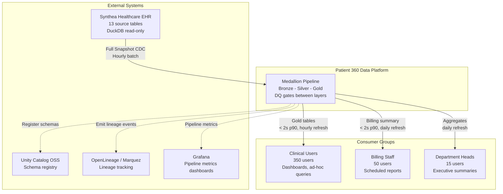
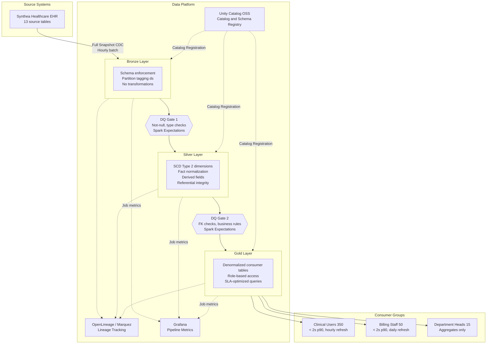
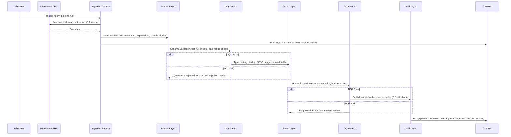

# High-Level Design: Patient 360 Medallion Pipeline

| Field | Value |
|-------|-------|
| **Version** | 1.0 |
| **Created** | 2026-03-16 |
| **Last Modified** | 2026-03-16 |
| **Author** | Architect Agent |
| **Status** | Draft |
| **DRD Reference** | DRD-2026-02-11-patient-360.md (v1.1) |

---

## 1. Executive Summary

The Patient 360 pipeline consolidates 13 Synthea healthcare source tables (13.5M total rows verified, 636 MB raw) into a unified patient view serving 415+ clinical, billing, and administrative users across five role groups. The architecture uses a Medallion pattern (Bronze, Silver, Gold) with Delta Lake for ACID guarantees and SCD Type 2 tracking on patient dimensions. All tables use hourly batch ingestion via Full Snapshot CDC, satisfying the DRD's 1-hour clinical latency SLA [DRD SS4.4] and 2-second query response target [DRD SS4.3] while keeping implementation within the team's demonstrated proficiency in batch Spark pipelines and Delta Lake MERGE INTO [team-capabilities.md SS2]. Pipeline observability combines Spark Expectations for data quality enforcement, OpenLineage/Marquez for lineage tracking, and Grafana for pipeline metrics dashboards.

---

## 2. Architecture Overview

### 2.1 Selected Pattern

**Pattern**: Medallion Architecture (Bronze, Silver, Gold)

**Justification**: The DRD [SS4.4] requires a maximum of 1-hour latency for clinical users and 24-hour latency for billing/reporting consumers. The team has demonstrated high proficiency in Medallion patterns, Delta Lake MERGE INTO, and SCD Type 2 [team-capabilities.md SS2] -- making Medallion the lowest-risk, highest-velocity choice. The 5,767-patient dataset with 13.5M total rows [DRD SS2.3, verified against source database] is well within local-mode Spark capacity and does not justify a streaming architecture. The team is Not Experienced in Streaming [team-capabilities.md SS2], ruling out Lambda and Kappa patterns without an upskilling investment.

### 2.2 Alternatives Considered

| Option | Description | Why Not Selected |
|--------|-------------|------------------|
| Medallion (Bronze/Silver/Gold) | 3-layer batch pipeline with Delta Lake | **Selected** -- team proficient, satisfies all DRD SLAs |
| Lambda Architecture | Dual batch + streaming paths for mixed latency | Over-engineered: DRD requires only 1-hour latency [SS4.4], not sub-minute; team has no streaming experience [team-capabilities.md SS2] |
| Kappa Architecture | Streaming-only with Kafka/Flink reprocessing | Requires Kafka/Flink infrastructure not in technology catalog [technology-catalog.md]; team gap in streaming |
| Data Vault | Hub-satellite modeling with surrogate keys | Team has no practical experience; longer development timeline; no audit-trail requirement in DRD that mandates Data Vault's overhead |

**Trade-off**: Medallion batch cannot achieve sub-minute data freshness. The DRD [SS2.2] notes sub-minute source sync for medications and allergies, but the physician latency SLA [SS4.4] accepts 1-hour maximum. Hourly batch for all tables is the Phase 1 compromise accepted by the user.

### 2.3 System Context Diagram

### 2.4 Pipeline Architecture Diagram

### 2.5 Key Design Principles

- **Idempotency**: All layers partition by `ds` (YYYY-MM-DD); re-running the same `ds` replaces that partition only via `replaceWhere` [infrastructure-constraints.md SS2]
- **Schema enforcement**: All 13 source tables use explicit `StructType` schemas; no schema inference at Bronze [team-capabilities.md SS2]
- **Traceability**: Every pipeline job emits OpenLineage events to Marquez; lineage graph visible across all layers [DRD SS7.5]
- **Separation of concerns**: Bronze = raw immutable copy; Silver = conformed with SCD2 and derived fields; Gold = consumer-ready aggregations
- **Read-only source access**: Source database accessed via `-readonly` flag only; system is read-only by design [DRD SS1.5]

---

## 3. Data Architecture

### 3.1 Layer Strategy

**Bronze Layer**

Preserves source data exactly as received from the Synthea EHR. No business transformations -- only type casting, schema enforcement, and partition tagging with load metadata (`_ingested_at`, `_batch_id`, `_source_file`). Serves as the immutable audit record. All 13 Phase 1 tables land here with idempotent partition replacement per `ds` date [DRD SS2.2]. Tables deferred to Phase 2 (claims_transactions, payer_transitions, devices, supplies, imaging_studies) are excluded [DRD SS2.2].

**Silver Layer**

Applies business logic and data conformance. SCD Type 2 applied to dimension tables (patients, providers, payers, organizations) for historical tracking using SHA-256 change detection and Delta MERGE INTO [team-capabilities.md SS2]. Fact tables (encounters, conditions, medications, observations, allergies, claims, immunizations, careplans, procedures) use insert-only pattern with partition overwrite. Derived fields computed here: `calculated_age`, `medication_status`, `is_30_day_readmission`, `total_visit_cost` [DRD SS5.2]. Referential integrity enforced per DRD [SS3.3]. Default values applied: NULL costs treated as zero [DRD SS5.1], NULL allergy severity set to "Unknown" [DRD SS5.1].

**Gold Layer**

Produces three denormalized, consumer-specific tables aligned to the DRD's consumer groups [SS4.1]:

1. **patient_summary** -- Clinical users (physicians, nurses, care coordinators): demographics, active conditions, active medications, allergies (never suppressed), recent encounters. Serves the 2-second search response SLA [DRD SS4.3].
2. **patient_clinical_history** -- Physicians and nurses: full encounter history, observations, procedures, immunizations, careplans. Supports pre-appointment review use case [DRD SS4.2].
3. **patient_billing_summary** -- Billing staff only: encounter costs, claims, total_visit_cost. Cost fields hidden from non-billing roles [DRD SS5.5].

> Detailed table inventories, column schemas, and per-table write strategies are documented in the **Data Model Specification (DMS)**.

### 3.2 Data Domain Map

**Clinical domain** (patients, encounters, conditions, medications, observations, allergies, immunizations, procedures, careplans) flows through all three layers. This is the core domain serving the Patient 360 search use case [DRD SS1.1].

**Reference domain** (organizations, providers, payers) lands in Bronze and becomes SCD Type 2 dimensions in Silver. These are slowly changing reference tables (1,080 orgs, 1,080 providers, 10 payers) supporting FK relationships [DRD SS3.3].

**Financial domain** (claims) flows Bronze to Silver to Gold billing summary. Restricted to billing staff role per DRD [SS5.5]. Cost fields hidden from clinical views.

### 3.3 SCD Strategy

| Dimension Type | SCD Approach | Rationale |
|----------------|-------------|-----------|
| Patient demographics (5,767 rows) | SCD Type 2 | Track address, name, and insurance changes over time for clinical accuracy [DRD SS1.2]; team proficient with Delta MERGE INTO [team-capabilities.md SS2] |
| Provider attributes (1,080 rows) | SCD Type 2 | Track specialty and organization changes for referential accuracy |
| Payer information (10 rows) | SCD Type 2 | Track plan and coverage changes for billing accuracy |
| Organization data (1,080 rows) | SCD Type 2 | Track organizational restructuring for reporting |
| Fact tables (encounters, conditions, etc.) | Insert-only with partition overwrite | Immutable event records; no history tracking needed -- partition by `ds` for idempotent reruns [infrastructure-constraints.md SS2] |

### 3.4 Data Quality Strategy

Data quality is enforced at layer boundaries using Spark Expectations [technology-catalog.md SS5] with YAML rule definitions per table.

**Bronze gate**: Schema validation (all expected columns present, data types match StructType definition), not-null checks on identity fields (patient `id`), valid range checks on dates (no future dates for birthdate, encounter start/stop) [DRD SS3.2]. Actions: `fail` for identity fields, `drop` for invalid date ranges, `ignore` (log only) for optional fields [DRD SS3.1].

**Silver gate**: Referential integrity validation (FK checks per DRD [SS3.3] -- encounters.patient must exist in patients.id, conditions.encounter must exist in encounters.id, etc.). Null tolerance enforcement per DRD [SS3.4]: 0% for patient name/DOB, 0% for allergy description, 60% ceiling for allergy severity. Business rule validation on derived fields (calculated_age >= 0, total_visit_cost >= 0). Actions: `drop` for RI violations, `fail` if null tolerance thresholds exceeded.

**Gold gate**: Column-level assertions on consumer-facing fields: `patient_id NOT NULL`, `full_name NOT NULL`, allergy arrays never suppressed (allergies with NULL severity displayed as "Unknown") [DRD SS5.4]. Aggregate assertion: all 5,767 patients present in patient_summary [DRD SS4.3 -- 100% data completeness SLA].

---

## 4. Technology Decisions

| Component | Selected Tool | Why |
|-----------|--------------|-----|
| Processing Engine | Apache Spark (PySpark) | Team high proficiency [team-capabilities.md SS1]; handles 4.4M-row observations table in local mode; Delta Lake integration native [technology-catalog.md SS1] |
| Table Format | Delta Lake | ACID writes, time travel for rollback, MERGE INTO for SCD2; mandated by infrastructure constraints [infrastructure-constraints.md SS2] |
| Metastore | Unity Catalog OSS | Catalog/schema hierarchy for table registration; REST API for consumer access [technology-catalog.md SS2] |
| Lineage | OpenLineage + Marquez | HIPAA audit trail support [DRD SS7.5]; captures Bronze to Silver to Gold job-level lineage [technology-catalog.md SS3] |
| Data Quality | Spark Expectations | YAML rule-based DQ enforcement at each layer boundary; row_dq, agg_dq, and query_dq rule types [technology-catalog.md SS5] |
| Pipeline Metrics | Grafana | Dashboard visualization for pipeline runtime, throughput, and error rates; complements Marquez lineage with operational monitoring |
| Containerization | Docker + Docker Compose | All services (Spark, UC, Marquez, PostgreSQL, Grafana) in containers; local dev environment [technology-catalog.md SS4] |
| Language | Python (PySpark) | Team high proficiency [team-capabilities.md SS1]; pytest ecosystem for testing [team-capabilities.md SS4] |

> Detailed technology versions, JAR coordinates, and deployment configurations belong in the **Low-Level Design (LLD)** document.

### 4.1 Key Compatibility Constraints

- Spark 4.x requires Scala 2.13 JARs and Java 11 or 17 [infrastructure-constraints.md SS1]
- UC OSS catalog name must be `spark_catalog` -- Spark's default; arbitrary catalog names require additional configuration [infrastructure-constraints.md SS5]
- OpenLineage port remapped to 5001 on macOS due to AirPlay conflict [infrastructure-constraints.md SS3]
- UC init script must run once after `docker compose up` before first pipeline execution [infrastructure-constraints.md SS5]
- Grafana is a new addition not currently in the technology catalog -- requires team evaluation and catalog update

### 4.2 Technology Trade-offs

- **Delta Lake vendor lock-in**: Acceptable for local dev; Iceberg migration path exists if multi-engine portability needed in production. Infrastructure constraints mandate Delta exclusively [infrastructure-constraints.md SS2]
- **UC OSS 0.4.0 limitations**: No column-level lineage REST API; requires Databricks UC or DataHub for column lineage -- deferred to Phase 2 [infrastructure-constraints.md SS8]
- **Local Spark mode**: Sufficient for 13.5M total rows; cluster mode needed if dataset grows beyond 10x current volume
- **Grafana addition**: Not in current technology catalog; requires team evaluation. Team is Familiar with pre-commit hooks and Docker but Grafana proficiency is unverified [team-capabilities.md SS3]

---

## 5. Integration Architecture

### 5.1 Source Systems

| Source | Type | Access Pattern | Tables Consumed |
|--------|------|---------------|-----------------|
| Synthea Healthcare EHR | DuckDB database (636 MB verified) | Read-only SQL for validation; CSV file read for ingestion [DRD SS2.1] | 13 Phase 1 tables: patients, encounters, conditions, medications, observations, allergies, immunizations, procedures, claims, careplans, organizations, providers, payers |

### 5.2 Consumer Access Pattern

| Consumer Group | Access Method | Gold Tables | SLA |
|---------------|--------------|-------------|-----|
| Physicians (120) | Unity Catalog REST API | patient_summary, patient_clinical_history | < 2s at p90 [DRD SS4.3], hourly refresh [DRD SS4.4] |
| Nurses (200) | Unity Catalog REST API | patient_summary, patient_clinical_history | < 2s at p90 [DRD SS4.3], hourly refresh [DRD SS4.4] |
| Care Coordinators (30) | Unity Catalog REST API | patient_summary | < 2s at p90 [DRD SS4.3], daily refresh [DRD SS4.4] |
| Billing Staff (50) | Unity Catalog REST API | patient_billing_summary | < 2s at p90 [DRD SS4.3], daily refresh [DRD SS4.4] |
| Department Heads (15) | Unity Catalog REST API | patient_summary (aggregates) | < 2s at p90 [DRD SS4.3], daily refresh [DRD SS4.4] |

### 5.3 Observability Strategy

Pipeline observability uses three complementary tools:

1. **OpenLineage + Marquez** [technology-catalog.md SS3]: Every pipeline job emits lineage events capturing input/output dataset relationships. The Marquez web UI provides a visual Bronze to Silver to Gold lineage graph. Supports HIPAA audit trail requirements [DRD SS7.5].

2. **Spark Expectations** [technology-catalog.md SS5]: DQ results logged per layer with pass/fail/warn counts. Rule definitions in YAML enable version-controlled quality gates. Failed records quarantined with rejection reasons.

3. **Grafana**: Pipeline metrics dashboards showing job runtime, throughput (rows/second), error rates, and DQ pass rates. Alert rules trigger notifications when pipeline runtime exceeds 30 minutes or DQ failure rates exceed thresholds.

---

## 6. Scalability & Capacity Model

### 6.1 Current Scale

Total dataset: 13.5M rows across 18 tables (636 MB raw CSV, verified against source database on 2026-03-16). Of these, 13 tables (7.9M rows) are in Phase 1 scope; 5 tables (5.6M rows) are deferred to Phase 2 [DRD SS2.2]. Largest Phase 1 table: observations at 4,366,447 rows. Patient count: 5,767. Estimated Delta storage: approximately 4 GB (Bronze + Silver + Gold combined, accounting for Delta overhead and SCD2 versioning). Estimated full pipeline runtime: 15-20 minutes on local Spark (`local[*]`, 4 GB driver memory).

### 6.2 Growth Model

| Metric | Current (Verified) | Year 1 (5-10%) | Year 3 (5-10% compounded) | Assumption |
|--------|---------|--------|--------|------------|
| Patient count | 5,767 | 6,050-6,340 | 6,670-7,670 | Low growth: stable patient population with modest new registrations [user decision] |
| Phase 1 rows (all tables) | 7.9M | 8.3M-8.7M | 9.1M-10.5M | Linear growth proportional to patient count |
| Observations (largest table) | 4.37M | 4.59M-4.81M | 5.05M-5.81M | ~757 observations per patient [DRD SS2.3] |
| Delta storage (estimated) | ~4 GB | ~4.4-4.8 GB | ~5.2-6.4 GB | Delta compression plus SCD2 version overhead |
| Pipeline runtime (full) | ~15-20 min | ~17-22 min | ~20-27 min | Linear growth with row count on local Spark |

### 6.3 Scaling Levers

- **10x patient volume (~60K patients)**: Migrate from `local[*]` to Spark cluster mode (YARN or Kubernetes); current single-node Docker constraint [infrastructure-constraints.md SS1] is the first bottleneck
- **50 GB Delta storage**: Evaluate cloud object storage (S3/GCS/ADLS) to replace local Docker volume [infrastructure-constraints.md SS2]
- **Pipeline runtime exceeds 30 minutes**: Increase shuffle partitions beyond current 8 [infrastructure-constraints.md SS1]; consider partitioning observations by patient hash
- **Delta small-file proliferation**: Schedule weekly VACUUM and OPTIMIZE operations
- **Re-evaluation trigger**: Any single table exceeding 50M rows or total pipeline runtime exceeding 1 hour warrants architecture review

### 6.4 Cost Model

Phase 1 operates on a developer workstation with Docker -- zero infrastructure cost beyond the developer's machine. Cost drivers scale along two axes:

1. **Compute**: Scales with pipeline runtime (vCPU-hours per run multiplied by runs per day). At hourly cadence with ~20 min runtime, this is approximately 8 vCPU-hours/day on local hardware.
2. **Storage**: Scales with Delta table size (GB/month). At ~4 GB with 5-10% annual growth, storage remains negligible for 3+ years on local hardware.

Cloud migration (when triggered by scaling levers above) introduces per-hour compute costs and per-GB storage costs. The specific cloud platform is an open question [Open Question #2].

> Detailed compute sizing (engine tuning parameters, memory allocations) and monthly cost breakdowns belong in the **Low-Level Design (LLD)** document.

---

## 7. Security & Compliance

### 7.1 Data Classification

| Classification | Examples | Handling Strategy |
|---------------|----------|-------------------|
| PHI - Confidential | Patient name, DOB, SSN, address [DRD SS7.2] | SSN masked to last 4 digits in all layers [DRD SS3.5]; encryption at rest deferred to Phase 2; role-based access at application layer |
| PHI - Clinical | Conditions, medications, allergies, observations [DRD SS7.2] | Clinical role access only [DRD SS5.5]; allergy severity never suppressed -- NULL displayed as "Unknown" [DRD SS5.1, SS5.4] |
| PHI - Safety Critical | Allergies [DRD SS7.2] | Prominent display in all clinical views; zero tolerance for missed alerts [DRD SS1.3]; not suppressible regardless of NULL severity |
| Financial | Claims, encounter costs, total_visit_cost [DRD SS7.2] | Billing role only [DRD SS5.5]; hidden from clinical and administrative Gold tables |
| Internal | Reference data (organizations, providers, payers) | Standard access controls; no PHI restrictions |

### 7.2 Access Strategy

| Role Group | Layer Access | Restrictions | Phase |
|-----------|-------------|-------------|-------|
| Physicians (120) | Gold READ | Full clinical; masked SSN; full address [DRD SS3.5]; no cost columns [DRD SS5.5] | Phase 1 (app-layer masking) |
| Nurses (200) | Gold READ | Full clinical; masked SSN; city/state only [DRD SS3.5]; no cost columns [DRD SS5.5] | Phase 1 (app-layer masking) |
| Care Coordinators (30) | Gold READ | Panel patients; masked SSN; city/state only [DRD SS3.5]; no cost columns [DRD SS5.5] | Phase 1 (app-layer masking) |
| Billing Staff (50) | Gold READ | Demographics + financial only; no clinical notes [DRD SS5.5, SS7.4] | Phase 1 (app-layer masking) |
| Department Heads (15) | Gold READ | Aggregates only; no individual PHI in reports [DRD SS7.4] | Phase 1 (app-layer masking) |
| Data Engineers | All layers READ/WRITE | Pipeline operations via service account | Phase 1 |
| Full RBAC + SSO + MFA | All layers | Column-level enforcement via UC ACLs [DRD SS7.4] | Phase 2 |

### 7.3 Compliance Requirements

HIPAA compliance architecture is a separate workstream per DRD [SS6.1 Assumptions]. Phase 1 focuses on data consolidation with application-layer masking [DRD SS3.5 Note]. The following HIPAA technical safeguards are planned:

- **Access logging**: Log all patient record access with user ID, timestamp, patient ID, and action type [DRD SS7.5] -- implemented via OpenLineage events in Phase 1, extended to application-layer audit logs in Phase 2
- **Encryption at rest**: AES-256 for Delta tables -- deferred to Phase 2 when production environment is selected
- **Encryption in transit**: TLS 1.3 for all service communication -- deferred to Phase 2
- **Retention**: 6-year minimum for patient records [DRD SS7.3]; 7-year for billing/claims; audit logs archived to cold storage after 6 years
- **Breach detection**: Anomalous access pattern alerting -- deferred to Phase 2 [DRD SS7.5]

> Column-level masking rules, specific authentication methods, and encryption key management details belong in the **Low-Level Design (LLD)** document.

---

## 8. Operational Considerations

### 8.1 CDC Strategy

All source tables use Full Snapshot CDC in Phase 1. Database verification confirmed no `updated_at` or `modified_at` columns exist in any of the 18 source tables -- only business date columns (START, STOP, BIRTHDATE, DATE, etc.) are present. This makes Timestamp Watermark CDC unreliable. Log-Based CDC (Debezium) requires Kafka infrastructure not in the technology catalog [technology-catalog.md]. SCD Type 2 change detection in Silver uses SHA-256 hash comparison on dimension rows via Delta MERGE INTO.

| Source Type | CDC Method | Frequency | Rationale |
|------------|-----------|-----------|-----------|
| Clinical tables (encounters, conditions, medications, observations, allergies, immunizations, careplans, procedures) | Full Snapshot | Hourly | Satisfies 1-hour clinical latency SLA [DRD SS4.4]; all tables treated uniformly per user decision |
| Financial tables (claims) | Full Snapshot | Hourly | Consistent with clinical tables; billing SLA allows daily [DRD SS4.4] but hourly simplifies scheduling |
| Reference tables (organizations, providers, payers) | Full Snapshot | Hourly | Very small tables (10-1,080 rows); included in hourly batch for operational simplicity |

**Phase 2 CDC evolution**: Evaluate Timestamp Watermark when source systems provide reliable audit timestamps. True sub-minute CDC for medications/allergies [DRD SS2.2] deferred until streaming infrastructure (Kafka/Structured Streaming) is added to technology catalog and team upskills [team-capabilities.md SS2].

### 8.2 Ingestion Sequence Diagram

### 8.3 Recovery Strategy

| Metric | Target | Justification |
|--------|--------|---------------|
| RTO | 4 hours | Read-only system rebuildable from source EHR; no user data at risk [DRD SS7.6]; user decision |
| RPO | 24 hours (last successful batch) | Hourly batch cadence but source EHR is system of record; worst case is re-ingesting 24 hours of batches [DRD SS7.6]; user decision |
| Production RTO/RPO | [TBD - requires decision from Jennifer Martinez (Compliance)] | DRD SS7.6 defers to Phase 2; due date 2026-04-30 |

### 8.4 Backup Approach

Source data is immutable in the EHR and re-ingestible at any time -- the pipeline can be fully rebuilt from source. Delta Lake time travel provides a 7-day rollback window for investigating data issues without restoring from backup. Unity Catalog and Marquez metadata are stored in named Docker volumes (`unitycatalog_data`, `marquez_data`) with daily backup [infrastructure-constraints.md SS2]. All pipeline code is version-controlled in Git.

Recovery procedure: re-run the pipeline from Bronze through Gold for the affected `ds` partitions. Idempotent partition replacement [infrastructure-constraints.md SS2] ensures re-runs produce identical results.

> Detailed recovery runbooks and per-table CDC configurations belong in the **Low-Level Design (LLD)** document.

---

## 9. Decision Log

### Decision 1: Architecture Pattern -- Medallion vs. Lambda/Kappa/Data Vault

**Options Considered**:
1. Medallion (Bronze/Silver/Gold) -- batch pipeline, team high proficiency
2. Lambda Architecture -- dual batch + streaming paths
3. Kappa Architecture -- streaming-only with reprocessing
4. Data Vault -- hub-satellite with surrogate keys for audit trails

**Selected**: Medallion (Bronze/Silver/Gold)

**Rationale**: DRD [SS4.4] requires 1-hour maximum latency for clinical users and 24-hour for others -- no sub-minute requirement at the query level. Team has demonstrated high proficiency in Medallion + Delta Lake [team-capabilities.md SS2]. Infrastructure is local Docker with no Kafka/Flink [technology-catalog.md]. User confirmed this selection.

**Trade-off**: Cannot achieve sub-minute data freshness for medications/allergies [DRD SS2.2]. Hourly batch is the Phase 1 compromise. Sub-minute CDC deferred to Phase 2 with streaming infrastructure.

### Decision 2: CDC Method -- Hourly Full Snapshot for All Tables

**Options Considered**:
1. Micro-batch (1-5 minute polling with timestamp-based CDC)
2. Spark Structured Streaming (trigger-once or continuous)
3. Hourly Full Snapshot for all tables uniformly

**Selected**: Hourly Full Snapshot for all tables

**Rationale**: Source database has no `updated_at` or `modified_at` columns (verified via database query on 2026-03-16), making timestamp-based CDC unreliable. Team is Not Experienced in Streaming [team-capabilities.md SS2]. Hourly cadence satisfies the 1-hour clinical latency SLA [DRD SS4.4]. User confirmed acceptance of hourly batch for all tables including medications/allergies.

**Trade-off**: Full Snapshot scans entire source tables each run. For observations (4.37M rows), this adds processing time per run. Acceptable at current scale (estimated 15-20 min total pipeline runtime). Evaluate incremental CDC in Phase 2 when source systems provide audit timestamps.

### Decision 3: SCD Strategy -- Type 2 with Versioned Rows

**Options Considered**:
1. SCD Type 1 -- overwrite with latest value, no history
2. SCD Type 2 -- versioned rows with effective dates
3. Full snapshot -- daily full reload, simplest approach

**Selected**: SCD Type 2 with versioned rows and effective dates

**Rationale**: Team is Proficient with Delta MERGE INTO for SCD2 [team-capabilities.md SS2]. Patient demographics (address, insurance) change over time and clinical accuracy requires historical tracking [DRD SS1.2]. SHA-256 hash comparison detects changes efficiently on dimension tables (max 5,767 rows for patients). User confirmed this selection.

**Trade-off**: SCD Type 2 increases Silver storage due to historical versions and adds MERGE INTO complexity. Acceptable because dimension tables are small (patients: 5,767 rows; providers: 1,080; payers: 10) and the team has proven proficiency.

### Decision 4: Storage Format -- Delta Lake

**Options Considered**:
1. Delta Lake -- ACID, time travel, MERGE INTO, team high proficiency
2. Apache Iceberg -- multi-engine portability, no team experience
3. Apache Hudi -- upsert-optimized, no team experience

**Selected**: Delta Lake

**Rationale**: Infrastructure constraints mandate Delta Lake exclusively [infrastructure-constraints.md SS2]. Team has high proficiency in Delta MERGE INTO for SCD2 [team-capabilities.md SS2]. No alternatives permitted by infrastructure policy.

**Trade-off**: Vendor lock-in to Databricks ecosystem. Acceptable for local dev; Iceberg migration path exists if multi-engine portability needed in production.

### Decision 5: Gold Table Design -- 3 Consumer-Aligned Tables

**Options Considered**:
1. Three consumer-aligned tables (patient_summary, patient_clinical_history, patient_billing_summary)
2. One wide denormalized patient_360 table for all consumers
3. Per-consumer tables (5+ tables, one per role group)

**Selected**: Three consumer-aligned tables

**Rationale**: DRD [SS4.1] identifies three distinct consumer access patterns with different data needs. DRD [SS5.5] requires cost data hidden from non-billing roles -- separate tables enforce this separation at the schema level rather than relying solely on application-layer masking.

**Trade-off**: Three Gold tables require three separate pipeline jobs instead of one. Acceptable because Gold tables are small (base of 5,767 patient rows) and compute cost is minimal.

### Decision 6: Monitoring -- Spark Expectations + Marquez + Grafana

**Options Considered**:
1. Spark Expectations + Marquez only (tools already in catalog)
2. Spark Expectations + Marquez + Grafana (adds pipeline metrics dashboards)
3. Minimal application logging only

**Selected**: Spark Expectations + Marquez + Grafana

**Rationale**: Spark Expectations provides DQ enforcement at layer boundaries [technology-catalog.md SS5]. Marquez provides lineage tracking for HIPAA audit support [DRD SS7.5]. Grafana adds operational visibility with pipeline runtime dashboards, throughput metrics, and alerting -- filling the gap between data quality (Spark Expectations) and data lineage (Marquez). User requested both DQ/lineage and pipeline metrics.

**Trade-off**: Grafana is not currently in the approved technology catalog [technology-catalog.md] and team proficiency is unverified. Requires catalog update and team evaluation. Accepted because Grafana is a standard, widely-adopted tool with low learning curve for dashboard creation.

### Decision 7: Recovery Targets -- Relaxed DR (RTO 4h / RPO 24h)

**Options Considered**:
1. Relaxed DR: RTO 4 hours / RPO 24 hours
2. Standard DR: RTO 1 hour / RPO 1 hour
3. Defer entirely to Phase 2

**Selected**: Relaxed DR (RTO 4 hours / RPO 24 hours)

**Rationale**: System is read-only [DRD SS1.5] and rebuildable from the authoritative source EHR at any time. No user-generated data is at risk. DRD [SS7.6] notes DR requirements are TBD for Phase 1. User confirmed relaxed targets are appropriate for a development/Phase 1 environment.

**Trade-off**: 4-hour RTO means clinical users could lose access to Patient 360 search for up to 4 hours during an outage. Acceptable because source EHR systems remain available for direct lookup during outages. Production RTO/RPO targets require compliance review [Open Question #3].

---

## 10. Open Questions & Risks

### Open Questions

| # | Question | Assigned To | Due Date | Status |
|---|----------|-------------|----------|--------|
| 1 | How will fuzzy name matching be implemented for patient search (Soundex, Levenshtein, other)? | Michael Torres (CIO) | 2026-02-28 | Open [DRD SS6.2 #1] |
| 2 | Which cloud platform for production deployment (Databricks, EMR, Dataproc)? Team is Not Experienced in all three [team-capabilities.md SS3]. | Michael Torres (CIO) | 2026-06-01 | Open |
| 3 | What are the production RTO/RPO targets? Phase 1 uses 4h/24h; production targets require compliance review. | Jennifer Martinez (Compliance) | 2026-04-30 | Open [DRD SS7.6] |
| 4 | Should schema evolution use `mergeSchema = true` or versioned schemas? Team is Familiar (not Proficient) with schema evolution [team-capabilities.md SS2]. | Data Engineering Team | 2026-04-15 | Open |
| 5 | Column-level lineage strategy for production (DataHub vs. Databricks UC)? UC OSS 0.4.0 has no column-level lineage API [infrastructure-constraints.md SS8]. | Data Engineering Team | 2026-06-01 | Open |
| 6 | Grafana proficiency assessment -- team capability for Grafana dashboard creation and alerting is unverified. | Data Engineering Team | 2026-04-15 | Open |
| 7 | What is the retention policy for deceased patient records? | Compliance Team | 2026-02-28 | Open [DRD SS6.2 #4] |

### Key Risks

| Risk | Impact | Likelihood | Mitigation |
|------|--------|-----------|------------|
| Observations table (4.37M rows) hourly full snapshot exceeds local Spark memory or SLA | Pipeline failures, data freshness SLA breach | Low -- well within 4 GB driver memory [infrastructure-constraints.md SS1] | Monitor runtime via Grafana; scale to cluster mode at 10x volume; increase shuffle partitions if runtime exceeds 30 min |
| HIPAA audit requirements not fully met in Phase 1 | Compliance gap if production traffic routed through Phase 1 | Medium -- Phase 1 is dev-only | Phase 2 adds encryption at rest, full audit logging, SSO + MFA [DRD SS7.4]; Phase 1 restricted to development use |
| Team unfamiliar with UC OSS 0.4.0 (Familiar, not Proficient) | Slower development, misconfiguration of catalog | Medium | Allocate upskilling time; use `spark_catalog` default to reduce configuration complexity [infrastructure-constraints.md SS5] |
| Source database adds columns without notice | Bronze schema enforcement failures | Low | Use `mergeSchema` option in Bronze reads; enforce strict schema-on-write in Silver; alert on schema drift |
| Grafana not in approved technology catalog | Potential rejection during architecture review | Medium | Submit catalog update request; if rejected, fall back to Marquez + Spark Expectations only (Decision 6 Option 1) |
| Full Snapshot CDC becomes unsustainable at 10x scale | Pipeline runtime exceeds 1 hour; hourly SLA missed | Low (3+ years at 5-10% growth) | Re-evaluation trigger at 50M rows or 1-hour runtime; evaluate Timestamp Watermark CDC when source provides audit columns |

---

## 11. Appendix

### Version History

| Version | Date | Author | Changes |
|---------|------|--------|---------|
| 1.0 | 2026-03-16 | Architect Agent | Initial HLD: Medallion pattern; hourly Full Snapshot CDC for all tables; SCD Type 2 on dimensions; 3 consumer-aligned Gold tables; Spark Expectations + Marquez + Grafana observability; relaxed DR (4h RTO / 24h RPO) |

### Approval

| Role | Name | Date | Signature |
|------|------|------|-----------|
| Technical Sponsor | Michael Torres | _Pending_ | __________ |
| Business Sponsor | Dr. Sarah Chen | _Pending_ | __________ |
| Compliance/Privacy | Jennifer Martinez | _Pending_ | __________ |
| Clinical Operations | Lisa Park | _Pending_ | __________ |

### Related Documents

- **DRD**: DRD-2026-02-11-patient-360.md (v1.1) -- source requirements
- **DMS**: Data Model Specification (downstream -- defines table schemas, column details, and write strategies)
- **LLD**: Low-Level Design (downstream -- defines deployment configs, technology versions, JAR coordinates, and operational runbooks)
