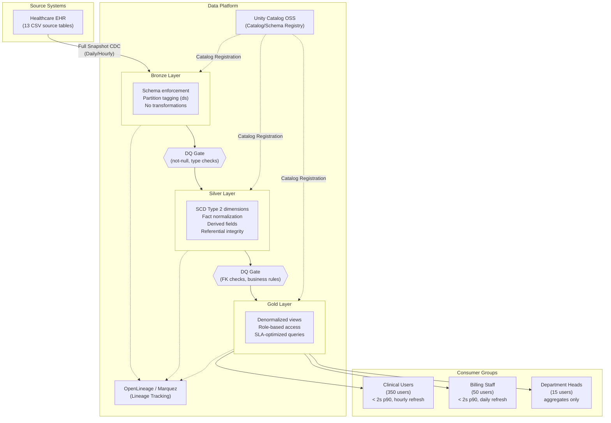

# High-Level Design: Patient 360 Medallion Pipeline

| Field | Value |
|-------|-------|
| **Version** | 1.0 |
| **Created** | 2026-03-16 |
| **Last Modified** | 2026-03-16 |
| **Author** | Architect Agent |
| **Status** | Draft |
| **DRD Reference** | DRD-2026-02-11-patient-360.md (v1.1) |

---

## 1. Executive Summary

The Patient 360 pipeline consolidates 13 Synthea healthcare source tables into a unified patient view serving 415+ clinical, billing, and administrative users across five role groups. The architecture uses a Medallion pattern (Bronze, Silver, Gold) with Delta Lake for ACID guarantees and SCD Type 2 tracking on patient dimensions. This design satisfies the DRD's 1-hour clinical latency SLA [DRD 4.4] and 2-second search response target [DRD 4.3] while keeping implementation within the team's demonstrated proficiency in batch Spark pipelines and Delta Lake MERGE INTO [team-capabilities.md 2]. Phase 1 runs entirely on local Docker infrastructure with $0 cloud cost; production migration is deferred to Phase 2.

---

## 2. Architecture Overview

### 2.1 Selected Pattern

**Pattern**: Medallion Architecture (Bronze, Silver, Gold)

**Justification**: The DRD [4.4] requires a maximum of 1-hour latency for clinical users and 24-hour latency for billing and reporting consumers. The team has demonstrated high proficiency in Medallion patterns, Delta Lake MERGE INTO, and SCD Type 2 [team-capabilities.md 2], making Medallion the lowest-risk, highest-velocity choice. The 5,767-patient dataset with approximately 6.9M total rows [DRD 2.3] is well within local-mode Spark capacity and does not justify a streaming architecture.

### 2.2 Alternatives Considered

| Option | Description | Why Not Selected |
|--------|-------------|------------------|
| Medallion (Bronze/Silver/Gold) | 3-layer batch pipeline with Delta Lake | **Selected** -- team proficient, satisfies all DRD SLAs |
| Lambda Architecture | Dual batch + streaming paths | Over-engineered: DRD requires only 1-hour latency, not sub-minute; team has no streaming experience [team-capabilities.md 2] |
| Kappa Architecture | Streaming-only with Kafka/Flink reprocessing | Requires infrastructure not in technology catalog [technology-catalog.md]; team not experienced in streaming |
| Data Vault | Hub-satellite modeling with surrogate keys | Team awareness-level only; longer delivery timeline; no audit-trail requirement that mandates Data Vault |

**Trade-off**: Medallion batch cannot achieve sub-minute data freshness. The DRD [4.4] confirms 1-hour maximum latency for clinical users is acceptable. Medications and allergies have sub-minute source sync [DRD 2.2] but Phase 1 uses hourly batch as a compromise; true sub-minute CDC is deferred to Phase 2.

### 2.3 Architecture Diagram

### 2.4 Key Design Principles

- **Idempotency**: All layers partition by `ds` (YYYY-MM-DD); re-running the same `ds` replaces that partition only via `replaceWhere` [infrastructure-constraints.md 2]
- **Schema enforcement**: All 13 source tables use explicit `StructType` schemas at Bronze ingestion; no schema inference
- **Traceability**: Every pipeline job emits OpenLineage events to Marquez; lineage graph visible across all layers
- **Separation of concerns**: Bronze = raw copy; Silver = conformed with SCD2; Gold = business-ready aggregations
- **Read-only source**: Source database accessed via `-readonly` flag only; system is read-only per DRD [1.5]

---

## 3. Data Architecture

### 3.1 Layer Strategy

**Bronze Layer**: Preserves source data exactly as received from Synthea CSVs. No transformations -- only type casting, schema enforcement, and partition tagging with the `ds` load date column. Serves as the immutable audit record. All 13 Phase 1 tables land here with idempotent partition replacement per `ds` date [DRD 2.2].

**Silver Layer**: Applies SCD Type 2 to dimension tables (patients, providers, payers, organizations) for historical tracking using SHA-256 change detection via Delta Lake MERGE INTO. Fact tables (encounters, conditions, medications, observations, allergies, claims, immunizations, careplans, procedures) use insert-only pattern with partition overwrite. Derived fields computed here: `calculated_age`, `medication_status`, `is_30_day_readmission`, `total_visit_cost` [DRD 5.2]. Referential integrity enforced across all child-parent relationships [DRD 3.3].

**Gold Layer**: Produces three denormalized, consumer-specific aggregation tables aligned to the DRD's consumer groups [DRD 4.1]:

- **patient_summary**: Clinical demographics, active conditions, active medications, allergies, recent encounters. Serves physicians (120), nurses (200), and care coordinators (30) [DRD 4.2].
- **patient_clinical_history**: Full encounter timeline with conditions, procedures, observations, immunizations, and careplans. Serves physicians and nurses for point-of-care lookups [DRD 4.2].
- **patient_billing_summary**: Encounter costs, claims, payment tracking, and readmission flags. Serves billing staff (50) exclusively [DRD 5.5].

Optimized for sub-2-second query response at 90th percentile [DRD 4.3].

> Detailed table inventories, column schemas, and per-table write strategies are documented in the **Data Model Specification (DMS)**.

### 3.2 Data Domain Map

**Clinical domain** (patients, encounters, conditions, medications, observations, allergies, immunizations, procedures, careplans) flows through all three layers. This is the core domain serving the Patient 360 use case, representing the largest data volume at approximately 6.3M rows across 9 tables.

**Reference domain** (organizations, providers, payers) lands in Bronze and becomes SCD Type 2 dimensions in Silver. These are slowly changing reference tables (2,170 total rows) supporting foreign key relationships and providing context enrichment.

**Financial domain** (claims) flows Bronze, Silver, Gold billing summary. Contains 630,668 rows and is restricted to billing staff per DRD [5.5]. Cost columns are hidden from all non-billing roles [DRD 5.5].

### 3.3 SCD Strategy

| Dimension Type | SCD Approach | Rationale |
|----------------|-------------|-----------|
| Patient demographics | SCD Type 2 | Track address, name, and insurance changes over time for clinical accuracy and patient safety [DRD 1.2] |
| Provider attributes | SCD Type 2 | Track specialty and organization changes to maintain historical encounter attribution |
| Payer information | SCD Type 2 | Track plan changes for accurate billing reconciliation and claims history [DRD 4.2] |
| Organization data | SCD Type 2 | Track organizational restructuring and facility changes |

All SCD Type 2 implementations use SHA-256 hash comparison on mutable columns to detect changes, with `effective_start_date`, `effective_end_date`, and `is_current` flags managed by Delta Lake MERGE INTO.

### 3.4 Data Quality Strategy

**Bronze gate**: Schema validation (all expected columns present, data types match StructType definitions), not-null checks on identity fields (`patients.id`, `encounters.patient`) [DRD 3.1], valid range checks on dates (no future birthdates, no future encounter dates) [DRD 3.2]. Actions: `fail` pipeline for identity field violations, `drop` rows with invalid date ranges, `warn` for optional field anomalies.

**Silver gate**: Referential integrity enforcement across all 12 FK relationships defined in DRD [3.3] (encounters to patients, conditions to encounters, etc.). Null tolerance enforcement per DRD [3.4]: 0% for patient name/DOB, 0% for allergy description, 60% threshold for allergy severity. Business rule validation for derived fields (`calculated_age` must be non-negative, `total_visit_cost` must be non-negative). Duplicate detection on patients using SSN + DOB + name with less than 1% tolerance [DRD 3.4].

**Gold gate**: Consumer-facing assertions: `patient_id NOT NULL`, `full_name NOT NULL`, allergy arrays never suppressed (even with NULL severity -- display as "Unknown") [DRD 5.4]. Cost fields present in billing summary but absent from clinical tables [DRD 5.5]. Deceased flag prominently available when applicable [DRD 5.4].

All DQ rules authored as YAML using Spark Expectations [technology-catalog.md 5], organized by layer in `expectations/<layer>/` directories.

---

## 4. Technology Decisions

| Component | Selected Tool | Why |
|-----------|--------------|-----|
| Processing Engine | Apache Spark (PySpark) | Team high proficiency [team-capabilities.md 1, 2]; handles 4.4M-row observations table in local mode; native Delta Lake integration |
| Table Format | Delta Lake | ACID writes, time travel, MERGE INTO for SCD2; mandated by infrastructure constraints [infrastructure-constraints.md 2]; team proficient |
| Metastore | Unity Catalog OSS | Catalog/schema hierarchy (`spark_catalog.bronze.patients`); REST API for consumer access; approved in technology catalog [technology-catalog.md 2] |
| Lineage | OpenLineage + Marquez | HIPAA audit trail requirement [DRD 7.5]; captures Bronze to Silver to Gold lineage per job; approved in technology catalog [technology-catalog.md 3] |
| Data Quality | Spark Expectations | Rule-based DQ enforcement at each layer boundary; YAML rule definitions for maintainability; approved in technology catalog [technology-catalog.md 5] |
| Language | Python (PySpark) | Team high proficiency [team-capabilities.md 1]; pytest ecosystem for pipeline testing; UV package management |
| Containerization | Docker + Docker Compose | All services (UC, Marquez, PostgreSQL, Spark) containerized; team proficient [team-capabilities.md 3] |
| Orchestration | Airflow | Team proficient [team-capabilities.md 3]; manages Bronze to Silver to Gold dependency chain; supports hourly and daily schedules |

> Detailed technology versions, JAR coordinates, and deployment configurations belong in the **Low-Level Design (LLD)** document.

### 4.1 Key Compatibility Constraints

- Spark 4.x requires Scala 2.13 JARs and Java 11 or 17 [infrastructure-constraints.md 1]
- UC OSS catalog name must be `spark_catalog` -- Spark's default; cannot use arbitrary catalog names [infrastructure-constraints.md 5]
- OpenLineage port remapped to 5001 on macOS host due to AirPlay conflict [infrastructure-constraints.md 3]
- UC bootstrap script must run once after `docker compose up` before first pipeline execution [infrastructure-constraints.md 5]
- All services run inside Docker containers on a single host -- no cluster mode [infrastructure-constraints.md 1]

### 4.2 Technology Trade-offs

- **Delta Lake vendor lock-in**: Acceptable for local dev; Iceberg migration path exists if multi-engine portability is needed in production. Infrastructure constraints mandate Delta Lake exclusively [infrastructure-constraints.md 2].
- **UC OSS 0.4.0 limitations**: No column-level lineage REST API; column lineage requires Databricks UC or DataHub -- deferred to Phase 2 [Open Question 5]
- **Local Spark mode**: Sufficient for 6.9M rows; move to cluster mode if dataset grows to 10x current volume (approximately 60K patients)
- **Marquez `latest` tag**: Non-deterministic builds; should pin to specific version for production reproducibility [infrastructure-constraints.md 8]

---

## 5. Integration Architecture

### 5.1 Source Systems

| Source | Type | Access Pattern | Tables Consumed |
|--------|------|---------------|-----------------|
| Synthea Healthcare EHR | DuckDB database (CSV-backed) | Read-only SQL for validation; CSV file read for Spark ingestion | 13 Phase 1 tables: patients, encounters, conditions, medications, observations, allergies, immunizations, procedures, claims, careplans, organizations, providers, payers [DRD 2.2] |

### 5.2 Consumer Access Pattern

| Consumer Group | Access Method | Gold Tables | SLA |
|---------------|--------------|-------------|-----|
| Physicians (120) | Unity Catalog REST API | patient_summary, patient_clinical_history | < 2s at p90, hourly refresh [DRD 4.3, 4.4] |
| Nurses (200) | Unity Catalog REST API | patient_summary, patient_clinical_history | < 2s at p90, hourly refresh [DRD 4.3, 4.4] |
| Care Coordinators (30) | Unity Catalog REST API | patient_summary | < 2s at p90, daily refresh [DRD 4.3, 4.4] |
| Billing Staff (50) | Unity Catalog REST API | patient_billing_summary | < 2s at p90, daily refresh [DRD 4.3, 4.4] |
| Department Heads (15) | Unity Catalog REST API | patient_summary (aggregates only) | < 2s at p90, daily refresh [DRD 4.3, 4.4] |

### 5.3 Observability Strategy

Every pipeline job emits OpenLineage events capturing job-level lineage (input datasets to output datasets). The Marquez backend stores these events and provides a web UI for visualizing the full Bronze to Silver to Gold lineage graph. Spark Expectations DQ results are logged per layer with pass/fail/warn counts, enabling data engineers to identify quality degradation across pipeline runs.

Access logging for HIPAA compliance [DRD 7.5] is handled at the application layer in Phase 1, logging user ID, timestamp, patient ID, and action type. Full audit infrastructure is deferred to Phase 2.

---

## 6. Scalability & Capacity Model

### 6.1 Current Scale

Total dataset: approximately 6.9M rows across 13 Phase 1 tables. Database size: 636 MB raw. Largest table: observations at 4,366,447 rows. Patient count: 5,767. All volumes verified against the source database on 2026-03-16 and match DRD [2.3] exactly. Estimated Delta Lake storage: approximately 3.8 GB (Delta compression plus metadata overhead versus raw CSV).

### 6.2 Growth Model

| Metric | Current | Year 1 | Year 3 | Assumption |
|--------|---------|--------|--------|------------|
| Patient count | 5,767 | ~6,000 | ~6,500 | ~200 new patients/year (~3.5% annual growth) |
| Total rows (all tables) | ~6.9M | ~7.1M | ~7.6M | Linear growth proportional to patient count |
| Storage (Delta) | ~3.8 GB | ~4.2 GB | ~5.0 GB | Delta compression approximately 30% overhead vs CSV |
| Pipeline runtime (full) | ~15 min | ~16 min | ~18 min | Linear growth with row count on local Spark |
| Concurrent users | 415 | ~450 | ~500 | Proportional to staffing growth |

**Growth assumptions**: Patient growth based on typical single-facility healthcare provider intake rates. Observations per patient ratio (~757) assumed stable. Growth projections are conservative; re-evaluate at 10x volume threshold.

### 6.3 Scaling Levers

- **10x patient volume (~60K patients)**: Migrate from `local[*]` to Spark cluster mode (EMR, Databricks, or Dataproc); increase shuffle partitions beyond current 8
- **50 GB Delta storage**: Evaluate cloud object storage (S3, GCS, or ADLS) to replace local Docker volumes
- **Pipeline runtime exceeds 30 minutes**: Increase shuffle partitions for observations table; evaluate incremental CDC over full snapshot
- **Small file proliferation**: Schedule weekly VACUUM on Delta tables to compact small files from partition overwrites
- **Concurrent user threshold (500+)**: Evaluate read replica or caching layer for Gold tables

### 6.4 Cost Model

Phase 1 runs on local developer workstations with Docker -- $0 infrastructure cost beyond hardware. Cloud migration cost scales along two axes: (1) compute hours (vCPU-hour pricing) for Spark processing, proportional to pipeline runtime and frequency; (2) storage volume (GB/month) for Delta tables, growing linearly with data volume. Cloud platform decision is pending [Open Question 2]. The cost model remains linear with data growth given the batch processing pattern -- no fixed-cost streaming infrastructure.

> Detailed compute sizing (memory allocations, Spark configs, shuffle partitions) and monthly cost breakdowns belong in the **Low-Level Design (LLD)** document.

---

## 7. Security & Compliance

### 7.1 Data Classification

| Classification | Examples | Handling Strategy |
|---------------|----------|-------------------|
| PHI - High Sensitivity | SSN | Masked to last 4 digits in all views [DRD 3.5]; encrypted at rest in Phase 2; audit all access |
| PHI - Standard | Patient name, DOB, address, phone | Role-based access; address restricted by role [DRD 3.5]; encrypted at rest in Phase 2 |
| PHI - Clinical | Conditions, medications, allergies, observations, procedures | Clinical role access only [DRD 5.5]; allergy severity never suppressed [DRD 5.4]; encrypted at rest in Phase 2 |
| PHI - Financial | Claims, encounter costs, procedure costs, medication costs | Billing role only [DRD 5.5]; hidden from clinical and administrative views |
| Internal | Organizations, providers, payers (reference data) | Standard access controls; no PHI exposure |

### 7.2 Access Strategy

| Role Group | Layer Access | Restrictions | Phase |
|-----------|-------------|-------------|-------|
| Physicians (120) | Gold READ only | No cost columns; SSN masked; full address visible [DRD 3.5] | Phase 1 (app-layer) |
| Nurses (200) | Gold READ only | No cost columns; SSN masked; city/state only [DRD 3.5] | Phase 1 (app-layer) |
| Care Coordinators (30) | Gold READ only | No cost columns; SSN masked; city/state only [DRD 3.5] | Phase 1 (app-layer) |
| Billing Staff (50) | Gold READ only | No clinical notes; full cost visibility [DRD 5.5] | Phase 1 (app-layer) |
| Department Heads (15) | Gold READ only | Aggregates only; no individual PHI in reports [DRD 7.4] | Phase 1 (app-layer) |
| Data Engineers | All layers READ/WRITE | Pipeline service account; no restrictions on Bronze/Silver/Gold | Phase 1 |
| Full RBAC + SSO + MFA | All layers | Column-level enforcement; database-level row/column security | Phase 2 [DRD 7.4] |

### 7.3 Compliance Requirements

HIPAA compliance is a separate workstream per DRD [6.1 Assumptions]. Phase 1 focuses on data consolidation with application-layer masking [DRD 3.5]. The following HIPAA technical safeguards are deferred to Phase 2 when the production environment is selected:

- **Encryption at rest**: AES-256 for all Delta tables containing PHI
- **Encryption in transit**: TLS 1.3 for all service-to-service communication
- **Access logging**: Comprehensive audit logging of all patient record access with user ID, timestamp, patient ID, and action type [DRD 7.5]
- **Breach detection**: Anomalous access pattern alerting (volume spikes, off-hours access) [DRD 7.5]
- **Retention**: 6-year minimum for adult patient records; 7-year for billing/claims [DRD 7.3]
- **Audit query SLA**: Audit data retrievable within 72 hours for compliance investigations [DRD 7.5]

> Column-level masking rules, specific authentication methods, and encryption key management details belong in the **Low-Level Design (LLD)** document.

---

## 8. Operational Considerations

### 8.1 CDC Strategy

All source tables use Full Snapshot in Phase 1. The source database has no reliable `updated_at` or `modified_at` columns (verified via `information_schema.columns` query on 2026-03-16), making Timestamp Watermark unreliable. Log-Based CDC (Debezium) requires Kafka infrastructure not in the technology catalog [technology-catalog.md]. SCD Type 2 in Silver detects changes via SHA-256 hash comparison using Delta Lake MERGE INTO.

| Source Type | CDC Method | Frequency | Rationale |
|------------|-----------|-----------|-----------|
| Static reference tables (organizations, providers, payers) | Full Snapshot | Weekly | Less than 1,100 rows each; changes are rare; weekly is sufficient |
| Safety-critical tables (medications, allergies) | Full Snapshot | Hourly | Phase 1 compromise for DRD sub-minute requirement [DRD 2.2]; 5,607-290K rows manageable at hourly cadence |
| Medium transactional tables (conditions, immunizations, careplans) | Full Snapshot | Daily | Daily batch satisfies 24-hour freshness SLA [DRD 4.4]; 19K-210K rows |
| Large transactional tables (encounters, observations, claims, procedures) | Full Snapshot | Daily | 340K-4.4M rows; daily full reload acceptable at current scale; satisfies SLA [DRD 4.4] |

**Phase 2 CDC evolution**: Evaluate Timestamp Watermark when source systems provide reliable update timestamps. True sub-minute CDC for medications and allergies requires streaming infrastructure (Structured Streaming or Debezium + Kafka) and team upskilling [team-capabilities.md 2].

### 8.2 Recovery Strategy

| Metric | Target | Justification |
|--------|--------|---------------|
| RTO | 4 hours | Read-only system; source CSVs are authoritative; full pipeline rebuild from source within 4 hours [DRD 7.6] |
| RPO | 24 hours (last daily batch) | Daily batch cadence means maximum 24 hours of data loss; source EHR is system of record [DRD 7.6] |
| Production RTO/RPO | [TBD - requires decision from Jennifer Martinez (Compliance)] | DRD 7.6 marks production DR as Phase 2; due date 2026-04-30 |

### 8.3 Backup Approach

Source CSVs are immutable and re-ingestible at any time from the EHR system. Delta Lake time travel provides a 7-day rollback window for all Bronze, Silver, and Gold tables. Unity Catalog metadata and Marquez lineage data are stored in named Docker volumes (`unitycatalog_data`, `marquez_data`) with daily volume snapshots. Pipeline code is versioned in Git. Full rebuild from source is the primary DR strategy for Phase 1.

> Detailed recovery runbooks and per-table CDC configurations belong in the **Low-Level Design (LLD)** document.

---

## 9. Decision Log

### Decision 1: Architecture Pattern -- Medallion vs. Lambda/Kappa/Data Vault

**Options Considered**:
1. Medallion (Bronze/Silver/Gold) -- batch pipeline, team high proficiency
2. Lambda Architecture -- dual batch + streaming paths
3. Kappa Architecture -- streaming-only with reprocessing
4. Data Vault -- hub-satellite with surrogate keys for audit trails

**Selected**: Medallion (Bronze/Silver/Gold)

**Rationale**: DRD [4.4] requires 1-hour maximum latency for clinical users and 24-hour for others -- no sub-minute requirement at the query level. Team has demonstrated high proficiency in Medallion + Delta Lake [team-capabilities.md 2]. Infrastructure is local Docker with no Kafka/Flink [technology-catalog.md]. Lambda and Kappa require streaming experience the team does not have [team-capabilities.md 2]. Data Vault adds modeling complexity without a corresponding audit-trail requirement.

**Trade-off**: Cannot achieve sub-minute data freshness. Hourly batch is the Phase 1 acceptable compromise for medications and allergies [DRD 2.2].

### Decision 2: Storage Format -- Delta Lake vs. Iceberg vs. Hudi

**Options Considered**:
1. Delta Lake -- ACID, time travel, MERGE INTO, team high proficiency
2. Apache Iceberg -- multi-engine portability, no team experience
3. Apache Hudi -- upsert-optimized, no team experience

**Selected**: Delta Lake

**Rationale**: Infrastructure constraints mandate Delta Lake exclusively [infrastructure-constraints.md 2]. Team has high proficiency in Delta MERGE INTO for SCD2 [team-capabilities.md 2]. No multi-engine requirement in Phase 1.

**Trade-off**: Vendor lock-in to Databricks ecosystem. Acceptable for local dev; Iceberg migration path exists if multi-engine portability is needed in production.

### Decision 3: CDC Method -- Full Snapshot vs. Timestamp vs. Log-Based

**Options Considered**:
1. Full Snapshot -- reload entire table each run
2. Timestamp Watermark -- filter by `updated_at` column
3. Log-Based CDC (Debezium) -- transaction log capture

**Selected**: Full Snapshot for all tables in Phase 1

**Rationale**: Source database verified to have no `updated_at` or `modified_at` columns (confirmed via database query). Log-Based CDC requires Kafka infrastructure not in the approved technology catalog [technology-catalog.md]. Full Snapshot with Delta `replaceWhere` on `ds` partition is idempotent and sufficient for current dataset sizes [infrastructure-constraints.md 2].

**Trade-off**: Full Snapshot scans entire source table each run. For observations (4.4M rows), this adds approximately 5 minutes to pipeline runtime. Evaluate Timestamp Watermark in Phase 2 when sources provide reliable update timestamps.

### Decision 4: Gold Table Design -- 3 Consumer-Aligned Tables

**Options Considered**:
1. 3 consumer-aligned tables (patient_summary, patient_clinical_history, patient_billing_summary)
2. 1 wide denormalized patient_360 table for all consumers
3. Per-consumer tables (5+ tables, one per role group)

**Selected**: 3 consumer-aligned tables

**Rationale**: DRD [4.1] identifies three distinct consumer access patterns with different data needs (clinical lookup, clinical history, billing). DRD [5.5] requires cost data hidden from non-billing roles -- separate tables enforce this separation at the schema level rather than relying solely on application-layer filtering.

**Trade-off**: 3 Gold tables require 3 separate pipeline jobs instead of 1. Acceptable because Gold tables are small (5,767 patient rows each) and compute cost is minimal.

### Decision 5: SCD Strategy -- Type 2 vs. Type 1 vs. No SCD

**Options Considered**:
1. SCD Type 2 with versioned rows (effective_start_date, effective_end_date, is_current)
2. SCD Type 1 (overwrite, no history)
3. No SCD (snapshot-only)

**Selected**: SCD Type 2 for 4 dimension tables (patients, providers, payers, organizations)

**Rationale**: DRD [1.2] requires tracking patient changes over time for clinical accuracy. Team is proficient in SCD Type 2 via Delta Lake MERGE INTO [team-capabilities.md 2]. Dimension tables are small (5,767 patients, 1,080 providers, 1,080 organizations, 10 payers), so storage overhead of versioned rows is negligible.

**Trade-off**: SCD Type 2 adds MERGE INTO complexity to 4 dimension pipelines. Acceptable given team proficiency and small table sizes.

### Decision 6: Processing Cadence -- Hourly vs. Daily

**Options Considered**:
1. All tables daily batch
2. Safety-critical tables hourly, remainder daily
3. All tables hourly

**Selected**: Safety-critical tables (medications, allergies) hourly; all others daily

**Rationale**: DRD [4.4] specifies 1-hour maximum latency for clinical users. Medications and allergies are safety-critical [DRD 3.1] and have sub-minute source sync [DRD 2.2]. Hourly batch is the Phase 1 compromise. Non-critical tables (encounters, conditions, observations, claims) satisfy the 24-hour SLA for billing and reporting consumers [DRD 4.4].

**Trade-off**: Hourly full snapshot of medications (290K rows) and allergies (5,607 rows) increases daily pipeline runs from 1 to 24 for these tables. Compute cost is minimal given table sizes.

---

## 10. Open Questions & Risks

### Open Questions

| # | Question | Assigned To | Due Date | Status |
|---|----------|-------------|----------|--------|
| 1 | Will medications and allergies have a true sub-minute CDC path in Phase 2 (Structured Streaming or Debezium)? | Michael Torres (CIO) | 2026-04-15 | Open |
| 2 | Which cloud platform for production deployment (Databricks, EMR, Dataproc)? Team has no cloud deployment experience [team-capabilities.md 3] | Michael Torres (CIO) | 2026-06-01 | Open |
| 3 | What are the production RTO/RPO targets? DRD 7.6 marks these as TBD for Phase 2 | Jennifer Martinez (Compliance) | 2026-04-30 | Open |
| 4 | Should schema evolution use `mergeSchema = true` or versioned schemas when source adds columns? | Data Engineering Team | 2026-04-15 | Open |
| 5 | Column-level lineage strategy for production -- DataHub vs. Databricks UC? UC OSS 0.4.0 lacks column lineage API [infrastructure-constraints.md 8] | Data Engineering Team | 2026-06-01 | Open |
| 6 | How will fuzzy name matching be implemented for patient search (Soundex, Levenshtein, other)? [DRD 6.2 Q1] | Michael Torres (CIO) | 2026-02-28 | Open (overdue) |
| 7 | What is the retention policy for deceased patient records? [DRD 6.2 Q4] | Jennifer Martinez (Compliance) | 2026-02-28 | Open (overdue) |
| 8 | Pin Marquez to a specific version for reproducible builds; currently using `latest` tag [infrastructure-constraints.md 8] | Data Engineering Team | 2026-04-15 | Open |

### Key Risks

| Risk | Impact | Likelihood | Mitigation |
|------|--------|-----------|------------|
| Observations table (4.4M rows) exceeds local Spark memory during processing | Pipeline failures, SLA breach | Low -- well within 4 GB driver memory [infrastructure-constraints.md 1] | Monitor pipeline runtime; scale to cluster mode at 10x volume; increase shuffle partitions |
| HIPAA audit requirements not fully met in Phase 1 (dev environment) | Compliance gap if PHI accessed in non-dev context | Medium | Phase 1 restricted to local dev; Phase 2 adds encryption + audit logging; no production PHI in Phase 1 |
| Team unfamiliar with UC OSS 0.4.0 (Familiar proficiency, not Proficient) | Slower development, potential misconfiguration | Medium | Allocate upskilling time; use `spark_catalog` default to reduce complexity; leverage UC bootstrap script |
| Source database adds new columns without notice | Bronze schema enforcement failures, pipeline halt | Low | Monitor schema drift; evaluate `mergeSchema` in Bronze [Open Question 4]; enforce schema-on-write in Silver |
| Hourly full snapshot for medications/allergies may not satisfy clinical safety needs | Stale medication data for up to 1 hour | Medium | DRD [4.4] confirms 1-hour latency acceptable; escalate if clinical feedback indicates safety concern |
| Overdue open questions (Q6, Q7) block Phase 1 features | Fuzzy search and retention policy undefined | Medium | Escalate to CIO and Compliance Officer; document as Phase 1 known gaps |

---

## 11. Appendix

### Version History

| Version | Date | Author | Changes |
|---------|------|--------|---------|
| 1.0 | 2026-03-16 | Architect Agent | Initial HLD: Medallion pattern selected; Full Snapshot CDC; 3 consumer-aligned Gold tables; 4h RTO / 24h RPO for Phase 1; SCD Type 2 for 4 dimension tables; hourly batch for safety-critical tables |

### Approval

| Role | Name | Date | Signature |
|------|------|------|-----------|
| Technical Sponsor | Michael Torres | _Pending_ | __________ |
| Business Sponsor | Dr. Sarah Chen | _Pending_ | __________ |
| Data Architecture Lead | [TBD] | _Pending_ | __________ |
| Security/Compliance | Jennifer Martinez | _Pending_ | __________ |

### Related Documents

- **DRD**: DRD-2026-02-11-patient-360.md (v1.1) -- source requirements document
- **DMS**: Data Model Specification (downstream -- defines table schemas, column details, and per-table write strategies)
- **LLD**: Low-Level Design (downstream -- defines deployment configs, technology versions, JAR coordinates, and operational runbooks)
