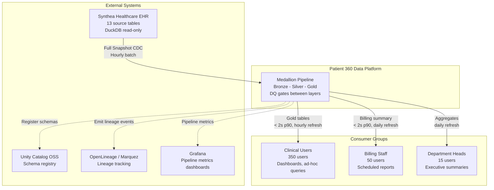

## 3. Integration Architecture

### 3.1 Source Systems

| Source | Type | Access Pattern | Tables Consumed |
|--------|------|---------------|-----------------|
| Synthea Healthcare EHR | DuckDB database (636 MB verified) | Read-only SQL for validation; CSV file read for ingestion [DRD §2.1] | 13 Phase 1 tables: patients, encounters, conditions, medications, observations, allergies, immunizations, procedures, claims, careplans, organizations, providers, payers |

### 3.2 Consumer Access Pattern

| Consumer Group | Access Method | Gold Tables | SLA |
|---------------|--------------|-------------|-----|
| Physicians (120) | Unity Catalog REST API | patient_summary, patient_clinical_history | < 2s at p90 [DRD §4.3], hourly refresh [DRD §4.4] |
| Nurses (200) | Unity Catalog REST API | patient_summary, patient_clinical_history | < 2s at p90 [DRD §4.3], hourly refresh [DRD §4.4] |
| Care Coordinators (30) | Unity Catalog REST API | patient_summary | < 2s at p90 [DRD §4.3], daily refresh [DRD §4.4] |
| Billing Staff (50) | Unity Catalog REST API | patient_billing_summary | < 2s at p90 [DRD §4.3], daily refresh [DRD §4.4] |
| Department Heads (15) | Unity Catalog REST API | patient_summary (aggregates) | < 2s at p90 [DRD §4.3], daily refresh [DRD §4.4] |

### 3.3 System Context Diagram

---
