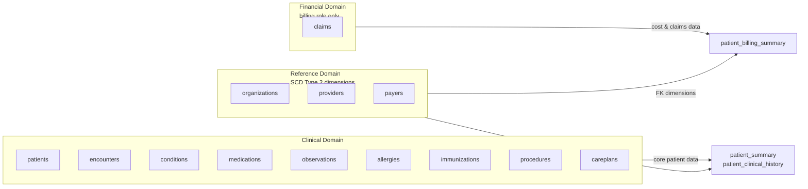
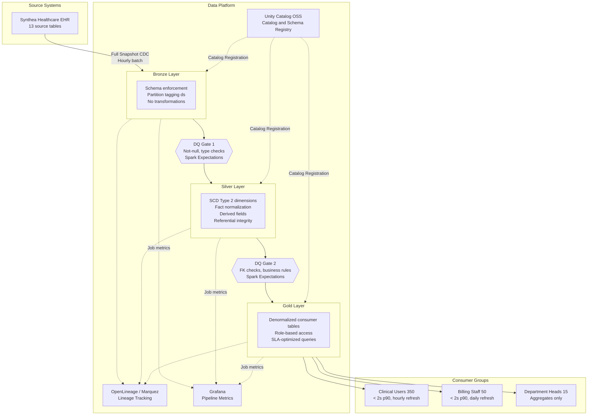

## 4. Data Architecture

### 4.1 Selected Pattern

**Pattern**: Medallion Architecture (Bronze, Silver, Gold)

**Justification**: The DRD [§4.4] requires a maximum of 1-hour latency for clinical users and 24-hour latency for billing/reporting consumers. The team has demonstrated high proficiency in Medallion patterns, Delta Lake MERGE INTO, and SCD Type 2 [team-capabilities.md §2] -- making Medallion the lowest-risk, highest-velocity choice. The 5,767-patient dataset with 13.5M total rows [DRD §2.3, verified against source database] is well within local-mode Spark capacity and does not justify a streaming architecture. The team is Not Experienced in Streaming [team-capabilities.md §2], ruling out Lambda and Kappa patterns without an upskilling investment.

### 4.2 Alternatives Considered

| Option | Description | Why Not Selected |
|--------|-------------|------------------|
| Medallion (Bronze/Silver/Gold) | 3-layer batch pipeline with Delta Lake | **Selected** -- team proficient, satisfies all DRD SLAs |
| Lambda Architecture | Dual batch + streaming paths for mixed latency | Over-engineered: DRD requires only 1-hour latency [§4.4], not sub-minute; team has no streaming experience [team-capabilities.md §2] |
| Kappa Architecture | Streaming-only with Kafka/Flink reprocessing | Requires Kafka/Flink infrastructure not in technology catalog; team gap in streaming |
| Data Vault | Hub-satellite modeling with surrogate keys | Team has no practical experience; longer development timeline; no audit-trail requirement in DRD that mandates Data Vault's overhead |

**Trade-off**: Medallion batch cannot achieve sub-minute data freshness. The DRD [§2.2] notes sub-minute source sync for medications and allergies, but the physician latency SLA [§4.4] accepts 1-hour maximum. Hourly batch for all tables is the Phase 1 compromise accepted by the user.

### 4.3 Layer Strategy

**Bronze Layer**

Preserves source data exactly as received from the Synthea EHR. No business transformations -- only type casting, schema enforcement, and partition tagging with load metadata (`_ingested_at`, `_batch_id`, `_source_file`). Serves as the immutable audit record. All 13 Phase 1 tables land here with idempotent partition replacement per `ds` date [DRD §2.2].

**Silver Layer**

Applies business logic and data conformance. SCD Type 2 applied to dimension tables (patients, providers, payers, organizations) for historical tracking using SHA-256 change detection and Delta MERGE INTO [team-capabilities.md §2]. Fact tables use insert-only pattern with partition overwrite. Derived fields computed here: `calculated_age`, `medication_status`, `is_30_day_readmission`, `total_visit_cost` [DRD §5.2].

**Gold Layer**

Produces three denormalized, consumer-specific tables aligned to the DRD's consumer groups [§4.1]:

1. **patient_summary** -- Clinical users: demographics, active conditions, active medications, allergies (never suppressed), recent encounters. Serves the 2-second search SLA [DRD §4.3].
2. **patient_clinical_history** -- Physicians and nurses: full encounter history, observations, procedures, immunizations, careplans. Pre-appointment review use case [DRD §4.2].
3. **patient_billing_summary** -- Billing staff only: encounter costs, claims, total_visit_cost. Cost fields hidden from non-billing roles [DRD §5.5].

> Detailed table inventories, column schemas, and per-table write strategies are documented in the **Data Model Specification (DMS)**.

### 4.4 Data Domain Map

**Clinical domain** (patients, encounters, conditions, medications, observations, allergies, immunizations, procedures, careplans) flows through all three layers. Core domain serving the Patient 360 search use case [DRD §1.1].

**Reference domain** (organizations, providers, payers) lands in Bronze and becomes SCD Type 2 dimensions in Silver. Slowly changing reference tables (1,080 orgs, 1,080 providers, 10 payers) supporting FK relationships [DRD §3.3].

**Financial domain** (claims) flows Bronze to Silver to Gold billing summary. Restricted to billing staff role [DRD §5.5]. Cost fields hidden from clinical views.

### 4.5 SCD Strategy

| Dimension Type | SCD Approach | Rationale |
|----------------|-------------|-----------|
| Patient demographics (5,767 rows) | SCD Type 2 | Track address, name, and insurance changes for clinical accuracy [DRD §1.2]; team proficient with Delta MERGE INTO [team-capabilities.md §2] |
| Provider attributes (1,080 rows) | SCD Type 2 | Track specialty and organization changes for referential accuracy |
| Payer information (10 rows) | SCD Type 2 | Track plan and coverage changes for billing accuracy |
| Organization data (1,080 rows) | SCD Type 2 | Track organizational restructuring for reporting |
| Fact tables (encounters, conditions, etc.) | Insert-only with partition overwrite | Immutable event records; no history tracking needed -- partition by `ds` for idempotent reruns [infrastructure-constraints.md §2] |

### 4.6 Pipeline Architecture Diagram

---
