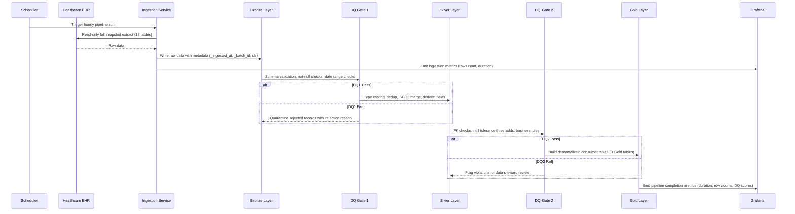

## 5. Pipeline Architecture

### 5.1 Technology Decisions

| Component | Selected Tool | Why |
|-----------|--------------|-----|
| Processing Engine | Apache Spark (PySpark) | Team high proficiency [team-capabilities.md §1]; handles 4.4M-row observations table in local mode; Delta Lake integration native [technology-catalog.md §1] |
| Table Format | Delta Lake | ACID writes, time travel for rollback, MERGE INTO for SCD2; mandated by infrastructure constraints [infrastructure-constraints.md §2] |
| Metastore | Unity Catalog OSS | Catalog/schema hierarchy for table registration; REST API for consumer access [technology-catalog.md §2] |
| Lineage | OpenLineage + Marquez | HIPAA audit trail support [DRD §7.5]; captures Bronze to Silver to Gold job-level lineage [technology-catalog.md §3] |
| Data Quality | Spark Expectations | YAML rule-based DQ enforcement at each layer boundary; row_dq, agg_dq, and query_dq rule types [technology-catalog.md §5] |
| Pipeline Metrics | Grafana | Dashboard visualization for pipeline runtime, throughput, and error rates; complements Marquez lineage with operational monitoring |
| Containerization | Docker + Docker Compose | All services (Spark, UC, Marquez, PostgreSQL, Grafana) in containers; local dev environment [technology-catalog.md §4] |
| Language | Python (PySpark) | Team high proficiency [team-capabilities.md §1]; pytest ecosystem for testing [team-capabilities.md §4] |

> Detailed technology versions, JAR coordinates, and deployment configurations belong in the **Low-Level Design (LLD)** document.

#### Key Compatibility Constraints

- Spark 4.x requires Scala 2.13 JARs and Java 11 or 17 [infrastructure-constraints.md §1]
- UC OSS catalog name must be `spark_catalog` -- Spark's default; arbitrary catalog names require additional configuration [infrastructure-constraints.md §5]
- OpenLineage port remapped to 5001 on macOS due to AirPlay conflict [infrastructure-constraints.md §3]
- UC init script must run once after `docker compose up` before first pipeline execution [infrastructure-constraints.md §5]
- Grafana is a new addition not currently in the technology catalog -- requires team evaluation and catalog update

#### Technology Trade-offs

- **Delta Lake vendor lock-in**: Acceptable for local dev; Iceberg migration path exists if multi-engine portability needed in production. Infrastructure constraints mandate Delta exclusively [infrastructure-constraints.md §2]
- **UC OSS 0.4.0 limitations**: No column-level lineage REST API; requires Databricks UC or DataHub for column lineage -- deferred to Phase 2 [infrastructure-constraints.md §8]
- **Local Spark mode**: Sufficient for 13.5M total rows; cluster mode needed if dataset grows beyond 10x current volume
- **Grafana addition**: Not in current technology catalog; requires team evaluation [team-capabilities.md §3]

### 5.2 CDC Strategy

All source tables use Full Snapshot CDC in Phase 1. Database verification confirmed no `updated_at` or `modified_at` columns exist in any of the 18 source tables -- only business date columns (START, STOP, BIRTHDATE, DATE, etc.) are present. This makes Timestamp Watermark CDC unreliable. Log-Based CDC (Debezium) requires Kafka infrastructure not in the technology catalog. SCD Type 2 change detection in Silver uses SHA-256 hash comparison on dimension rows via Delta MERGE INTO.

| Source Type | CDC Method | Frequency | Rationale |
|------------|-----------|-----------|-----------|
| Clinical tables (encounters, conditions, medications, observations, allergies, immunizations, careplans, procedures) | Full Snapshot | Hourly | Satisfies 1-hour clinical latency SLA [DRD §4.4]; all tables treated uniformly per user decision |
| Financial tables (claims) | Full Snapshot | Hourly | Consistent with clinical tables; billing SLA allows daily [DRD §4.4] but hourly simplifies scheduling |
| Reference tables (organizations, providers, payers) | Full Snapshot | Hourly | Very small tables (10-1,080 rows); included in hourly batch for operational simplicity |

**Phase 2 CDC evolution**: Evaluate Timestamp Watermark when source systems provide reliable audit timestamps. True sub-minute CDC for medications/allergies [DRD §2.2] deferred until streaming infrastructure is added to the technology catalog.

### 5.3 Ingestion Sequence Diagram

### 5.4 Scalability & Capacity

#### Current Scale

Total dataset: 13.5M rows across 18 tables (636 MB raw CSV, verified against source database on 2026-03-16). Of these, 13 tables (7.9M rows) are in Phase 1 scope; 5 tables (5.6M rows) are deferred to Phase 2 [DRD §2.2]. Largest Phase 1 table: observations at 4,366,447 rows. Patient count: 5,767. Estimated Delta storage: approximately 4 GB (Bronze + Silver + Gold combined, accounting for Delta overhead and SCD2 versioning). Estimated full pipeline runtime: 15-20 minutes on local Spark (`local[*]`, 4 GB driver memory).

#### Growth Model

| Metric | Current (Verified) | Year 1 (5-10%) | Year 3 (5-10% compounded) | Assumption |
|--------|---------|--------|--------|------------|
| Patient count | 5,767 | 6,050-6,340 | 6,670-7,670 | Stable patient population with modest new registrations [user decision] |
| Phase 1 rows (all tables) | 7.9M | 8.3M-8.7M | 9.1M-10.5M | Linear growth proportional to patient count |
| Observations (largest table) | 4.37M | 4.59M-4.81M | 5.05M-5.81M | ~757 observations per patient [DRD §2.3] |
| Delta storage (estimated) | ~4 GB | ~4.4-4.8 GB | ~5.2-6.4 GB | Delta compression plus SCD2 version overhead |
| Pipeline runtime (full) | ~15-20 min | ~17-22 min | ~20-27 min | Linear growth with row count on local Spark |

#### Scaling Levers

- **10x patient volume (~60K patients)**: Migrate from `local[*]` to Spark cluster mode (YARN or Kubernetes)
- **50 GB Delta storage**: Evaluate cloud object storage (S3/GCS/ADLS) to replace local Docker volume [infrastructure-constraints.md §2]
- **Pipeline runtime exceeds 30 minutes**: Increase shuffle partitions; consider partitioning observations by patient hash
- **Delta small-file proliferation**: Schedule weekly VACUUM and OPTIMIZE operations
- **Re-evaluation trigger**: Any single table exceeding 50M rows or total pipeline runtime exceeding 1 hour

#### Cost Model

Phase 1 operates on a developer workstation with Docker -- zero infrastructure cost. Cost drivers on cloud migration scale along two axes: (1) **Compute** — vCPU-hours per run × runs per day; (2) **Storage** — GB/month for Delta tables. The specific cloud platform is an open question [Open Question #2].

> Detailed compute sizing and monthly cost breakdowns belong in the **Low-Level Design (LLD)** document.

### 5.5 Reliability

| Metric | Target | Justification |
|--------|--------|---------------|
| RTO | 4 hours | Read-only system rebuildable from source EHR; no user data at risk [DRD §7.6]; user decision |
| RPO | 24 hours (last successful batch) | Hourly batch cadence; source EHR is system of record; worst case is re-ingesting 24 hours of batches [DRD §7.6]; user decision |
| Production RTO/RPO | [TBD - requires decision from Jennifer Martinez (Compliance)] | DRD §7.6 defers to Phase 2; due date 2026-04-30 |

Source data is immutable in the EHR and re-ingestible at any time. Delta Lake time travel provides a 7-day rollback window. Unity Catalog and Marquez metadata stored in named Docker volumes with daily backup [infrastructure-constraints.md §2]. All pipeline code version-controlled in Git. Recovery procedure: re-run the pipeline for affected `ds` partitions -- idempotent partition replacement ensures identical results.

> Detailed recovery runbooks and per-table failover procedures belong in the **Low-Level Design (LLD)** document.

### 5.6 Observability

Pipeline observability uses three complementary tools:

1. **OpenLineage + Marquez** [technology-catalog.md §3]: Every pipeline job emits lineage events capturing input/output dataset relationships. The Marquez web UI provides a visual Bronze to Silver to Gold lineage graph. Supports HIPAA audit trail requirements [DRD §7.5].

2. **Spark Expectations** [technology-catalog.md §5]: DQ results logged per layer with pass/fail/warn counts. Rule definitions in YAML enable version-controlled quality gates. Failed records quarantined with rejection reasons.

3. **Grafana**: Pipeline metrics dashboards showing job runtime, throughput (rows/second), error rates, and DQ pass rates. Alert rules trigger notifications when pipeline runtime exceeds 30 minutes or DQ failure rates exceed thresholds.

### 5.7 Key Design Principles

- **Idempotency**: All layers partition by `ds` (YYYY-MM-DD); re-running the same `ds` replaces that partition only via `replaceWhere` [infrastructure-constraints.md §2]
- **Schema enforcement**: All 13 source tables use explicit `StructType` schemas; no schema inference at Bronze [team-capabilities.md §2]
- **Traceability**: Every pipeline job emits OpenLineage events to Marquez; lineage graph visible across all layers [DRD §7.5]
- **Separation of concerns**: Bronze = raw immutable copy; Silver = conformed with SCD2 and derived fields; Gold = consumer-ready aggregations
- **Read-only source access**: Source database accessed via `-readonly` flag only [DRD §1.5]

---
