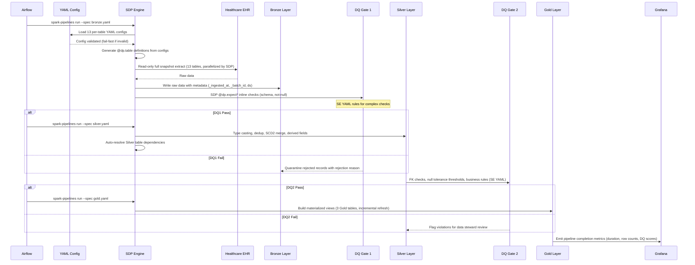

## 5. Pipeline Architecture

### 5.1 Technology Decisions

| Component | Selected Tool | Why |
|-----------|--------------|-----|
| Processing Engine | Apache Spark 4.1+ (PySpark) | Team high proficiency [team-capabilities.md SS1]; handles 4.4M-row observations table in local mode; Delta Lake integration native; SDP built-in [technology-catalog.md SS1] |
| Pipeline Framework | Spark Declarative Pipelines (SDP) | Built into Spark 4.1+ [technology-catalog.md SS1]; declarative dependency resolution, incremental processing, built-in DQ expectations; team Familiar [team-capabilities.md SS2] |
| Orchestrator | Apache Airflow | Cross-pipeline scheduling and dependency management (Bronze->Silver->Gold); team Proficient [team-capabilities.md SS3]; Airflow tasks call `spark-pipelines run --spec <layer>.yaml` |
| Table Format | Delta Lake | ACID writes, time travel for rollback, MERGE INTO for SCD2; mandated by infrastructure constraints [infrastructure-constraints.md SS2] |
| Metastore | Unity Catalog OSS | Catalog/schema hierarchy for table registration; REST API for consumer access [technology-catalog.md SS2] |
| Lineage | OpenLineage + Marquez | HIPAA audit trail support [DRD SS7.5]; captures Bronze to Silver to Gold job-level lineage [technology-catalog.md SS3] |
| Data Quality (inline) | SDP `@dp.expect*` decorators | Built-in schema/null/range checks applied inline within pipeline definitions; zero external dependency |
| Data Quality (complex) | Spark Expectations | YAML rule-based DQ for complex business rules, cross-table FK checks, and aggregate validations; rules generated from DQS [technology-catalog.md SS5] |
| Pipeline Metrics | Grafana | Dashboard visualization for pipeline runtime, throughput, and error rates; complements Marquez lineage with operational monitoring |
| Containerization | Docker + Docker Compose | All services (Spark, UC, Marquez, PostgreSQL, Grafana) in containers; local dev environment [technology-catalog.md SS4] |
| Language | Python (PySpark) | Team high proficiency [team-capabilities.md SS1]; pytest ecosystem for testing [team-capabilities.md SS4] |
| Config Format | YAML (per-table) | Human-readable, version-controlled config files; JSON Schema for static validation |

> Detailed technology versions, JAR coordinates, and deployment configurations belong in the **Low-Level Design (LLD)** document.

#### Key Compatibility Constraints

- Spark 4.1+ required for SDP (`@dp.table`, `@dp.materialized_view`, `@dp.expect*` decorators) [technology-catalog.md SS1]
- Spark 4.x requires Scala 2.13 JARs and Java 11 or 17 [infrastructure-constraints.md SS1]
- UC OSS catalog name must be `spark_catalog` -- Spark's default; arbitrary catalog names require additional configuration [infrastructure-constraints.md SS5]
- OpenLineage port remapped to 5001 on macOS due to AirPlay conflict [infrastructure-constraints.md SS3]
- UC init script must run once after `docker compose up` before first pipeline execution [infrastructure-constraints.md SS5]
- Grafana is a new addition not currently in the technology catalog -- requires team evaluation and catalog update
- Airflow DAGs call `spark-pipelines run --spec <layer>.yaml` as BashOperator or SparkSubmitOperator tasks

#### Technology Trade-offs

- **Delta Lake vendor lock-in**: Acceptable for local dev; Iceberg migration path exists if multi-engine portability needed in production. Infrastructure constraints mandate Delta exclusively [infrastructure-constraints.md SS2]
- **UC OSS 0.4.0 limitations**: No column-level lineage REST API; requires Databricks UC or DataHub for column lineage -- deferred to Phase 2 [infrastructure-constraints.md SS8]
- **Local Spark mode**: Sufficient for 13.5M total rows; cluster mode needed if dataset grows beyond 10x current volume
- **Grafana addition**: Not in current technology catalog; requires team evaluation [team-capabilities.md SS3]
- **SDP maturity**: SDP is a Spark 4.1 feature (formerly Databricks Delta Live Tables); team is Familiar, not Proficient [team-capabilities.md SS2] -- requires upskilling allocation during sprint 1

### 5.2 Config-Driven Ingestion Pattern

Bronze layer ingestion is driven by per-table YAML configuration files rather than per-table pipeline code. A single generic ingestion engine reads the YAML config and dynamically generates SDP `@dp.table` definitions for each source table.

#### Config Scope

Config drives **Bronze ingestion only**. Silver and Gold transformations remain code-driven because they contain business logic (SCD2 merge, derived field computation, denormalized aggregations) that is not suitable for declarative config. DQ rules are already config-driven via Spark Expectations YAML rules generated from the DQS -- no DQ config duplication in ingestion config files.

#### Config File Structure

**Per-table file**: One YAML config file per source table, stored in a version-controlled directory (e.g., `config/ingestion/`). Phase 1 produces 13 config files. This structure provides:

- **Clear ownership**: Each table's config is independently reviewable in PRs
- **Selective deployment**: Changes to one table's config do not risk affecting others
- **Load ordering**: Each file specifies a `load_priority` for cross-table dependency management

#### Config Content (Extended)

Each per-table YAML config file contains the following fields:

| Field | Purpose | Example |
|-------|---------|---------|
| `table_name` | Target Bronze table name | `bronze_patients` |
| `source_path` | Source file path or connection string | `/data/raw/patients.csv` |
| `source_format` | File format | `csv` |
| `schema_reference` | Path to StructType schema definition | `schemas/patients.py` |
| `cdc_method` | CDC approach for this table | `full_snapshot` |
| `frequency` | Ingestion schedule | `hourly` |
| `partition_column` | Partition key | `ds` |
| `write_mode` | Delta write strategy | `replaceWhere` |
| `dq_rule_reference` | Path to SE YAML rules for this table | `expectations/bronze/patients.yaml` |
| `load_priority` | Ordering for dependency management (lower = first) | `10` |
| `scd_type` | SCD type for downstream Silver processing | `scd2` |
| `hash_columns` | Columns for change detection hash | `[first, last, address, city]` |
| `derived_fields` | Derived field definitions (Bronze-safe only) | `{_ingested_at: current_timestamp()}` |
| `target_layer` | Target layer for this config | `bronze` |

> Detailed config file schemas, example YAML files, and the generic ingestion engine implementation belong in the **Low-Level Design (LLD)** document.

#### Config Validation -- Dual Gate [NFR-13]

1. **Static validation (pre-commit)**: JSON Schema validates every config file on commit. Catches structural errors (missing required fields, invalid enum values, malformed YAML) before code reaches the repository.

2. **Runtime validation (fail-fast at startup)**: The ingestion engine validates all config files at pipeline startup before any data processing begins. Catches semantic errors (invalid source paths, schema reference mismatches, circular load_priority dependencies). Pipeline fails immediately with a clear error message if any config is invalid.

### 5.3 Spark Declarative Pipelines (SDP) Integration

SDP provides declarative pipeline orchestration within each layer. Airflow manages cross-pipeline dependencies (Bronze must complete before Silver starts); SDP manages intra-pipeline dependencies (within Bronze, Silver, or Gold).

#### Orchestration Split

| Concern | Handled By | Mechanism |
|---------|-----------|-----------|
| Cross-pipeline scheduling (Bronze -> Silver -> Gold) | Apache Airflow | Airflow DAG with task dependencies; each task calls `spark-pipelines run --spec <layer>.yaml` |
| Intra-pipeline dependency resolution | SDP | Automatic DAG resolution from `@dp.table` / `@dp.materialized_view` decorator dependencies |
| Parallelism within a layer | SDP | SDP runs independent tables in parallel within a pipeline spec |
| Incremental processing | SDP | SDP tracks which upstream tables changed and recomputes only affected downstream tables |
| Retry and alerting | Apache Airflow | Airflow retry policies, SLA alerts, failure notifications |

#### SDP Decorator Mapping by Layer

| Layer | SDP Decorator | Rationale |
|-------|--------------|-----------|
| Bronze | `@dp.table` (streaming table) | Streaming tables support append-mode ingestion with automatic checkpointing; config-driven engine generates these dynamically |
| Silver (dimensions) | `@dp.table` | Standard table for SCD2 merge operations requiring Delta MERGE INTO |
| Silver (facts) | `@dp.table` | Standard table for insert-only partition overwrite |
| Gold | `@dp.materialized_view` | Materialized views enable incremental refresh -- Gold tables recompute only when upstream Silver tables change |

#### SDP Pipeline Spec Files

Each layer has a pipeline spec YAML file invoked by Airflow:

- `bronze.yaml` -- References the config-driven ingestion engine module; SDP discovers `@dp.table` definitions generated from per-table configs
- `silver.yaml` -- References Silver transformation modules with explicit `@dp.table` definitions per table
- `gold.yaml` -- References Gold aggregation modules with `@dp.materialized_view` definitions per consumer table

> Detailed pipeline spec YAML content, SDP decorator implementations, and Airflow DAG definitions belong in the **Low-Level Design (LLD)** document.

### 5.4 CDC Strategy

All source tables use Full Snapshot CDC in Phase 1. Database verification confirmed no `updated_at` or `modified_at` columns exist in any of the 18 source tables -- only business date columns (START, STOP, BIRTHDATE, DATE, etc.) are present. This makes Timestamp Watermark CDC unreliable. Log-Based CDC (Debezium) requires Kafka infrastructure not in the technology catalog. SCD Type 2 change detection in Silver uses SHA-256 hash comparison on dimension rows via Delta MERGE INTO. The CDC method for each table is specified in its per-table YAML config file (`cdc_method: full_snapshot`).

| Source Type | CDC Method | Frequency | Rationale |
|------------|-----------|-----------|-----------|
| Clinical tables (encounters, conditions, medications, observations, allergies, immunizations, careplans, procedures) | Full Snapshot | Hourly | Satisfies 1-hour clinical latency SLA [DRD SS4.4]; all tables treated uniformly per user decision |
| Financial tables (claims) | Full Snapshot | Hourly | Consistent with clinical tables; billing SLA allows daily [DRD SS4.4] but hourly simplifies scheduling |
| Reference tables (organizations, providers, payers) | Full Snapshot | Hourly | Very small tables (10-1,080 rows); included in hourly batch for operational simplicity |

**Phase 2 CDC evolution**: Evaluate Timestamp Watermark when source systems provide reliable audit timestamps. True sub-minute CDC for medications/allergies [DRD SS2.2] deferred until streaming infrastructure is added to the technology catalog.

### 5.5 Ingestion Sequence Diagram

### 5.6 Scalability & Capacity

#### Current Scale

Total dataset: 13.5M rows across 18 tables (636 MB raw CSV, verified against source database on 2026-03-16). Of these, 13 tables (7.9M rows) are in Phase 1 scope; 5 tables (5.6M rows) are deferred to Phase 2 [DRD SS2.2]. Largest Phase 1 table: observations at 4,366,447 rows. Patient count: 5,767. Estimated Delta storage: approximately 4 GB (Bronze + Silver + Gold combined, accounting for Delta overhead and SCD2 versioning). Estimated full pipeline runtime: 15-20 minutes on local Spark (`local[*]`, 4 GB driver memory). SDP overhead is negligible -- declarative resolution adds sub-second planning time before execution.

#### Growth Model

| Metric | Current (Verified) | Year 1 (5-10%) | Year 3 (5-10% compounded) | Assumption |
|--------|---------|--------|--------|------------|
| Patient count | 5,767 | 6,050-6,340 | 6,670-7,670 | Stable patient population with modest new registrations [user decision] |
| Phase 1 rows (all tables) | 7.9M | 8.3M-8.7M | 9.1M-10.5M | Linear growth proportional to patient count |
| Observations (largest table) | 4.37M | 4.59M-4.81M | 5.05M-5.81M | ~757 observations per patient [DRD SS2.3] |
| Delta storage (estimated) | ~4 GB | ~4.4-4.8 GB | ~5.2-6.4 GB | Delta compression plus SCD2 version overhead |
| Pipeline runtime (full) | ~15-20 min | ~17-22 min | ~20-27 min | Linear growth with row count on local Spark |
| Config files (Bronze) | 13 | 18 (Phase 2 tables) | 18-25 (new sources) | One config file per source table |

#### Scaling Levers

- **10x patient volume (~60K patients)**: Migrate from `local[*]` to Spark cluster mode (YARN or Kubernetes)
- **50 GB Delta storage**: Evaluate cloud object storage (S3/GCS/ADLS) to replace local Docker volume [infrastructure-constraints.md SS2]
- **Pipeline runtime exceeds 30 minutes**: SDP parallelism within each layer helps; increase shuffle partitions; consider partitioning observations by patient hash
- **Delta small-file proliferation**: Schedule weekly VACUUM and OPTIMIZE operations
- **Config file proliferation**: If table count exceeds 50, evaluate config registry or config generation from a metadata catalog
- **Re-evaluation trigger**: Any single table exceeding 50M rows or total pipeline runtime exceeding 1 hour

#### Cost Model

Phase 1 operates on a developer workstation with Docker -- zero infrastructure cost. Cost drivers on cloud migration scale along two axes: (1) **Compute** -- vCPU-hours per run x runs per day; (2) **Storage** -- GB/month for Delta tables. The specific cloud platform is an open question [Open Question #2]. SDP and Airflow do not add licensing cost (both Apache 2.0).

> Detailed compute sizing and monthly cost breakdowns belong in the **Low-Level Design (LLD)** document.

### 5.7 Reliability

| Metric | Target | Justification |
|--------|--------|---------------|
| RTO | 4 hours | Read-only system rebuildable from source EHR; no user data at risk [DRD SS7.6]; user decision |
| RPO | 24 hours (last successful batch) | Hourly batch cadence; source EHR is system of record; worst case is re-ingesting 24 hours of batches [DRD SS7.6]; user decision |
| Production RTO/RPO | [TBD - requires decision from Jennifer Martinez (Compliance)] | DRD SS7.6 defers to Phase 2; due date 2026-04-30 |

Source data is immutable in the EHR and re-ingestible at any time. Delta Lake time travel provides a 7-day rollback window. Unity Catalog and Marquez metadata stored in named Docker volumes with daily backup [infrastructure-constraints.md SS2]. All pipeline code and config files version-controlled in Git. Recovery procedure: re-run the Airflow DAG for affected `ds` partitions -- SDP idempotent partition replacement ensures identical results.

> Detailed recovery runbooks and per-table failover procedures belong in the **Low-Level Design (LLD)** document.

### 5.8 Observability

Pipeline observability uses three complementary tools:

1. **OpenLineage + Marquez** [technology-catalog.md SS3]: Every pipeline job emits lineage events capturing input/output dataset relationships. The Marquez web UI provides a visual Bronze to Silver to Gold lineage graph. Supports HIPAA audit trail requirements [DRD SS7.5]. SDP pipeline runs are captured as OpenLineage job runs with input/output facets.

2. **Data Quality -- Dual-Layer Approach**: SDP `@dp.expect*` decorators provide inline DQ checks (schema validation, not-null, valid ranges) with zero external dependency. Spark Expectations [technology-catalog.md SS5] provides YAML rule-based DQ for complex business rules, cross-table FK checks, and aggregate validations. DQ rules from the DQS are already generated as per-table SE YAML files. See SS6.3 for the detailed DQ strategy.

3. **Grafana**: Pipeline metrics dashboards showing job runtime, throughput (rows/second), error rates, and DQ pass rates. Alert rules trigger notifications when pipeline runtime exceeds 30 minutes or DQ failure rates exceed thresholds.

### 5.9 Key Design Principles

- **Config-driven ingestion**: Bronze layer uses per-table YAML configs to eliminate per-table boilerplate code; adding a source table = adding a config file [FR-11]
- **Declarative orchestration**: SDP handles intra-pipeline dependency resolution and parallelism; Airflow handles cross-pipeline scheduling [FR-12]
- **Idempotency**: All layers partition by `ds` (YYYY-MM-DD); re-running the same `ds` replaces that partition only via `replaceWhere` [infrastructure-constraints.md SS2]
- **Schema enforcement**: All 13 source tables use explicit `StructType` schemas; no schema inference at Bronze [team-capabilities.md SS2]
- **Traceability**: Every pipeline job emits OpenLineage events to Marquez; lineage graph visible across all layers [DRD SS7.5]
- **Separation of concerns**: Bronze = raw immutable copy (config-driven); Silver = conformed with SCD2 and derived fields (code-driven); Gold = consumer-ready aggregations (code-driven, materialized views)
- **Read-only source access**: Source database accessed via `-readonly` flag only [DRD SS1.5]
- **Fail-fast config validation**: Config errors caught at pre-commit (static) and pipeline startup (runtime) before any data processing [NFR-13]

---
