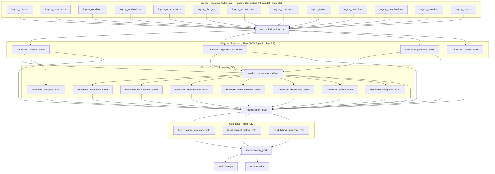

# Low-Level Design: Patient 360 Medallion Pipeline

| Field | Value |
|-------|-------|
| **Version** | 1.3 |
| **Created** | 2026-03-23 |
| **Last Modified** | 2026-03-23 |
| **Author** | Technical Lead Agent |
| **Status** | Updated - Pending Review (v1.3) |
| **DRD Reference** | DRD-2026-02-11-patient-360.md (v1.1) |
| **HLD Reference** | HLD-2026-03-17-patient-360-pipeline-v1.1.md (v1.2) |
| **DMS Reference** | DMS-2026-03-18-patient-360.md (v1.1) |
| **STM Reference** | STM-2026-03-21-patient-360.xlsx (v2.0) |
| **DQS Reference** | DQS-2026-03-21-patient-360.md (v2.0) |

---

## 1. Design Overview

The Patient 360 pipeline is implemented as a three-layer Medallion architecture (Bronze, Silver, Gold) orchestrated by Apache Airflow, processing 13 Synthea Healthcare EHR source tables (7.9M Phase 1 rows, 636 MB raw) on an hourly schedule to meet the 1-hour clinical data freshness SLA [DRD §4.4]. All environments (DEV, STAGING, PROD) run locally with Unity Catalog OSS (`http://localhost:8080/api/2.1/unity-catalog`) serving as the catalog and metastore for Delta table registration and governance [infrastructure-specs.md §4]. The processing engine is Apache Spark 4.0.0 with Delta Lake 4.x running on Java 17 and Scala 2.13, using PySpark for all transformation logic. The Bronze layer uses a **config-driven ingestion framework**: 13 per-table YAML configuration files define source, schema, DQ rules, and empty-input behavior; a TaskGroup factory function reads these configs and generates an Airflow TaskGroup with one SparkSubmitOperator wrapper per table, eliminating boilerplate code across ingestion modules. DQ rules are auto-discovered by table name convention from the SE rules YAML [DQS §2-4]. Silver and Gold layers remain as dedicated transformation modules. Data quality is enforced via **inline Spark Expectations** within each task (row_dq and agg_dq checks using action_if_failed: fail/drop/ignore) plus lightweight **reconciliation tasks** at each layer boundary for cross-table query_dq checks (row count reconciliation, freshness, completeness) [DQS §2-4]. The pipeline writes Delta Lake tables with Snappy compression, partitioned by ingestion date (`ds`), with SCD Type 2 change tracking on four dimension tables (patients, providers, payers, organizations) using SHA-256 hash comparison and Delta MERGE INTO. Three Gold tables serve distinct consumer groups: `patient_summary` (350 clinical users), `patient_clinical_history` (physicians and nurses), and `patient_billing_summary` (50 billing staff). Rollback uses Delta RESTORE for immediate recovery with pipeline re-run for correctness verification.

---

## 2. Code Architecture

### 2.1 Project Structure

Per development-standards.md §2.1:

```
src/
+-- pipelines/
|   +-- bronze/                  # Config-driven ingestion framework
|   |   +-- __init__.py
|   |   +-- ingestion_runner.py  # Generic ingestion entry point (reads YAML, executes)
|   |   +-- ingestion_factory.py # TaskGroup factory: reads configs, creates TaskGroup
|   |   +-- spark_submit_wrapper.py  # Thin SparkSubmitOperator wrapper
|   +-- silver/                  # 1 module per target table (13 modules)
|   |   +-- __init__.py
|   |   +-- transform_patients.py       # SCD Type 2
|   |   +-- transform_encounters.py
|   |   +-- transform_conditions.py
|   |   +-- transform_medications.py
|   |   +-- transform_observations.py
|   |   +-- transform_allergies.py
|   |   +-- transform_immunizations.py
|   |   +-- transform_procedures.py
|   |   +-- transform_claims.py
|   |   +-- transform_careplans.py
|   |   +-- transform_organizations.py  # SCD Type 2
|   |   +-- transform_providers.py      # SCD Type 2
|   |   +-- transform_payers.py         # SCD Type 2
|   +-- gold/                    # 1 module per consumer table (3 modules)
|   |   +-- __init__.py
|   |   +-- build_patient_summary.py
|   |   +-- build_patient_clinical_history.py
|   |   +-- build_patient_billing_summary.py
+-- transforms/                  # Shared transformation functions
|   +-- __init__.py
|   +-- scd2.py                  # Generic SCD Type 2 merge logic
|   +-- derived_fields.py        # calculated_age, medication_status, etc.
|   +-- code_systems.py          # HL7, SNOMED, RxNorm mappings
+-- quality/                     # DQ rule implementations
|   +-- __init__.py
|   +-- se_runner.py             # Spark Expectations execution wrapper
|   +-- rules/                   # SE YAML rule files (per DQS)
|       +-- bronze_rules.yaml    # DQ rules auto-discovered by table name convention
|       +-- silver_rules.yaml
|       +-- gold_rules.yaml
+-- config/                      # Configuration loaders
|   +-- __init__.py
|   +-- pipeline_config.py       # YAML config loader with env overrides
|   +-- schemas.py               # StructType schema definitions
|   +-- tables/                  # Per-table ingestion YAML configs (13 files)
|       +-- patients.yaml
|       +-- encounters.yaml
|       +-- conditions.yaml
|       +-- medications.yaml
|       +-- observations.yaml
|       +-- allergies.yaml
|       +-- immunizations.yaml
|       +-- procedures.yaml
|       +-- claims.yaml
|       +-- careplans.yaml
|       +-- organizations.yaml
|       +-- providers.yaml
|       +-- payers.yaml
+-- utils/                       # Shared utilities
|   +-- __init__.py
|   +-- logging_config.py        # Structured JSON logging
|   +-- metrics.py               # OpenTelemetry metric emitters
|   +-- delta_helpers.py         # replaceWhere, VACUUM, OPTIMIZE wrappers
dags/
+-- patient360_hourly_v1.py      # Airflow DAG definition (uses ingestion_factory)
tests/
+-- unit/                        # Mocked I/O tests (>= 90% coverage)
+-- integration/                 # Real Unity Catalog OSS/Delta tests
+-- fixtures/                    # Test data fixtures
```

### 2.2 Coding Conventions

Per development-standards.md §2.2:

| Element | Convention | Example |
|---------|-----------|---------|
| Module files | `snake_case.py` | `ingest_patients.py` |
| Classes | `PascalCase` | `BronzeIngestionTask` |
| Functions | `snake_case` | `load_encounters()` |
| Constants | `UPPER_SNAKE_CASE` | `MAX_RETRY_COUNT` |
| Config keys | `dot.separated` | `pipeline.bronze.batch_size` |

### 2.3 Module Interface Contracts

For naming conventions and coding standards, see development-standards.md §2-3.

**`src/pipelines/bronze/ingestion_runner.py`** -- Generic Ingestion Runner
- **Input**: Per-table YAML config path (string), Spark session, pipeline run context
- **Output**: Delta table written to `warehouse/{env}/bronze/{table}/ds={ds}/`
- **Responsibility**: Reads YAML config to determine source table, StructType schema, output path, DQ rule references, and empty-input behavior. Executes the standard ingestion pattern: read source, add metadata columns, enforce StructType schema (no inference), call SE inline for row_dq/agg_dq validation, write with `replaceWhere ds = '{ds}'`. For schema definitions, see DMS §2.

**`src/pipelines/bronze/ingestion_factory.py`** -- TaskGroup Factory
- **Input**: Config directory path (string), Airflow DAG reference
- **Output**: Airflow TaskGroup (`bronze_ingestion`) containing one SparkSubmitOperator wrapper task per YAML file
- **Responsibility**: Scans `src/config/tables/*.yaml` at DAG parse time, creates one task per file. Eliminates the need for 13 individual bronze modules.

**`src/pipelines/bronze/spark_submit_wrapper.py`** -- SparkSubmit Wrapper
- **Input**: YAML config path (string), pipeline config (compute parameters)
- **Output**: SparkSubmitOperator configured with standard Spark parameters and `--config-path` argument
- **Responsibility**: Thin wrapper that delegates ingestion logic to the Spark cluster. Sets memory, cores, executors from pipeline config.

**`src/config/tables/{table}.yaml`** -- Per-Table Ingestion Config (13 files)
- **Input**: N/A (declarative config)
- **Output**: N/A (consumed by ingestion_runner and ingestion_factory)
- **Responsibility**: Declares source table, schema_ref, output_path, empty_input_behavior, dq_rules_table, metadata columns, timeout, and retries for one source table. Critical tables override empty_input_behavior to `fail`: patients, encounters, allergies [DRD §1.3], organizations, providers, payers. All others default to `write_empty`.

**`src/transforms/scd2.py`** -- SCD Type 2 Merge
- **Input**: DataFrame (incoming records), natural key column(s) (list[str]), hash columns (list[str]), effective date (date)
- **Output**: Delta MERGE INTO result (rows inserted, rows closed)
- **Responsibility**: Generic SCD2 merge using SHA-256 hash comparison and Delta MERGE INTO with matched/unmatched logic. For SCD2 strategy details, see DMS §6.

**`src/quality/se_runner.py`** -- Spark Expectations Runner
- **Input**: DataFrame, SE YAML rules file path (string), table name (string), action_if_failed config
- **Output**: Validated DataFrame (rows passing DQ), quarantine DataFrame (rows failing DQ), pass/fail metrics
- **Responsibility**: Wraps spark-expectations for inline SE validation. Loads YAML rules, discovers rules by table name convention [DQS §2], executes row_dq and agg_dq checks with configurable action_if_failed (fail/drop/ignore), routes rejections to quarantine paths, emits pass/fail metrics. For rule definitions, see DQS §2-4.

**`src/quality/reconciliation.py`** -- Reconciliation Runner
- **Input**: Pipeline run context (env, ds), list of reconciliation rules (query_dq from DQS §4)
- **Output**: Reconciliation results (pass/fail per rule), alert payloads for failures
- **Responsibility**: Executes cross-table query_dq checks (row count reconciliation, freshness, completeness) that require all upstream tasks in a layer to complete. See §5.4 for details.

### 2.4 Testing Strategy

Per development-standards.md §5:

| Category | Coverage Target | Framework | Scope |
|----------|----------------|-----------|-------|
| Unit tests | >= 90% line coverage | pytest | Transformation logic, derived fields, SCD2 merge logic |
| Integration tests | All pipeline paths | pytest + Unity Catalog OSS | End-to-end Bronze-Silver-Gold with test data |
| DQ rule tests | 100% of CRITICAL rules | pytest | All CRITICAL SE rules from DQS §2-4 |

Test naming convention: `test_{layer}_{operation}_{scenario}` (e.g., `test_bronze_ingest_patients_null_id_rejected`).

---

## 3. File Formats & Storage Layout

### 3.1 Storage Format

| Property | Value | Rationale |
|----------|-------|-----------|
| Table format | Delta Lake 4.x | ACID writes, time travel, MERGE INTO for SCD2; aligned with Spark 4.0.0 [HLD §5.1, §7 Decision 4]. Tables registered in Unity Catalog OSS (local) for catalog/metastore governance [infrastructure-specs.md §4] |
| Compression | Snappy | Fast decompression; default for Spark + Delta [infrastructure-specs.md §2.2] |
| Target file size | 128 MB | Optimal for Spark read parallelism [infrastructure-specs.md §2.2] |
| Row group size | 128 MB | Aligned with target file size for single-pass reads |
| Auto-compact | Enabled (PROD only) | Prevents small-file proliferation [infrastructure-specs.md §2.2] |
| Vacuum retention | 168 hours (7 days) | Time travel rollback window [infrastructure-specs.md §2.2] |

### 3.2 Storage Directory Layout

Per infrastructure-specs.md §2.1. Storage paths use the local filesystem (`warehouse/{env}/`); Unity Catalog OSS manages the catalog metadata (table registration, schema governance) for all environments via its local REST API.

```
warehouse/{env}/
+-- bronze/
|   +-- synthea_patients/ds=2026-03-23/
|   +-- synthea_encounters/ds=2026-03-23/
|   +-- synthea_conditions/ds=2026-03-23/
|   +-- synthea_medications/ds=2026-03-23/
|   +-- synthea_observations/ds=2026-03-23/
|   +-- synthea_allergies/ds=2026-03-23/
|   +-- synthea_immunizations/ds=2026-03-23/
|   +-- synthea_procedures/ds=2026-03-23/
|   +-- synthea_claims/ds=2026-03-23/
|   +-- synthea_careplans/ds=2026-03-23/
|   +-- synthea_organizations/ds=2026-03-23/
|   +-- synthea_providers/ds=2026-03-23/
|   +-- synthea_payers/ds=2026-03-23/
+-- silver/
|   +-- clinical/
|   |   +-- clinical_patients/          # SCD2 -- no ds partition
|   |   +-- clinical_encounters/
|   |   +-- clinical_conditions/
|   |   +-- clinical_medications/
|   |   +-- clinical_observations/
|   |   +-- clinical_allergies/
|   |   +-- clinical_immunizations/
|   |   +-- clinical_procedures/
|   |   +-- clinical_careplans/
|   +-- reference/
|   |   +-- reference_organizations/    # SCD2 -- no ds partition
|   |   +-- reference_providers/        # SCD2 -- no ds partition
|   |   +-- reference_payers/           # SCD2 -- no ds partition
|   +-- billing/
|       +-- billing_claims/
+-- gold/
|   +-- patient_summary/
|   +-- patient_clinical_history/
|   +-- patient_billing_summary/
+-- dead-letter/
|   +-- {table}/{date}/                 # Parquet, 30-day retention
+-- checkpoints/
    +-- patient360_hourly_v1/           # JSON, 7-day retention
```

### 3.3 Partitioning Strategy

| Layer | Table Type | Partition Column | Write Strategy | Rationale |
|-------|-----------|-----------------|----------------|-----------|
| Bronze | All 13 tables | `ds` (DATE) | `replaceWhere ds = '{ds}'` | Idempotent reruns [HLD §5.7] |
| Silver | SCD2 dimensions (4 tables) | None | Delta MERGE INTO | SCD2 requires full-table merge; small tables (max 5,767 rows) |
| Silver | Fact tables (9 tables) | `ds` (DATE) | `replaceWhere ds = '{ds}'` | Idempotent partition overwrite |
| Gold | All 3 tables | None | Full overwrite | Consumer tables rebuilt each run; small output |

### 3.4 Retention Policy

| Layer | Retention Period | Rationale |
|-------|-----------------|-----------|
| Bronze | 90 days | Audit trail; re-processable from source [infrastructure-specs.md §2.1] |
| Silver | 1 year | Business history including SCD2 versions [infrastructure-specs.md §2.1] |
| Gold | 7 years | HIPAA minimum for patient records [DRD §7.3] |
| Dead Letter | 30 days | Investigation window for rejected records [infrastructure-specs.md §2.1] |
| Checkpoints | 7 days | Pipeline state recovery [infrastructure-specs.md §2.1] |

---

## 4. DAG Specification

### 4.1 Airflow DAG Configuration

| Parameter | Value | Rationale |
|-----------|-------|-----------|
| DAG ID | `patient360_hourly_v1` | Per orchestration-patterns.md §1 naming convention |
| Schedule | `0 * * * *` (hourly) | Meets 1-hour clinical SLA [DRD §4.4] |
| Timezone | UTC | Per orchestration-patterns.md §2 |
| Catchup | True | Enable backfill for missed runs |
| Max active runs | 1 | Prevent overlapping hourly runs |
| Concurrency | 16 | Allow parallel Bronze ingestion (13 tables) |
| Default timeout | 60 min (DEV), 120 min (PROD) | Per infrastructure-specs.md §1.2 |

### 4.2 Task Inventory

**Bronze TaskGroup** (`bronze_ingestion`): Generated by the ingestion factory function (`src/pipelines/bronze/ingestion_factory.py`). The factory scans all YAML files in `src/config/tables/`, creates one SparkSubmitOperator wrapper task per file, and groups them into an Airflow TaskGroup. All 13 tasks run in parallel within the TaskGroup.

| Task ID | Type | Layer | Dependencies | Timeout | Retries | Retry Delay | Config File |
|---------|------|-------|-------------|---------|---------|-------------|-------------|
| `bronze_ingestion.ingest_patients` | SparkSubmitWrapper | Bronze | None | 30 min | 3 | 60s exp | `tables/patients.yaml` |
| `bronze_ingestion.ingest_encounters` | SparkSubmitWrapper | Bronze | None | 30 min | 3 | 60s exp | `tables/encounters.yaml` |
| `bronze_ingestion.ingest_conditions` | SparkSubmitWrapper | Bronze | None | 30 min | 3 | 60s exp | `tables/conditions.yaml` |
| `bronze_ingestion.ingest_medications` | SparkSubmitWrapper | Bronze | None | 30 min | 3 | 60s exp | `tables/medications.yaml` |
| `bronze_ingestion.ingest_observations` | SparkSubmitWrapper | Bronze | None | 30 min | 3 | 60s exp | `tables/observations.yaml` |
| `bronze_ingestion.ingest_allergies` | SparkSubmitWrapper | Bronze | None | 30 min | 3 | 60s exp | `tables/allergies.yaml` |
| `bronze_ingestion.ingest_immunizations` | SparkSubmitWrapper | Bronze | None | 30 min | 3 | 60s exp | `tables/immunizations.yaml` |
| `bronze_ingestion.ingest_procedures` | SparkSubmitWrapper | Bronze | None | 30 min | 3 | 60s exp | `tables/procedures.yaml` |
| `bronze_ingestion.ingest_claims` | SparkSubmitWrapper | Bronze | None | 30 min | 3 | 60s exp | `tables/claims.yaml` |
| `bronze_ingestion.ingest_careplans` | SparkSubmitWrapper | Bronze | None | 30 min | 3 | 60s exp | `tables/careplans.yaml` |
| `bronze_ingestion.ingest_organizations` | SparkSubmitWrapper | Bronze | None | 30 min | 3 | 60s exp | `tables/organizations.yaml` |
| `bronze_ingestion.ingest_providers` | SparkSubmitWrapper | Bronze | None | 30 min | 3 | 60s exp | `tables/providers.yaml` |
| `bronze_ingestion.ingest_payers` | SparkSubmitWrapper | Bronze | None | 30 min | 3 | 60s exp | `tables/payers.yaml` |
| `reconciliation_bronze` | SQL (query_dq) | Reconciliation | All bronze_ingestion tasks | 20 min | 1 | 60s fixed | -- |
| `transform_patients_silver` | PySpark+SCD2+SE | Silver | `reconciliation_bronze` | 45 min | 2 | 120s exp |
| `transform_organizations_silver` | PySpark+SCD2+SE | Silver | `reconciliation_bronze` | 45 min | 2 | 120s exp |
| `transform_providers_silver` | PySpark+SCD2+SE | Silver | `reconciliation_bronze` | 45 min | 2 | 120s exp |
| `transform_payers_silver` | PySpark+SCD2+SE | Silver | `reconciliation_bronze` | 45 min | 2 | 120s exp |
| `transform_encounters_silver` | PySpark+SE | Silver | `transform_patients_silver`, `transform_organizations_silver`, `transform_providers_silver` | 45 min | 2 | 120s exp |
| `transform_conditions_silver` | PySpark+SE | Silver | `transform_encounters_silver` | 45 min | 2 | 120s exp |
| `transform_medications_silver` | PySpark+SE | Silver | `transform_encounters_silver` | 45 min | 2 | 120s exp |
| `transform_observations_silver` | PySpark+SE | Silver | `transform_encounters_silver` | 45 min | 2 | 120s exp |
| `transform_allergies_silver` | PySpark+SE | Silver | `transform_patients_silver` | 45 min | 2 | 120s exp |
| `transform_immunizations_silver` | PySpark+SE | Silver | `transform_encounters_silver` | 45 min | 2 | 120s exp |
| `transform_procedures_silver` | PySpark+SE | Silver | `transform_encounters_silver` | 45 min | 2 | 120s exp |
| `transform_claims_silver` | PySpark+SE | Silver | `transform_encounters_silver` | 45 min | 2 | 120s exp |
| `transform_careplans_silver` | PySpark+SE | Silver | `transform_encounters_silver` | 45 min | 2 | 120s exp |
| `reconciliation_silver` | SQL (query_dq) | Reconciliation | All silver tasks | 20 min | 1 | 60s fixed |
| `build_patient_summary_gold` | PySpark+SE | Gold | `reconciliation_silver` | 30 min | 2 | 120s exp |
| `build_clinical_history_gold` | PySpark+SE | Gold | `reconciliation_silver` | 30 min | 2 | 120s exp |
| `build_billing_summary_gold` | PySpark+SE | Gold | `reconciliation_silver` | 30 min | 2 | 120s exp |
| `reconciliation_gold` | SQL (query_dq) | Reconciliation | All gold tasks | 20 min | 1 | 60s fixed |
| `emit_lineage` | OpenLineage | Observability | `reconciliation_gold` | 10 min | 2 | 30s exp |
| `emit_metrics` | OpenTelemetry | Observability | `reconciliation_gold` | 10 min | 2 | 30s exp |

**DQ Architecture Note**: Row-level (`row_dq`) and aggregate (`agg_dq`) DQ checks from DQS §2-3 are executed **inline** within each ingestion/transformation task via spark-expectations `action_if_failed` (see §5 for details). The reconciliation tasks run only cross-table `query_dq` checks (row count reconciliation, freshness, completeness) from DQS §4 that require all upstream tasks in a layer to complete before evaluation.

### 4.3 DAG Dependency Diagram



### 4.4 Critical Path Analysis

The critical path determines the minimum pipeline runtime:

```
ingest_observations_bronze (longest bronze, ~5 min, inline SE row_dq+agg_dq)
  --> reconciliation_bronze (~2 min, query_dq cross-table checks)
    --> transform_patients_silver (~3 min SCD2, inline SE)
      --> transform_encounters_silver (~4 min, inline SE)
        --> transform_observations_silver (~8 min, largest table, inline SE)
          --> reconciliation_silver (~2 min, query_dq cross-table checks)
            --> build_patient_summary_gold (~3 min, inline SE)
              --> reconciliation_gold (~2 min, query_dq cross-table checks)
                --> emit_lineage + emit_metrics (~1 min)
```

**Estimated critical path**: ~30 minutes (reduced from ~33 minutes by eliminating standalone DQ gate overhead; inline SE adds negligible latency to each task since row_dq/agg_dq checks execute within the same Spark action).

### 4.5 Idempotency Guarantees

| Layer | Idempotency Method | Behavior on Re-run |
|-------|-------------------|-------------------|
| Bronze | `replaceWhere ds = '{ds}'` | Overwrites partition for that date only |
| Silver (facts) | `replaceWhere ds = '{ds}'` | Overwrites partition for that date only |
| Silver (SCD2 dims) | Delta MERGE INTO with hash comparison | No-op if source unchanged; new version row if changed |
| Gold | Full table overwrite | Complete rebuild from current Silver state |

---

## 5. Task Implementation Details

### 5.1 Bronze Tasks (Config-Driven Ingestion Framework)

All Bronze tasks are generated by the ingestion factory from per-table YAML configs in `src/config/tables/`. Each task uses the generic `ingestion_runner.py` via a SparkSubmitOperator wrapper. The runner reads the YAML config, executes the standard ingestion pattern, and calls **spark-expectations inline** for row_dq and agg_dq validation within the same Spark action [DQS §2]. DQ rules are discovered by table name convention from `bronze_rules.yaml`.

**Inline SE Validation**: Each Bronze ingestion task calls `se_runner.py` inline after reading source data and before writing to Delta. The SE runner applies row_dq checks (field-level validation) and agg_dq checks (table-level aggregates) using the `action_if_failed` parameter from the per-table YAML config:
- `fail`: Task fails immediately on any CRITICAL rule violation (used for patients, encounters, allergies, organizations, providers, payers)
- `drop`: Failing rows are quarantined to the dead-letter path; passing rows proceed to Delta write
- `ignore`: Violations are logged and metrics emitted, but all rows proceed

This is how spark-expectations is designed to work -- the decorator/inline pattern executes DQ checks within the task's Spark job, eliminating the need for a separate DQ gate task.

**Empty-Input Behavior**: The global default is `write_empty` (write an empty partition and continue). Critical tables override this to `fail` in their per-table YAML config. See §2.3 for the full default+override specification.

| Task (TaskGroup: `bronze_ingestion`) | Input Source | Output Path | DQ Rules (convention) | Empty-Input | Config File |
|------|-----------|-------------|---------------|----------|-------------|
| `ingest_patients` | `synthea.patients` (DuckDB read-only) | `warehouse/{env}/bronze/synthea_patients/ds={ds}/` | Auto: `patients` in `bronze_rules.yaml` (DQ-FLD-001 to DQ-FLD-012) | **fail** -- required for downstream | `tables/patients.yaml` |
| `ingest_encounters` | `synthea.encounters` | `warehouse/{env}/bronze/synthea_encounters/ds={ds}/` | Auto: `encounters` in `bronze_rules.yaml` (DQ-FLD-013 to DQ-FLD-021) | **fail** -- required for Gold | `tables/encounters.yaml` |
| `ingest_conditions` | `synthea.conditions` | `warehouse/{env}/bronze/synthea_conditions/ds={ds}/` | Auto: `conditions` in `bronze_rules.yaml` (DQ-FLD-022 to DQ-FLD-025) | write_empty (default) | `tables/conditions.yaml` |
| `ingest_medications` | `synthea.medications` | `warehouse/{env}/bronze/synthea_medications/ds={ds}/` | Auto: `medications` in `bronze_rules.yaml` (DQ-FLD-026 to DQ-FLD-030) | write_empty (default) | `tables/medications.yaml` |
| `ingest_observations` | `synthea.observations` | `warehouse/{env}/bronze/synthea_observations/ds={ds}/` | Auto: `observations` in `bronze_rules.yaml` (DQ-FLD-031 to DQ-FLD-033) | write_empty (default) | `tables/observations.yaml` |
| `ingest_allergies` | `synthea.allergies` | `warehouse/{env}/bronze/synthea_allergies/ds={ds}/` | Auto: `allergies` in `bronze_rules.yaml` (DQ-FLD-034 to DQ-FLD-035) | **fail** -- safety critical [DRD §1.3] | `tables/allergies.yaml` |
| `ingest_immunizations` | `synthea.immunizations` | `warehouse/{env}/bronze/synthea_immunizations/ds={ds}/` | Auto: `immunizations` in `bronze_rules.yaml` (DQ-FLD-038 to DQ-FLD-039) | write_empty (default) | `tables/immunizations.yaml` |
| `ingest_procedures` | `synthea.procedures` | `warehouse/{env}/bronze/synthea_procedures/ds={ds}/` | Auto: `procedures` in `bronze_rules.yaml` (DQ-FLD-036 to DQ-FLD-037) | write_empty (default) | `tables/procedures.yaml` |
| `ingest_claims` | `synthea.claims` | `warehouse/{env}/bronze/synthea_claims/ds={ds}/` | Auto: `claims` in `bronze_rules.yaml` (DQ-FLD-040 to DQ-FLD-041) | write_empty (default) | `tables/claims.yaml` |
| `ingest_careplans` | `synthea.careplans` | `warehouse/{env}/bronze/synthea_careplans/ds={ds}/` | Auto: `careplans` in `bronze_rules.yaml` (DQ-FLD-042) | write_empty (default) | `tables/careplans.yaml` |
| `ingest_organizations` | `synthea.organizations` | `warehouse/{env}/bronze/synthea_organizations/ds={ds}/` | Auto: `organizations` in `bronze_rules.yaml` (DQ-FLD-043) | **fail** -- FK dimension | `tables/organizations.yaml` |
| `ingest_providers` | `synthea.providers` | `warehouse/{env}/bronze/synthea_providers/ds={ds}/` | Auto: `providers` in `bronze_rules.yaml` (DQ-FLD-044) | **fail** -- FK dimension | `tables/providers.yaml` |
| `ingest_payers` | `synthea.payers` | `warehouse/{env}/bronze/synthea_payers/ds={ds}/` | Auto: `payers` in `bronze_rules.yaml` (DQ-FLD-045) | **fail** -- FK dimension | `tables/payers.yaml` |

All Transform Refs: STM Tab:Source-to-Bronze (identical for all 13 tasks; transformation logic embedded in the generic ingestion runner).

### 5.2 Silver Tasks

| Task | Input Path | Output Path | Transform Ref | DQ Check | Empty-Input Behavior |
|------|-----------|-------------|---------------|----------|---------------------|
| `transform_patients_silver` | `warehouse/{env}/bronze/synthea_patients/ds={ds}/` | `warehouse/{env}/silver/clinical/clinical_patients/` | STM Tab:Bronze-to-Silver (patients) | DQS §2 Silver (DQ-FLD-046 to DQ-FLD-059, DQ-FLD-102 to DQ-FLD-104) | Fail task -- patients required |
| `transform_encounters_silver` | `warehouse/{env}/bronze/synthea_encounters/ds={ds}/` | `warehouse/{env}/silver/clinical/clinical_encounters/` | STM Tab:Bronze-to-Silver (encounters) | DQS §2 Silver (DQ-FLD-060 to DQ-FLD-065) | Fail task -- encounters required |
| `transform_conditions_silver` | `warehouse/{env}/bronze/synthea_conditions/ds={ds}/` | `warehouse/{env}/silver/clinical/clinical_conditions/` | STM Tab:Bronze-to-Silver (conditions) | DQS §2 Silver (DQ-FLD-066 to DQ-FLD-070) | Write empty table -- conditions optional |
| `transform_medications_silver` | `warehouse/{env}/bronze/synthea_medications/ds={ds}/` | `warehouse/{env}/silver/clinical/clinical_medications/` | STM Tab:Bronze-to-Silver (medications) | DQS §2 Silver (DQ-FLD-071 to DQ-FLD-076) | Write empty table -- medications optional |
| `transform_observations_silver` | `warehouse/{env}/bronze/synthea_observations/ds={ds}/` | `warehouse/{env}/silver/clinical/clinical_observations/` | STM Tab:Bronze-to-Silver (observations) | DQS §2 Silver (DQ-FLD-077 to DQ-FLD-079) | Write empty table -- observations optional |
| `transform_allergies_silver` | `warehouse/{env}/bronze/synthea_allergies/ds={ds}/` | `warehouse/{env}/silver/clinical/clinical_allergies/` | STM Tab:Bronze-to-Silver (allergies) | DQS §2 Silver (DQ-FLD-080 to DQ-FLD-083) | Fail task -- safety critical [DRD §1.3] |
| `transform_immunizations_silver` | `warehouse/{env}/bronze/synthea_immunizations/ds={ds}/` | `warehouse/{env}/silver/clinical/clinical_immunizations/` | STM Tab:Bronze-to-Silver (immunizations) | DQS §2 Silver (DQ-FLD-088 to DQ-FLD-090) | Write empty table |
| `transform_procedures_silver` | `warehouse/{env}/bronze/synthea_procedures/ds={ds}/` | `warehouse/{env}/silver/clinical/clinical_procedures/` | STM Tab:Bronze-to-Silver (procedures) | DQS §2 Silver (DQ-FLD-084 to DQ-FLD-087) | Write empty table |
| `transform_claims_silver` | `warehouse/{env}/bronze/synthea_claims/ds={ds}/` | `warehouse/{env}/silver/billing/billing_claims/` | STM Tab:Bronze-to-Silver (claims) | DQS §2 Silver (DQ-FLD-093 to DQ-FLD-094) | Write empty table |
| `transform_careplans_silver` | `warehouse/{env}/bronze/synthea_careplans/ds={ds}/` | `warehouse/{env}/silver/clinical/clinical_careplans/` | STM Tab:Bronze-to-Silver (careplans) | DQS §2 Silver (DQ-FLD-091 to DQ-FLD-092) | Write empty table |
| `transform_organizations_silver` | `warehouse/{env}/bronze/synthea_organizations/ds={ds}/` | `warehouse/{env}/silver/reference/reference_organizations/` | STM Tab:Bronze-to-Silver (organizations) | DQS §2 Silver (DQ-FLD-095 to DQ-FLD-096) | Fail task -- FK dimension |
| `transform_providers_silver` | `warehouse/{env}/bronze/synthea_providers/ds={ds}/` | `warehouse/{env}/silver/reference/reference_providers/` | STM Tab:Bronze-to-Silver (providers) | DQS §2 Silver (DQ-FLD-097 to DQ-FLD-099) | Fail task -- FK dimension |
| `transform_payers_silver` | `warehouse/{env}/bronze/synthea_payers/ds={ds}/` | `warehouse/{env}/silver/reference/reference_payers/` | STM Tab:Bronze-to-Silver (payers) | DQS §2 Silver (DQ-FLD-100 to DQ-FLD-101) | Fail task -- FK dimension |

**SCD Type 2 processing notes** (for patients, organizations, providers, payers):

- Change detection via SHA-256 hash on tracked columns (see DMS §6 for hash column list)
- On match with changed hash: close existing row (`effective_to = current_date - 1`, `is_current = FALSE`), insert new row (`effective_from = current_date`, `is_current = TRUE`)
- On no match (new record): insert with `effective_from = current_date`, `effective_to = NULL`, `is_current = TRUE`
- SCD2 dimensions must join to fact tables using `is_current = TRUE` for current-state queries and date range overlap for point-in-time queries
- SCD2 implications for join strategy: when building Gold tables, always filter `WHERE is_current = TRUE` on dimension joins to get the latest version; for historical analysis, use `effective_from <= event_date AND (effective_to IS NULL OR effective_to >= event_date)`

### 5.3 Gold Tasks

| Task | Input Tables | Output Path | Transform Ref | DQ Check | Empty-Input Behavior |
|------|-------------|-------------|---------------|----------|---------------------|
| `build_patient_summary_gold` | `clinical_patients` (current), `clinical_encounters`, `clinical_conditions`, `clinical_medications`, `clinical_allergies` | `warehouse/{env}/gold/patient_summary/` | STM Tab:Silver-to-Gold (patient_summary) | DQS §2 Gold (DQ-FLD-105 to DQ-FLD-140) | Fail task -- consumer table must have data |
| `build_clinical_history_gold` | `clinical_patients` (current), `clinical_encounters`, `clinical_conditions`, `clinical_medications`, `clinical_observations`, `clinical_procedures`, `clinical_immunizations`, `clinical_careplans` | `warehouse/{env}/gold/patient_clinical_history/` | STM Tab:Silver-to-Gold (patient_clinical_history) | DQS §2 Gold (patient_clinical_history rules) | Fail task -- consumer table must have data |
| `build_billing_summary_gold` | `clinical_patients` (current), `clinical_encounters`, `billing_claims`, `reference_payers` (current) | `warehouse/{env}/gold/patient_billing_summary/` | STM Tab:Silver-to-Gold (patient_billing_summary) | DQS §2 Gold (patient_billing_summary rules) | Fail task -- consumer table must have data |

### 5.4 Inline SE Validation (All Tasks)

Row-level (`row_dq`) and aggregate (`agg_dq`) DQ checks from DQS §2-3 are executed **inline** within each ingestion and transformation task via spark-expectations. Each task calls `se_runner.py` with the appropriate rules file and `action_if_failed` configuration:

| action_if_failed | Behavior | Used When |
|------------------|----------|-----------|
| `fail` | Task fails immediately; no data written; Airflow marks task as FAILED and triggers retry/alerting | CRITICAL rule violations on safety-critical or required tables (patients, encounters, allergies, FK dimensions) |
| `drop` | Failing rows quarantined to `warehouse/{env}/dead-letter/{table}/{ds}/`; passing rows written to Delta | Non-critical tables where partial data is acceptable (conditions, medications, observations, etc.) |
| `ignore` | All rows written; violations logged as metrics and to SE output tables | WARNING-level rules for observability without blocking |

**Inline SE flow within each task**:
1. Read input DataFrame
2. Apply transformations (schema enforcement for Bronze, SCD2/derived fields for Silver, denormalization for Gold)
3. Call `se_runner.py` with row_dq + agg_dq rules for this table [DQS §2-3]
4. SE evaluates rules and applies `action_if_failed` per rule
5. If `fail`: task raises exception, Airflow retries per retry policy (§8.1)
6. If `drop`: quarantine rows written to dead-letter; clean rows proceed
7. Write validated DataFrame to Delta output path
8. Emit DQ pass/fail metrics via OpenTelemetry

### 5.5 Reconciliation Tasks (Cross-Table query_dq)

Reconciliation tasks run **only** `query_dq` rules from DQS §4 -- cross-table checks that require all upstream tasks in a layer to complete before evaluation. These are lightweight SQL-based tasks that query Delta tables.

| Task | Input | Checks Performed | Action on Failure | Alert Channel |
|------|-------|------------------|-------------------|---------------|
| `reconciliation_bronze` | All Bronze tables for current `ds` | Row count reconciliation (source vs bronze), data freshness, completeness per table [DQS §4] | Block Silver processing; alert data-ops [orchestration-patterns.md §4.3] | PagerDuty `p360-critical` |
| `reconciliation_silver` | All Silver tables | Row count reconciliation (bronze vs silver), FK orphan cross-checks, SCD2 version count sanity [DQS §4] | Block Gold processing; alert data-ops | PagerDuty `p360-critical` |
| `reconciliation_gold` | All Gold tables | Row count reconciliation (silver vs gold), patient completeness assertion (= 5,767), allergy completeness [DQS §4] | Block consumer access; alert clinical-ops | PagerDuty `p360-critical` + Clinical Ops Director for allergy failures [DQS §1] |

---

## 6. Performance & Optimization

### 6.1 Compute Resource Allocation

Per infrastructure-specs.md §1.1:

| Parameter | DEV | STAGING | PROD |
|-----------|-----|---------|------|
| Driver memory | 2g | 4g | 8g |
| Driver cores | 1 | 2 | 4 |
| Executor memory | 2g | 4g | 8g |
| Executor cores | 1 | 2 | 4 |
| Number of executors | 1 | 2 | 4 |
| Dynamic allocation | Off | On (max 4) | On (max 8) |
| Spark version | 4.0.0 | 4.0.0 | 4.0.0 |
| Java version | 17 | 17 | 17 |
| Scala version | 2.13 | 2.13 | 2.13 |
| Total cluster memory | 4g | 12g | 40g |

### 6.2 Join Strategy

| Join Type | When Used | Tables | Strategy | Rationale |
|-----------|----------|--------|----------|-----------|
| Broadcast small dims | Dimension-to-fact joins | patients (5.7K rows), providers (1K), payers (10), organizations (1K) | `broadcast()` hint on dimension DataFrame | Small dimensions fit in driver/executor memory; eliminates shuffle [user decision] |
| Sort-merge | Fact-to-fact joins | encounters-to-observations (340K x 4.4M), encounters-to-conditions (340K x 210K) | Default Spark sort-merge join | Large tables require distributed sort-merge; too large for broadcast |
| SCD2-aware joins | Gold table builds | `clinical_patients WHERE is_current = TRUE` joined to fact tables | Filter `is_current = TRUE` before broadcast | Only current dimension version needed for Gold consumer tables; historical joins use date range overlap |

**SCD2 join considerations**: Since dimension tables use SCD Type 2, the join strategy must account for versioned rows. For current-state Gold builds, always pre-filter dimensions with `is_current = TRUE` before broadcasting -- this keeps the broadcast payload at the natural key count (5,767 patients, not 5,767 x N versions). For point-in-time analysis (future use), use range joins on `effective_from`/`effective_to` columns without broadcast.

**Broadcast threshold**: Set `spark.sql.autoBroadcastJoinThreshold` to 50 MB (sufficient for all dimension tables at current scale). Explicit `broadcast()` hints used in Gold task code for clarity.

### 6.3 Parallelism Settings

| Setting | Value | Rationale |
|---------|-------|-----------|
| `spark.sql.shuffle.partitions` | 8 (DEV), 16 (STAGING), 32 (PROD) | Tuned for dataset size; default 200 would create many small files |
| `spark.default.parallelism` | 2 (DEV), 4 (STAGING), 16 (PROD) | Matches executor cores x executors |
| Bronze parallel ingestion | 13 tasks in parallel | All source tables independent [orchestration-patterns.md §4.2] |
| Silver dimension parallel | 4 SCD2 tasks in parallel | patients, organizations, providers, payers are independent |
| Silver fact parallel | 8 tasks after encounters | conditions, medications, observations, etc. depend on encounters FK |

### 6.4 Caching Strategy

| Cached DataFrame | When | Why | Memory Estimate |
|-----------------|------|-----|-----------------|
| `clinical_patients` (current) | Gold builds | Used by all 3 Gold tasks; 5,767 rows | ~2 MB |
| `clinical_encounters` | Gold builds | Used by all 3 Gold tasks; 340K rows | ~50 MB |
| `reference_payers` (current) | `build_billing_summary_gold` | Small dim (10 rows); broadcast and cache | <1 MB |

### 6.5 Partition Tuning

| Table | Row Count | Estimated Size (Delta) | Target Partitions | Target File Size |
|-------|-----------|----------------------|-------------------|-----------------|
| synthea_observations (Bronze) | 4,366,447 | ~800 MB | 8 | ~100 MB each |
| synthea_encounters (Bronze) | 340,532 | ~80 MB | 1 | ~80 MB |
| synthea_conditions (Bronze) | 209,767 | ~40 MB | 1 | ~40 MB |
| synthea_medications (Bronze) | 290,136 | ~60 MB | 1 | ~60 MB |
| synthea_procedures (Bronze) | 946,498 | ~150 MB | 2 | ~75 MB each |
| All other Bronze | <100K each | <20 MB each | 1 | <20 MB |
| clinical_observations (Silver) | ~4.3M | ~600 MB | 8 | ~75 MB each |
| patient_summary (Gold) | ~5,767 | ~5 MB | 1 | ~5 MB |

---

## 7. Configuration Schema

### 7.1 Parameter Inventory

| Parameter | Type | Default | Description | Per-Environment |
|-----------|------|---------|-------------|----------------|
| `scheduling.cron` | string | `0 * * * *` | Airflow schedule interval | No |
| `scheduling.timezone` | string | `UTC` | Schedule timezone | No |
| `scheduling.max_active_runs` | int | `1` | Max concurrent DAG runs | No |
| `scheduling.catchup` | boolean | `true` | Enable backfill | No |
| `compute.spark_driver_memory` | string | `2g` | Spark driver memory | Yes |
| `compute.spark_driver_cores` | int | `1` | Spark driver cores | Yes |
| `compute.spark_executor_memory` | string | `2g` | Spark executor memory | Yes |
| `compute.spark_executor_cores` | int | `1` | Spark executor cores | Yes |
| `compute.spark_num_executors` | int | `1` | Initial executor count | Yes |
| `compute.spark_dynamic_allocation` | boolean | `false` | Enable dynamic allocation | Yes |
| `compute.spark_max_executors` | int | `1` | Max executors (dynamic) | Yes |
| `compute.spark_shuffle_partitions` | int | `8` | Shuffle partition count | Yes |
| `compute.spark_broadcast_threshold` | string | `50m` | Auto-broadcast threshold | No |
| `storage.base_path` | string | `warehouse/dev` | Root storage path | Yes |
| `storage.format` | string | `delta` | Table format | No |
| `storage.compression` | string | `snappy` | Compression codec | No |
| `storage.target_file_size_mb` | int | `128` | Target file size | No |
| `storage.vacuum_retention_hours` | int | `168` | Time travel window | No |
| `storage.auto_compact` | boolean | `false` | Auto compaction | Yes |
| `storage.dead_letter_path` | string | `warehouse/dev/dead-letter` | Quarantine path | Yes |
| `storage.checkpoint_path` | string | `warehouse/dev/checkpoints` | Checkpoint path | Yes |
| `retry.bronze_max_attempts` | int | `3` | Bronze task max retries | No |
| `retry.bronze_delay_seconds` | int | `60` | Bronze retry delay | No |
| `retry.silver_max_attempts` | int | `2` | Silver task max retries | No |
| `retry.silver_delay_seconds` | int | `120` | Silver retry delay | No |
| `retry.gold_max_attempts` | int | `2` | Gold task max retries | No |
| `retry.gold_delay_seconds` | int | `120` | Gold retry delay | No |
| `retry.backoff_multiplier` | float | `2.0` | Exponential backoff factor | No |
| `alerting.critical_channel` | string | `p360-critical` | PagerDuty service | Yes |
| `alerting.warning_channel` | string | `#data-alerts-dev` | Slack channel | Yes |
| `alerting.pagerduty_enabled` | boolean | `false` | Enable PagerDuty alerts | Yes |
| `alerting.allergy_escalation` | boolean | `true` | Allergy elevated path | No |
| `monitoring.opentelemetry_endpoint` | string | `http://localhost:4317` | OTel collector endpoint | Yes |
| `monitoring.marquez_endpoint` | string | `http://localhost:5001` | Marquez API endpoint | Yes |
| `monitoring.grafana_endpoint` | string | `http://localhost:3000` | Grafana endpoint | Yes |
| `pipeline.timeout_minutes` | int | `60` | Pipeline-level timeout | Yes |
| `pipeline.source_schema` | string | `synthea` | Source schema name | No |
| `catalog.unity_catalog_url` | string | `http://localhost:8080/api/2.1/unity-catalog` | Unity Catalog OSS REST API endpoint (local, all envs) [infrastructure-specs.md §4] | Yes |
| `catalog.catalog_name` | string | `spark_catalog` | Default catalog name registered in UC OSS | No |
| `catalog.warehouse_path` | string | `warehouse/dev` | Local filesystem path for Delta warehouse | Yes |
| `ingestion.config_dir` | string | `src/config/tables` | Directory containing per-table YAML configs | No |
| `ingestion.default_empty_input_behavior` | string | `write_empty` | Global default when source returns 0 rows | No |
| `ingestion.dq_rules_file` | string | `src/quality/rules/bronze_rules.yaml` | SE rules file for convention-based DQ discovery | No |
| `ingestion.dq_rules_convention` | string | `table_name` | How DQ rules are matched to tables (by table name tag) | No |
| `ingestion.spark_submit_class` | string | `src.pipelines.bronze.ingestion_runner` | Entry point module for SparkSubmitOperator | No |

### 7.2 Environment Overrides

See `outputs/lld/v1/config/config-template.yaml` for the complete YAML configuration with DEV, STAGING, and PROD profiles.

---

## 8. Error Handling

### 8.1 Retry Policies

Per orchestration-patterns.md §3:

| Task Type | Max Retries | Initial Delay | Backoff Strategy | Timeout |
|-----------|-------------|---------------|-----------------|---------|
| Bronze ingestion (with inline SE) | 3 | 60 seconds | Exponential (2x): 60s, 120s, 240s | 30 min |
| Silver transformation (with inline SE) | 2 | 120 seconds | Exponential (2x): 120s, 240s | 45 min |
| Gold denormalization (with inline SE) | 2 | 120 seconds | Exponential (2x): 120s, 240s | 30 min |
| Reconciliation (query_dq) | 1 | 60 seconds | Fixed | 20 min |

**Inline SE failure propagation**: When a task's inline SE check triggers `action_if_failed: fail`, the task raises an exception within the Spark job. Airflow treats this as a task failure and applies the retry policy above. If the failure persists after all retries, the task is marked FAILED and downstream tasks are skipped. This means an inline DQ failure on `ingest_patients` (action_if_failed: fail) will block all Silver and Gold processing after 3 retries, equivalent to the previous dq_gate_bronze blocking behavior but with faster feedback (failure detected during ingestion, not in a separate gate task).

**Drop vs Fail behavior**: Tasks with `action_if_failed: drop` do NOT trigger retries for DQ failures -- failing rows are quarantined and the task succeeds with the remaining rows. Only `action_if_failed: fail` triggers the retry/failure path.

### 8.2 Dead Letter / Quarantine Strategy

| Scenario | Destination | Format | Retention | Action |
|----------|------------|--------|-----------|--------|
| DQ CRITICAL rejection (field-level) | `warehouse/{env}/dead-letter/{table}/{ds}/` | Parquet | 30 days | Record rejected with rejection reason column |
| FK orphan records | `warehouse/{env}/dead-letter/{table}/{ds}/` | Parquet | 30 days | Per DQS §1 FK Orphan Handling decision: reject + quarantine |
| Schema enforcement failure | `warehouse/{env}/dead-letter/{table}/{ds}/` | Parquet | 30 days | Record with original columns + `_rejection_reason` |
| Allergy DQ failure | `warehouse/{env}/dead-letter/synthea_allergies/{ds}/` | Parquet | 90 days | Extended retention for safety-critical data [DRD §1.3] |

Quarantine table schema: Original columns + `_rejection_reason` (VARCHAR) + `_rejected_at` (TIMESTAMP) + `_rejected_by_rule` (VARCHAR) + `_pipeline_run_id` (VARCHAR).

### 8.3 Alerting Thresholds

| Condition | Severity | Channel | Response Time |
|-----------|----------|---------|---------------|
| Any DQ CRITICAL rule failure | CRITICAL | PagerDuty `p360-critical` | 15 min |
| Allergy DQ failure (any rule) | CRITICAL (elevated) | PagerDuty + Clinical Ops Director | 10 min [DQS §1] |
| Pipeline runtime > 45 min | WARNING | Slack `#data-alerts-{env}` | 1 hour |
| DQ WARNING rate > 5% of records | WARNING | Slack `#data-alerts-{env}` | 1 hour |
| Row count drop > 5% from baseline | CRITICAL | PagerDuty `p360-critical` | 15 min [DQS §3] |
| Row count drop > 2% for patients/allergies | CRITICAL | PagerDuty `p360-critical` | 15 min [DQS §3] |
| Pipeline task failure after all retries | CRITICAL | PagerDuty `p360-critical` | 15 min |
| SCD2 mid-batch change detected | WARNING | Slack `#data-alerts-{env}` | 4 hours [DQS §2 DQ-053/054/055] |
| Gold table overwrite failure | CRITICAL | PagerDuty `p360-critical` | 15 min [DQS §2 DQ-056] |

### 8.4 Escalation Path

Per orchestration-patterns.md §5.1:

1. Primary on-call data engineer -- 15 minutes
2. Secondary on-call senior data engineer -- 30 minutes
3. Engineering manager -- 1 hour
4. For allergy DQ failures: Clinical Ops Director -- 10 minutes (elevated path per DQS §1)

### 8.5 Circuit Breaker Patterns

| External Dependency | Circuit Breaker Condition | Action |
|--------------------|--------------------------|--------|
| Unity Catalog OSS | REST API (`http://localhost:8080`) connection failure after 3 retries | Halt pipeline; alert; wait for next scheduled run (UC OSS is the catalog/metastore for all envs) |
| Marquez/OpenLineage | Connection failure | Log warning; continue pipeline (lineage is non-blocking) |
| Grafana/Prometheus | Push failure | Log warning; continue pipeline (metrics are non-blocking) |

---

## 9. Deployment

### 9.1 Environment Definitions

| Environment | Purpose | Resource Profile | Access |
|-------------|---------|-----------------|--------|
| DEV | Development and unit testing | 1 executor, 2g memory, local Spark | Developers |
| STAGING | Integration testing, pre-prod validation | 2 executors, 4g memory each | Dev + QA |
| PROD | Production workloads, clinical users | 4 executors, 8g memory each, dynamic scaling to 8 | Data Engineering + service accounts |

### 9.2 Promotion Process

Per infrastructure-specs.md §3.1-§3.2. All environments are local-only; deployment is via Make targets, not containers.

```
Feature Branch --> PR (lint + unit tests via GitHub Actions) --> Merge to main
  --> Local DEV execution (make run-pipeline)
    --> Manual approval --> STAGING validation (make test-integration)
      --> Manual approval + 2 reviewers --> PROD execution
```

**GitHub Actions CI Stages** (run on PR/merge; no container build/deploy):

| Stage | Trigger | Gate | Action |
|-------|---------|------|--------|
| Lint | PR opened/updated | `ruff check`, `ruff format --check` | `make lint` |
| Unit Test | PR opened/updated | `pytest tests/unit/` >= 90% coverage | `make test-unit` |
| Integration Test | PR to `main` | `pytest tests/integration/` all green with UC OSS | `make test-integration` |

**Local Make Targets** (per infrastructure-specs.md §3.2):

| Target | Command | Purpose |
|--------|---------|---------|
| `make lint` | `ruff check && ruff format --check` | Lint and format check |
| `make test-unit` | `pytest tests/unit/` | Run unit tests |
| `make test-integration` | `pytest tests/integration/` | Run integration tests with UC OSS |
| `make test` | `make test-unit test-integration` | Run all tests |
| `make run-pipeline` | `python -m src.main` | Run the full pipeline locally |

**Environment Promotion** (local execution, no containers):

| Stage | Trigger | Gate |
|-------|---------|------|
| DEV | `make run-pipeline` after merge | Unit + integration tests pass locally |
| STAGING | Manual approval | `make test-integration` passes in STAGING config |
| PROD | Manual + 2 reviewers | STAGING tests + DQ scores above threshold |

### 9.3 Rollback Procedure

The rollback strategy uses both Delta RESTORE for immediate recovery and pipeline re-run for correctness verification (user decision).

**Step 1: Detection**
- Grafana alerts on pipeline failure, DQ score drop, or runtime anomaly
- PagerDuty notifies on-call engineer within 15 minutes

**Step 2: Immediate Recovery (Delta RESTORE)**
```sql
-- Restore Gold tables to last known good version
RESTORE TABLE warehouse/{env}/gold/patient_summary TO VERSION AS OF {last_good_version};
RESTORE TABLE warehouse/{env}/gold/patient_clinical_history TO VERSION AS OF {last_good_version};
RESTORE TABLE warehouse/{env}/gold/patient_billing_summary TO VERSION AS OF {last_good_version};
```
- Delta time travel window: 7 days (168 hours vacuum retention)
- RESTORE is instant -- uses Delta transaction log metadata, no data copy

**Step 3: Root Cause Analysis**
- Review Airflow task logs for the failed run
- Check DQ gate results in Spark Expectations output tables
- Review quarantine/dead-letter tables for rejected records
- Check Marquez lineage for upstream data issues

**Step 4: Correctness Verification (Re-run)**
```bash
# Re-run pipeline for affected date(s) after fix is deployed
airflow dags trigger patient360_hourly_v1 --conf '{"ds": "2026-03-23"}'
```
- Pipeline is idempotent -- re-run overwrites only the affected `ds` partition
- Compare re-run DQ scores with baseline to confirm fix

**Step 5: Notification**
- Update incident channel with root cause and resolution
- For allergy-related failures: notify Clinical Ops Director of resolution

### 9.4 Health Checks

| Check | Endpoint/Method | Frequency | Failure Action |
|-------|----------------|-----------|----------------|
| Spark driver health | SparkSession validation on pipeline start | Every pipeline run | Fail pipeline; alert on-call |
| Airflow scheduler health | Airflow health check API | Every 60 seconds | Alert on-call |
| Unity Catalog OSS connectivity | `GET http://localhost:8080/api/2.1/unity-catalog/catalogs` | Every pipeline run | Fail pipeline; alert |
| Delta table accessibility | List tables in warehouse via UC OSS | Every pipeline run | Fail pipeline; alert |
| Marquez connectivity | API ping | Every 5 minutes | Log warning; non-blocking |

---

## 10. Monitoring

### 10.1 Metrics

| Metric | Type | Collection Method | Threshold | Alert Channel |
|--------|------|------------------|-----------|---------------|
| `pipeline.runtime_seconds` | Gauge | OpenTelemetry | > 2700s (45 min) WARNING, > 3600s (60 min) CRITICAL | Slack / PagerDuty |
| `pipeline.task_duration_seconds` | Histogram | OpenTelemetry per task | > 80% of timeout | Slack |
| `pipeline.rows_processed` | Counter | OpenTelemetry per table per layer | Drop > 5% from baseline | PagerDuty |
| `pipeline.rows_rejected` | Counter | OpenTelemetry per table | > 1% of input rows | Slack |
| `dq.pass_rate` | Gauge | Spark Expectations output | < 99% WARNING, < 95% CRITICAL | PagerDuty |
| `dq.critical_failures` | Counter | Spark Expectations output | > 0 | PagerDuty |
| `dq.allergy_failures` | Counter | Spark Expectations output | > 0 | PagerDuty + Clinical Ops |
| `scd2.versions_created` | Counter | Custom metric in SCD2 module | Spike > 10% of dim size | Slack |
| `storage.delta_file_count` | Gauge | Delta table metadata | > 1000 files per table | Slack |
| `storage.dead_letter_rows` | Counter | Dead letter table count | > 0 | Slack |

### 10.2 Dashboard Specifications

| Dashboard | Panels | Refresh | Audience |
|-----------|--------|---------|----------|
| Pipeline Health | Runtime trend, task status, success/failure rate | 1 minute | Data Engineering |
| Data Quality Scores | DQ pass rates by layer, by table, by rule severity | 5 minutes | Data Engineering, Clinical Ops |
| SLA Tracking | Data freshness (time since last Gold write), query response p90 | 1 minute | Engineering Management |
| Capacity Planning | Row counts trend, storage growth, executor utilization | 15 minutes | Platform Engineering |

### 10.3 Alerting Rules

| Rule | Condition | Severity | Routing |
|------|-----------|----------|---------|
| Pipeline failure | DAG run status = FAILED after all retries | CRITICAL | PagerDuty `p360-critical` |
| Pipeline SLA miss | Pipeline not completed within 60 minutes of schedule | CRITICAL | PagerDuty `p360-critical` |
| Allergy data failure | Any allergy-related DQ rule fails | CRITICAL | PagerDuty + Clinical Ops Director [DQS §1] |
| Row count anomaly | > 5% drop from 7-day rolling average (> 2% for patients/allergies) | CRITICAL | PagerDuty `p360-critical` [DQS §3] |
| High rejection rate | > 1% of records quarantined in any layer | WARNING | Slack `#data-alerts-{env}` |
| Storage growth | Delta table exceeds 10 GB | WARNING | Slack `#data-alerts-{env}` |
| Small file proliferation | > 1000 files in single Delta table | WARNING | Slack `#data-alerts-{env}` |

### 10.4 SLA Tracking

| SLA | Source | Metric | Target | Measurement |
|-----|--------|--------|--------|-------------|
| Data freshness (clinical) | DRD §4.4 | Time since last Gold table write | <= 1 hour | Grafana panel: `current_time - max(_ingested_at)` from `patient_summary` |
| Query response time | DRD §4.3 | Gold table read latency at p90 | < 2 seconds | Application-layer APM (Phase 2) |
| Data completeness | DRD §4.3 | Patient count in `patient_summary` | = 5,767 (100%) | DQ assertion DQ-FLD-106 + reconciliation check |
| Zero missed allergies | DRD §1.3 | Allergy DQ pass rate | 100% | Spark Expectations allergy rule pass rate |

---

## 11. Upstream Artifact References

This LLD is a hub document. It references upstream artifacts by section number rather than duplicating their content.

| Topic | Upstream Artifact | Section(s) | How Referenced in LLD |
|-------|-------------------|-----------|----------------------|
| Business requirements, success criteria | DRD | §1.1-SS1.3 | §1 Design Overview, §10.4 SLA Tracking |
| Data consumers and access patterns | DRD | §4.1-SS4.2 | §5.3 Gold Tasks, §10.4 SLA Tracking |
| SLAs (2s response, 1h freshness) | DRD | §4.3-SS4.4 | §1, §4.1, §10.4 |
| Data volumes and source tables | DRD | §2.2-SS2.3 | §1, §6.5 Partition Tuning |
| Data masking rules | DRD | §3.5 | §5.2 Silver Tasks (PHI drop at boundary) |
| HIPAA compliance, retention | DRD | §7.1-SS7.3 | §3.4 Retention Policy |
| Allergy safety requirements | DRD | §1.3, §5.4 | §5.1, §5.2, §8.3, §10.3 |
| Architecture pattern (Medallion) | HLD | §4.1-SS4.3 | §1 Design Overview |
| Technology stack | HLD | §5.1 | §1, §6.1 |
| CDC strategy (Full Snapshot) | HLD | §5.2 | §4.2 Bronze Tasks |
| SCD Type 2 strategy | HLD | §4.5 | §5.2 Silver Tasks, §6.2 Join Strategy |
| Observability stack | HLD | §5.6 | §10 Monitoring |
| Reliability targets (RTO/RPO) | HLD | §5.5 | §9.3 Rollback |
| Bronze layer schemas (13 tables) | DMS | §2 | §5.1 Bronze Tasks (schema enforcement) |
| Silver layer schemas (13 tables) | DMS | §3 | §5.2 Silver Tasks (transform targets) |
| Gold layer schemas (3 tables) | DMS | §4 | §5.3 Gold Tasks (consumer tables) |
| SCD2 hash columns, merge logic | DMS | §6 | §5.2 SCD2 processing notes |
| Physical design (partitioning) | DMS | §7 | §3.3 Partitioning Strategy |
| Source-to-Bronze mappings | STM | Tab:Source-to-Bronze | §5.1 Bronze Tasks (Transform Ref) |
| Bronze-to-Silver mappings | STM | Tab:Bronze-to-Silver | §5.2 Silver Tasks (Transform Ref) |
| Silver-to-Gold mappings | STM | Tab:Silver-to-Gold | §5.3 Gold Tasks (Transform Ref) |
| Code system mappings (HL7, SNOMED) | STM | Tab:Code Systems | §2.1 `src/transforms/code_systems.py` |
| Null handling rules | STM | Tab:Null Handling | §5.1, §5.2 (DQ checks) |
| Edge case handling | STM | Tab:Edge Cases | §8.2 Quarantine Strategy |
| Field-level DQ rules (Bronze) | DQS | §2 (Bronze) | §5.1 Bronze Tasks (DQ Check column) |
| Field-level DQ rules (Silver) | DQS | §2 (Silver) | §5.2 Silver Tasks (DQ Check column) |
| Field-level DQ rules (Gold) | DQS | §2 (Gold) | §5.3 Gold Tasks (DQ Check column) |
| Referential integrity rules | DQS | §3 | §5.2 Silver Tasks |
| Statistical distribution baselines | DQS | §3 | §8.3 Alerting (row count thresholds) |
| Reconciliation checks | DQS | §4 | §4.2 `reconciliation_check` task |
| Alert/escalation framework | DQS | §5 | §8.3, §8.4 |
| SE rule YAML files | DQS | SE Rules (v2/) | §2.1 `src/quality/rules/` |
| Compute resources | infrastructure-specs.md | §1.1-§1.2 | §6.1 Compute Resource Allocation |
| Storage layout & Delta settings | infrastructure-specs.md | §2.1-§2.2 | §3.1-§3.4 File Formats & Storage |
| CI/CD pipeline & Make targets | infrastructure-specs.md (updated v1.3) | §3.1-§3.2 | §9.2 Promotion Process (local Make targets, no containers) |
| Networking & UC OSS access | infrastructure-specs.md (updated v1.3) | §4 | §1 (UC OSS local-only), §7.1 (catalog params), §8.5 (circuit breaker), §9.4 (health checks) |
| Monitoring infrastructure | infrastructure-specs.md | §5 | §10 Monitoring |

---

## 12. Traceability Matrix

### 12.1 Functional Requirements to Implementation

| Requirement | DRD Ref | LLD Implementation | LLD Section |
|-------------|---------|-------------------|-------------|
| FR-1: Unified patient search | DRD §1.1 | `build_patient_summary_gold` task; Gold `patient_summary` table | §5.3 |
| FR-2: Full encounter/clinical history | DRD §4.2 | `build_clinical_history_gold` task; Gold `patient_clinical_history` table | §5.3 |
| FR-3: Billing summary (isolated) | DRD §5.5 | `build_billing_summary_gold` task; Gold `patient_billing_summary` table (separate from clinical) | §5.3 |
| FR-4: Ingest 13 Phase 1 tables | DRD §2.2 | 13 Bronze ingestion tasks running in parallel | §5.1 |
| FR-5: Track demographic changes (SCD2) | DRD §1.2 | `transform_patients_silver` with SCD Type 2 via Delta MERGE INTO | §5.2 |
| FR-6: Derived fields | DRD §5.2 | `src/transforms/derived_fields.py` in Silver tasks | §2.1 |
| FR-7: Referential integrity | DRD §3.3 | `dq_gate_silver` with FK checks from DQS §3 | §5.4 |
| FR-8: Allergy never suppressed | DRD §5.4 | Gold DQ assertion DQ-FLD-138 (cross-field), allergy elevated alerting | §5.3, §8.3 |
| FR-9: Default values (NULL costs=0) | DRD §5.1 | Silver transformations per STM Tab:Null Handling | §5.2 |
| FR-10: Data lineage | DRD §7.5 | `emit_lineage` task; OpenLineage events to Marquez | §4.2 |

### 12.2 Non-Functional Requirements to Implementation

| Requirement | DRD/HLD Ref | LLD Implementation | LLD Section |
|-------------|-------------|-------------------|-------------|
| NFR-1: < 2s query response | DRD §4.3 | Gold denormalization with ARRAY<STRUCT>; Delta columnar reads | §5.3, §6.2 |
| NFR-2: <= 1 hour data freshness | DRD §4.4 | Hourly Airflow schedule `0 * * * *`; ~33 min critical path | §4.1, §4.4 |
| NFR-3: <= 24 hour billing freshness | DRD §4.4 | Hourly schedule exceeds daily SLA | §4.1 |
| NFR-4: 100% patient completeness | DRD §4.3 | DQ assertion DQ-FLD-106 + reconciliation check | §5.4 |
| NFR-5: Pipeline idempotency | HLD §5.7 | `replaceWhere ds` for Bronze/Silver facts; MERGE INTO for SCD2; full overwrite for Gold | §4.5 |
| NFR-6: §N masking | DRD §3.5 | PHI columns (SSN, DRIVERS, PASSPORT) dropped at Silver boundary per DMS §3 | §5.2 |
| NFR-7: HIPAA audit trail | DRD §7.5 | OpenLineage job-level lineage to Marquez | §4.2 |
| NFR-8: 6-year patient retention | DRD §7.3 | Gold retention = 7 years | §3.4 |
| NFR-9: 7-year claims retention | DRD §7.3 | Gold retention = 7 years | §3.4 |
| NFR-10: RTO <= 4 hours | HLD §5.5 | Delta RESTORE (instant) + pipeline re-run | §9.3 |
| NFR-11: RPO <= 24 hours | HLD §5.5 | Hourly batch; source EHR is system of record | §9.3 |
| NFR-12: Read-only source access | DRD §1.5 | All queries use `-readonly` flag | §5.1 |

### 12.3 HLD Technology Decisions to LLD Specifications

| HLD Decision | HLD Ref | LLD Specification | LLD Section |
|-------------|---------|-------------------|-------------|
| Apache Spark (PySpark) | HLD §5.1 | Spark 4.0.0, Java 17, Scala 2.13, PySpark | §6.1 |
| Delta Lake | HLD §5.1, §7 D4 | Delta Lake 4.x, Snappy compression, 128 MB files | §3.1 |
| Unity Catalog OSS | HLD §5.1 | Schema registration; `spark_catalog` default; local REST API at `http://localhost:8080/api/2.1/unity-catalog` for all envs [infrastructure-specs.md §4] | §1, §7.1, §8.5, §9.4 |
| OpenLineage + Marquez | HLD §5.1 | `emit_lineage` task; port 5001 | §4.2, §10.1 |
| Spark Expectations | HLD §5.1, §7 D8 | SE YAML rules per layer; `se_runner.py` wrapper | §2.1, §5.4 |
| Grafana | HLD §5.1 | 4 dashboards; alerting rules; Prometheus backend | §10.2, §10.3 |
| Local execution + Make | infrastructure-specs.md §3.2 | `make lint`, `make test-unit`, `make test-integration`, `make run-pipeline`; no containers | §9.2 |
| Full Snapshot CDC | HLD §5.2, §7 D2 | All 13 tables hourly full scan | §5.1 |
| SCD Type 2 | HLD §4.5, §7 D3 | 4 dimension tables; SHA-256 hash; MERGE INTO | §5.2 |

---

## 13. Decision Log

### Decision 1: Pipeline Scheduling -- Hourly Full Pipeline

**Options Considered**:
1. Hourly -- Run the full pipeline (Bronze, Silver, Gold) every hour to meet the 1-hour clinical SLA
2. Daily with hourly Bronze -- Bronze hourly, Silver/Gold daily
3. Event-driven -- Trigger on source data arrival

**Selected**: Option 1 (Hourly full pipeline)

**Rationale**: The DRD [SS4.4] specifies a maximum 1-hour data freshness SLA for clinical users. Running the full pipeline hourly ensures Gold tables are refreshed within each hour. The estimated critical path of ~33 minutes provides comfortable headroom within the 60-minute window.

**Trade-off**: Higher compute utilization from running Silver SCD2 merges and Gold rebuilds every hour. Acceptable because the dataset is small (7.9M rows) and local Spark handles the load within 33 minutes. If compute costs become a concern, the scheduling can be adjusted to run Silver/Gold less frequently while keeping Bronze hourly.

### Decision 2: Orchestration Tool -- Apache Airflow

**Options Considered**:
1. Apache Airflow -- Industry standard, DAG-based, rich ecosystem
2. Dagster -- Modern, asset-centric, built-in observability
3. Prefect -- Python-native, dynamic task graphs
4. Cron + custom scripts -- Minimal infrastructure

**Selected**: Option 1 (Apache Airflow)

**Rationale**: Airflow is the industry standard for batch pipeline orchestration with mature community support, extensive operator library, and proven production reliability. The team has existing Airflow expertise. DAG-based design maps directly to the Bronze-Silver-Gold layer dependencies.

**Trade-off**: Airflow's scheduler can be resource-heavy and its UI is less modern than Dagster/Prefect. Acceptable because operational maturity and team familiarity outweigh UI polish.

### Decision 3: Spark Version -- Spark 4.0.0 with Delta Lake 4.x

**Options Considered**:
1. Spark 3.5.x with Delta Lake 3.2.x -- Stable, well-tested, Java 11
2. Spark 4.0.0 with Delta Lake 4.x -- Latest, requires Java 17 and Scala 2.13
3. Spark 3.5.x with Iceberg 1.x -- Alternative table format

**Selected**: Option 2 (Spark 4.0.0 with Delta Lake 4.x)

**Rationale**: Spark 4.0.0 provides performance improvements, better Delta Lake integration with native Delta support, and aligns with the forward-looking technology strategy. Java 17 is the current LTS and provides better security and performance. The HLD [SS5.1] mandates Delta Lake, and Delta 4.x is the matching version for Spark 4.0.

**Trade-off**: Spark 4.0.0 is newer with potentially fewer community resources for troubleshooting. Requires Java 17 (not Java 11) and Scala 2.13 JARs, which may have compatibility issues with older libraries. Acceptable because the pipeline uses standard PySpark APIs and does not depend on third-party Scala libraries.

### Decision 4: Join Strategy -- Broadcast Small Dims with SCD2 Awareness

**Options Considered**:
1. Broadcast small dims -- Broadcast dimension tables (patients 5.7K, providers 1K, payers 10) and use sort-merge for fact-to-fact joins
2. Sort-merge all -- Use Spark default sort-merge for all joins
3. Bucket joins -- Pre-bucket tables by join key

**Selected**: Option 1 (Broadcast small dims)

**Rationale**: Dimension tables are small enough to broadcast (patients: 5.7K rows ~2 MB, providers: 1K rows, payers: 10 rows). Broadcasting eliminates shuffle for dimension-to-fact joins, which are the most common join pattern in Silver and Gold. SCD2 dimensions are pre-filtered to `is_current = TRUE` before broadcasting to keep payload at natural key count. Sort-merge is used for fact-to-fact joins (e.g., encounters-to-observations at 340K x 4.4M).

**Trade-off**: If patient count grows significantly (beyond ~100K), broadcast may need to be reconverted to sort-merge. At current scale (5,767 patients), broadcast is optimal. SCD2 versioning adds rows to dimension tables, but the `is_current = TRUE` filter keeps broadcast size at the natural key count.

### Decision 5: Rollback Strategy -- Delta RESTORE + Re-run

**Options Considered**:
1. Delta RESTORE only -- Instant rollback via Delta time travel
2. Re-run only -- Re-execute pipeline for affected dates
3. Both -- Delta RESTORE for immediate recovery, then re-run for correctness verification

**Selected**: Option 3 (Both)

**Rationale**: Delta RESTORE provides instant recovery (no data copy, metadata-only operation) to restore consumer-facing Gold tables to the last known good version while the team investigates. The subsequent re-run after fix deployment provides correctness verification by processing the data through the corrected pipeline. This two-phase approach minimizes consumer impact while ensuring data integrity.

**Trade-off**: Two-phase recovery is more operationally complex than a single approach. Acceptable because the RESTORE step is automated and instant, and the re-run step is already part of normal pipeline operations (idempotent by design).

### Decision 6: Ingestion Framework Scope -- Bronze Only

**Options Considered**:
1. Bronze only -- Config-driven ingestion for the 13 source-to-bronze tasks; Silver and Gold remain as dedicated modules
2. Full pipeline -- Config-driven framework spanning Bronze, Silver, and Gold
3. Bronze + Silver -- Config-driven for Bronze and Silver fact tables; Gold remains dedicated

**Selected**: Option 1 (Bronze only)

**Rationale**: The 13 Bronze ingestion tasks are structurally identical (read source, add metadata, enforce schema, write Delta with replaceWhere). This uniformity makes them ideal candidates for a config-driven approach. Silver transformations involve diverse logic (SCD Type 2, derived fields, FK validation, domain-specific rules) that resist a single generic pattern. Gold builds are denormalization joins unique to each consumer table. Keeping Silver and Gold as dedicated modules preserves clarity and maintainability.

**Trade-off**: Silver and Gold tasks still require per-module boilerplate. Acceptable because their transformation logic is sufficiently varied that a generic framework would add complexity without reducing code volume.

### Decision 7: YAML Config Granularity -- One File Per Table

**Options Considered**:
1. One file per table -- e.g., `config/tables/patients.yaml`, `config/tables/encounters.yaml` (13 files)
2. Single config file -- One `bronze_tables.yaml` with all 13 table configs
3. Grouped by domain -- `clinical_tables.yaml`, `reference_tables.yaml`, `billing_tables.yaml`

**Selected**: Option 1 (One file per table)

**Rationale**: Per-table files allow independent modification of individual table configs without merge conflicts. Each file is self-contained and can be reviewed, tested, and promoted independently. The file naming convention (`{table_name}.yaml`) makes it trivial to locate the config for any table. The factory function simply scans the directory, so adding a new table requires only adding a new YAML file -- no changes to existing code or config.

**Trade-off**: 13 files instead of 1 creates more filesystem entries. Acceptable because each file is small (~20 lines) and the directory structure is intuitive. Phase 2 table additions (if any) require only a new YAML file.

### Decision 8: DAG Task Generation -- TaskGroup with Factory

**Options Considered**:
1. Static tasks -- 13 individually coded Airflow tasks in the DAG definition
2. Dynamic task mapping -- Use Airflow `expand()` dynamic task mapping
3. TaskGroup with factory -- A factory function reads YAML configs and creates a TaskGroup per table

**Selected**: Option 3 (TaskGroup with factory)

**Rationale**: The TaskGroup factory pattern (`src/pipelines/bronze/ingestion_factory.py`) provides the best balance of visibility and automation. TaskGroups appear as collapsible groups in the Airflow UI, making it easy to monitor individual table ingestion while keeping the DAG view clean. The factory reads all YAML files from the config directory at DAG parse time, creating one SparkSubmitOperator wrapper task per file. Unlike dynamic task mapping (`expand()`), TaskGroups produce stable task IDs that are predictable for downstream dependencies and Airflow CLI commands.

**Trade-off**: TaskGroups are generated at DAG parse time, not at runtime. Adding a new table config requires a DAG re-parse (Airflow scheduler picks this up automatically). Unlike `expand()`, the task count is fixed at parse time rather than runtime. Acceptable because the table inventory changes infrequently and predictable task IDs are more valuable than runtime flexibility.

### Decision 9: Generic Ingestion Operator -- SparkSubmitOperator Wrapper

**Options Considered**:
1. PythonOperator -- Execute ingestion logic inline in the Airflow worker
2. Custom operator -- Build a purpose-built Airflow operator for ingestion
3. SparkSubmitOperator wrapper -- A thin wrapper that passes the YAML config path as a Spark job argument

**Selected**: Option 3 (SparkSubmitOperator wrapper)

**Rationale**: The SparkSubmitOperator wrapper (`src/pipelines/bronze/spark_submit_wrapper.py`) delegates all ingestion logic to the Spark cluster, keeping the Airflow worker lightweight. The wrapper sets standard Spark parameters (memory, cores, executors) from the pipeline config and passes `--config-path src/config/tables/{table}.yaml` as the sole job argument. The actual ingestion logic runs in `ingestion_runner.py` on the Spark cluster. This separation means Airflow only manages scheduling/orchestration while Spark handles data processing.

**Trade-off**: SparkSubmitOperator adds Spark submit overhead (~10-15 seconds per task) compared to running PySpark inline. Acceptable because the overhead is amortized across the 30-minute task timeout and all 13 tasks run in parallel, so the submit latency does not extend the critical path.

### Decision 10: DQ Rules Integration -- Convention-Based Discovery

**Options Considered**:
1. Explicit config -- Each per-table YAML lists its DQ rule IDs explicitly
2. Separate mapping file -- A DQ-to-table mapping file maintained alongside bronze_rules.yaml
3. Convention-based -- DQ rules auto-discovered by table name convention (rules tagged with `table: {name}` in bronze_rules.yaml)

**Selected**: Option 3 (Convention-based)

**Rationale**: Convention-based discovery eliminates the need to maintain explicit DQ rule mappings in each of the 13 per-table YAML configs. The SE runner looks up rules in `bronze_rules.yaml` where the rule's `table` tag matches the `dq_rules_table` field in the per-table YAML (which defaults to the table name). When the DQ Engineer adds new rules to `bronze_rules.yaml` with the correct table tag, they are automatically picked up on the next pipeline run -- no ingestion config changes required [DQS §2].

**Trade-off**: Convention-based discovery relies on consistent naming between per-table YAML configs and DQ rule tags. A misspelled table name in either location would silently skip DQ rules. Mitigated by a unit test that asserts every table in `src/config/tables/` has at least one matching rule in `bronze_rules.yaml`.

### Decision 11: Empty-Input Behavior -- Default + Per-Table Override

**Options Considered**:
1. Uniform fail -- All tables fail on empty input
2. Uniform write_empty -- All tables write empty partitions on empty input
3. Default + override -- A global default (`write_empty`) with per-table overrides for critical tables

**Selected**: Option 3 (Default + override)

**Rationale**: Most Bronze tables are optional for downstream processing (conditions, medications, observations, immunizations, procedures, claims, careplans). These can safely write empty partitions when the source has no new data, allowing the pipeline to continue. However, six critical tables must fail on empty input to prevent data integrity issues: `patients` (required for all downstream joins), `encounters` (required for Gold builds), `allergies` (safety critical per DRD §1.3), `organizations`, `providers`, and `payers` (FK dimensions required for referential integrity). The default+override approach keeps the common case simple (just omit the override) while explicitly marking critical tables.

**Trade-off**: Developers must remember to set `empty_input_behavior: fail` for any newly added critical table. Mitigated by documenting the override convention in §2.3 and by the per-table YAML template which includes the field with a comment.

### Decision 12: Local-Only Architecture with Unity Catalog OSS

**Options Considered**:
1. Cloud-hosted Unity Catalog -- Databricks-managed UC with cloud REST API for STAGING/PROD, local for DEV
2. Local UC OSS + Docker containers -- UC OSS locally with containerized pipeline deployment via Docker Compose
3. Local UC OSS + local execution -- All environments (DEV, STAGING, PROD) run locally with UC OSS as the catalog/metastore; deployment via Make targets; GitHub Actions for CI only (lint, test)

**Selected**: Option 3 (Local UC OSS + local execution)

**Rationale**: All environments are local-only per infrastructure-specs.md §3-§4. Unity Catalog OSS provides catalog governance (table registration, schema management) without requiring cloud infrastructure. Local execution via Make targets (`make lint`, `make test-unit`, `make test-integration`, `make run-pipeline`) simplifies the deployment model -- no container builds, registries, or orchestrated deploys. GitHub Actions handles CI (lint, unit test, integration test) on PR/merge but does not build or deploy containers. This approach reduces infrastructure complexity while maintaining full catalog governance through UC OSS.

**Trade-off**: No container isolation between environments on the same machine. Environment separation relies on configuration (`warehouse/{env}/` paths, UC OSS catalog namespaces) rather than infrastructure boundaries. Acceptable for the current scale (single-machine deployment) and can be upgraded to containerized or cloud deployment if the project grows beyond local capacity.

---

## 14. Version History

| Version | Date | Author | Changes |
|---------|------|--------|---------|
| 1.0 | 2026-03-23 | Technical Lead Agent | Initial LLD: Hourly Airflow-orchestrated pipeline; Spark 4.0.0 + Delta Lake 4.x; broadcast dim joins with SCD2 awareness; Delta RESTORE + re-run rollback; 33-task DAG with DQ gates; config template with DEV/STAGING/PROD profiles |
| 1.1 | 2026-03-23 | Technical Lead Agent | Added config-driven Bronze ingestion framework: per-table YAML configs (13 files), TaskGroup factory, SparkSubmitOperator wrapper, convention-based DQ rule discovery, default+override empty-input behavior. Updated §1, §2, §4, §5, §7, §13. Added Decisions 6-11. Silver/Gold layers unchanged. |
| 1.2 | 2026-03-23 | Technical Lead Agent | **Change A**: Bumped unit test coverage target from 80% to 90%; changed integration test framework from pytest+DuckDB to pytest+Unity Catalog OSS; updated CI/CD unit test gate to >= 90% (§2.4, §9.2). **Change B**: Replaced 3 standalone dq_gate_* tasks with inline SE validation (action_if_failed: fail/drop/ignore) within each task plus 3 slim reconciliation tasks (reconciliation_bronze/silver/gold) for cross-table query_dq checks only; updated DAG diagram and critical path (§4, §5, §8). **Change C**: Replaced code template pseudocode in §2.3 with module interface contracts (input types, output types, responsibility); references development-standards.md for conventions. |
| 1.3 | 2026-03-23 | Technical Lead Agent | **Local-only UC OSS architecture**: All environments (DEV, STAGING, PROD) now local-only with Unity Catalog OSS as catalog/metastore (§1, §3.1-§3.2). Replaced Docker/container deployment with local Make targets (`make lint`, `make test-unit`, `make test-integration`, `make run-pipeline`); GitHub Actions retained for CI only (§9.2, §9.4). Updated configuration schema: removed `pipeline.source_db_path`, added `catalog.unity_catalog_url`, `catalog.catalog_name`, `catalog.warehouse_path` (§7.1). Updated circuit breaker from DuckDB to UC OSS (§8.5). Updated upstream artifact references for infrastructure-specs.md v1.3 changes (§11). Added Decision 12: Local-Only Architecture with UC OSS (§13). |
