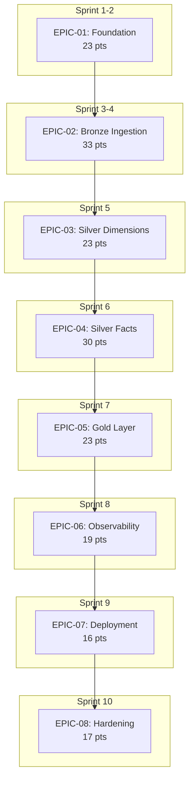

# Sprint Backlog: Patient 360 Medallion Pipeline

| Field | Value |
|-------|-------|
| **Version** | 1.0 |
| **Created** | 2026-03-23 |
| **Last Modified** | 2026-03-23 |
| **Author** | Scrum Master Agent |
| **Status** | Draft |
| **LLD Reference** | LLD-2026-03-23-patient-360.md (v1.3) |

---

## 1. Executive Summary

This sprint backlog decomposes the Patient 360 Medallion Pipeline into 8 epics and 60 stories totaling 184 story points across 10 sprints (2-week sprints). The backlog maps one-to-one to the 8 implementation phases defined in the LLD, progressing from foundation setup through Bronze ingestion, Silver dimensions, Silver facts, Gold layer, observability, deployment, and hardening.

The pipeline processes 13 Synthea Healthcare EHR source tables (7.9M rows) through a three-layer Medallion architecture (Bronze/Silver/Gold) using a config-driven ingestion framework with inline Spark Expectations DQ validation. Key deliverables include: 13 Bronze Delta tables, 4 SCD Type 2 dimension tables, 9 Silver fact tables, and 3 consumer-ready Gold tables serving 400+ clinical and billing users.

**Team**: 3.0 effective FTE (2 full-time + 2 half-time engineers), velocity 25-30 pts/sprint.

**Critical path**: Foundation -> Bronze ingestion -> Silver dimensions -> Silver facts -> Gold layer -> Observability -> Deployment -> Hardening.

---

## 2. Epic Overview

| Epic | Title | Stories | Points | Sprints | LLD Section |
|------|-------|---------|--------|---------|-------------|
| EPIC-01 | Foundation | 8 | 23 | Sprint 1-2 | Phase 1 |
| EPIC-02 | Bronze Layer -- Config-Driven Ingestion | 10 | 33 | Sprint 3-4 | Phase 2 |
| EPIC-03 | Silver Dimensions -- SCD Type 2 | 8 | 23 | Sprint 5 | Phase 3 |
| EPIC-04 | Silver Facts + Reconciliation | 12 | 30 | Sprint 6 | Phase 4 |
| EPIC-05 | Gold Layer + Reconciliation | 6 | 23 | Sprint 7 | Phase 5 |
| EPIC-06 | Observability + Monitoring | 6 | 19 | Sprint 8 | Phase 6 |
| EPIC-07 | Deployment + Rollback | 4 | 16 | Sprint 9 | Phase 7 |
| EPIC-08 | Hardening + Performance | 6 | 17 | Sprint 10 | Phase 8 |

**Total**: 60 stories, 184 points across 10 sprints

---

## 3. Dependency Graph

### Story-Level Critical Path

---

## 4. Sprint Plan

### Sprint 1: Foundation Setup

| Story ID | Title | Points | Epic |
|----------|-------|--------|------|
| STORY-01-001 | Create Project Directory Structure | 2 | EPIC-01 |
| STORY-01-002 | Implement Configuration Loader | 3 | EPIC-01 |
| STORY-01-003 | Create Configuration Template YAML | 2 | EPIC-01 |
| STORY-01-004 | Set Up Structured Logging Framework | 2 | EPIC-01 |
| STORY-01-005 | Set Up Test Infrastructure | 3 | EPIC-01 |
| STORY-01-006 | Docker Compose Development Environment | 3 | EPIC-01 |

**Sprint Total**: 15 points

### Sprint 2: Foundation Completion

| Story ID | Title | Points | Epic |
|----------|-------|--------|------|
| STORY-01-007 | Airflow DAG Skeleton | 3 | EPIC-01 |
| STORY-01-008 | Define StructType Schemas for All 13 Bronze Tables | 5 | EPIC-01 |

**Sprint Total**: 8 points

### Sprint 3: Bronze Ingestion Framework

| Story ID | Title | Points | Epic |
|----------|-------|--------|------|
| STORY-02-001 | Create Per-Table YAML Ingestion Configs | 3 | EPIC-02 |
| STORY-02-002 | Implement Generic Ingestion Runner | 5 | EPIC-02 |
| STORY-02-003 | Implement SparkSubmitOperator Wrapper | 2 | EPIC-02 |
| STORY-02-004 | Implement TaskGroup Factory | 3 | EPIC-02 |
| STORY-02-005 | Wire Factory Into DAG | 2 | EPIC-02 |
| STORY-02-006 | Implement SE Runner and Bronze DQ Rules | 5 | EPIC-02 |

**Sprint Total**: 20 points

### Sprint 4: Bronze Testing and Reconciliation

| Story ID | Title | Points | Epic |
|----------|-------|--------|------|
| STORY-02-007 | Implement Reconciliation Bronze Task | 3 | EPIC-02 |
| STORY-02-008 | Implement Dead Letter Writer | 2 | EPIC-02 |
| STORY-02-009 | Unit Tests for Bronze Ingestion Framework | 5 | EPIC-02 |
| STORY-02-010 | Integration Test for Bronze Pipeline | 3 | EPIC-02 |

**Sprint Total**: 13 points

### Sprint 5: Silver Dimensions (SCD Type 2)

| Story ID | Title | Points | Epic |
|----------|-------|--------|------|
| STORY-03-001 | Implement SCD2 Generic Merge Function | 5 | EPIC-03 |
| STORY-03-002 | Transform Patients to Silver (SCD2) | 3 | EPIC-03 |
| STORY-03-003 | Transform Organizations to Silver (SCD2) | 2 | EPIC-03 |
| STORY-03-004 | Transform Providers to Silver (SCD2) | 2 | EPIC-03 |
| STORY-03-005 | Transform Payers to Silver (SCD2) | 2 | EPIC-03 |
| STORY-03-006 | Implement Code System Mappings | 3 | EPIC-03 |
| STORY-03-007 | Implement Derived Fields Module | 3 | EPIC-03 |
| STORY-03-008 | Unit Tests for SCD2 and Derived Fields | 3 | EPIC-03 |

**Sprint Total**: 23 points

### Sprint 6: Silver Facts + Reconciliation

| Story ID | Title | Points | Epic |
|----------|-------|--------|------|
| STORY-04-001 | Transform Encounters to Silver | 3 | EPIC-04 |
| STORY-04-002 | Transform Conditions to Silver | 2 | EPIC-04 |
| STORY-04-003 | Transform Medications to Silver | 2 | EPIC-04 |
| STORY-04-004 | Transform Observations to Silver | 3 | EPIC-04 |
| STORY-04-005 | Transform Allergies to Silver (Safety Critical) | 3 | EPIC-04 |
| STORY-04-006 | Transform Immunizations to Silver | 2 | EPIC-04 |
| STORY-04-007 | Transform Procedures to Silver | 2 | EPIC-04 |
| STORY-04-008 | Transform Claims to Silver | 2 | EPIC-04 |
| STORY-04-009 | Transform Careplans to Silver | 2 | EPIC-04 |
| STORY-04-010 | Implement Silver DQ Rules YAML | 3 | EPIC-04 |
| STORY-04-011 | Implement Reconciliation Silver Task | 3 | EPIC-04 |
| STORY-04-012 | Integration Test for Silver Pipeline | 3 | EPIC-04 |

**Sprint Total**: 30 points

### Sprint 7: Gold Layer + End-to-End

| Story ID | Title | Points | Epic |
|----------|-------|--------|------|
| STORY-05-001 | Build Patient Summary Gold Table | 5 | EPIC-05 |
| STORY-05-002 | Build Clinical History Gold Table | 5 | EPIC-05 |
| STORY-05-003 | Build Billing Summary Gold Table | 3 | EPIC-05 |
| STORY-05-004 | Implement Gold DQ Rules YAML | 2 | EPIC-05 |
| STORY-05-005 | Implement Reconciliation Gold Task | 3 | EPIC-05 |
| STORY-05-006 | Integration Test for Gold Pipeline and End-to-End | 5 | EPIC-05 |

**Sprint Total**: 23 points

### Sprint 8: Observability + Monitoring

| Story ID | Title | Points | Epic |
|----------|-------|--------|------|
| STORY-06-001 | OpenLineage Integration | 5 | EPIC-06 |
| STORY-06-002 | OpenTelemetry Metrics Emission | 3 | EPIC-06 |
| STORY-06-003 | Grafana Pipeline Health Dashboard | 3 | EPIC-06 |
| STORY-06-004 | Grafana DQ Scores Dashboard | 3 | EPIC-06 |
| STORY-06-005 | Grafana SLA Tracking Dashboard | 2 | EPIC-06 |
| STORY-06-006 | Alerting Rules and Allergy Escalation | 3 | EPIC-06 |

**Sprint Total**: 19 points

### Sprint 9: Deployment + Rollback

| Story ID | Title | Points | Epic |
|----------|-------|--------|------|
| STORY-07-001 | GitHub Actions CI Pipeline | 5 | EPIC-07 |
| STORY-07-002 | Docker Image Build | 3 | EPIC-07 |
| STORY-07-003 | Environment Promotion Flow | 5 | EPIC-07 |
| STORY-07-004 | Delta RESTORE Runbook and Pipeline Re-run Procedure | 3 | EPIC-07 |

**Sprint Total**: 16 points

### Sprint 10: Hardening + Go/No-Go

| Story ID | Title | Points | Epic |
|----------|-------|--------|------|
| STORY-08-001 | Performance Tuning for Observations Table | 3 | EPIC-08 |
| STORY-08-002 | Broadcast Join and Caching Optimization | 3 | EPIC-08 |
| STORY-08-003 | Delta VACUUM and OPTIMIZE Scheduling | 2 | EPIC-08 |
| STORY-08-004 | Load Testing and Performance Baseline | 3 | EPIC-08 |
| STORY-08-005 | Security Review and PHI Verification | 3 | EPIC-08 |
| STORY-08-006 | Documentation and Coverage Audit | 3 | EPIC-08 |

**Sprint Total**: 17 points

---

## 5. Traceability Matrix

| Epic / Story | LLD | DMS | STM | DQS | DRD | HLD |
|-------------|-----|-----|-----|-----|-----|-----|
| EPIC-01 | SS2.1, SS4.1, SS7, SS9.1 | SS2 | -- | -- | -- | SS5.1 |
| EPIC-02 | SS2.3, SS4.2, SS5.1, SS5.4, SS5.5, SS8 | SS2, SS4 | Source-to-Bronze | SS2 (Bronze) | SS1.3 | -- |
| EPIC-03 | SS2.3, SS5.2 | SS5, SS6 | Bronze-to-Silver, Code Systems | -- | SS5.2, SS7 | -- |
| EPIC-04 | SS5.2, SS5.5, SS6.5 | SS5 | Bronze-to-Silver | SS2 (Silver), SS4 | SS1.3 | -- |
| EPIC-05 | SS5.3, SS6.2, SS6.4 | SS5 | Silver-to-Gold | SS2 (Gold), SS4 | SS4.4, SS5.2 | -- |
| EPIC-06 | SS10.1, SS10.2, SS10.3, SS8.3-8.5 | -- | -- | SS1, SS3 | -- | -- |
| EPIC-07 | SS9.2, SS9.3, SS9.4 | -- | -- | -- | SS4.3 | -- |
| EPIC-08 | SS2.4, SS4.4, SS6, SS3 | SS5 | -- | SS2 | SS4.3, SS7 | -- |

---

## 6. Risks & Assumptions

- **SCD2 Complexity**: SCD2 merge logic is the most complex transformation. Hash column mismatch could cause false change detection. _(Mitigation: Unit tests with known input/output pairs per DMS SS6)_
- **Observations Table OOM**: The 4.4M row observations table may cause out-of-memory errors during Silver processing. _(Mitigation: Shuffle partitions tuned to 8; monitor memory in DEV per LLD SS6.5)_
- **ARRAY Gold Build Timeout**: Gold table ARRAY aggregations may be slow for patient_summary. _(Mitigation: Pre-aggregate arrays in subquery before join; cache intermediate results per LLD SS6.4)_
- **Convention-Based DQ Miss**: SE rule convention discovery may silently miss rules for a table. _(Mitigation: Unit test asserts every table config has >= 1 matching rule per LLD SS2.4)_
- **Allergy Data Safety**: Any suppression of allergy records is a safety incident. _(Mitigation: action_if_failed: fail on all allergy DQ rules; escalation to Clinical Ops per DQS SS1)_
- **Sprint 6 Over-Allocation**: Sprint 6 (Silver Facts) is at 30 points, at the upper bound of velocity. _(Mitigation: Many Silver fact tables are similar 2-point stories; Taylor P. can batch DQ work)_

### Assumptions

- Team velocity holds at 25-30 points/sprint throughout the project
- DuckDB source data is available and read-only accessible from Sprint 1
- Docker Desktop or equivalent is available on all developer machines
- Sam R. (50% allocation) is not assigned blocking stories
- Taylor P. (50% allocation) handles DQ stories in batches for efficiency
- No production freeze impacts the planned sprint schedule
- Alex M. is the primary owner for all Spark-related stories

---

## 7. Version History

| Version | Date | Author | Changes |
|---------|------|--------|---------|
| 1.0 | 2026-03-23 | Scrum Master Agent | Initial backlog creation: 8 epics, 60 stories, 184 points across 10 sprints |
