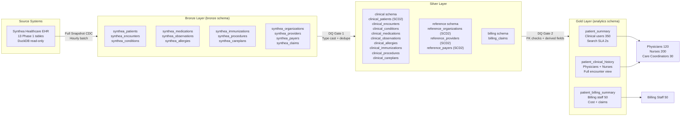

# Data Model Specification: Patient 360 Medallion Pipeline

| Field | Value |
|-------|-------|
| **Version** | 1.1 |
| **Created** | 2026-03-18 |
| **Last Modified** | 2026-03-21 |
| **Author** | Data Modeler Agent |
| **Status** | Approved |
| **HLD Reference** | HLD-2026-03-17-patient-360-pipeline-v1.1.md |
| **DRD Reference** | DRD-2026-02-11-patient-360.md (v1.1) |

---

## 1. Design Overview

### 1.1 Modeling Approach

This DMS translates the Medallion Architecture defined in HLD §4.1 into concrete schemas across three layers. The Bronze layer mirrors source tables exactly with added pipeline metadata. The Silver layer conforms data to canonical business entities, applies SCD Type 2 to four dimension tables (patients, providers, payers, organizations), and computes derived clinical fields per DRD §5.2. The Gold layer produces three denormalized consumer tables optimised for the 2-second query SLA [DRD §4.3], with allergies, active conditions, and active medications represented as `ARRAY<STRUCT>` complex types to eliminate joins at query time without separate bridge tables [HLD §4.3].

All 13 Phase 1 source tables are in scope. The five Phase 2 tables (`claims_transactions`, `payer_transitions`, `devices`, `supplies`, `imaging_studies`) are excluded [DRD §2.2].

### 1.2 Layer Summary

| Layer | Purpose | Table Count | Key Characteristics |
|-------|---------|-------------|---------------------|
| Bronze | Immutable raw copy with pipeline metadata | 13 | Source-aligned names, no transformations, partition by `ds` |
| Silver | Canonical business entities, SCD Type 2 on dimensions, derived fields | 13 | Domain-prefixed schemas, standardised types, composite PKs where source lacks an ID |
| Gold | Denormalized consumer tables for 2-second SLA | 3 | Consumer-aligned grain, `ARRAY<STRUCT>` for allergies, conditions, and medications, role-segregated cost data |

### 1.3 HLD Traceability

This DMS implements the layer specifications defined in HLD-2026-03-17-patient-360-pipeline-v1.1.md.

| DMS Section | HLD Section | Notes |
|-------------|-------------|-------|
| §2 Bronze Layer Schemas | HLD §4.3 Bronze Layer | 13 Phase 1 tables; Full Snapshot CDC; partition by `ds`; `_ingested_at`, `_source_batch_id`, `_source_file` metadata columns |
| §3 Silver Layer Schemas | HLD §4.3 Silver Layer, §4.5 SCD Strategy | SCD Type 2 on patients, providers, payers, organizations via Delta MERGE INTO; derived fields per DRD §5.2 |
| §4 Gold Layer Schemas | HLD §4.3 Gold Layer, §2.1 FR-1/FR-2/FR-3 | Three consumer tables: patient_summary, patient_clinical_history, patient_billing_summary |
| §6 SCD Strategy | HLD §4.5, §7 Decision 3 | Type 2 for all four dimension tables; SHA-256 hash change detection |
| §7 Physical Design | HLD §5.7 Key Design Principles | All Bronze/Silver tables partition by `ds`; SCD2 dimensions use Delta MERGE INTO |

### 1.4 Holistic Entity Relationship Diagram

```mermaid
erDiagram
  %% ── Bronze Layer ──────────────────────────────────────────────────
  bronze_synthea_patients {
    VARCHAR Id PK
    DATE BIRTHDATE
    VARCHAR GENDER
    VARCHAR ADDRESS
    TIMESTAMP _ingested_at
  }
  bronze_synthea_encounters {
    VARCHAR Id PK
    TIMESTAMP START
    VARCHAR PATIENT FK
    VARCHAR ENCOUNTERCLASS
    TIMESTAMP _ingested_at
  }
  bronze_synthea_conditions {
    DATE START
    VARCHAR PATIENT FK
    VARCHAR ENCOUNTER FK
    BIGINT CODE
    TIMESTAMP _ingested_at
  }
  bronze_synthea_allergies {
    VARCHAR PATIENT FK
    BIGINT CODE
    VARCHAR SEVERITY1
    TIMESTAMP _ingested_at
  }
  bronze_synthea_claims {
    VARCHAR Id PK
    VARCHAR PATIENTID FK
    TIMESTAMP _ingested_at
  }

  %% ── Silver Layer ──────────────────────────────────────────────────
  clinical_patients {
    VARCHAR patient_id "natural key"
    DATE birth_date
    VARCHAR gender
    DATE effective_from
    DATE effective_to
    BOOLEAN is_current
    VARCHAR _record_hash
  }
  clinical_encounters {
    VARCHAR encounter_id PK
    VARCHAR patient_id FK
    VARCHAR organization_id FK
    VARCHAR provider_id FK
    VARCHAR encounter_class
    DECIMAL total_visit_cost
  }
  clinical_conditions {
    VARCHAR patient_id FK
    VARCHAR encounter_id FK
    VARCHAR snomed_code
    DATE onset_date
    VARCHAR condition_status
  }
  clinical_allergies {
    VARCHAR patient_id FK
    VARCHAR allergy_code
    DATE start_date
    VARCHAR severity1
  }
  clinical_medications {
    VARCHAR patient_id FK
    VARCHAR encounter_id FK
    VARCHAR rxnorm_code
    VARCHAR medication_status
  }
  clinical_observations {
    VARCHAR patient_id FK
    VARCHAR encounter_id FK
    VARCHAR loinc_code
    VARCHAR observation_value
  }
  clinical_procedures {
    VARCHAR patient_id FK
    VARCHAR encounter_id FK
    VARCHAR snomed_code
    DECIMAL base_cost
  }
  clinical_immunizations {
    VARCHAR patient_id FK
    VARCHAR encounter_id FK
    VARCHAR cvx_code
  }
  clinical_careplans {
    VARCHAR careplan_id PK
    VARCHAR patient_id FK
    VARCHAR encounter_id FK
  }
  reference_organizations {
    VARCHAR organization_id "natural key"
    VARCHAR organization_name
    DATE effective_from
    BOOLEAN is_current
  }
  reference_providers {
    VARCHAR provider_id "natural key"
    VARCHAR organization_id FK
    DATE effective_from
    BOOLEAN is_current
  }
  reference_payers {
    VARCHAR payer_id "natural key"
    VARCHAR payer_name
    DATE effective_from
    BOOLEAN is_current
  }
  billing_claims {
    VARCHAR claim_id PK
    VARCHAR patient_id FK
    VARCHAR provider_id FK
  }

  %% ── Gold Layer ────────────────────────────────────────────────────
  patient_summary {
    VARCHAR patient_id PK
    VARCHAR first_name
    INTEGER calculated_age
    VARCHAR patient_status
    BOOLEAN has_allergy
    INTEGER active_condition_count
    ARRAY_STRUCT allergies
    ARRAY_STRUCT conditions
    ARRAY_STRUCT medications
  }
  patient_clinical_history {
    VARCHAR encounter_id PK
    VARCHAR patient_id FK
    VARCHAR encounter_class
    BOOLEAN is_30_day_readmission
    INTEGER observation_count
  }
  patient_billing_summary {
    VARCHAR encounter_id PK
    VARCHAR patient_id FK
    DECIMAL total_visit_cost
    VARCHAR primary_payer_name
  }

  %% ── Cross-layer relationships ─────────────────────────────────────
  bronze_synthea_patients ||--|| clinical_patients : "cleanse + SCD2"
  bronze_synthea_encounters ||--|| clinical_encounters : "cleanse"
  bronze_synthea_conditions ||--o{ clinical_conditions : "cleanse"
  bronze_synthea_allergies ||--o{ clinical_allergies : "cleanse"
  bronze_synthea_claims ||--|| billing_claims : "cleanse"

  clinical_patients ||--o{ clinical_encounters : "patient_id"
  clinical_patients ||--o{ clinical_conditions : "patient_id"
  clinical_patients ||--o{ clinical_allergies : "patient_id"
  clinical_patients ||--o{ clinical_medications : "patient_id"
  clinical_patients ||--o{ clinical_observations : "patient_id"
  clinical_patients ||--o{ clinical_procedures : "patient_id"
  clinical_patients ||--o{ clinical_immunizations : "patient_id"
  clinical_patients ||--o{ clinical_careplans : "patient_id"
  clinical_patients ||--o{ billing_claims : "patient_id"
  clinical_encounters ||--o{ clinical_conditions : "encounter_id"
  clinical_encounters ||--o{ clinical_medications : "encounter_id"
  clinical_encounters ||--o{ clinical_observations : "encounter_id"
  clinical_encounters ||--o{ clinical_procedures : "encounter_id"
  clinical_encounters ||--o{ clinical_immunizations : "encounter_id"
  clinical_encounters ||--o{ clinical_careplans : "encounter_id"
  reference_organizations ||--o{ reference_providers : "organization_id"

  clinical_patients ||--|| patient_summary : "current version"
  clinical_encounters ||--o{ patient_clinical_history : "per-encounter"
  clinical_encounters ||--o{ patient_billing_summary : "per-encounter"
  billing_claims ||--o{ patient_billing_summary : "claim join"
  patient_summary ||--o{ patient_clinical_history : "patient_id"
  patient_summary ||--o{ patient_billing_summary : "patient_id"
```



### 1.5 Scope & Boundaries

This DMS defines the **logical data model**: table structures, column definitions, data types, primary/foreign key relationships, grain statements, and SCD strategies.

| Concern | Downstream Document |
|---------|-------------------|
| Column-level transform expressions | Source-to-Target Mapping (STM) |
| Null handling and rejection rules | Data Quality Specification (DQS) |
| Storage format, compression, retention | Low-Level Design (LLD) |

### 1.6 Layer Architecture



---

## 2. Bronze Layer Schemas

Bronze tables mirror source structures exactly. The only additions are three pipeline metadata columns. No business transformations are applied. All tables partition by `ds` (DATE, format `YYYY-MM-DD`) using `replaceWhere` for idempotent reruns [HLD §5.7].

**Source type observations** (from verified DESCRIBE queries against `data/duckdb/raw.db`):
- `allergies.STOP` is `VARCHAR` in source (not `DATE`) — requires explicit cast in Silver
- All cost columns (`BASE_ENCOUNTER_COST`, `TOTAL_CLAIM_COST`, `PAYER_COVERAGE`, `BASE_COST`, `TOTALCOST`, `REVENUE`, `OUTSTANDING*`) are `DOUBLE` in source — preserved as `DOUBLE` in Bronze, cast to `DECIMAL(12,2)` at Silver boundary
- `CODE` columns for conditions, medications, allergies, procedures, careplans are `BIGINT` — preserved as `BIGINT` in Bronze, cast to `VARCHAR` in Silver (codes must not be stored as numerics)
- `LAT`/`LON` are `DOUBLE` — preserved in Bronze, cast to `DECIMAL(9,6)` in Silver

### synthea_patients (Bronze)

Raw patient demographic records from Synthea EHR. Contains PHI including SSN, DRIVERS, and PASSPORT — these columns are preserved in Bronze but dropped at the Silver boundary per data governance policy §2.1.

**Source**: `synthea.patients` [HLD §4.3]

```yaml
table: synthea_patients
layer: bronze
schema: bronze
source_table: synthea.patients
partition_by: ds
write_strategy: replaceWhere ds = '{ds}'
row_count_verified: 5767
columns:
  - name: Id
    type: VARCHAR
    nullable: false
    source: synthea.patients.Id
    description: Patient UUID — natural key
  - name: BIRTHDATE
    type: DATE
    nullable: true
    source: synthea.patients.BIRTHDATE
    description: Date of birth
  - name: DEATHDATE
    type: DATE
    nullable: true
    source: synthea.patients.DEATHDATE
    description: Date of death — NULL for living patients
  - name: SSN
    type: VARCHAR
    nullable: true
    source: synthea.patients.SSN
    description: Social Security Number — PHI, dropped at Silver boundary
  - name: DRIVERS
    type: VARCHAR
    nullable: true
    source: synthea.patients.DRIVERS
    description: Driver license number — PII, dropped at Silver boundary
  - name: PASSPORT
    type: VARCHAR
    nullable: true
    source: synthea.patients.PASSPORT
    description: Passport number — PII, dropped at Silver boundary
  - name: PREFIX
    type: VARCHAR
    nullable: true
    source: synthea.patients.PREFIX
    description: Name prefix (Mr., Ms., Dr.)
  - name: FIRST
    type: VARCHAR
    nullable: true
    source: synthea.patients.FIRST
    description: First name — PHI
  - name: MIDDLE
    type: VARCHAR
    nullable: true
    source: synthea.patients.MIDDLE
    description: Middle name — PHI
  - name: LAST
    type: VARCHAR
    nullable: true
    source: synthea.patients.LAST
    description: Last name — PHI
  - name: SUFFIX
    type: VARCHAR
    nullable: true
    source: synthea.patients.SUFFIX
    description: Name suffix (Jr., III)
  - name: MAIDEN
    type: VARCHAR
    nullable: true
    source: synthea.patients.MAIDEN
    description: Maiden name — PHI
  - name: MARITAL
    type: VARCHAR
    nullable: true
    source: synthea.patients.MARITAL
    description: Marital status code (M, S, W, D)
  - name: RACE
    type: VARCHAR
    nullable: true
    source: synthea.patients.RACE
    description: Race
  - name: ETHNICITY
    type: VARCHAR
    nullable: true
    source: synthea.patients.ETHNICITY
    description: Ethnicity
  - name: GENDER
    type: VARCHAR
    nullable: true
    source: synthea.patients.GENDER
    description: Gender code (M, F)
  - name: BIRTHPLACE
    type: VARCHAR
    nullable: true
    source: synthea.patients.BIRTHPLACE
    description: Birth place
  - name: ADDRESS
    type: VARCHAR
    nullable: true
    source: synthea.patients.ADDRESS
    description: Street address — PHI
  - name: CITY
    type: VARCHAR
    nullable: true
    source: synthea.patients.CITY
    description: City
  - name: STATE
    type: VARCHAR
    nullable: true
    source: synthea.patients.STATE
    description: State abbreviation
  - name: COUNTY
    type: VARCHAR
    nullable: true
    source: synthea.patients.COUNTY
    description: County name
  - name: FIPS
    type: BIGINT
    nullable: true
    source: synthea.patients.FIPS
    description: FIPS geographic code
  - name: ZIP
    type: VARCHAR
    nullable: true
    source: synthea.patients.ZIP
    description: ZIP code
  - name: LAT
    type: DOUBLE
    nullable: true
    source: synthea.patients.LAT
    description: Latitude — DOUBLE in source, cast to DECIMAL(9,6) in Silver
  - name: LON
    type: DOUBLE
    nullable: true
    source: synthea.patients.LON
    description: Longitude — DOUBLE in source, cast to DECIMAL(9,6) in Silver
  - name: HEALTHCARE_EXPENSES
    type: DOUBLE
    nullable: true
    source: synthea.patients.HEALTHCARE_EXPENSES
    description: Total healthcare expenses — DOUBLE in source, cast to DECIMAL(12,2) in Silver
  - name: HEALTHCARE_COVERAGE
    type: DOUBLE
    nullable: true
    source: synthea.patients.HEALTHCARE_COVERAGE
    description: Total healthcare coverage — DOUBLE in source, cast to DECIMAL(12,2) in Silver
  - name: INCOME
    type: BIGINT
    nullable: true
    source: synthea.patients.INCOME
    description: Annual income
  - name: ds
    type: DATE
    nullable: false
    source: system
    description: Ingestion partition date (YYYY-MM-DD)
  # Metadata columns
  - name: _ingested_at
    type: TIMESTAMP
    nullable: false
    source: system
    description: Pipeline ingestion timestamp
  - name: _source_batch_id
    type: VARCHAR
    nullable: false
    source: system
    description: Pipeline run identifier
  - name: _source_file
    type: VARCHAR
    nullable: true
    source: system
    description: Source file path (CSV ingestion)
```

### synthea_encounters (Bronze)

Raw encounter records. Largest dimension table at 340,532 rows.

**Source**: `synthea.encounters` [HLD §4.3]

```yaml
table: synthea_encounters
layer: bronze
schema: bronze
source_table: synthea.encounters
partition_by: ds
write_strategy: replaceWhere ds = '{ds}'
row_count_verified: 340532
columns:
  - name: Id
    type: VARCHAR
    nullable: true
    source: synthea.encounters.Id
    description: Encounter UUID — natural key
  - name: START
    type: TIMESTAMP
    nullable: true
    source: synthea.encounters.START
    description: Encounter start datetime
  - name: STOP
    type: TIMESTAMP
    nullable: true
    source: synthea.encounters.STOP
    description: Encounter stop datetime — NULL for in-progress encounters
  - name: PATIENT
    type: VARCHAR
    nullable: true
    source: synthea.encounters.PATIENT
    description: FK to patients.Id
  - name: ORGANIZATION
    type: VARCHAR
    nullable: true
    source: synthea.encounters.ORGANIZATION
    description: FK to organizations.Id
  - name: PROVIDER
    type: VARCHAR
    nullable: true
    source: synthea.encounters.PROVIDER
    description: FK to providers.Id
  - name: PAYER
    type: VARCHAR
    nullable: true
    source: synthea.encounters.PAYER
    description: FK to payers.Id
  - name: ENCOUNTERCLASS
    type: VARCHAR
    nullable: true
    source: synthea.encounters.ENCOUNTERCLASS
    description: Encounter class (ambulatory, inpatient, emergency, etc.)
  - name: CODE
    type: BIGINT
    nullable: true
    source: synthea.encounters.CODE
    description: SNOMED-CT code — BIGINT in source, cast to VARCHAR in Silver
  - name: DESCRIPTION
    type: VARCHAR
    nullable: true
    source: synthea.encounters.DESCRIPTION
    description: Encounter description
  - name: BASE_ENCOUNTER_COST
    type: DOUBLE
    nullable: true
    source: synthea.encounters.BASE_ENCOUNTER_COST
    description: Base encounter cost — DOUBLE, cast to DECIMAL(12,2) in Silver
  - name: TOTAL_CLAIM_COST
    type: DOUBLE
    nullable: true
    source: synthea.encounters.TOTAL_CLAIM_COST
    description: Total claim cost — DOUBLE, cast to DECIMAL(12,2) in Silver
  - name: PAYER_COVERAGE
    type: DOUBLE
    nullable: true
    source: synthea.encounters.PAYER_COVERAGE
    description: Payer coverage amount — DOUBLE, cast to DECIMAL(12,2) in Silver
  - name: REASONCODE
    type: BIGINT
    nullable: true
    source: synthea.encounters.REASONCODE
    description: Reason SNOMED code — cast to VARCHAR in Silver
  - name: REASONDESCRIPTION
    type: VARCHAR
    nullable: true
    source: synthea.encounters.REASONDESCRIPTION
    description: Reason description
  - name: ds
    type: DATE
    nullable: false
    source: system
    description: Ingestion partition date
  - name: _ingested_at
    type: TIMESTAMP
    nullable: false
    source: system
    description: Pipeline ingestion timestamp
  - name: _source_batch_id
    type: VARCHAR
    nullable: false
    source: system
    description: Pipeline run identifier
  - name: _source_file
    type: VARCHAR
    nullable: true
    source: system
    description: Source file path
```

### synthea_conditions (Bronze)

Raw condition/diagnosis records. No natural ID column in source — composite key used in Silver.

**Source**: `synthea.conditions` [HLD §4.3]

```yaml
table: synthea_conditions
layer: bronze
schema: bronze
source_table: synthea.conditions
partition_by: ds
write_strategy: replaceWhere ds = '{ds}'
row_count_verified: 209767
columns:
  - name: START
    type: DATE
    nullable: true
    source: synthea.conditions.START
    description: Condition onset date
  - name: STOP
    type: DATE
    nullable: true
    source: synthea.conditions.STOP
    description: Condition resolution date — NULL for active conditions
  - name: PATIENT
    type: VARCHAR
    nullable: true
    source: synthea.conditions.PATIENT
    description: FK to patients.Id
  - name: ENCOUNTER
    type: VARCHAR
    nullable: true
    source: synthea.conditions.ENCOUNTER
    description: FK to encounters.Id
  - name: SYSTEM
    type: VARCHAR
    nullable: true
    source: synthea.conditions.SYSTEM
    description: Coding system (SNOMED-CT)
  - name: CODE
    type: BIGINT
    nullable: true
    source: synthea.conditions.CODE
    description: SNOMED-CT code — BIGINT in source, cast to VARCHAR in Silver
  - name: DESCRIPTION
    type: VARCHAR
    nullable: true
    source: synthea.conditions.DESCRIPTION
    description: Condition description
  - name: ds
    type: DATE
    nullable: false
    source: system
    description: Ingestion partition date
  - name: _ingested_at
    type: TIMESTAMP
    nullable: false
    source: system
    description: Pipeline ingestion timestamp
  - name: _source_batch_id
    type: VARCHAR
    nullable: false
    source: system
    description: Pipeline run identifier
  - name: _source_file
    type: VARCHAR
    nullable: true
    source: system
    description: Source file path
```

### synthea_medications (Bronze)

Raw medication/prescription records.

**Source**: `synthea.medications` [HLD §4.3]

```yaml
table: synthea_medications
layer: bronze
schema: bronze
source_table: synthea.medications
partition_by: ds
write_strategy: replaceWhere ds = '{ds}'
row_count_verified: 290136
columns:
  - name: START
    type: TIMESTAMP
    nullable: true
    source: synthea.medications.START
    description: Prescription start datetime
  - name: STOP
    type: TIMESTAMP
    nullable: true
    source: synthea.medications.STOP
    description: Prescription stop datetime — NULL for active prescriptions
  - name: PATIENT
    type: VARCHAR
    nullable: true
    source: synthea.medications.PATIENT
    description: FK to patients.Id
  - name: PAYER
    type: VARCHAR
    nullable: true
    source: synthea.medications.PAYER
    description: FK to payers.Id
  - name: ENCOUNTER
    type: VARCHAR
    nullable: true
    source: synthea.medications.ENCOUNTER
    description: FK to encounters.Id
  - name: CODE
    type: BIGINT
    nullable: true
    source: synthea.medications.CODE
    description: RxNorm code — BIGINT in source, cast to VARCHAR in Silver
  - name: DESCRIPTION
    type: VARCHAR
    nullable: true
    source: synthea.medications.DESCRIPTION
    description: Medication description
  - name: BASE_COST
    type: DOUBLE
    nullable: true
    source: synthea.medications.BASE_COST
    description: Base medication cost — cast to DECIMAL(12,2) in Silver
  - name: PAYER_COVERAGE
    type: DOUBLE
    nullable: true
    source: synthea.medications.PAYER_COVERAGE
    description: Payer coverage amount — cast to DECIMAL(12,2) in Silver
  - name: DISPENSES
    type: BIGINT
    nullable: true
    source: synthea.medications.DISPENSES
    description: Number of dispenses
  - name: TOTALCOST
    type: DOUBLE
    nullable: true
    source: synthea.medications.TOTALCOST
    description: Total medication cost — cast to DECIMAL(12,2) in Silver
  - name: REASONCODE
    type: BIGINT
    nullable: true
    source: synthea.medications.REASONCODE
    description: Reason SNOMED code — cast to VARCHAR in Silver
  - name: REASONDESCRIPTION
    type: VARCHAR
    nullable: true
    source: synthea.medications.REASONDESCRIPTION
    description: Reason description
  - name: ds
    type: DATE
    nullable: false
    source: system
    description: Ingestion partition date
  - name: _ingested_at
    type: TIMESTAMP
    nullable: false
    source: system
    description: Pipeline ingestion timestamp
  - name: _source_batch_id
    type: VARCHAR
    nullable: false
    source: system
    description: Pipeline run identifier
  - name: _source_file
    type: VARCHAR
    nullable: true
    source: system
    description: Source file path
```

### synthea_observations (Bronze)

Raw clinical observation records. Largest Phase 1 table at 4,366,447 rows.

**Source**: `synthea.observations` [HLD §4.3]

```yaml
table: synthea_observations
layer: bronze
schema: bronze
source_table: synthea.observations
partition_by: ds
write_strategy: replaceWhere ds = '{ds}'
row_count_verified: 4366447
columns:
  - name: DATE
    type: TIMESTAMP
    nullable: true
    source: synthea.observations.DATE
    description: Observation datetime
  - name: PATIENT
    type: VARCHAR
    nullable: true
    source: synthea.observations.PATIENT
    description: FK to patients.Id
  - name: ENCOUNTER
    type: VARCHAR
    nullable: true
    source: synthea.observations.ENCOUNTER
    description: FK to encounters.Id
  - name: CATEGORY
    type: VARCHAR
    nullable: true
    source: synthea.observations.CATEGORY
    description: Observation category (vital-signs, laboratory, etc.)
  - name: CODE
    type: VARCHAR
    nullable: true
    source: synthea.observations.CODE
    description: LOINC code — already VARCHAR in source
  - name: DESCRIPTION
    type: VARCHAR
    nullable: true
    source: synthea.observations.DESCRIPTION
    description: Observation description
  - name: VALUE
    type: VARCHAR
    nullable: true
    source: synthea.observations.VALUE
    description: Observation value (stored as VARCHAR — numeric and text values mixed)
  - name: UNITS
    type: VARCHAR
    nullable: true
    source: synthea.observations.UNITS
    description: Unit of measure
  - name: TYPE
    type: VARCHAR
    nullable: true
    source: synthea.observations.TYPE
    description: Value type (numeric, text, etc.)
  - name: ds
    type: DATE
    nullable: false
    source: system
    description: Ingestion partition date
  - name: _ingested_at
    type: TIMESTAMP
    nullable: false
    source: system
    description: Pipeline ingestion timestamp
  - name: _source_batch_id
    type: VARCHAR
    nullable: false
    source: system
    description: Pipeline run identifier
  - name: _source_file
    type: VARCHAR
    nullable: true
    source: system
    description: Source file path
```

### synthea_allergies (Bronze)

Raw allergy records. 56% null rate on SEVERITY1 is expected [DRD §3.1].
**Source type note**: `STOP` column is `VARCHAR` in source (not `DATE`) — explicit cast required at Silver boundary.

**Source**: `synthea.allergies` [HLD §4.3]

```yaml
table: synthea_allergies
layer: bronze
schema: bronze
source_table: synthea.allergies
partition_by: ds
write_strategy: replaceWhere ds = '{ds}'
row_count_verified: 5607
columns:
  - name: START
    type: DATE
    nullable: true
    source: synthea.allergies.START
    description: Allergy onset date
  - name: STOP
    type: VARCHAR
    nullable: true
    source: synthea.allergies.STOP
    description: Allergy stop date — stored as VARCHAR in source, explicit cast to DATE in Silver
  - name: PATIENT
    type: VARCHAR
    nullable: true
    source: synthea.allergies.PATIENT
    description: FK to patients.Id
  - name: ENCOUNTER
    type: VARCHAR
    nullable: true
    source: synthea.allergies.ENCOUNTER
    description: FK to encounters.Id
  - name: CODE
    type: BIGINT
    nullable: true
    source: synthea.allergies.CODE
    description: SNOMED-CT allergy code — BIGINT in source, cast to VARCHAR in Silver
  - name: SYSTEM
    type: VARCHAR
    nullable: true
    source: synthea.allergies.SYSTEM
    description: Coding system
  - name: DESCRIPTION
    type: VARCHAR
    nullable: true
    source: synthea.allergies.DESCRIPTION
    description: Allergy description — PHI Safety Critical, 0% null tolerance [DRD §3.1]
  - name: TYPE
    type: VARCHAR
    nullable: true
    source: synthea.allergies.TYPE
    description: Allergy type (allergy, intolerance)
  - name: CATEGORY
    type: VARCHAR
    nullable: true
    source: synthea.allergies.CATEGORY
    description: Allergy category (medication, food, environment)
  - name: REACTION1
    type: BIGINT
    nullable: true
    source: synthea.allergies.REACTION1
    description: Primary reaction SNOMED code — cast to VARCHAR in Silver
  - name: DESCRIPTION1
    type: VARCHAR
    nullable: true
    source: synthea.allergies.DESCRIPTION1
    description: Primary reaction description
  - name: SEVERITY1
    type: VARCHAR
    nullable: true
    source: synthea.allergies.SEVERITY1
    description: Primary reaction severity — 56% NULL rate expected, defaulted to Unknown in Silver [DRD §5.1]
  - name: REACTION2
    type: BIGINT
    nullable: true
    source: synthea.allergies.REACTION2
    description: Secondary reaction SNOMED code — cast to VARCHAR in Silver
  - name: DESCRIPTION2
    type: VARCHAR
    nullable: true
    source: synthea.allergies.DESCRIPTION2
    description: Secondary reaction description
  - name: SEVERITY2
    type: VARCHAR
    nullable: true
    source: synthea.allergies.SEVERITY2
    description: Secondary reaction severity
  - name: ds
    type: DATE
    nullable: false
    source: system
    description: Ingestion partition date
  - name: _ingested_at
    type: TIMESTAMP
    nullable: false
    source: system
    description: Pipeline ingestion timestamp
  - name: _source_batch_id
    type: VARCHAR
    nullable: false
    source: system
    description: Pipeline run identifier
  - name: _source_file
    type: VARCHAR
    nullable: true
    source: system
    description: Source file path
```

### synthea_immunizations (Bronze)

**Source**: `synthea.immunizations` [HLD §4.3]

```yaml
table: synthea_immunizations
layer: bronze
schema: bronze
source_table: synthea.immunizations
partition_by: ds
write_strategy: replaceWhere ds = '{ds}'
row_count_verified: 82605
columns:
  - name: DATE
    type: TIMESTAMP
    nullable: true
    source: synthea.immunizations.DATE
    description: Immunization datetime
  - name: PATIENT
    type: VARCHAR
    nullable: true
    source: synthea.immunizations.PATIENT
    description: FK to patients.Id
  - name: ENCOUNTER
    type: VARCHAR
    nullable: true
    source: synthea.immunizations.ENCOUNTER
    description: FK to encounters.Id
  - name: CODE
    type: VARCHAR
    nullable: true
    source: synthea.immunizations.CODE
    description: CVX immunization code — already VARCHAR in source
  - name: DESCRIPTION
    type: VARCHAR
    nullable: true
    source: synthea.immunizations.DESCRIPTION
    description: Vaccine description
  - name: BASE_COST
    type: DOUBLE
    nullable: true
    source: synthea.immunizations.BASE_COST
    description: Base immunization cost — cast to DECIMAL(12,2) in Silver
  - name: ds
    type: DATE
    nullable: false
    source: system
    description: Ingestion partition date
  - name: _ingested_at
    type: TIMESTAMP
    nullable: false
    source: system
    description: Pipeline ingestion timestamp
  - name: _source_batch_id
    type: VARCHAR
    nullable: false
    source: system
    description: Pipeline run identifier
  - name: _source_file
    type: VARCHAR
    nullable: true
    source: system
    description: Source file path
```

### synthea_procedures (Bronze)

**Source**: `synthea.procedures` [HLD §4.3]

```yaml
table: synthea_procedures
layer: bronze
schema: bronze
source_table: synthea.procedures
partition_by: ds
write_strategy: replaceWhere ds = '{ds}'
row_count_verified: 946498
columns:
  - name: START
    type: TIMESTAMP
    nullable: true
    source: synthea.procedures.START
    description: Procedure start datetime
  - name: STOP
    type: TIMESTAMP
    nullable: true
    source: synthea.procedures.STOP
    description: Procedure stop datetime
  - name: PATIENT
    type: VARCHAR
    nullable: true
    source: synthea.procedures.PATIENT
    description: FK to patients.Id
  - name: ENCOUNTER
    type: VARCHAR
    nullable: true
    source: synthea.procedures.ENCOUNTER
    description: FK to encounters.Id
  - name: SYSTEM
    type: VARCHAR
    nullable: true
    source: synthea.procedures.SYSTEM
    description: Coding system (SNOMED-CT)
  - name: CODE
    type: BIGINT
    nullable: true
    source: synthea.procedures.CODE
    description: SNOMED-CT procedure code — BIGINT in source, cast to VARCHAR in Silver
  - name: DESCRIPTION
    type: VARCHAR
    nullable: true
    source: synthea.procedures.DESCRIPTION
    description: Procedure description
  - name: BASE_COST
    type: DOUBLE
    nullable: true
    source: synthea.procedures.BASE_COST
    description: Procedure base cost — cast to DECIMAL(12,2) in Silver
  - name: REASONCODE
    type: BIGINT
    nullable: true
    source: synthea.procedures.REASONCODE
    description: Reason SNOMED code — cast to VARCHAR in Silver
  - name: REASONDESCRIPTION
    type: VARCHAR
    nullable: true
    source: synthea.procedures.REASONDESCRIPTION
    description: Reason description
  - name: ds
    type: DATE
    nullable: false
    source: system
    description: Ingestion partition date
  - name: _ingested_at
    type: TIMESTAMP
    nullable: false
    source: system
    description: Pipeline ingestion timestamp
  - name: _source_batch_id
    type: VARCHAR
    nullable: false
    source: system
    description: Pipeline run identifier
  - name: _source_file
    type: VARCHAR
    nullable: true
    source: system
    description: Source file path
```

### synthea_careplans (Bronze)

**Source**: `synthea.careplans` [HLD §4.3]

```yaml
table: synthea_careplans
layer: bronze
schema: bronze
source_table: synthea.careplans
partition_by: ds
write_strategy: replaceWhere ds = '{ds}'
row_count_verified: 19478
columns:
  - name: Id
    type: VARCHAR
    nullable: true
    source: synthea.careplans.Id
    description: Care plan UUID — natural key
  - name: START
    type: DATE
    nullable: true
    source: synthea.careplans.START
    description: Care plan start date
  - name: STOP
    type: DATE
    nullable: true
    source: synthea.careplans.STOP
    description: Care plan end date — NULL for active plans
  - name: PATIENT
    type: VARCHAR
    nullable: true
    source: synthea.careplans.PATIENT
    description: FK to patients.Id
  - name: ENCOUNTER
    type: VARCHAR
    nullable: true
    source: synthea.careplans.ENCOUNTER
    description: FK to encounters.Id
  - name: CODE
    type: BIGINT
    nullable: true
    source: synthea.careplans.CODE
    description: Care plan SNOMED code — cast to VARCHAR in Silver
  - name: DESCRIPTION
    type: VARCHAR
    nullable: true
    source: synthea.careplans.DESCRIPTION
    description: Care plan description
  - name: REASONCODE
    type: BIGINT
    nullable: true
    source: synthea.careplans.REASONCODE
    description: Reason code — cast to VARCHAR in Silver
  - name: REASONDESCRIPTION
    type: VARCHAR
    nullable: true
    source: synthea.careplans.REASONDESCRIPTION
    description: Reason description
  - name: ds
    type: DATE
    nullable: false
    source: system
    description: Ingestion partition date
  - name: _ingested_at
    type: TIMESTAMP
    nullable: false
    source: system
    description: Pipeline ingestion timestamp
  - name: _source_batch_id
    type: VARCHAR
    nullable: false
    source: system
    description: Pipeline run identifier
  - name: _source_file
    type: VARCHAR
    nullable: true
    source: system
    description: Source file path
```

### synthea_claims (Bronze)

**Source**: `synthea.claims` [HLD §4.3]

```yaml
table: synthea_claims
layer: bronze
schema: bronze
source_table: synthea.claims
partition_by: ds
write_strategy: replaceWhere ds = '{ds}'
row_count_verified: 630668
columns:
  - name: Id
    type: VARCHAR
    nullable: true
    source: synthea.claims.Id
    description: Claim UUID — natural key
  - name: PATIENTID
    type: VARCHAR
    nullable: true
    source: synthea.claims.PATIENTID
    description: FK to patients.Id
  - name: PROVIDERID
    type: VARCHAR
    nullable: true
    source: synthea.claims.PROVIDERID
    description: FK to providers.Id
  - name: PRIMARYPATIENTINSURANCEID
    type: VARCHAR
    nullable: true
    source: synthea.claims.PRIMARYPATIENTINSURANCEID
    description: Primary insurance payer transition ID
  - name: SECONDARYPATIENTINSURANCEID
    type: VARCHAR
    nullable: true
    source: synthea.claims.SECONDARYPATIENTINSURANCEID
    description: Secondary insurance payer transition ID
  - name: DEPARTMENTID
    type: BIGINT
    nullable: true
    source: synthea.claims.DEPARTMENTID
    description: Department ID
  - name: PATIENTDEPARTMENTID
    type: BIGINT
    nullable: true
    source: synthea.claims.PATIENTDEPARTMENTID
    description: Patient department ID
  - name: DIAGNOSIS1
    type: BIGINT
    nullable: true
    source: synthea.claims.DIAGNOSIS1
    description: Primary diagnosis code — cast to VARCHAR in Silver
  - name: DIAGNOSIS2
    type: BIGINT
    nullable: true
    source: synthea.claims.DIAGNOSIS2
    description: Secondary diagnosis code
  - name: DIAGNOSIS3
    type: BIGINT
    nullable: true
    source: synthea.claims.DIAGNOSIS3
    description: Tertiary diagnosis code
  - name: DIAGNOSIS4
    type: BIGINT
    nullable: true
    source: synthea.claims.DIAGNOSIS4
    description: Quaternary diagnosis code
  - name: DIAGNOSIS5
    type: BIGINT
    nullable: true
    source: synthea.claims.DIAGNOSIS5
    description: Diagnosis code 5
  - name: DIAGNOSIS6
    type: BIGINT
    nullable: true
    source: synthea.claims.DIAGNOSIS6
    description: Diagnosis code 6
  - name: DIAGNOSIS7
    type: BIGINT
    nullable: true
    source: synthea.claims.DIAGNOSIS7
    description: Diagnosis code 7
  - name: DIAGNOSIS8
    type: BIGINT
    nullable: true
    source: synthea.claims.DIAGNOSIS8
    description: Diagnosis code 8
  - name: REFERRINGPROVIDERID
    type: VARCHAR
    nullable: true
    source: synthea.claims.REFERRINGPROVIDERID
    description: Referring provider FK
  - name: APPOINTMENTID
    type: VARCHAR
    nullable: true
    source: synthea.claims.APPOINTMENTID
    description: Appointment ID
  - name: CURRENTILLNESSDATE
    type: TIMESTAMP
    nullable: true
    source: synthea.claims.CURRENTILLNESSDATE
    description: Current illness date
  - name: SERVICEDATE
    type: TIMESTAMP
    nullable: true
    source: synthea.claims.SERVICEDATE
    description: Service date
  - name: SUPERVISINGPROVIDERID
    type: VARCHAR
    nullable: true
    source: synthea.claims.SUPERVISINGPROVIDERID
    description: Supervising provider FK
  - name: STATUS1
    type: VARCHAR
    nullable: true
    source: synthea.claims.STATUS1
    description: Primary claim status
  - name: STATUS2
    type: VARCHAR
    nullable: true
    source: synthea.claims.STATUS2
    description: Secondary claim status
  - name: STATUSP
    type: VARCHAR
    nullable: true
    source: synthea.claims.STATUSP
    description: Patient claim status
  - name: OUTSTANDING1
    type: DOUBLE
    nullable: true
    source: synthea.claims.OUTSTANDING1
    description: Primary outstanding amount — cast to DECIMAL(12,2) in Silver
  - name: OUTSTANDING2
    type: DOUBLE
    nullable: true
    source: synthea.claims.OUTSTANDING2
    description: Secondary outstanding amount — cast to DECIMAL(12,2) in Silver
  - name: OUTSTANDINGP
    type: DOUBLE
    nullable: true
    source: synthea.claims.OUTSTANDINGP
    description: Patient outstanding amount — cast to DECIMAL(12,2) in Silver
  - name: LASTBILLEDDATE1
    type: TIMESTAMP
    nullable: true
    source: synthea.claims.LASTBILLEDDATE1
    description: Last billed date (primary)
  - name: LASTBILLEDDATE2
    type: TIMESTAMP
    nullable: true
    source: synthea.claims.LASTBILLEDDATE2
    description: Last billed date (secondary)
  - name: LASTBILLEDDATEP
    type: TIMESTAMP
    nullable: true
    source: synthea.claims.LASTBILLEDDATEP
    description: Last billed date (patient)
  - name: HEALTHCARECLAIMTYPEID1
    type: BIGINT
    nullable: true
    source: synthea.claims.HEALTHCARECLAIMTYPEID1
    description: Healthcare claim type ID 1
  - name: HEALTHCARECLAIMTYPEID2
    type: BIGINT
    nullable: true
    source: synthea.claims.HEALTHCARECLAIMTYPEID2
    description: Healthcare claim type ID 2
  - name: ds
    type: DATE
    nullable: false
    source: system
    description: Ingestion partition date
  - name: _ingested_at
    type: TIMESTAMP
    nullable: false
    source: system
    description: Pipeline ingestion timestamp
  - name: _source_batch_id
    type: VARCHAR
    nullable: false
    source: system
    description: Pipeline run identifier
  - name: _source_file
    type: VARCHAR
    nullable: true
    source: system
    description: Source file path
```

### synthea_organizations (Bronze)

**Source**: `synthea.organizations` [HLD §4.3]

```yaml
table: synthea_organizations
layer: bronze
schema: bronze
source_table: synthea.organizations
partition_by: ds
write_strategy: replaceWhere ds = '{ds}'
row_count_verified: 1080
columns:
  - name: Id
    type: VARCHAR
    nullable: true
    source: synthea.organizations.Id
    description: Organization UUID — natural key
  - name: NAME
    type: VARCHAR
    nullable: true
    source: synthea.organizations.NAME
    description: Organization name
  - name: ADDRESS
    type: VARCHAR
    nullable: true
    source: synthea.organizations.ADDRESS
    description: Street address
  - name: CITY
    type: VARCHAR
    nullable: true
    source: synthea.organizations.CITY
    description: City
  - name: STATE
    type: VARCHAR
    nullable: true
    source: synthea.organizations.STATE
    description: State abbreviation
  - name: ZIP
    type: VARCHAR
    nullable: true
    source: synthea.organizations.ZIP
    description: ZIP code
  - name: LAT
    type: DOUBLE
    nullable: true
    source: synthea.organizations.LAT
    description: Latitude — cast to DECIMAL(9,6) in Silver
  - name: LON
    type: DOUBLE
    nullable: true
    source: synthea.organizations.LON
    description: Longitude — cast to DECIMAL(9,6) in Silver
  - name: PHONE
    type: VARCHAR
    nullable: true
    source: synthea.organizations.PHONE
    description: Phone number
  - name: REVENUE
    type: DOUBLE
    nullable: true
    source: synthea.organizations.REVENUE
    description: Annual revenue — cast to DECIMAL(12,2) in Silver
  - name: UTILIZATION
    type: BIGINT
    nullable: true
    source: synthea.organizations.UTILIZATION
    description: Utilization count
  - name: ds
    type: DATE
    nullable: false
    source: system
    description: Ingestion partition date
  - name: _ingested_at
    type: TIMESTAMP
    nullable: false
    source: system
    description: Pipeline ingestion timestamp
  - name: _source_batch_id
    type: VARCHAR
    nullable: false
    source: system
    description: Pipeline run identifier
  - name: _source_file
    type: VARCHAR
    nullable: true
    source: system
    description: Source file path
```

### synthea_providers (Bronze)

**Source**: `synthea.providers` [HLD §4.3]

```yaml
table: synthea_providers
layer: bronze
schema: bronze
source_table: synthea.providers
partition_by: ds
write_strategy: replaceWhere ds = '{ds}'
row_count_verified: 1080
columns:
  - name: Id
    type: VARCHAR
    nullable: true
    source: synthea.providers.Id
    description: Provider UUID — natural key
  - name: ORGANIZATION
    type: VARCHAR
    nullable: true
    source: synthea.providers.ORGANIZATION
    description: FK to organizations.Id
  - name: NAME
    type: VARCHAR
    nullable: true
    source: synthea.providers.NAME
    description: Provider full name
  - name: GENDER
    type: VARCHAR
    nullable: true
    source: synthea.providers.GENDER
    description: Provider gender
  - name: SPECIALITY
    type: VARCHAR
    nullable: true
    source: synthea.providers.SPECIALITY
    description: Medical specialty (note: source column is SPECIALITY not SPECIALTY)
  - name: ADDRESS
    type: VARCHAR
    nullable: true
    source: synthea.providers.ADDRESS
    description: Street address
  - name: CITY
    type: VARCHAR
    nullable: true
    source: synthea.providers.CITY
    description: City
  - name: STATE
    type: VARCHAR
    nullable: true
    source: synthea.providers.STATE
    description: State abbreviation
  - name: ZIP
    type: VARCHAR
    nullable: true
    source: synthea.providers.ZIP
    description: ZIP code
  - name: LAT
    type: DOUBLE
    nullable: true
    source: synthea.providers.LAT
    description: Latitude — cast to DECIMAL(9,6) in Silver
  - name: LON
    type: DOUBLE
    nullable: true
    source: synthea.providers.LON
    description: Longitude — cast to DECIMAL(9,6) in Silver
  - name: ENCOUNTERS
    type: BIGINT
    nullable: true
    source: synthea.providers.ENCOUNTERS
    description: Total encounter count
  - name: PROCEDURES
    type: BIGINT
    nullable: true
    source: synthea.providers.PROCEDURES
    description: Total procedure count
  - name: ds
    type: DATE
    nullable: false
    source: system
    description: Ingestion partition date
  - name: _ingested_at
    type: TIMESTAMP
    nullable: false
    source: system
    description: Pipeline ingestion timestamp
  - name: _source_batch_id
    type: VARCHAR
    nullable: false
    source: system
    description: Pipeline run identifier
  - name: _source_file
    type: VARCHAR
    nullable: true
    source: system
    description: Source file path
```

### synthea_payers (Bronze)

**Source**: `synthea.payers` [HLD §4.3]

```yaml
table: synthea_payers
layer: bronze
schema: bronze
source_table: synthea.payers
partition_by: ds
write_strategy: replaceWhere ds = '{ds}'
row_count_verified: 10
columns:
  - name: Id
    type: VARCHAR
    nullable: true
    source: synthea.payers.Id
    description: Payer UUID — natural key
  - name: NAME
    type: VARCHAR
    nullable: true
    source: synthea.payers.NAME
    description: Payer name
  - name: OWNERSHIP
    type: VARCHAR
    nullable: true
    source: synthea.payers.OWNERSHIP
    description: Ownership type (Government, Private)
  - name: ADDRESS
    type: VARCHAR
    nullable: true
    source: synthea.payers.ADDRESS
    description: Street address
  - name: CITY
    type: VARCHAR
    nullable: true
    source: synthea.payers.CITY
    description: City
  - name: STATE_HEADQUARTERED
    type: VARCHAR
    nullable: true
    source: synthea.payers.STATE_HEADQUARTERED
    description: State where headquartered
  - name: ZIP
    type: VARCHAR
    nullable: true
    source: synthea.payers.ZIP
    description: ZIP code
  - name: PHONE
    type: VARCHAR
    nullable: true
    source: synthea.payers.PHONE
    description: Phone number
  - name: AMOUNT_COVERED
    type: DOUBLE
    nullable: true
    source: synthea.payers.AMOUNT_COVERED
    description: Total amount covered — cast to DECIMAL(12,2) in Silver
  - name: AMOUNT_UNCOVERED
    type: DOUBLE
    nullable: true
    source: synthea.payers.AMOUNT_UNCOVERED
    description: Total amount uncovered — cast to DECIMAL(12,2) in Silver
  - name: REVENUE
    type: DOUBLE
    nullable: true
    source: synthea.payers.REVENUE
    description: Total revenue — cast to DECIMAL(12,2) in Silver
  - name: COVERED_ENCOUNTERS
    type: BIGINT
    nullable: true
    source: synthea.payers.COVERED_ENCOUNTERS
    description: Count of covered encounters
  - name: UNCOVERED_ENCOUNTERS
    type: BIGINT
    nullable: true
    source: synthea.payers.UNCOVERED_ENCOUNTERS
    description: Count of uncovered encounters
  - name: COVERED_MEDICATIONS
    type: BIGINT
    nullable: true
    source: synthea.payers.COVERED_MEDICATIONS
    description: Count of covered medications
  - name: UNCOVERED_MEDICATIONS
    type: BIGINT
    nullable: true
    source: synthea.payers.UNCOVERED_MEDICATIONS
    description: Count of uncovered medications
  - name: COVERED_PROCEDURES
    type: BIGINT
    nullable: true
    source: synthea.payers.COVERED_PROCEDURES
    description: Count of covered procedures
  - name: UNCOVERED_PROCEDURES
    type: BIGINT
    nullable: true
    source: synthea.payers.UNCOVERED_PROCEDURES
    description: Count of uncovered procedures
  - name: COVERED_IMMUNIZATIONS
    type: BIGINT
    nullable: true
    source: synthea.payers.COVERED_IMMUNIZATIONS
    description: Count of covered immunizations
  - name: UNCOVERED_IMMUNIZATIONS
    type: BIGINT
    nullable: true
    source: synthea.payers.UNCOVERED_IMMUNIZATIONS
    description: Count of uncovered immunizations
  - name: UNIQUE_CUSTOMERS
    type: BIGINT
    nullable: true
    source: synthea.payers.UNIQUE_CUSTOMERS
    description: Unique customer count
  - name: QOLS_AVG
    type: DOUBLE
    nullable: true
    source: synthea.payers.QOLS_AVG
    description: Quality of life score average
  - name: MEMBER_MONTHS
    type: BIGINT
    nullable: true
    source: synthea.payers.MEMBER_MONTHS
    description: Total member months
  - name: ds
    type: DATE
    nullable: false
    source: system
    description: Ingestion partition date
  - name: _ingested_at
    type: TIMESTAMP
    nullable: false
    source: system
    description: Pipeline ingestion timestamp
  - name: _source_batch_id
    type: VARCHAR
    nullable: false
    source: system
    description: Pipeline run identifier
  - name: _source_file
    type: VARCHAR
    nullable: true
    source: system
    description: Source file path
```

---

## 3. Silver Layer Schemas

Silver tables apply type standardisation, SCD Type 2 on dimensions, derived fields, and referential integrity. PHI columns SSN, DRIVERS, and PASSPORT are dropped at this boundary per governance policy §2.1. All DOUBLE cost columns are cast to DECIMAL(12,2). All BIGINT code columns are cast to VARCHAR. The `allergies.STOP` VARCHAR is explicitly cast to DATE.

SCD Type 2 tables (clinical_patients, reference_organizations, reference_providers, reference_payers) use Delta MERGE INTO and do **not** partition by `ds` — write strategy is upsert [HLD §4.5, Decision 3]. Fact tables use partition by `ds` with `replaceWhere`.

### clinical_patients (Silver)

Canonical patient demographic entity with SCD Type 2 history tracking. SSN, DRIVERS, and PASSPORT columns are excluded. Derived columns `calculated_age` and `patient_status` are computed here.

**Business Purpose**: Patient demographics with full historical tracking for address, insurance, and name changes [HLD §4.3 Silver Layer, DRD §1.2]

```yaml
table: clinical_patients
layer: silver
schema: clinical
primary_key: [patient_id, effective_from]
partition_by: none
write_strategy: Delta MERGE INTO on patient_id (SCD Type 2)
columns:
  - name: patient_id
    type: VARCHAR
    nullable: false
    source: bronze.synthea_patients.Id
    description: Patient UUID — natural key
  - name: birth_date
    type: DATE
    nullable: false
    source: bronze.synthea_patients.BIRTHDATE
    description: Date of birth — PHI
  - name: death_date
    type: DATE
    nullable: true
    source: bronze.synthea_patients.DEATHDATE
    description: Date of death — NULL for living patients
  - name: prefix
    type: VARCHAR(10)
    nullable: true
    source: bronze.synthea_patients.PREFIX
    description: Name prefix
  - name: first_name
    type: VARCHAR(100)
    nullable: false
    source: bronze.synthea_patients.FIRST
    description: First name — PHI
  - name: middle_name
    type: VARCHAR(100)
    nullable: true
    source: bronze.synthea_patients.MIDDLE
    description: Middle name — PHI
  - name: last_name
    type: VARCHAR(100)
    nullable: false
    source: bronze.synthea_patients.LAST
    description: Last name — PHI
  - name: suffix
    type: VARCHAR(10)
    nullable: true
    source: bronze.synthea_patients.SUFFIX
    description: Name suffix
  - name: maiden_name
    type: VARCHAR(100)
    nullable: true
    source: bronze.synthea_patients.MAIDEN
    description: Maiden name — PHI
  - name: marital_status
    type: VARCHAR(20)
    nullable: true
    source: bronze.synthea_patients.MARITAL
    description: Marital status (M, S, W, D) — NULL accepted per DRD §3.2
  - name: race
    type: VARCHAR(50)
    nullable: true
    source: bronze.synthea_patients.RACE
    description: Race — SCD Type 1 (overwrite on change per governance policy §6)
  - name: ethnicity
    type: VARCHAR(50)
    nullable: true
    source: bronze.synthea_patients.ETHNICITY
    description: Ethnicity — SCD Type 1 (overwrite on change per governance policy §6)
  - name: gender
    type: VARCHAR(10)
    nullable: true
    source: bronze.synthea_patients.GENDER
    business_rule: "Mapped to canonical values: MALE, FEMALE, OTHER, UNKNOWN per data-dictionary §5.2"
    description: Standardised gender (MALE/FEMALE/OTHER/UNKNOWN)
  - name: birth_place
    type: VARCHAR(200)
    nullable: true
    source: bronze.synthea_patients.BIRTHPLACE
    description: Birth place
  - name: address
    type: VARCHAR(200)
    nullable: true
    source: bronze.synthea_patients.ADDRESS
    description: Street address — PHI, SCD Type 2 tracked
  - name: city
    type: VARCHAR(100)
    nullable: true
    source: bronze.synthea_patients.CITY
    description: City — SCD Type 2 tracked
  - name: state
    type: VARCHAR(2)
    nullable: true
    source: bronze.synthea_patients.STATE
    description: State abbreviation
  - name: county
    type: VARCHAR(100)
    nullable: true
    source: bronze.synthea_patients.COUNTY
    description: County name
  - name: zip
    type: VARCHAR(10)
    nullable: true
    source: bronze.synthea_patients.ZIP
    description: ZIP code — SCD Type 2 tracked
  - name: lat
    type: DECIMAL(9,6)
    nullable: true
    source: bronze.synthea_patients.LAT
    description: Latitude — cast from DOUBLE
  - name: lon
    type: DECIMAL(9,6)
    nullable: true
    source: bronze.synthea_patients.LON
    description: Longitude — cast from DOUBLE
  - name: healthcare_expenses
    type: DECIMAL(12,2)
    nullable: true
    source: bronze.synthea_patients.HEALTHCARE_EXPENSES
    description: Total healthcare expenses — cast from DOUBLE
  - name: healthcare_coverage
    type: DECIMAL(12,2)
    nullable: true
    source: bronze.synthea_patients.HEALTHCARE_COVERAGE
    description: Total healthcare coverage — cast from DOUBLE
  - name: income
    type: INTEGER
    nullable: true
    source: bronze.synthea_patients.INCOME
    description: Annual income
  - name: calculated_age
    type: INTEGER
    nullable: true
    source: derived
    business_rule: "DATEDIFF(year, birth_date, CURRENT_DATE) — null if birth_date is null [DRD §5.2]"
    description: Patient age as of today
  - name: patient_status
    type: VARCHAR(10)
    nullable: false
    source: derived
    business_rule: "ALIVE if death_date IS NULL, DECEASED otherwise [data-dictionary §5.3]"
    description: Patient status (ALIVE / DECEASED)
  - name: effective_from
    type: DATE
    nullable: false
    source: system
    description: SCD Type 2 — row version start date
  - name: effective_to
    type: DATE
    nullable: false
    source: system
    description: SCD Type 2 — row version end date (9999-12-31 for current version)
  - name: is_current
    type: BOOLEAN
    nullable: false
    source: system
    description: SCD Type 2 — TRUE for the active version
  - name: _record_hash
    type: VARCHAR(64)
    nullable: false
    source: system
    description: SHA-256 hash of all SCD Type 2 tracked columns — used for change detection
  - name: _ingested_at
    type: TIMESTAMP
    nullable: false
    source: system
    description: Pipeline ingestion timestamp
  - name: _source_batch_id
    type: VARCHAR
    nullable: false
    source: system
    description: Pipeline run identifier
foreign_keys: []
```

### clinical_encounters (Silver)

Canonical encounter entity with standardised types, derived cost fields, and readmission flag.

**Business Purpose**: Single version of truth for patient encounters with derived clinical and cost fields [HLD §4.3 Silver Layer, DRD §5.2]

```yaml
table: clinical_encounters
layer: silver
schema: clinical
primary_key: encounter_id
partition_by: ds
write_strategy: replaceWhere ds = '{ds}'
columns:
  - name: encounter_id
    type: VARCHAR
    nullable: false
    source: bronze.synthea_encounters.Id
    description: Encounter UUID — natural key
  - name: patient_id
    type: VARCHAR
    nullable: false
    source: bronze.synthea_encounters.PATIENT
    description: FK to clinical_patients.patient_id
  - name: organization_id
    type: VARCHAR
    nullable: true
    source: bronze.synthea_encounters.ORGANIZATION
    description: FK to reference_organizations.organization_id
  - name: provider_id
    type: VARCHAR
    nullable: true
    source: bronze.synthea_encounters.PROVIDER
    description: FK to reference_providers.provider_id
  - name: payer_id
    type: VARCHAR
    nullable: true
    source: bronze.synthea_encounters.PAYER
    description: FK to reference_payers.payer_id
  - name: encounter_class
    type: VARCHAR(20)
    nullable: true
    source: bronze.synthea_encounters.ENCOUNTERCLASS
    business_rule: "UPPER(TRIM(ENCOUNTERCLASS)) mapped to canonical values: INPATIENT, OUTPATIENT, AMBULATORY, EMERGENCY, WELLNESS, URGENTCARE — null mapped to UNKNOWN [data-dictionary §5.1]"
    description: Standardised encounter class
  - name: snomed_code
    type: VARCHAR(20)
    nullable: true
    source: bronze.synthea_encounters.CODE
    description: SNOMED-CT encounter type code — cast from BIGINT
  - name: encounter_description
    type: VARCHAR
    nullable: true
    source: bronze.synthea_encounters.DESCRIPTION
    description: Encounter description
  - name: start_date
    type: TIMESTAMP
    nullable: false
    source: bronze.synthea_encounters.START
    description: Encounter start datetime
  - name: stop_date
    type: TIMESTAMP
    nullable: true
    source: bronze.synthea_encounters.STOP
    description: Encounter stop datetime — NULL for in-progress
  - name: encounter_duration_hours
    type: DECIMAL(10,2)
    nullable: true
    source: derived
    business_rule: "DATEDIFF(hour, start_date, stop_date) — null if stop_date is null [data-dictionary §3]"
    description: Duration of encounter in hours
  - name: los_days
    type: INTEGER
    nullable: true
    source: derived
    business_rule: "DATEDIFF(day, start_date, stop_date) — 0 for same-day; null if stop_date is null [data-dictionary §3]"
    description: Length of stay in days
  - name: base_encounter_cost
    type: DECIMAL(12,2)
    nullable: true
    source: bronze.synthea_encounters.BASE_ENCOUNTER_COST
    business_rule: "COALESCE(BASE_ENCOUNTER_COST, 0) — NULL treated as 0 [DRD §5.1]"
    description: Base encounter cost
  - name: total_claim_cost
    type: DECIMAL(12,2)
    nullable: true
    source: bronze.synthea_encounters.TOTAL_CLAIM_COST
    business_rule: "COALESCE(TOTAL_CLAIM_COST, 0) — NULL treated as 0 [DRD §5.1]"
    description: Total claim cost
  - name: payer_coverage
    type: DECIMAL(12,2)
    nullable: true
    source: bronze.synthea_encounters.PAYER_COVERAGE
    business_rule: "COALESCE(PAYER_COVERAGE, 0) — NULL treated as 0 [DRD §5.1]"
    description: Payer coverage amount
  - name: total_visit_cost
    type: DECIMAL(12,2)
    nullable: true
    source: derived
    business_rule: "COALESCE(base_encounter_cost,0) + SUM(procedure.base_cost) + SUM(medication.total_cost) — per DRD §5.2"
    description: Total encounter cost including procedures and medications
  - name: reason_code
    type: VARCHAR(20)
    nullable: true
    source: bronze.synthea_encounters.REASONCODE
    description: Reason SNOMED code — cast from BIGINT
  - name: reason_description
    type: VARCHAR
    nullable: true
    source: bronze.synthea_encounters.REASONDESCRIPTION
    description: Encounter reason description
  - name: is_30_day_readmission
    type: BOOLEAN
    nullable: false
    source: derived
    business_rule: "TRUE if inpatient encounter within 30 calendar days of prior inpatient discharge — first encounter is never a readmission [DRD §5.2, data-dictionary §3]"
    description: 30-day inpatient readmission flag
  - name: ds
    type: DATE
    nullable: false
    source: system
    description: Ingestion partition date
  - name: _ingested_at
    type: TIMESTAMP
    nullable: false
    source: system
    description: Pipeline ingestion timestamp
  - name: _source_batch_id
    type: VARCHAR
    nullable: false
    source: system
    description: Pipeline run identifier
  - name: _record_hash
    type: VARCHAR(64)
    nullable: false
    source: system
    description: SHA-256 hash of business columns
foreign_keys:
  - column: patient_id
    references: clinical.clinical_patients.patient_id
  - column: organization_id
    references: reference.reference_organizations.organization_id
  - column: provider_id
    references: reference.reference_providers.provider_id
  - column: payer_id
    references: reference.reference_payers.payer_id
```

### clinical_conditions (Silver)

**Business Purpose**: Canonical condition/diagnosis entity. No natural ID in source — composite primary key [HLD §4.3, DRD §3.3]

```yaml
table: clinical_conditions
layer: silver
schema: clinical
primary_key: [patient_id, encounter_id, snomed_code, onset_date]
partition_by: ds
write_strategy: replaceWhere ds = '{ds}'
columns:
  - name: patient_id
    type: VARCHAR
    nullable: false
    source: bronze.synthea_conditions.PATIENT
    description: FK to clinical_patients.patient_id
  - name: encounter_id
    type: VARCHAR
    nullable: false
    source: bronze.synthea_conditions.ENCOUNTER
    description: FK to clinical_encounters.encounter_id
  - name: onset_date
    type: DATE
    nullable: false
    source: bronze.synthea_conditions.START
    description: Condition onset date
  - name: resolution_date
    type: DATE
    nullable: true
    source: bronze.synthea_conditions.STOP
    description: Condition resolution date — NULL for active conditions
  - name: code_system
    type: VARCHAR(50)
    nullable: true
    source: bronze.synthea_conditions.SYSTEM
    description: Coding system (SNOMED-CT)
  - name: snomed_code
    type: VARCHAR(20)
    nullable: true
    source: bronze.synthea_conditions.CODE
    description: SNOMED-CT condition code — cast from BIGINT
  - name: condition_description
    type: VARCHAR
    nullable: true
    source: bronze.synthea_conditions.DESCRIPTION
    description: Condition description
  - name: condition_status
    type: VARCHAR(10)
    nullable: false
    source: derived
    business_rule: "ACTIVE if resolution_date IS NULL, RESOLVED otherwise [data-dictionary §5.4]"
    description: Condition status (ACTIVE / RESOLVED)
  - name: condition_duration_days
    type: INTEGER
    nullable: true
    source: derived
    business_rule: "DATEDIFF(day, onset_date, resolution_date) — null if condition is ongoing [data-dictionary §3]"
    description: Duration in days — null for active conditions
  - name: ds
    type: DATE
    nullable: false
    source: system
    description: Ingestion partition date
  - name: _ingested_at
    type: TIMESTAMP
    nullable: false
    source: system
    description: Pipeline ingestion timestamp
  - name: _source_batch_id
    type: VARCHAR
    nullable: false
    source: system
    description: Pipeline run identifier
  - name: _record_hash
    type: VARCHAR(64)
    nullable: false
    source: system
    description: SHA-256 hash of business columns
foreign_keys:
  - column: patient_id
    references: clinical.clinical_patients.patient_id
  - column: encounter_id
    references: clinical.clinical_encounters.encounter_id
```

### clinical_medications (Silver)

**Business Purpose**: Canonical medication/prescription entity with active/discontinued status [HLD §4.3, DRD §5.2]

```yaml
table: clinical_medications
layer: silver
schema: clinical
primary_key: [patient_id, encounter_id, rxnorm_code, start_date]
partition_by: ds
write_strategy: replaceWhere ds = '{ds}'
columns:
  - name: patient_id
    type: VARCHAR
    nullable: false
    source: bronze.synthea_medications.PATIENT
    description: FK to clinical_patients.patient_id
  - name: encounter_id
    type: VARCHAR
    nullable: false
    source: bronze.synthea_medications.ENCOUNTER
    description: FK to clinical_encounters.encounter_id
  - name: payer_id
    type: VARCHAR
    nullable: true
    source: bronze.synthea_medications.PAYER
    description: FK to reference_payers.payer_id
  - name: start_date
    type: TIMESTAMP
    nullable: false
    source: bronze.synthea_medications.START
    description: Prescription start datetime
  - name: stop_date
    type: TIMESTAMP
    nullable: true
    source: bronze.synthea_medications.STOP
    description: Prescription stop datetime — NULL for active prescriptions
  - name: rxnorm_code
    type: VARCHAR(20)
    nullable: true
    source: bronze.synthea_medications.CODE
    description: RxNorm medication code — cast from BIGINT
  - name: medication_description
    type: VARCHAR
    nullable: true
    source: bronze.synthea_medications.DESCRIPTION
    description: Medication name and dosage
  - name: base_cost
    type: DECIMAL(12,2)
    nullable: true
    source: bronze.synthea_medications.BASE_COST
    business_rule: "COALESCE(BASE_COST, 0) [DRD §5.1]"
    description: Base medication cost
  - name: payer_coverage
    type: DECIMAL(12,2)
    nullable: true
    source: bronze.synthea_medications.PAYER_COVERAGE
    business_rule: "COALESCE(PAYER_COVERAGE, 0) [DRD §5.1]"
    description: Payer coverage amount
  - name: dispenses
    type: INTEGER
    nullable: true
    source: bronze.synthea_medications.DISPENSES
    description: Number of dispenses
  - name: total_cost
    type: DECIMAL(12,2)
    nullable: true
    source: bronze.synthea_medications.TOTALCOST
    business_rule: "COALESCE(TOTALCOST, 0) [DRD §5.1]"
    description: Total medication cost
  - name: reason_code
    type: VARCHAR(20)
    nullable: true
    source: bronze.synthea_medications.REASONCODE
    description: Reason SNOMED code — cast from BIGINT
  - name: reason_description
    type: VARCHAR
    nullable: true
    source: bronze.synthea_medications.REASONDESCRIPTION
    description: Prescription reason
  - name: medication_status
    type: VARCHAR(15)
    nullable: false
    source: derived
    business_rule: "Active if stop_date IS NULL OR stop_date > CURRENT_DATE, else Discontinued [DRD §5.2]"
    description: Medication status (Active / Discontinued)
  - name: ds
    type: DATE
    nullable: false
    source: system
    description: Ingestion partition date
  - name: _ingested_at
    type: TIMESTAMP
    nullable: false
    source: system
    description: Pipeline ingestion timestamp
  - name: _source_batch_id
    type: VARCHAR
    nullable: false
    source: system
    description: Pipeline run identifier
  - name: _record_hash
    type: VARCHAR(64)
    nullable: false
    source: system
    description: SHA-256 hash of business columns
foreign_keys:
  - column: patient_id
    references: clinical.clinical_patients.patient_id
  - column: encounter_id
    references: clinical.clinical_encounters.encounter_id
  - column: payer_id
    references: reference.reference_payers.payer_id
```

### clinical_observations (Silver)

Largest Silver fact table (4,366,447 rows). Observations stored in Silver only; Gold layer uses aggregated counts.

**Business Purpose**: Canonical lab results, vitals, and clinical observations [HLD §4.3, DRD §2.2]

```yaml
table: clinical_observations
layer: silver
schema: clinical
primary_key: [patient_id, encounter_id, loinc_code, observation_date]
partition_by: ds
write_strategy: replaceWhere ds = '{ds}'
columns:
  - name: patient_id
    type: VARCHAR
    nullable: false
    source: bronze.synthea_observations.PATIENT
    description: FK to clinical_patients.patient_id
  - name: encounter_id
    type: VARCHAR
    nullable: false
    source: bronze.synthea_observations.ENCOUNTER
    description: FK to clinical_encounters.encounter_id
  - name: observation_date
    type: TIMESTAMP
    nullable: false
    source: bronze.synthea_observations.DATE
    description: Observation datetime
  - name: category
    type: VARCHAR(50)
    nullable: true
    source: bronze.synthea_observations.CATEGORY
    description: Observation category (vital-signs, laboratory, etc.)
  - name: loinc_code
    type: VARCHAR(20)
    nullable: true
    source: bronze.synthea_observations.CODE
    description: LOINC code — already VARCHAR in source
  - name: observation_description
    type: VARCHAR
    nullable: true
    source: bronze.synthea_observations.DESCRIPTION
    description: Observation description
  - name: observation_value
    type: VARCHAR
    nullable: true
    source: bronze.synthea_observations.VALUE
    description: Observation value (VARCHAR — numeric and text values coexist)
  - name: units
    type: VARCHAR(50)
    nullable: true
    source: bronze.synthea_observations.UNITS
    description: Unit of measure
  - name: value_type
    type: VARCHAR(20)
    nullable: true
    source: bronze.synthea_observations.TYPE
    description: Value type (numeric, text, etc.)
  - name: ds
    type: DATE
    nullable: false
    source: system
    description: Ingestion partition date
  - name: _ingested_at
    type: TIMESTAMP
    nullable: false
    source: system
    description: Pipeline ingestion timestamp
  - name: _source_batch_id
    type: VARCHAR
    nullable: false
    source: system
    description: Pipeline run identifier
  - name: _record_hash
    type: VARCHAR(64)
    nullable: false
    source: system
    description: SHA-256 hash of business columns
foreign_keys:
  - column: patient_id
    references: clinical.clinical_patients.patient_id
  - column: encounter_id
    references: clinical.clinical_encounters.encounter_id
```

### clinical_allergies (Silver)

**Business Purpose**: Canonical allergy entity. Safety-critical — allergy description must never be null, severity defaults to "Unknown" [DRD §5.1, §5.4]

```yaml
table: clinical_allergies
layer: silver
schema: clinical
primary_key: [patient_id, allergy_code, start_date]
partition_by: ds
write_strategy: replaceWhere ds = '{ds}'
columns:
  - name: patient_id
    type: VARCHAR
    nullable: false
    source: bronze.synthea_allergies.PATIENT
    description: FK to clinical_patients.patient_id
  - name: encounter_id
    type: VARCHAR
    nullable: true
    source: bronze.synthea_allergies.ENCOUNTER
    description: FK to clinical_encounters.encounter_id
  - name: start_date
    type: DATE
    nullable: true
    source: bronze.synthea_allergies.START
    description: Allergy onset date
  - name: stop_date
    type: DATE
    nullable: true
    source: bronze.synthea_allergies.STOP
    business_rule: "CAST(STOP AS DATE) — source column is VARCHAR, explicit cast required"
    description: Allergy stop date — cast from VARCHAR in source
  - name: allergy_code
    type: VARCHAR(20)
    nullable: true
    source: bronze.synthea_allergies.CODE
    description: SNOMED-CT allergy code — cast from BIGINT
  - name: code_system
    type: VARCHAR(50)
    nullable: true
    source: bronze.synthea_allergies.SYSTEM
    description: Coding system
  - name: allergy_description
    type: VARCHAR
    nullable: false
    source: bronze.synthea_allergies.DESCRIPTION
    business_rule: "NOT NULL — 0% null tolerance. Safety critical [DRD §3.1]"
    description: Allergy description — safety critical, never suppressed
  - name: allergy_type
    type: VARCHAR(50)
    nullable: true
    source: bronze.synthea_allergies.TYPE
    description: Allergy type (allergy, intolerance)
  - name: allergy_category
    type: VARCHAR(50)
    nullable: true
    source: bronze.synthea_allergies.CATEGORY
    description: Allergy category (medication, food, environment)
  - name: reaction1_code
    type: VARCHAR(20)
    nullable: true
    source: bronze.synthea_allergies.REACTION1
    description: Primary reaction SNOMED code — cast from BIGINT
  - name: reaction1_description
    type: VARCHAR
    nullable: true
    source: bronze.synthea_allergies.DESCRIPTION1
    description: Primary reaction description
  - name: severity1
    type: VARCHAR(20)
    nullable: true
    source: bronze.synthea_allergies.SEVERITY1
    business_rule: "COALESCE(SEVERITY1, 'Unknown') — 56% NULL rate; display as Unknown per DRD §5.1"
    description: Primary reaction severity — defaults to Unknown
  - name: reaction2_code
    type: VARCHAR(20)
    nullable: true
    source: bronze.synthea_allergies.REACTION2
    description: Secondary reaction SNOMED code — cast from BIGINT
  - name: reaction2_description
    type: VARCHAR
    nullable: true
    source: bronze.synthea_allergies.DESCRIPTION2
    description: Secondary reaction description
  - name: severity2
    type: VARCHAR(20)
    nullable: true
    source: bronze.synthea_allergies.SEVERITY2
    description: Secondary reaction severity
  - name: ds
    type: DATE
    nullable: false
    source: system
    description: Ingestion partition date
  - name: _ingested_at
    type: TIMESTAMP
    nullable: false
    source: system
    description: Pipeline ingestion timestamp
  - name: _source_batch_id
    type: VARCHAR
    nullable: false
    source: system
    description: Pipeline run identifier
  - name: _record_hash
    type: VARCHAR(64)
    nullable: false
    source: system
    description: SHA-256 hash of business columns
foreign_keys:
  - column: patient_id
    references: clinical.clinical_patients.patient_id
  - column: encounter_id
    references: clinical.clinical_encounters.encounter_id
```

### clinical_immunizations (Silver)

**Business Purpose**: Canonical immunization/vaccination records [HLD §4.3, DRD §2.2]

```yaml
table: clinical_immunizations
layer: silver
schema: clinical
primary_key: [patient_id, encounter_id, cvx_code, immunization_date]
partition_by: ds
write_strategy: replaceWhere ds = '{ds}'
columns:
  - name: patient_id
    type: VARCHAR
    nullable: false
    source: bronze.synthea_immunizations.PATIENT
    description: FK to clinical_patients.patient_id
  - name: encounter_id
    type: VARCHAR
    nullable: false
    source: bronze.synthea_immunizations.ENCOUNTER
    description: FK to clinical_encounters.encounter_id
  - name: immunization_date
    type: TIMESTAMP
    nullable: false
    source: bronze.synthea_immunizations.DATE
    description: Immunization datetime
  - name: cvx_code
    type: VARCHAR(10)
    nullable: true
    source: bronze.synthea_immunizations.CODE
    description: CVX vaccine code — already VARCHAR in source
  - name: immunization_description
    type: VARCHAR
    nullable: true
    source: bronze.synthea_immunizations.DESCRIPTION
    description: Vaccine description
  - name: base_cost
    type: DECIMAL(12,2)
    nullable: true
    source: bronze.synthea_immunizations.BASE_COST
    business_rule: "COALESCE(BASE_COST, 0) [DRD §5.1]"
    description: Immunization base cost
  - name: ds
    type: DATE
    nullable: false
    source: system
    description: Ingestion partition date
  - name: _ingested_at
    type: TIMESTAMP
    nullable: false
    source: system
    description: Pipeline ingestion timestamp
  - name: _source_batch_id
    type: VARCHAR
    nullable: false
    source: system
    description: Pipeline run identifier
  - name: _record_hash
    type: VARCHAR(64)
    nullable: false
    source: system
    description: SHA-256 hash of business columns
foreign_keys:
  - column: patient_id
    references: clinical.clinical_patients.patient_id
  - column: encounter_id
    references: clinical.clinical_encounters.encounter_id
```

### clinical_procedures (Silver)

**Business Purpose**: Canonical procedure records [HLD §4.3, DRD §2.2]

```yaml
table: clinical_procedures
layer: silver
schema: clinical
primary_key: [patient_id, encounter_id, snomed_code, start_date]
partition_by: ds
write_strategy: replaceWhere ds = '{ds}'
columns:
  - name: patient_id
    type: VARCHAR
    nullable: false
    source: bronze.synthea_procedures.PATIENT
    description: FK to clinical_patients.patient_id
  - name: encounter_id
    type: VARCHAR
    nullable: false
    source: bronze.synthea_procedures.ENCOUNTER
    description: FK to clinical_encounters.encounter_id
  - name: start_date
    type: TIMESTAMP
    nullable: false
    source: bronze.synthea_procedures.START
    description: Procedure start datetime
  - name: stop_date
    type: TIMESTAMP
    nullable: true
    source: bronze.synthea_procedures.STOP
    description: Procedure stop datetime
  - name: code_system
    type: VARCHAR(50)
    nullable: true
    source: bronze.synthea_procedures.SYSTEM
    description: Coding system (SNOMED-CT)
  - name: snomed_code
    type: VARCHAR(20)
    nullable: true
    source: bronze.synthea_procedures.CODE
    description: SNOMED-CT procedure code — cast from BIGINT
  - name: procedure_description
    type: VARCHAR
    nullable: true
    source: bronze.synthea_procedures.DESCRIPTION
    description: Procedure description
  - name: base_cost
    type: DECIMAL(12,2)
    nullable: true
    source: bronze.synthea_procedures.BASE_COST
    business_rule: "COALESCE(BASE_COST, 0) [DRD §5.1]"
    description: Procedure base cost
  - name: reason_code
    type: VARCHAR(20)
    nullable: true
    source: bronze.synthea_procedures.REASONCODE
    description: Reason SNOMED code — cast from BIGINT
  - name: reason_description
    type: VARCHAR
    nullable: true
    source: bronze.synthea_procedures.REASONDESCRIPTION
    description: Procedure reason
  - name: ds
    type: DATE
    nullable: false
    source: system
    description: Ingestion partition date
  - name: _ingested_at
    type: TIMESTAMP
    nullable: false
    source: system
    description: Pipeline ingestion timestamp
  - name: _source_batch_id
    type: VARCHAR
    nullable: false
    source: system
    description: Pipeline run identifier
  - name: _record_hash
    type: VARCHAR(64)
    nullable: false
    source: system
    description: SHA-256 hash of business columns
foreign_keys:
  - column: patient_id
    references: clinical.clinical_patients.patient_id
  - column: encounter_id
    references: clinical.clinical_encounters.encounter_id
```

### clinical_careplans (Silver)

**Business Purpose**: Canonical care plan entity [HLD §4.3, DRD §2.2]

```yaml
table: clinical_careplans
layer: silver
schema: clinical
primary_key: careplan_id
partition_by: ds
write_strategy: replaceWhere ds = '{ds}'
columns:
  - name: careplan_id
    type: VARCHAR
    nullable: false
    source: bronze.synthea_careplans.Id
    description: Care plan UUID — natural key
  - name: patient_id
    type: VARCHAR
    nullable: false
    source: bronze.synthea_careplans.PATIENT
    description: FK to clinical_patients.patient_id
  - name: encounter_id
    type: VARCHAR
    nullable: true
    source: bronze.synthea_careplans.ENCOUNTER
    description: FK to clinical_encounters.encounter_id
  - name: start_date
    type: DATE
    nullable: true
    source: bronze.synthea_careplans.START
    description: Care plan start date
  - name: stop_date
    type: DATE
    nullable: true
    source: bronze.synthea_careplans.STOP
    description: Care plan end date — NULL for active plans
  - name: snomed_code
    type: VARCHAR(20)
    nullable: true
    source: bronze.synthea_careplans.CODE
    description: SNOMED-CT care plan code — cast from BIGINT
  - name: careplan_description
    type: VARCHAR
    nullable: true
    source: bronze.synthea_careplans.DESCRIPTION
    description: Care plan description
  - name: reason_code
    type: VARCHAR(20)
    nullable: true
    source: bronze.synthea_careplans.REASONCODE
    description: Reason code — cast from BIGINT
  - name: reason_description
    type: VARCHAR
    nullable: true
    source: bronze.synthea_careplans.REASONDESCRIPTION
    description: Reason description
  - name: ds
    type: DATE
    nullable: false
    source: system
    description: Ingestion partition date
  - name: _ingested_at
    type: TIMESTAMP
    nullable: false
    source: system
    description: Pipeline ingestion timestamp
  - name: _source_batch_id
    type: VARCHAR
    nullable: false
    source: system
    description: Pipeline run identifier
  - name: _record_hash
    type: VARCHAR(64)
    nullable: false
    source: system
    description: SHA-256 hash of business columns
foreign_keys:
  - column: patient_id
    references: clinical.clinical_patients.patient_id
  - column: encounter_id
    references: clinical.clinical_encounters.encounter_id
```

### reference_organizations (Silver)

SCD Type 2 dimension. 1,080 rows — small, but organisational restructuring must be tracked for accurate reporting [HLD §4.5].

**Business Purpose**: Reference data for healthcare facilities with historical change tracking [HLD §4.5, DRD §3.3]

```yaml
table: reference_organizations
layer: silver
schema: reference
primary_key: [organization_id, effective_from]
partition_by: none
write_strategy: Delta MERGE INTO on organization_id (SCD Type 2)
columns:
  - name: organization_id
    type: VARCHAR
    nullable: false
    source: bronze.synthea_organizations.Id
    description: Organization UUID — natural key
  - name: organization_name
    type: VARCHAR(200)
    nullable: true
    source: bronze.synthea_organizations.NAME
    description: Organization name — SCD Type 2 tracked
  - name: address
    type: VARCHAR(200)
    nullable: true
    source: bronze.synthea_organizations.ADDRESS
    description: Street address — SCD Type 2 tracked
  - name: city
    type: VARCHAR(100)
    nullable: true
    source: bronze.synthea_organizations.CITY
    description: City
  - name: state
    type: VARCHAR(2)
    nullable: true
    source: bronze.synthea_organizations.STATE
    description: State abbreviation
  - name: zip
    type: VARCHAR(10)
    nullable: true
    source: bronze.synthea_organizations.ZIP
    description: ZIP code
  - name: lat
    type: DECIMAL(9,6)
    nullable: true
    source: bronze.synthea_organizations.LAT
    description: Latitude — cast from DOUBLE
  - name: lon
    type: DECIMAL(9,6)
    nullable: true
    source: bronze.synthea_organizations.LON
    description: Longitude — cast from DOUBLE
  - name: phone
    type: VARCHAR(20)
    nullable: true
    source: bronze.synthea_organizations.PHONE
    description: Phone number
  - name: revenue
    type: DECIMAL(12,2)
    nullable: true
    source: bronze.synthea_organizations.REVENUE
    description: Annual revenue — cast from DOUBLE
  - name: utilization
    type: INTEGER
    nullable: true
    source: bronze.synthea_organizations.UTILIZATION
    description: Utilization count
  - name: effective_from
    type: DATE
    nullable: false
    source: system
    description: SCD Type 2 — row version start date
  - name: effective_to
    type: DATE
    nullable: false
    source: system
    description: SCD Type 2 — row version end date (9999-12-31 for current)
  - name: is_current
    type: BOOLEAN
    nullable: false
    source: system
    description: SCD Type 2 — TRUE for active version
  - name: _record_hash
    type: VARCHAR(64)
    nullable: false
    source: system
    description: SHA-256 hash for change detection
  - name: _ingested_at
    type: TIMESTAMP
    nullable: false
    source: system
    description: Pipeline ingestion timestamp
  - name: _source_batch_id
    type: VARCHAR
    nullable: false
    source: system
    description: Pipeline run identifier
foreign_keys: []
```

### reference_providers (Silver)

SCD Type 2 dimension. 1,080 rows. Specialty and organisation changes tracked [HLD §4.5].

**Business Purpose**: Reference data for clinical providers with historical change tracking [HLD §4.5, DRD §3.3]

```yaml
table: reference_providers
layer: silver
schema: reference
primary_key: [provider_id, effective_from]
partition_by: none
write_strategy: Delta MERGE INTO on provider_id (SCD Type 2)
columns:
  - name: provider_id
    type: VARCHAR
    nullable: false
    source: bronze.synthea_providers.Id
    description: Provider UUID — natural key
  - name: organization_id
    type: VARCHAR
    nullable: true
    source: bronze.synthea_providers.ORGANIZATION
    description: FK to reference_organizations.organization_id
  - name: provider_name
    type: VARCHAR(200)
    nullable: true
    source: bronze.synthea_providers.NAME
    description: Provider full name — SCD Type 2 tracked
  - name: gender
    type: VARCHAR(10)
    nullable: true
    source: bronze.synthea_providers.GENDER
    description: Provider gender
  - name: specialty
    type: VARCHAR(200)
    nullable: true
    source: bronze.synthea_providers.SPECIALITY
    description: Medical specialty — note source column is SPECIALITY (typo preserved from source) — SCD Type 2 tracked
  - name: address
    type: VARCHAR(200)
    nullable: true
    source: bronze.synthea_providers.ADDRESS
    description: Street address
  - name: city
    type: VARCHAR(100)
    nullable: true
    source: bronze.synthea_providers.CITY
    description: City
  - name: state
    type: VARCHAR(2)
    nullable: true
    source: bronze.synthea_providers.STATE
    description: State abbreviation
  - name: zip
    type: VARCHAR(10)
    nullable: true
    source: bronze.synthea_providers.ZIP
    description: ZIP code
  - name: lat
    type: DECIMAL(9,6)
    nullable: true
    source: bronze.synthea_providers.LAT
    description: Latitude — cast from DOUBLE
  - name: lon
    type: DECIMAL(9,6)
    nullable: true
    source: bronze.synthea_providers.LON
    description: Longitude — cast from DOUBLE
  - name: encounter_count
    type: INTEGER
    nullable: true
    source: bronze.synthea_providers.ENCOUNTERS
    description: Total encounter count
  - name: procedure_count
    type: INTEGER
    nullable: true
    source: bronze.synthea_providers.PROCEDURES
    description: Total procedure count
  - name: effective_from
    type: DATE
    nullable: false
    source: system
    description: SCD Type 2 — row version start date
  - name: effective_to
    type: DATE
    nullable: false
    source: system
    description: SCD Type 2 — row version end date (9999-12-31 for current)
  - name: is_current
    type: BOOLEAN
    nullable: false
    source: system
    description: SCD Type 2 — TRUE for active version
  - name: _record_hash
    type: VARCHAR(64)
    nullable: false
    source: system
    description: SHA-256 hash for change detection
  - name: _ingested_at
    type: TIMESTAMP
    nullable: false
    source: system
    description: Pipeline ingestion timestamp
  - name: _source_batch_id
    type: VARCHAR
    nullable: false
    source: system
    description: Pipeline run identifier
foreign_keys:
  - column: organization_id
    references: reference.reference_organizations.organization_id
```

### reference_payers (Silver)

SCD Type 2 dimension. 10 rows only. Plan and coverage changes tracked for billing accuracy [HLD §4.5].

**Business Purpose**: Reference data for insurance payers with historical change tracking [HLD §4.5, DRD §3.3]

```yaml
table: reference_payers
layer: silver
schema: reference
primary_key: [payer_id, effective_from]
partition_by: none
write_strategy: Delta MERGE INTO on payer_id (SCD Type 2)
columns:
  - name: payer_id
    type: VARCHAR
    nullable: false
    source: bronze.synthea_payers.Id
    description: Payer UUID — natural key
  - name: payer_name
    type: VARCHAR(200)
    nullable: true
    source: bronze.synthea_payers.NAME
    description: Payer name — SCD Type 2 tracked
  - name: ownership
    type: VARCHAR(50)
    nullable: true
    source: bronze.synthea_payers.OWNERSHIP
    description: Ownership type (Government, Private)
  - name: address
    type: VARCHAR(200)
    nullable: true
    source: bronze.synthea_payers.ADDRESS
    description: Street address
  - name: city
    type: VARCHAR(100)
    nullable: true
    source: bronze.synthea_payers.CITY
    description: City
  - name: state
    type: VARCHAR(2)
    nullable: true
    source: bronze.synthea_payers.STATE_HEADQUARTERED
    description: State where headquartered
  - name: zip
    type: VARCHAR(10)
    nullable: true
    source: bronze.synthea_payers.ZIP
    description: ZIP code
  - name: phone
    type: VARCHAR(20)
    nullable: true
    source: bronze.synthea_payers.PHONE
    description: Phone number
  - name: amount_covered
    type: DECIMAL(12,2)
    nullable: true
    source: bronze.synthea_payers.AMOUNT_COVERED
    description: Total amount covered — cast from DOUBLE
  - name: amount_uncovered
    type: DECIMAL(12,2)
    nullable: true
    source: bronze.synthea_payers.AMOUNT_UNCOVERED
    description: Total amount uncovered — cast from DOUBLE
  - name: revenue
    type: DECIMAL(12,2)
    nullable: true
    source: bronze.synthea_payers.REVENUE
    description: Total revenue — cast from DOUBLE
  - name: covered_encounters
    type: INTEGER
    nullable: true
    source: bronze.synthea_payers.COVERED_ENCOUNTERS
    description: Count of covered encounters
  - name: uncovered_encounters
    type: INTEGER
    nullable: true
    source: bronze.synthea_payers.UNCOVERED_ENCOUNTERS
    description: Count of uncovered encounters
  - name: unique_customers
    type: INTEGER
    nullable: true
    source: bronze.synthea_payers.UNIQUE_CUSTOMERS
    description: Unique customer count
  - name: member_months
    type: INTEGER
    nullable: true
    source: bronze.synthea_payers.MEMBER_MONTHS
    description: Total member months
  - name: effective_from
    type: DATE
    nullable: false
    source: system
    description: SCD Type 2 — row version start date
  - name: effective_to
    type: DATE
    nullable: false
    source: system
    description: SCD Type 2 — row version end date (9999-12-31 for current)
  - name: is_current
    type: BOOLEAN
    nullable: false
    source: system
    description: SCD Type 2 — TRUE for active version
  - name: _record_hash
    type: VARCHAR(64)
    nullable: false
    source: system
    description: SHA-256 hash for change detection
  - name: _ingested_at
    type: TIMESTAMP
    nullable: false
    source: system
    description: Pipeline ingestion timestamp
  - name: _source_batch_id
    type: VARCHAR
    nullable: false
    source: system
    description: Pipeline run identifier
foreign_keys: []
```

### billing_claims (Silver)

**Business Purpose**: Financial claims data for billing reconciliation — restricted to billing staff [HLD §4.4 Financial Domain, DRD §5.5]

```yaml
table: billing_claims
layer: silver
schema: billing
primary_key: claim_id
partition_by: ds
write_strategy: replaceWhere ds = '{ds}'
columns:
  - name: claim_id
    type: VARCHAR
    nullable: false
    source: bronze.synthea_claims.Id
    description: Claim UUID — natural key
  - name: patient_id
    type: VARCHAR
    nullable: false
    source: bronze.synthea_claims.PATIENTID
    description: FK to clinical_patients.patient_id
  - name: provider_id
    type: VARCHAR
    nullable: true
    source: bronze.synthea_claims.PROVIDERID
    description: FK to reference_providers.provider_id
  - name: primary_insurance_id
    type: VARCHAR
    nullable: true
    source: bronze.synthea_claims.PRIMARYPATIENTINSURANCEID
    description: Primary patient insurance ID (payer transition reference)
  - name: secondary_insurance_id
    type: VARCHAR
    nullable: true
    source: bronze.synthea_claims.SECONDARYPATIENTINSURANCEID
    description: Secondary patient insurance ID
  - name: diagnosis_code_1
    type: VARCHAR(20)
    nullable: true
    source: bronze.synthea_claims.DIAGNOSIS1
    description: Primary diagnosis code — cast from BIGINT
  - name: diagnosis_code_2
    type: VARCHAR(20)
    nullable: true
    source: bronze.synthea_claims.DIAGNOSIS2
    description: Secondary diagnosis code — cast from BIGINT
  - name: diagnosis_code_3
    type: VARCHAR(20)
    nullable: true
    source: bronze.synthea_claims.DIAGNOSIS3
    description: Tertiary diagnosis code — cast from BIGINT
  - name: referring_provider_id
    type: VARCHAR
    nullable: true
    source: bronze.synthea_claims.REFERRINGPROVIDERID
    description: Referring provider FK
  - name: supervising_provider_id
    type: VARCHAR
    nullable: true
    source: bronze.synthea_claims.SUPERVISINGPROVIDERID
    description: Supervising provider FK
  - name: service_date
    type: TIMESTAMP
    nullable: true
    source: bronze.synthea_claims.SERVICEDATE
    description: Service date
  - name: current_illness_date
    type: TIMESTAMP
    nullable: true
    source: bronze.synthea_claims.CURRENTILLNESSDATE
    description: Current illness date
  - name: status_primary
    type: VARCHAR(50)
    nullable: true
    source: bronze.synthea_claims.STATUS1
    description: Primary claim status
  - name: status_secondary
    type: VARCHAR(50)
    nullable: true
    source: bronze.synthea_claims.STATUS2
    description: Secondary claim status
  - name: status_patient
    type: VARCHAR(50)
    nullable: true
    source: bronze.synthea_claims.STATUSP
    description: Patient claim status
  - name: outstanding_primary
    type: DECIMAL(12,2)
    nullable: true
    source: bronze.synthea_claims.OUTSTANDING1
    description: Primary outstanding amount — cast from DOUBLE
  - name: outstanding_secondary
    type: DECIMAL(12,2)
    nullable: true
    source: bronze.synthea_claims.OUTSTANDING2
    description: Secondary outstanding amount — cast from DOUBLE
  - name: outstanding_patient
    type: DECIMAL(12,2)
    nullable: true
    source: bronze.synthea_claims.OUTSTANDINGP
    description: Patient outstanding amount — cast from DOUBLE
  - name: ds
    type: DATE
    nullable: false
    source: system
    description: Ingestion partition date
  - name: _ingested_at
    type: TIMESTAMP
    nullable: false
    source: system
    description: Pipeline ingestion timestamp
  - name: _source_batch_id
    type: VARCHAR
    nullable: false
    source: system
    description: Pipeline run identifier
  - name: _record_hash
    type: VARCHAR(64)
    nullable: false
    source: system
    description: SHA-256 hash of business columns
foreign_keys:
  - column: patient_id
    references: clinical.clinical_patients.patient_id
  - column: provider_id
    references: reference.reference_providers.provider_id
```

---

## 4. Gold Layer Schemas

Three consumer-aligned denormalized tables as defined in HLD §4.3 and HLD §2.1 FR-1/FR-2/FR-3. All tables are in the `analytics` schema and do not partition (small current-state tables, refreshed in full each pipeline run). Cost fields are excluded from clinical tables — enforced at schema level per DRD §5.5.

Allergies, active conditions, and active medications are stored as `ARRAY<STRUCT>` complex types to eliminate joins at query time. These complex types are conditionally approved in Gold per the updated enterprise data dictionary §1. Conditions and medications use `ARRAY<STRUCT<snomed_code VARCHAR, description VARCHAR, onset_date DATE>>` and `ARRAY<STRUCT<rxnorm_code VARCHAR, description VARCHAR, status VARCHAR>>` respectively — scoped to active records only to bound cardinality.

### patient_summary (Gold)

Denormalized patient view serving the 2-second search SLA for all clinical users [HLD §4.3, FR-1]. One row per patient — current SCD2 version only (`clinical_patients WHERE is_current = true`).

**Consumer**: Physicians (120), Nurses (200), Care Coordinators (30) [DRD §4.1]

```yaml
table: patient_summary
layer: gold
schema: analytics
grain: one row per patient (current SCD Type 2 version only)
write_strategy: full overwrite (small table, 5767 rows)
columns:
  - name: patient_id
    type: VARCHAR
    nullable: false
    description: Patient UUID — natural key from source
  - name: first_name
    type: VARCHAR(100)
    nullable: false
    description: First name — PHI (masking applied at application layer per DRD §3.5)
  - name: middle_name
    type: VARCHAR(100)
    nullable: true
    description: Middle name — PHI
  - name: last_name
    type: VARCHAR(100)
    nullable: false
    description: Last name — PHI
  - name: prefix
    type: VARCHAR(10)
    nullable: true
    description: Name prefix
  - name: suffix
    type: VARCHAR(10)
    nullable: true
    description: Name suffix
  - name: birth_date
    type: DATE
    nullable: false
    description: Date of birth — PHI
  - name: death_date
    type: DATE
    nullable: true
    description: Date of death — NULL for living patients
  - name: patient_status
    type: VARCHAR(10)
    nullable: false
    description: ALIVE or DECEASED
  - name: calculated_age
    type: INTEGER
    nullable: true
    description: Age as of today
  - name: gender
    type: VARCHAR(10)
    nullable: true
    description: Standardised gender (MALE/FEMALE/OTHER/UNKNOWN)
  - name: race
    type: VARCHAR(50)
    nullable: true
    description: Race
  - name: ethnicity
    type: VARCHAR(50)
    nullable: true
    description: Ethnicity
  - name: marital_status
    type: VARCHAR(20)
    nullable: true
    description: Marital status
  - name: address
    type: VARCHAR(200)
    nullable: true
    description: Street address — role-based display per DRD §3.5 (full for physicians, city/state only for nurses)
  - name: city
    type: VARCHAR(100)
    nullable: true
    description: City
  - name: state
    type: VARCHAR(2)
    nullable: true
    description: State abbreviation
  - name: zip
    type: VARCHAR(10)
    nullable: true
    description: ZIP code
  - name: active_condition_count
    type: INTEGER
    nullable: false
    description: Count of active conditions (condition_status = ACTIVE)
  - name: active_medication_count
    type: INTEGER
    nullable: false
    description: Count of active medications (medication_status = Active)
  - name: has_allergy
    type: BOOLEAN
    nullable: false
    description: TRUE if patient has any recorded allergy
  - name: allergies
    type: ARRAY<STRUCT<description VARCHAR, severity VARCHAR>>
    nullable: true
    complex_type_rationale: "Eliminates a join to clinical_allergies at query time, critical for the 2-second search SLA [DRD §4.3]. Bridge table would require join for every patient lookup. Max expected cardinality ~6 allergies per patient (5,607 allergies / 1,003 patients with allergies)."
    description: List of patient allergies — never suppressed; NULL severity shown as Unknown per DRD §5.1 and §5.4
  - name: conditions
    type: ARRAY<STRUCT<snomed_code VARCHAR, description VARCHAR, onset_date DATE>>
    nullable: true
    complex_type_rationale: "Eliminates a join to clinical_conditions at query time for the 2-second search SLA [DRD §4.3]. Scoped to active conditions only (STOP IS NULL) to bound cardinality. Max expected cardinality ~10 active conditions per patient (53,543 active conditions / 5,503 patients with active conditions). Resolves Open Question #1 from v1.0."
    description: List of active conditions with SNOMED code, description, and onset date — active only (condition_status = ACTIVE)
  - name: medications
    type: ARRAY<STRUCT<rxnorm_code VARCHAR, description VARCHAR, status VARCHAR>>
    nullable: true
    complex_type_rationale: "Eliminates a join to clinical_medications at query time for the 2-second search SLA [DRD §4.3]. Scoped to active medications only (STOP IS NULL) to bound cardinality. Max expected cardinality ~4 active medications per patient (15,174 active medications / 3,900 patients with active medications)."
    description: List of active medications with RxNorm code, description, and status — active only (medication_status = Active)
  - name: recent_encounter_date
    type: DATE
    nullable: true
    description: Date of most recent encounter
  - name: recent_encounter_class
    type: VARCHAR(20)
    nullable: true
    description: Class of most recent encounter
  - name: encounter_count
    type: INTEGER
    nullable: false
    description: Total lifetime encounter count
  - name: has_30day_readmission_history
    type: BOOLEAN
    nullable: false
    description: TRUE if patient has any 30-day readmission in history
  - name: _ingested_at
    type: TIMESTAMP
    nullable: false
    description: Pipeline processing timestamp
foreign_keys: []
```

### patient_clinical_history (Gold)

Full encounter history for pre-appointment clinical review. One row per encounter — observation, procedure, and immunization details aggregated as counts. Raw observation data remains in Silver only (4.4M rows too large for denormalized Gold) [HLD §4.3, FR-2].

**Consumer**: Physicians (120), Nurses (200) [DRD §4.2]

```yaml
table: patient_clinical_history
layer: gold
schema: analytics
grain: one row per encounter per patient
write_strategy: full overwrite (340,532 rows)
columns:
  - name: encounter_id
    type: VARCHAR
    nullable: false
    description: Encounter UUID — natural key
  - name: patient_id
    type: VARCHAR
    nullable: false
    description: FK to patient_summary.patient_id
  - name: first_name
    type: VARCHAR(100)
    nullable: false
    description: Patient first name — denormalized for display
  - name: last_name
    type: VARCHAR(100)
    nullable: false
    description: Patient last name — denormalized for display
  - name: birth_date
    type: DATE
    nullable: false
    description: Date of birth — denormalized for age calculation at display time
  - name: encounter_class
    type: VARCHAR(20)
    nullable: true
    description: Standardised encounter class (INPATIENT, OUTPATIENT, etc.)
  - name: encounter_description
    type: VARCHAR
    nullable: true
    description: Encounter description
  - name: start_date
    type: TIMESTAMP
    nullable: false
    description: Encounter start datetime
  - name: stop_date
    type: TIMESTAMP
    nullable: true
    description: Encounter stop datetime
  - name: encounter_duration_hours
    type: DECIMAL(10,2)
    nullable: true
    description: Duration in hours
  - name: los_days
    type: INTEGER
    nullable: true
    description: Length of stay in days
  - name: is_30_day_readmission
    type: BOOLEAN
    nullable: false
    description: TRUE if this encounter is a 30-day readmission [DRD §5.2]
  - name: provider_id
    type: VARCHAR
    nullable: true
    description: FK to reference_providers
  - name: provider_name
    type: VARCHAR(200)
    nullable: true
    description: Provider name — denormalized for display
  - name: organization_id
    type: VARCHAR
    nullable: true
    description: FK to reference_organizations
  - name: organization_name
    type: VARCHAR(200)
    nullable: true
    description: Organization name — denormalized for display
  - name: reason_description
    type: VARCHAR
    nullable: true
    description: Encounter reason description
  - name: condition_count
    type: INTEGER
    nullable: false
    description: Number of conditions diagnosed at this encounter
  - name: procedure_count
    type: INTEGER
    nullable: false
    description: Number of procedures performed at this encounter
  - name: medication_count
    type: INTEGER
    nullable: false
    description: Number of medications prescribed at this encounter
  - name: observation_count
    type: INTEGER
    nullable: false
    description: Number of observations recorded at this encounter
  - name: immunization_count
    type: INTEGER
    nullable: false
    description: Number of immunizations administered at this encounter
  - name: active_careplan_count
    type: INTEGER
    nullable: false
    description: Number of active care plans at time of encounter
  - name: _ingested_at
    type: TIMESTAMP
    nullable: false
    description: Pipeline processing timestamp
foreign_keys:
  - column: patient_id
    references: analytics.patient_summary.patient_id
```

### patient_billing_summary (Gold)

Encounter-level billing view for claims reconciliation and cost reporting. Cost fields are included here and excluded from `patient_summary` and `patient_clinical_history` — enforced at schema level [DRD §5.5, HLD FR-3].

**Consumer**: Billing Staff (50) [DRD §4.1, DRD §5.5]

```yaml
table: patient_billing_summary
layer: gold
schema: analytics
grain: one row per encounter per patient
write_strategy: full overwrite (630,668 rows from claims, joined to 340,532 encounters)
columns:
  - name: encounter_id
    type: VARCHAR
    nullable: false
    description: Encounter UUID — natural key
  - name: patient_id
    type: VARCHAR
    nullable: false
    description: FK to patient_summary.patient_id
  - name: first_name
    type: VARCHAR(100)
    nullable: false
    description: Patient first name — denormalized
  - name: last_name
    type: VARCHAR(100)
    nullable: false
    description: Patient last name — denormalized
  - name: birth_date
    type: DATE
    nullable: false
    description: Date of birth — for patient disambiguation [DRD §5.4]
  - name: encounter_class
    type: VARCHAR(20)
    nullable: true
    description: Standardised encounter class
  - name: service_date
    type: DATE
    nullable: true
    description: Service date from claims
  - name: base_encounter_cost
    type: DECIMAL(12,2)
    nullable: false
    description: Base encounter cost — COALESCE to 0 per DRD §5.1
  - name: total_claim_cost
    type: DECIMAL(12,2)
    nullable: false
    description: Total claim cost — COALESCE to 0 per DRD §5.1
  - name: payer_coverage
    type: DECIMAL(12,2)
    nullable: false
    description: Payer coverage amount — COALESCE to 0 per DRD §5.1
  - name: total_visit_cost
    type: DECIMAL(12,2)
    nullable: false
    description: Total visit cost (base + procedures + medications) per DRD §5.2
  - name: claim_id
    type: VARCHAR
    nullable: true
    description: Associated claim UUID
  - name: primary_payer_id
    type: VARCHAR
    nullable: true
    description: Primary payer ID
  - name: primary_payer_name
    type: VARCHAR(200)
    nullable: true
    description: Primary payer name — denormalized
  - name: secondary_payer_id
    type: VARCHAR
    nullable: true
    description: Secondary payer ID
  - name: secondary_payer_name
    type: VARCHAR(200)
    nullable: true
    description: Secondary payer name — denormalized
  - name: claim_status
    type: VARCHAR(50)
    nullable: true
    description: Claim status (primary)
  - name: outstanding_amount
    type: DECIMAL(12,2)
    nullable: true
    description: Outstanding patient amount
  - name: provider_id
    type: VARCHAR
    nullable: true
    description: Provider ID
  - name: provider_name
    type: VARCHAR(200)
    nullable: true
    description: Provider name — denormalized
  - name: _ingested_at
    type: TIMESTAMP
    nullable: false
    description: Pipeline processing timestamp
foreign_keys:
  - column: patient_id
    references: analytics.patient_summary.patient_id
```

---

## 5. Naming Conventions

### Table Naming

| Layer | Convention | Example |
|-------|-----------|---------|
| Bronze | `{source}_{table}` — source-aligned, snake_case | `synthea_patients`, `synthea_encounters` |
| Silver — Clinical | `clinical_{entity}` | `clinical_patients`, `clinical_encounters`, `clinical_conditions` |
| Silver — Reference | `reference_{entity}` | `reference_organizations`, `reference_providers`, `reference_payers` |
| Silver — Billing | `billing_{entity}` | `billing_claims` |
| Gold — Consumer | `patient_{scope}` — consumer-aligned denormalized | `patient_summary`, `patient_clinical_history`, `patient_billing_summary` |

**Decision: Gold Consumer Table Naming vs dim_/fact_ Pattern**

The enterprise naming standard (§1) defines `dim_` and `fact_` prefixes for dimensional models. The Gold layer in this DMS uses `patient_{scope}` consumer naming instead.

**Rationale**: HLD §4.3 and HLD Decision 5 explicitly design three denormalized consumer tables rather than a star schema. Dimensional model table naming (`dim_patient`, `fact_encounter`) implies a star schema with surrogate keys and FK joins — which contradicts the denormalized, 2-second SLA optimisation [DRD §4.3]. Consumer naming communicates the access pattern directly to end users. Future Phase 2 work may introduce a proper dimensional model alongside these consumer views.

### Column Naming

| Rule | Description | Example |
|------|-------------|---------|
| Natural keys | `{entity}_id` suffix | `patient_id`, `encounter_id`, `claim_id` |
| Timestamps | `{event}_at` suffix | `_ingested_at`, `created_at` |
| Dates (no time) | `{event}_date` suffix | `birth_date`, `onset_date`, `effective_from` |
| Booleans | `is_` or `has_` prefix | `is_current`, `is_30_day_readmission`, `has_allergy` |
| Counts | `{what}_count` suffix | `encounter_count`, `condition_count`, `observation_count` |
| Costs / amounts | `{what}_cost` or `{what}_amount` | `base_encounter_cost`, `total_visit_cost`, `outstanding_amount` |
| Codes | `{system}_code` | `snomed_code`, `rxnorm_code`, `loinc_code`, `cvx_code` |
| Descriptions | `{what}_description` | `encounter_description`, `condition_description` |
| Enumerations | Plain name | `encounter_class`, `gender`, `marital_status`, `patient_status` |
| SCD Type 2 metadata | Standard names | `effective_from`, `effective_to`, `is_current` |
| Pipeline metadata | `_` prefix | `_ingested_at`, `_source_batch_id`, `_source_file`, `_record_hash` |

All column names use `snake_case`. No abbreviations except the approved list. No Hungarian notation.

### Schema Organization

| Schema | Contents | Example Tables |
|--------|----------|----------------|
| `bronze` | Source-aligned raw tables with pipeline metadata | `synthea_patients`, `synthea_encounters` |
| `clinical` | Silver-layer clinical entities | `clinical_patients`, `clinical_encounters`, `clinical_allergies` |
| `reference` | Silver-layer slowly changing reference data | `reference_organizations`, `reference_providers`, `reference_payers` |
| `billing` | Silver-layer financial data — restricted access | `billing_claims` |
| `analytics` | Gold-layer consumer tables | `patient_summary`, `patient_clinical_history`, `patient_billing_summary` |

---

## 6. SCD Strategy

SCD Type 2 is applied to four dimension tables as specified in HLD §4.5 and HLD Decision 3. All fact tables use insert-only with partition overwrite.

### Dimension Attribute SCD Types

| Dimension | Attribute | SCD Type | Rationale | DRD Reference |
|-----------|-----------|----------|-----------|---------------|
| clinical_patients | first_name, last_name, maiden_name | Type 2 | Legal name changes must be historically tracked for clinical accuracy | DRD §1.2 |
| clinical_patients | address, city, state, zip | Type 2 | Geographic changes at time of encounter required for care coordination analysis | DRD §1.2 |
| clinical_patients | marital_status | Type 2 | Demographic changes tracked per governance policy §6 default | DRD §1.2 |
| clinical_patients | healthcare_expenses, healthcare_coverage, income | Type 2 | Financial demographics may affect care decisions; tracked for historical accuracy | DRD §1.2 |
| clinical_patients | race, ethnicity | Type 1 | Overwrite — corrections not history; governance policy §6 specifies Type 1 for race/ethnicity | governance §6 |
| clinical_patients | gender | Type 1 | Overwrite — corrections not history per governance policy §6 | governance §6 |
| reference_organizations | organization_name, address | Type 2 | Organisational restructuring tracked for accurate reporting [HLD §4.5] | HLD §4.5 |
| reference_providers | provider_name, specialty | Type 2 | Specialty changes tracked for referral accuracy [HLD §4.5] | HLD §4.5 |
| reference_providers | organization_id | Type 2 | Provider re-organisation tracked | HLD §4.5 |
| reference_payers | payer_name, ownership | Type 2 | Plan and coverage changes tracked for billing accuracy [HLD §4.5] | HLD §4.5 |

### SCD Implementation Notes

- All SCD Type 2 tables use three standard columns: `effective_from DATE`, `effective_to DATE` (default `9999-12-31`), `is_current BOOLEAN`
- Change detection uses SHA-256 hash of all Type 2 tracked columns stored in `_record_hash`
- Implementation: Delta Lake `MERGE INTO` on natural key — team has high proficiency [HLD Decision 3, team-capabilities.md §2]
- Gold `patient_summary` reads Silver `clinical_patients WHERE is_current = true` — always reflects current patient demographics
- First pipeline run inserts all rows with `effective_from = pipeline_run_date`, `effective_to = 9999-12-31`, `is_current = TRUE`
- On change detection: existing row updated to `effective_to = pipeline_run_date - 1`, `is_current = FALSE`; new row inserted with new `effective_from`

---

## 7. Physical Design Notes

### Partition Strategy

| Table | Partition Column | Rationale |
|-------|-----------------|-----------|
| All Bronze tables (13) | `ds DATE` | Idempotent hourly re-runs via `replaceWhere ds = '{ds}'` [HLD §5.7] |
| clinical_encounters, clinical_conditions, clinical_medications, clinical_observations, clinical_procedures, clinical_immunizations, clinical_careplans | `ds DATE` | Fact tables use partition overwrite; same `ds` key as Bronze |
| billing_claims | `ds DATE` | Financial fact table — same partition pattern |
| clinical_patients, reference_organizations, reference_providers, reference_payers | none | SCD Type 2 dimensions — write strategy is Delta MERGE INTO, not partition overwrite; small tables (max 5,767 rows) |
| patient_summary, patient_clinical_history, patient_billing_summary | none | Gold consumer tables — small current-state tables, full overwrite each run |

### Clustering / Sort Keys

| Table | Cluster Columns | Rationale |
|-------|----------------|-----------|
| clinical_observations | patient_id, observation_date | Largest table (4.4M rows); consumer queries typically filter by patient then date |
| clinical_encounters | patient_id, start_date | Common join path from Gold to Silver for encounter history |
| billing_claims | patient_id, service_date | Billing lookups filter by patient then date range |
| patient_summary | patient_id | Primary key lookups for 2-second search SLA [DRD §4.3] |
| patient_clinical_history | patient_id, start_date | Physicians query by patient then most recent encounters first |

> Storage format (Delta Lake Parquet), compression codec, and retention policies are defined in the **Low-Level Design (LLD)** document. Delta OPTIMIZE and VACUUM schedules are also LLD concerns.

---

## 8. Traceability Matrix

| Gold Table | Silver Source(s) | Bronze Source(s) | Key Design Decisions |
|-----------|-------------|-------------|---------------------|
| analytics.patient_summary | clinical.clinical_patients (is_current=true), clinical.clinical_encounters (agg), clinical.clinical_conditions (active, ARRAY<STRUCT>), clinical.clinical_medications (active, ARRAY<STRUCT>), clinical.clinical_allergies (all, ARRAY<STRUCT>) | bronze.synthea_patients, bronze.synthea_encounters, bronze.synthea_conditions, bronze.synthea_medications, bronze.synthea_allergies | SCD2 current-version join; ARRAY<STRUCT> for allergies, active conditions, and active medications to avoid joins at query time; no cost columns [DRD §5.5]; 1 row per patient [HLD FR-1] |
| analytics.patient_clinical_history | clinical.clinical_encounters (grain), clinical.clinical_conditions (COUNT), clinical.clinical_medications (COUNT), clinical.clinical_observations (COUNT), clinical.clinical_procedures (COUNT), clinical.clinical_immunizations (COUNT), clinical.clinical_careplans (COUNT), reference.reference_providers (name), reference.reference_organizations (name) | bronze.synthea_encounters, bronze.synthea_conditions, bronze.synthea_medications, bronze.synthea_observations, bronze.synthea_procedures, bronze.synthea_immunizations, bronze.synthea_careplans, bronze.synthea_providers, bronze.synthea_organizations | Encounter-grain (not observation-grain); observations kept in Silver only at 4.4M rows; counts for clinical sub-entities [HLD FR-2] |
| analytics.patient_billing_summary | billing.billing_claims (primary), clinical.clinical_encounters (cost fields, encounter_class), reference.reference_payers (payer name) | bronze.synthea_claims, bronze.synthea_encounters, bronze.synthea_payers | Encounter-grain with claim join; cost fields included (billing-only table) [DRD §5.5]; COALESCE costs to 0 [DRD §5.1, HLD FR-3] |

---

## 9. Version History

| Version | Date | Author | Changes |
|---------|------|--------|---------|
| 1.0 | 2026-03-18 | Data Modeler Agent | Initial DMS: 13 Bronze tables (verified against DuckDB raw.db), 13 Silver tables across clinical/reference/billing schemas, 3 Gold consumer tables; SCD Type 2 on patients/providers/payers/organizations; ARRAY<STRUCT> for Gold allergy representation after enterprise data dictionary update to allow complex types in Gold layer |
| 1.1 | 2026-03-21 | Data Modeler Agent | Expanded ARRAY<STRUCT> complex types in patient_summary from allergies-only to all three clinical entity types: allergies (unchanged), active conditions (ARRAY<STRUCT<snomed_code, description, onset_date>>), active medications (ARRAY<STRUCT<rxnorm_code, description, status>>). Conditions and medications scoped to active records only to bound cardinality (~10 and ~4 per patient respectively). Resolves Open Question #1 from v1.0. |

---

## 10. Open Questions

| # | Question | Assigned To | Due Date | Status |
|---|----------|-------------|----------|--------|
| 1 | Should `patient_clinical_history` include a structured list of conditions per encounter (ARRAY<STRUCT>) or remain count-only? If condition descriptions are needed for display, a STRUCT would eliminate a Silver join. **Resolution**: ARRAY<STRUCT> added to `patient_summary` (not `patient_clinical_history`) for active conditions and active medications alongside existing allergies array. Clinical history retains count-only grain. | Data Engineering Team | 2026-03-21 | Resolved (v1.1) |
| 2 | The `claims.PRIMARYPATIENTINSURANCEID` references a payer transition ID, not a payer ID directly. Phase 2 `payer_transitions` table is needed for full insurance history. Should a simplified payer join be used for Phase 1 billing summary? | James Wright (Revenue Cycle) | 2026-04-15 | Open |
| 3 | Observations table (4.4M rows) is excluded from Gold layer — counts only. If physicians need specific lab values (e.g., latest HbA1c) in `patient_clinical_history`, a filtered observation join must be added. Confirm scope. | Dr. Amy Nguyen (End User) | 2026-04-15 | Open |
| 4 | Source `providers.SPECIALITY` contains a typo (should be SPECIALTY). Silver column is named `specialty` (correct). Should the bronze table preserve the source typo or apply a column alias? Current DMS preserves source name in Bronze, corrects in Silver. | Data Engineering Team | 2026-03-25 | Open |

---

## 11. Approval

| Role | Name | Date | Signature |
|------|------|------|-----------|
| Technical Sponsor | Michael Torres | _Pending_ | __________ |
| Data Architecture | Architect Agent | _Pending_ | __________ |
| Clinical Operations | Lisa Park | _Pending_ | __________ |
| Compliance/Privacy | Jennifer Martinez | _Pending_ | __________ |
