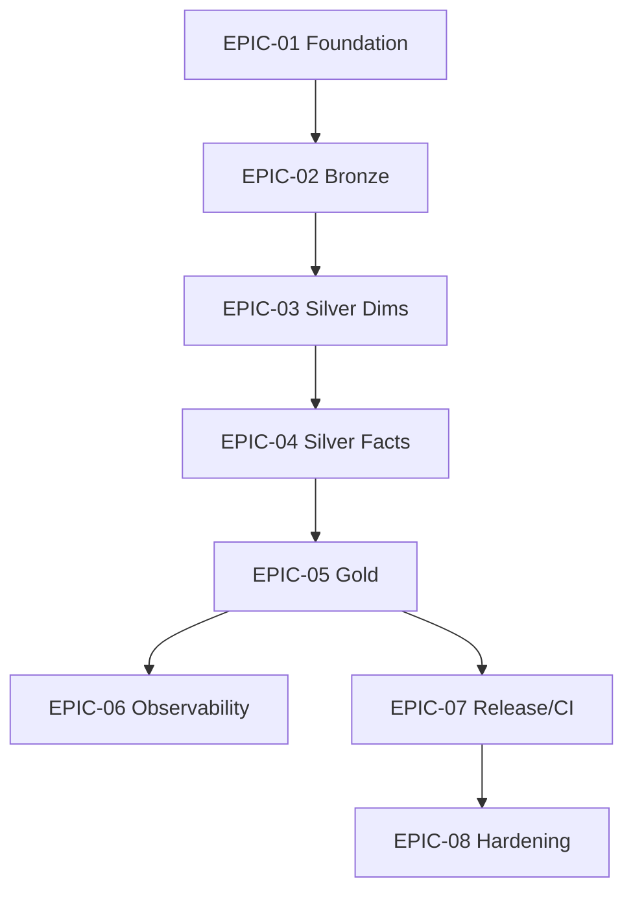

# Sprint Backlog: Patient 360 Data Pipeline

| Field | Value |
|-------|-------|
| **Version** | 1.0 |
| **Created** | 2026-04-27 |
| **Last Modified** | 2026-04-27 |
| **Author** | Scrum Master Agent |
| **Status** | Draft |
| **LLD Reference** | LLD-2026-04-23-patient-360.md (v1, Approved) |

---

## 1. Executive Summary

This Sprint Backlog decomposes the Patient 360 LLD v1 (and all upstream artifacts: DRD v1, HLD v1, DMS v1, STM v2, DQS v2) into 8 epics and 38 user stories totaling 156 story points across 6 sprints (12 weeks at 2 weeks/sprint per team-capacity v1). The scope covers the full medallion pipeline — Bronze (13 source tables), Silver (4 SCD2 dimensions + 9 facts), Gold (3 consumer tables) — with config-driven Bronze ingestion, inline Spark Expectations DQ, Unity Catalog OSS local registration (Decision 15), and the SE run-evidence gates introduced in LLD §8.6.1 / Decision 16. Each medallion-layer epic closes itself with performance-optimization and integration-test stories per the layer-closure rule; deploy validation lives in the trailing release epic since the LLD prescribes only system-wide deploy work. EPIC-01 includes the mandatory runtime-bootstrap story exercising JDK 17, the docker stack, UC catalog/schemas, source seed, and end-to-end SE smoke.

Velocity expectation: 25–30 pts/sprint with 3.0 effective FTE per team-capacity v1; the plan front-loads foundation in Sprint 1 and finishes the medallion layers + observability in Sprint 4, with release/CI in Sprint 5 and hardening in Sprint 6.

---

## 2. Epic Overview

| Epic | Title | Scope | Stories | Points | Sprints | LLD Section | Perf | Int-Test | Deploy |
|------|-------|-------|---------|--------|---------|-------------|------|----------|--------|
| EPIC-01 | Foundation & Runtime Bootstrap | foundation | 6 | 23 | 1 | §2.1, §6.1, §1 | — | — | — |
| EPIC-02 | Bronze Ingestion Layer | layer | 7 | 31 | 1-2 | §5.1 | 1 | 1 | N/A |
| EPIC-03 | Silver Dimensions Layer | layer | 4 | 21 | 2-3 | §5.2 | 1 | 1 | N/A |
| EPIC-04 | Silver Facts Layer | layer | 6 | 26 | 3-4 | §5.2 | 1 | 1 | N/A |
| EPIC-05 | Gold Consumer Layer | layer | 5 | 21 | 4 | §5.3 | 1 | 1 | N/A |
| EPIC-06 | Observability — Lineage, Metrics, Dashboards | crosscut | 3 | 9 | 4 | §10 | — | — | — |
| EPIC-07 | Release & CI/CD | crosscut | 4 | 16 | 5 | §9 | — | — | — |
| EPIC-08 | Hardening — Security, Documentation, Maintenance | crosscut | 3 | 9 | 6 | §8.7, §3.4 | — | — | — |

**Total**: 38 stories, 156 points across 6 sprints

<!--
  Closure columns (Perf / Int-Test / Deploy) report per-epic closure-sequence coverage:
    - For `layer` epics: Perf = 1 + Int-Test = 1; Deploy = "N/A" — layer completes at integration-test, system-wide deploy in EPIC-07.
    - For `foundation` / `crosscut` epics: dashes ("—"); closure-sequence rule does not apply.
-->

---

## 3. Dependency Graph

---

## 4. Sprint Plan

### Sprint 1: Foundation + Bronze runner/factory

| Story ID | Title | Points | Epic |
|----------|-------|--------|------|
| STORY-01-001 | Render cookiecutter scaffold and pyproject/Makefile | 3 | EPIC-01 |
| STORY-01-002 | Implement pipeline_config loader and logging utilities | 3 | EPIC-01 |
| STORY-01-003 | Generate per-table StructType schema contracts from DMS | 5 | EPIC-01 |
| STORY-01-004 | Implement scd2 / derived_fields / delta_helpers utilities | 5 | EPIC-01 |
| STORY-01-005 | Stand up docker-compose stack (UC OSS, Marquez, Grafana) | 3 | EPIC-01 |
| STORY-01-006 | Runtime bootstrap — JDK17, UC schemas, source seed, SE smoke | 5 | EPIC-01 |
| STORY-02-001 | Bronze ingestion runner + soft-import SE (bootstrap mode) | 5 | EPIC-02 |

**Sprint Total**: 29 points

### Sprint 2: Bronze layer closure + Silver-dims start

| Story ID | Title | Points | Epic |
|----------|-------|--------|------|
| STORY-02-002 | TaskGroup factory and SparkSubmit wrapper | 5 | EPIC-02 |
| STORY-02-003 | Generate 13 per-table Bronze YAML configs | 5 | EPIC-02 |
| STORY-02-004 | se_runner.py fail-closed implementation (post-bootstrap) | 5 | EPIC-02 |
| STORY-02-005 | reconciliation_bronze query_dq task with SE-evidence gate | 3 | EPIC-02 |
| STORY-02-006 | Bronze perf — replaceWhere partition pruning + shuffle tuning | 3 | EPIC-02 |
| STORY-02-007 | Integration test — trigger bronze DAG on Airflow local against UC OSS local | 5 | EPIC-02 |
| STORY-03-001 | Implement transform_patients_silver (SCD2) | 5 | EPIC-03 |

**Sprint Total**: 31 points

### Sprint 3: Silver-dims closure + Silver-facts encounters

| Story ID | Title | Points | Epic |
|----------|-------|--------|------|
| STORY-03-002 | Implement transform_organizations / providers / payers silver (SCD2) | 8 | EPIC-03 |
| STORY-03-003 | Silver-dims perf — broadcast small dims + shuffle tuning | 3 | EPIC-03 |
| STORY-03-004 | Integration test — Silver-dims DAG subtree on Airflow local against UC OSS local | 5 | EPIC-03 |
| STORY-04-001 | Implement transform_encounters_silver (FK hub) | 5 | EPIC-04 |

**Sprint Total**: 21 points

### Sprint 4: Silver-facts closure + Gold layer + Observability

| Story ID | Title | Points | Epic |
|----------|-------|--------|------|
| STORY-04-002 | Implement 4 high-priority fact transforms (allergies, conditions, medications, observations) | 8 | EPIC-04 |
| STORY-04-003 | Implement 4 remaining fact transforms (immunizations, procedures, claims, careplans) | 5 | EPIC-04 |
| STORY-04-004 | reconciliation_silver query_dq + SE-evidence gate | 3 | EPIC-04 |
| STORY-04-005 | Silver-facts perf — observations partitioning + sort-merge tuning | 2 | EPIC-04 |
| STORY-04-006 | Integration test — Silver-facts subtree on Airflow local against UC OSS local | 3 | EPIC-04 |
| STORY-05-001 | Implement build_patient_summary_gold | 5 | EPIC-05 |
| STORY-05-002 | Implement build_clinical_history_gold + build_billing_summary_gold | 5 | EPIC-05 |
| STORY-05-003 | reconciliation_gold query_dq + SE-evidence gate | 3 | EPIC-05 |
| STORY-05-004 | Gold perf — cache patients/encounters, partition tuning | 3 | EPIC-05 |
| STORY-05-005 | Integration test — Gold subtree on Airflow local against UC OSS local | 5 | EPIC-05 |
| STORY-06-001 | emit_lineage task + OpenLineage Marquez integration | 3 | EPIC-06 |
| STORY-06-002 | emit_metrics task + OpenTelemetry → Prometheus wiring | 3 | EPIC-06 |
| STORY-06-003 | Grafana DQ + pipeline-runtime dashboards + alerting rules | 3 | EPIC-06 |

**Sprint Total**: 51 points

> **Note on Sprint 4 load**: 51 pts > 30 pt nominal velocity. Leadership recommended option: split observability into Sprint 5 if Sprint 4 burndown shows risk, or pull Gold integration test into Sprint 5. Captured under Risks §6.

### Sprint 5: Release & CI/CD

| Story ID | Title | Points | Epic |
|----------|-------|--------|------|
| STORY-07-001 | GitHub Actions CI — lint + unit + integration workflows | 5 | EPIC-07 |
| STORY-07-002 | Liquibase DDL changelogs for all 29 tables | 5 | EPIC-07 |
| STORY-07-003 | DEV→STAGING→PROD promotion runbook + full-pipeline E2E load test | 3 | EPIC-07 |
| STORY-07-004 | Rollback runbook — Delta RESTORE + re-run procedure | 3 | EPIC-07 |

**Sprint Total**: 16 points

### Sprint 6: Hardening

| Story ID | Title | Points | Epic |
|----------|-------|--------|------|
| STORY-08-001 | PHI / security audit — log scrubbing + dead-letter inspection | 3 | EPIC-08 |
| STORY-08-002 | Documentation + coverage audit (≥ 90%) | 3 | EPIC-08 |
| STORY-08-003 | Delta VACUUM / OPTIMIZE maintenance DAG | 3 | EPIC-08 |

**Sprint Total**: 9 points

---

## 5. Traceability Matrix

| Epic / Story | LLD | DMS | STM | DQS | DRD | HLD |
|-------------|-----|-----|-----|-----|-----|-----|
| EPIC-01 | §2.1, §6.1, §1, §8.6.1 | §3-§5 | — | §2 | §1.3 | §1 |
| EPIC-02 | §4.2, §5.1, §8.2, §8.6.1 | §3 | Source-to-Bronze | §2-§4 | §1.3 | §1 |
| EPIC-03 | §5.2, §6.2 | §4, §6 | Bronze-to-Silver | §2 | §1.3 | §1 |
| EPIC-04 | §5.2, §5.5, §8.6.1 | §4 | Bronze-to-Silver | §2-§4 | §1.3 | §1 |
| EPIC-05 | §5.3, §5.5, §8.6.1 | §5 | Silver-to-Gold | §1, §2, §4 | §1.3 | §1 |
| EPIC-06 | §10 | — | — | — | — | — |
| EPIC-07 | §9 | §3-§5 | — | §4 | — | — |
| EPIC-08 | §3.4, §8.4 | — | — | — | §1.3 | — |

---

## 6. Risks & Assumptions

- **Sprint 4 over-allocation**: Sprint 4 carries 51 pts (Silver-facts closure + Gold layer + Observability). _(Mitigation: defer EPIC-06 observability stories to Sprint 5 if burndown shows risk by mid-sprint; alternatively pull STORY-05-005 into Sprint 5.)_
- **Spark expertise concentrated on Alex**: Per team-capacity §5, no other team member has deep Spark experience. _(Mitigation: Alex owns STORY-02-001/004/005, STORY-03-001/002, STORY-04-001/002/004, STORY-05-001/003. Pair Jordan on Bronze early to spread knowledge.)_
- **Sam R. at 50%**: Cannot own blocking stories. _(Mitigation: assign Sam to non-critical-path stories — STORY-04-003, STORY-05-002, STORY-08-002.)_
- **Production freeze last week of quarter**: per team-capacity §5. _(Mitigation: Schedule STORY-07-003 PROD promotion outside the freeze window.)_
- **Phased contract — STORY-02-001 vs STORY-02-004**: bootstrap soft-import (STORY-02-001) is superseded by fail-closed implementation (STORY-02-004). The phased-contract guard added Depends-On from STORY-02-004 → STORY-02-001 so the validator interprets STORY-02-004's `grep_absent` for `WARNING: se_runner not available` as superseding STORY-02-001's `grep` for the same string. _(Mitigation: validator rule STORIES-AC-CONTRADICTION-001 honors the Depends-On link and clears the contradiction.)_

### Assumptions

- Local-only architecture per LLD Decision 12 — no cloud-managed services
- Synthea source data already loaded into DuckDB at `chapter-2/data/duckdb/raw.db` (validated by STORY-01-006)
- Unity Catalog OSS at `http://localhost:8080/api/2.1/unity-catalog` is the canonical metastore for all envs
- Spark 4.0.0 + JDK 17 + Scala 2.13 across all envs
- DQ is non-optional — `BRONZE_SKIP_SE=1` and similar bypasses are forbidden per LLD Decision 16

---

## 7. Version History

| Version | Date | Author | Changes |
|---------|------|--------|---------|
| 1.0 | 2026-04-27 | Scrum Master Agent | Initial backlog from LLD v1 + DRD v1 + HLD v1 + DMS v1 + STM v2 + DQS v2 — 8 epics, 38 stories, 156 points across 6 sprints |
