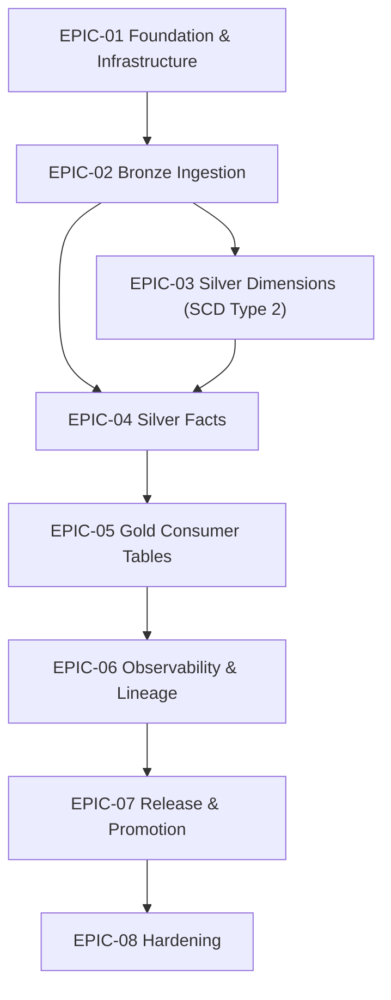

# Sprint Backlog: Patient 360 Medallion Pipeline

| Field | Value |
|-------|-------|
| **Version** | 1.1 |
| **Created** | 2026-05-09 |
| **Last Modified** | 2026-05-09 |
| **Author** | Scrum Master Agent |
| **Status** | Updated - Pending Review |
| **LLD Reference** | LLD-2026-04-27-patient-360.md (v1.9) |

---

## 1. Executive Summary

This sprint backlog decomposes the Patient 360 Medallion Pipeline LLD into 8 epics and 53 stories totaling 208 story points across 12 two-week sprints. The backlog targets a 3-FTE team at 25-30 pts/sprint velocity. EPIC-01 is the foundation (scaffold, utilities, docker-compose, runtime bootstrap, SE bootstrap → fail-closed lifecycle). EPIC-02 through EPIC-05 are the medallion layers; each layer epic closes with perf-optimization → local integration-test (DAG triggered on local Airflow against Unity Catalog OSS local). EPIC-02 also carries a Liquibase deploy-validation story since LLD §9.1 prescribes per-table DDL changelogs at the Bronze boundary. EPIC-06 wires OpenLineage / OTel / Grafana. EPIC-07 carries system-wide release work (CI, promotion, rollback, E2E benchmark). EPIC-08 hardens (PHI audit, docs/coverage, Delta maintenance).

---

## 2. Epic Overview

| Epic | Title | Scope | Stories | Points | Sprints | LLD Section | Perf | Int-Test | Deploy |
|------|-------|-------|---------|--------|---------|-------------|------|----------|--------|

| EPIC-01 | Foundation & Infrastructure | foundation | 10 | 37 | 1-3 | §2.1, §6.1, §9.1, §8.6 | — | — | — |

| EPIC-02 | Bronze Ingestion | layer | 9 | 42 | 3-5 | §5.1, §6.5, §9.1 | Yes | Yes | Yes |

| EPIC-03 | Silver Dimensions (SCD Type 2) | layer | 6 | 27 | 5-6 | §5.2 | Yes | Yes | N/A |

| EPIC-04 | Silver Facts | layer | 12 | 42 | 6-7 | §5.2 | Yes | Yes | N/A |

| EPIC-05 | Gold Consumer Tables | layer | 5 | 22 | 8 | §5.3 | Yes | Yes | N/A |

| EPIC-06 | Observability & Lineage | crosscut | 4 | 12 | 9-10 | §4.2, §10 | — | — | — |

| EPIC-07 | Release & Promotion | crosscut | 4 | 18 | 10-11 | §9.3, §9.4 | — | — | — |

| EPIC-08 | Hardening | crosscut | 3 | 8 | 11-12 | §9.5, §10.3 | — | — | — |

**Total**: 53 stories, 208 points across 12 sprints

<!--
  Closure columns (Perf / Int-Test / Deploy) report per-epic closure-sequence coverage:
    - For `layer` epics: must show ≥1 for Perf and Int-Test; Deploy may be "N/A" when layer completes at integration-test.
    - For `foundation` / `crosscut` epics: leave dashes ("—"); closure-sequence rule does not apply.
-->

---

## 3. Dependency Graph

---

## 4. Sprint Plan

### Sprint 1: Foundation scaffold + utilities

| Story ID | Title | Points | Epic |
|----------|-------|--------|------|

| STORY-01-001 | Scaffold patient_360 project from cookiecutter template | 3 | EPIC-01 |

| STORY-01-002 | Implement cross-layer utilities (config loader, logging, metrics, delta_helpers) | 5 | EPIC-01 |

**Sprint Total**: 8 points

### Sprint 2: Contracts, docker-compose, runtime bootstrap

| Story ID | Title | Points | Epic |
|----------|-------|--------|------|

| STORY-01-003 | Implement shared SCD2, derived_fields, and code_systems utilities | 5 | EPIC-01 |

| STORY-01-004 | Author table contracts and DQ rule pointers for all 13+13+3 tables | 5 | EPIC-01 |

| STORY-01-005 | docker-compose service block — Unity Catalog OSS + unity-catalog-ui (with uc_init.py) | 2 | EPIC-01 |

| STORY-01-006 | docker-compose service block — Marquez + marquez-db (postgres) | 2 | EPIC-01 |

| STORY-01-007 | docker-compose service block — Airflow (Dockerfile.airflow) + otel-collector + Makefile dev-up/dev-down | 3 | EPIC-01 |

| STORY-01-008 | Bootstrap local dev runtime (JDK / Docker / UC / Spark / SE end-to-end) | 5 | EPIC-01 |

**Sprint Total**: 22 points

### Sprint 3: SE runner + Bronze ingestion runner

| Story ID | Title | Points | Epic |
|----------|-------|--------|------|

| STORY-01-009 | SE runner — bootstrap phase (soft-import with WARNING log) | 2 | EPIC-01 |

| STORY-01-010 | SE runner — fail-closed steady state (remove soft-import) | 5 | EPIC-01 |

| STORY-02-001 | Implement generic Bronze ingestion runner | 8 | EPIC-02 |

| STORY-02-002 | Implement Bronze TaskGroup factory + SparkSubmit wrapper | 5 | EPIC-02 |

| STORY-02-003 | Author 13 per-table Bronze ingestion YAML configs | 5 | EPIC-02 |

**Sprint Total**: 25 points

### Sprint 4: Bronze configs/DDL/SE rules + DAG

| Story ID | Title | Points | Epic |
|----------|-------|--------|------|

| STORY-02-004 | Author Liquibase DDL changelogs for 13 Bronze tables | 3 | EPIC-02 |

| STORY-02-005 | Author 13 per-table Bronze SE rule YAMLs | 5 | EPIC-02 |

| STORY-02-006 | Wire Bronze TaskGroup + reconciliation_bronze into the Airflow DAG | 5 | EPIC-02 |

**Sprint Total**: 13 points

### Sprint 5: Bronze closure + Silver dimensions

| Story ID | Title | Points | Epic |
|----------|-------|--------|------|

| STORY-02-007 | Performance: replaceWhere partition pruning + shuffle.partitions + observations 8-partition tuning | 3 | EPIC-02 |

| STORY-02-008 | Local integration test: trigger Bronze DAG against Unity Catalog OSS local | 5 | EPIC-02 |

| STORY-02-009 | Deploy validation: apply Liquibase Bronze changelogs locally + DAG deploy smoke | 3 | EPIC-02 |

| STORY-03-001 | Implement transform_patients_silver (SCD2 dimension) | 5 | EPIC-03 |

| STORY-03-002 | Implement transform_organizations_silver (SCD2 dimension) | 5 | EPIC-03 |

| STORY-03-003 | Implement transform_providers_silver (SCD2 dimension) | 5 | EPIC-03 |

| STORY-03-004 | Implement transform_payers_silver (SCD2 dimension) | 5 | EPIC-03 |

**Sprint Total**: 31 points

### Sprint 6: Silver facts (encounters)

| Story ID | Title | Points | Epic |
|----------|-------|--------|------|

| STORY-03-005 | Performance: broadcast small dims + SCD2-aware filter pushdown | 2 | EPIC-03 |

| STORY-03-006 | Local integration test: trigger Silver dim tasks against UC OSS | 5 | EPIC-03 |

| STORY-04-001 | Implement transform_encounters_silver (fact) | 5 | EPIC-04 |

**Sprint Total**: 12 points

### Sprint 7: Silver facts (dependents) + closure

| Story ID | Title | Points | Epic |
|----------|-------|--------|------|

| STORY-04-002 | Implement transform_conditions_silver (fact) | 3 | EPIC-04 |

| STORY-04-003 | Implement transform_medications_silver (fact) | 3 | EPIC-04 |

| STORY-04-004 | Implement transform_observations_silver (fact) | 5 | EPIC-04 |

| STORY-04-005 | Implement transform_allergies_silver (fact) | 3 | EPIC-04 |

| STORY-04-006 | Implement transform_immunizations_silver (fact) | 3 | EPIC-04 |

| STORY-04-007 | Implement transform_procedures_silver (fact) | 3 | EPIC-04 |

| STORY-04-008 | Implement transform_claims_silver (fact) | 3 | EPIC-04 |

| STORY-04-009 | Implement transform_careplans_silver (fact) | 3 | EPIC-04 |

| STORY-04-010 | Implement reconciliation_silver task (cross-table query_dq) | 3 | EPIC-04 |

| STORY-04-011 | Performance: shuffle.partitions tuning + observations 8-partition repartition | 3 | EPIC-04 |

| STORY-04-012 | Local integration test: trigger Silver fact tasks against Unity Catalog OSS | 5 | EPIC-04 |

**Sprint Total**: 37 points

### Sprint 8: Gold layer + closure

| Story ID | Title | Points | Epic |
|----------|-------|--------|------|

| STORY-05-001 | Implement build_patient_summary_gold | 5 | EPIC-05 |

| STORY-05-002 | Implement build_patient_clinical_history_gold | 5 | EPIC-05 |

| STORY-05-003 | Implement build_patient_billing_summary_gold | 5 | EPIC-05 |

| STORY-05-004 | Performance: cache shared Silver inputs + broadcast small dims for Gold builds | 2 | EPIC-05 |

| STORY-05-005 | Local integration test: trigger Gold tasks against Unity Catalog OSS local | 5 | EPIC-05 |

**Sprint Total**: 22 points

### Sprint 9: Observability wiring

| Story ID | Title | Points | Epic |
|----------|-------|--------|------|

| STORY-06-001 | Wire OpenLineage Spark listener + Marquez emit_lineage task | 3 | EPIC-06 |

| STORY-06-002 | Wire OpenTelemetry metrics + emit_metrics task | 3 | EPIC-06 |

| STORY-06-003 | Build Grafana dashboards: Pipeline Health, DQ, SLA, Capacity | 3 | EPIC-06 |

**Sprint Total**: 9 points

### Sprint 10: Alerts + CI + promotion

| Story ID | Title | Points | Epic |
|----------|-------|--------|------|

| STORY-06-004 | Wire alerting rules + PagerDuty / Slack channels per LLD §10.3 | 3 | EPIC-06 |

| STORY-07-001 | Build CI pipeline (GitHub Actions: lint + unit + integration) | 5 | EPIC-07 |

| STORY-07-002 | Build DEV→STAGING→PROD promotion runbooks | 5 | EPIC-07 |

**Sprint Total**: 13 points

### Sprint 11: Rollback + E2E + hardening start

| Story ID | Title | Points | Epic |
|----------|-------|--------|------|

| STORY-07-003 | Implement rollback procedure (Delta RESTORE + re-run) | 3 | EPIC-07 |

| STORY-07-004 | Full-pipeline E2E load test (Bronze → Gold) on staging-equivalent data | 5 | EPIC-07 |

| STORY-08-001 | Security & PHI audit (NFR-6 masking, NFR-7 audit trail) | 3 | EPIC-08 |

| STORY-08-002 | Documentation & coverage audit | 3 | EPIC-08 |

**Sprint Total**: 14 points

### Sprint 12: Maintenance

| Story ID | Title | Points | Epic |
|----------|-------|--------|------|

| STORY-08-003 | Schedule Delta VACUUM / OPTIMIZE maintenance | 2 | EPIC-08 |

**Sprint Total**: 2 points

---

## 5. Traceability Matrix

| Epic / Story | LLD | DMS | STM | DQS | DRD | HLD |
|-------------|-----|-----|-----|-----|-----|-----|

| EPIC-01 | §2.1, §6.1, §9.1, §8.6 | §2-4 | all | §2-5 | §1-7 | §4-5 |

| EPIC-02 | §5.1, §6.5, §9.1 | §2-4 | all | §2-5 | §1-7 | §4-5 |

| EPIC-03 | §5.2 | §2-4 | all | §2-5 | §1-7 | §4-5 |

| EPIC-04 | §5.2 | §2-4 | all | §2-5 | §1-7 | §4-5 |

| EPIC-05 | §5.3 | §2-4 | all | §2-5 | §1-7 | §4-5 |

| EPIC-06 | §4.2, §10 | §2-4 | all | §2-5 | §1-7 | §4-5 |

| EPIC-07 | §9.3, §9.4 | §2-4 | all | §2-5 | §1-7 | §4-5 |

| EPIC-08 | §9.5, §10.3 | §2-4 | all | §2-5 | §1-7 | §4-5 |

---

## 6. Risks & Assumptions

- **SE bootstrap-to-fail-closed transition**: STORY-01-009 ships soft-import; STORY-01-010 must remove it. ACs collide if order is broken. _(Mitigation: Auto-Depends-On from STORY-01-010 to STORY-01-009 enforces lifecycle order.)_

- **Local stack drift**: docker-compose stack must match LLD §9.1.1 versions exactly. _(Mitigation: Pin images per service-grouped story (STORY-01-005 / -006 / -007); STORY-01-008 bootstrap ACs verify versions; each docker-compose story DoD requires `docker compose ps healthy` + service-specific probe evidence.)_

- **Shared docker-compose.yml co-authorship**: STORY-01-005, -01-006, and -01-007 all edit the same file; sprint-2 must merge them serially in dependency order to avoid conflicts. _(Mitigation: Auto-Depends-On chain 005→007 and 006→007; only STORY-01-007 declares `make dev-up` against the full six-service stack.)_

- **DuckDB read concurrency**: 13 Bronze tasks running parallel may saturate the source DB. _(Mitigation: LLD §6.3 caps Bronze parallelism at 13; tune DuckDB connections.)_

- **Sam R. at 50% allocation**: Cannot be assigned blocking stories per team-capacity.md. _(Mitigation: Assign Sam to non-critical-path stories; senior engineer Alex M. owns SE-runner work.)_

### Assumptions

- Sprint length = 2 weeks; team velocity = 25-30 pts/sprint per team-capacity.md.

- All upstream artifacts (DRD, HLD, DMS, STM, DQS, LLD) are Approved as of 2026-05-09.

- Dev laptops have Docker Desktop and JDK 17 available — STORY-01-008 verifies prerequisites fail-closed.

- Synthea Phase-1 dataset (13 tables, 7.9M rows, 636 MB) is available for staging-equivalent E2E tests.

- Liquibase changelogs are emitted only for Bronze (LLD §9.1 prescribes per-table DDL); Silver and Gold do not have layer-scoped deploy stories — system-wide deploy lives in EPIC-07.

---

## 7. Version History

| Version | Date | Author | Changes |
|---------|------|--------|---------|

| 1.0 | 2026-05-09 | Scrum Master Agent | Initial backlog generated from LLD v1.9. |
| 1.1 | 2026-05-09 | Scrum Master Agent | Split STORY-01-005 (docker-compose stack) into 3 service-grouped stories: STORY-01-005 (UC OSS + UI + uc_init.py), STORY-01-006 (Marquez + marquez-db), STORY-01-007 (Airflow + otel-collector + Makefile dev-up/dev-down). Renumbered downstream EPIC-01 stories: bootstrap-runtime 006→008, se-runner-bootstrap 007→009, se-runner-fail-closed 008→010. Updated cross-epic Depends-On in EPIC-02 (STORY-02-001, STORY-02-005, STORY-02-008) and EPIC-04 (STORY-04-010 reference). Added DoD requirement to all 3 docker-compose stories: `docker compose ps healthy` + service-specific HTTP/CLI probe evidence captured in verification block. EPIC-01 grew from 8 stories / 35 pts to 10 stories / 37 pts. |

