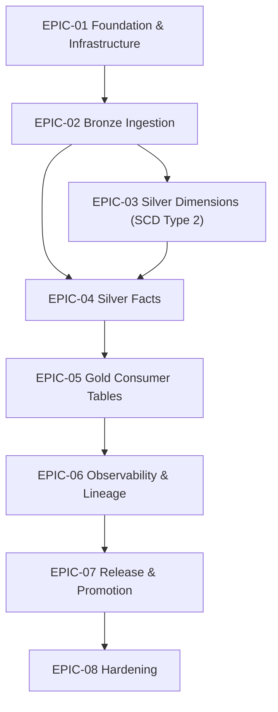

# Sprint Backlog: Patient 360 Medallion Pipeline

| Field | Value |
|-------|-------|
| **Version** | 1.9 |
| **Created** | 2026-05-09 |
| **Last Modified** | 2026-05-22 |
| **Author** | Scrum Master Agent |
| **Status** | Updated - Pending Review |
| **LLD Reference** | LLD-2026-05-12-patient-360.md (v1.12) |

---

## 1. Executive Summary

This sprint backlog decomposes the Patient 360 Medallion Pipeline LLD into 8 epics and 53 stories totaling 208 story points across 12 two-week sprints. The backlog targets a 3-FTE team at 25-30 pts/sprint velocity. EPIC-01 is the foundation (scaffold wired to Delta + Hive metastore on Derby per LLD §13 Decision 12 — revoked & replaced 2026-05-12; cross-layer utilities; docker-compose with `PATIENT360_PROJECT_ROOT` exported per LLD §9.1; runtime bootstrap; SE fail-closed import contract). EPIC-02 through EPIC-05 are the medallion layers; each layer epic closes with perf-optimization → local integration-test. Bronze writes are **path-based Delta** under `${PATIENT360_PROJECT_ROOT}/warehouse/{env}/bronze/<table>/` (LLD §13 Decision 15 revoked 2026-05-12); Unity Catalog OSS runs in compose for UI-demo only and is no longer in the read/write path. Bronze reconciliation runs as a `SparkSubmitOperator` per LLD §4.2. EPIC-02 also carries a Liquibase deploy-validation story since LLD §9.1 prescribes per-table DDL changelogs at the Bronze boundary. EPIC-06 wires OpenLineage / OTel / Grafana. EPIC-07 carries system-wide release work (CI, promotion, rollback, E2E benchmark). EPIC-08 hardens (PHI audit, docs/coverage, Delta maintenance).

---

## 2. Epic Overview

| Epic | Title | Scope | Stories | Points | Sprints | LLD Section | Perf | Int-Test | Deploy |
|------|-------|-------|---------|--------|---------|-------------|------|----------|--------|

| EPIC-01 | Foundation & Infrastructure | foundation | 10 | 37 | 1-3 | §2.1, §6.1, §9.1, §8.6 | — | — | — |

| EPIC-02 | Bronze Ingestion | layer | 9 | 42 | 3-5 | §5.1, §6.5, §9.1 | Yes | Yes | Yes |

| EPIC-03 | Silver Dimensions (SCD Type 2) | layer | 6 | 27 | 5-6 | §5.2 | Yes | Yes | N/A |

| EPIC-04 | Silver Facts | layer | 12 | 42 | 6-7 | §5.2 | Yes | Yes | N/A |

| EPIC-05 | Gold Consumer Tables | layer | 5 | 22 | 8 | §5.3 | Yes | Yes | N/A |

| EPIC-06 | Observability & Lineage | crosscut | 4 | 12 | 9-10 | §4.2, §10 | — | — | — |

| EPIC-07 | Release & Promotion | crosscut | 4 | 18 | 10-11 | §9.3, §9.4 | — | — | — |

| EPIC-08 | Hardening | crosscut | 3 | 8 | 11-12 | §9.5, §10.3 | — | — | — |

**Total**: 53 stories, 208 points across 12 sprints

<!--
  Closure columns (Perf / Int-Test / Deploy) report per-epic closure-sequence coverage:
    - For `layer` epics: must show ≥1 for Perf and Int-Test; Deploy may be "N/A" when layer completes at integration-test.
    - For `foundation` / `crosscut` epics: leave dashes ("—"); closure-sequence rule does not apply.
-->

---

## 3. Dependency Graph

---

## 4. Sprint Plan

### Sprint 1: Foundation scaffold + utilities

| Story ID | Title | Points | Epic |
|----------|-------|--------|------|

| STORY-01-001 | Scaffold patient_360 project from cookiecutter template | 3 | EPIC-01 |

| STORY-01-002 | Implement cross-layer utilities (config loader, logging, metrics, delta_helpers) | 5 | EPIC-01 |

**Sprint Total**: 8 points

### Sprint 2: Contracts, docker-compose, runtime bootstrap

| Story ID | Title | Points | Epic |
|----------|-------|--------|------|

| STORY-01-003 | Implement shared SCD2, derived_fields, and code_systems utilities | 5 | EPIC-01 |

| STORY-01-004 | Author table contracts and DQ rule pointers for all 13+13+3 tables | 5 | EPIC-01 |

| STORY-01-005 | docker-compose service block — Unity Catalog OSS + unity-catalog-ui (with uc_init.py) | 2 | EPIC-01 |

| STORY-01-006 | docker-compose service block — Marquez + marquez-db (postgres) | 2 | EPIC-01 |

| STORY-01-007 | docker-compose service block — Airflow (Dockerfile.airflow) + otel-collector + Makefile dev-up/dev-down | 3 | EPIC-01 |

| STORY-01-008 | Bootstrap local dev runtime (JDK / Docker / UC / Spark / SE end-to-end) | 5 | EPIC-01 |

**Sprint Total**: 22 points

### Sprint 3: SE runner + Bronze ingestion runner

| Story ID | Title | Points | Epic |
|----------|-------|--------|------|

| STORY-01-009 | SE runner — diagnostic ImportError try/except (log + re-raise) | 2 | EPIC-01 |

| STORY-01-010 | SE runner & reconciliation modules — fail-closed implementation | 5 | EPIC-01 |

| STORY-02-001 | Implement generic Bronze ingestion runner | 8 | EPIC-02 |

| STORY-02-002 | Implement Bronze TaskGroup factory + SparkSubmit wrapper | 5 | EPIC-02 |

| STORY-02-003 | Author 13 per-table Bronze ingestion YAML configs | 5 | EPIC-02 |

**Sprint Total**: 25 points

### Sprint 4: Bronze configs/DDL/SE rules + DAG

| Story ID | Title | Points | Epic |
|----------|-------|--------|------|

| STORY-02-004 | Author Liquibase DDL changelogs for 13 Bronze tables | 3 | EPIC-02 |

| STORY-02-005 | Author 13 per-table Bronze SE rule YAMLs | 5 | EPIC-02 |

| STORY-02-006 | Wire Bronze TaskGroup + reconciliation_bronze into the Airflow DAG | 5 | EPIC-02 |

**Sprint Total**: 13 points

### Sprint 5: Bronze closure + Silver dimensions

| Story ID | Title | Points | Epic |
|----------|-------|--------|------|

| STORY-02-007 | Performance: replaceWhere partition pruning + shuffle.partitions + observations 8-partition tuning | 3 | EPIC-02 |

| STORY-02-008 | Local integration test: trigger Bronze DAG against Unity Catalog OSS local | 5 | EPIC-02 |

| STORY-02-009 | Deploy validation: apply Liquibase Bronze changelogs locally + DAG deploy smoke | 3 | EPIC-02 |

| STORY-03-001 | Implement transform_patients_silver (SCD2 dimension) | 5 | EPIC-03 |

| STORY-03-002 | Implement transform_organizations_silver (SCD2 dimension) | 5 | EPIC-03 |

| STORY-03-003 | Implement transform_providers_silver (SCD2 dimension) | 5 | EPIC-03 |

| STORY-03-004 | Implement transform_payers_silver (SCD2 dimension) | 5 | EPIC-03 |

**Sprint Total**: 31 points

### Sprint 6: Silver facts (encounters)

| Story ID | Title | Points | Epic |
|----------|-------|--------|------|

| STORY-03-005 | Performance: broadcast small dims + SCD2-aware filter pushdown | 2 | EPIC-03 |

| STORY-03-006 | Local integration test: trigger Silver dim tasks against UC OSS | 5 | EPIC-03 |

| STORY-04-001 | Implement transform_encounters_silver (fact) | 5 | EPIC-04 |

**Sprint Total**: 12 points

### Sprint 7: Silver facts (dependents) + closure

| Story ID | Title | Points | Epic |
|----------|-------|--------|------|

| STORY-04-002 | Implement transform_conditions_silver (fact) | 3 | EPIC-04 |

| STORY-04-003 | Implement transform_medications_silver (fact) | 3 | EPIC-04 |

| STORY-04-004 | Implement transform_observations_silver (fact) | 5 | EPIC-04 |

| STORY-04-005 | Implement transform_allergies_silver (fact) | 3 | EPIC-04 |

| STORY-04-006 | Implement transform_immunizations_silver (fact) | 3 | EPIC-04 |

| STORY-04-007 | Implement transform_procedures_silver (fact) | 3 | EPIC-04 |

| STORY-04-008 | Implement transform_claims_silver (fact) | 3 | EPIC-04 |

| STORY-04-009 | Implement transform_careplans_silver (fact) | 3 | EPIC-04 |

| STORY-04-010 | Implement reconciliation_silver task (cross-table query_dq) | 3 | EPIC-04 |

| STORY-04-011 | Performance: shuffle.partitions tuning + observations 8-partition repartition | 3 | EPIC-04 |

| STORY-04-012 | Local integration test: trigger Silver fact tasks against Unity Catalog OSS | 5 | EPIC-04 |

**Sprint Total**: 37 points

### Sprint 8: Gold layer + closure

| Story ID | Title | Points | Epic |
|----------|-------|--------|------|

| STORY-05-001 | Implement build_patient_summary_gold | 5 | EPIC-05 |

| STORY-05-002 | Implement build_patient_clinical_history_gold | 5 | EPIC-05 |

| STORY-05-003 | Implement build_patient_billing_summary_gold | 5 | EPIC-05 |

| STORY-05-004 | Performance: cache shared Silver inputs + broadcast small dims for Gold builds | 2 | EPIC-05 |

| STORY-05-005 | Local integration test: trigger Gold tasks against Unity Catalog OSS local | 5 | EPIC-05 |

**Sprint Total**: 22 points

### Sprint 9: Observability wiring

| Story ID | Title | Points | Epic |
|----------|-------|--------|------|

| STORY-06-001 | Wire OpenLineage Spark listener + Marquez emit_lineage task | 3 | EPIC-06 |

| STORY-06-002 | Wire OpenTelemetry metrics + emit_metrics task | 3 | EPIC-06 |

| STORY-06-003 | Build Grafana dashboards: Pipeline Health, DQ, SLA, Capacity | 3 | EPIC-06 |

**Sprint Total**: 9 points

### Sprint 10: Alerts + CI + promotion

| Story ID | Title | Points | Epic |
|----------|-------|--------|------|

| STORY-06-004 | Wire alerting rules + PagerDuty / Slack channels per LLD §10.3 | 3 | EPIC-06 |

| STORY-07-001 | Build CI pipeline (GitHub Actions: lint + unit + integration) | 5 | EPIC-07 |

| STORY-07-002 | Build DEV→STAGING→PROD promotion runbooks | 5 | EPIC-07 |

**Sprint Total**: 13 points

### Sprint 11: Rollback + E2E + hardening start

| Story ID | Title | Points | Epic |
|----------|-------|--------|------|

| STORY-07-003 | Implement rollback procedure (Delta RESTORE + re-run) | 3 | EPIC-07 |

| STORY-07-004 | Full-pipeline E2E load test (Bronze → Gold) on staging-equivalent data | 5 | EPIC-07 |

| STORY-08-001 | Security & PHI audit (NFR-6 masking, NFR-7 audit trail) | 3 | EPIC-08 |

| STORY-08-002 | Documentation & coverage audit | 3 | EPIC-08 |

**Sprint Total**: 14 points

### Sprint 12: Maintenance

| Story ID | Title | Points | Epic |
|----------|-------|--------|------|

| STORY-08-003 | Schedule Delta VACUUM / OPTIMIZE maintenance | 2 | EPIC-08 |

**Sprint Total**: 2 points

---

## 5. Traceability Matrix

| Epic / Story | LLD | DMS | STM | DQS | DRD | HLD |
|-------------|-----|-----|-----|-----|-----|-----|

| EPIC-01 | §2.1, §6.1, §9.1, §8.6 | §2-4 | all | §2-5 | §1-7 | §4-5 |

| EPIC-02 | §5.1, §6.5, §9.1 | §2-4 | all | §2-5 | §1-7 | §4-5 |

| EPIC-03 | §5.2 | §2-4 | all | §2-5 | §1-7 | §4-5 |

| EPIC-04 | §5.2 | §2-4 | all | §2-5 | §1-7 | §4-5 |

| EPIC-05 | §5.3 | §2-4 | all | §2-5 | §1-7 | §4-5 |

| EPIC-06 | §4.2, §10 | §2-4 | all | §2-5 | §1-7 | §4-5 |

| EPIC-07 | §9.3, §9.4 | §2-4 | all | §2-5 | §1-7 | §4-5 |

| EPIC-08 | §9.5, §10.3 | §2-4 | all | §2-5 | §1-7 | §4-5 |

---

## 6. Risks & Assumptions

- **Runtime catalog re-baselined to Delta + Hive (Derby), UC OSS demoted to UI-demo**: LLD v1.12 (2026-05-12) revoked Decision 12 (UCSingleCatalog) and Decision 15 (UC-managed Bronze writes). All Bronze code paths now write path-based Delta under `${PATIENT360_PROJECT_ROOT}/warehouse/{env}/bronze/<table>/` against the default `spark_catalog` backed by an embedded Hive metastore on Derby. UC OSS server + UI remain in docker-compose for the operator UI demo only. _(Mitigation: STORY-01-001 / -01-002 / -01-007 ACs enforce DeltaCatalog wiring + `PATIENT360_PROJECT_ROOT` export; STORY-02-001 / -02-003 / -02-008 / -02-009 ACs forbid 3-part `unity.bronze.*` literals and `saveAsTable` usage in Bronze.)_

- **SE import contract is fail-closed (single state)**: STORY-01-009 wires the diagnostic `try/except ImportError` (logs at ERROR and re-raises); STORY-01-010 ships `se_runner.py` + `reconciliation.py`. Neither story may introduce a soft-degradation path — missing-SE is a deploy error per LLD §8.6 + §13 Decision 14. _(Mitigation: STORY-01-010 AC asserts the ImportError still propagates; STORY-01-009 AC asserts the diagnostic line is at ERROR level and re-raise is in place.)_

- **Local stack drift**: docker-compose stack must match LLD §9.1.1 versions exactly. _(Mitigation: Pin images per service-grouped story (STORY-01-005 / -006 / -007); STORY-01-008 bootstrap ACs verify versions; each docker-compose story DoD requires `docker compose ps healthy` + service-specific probe evidence.)_

- **Shared docker-compose.yml co-authorship**: STORY-01-005, -01-006, and -01-007 all edit the same file; sprint-2 must merge them serially in dependency order to avoid conflicts. _(Mitigation: Auto-Depends-On chain 005→007 and 006→007; only STORY-01-007 declares `make dev-up` against the full six-service stack.)_

- **DuckDB read concurrency**: 13 Bronze tasks running parallel may saturate the source DB. _(Mitigation: LLD §6.3 caps Bronze parallelism at 13; tune DuckDB connections.)_

- **Sam R. at 50% allocation**: Cannot be assigned blocking stories per team-capacity.md. _(Mitigation: Assign Sam to non-critical-path stories; senior engineer Alex M. owns SE-runner work.)_

### Assumptions

- Sprint length = 2 weeks; team velocity = 25-30 pts/sprint per team-capacity.md.

- All upstream artifacts (DRD, HLD, DMS, STM, DQS, LLD) are Approved as of 2026-05-09.

- Dev laptops have Docker Desktop and JDK 17 available — STORY-01-008 verifies prerequisites fail-closed.

- Synthea Phase-1 dataset (13 tables, 7.9M rows, 636 MB) is available for staging-equivalent E2E tests.

- Liquibase changelogs are emitted only for Bronze (LLD §9.1 prescribes per-table DDL); Silver and Gold do not have layer-scoped deploy stories — system-wide deploy lives in EPIC-07.

---

## 7. Version History

| Version | Date | Author | Changes |
|---------|------|--------|---------|

| 1.0 | 2026-05-09 | Scrum Master Agent | Initial backlog generated from LLD v1.9. |
| 1.1 | 2026-05-09 | Scrum Master Agent | Split STORY-01-005 (docker-compose stack) into 3 service-grouped stories: STORY-01-005 (UC OSS + UI + uc_init.py), STORY-01-006 (Marquez + marquez-db), STORY-01-007 (Airflow + otel-collector + Makefile dev-up/dev-down). Renumbered downstream EPIC-01 stories: bootstrap-runtime 006→008, se-runner-bootstrap 007→009, se-runner-fail-closed 008→010. Updated cross-epic Depends-On in EPIC-02 (STORY-02-001, STORY-02-005, STORY-02-008) and EPIC-04 (STORY-04-010 reference). Added DoD requirement to all 3 docker-compose stories: `docker compose ps healthy` + service-specific HTTP/CLI probe evidence captured in verification block. EPIC-01 grew from 8 stories / 35 pts to 10 stories / 37 pts. |
| 1.2 | 2026-05-11 | Scrum Master Agent | Re-baselined against LLD v1.11 (LLD-2026-05-11-patient-360.md). **SE bootstrap-mode lifecycle retired upstream (LLD §8.6 + §13 Decision 14 Resolved)** — STORY-01-009 reframed from "bootstrap soft-import + WARNING log" to "diagnostic `try/except ImportError` (log at ERROR + re-raise)"; STORY-01-010 reframed from "remove soft-import" to "ship `se_runner.py` + `reconciliation.py` with fail-closed import contract". No story added/removed (still 53 stories / 208 pts). Updated Executive Summary, Risks (SE bootstrap-to-fail-closed transition row), and EPIC-01 Objective wording to match the single-state contract. Updated LLD alert routing references for missing-SE to PagerDuty CRITICAL per LLD §8.5 (was Slack WARNING). Scenario B update: v1.1 → v1.2, new filename `BACKLOG-2026-05-11-patient-360.md`, prior file archived to `BACKLOG-2026-05-09-patient-360.md.bak`. Status reset to `Updated - Pending Review`. |
| 1.3 | 2026-05-11 | Scrum Master Agent | STORY-02-005 AC text + Verification globs fixed to per-table convention `dq_rules/{table}.yml` (was `dq_rules/synthea_*.yml`) per LLD §5.1 and `patient_360/CLAUDE.md`. The 13 per-table YAML files already exist on disk and satisfy content; only AC1/AC3 wording and the `How to Test` ls command were updated. No story added/removed, no point changes. Scenario C in-place edit (same-version same-date). |
| 1.4 | 2026-05-11 | Scrum Master Agent | STORY-02-005 Verification block: switched AC2 (`row_dq` grep_count) and AC3 (`action_if_failed: fail` grep_count) from `equals` to `min` (AC2 `min: 13`, AC3 `min: 6`). Spec defect: original `equals` thresholds under-counted because per-table YAMLs legitimately contain multiple row_dq rules each (actual matches: 45 row_dq, 53 fail). Implementation already correct; no story added/removed, no point changes. Scenario C in-place edit (same-version same-date). |
| 1.5 | 2026-05-11 | Scrum Master Agent | STORY-02-004 re-scoped AC2 + Verification to match LLD §9.1: `master-changelog.xml` is **project-wide** (Bronze + Silver + Gold = 29 tables across DMS §2/§3/§4), not Bronze-only. AC1 unchanged (13 Bronze per-table changelogs). AC2 now asserts the project-wide master-changelog exists and includes all 13 Bronze entries (Silver/Gold includes added by their own stories; total reaches 29). Verification AC2 switched the `<include file=` grep from `equals: 13` to `greater_or_equal: 13` so the same assertion still holds after downstream Silver + Gold layer stories extend the master file; added a second grep asserting `changelogs/synthea_` appears at least 13 times to keep Bronze coverage tight. Description prose updated to explain the project-wide vs layer-scoped split. No story added/removed, no point changes. Scenario C in-place edit (same-version same-date). |
| 1.6 | 2026-05-11 | Scrum Master Agent | STORY-02-008 Verification YAML + Testing + How-to-Test test paths switched from flat `tests/integration/test_bronze_uc.py` and `tests/integration/test_bronze_se_evidence.py` to layer-scoped `tests/integration/bronze/test_bronze_uc.py` and `tests/integration/bronze/test_bronze_se_evidence.py`, matching the `developer-plugin:create-integration-test` skill's emitted layout. AC text wording unchanged; only pytest node paths updated. No story added/removed, no point changes. Scenario C in-place edit (same-version same-date). |
| 1.7 | 2026-05-20 | Scrum Master Agent | Status changed to Approved |
| 1.9 | 2026-05-22 | Scrum Master Agent | STORY-01-007 (docker-compose Airflow + otel-collector + Makefile dev-up/dev-down): added one new acceptance criterion (AC8) mandating that `_infra/docker/Dockerfile.airflow` issue `RUN mkdir -p /opt/patient_360/warehouse && chown -R airflow:root /opt/patient_360 && chmod 775 /opt/patient_360` in a `USER root` block AFTER the JDK install but BEFORE the final `USER airflow` pip install. Rationale: Docker auto-creates bind-mount-point parents as root, so without an explicit chown the airflow runtime user (uid 50000) cannot create `${PATIENT360_PROJECT_ROOT}/warehouse/{env}/` at task time — Derby fails with `Failed to create database '/opt/patient_360/warehouse/dev/metastore_db'` (reproduced 2026-05-22, retrofit recorded in `chapter-6/developer-plugin/LLD-DEVIATIONS.md` row 7). Added matching Verification block (AC8) with three greps on `Dockerfile.airflow` for `mkdir -p /opt/patient_360/warehouse`, `chown -R airflow:root /opt/patient_360`, and `chmod 775 /opt/patient_360`. ONLY additions made: one AC line + one Verification entry. Scope, dependencies, sprint allocation, status, and prior AC lines unchanged. No other stories touched. No story added/removed; point totals unchanged (53 stories / 208 pts). Scenario B update: v1.8 → v1.9, new filename `BACKLOG-2026-05-22-patient-360.md`, prior file archived to `BACKLOG-2026-05-20-patient-360.md.bak`. Status reset to `Updated - Pending Review`. |
| 1.8 | 2026-05-20 | Scrum Master Agent | STORY-02-001 (Bronze ingestion runner): added one new acceptance criterion (AC9) capturing re-run idempotency for Bronze writes — runner must remain idempotent across embedded-metastore (Derby) resets because `replace_where_write` in `src/patient_360/utils/delta_helpers.py` writes external Delta via `.option("path", _external_table_path(table_fqn))`. Rationale: 2026-05-20 defect — managed Delta writes (no `path` option) failed with `DELTA_CREATE_TABLE_WITH_NON_EMPTY_LOCATION` on Airflow container recreate; fix recorded in LLD-DEVIATIONS row 6. Added matching Verification block (AC9) with two greps on `delta_helpers.py` for `.option("path"` and `_external_table_path`. ONLY additions made: one AC line + one Verification entry. Scope, dependencies, sprint allocation, status, and prior AC lines unchanged. No other stories touched. No story added/removed; point totals unchanged (53 stories / 208 pts). Scenario B update: v1.7 → v1.8, new filename `BACKLOG-2026-05-20-patient-360.md`, prior file archived to `BACKLOG-2026-05-12-patient-360.md.bak`. Status reset to `Updated - Pending Review`. |
| 1.7 | 2026-05-12 | Scrum Master Agent | Re-baselined against LLD v1.12 (LLD-2026-05-12-patient-360.md) — 8 architectural pivots applied across EPIC-01 / EPIC-02 stories. **(1)** Stripped 3-part `unity.bronze.<table>` FQNs → 2-part `bronze.<table>` (path-based Delta against `warehouse/{env}/bronze/<table>/` via Hive metastore) in STORY-02-001, STORY-02-003, STORY-02-008. **(2)** STORY-02-006 reconciliation_bronze re-spec'd as `SparkSubmitOperator` (was `PythonOperator`); DAG defaults set to `max_active_tasks=1` and `catchup=False` per LLD §4.1 DEV. **(3)** STORY-02-007 compute defaults bumped from 2g/2g → 1g/1g (driver/executor) per LLD §6.1. **(4)** STORY-02-009 deploy-validation drops UC-managed write expectations; Bronze writes are path-based Delta verified by directory + `_delta_log/` checks. **(5)** STORY-02-001 + STORY-02-003 default `source.type=csv`; DuckDB now reserved for tables whose raw CSV is < 100 MB per LLD §5.1 source-selection rule. **(6)** STORY-02-008 SE evidence query AC + Verification filter on `meta_dq_run_date` only (dropped `meta_dq_run_id = run_id` clause — SE rejects Airflow-supplied run_id overrides). **(7)** EPIC-01 scaffold (STORY-01-001 / STORY-01-002 / STORY-01-007) wires `spark_catalog=DeltaCatalog` + Hive metastore (Derby) with persistent JDBC URL replacing `UCSingleCatalog`; `PATIENT360_PROJECT_ROOT` env var exported by `_infra/docker/docker-compose.yml` for every Airflow service. Preserved already-correct ACs (e.g., docker-compose service-block ACs, scaffold render ACs, smoke/probe evidence) — they remain checked. No story added/removed; point totals unchanged (53 stories / 208 pts). Scenario B update: v1.6 → v1.7, new filename `BACKLOG-2026-05-12-patient-360.md`, prior file archived to `BACKLOG-2026-05-11-patient-360.md.bak`. Status reset to `Updated - Pending Review`. |

