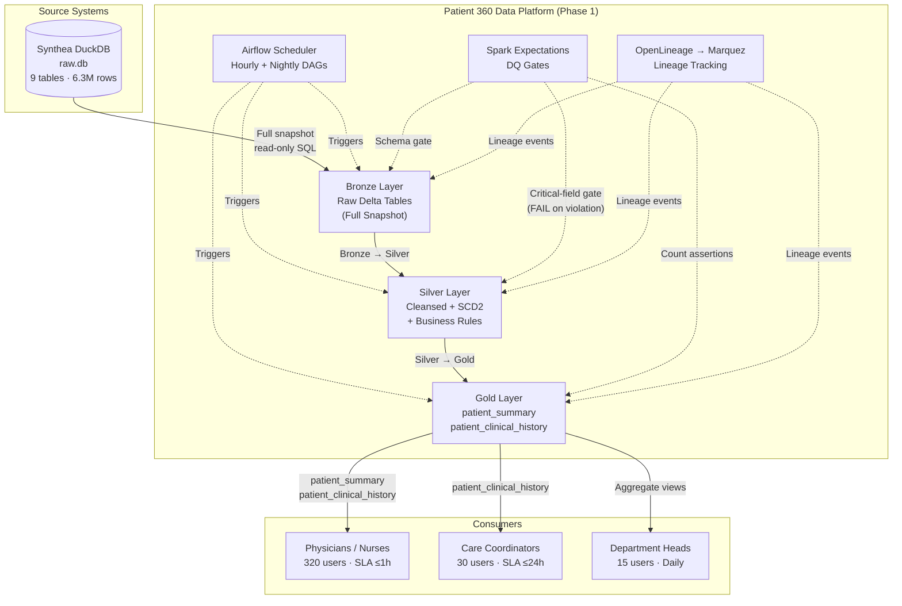
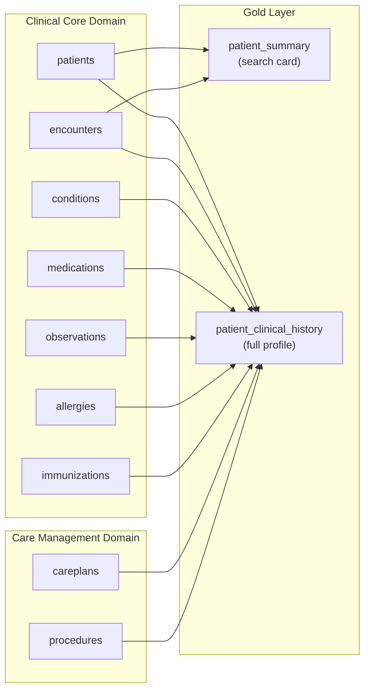
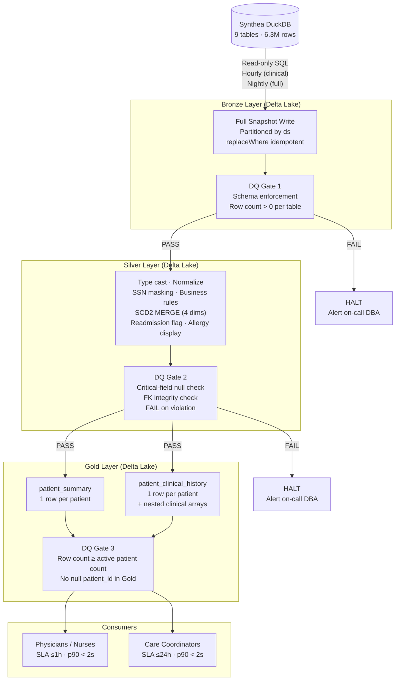
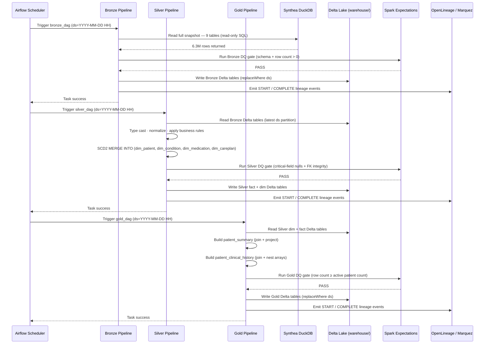

# High-Level Design: Patient 360 Search

| Field | Value |
|-------|-------|
| **Version** | 1.1 |
| **Created** | 2026-04-03 |
| **Last Modified** | 2026-06-18 |
| **Author** | Architect Agent |
| **Status** | Approved |
| **DRD Reference** | DRD-2026-04-03-patient-360.md v1.0 (Approved) |

---

## 1. Executive Summary

The Patient 360 Search data platform consolidates 6.3 million rows across nine Synthea Healthcare clinical tables into two Gold-layer products — `patient_summary` (name-based search result card) and `patient_clinical_history` (full patient profile) — enabling 320 clinical staff to retrieve a complete patient view in under 2 seconds. The platform uses a **Medallion architecture** (Bronze → Silver → Gold) built on **Apache Spark 4.1 with Delta Lake**, orchestrated by **Apache Airflow** on a single-node Docker environment. Clinical data is refreshed hourly to meet the 1-hour freshness SLA for physicians and nurses; care coordination data is refreshed nightly. **Nike Spark Expectations** enforces data quality gates at each layer transition, and **OpenLineage with Marquez** provides full Bronze-to-Gold lineage traceability. Phase 1 covers clinical data only; financial data integration and RBAC enforcement are deferred to Phase 2.

---

## 2. Requirements Summary

### 2.1 Functional Requirements

| # | Functional Requirement | DRD Reference | Satisfied By |
|---|------------------------|---------------|--------------|
| FR-1 | System must enable name-based patient search returning demographics, age, last visit date, and DOB for disambiguation | DRD §1.1, §5.4 | Gold: `patient_summary` |
| FR-2 | System must provide a complete patient profile: encounters, conditions, active medications, allergies with severity, lab results, and immunizations | DRD §1.1, §4.2 | Gold: `patient_clinical_history` |
| FR-3 | System must flag active vs. discontinued medications (`stop IS NULL` = active) | DRD §5.2 | Silver: `dim_medication.is_active` |
| FR-4 | System must display all allergies regardless of severity; NULL severity shown as "Unknown" | DRD §3.1, §3.2 | Silver: `dim_allergy.severity_display` |
| FR-5 | System must flag inpatient encounters as 30-day readmissions | DRD §5.2 | Silver: `fact_encounter.is_readmission` |
| FR-6 | System must include deceased patients with a prominent "Deceased" label and death date | DRD §5.4 | Silver: `dim_patient.is_deceased` |
| FR-7 | System must expose SSN last 4 digits (masked) to disambiguate patients with matching names | DRD §5.3 | Silver: `dim_patient.ssn_last4` (masked in transform) |
| FR-8 | System must support care coordinator panel review with care gap identification | DRD §4.1 | Gold: `patient_clinical_history` (conditions, careplans, immunizations included) |

### 2.2 Non-Functional Requirements

| # | Non-Functional Requirement | DRD Reference | Satisfied By | Target |
|---|---------------------------|---------------|--------------|--------|
| NFR-1 | Search response time at 90th percentile | DRD §4.3 | Gold layer pre-aggregation; Delta Lake columnar reads | < 2s p90 |
| NFR-2 | Clinical data freshness for physicians and nurses | DRD §4.4 | Airflow hourly Bronze→Silver→Gold DAG | ≤ 1 hour |
| NFR-3 | Care coordination data freshness | DRD §4.4 | Airflow nightly full-batch DAG | ≤ 24 hours |
| NFR-4 | System availability during business hours | DRD §4.3 | Pipeline monitoring + on-call DBA alerts; RTO 4h | ≥ 99.5% (6 AM–10 PM) |
| NFR-5 | Concurrent user support | DRD §4.3 | Gold layer read-separated from pipeline writes; Delta concurrent reads | ≥ 400 simultaneous |
| NFR-6 | HIPAA compliance | DRD §7.1 | Data classification + audit logging; SSN masked in Silver; RBAC Phase 2 | PHI encrypted at rest; access logged |
| NFR-7 | Zero tolerance on critical-field nulls | DRD §3.4 | Spark Expectations DQ gate at Silver; pipeline FAIL on violation | 0% null on id, first, last, birthdate, FK fields |
| NFR-8 | Patient data retention | DRD §7.3 | Delta table lifecycle + scheduled VACUUM | 7 years |
| NFR-9 | RTO / RPO targets | DRD §4.3 | Nightly warehouse snapshot; pipeline re-run from source | RTO 4h / RPO 24h |

---

## 3. Integration Architecture

### 3.1 Source Systems

| Source | Type | Access Pattern | Tables Consumed |
|--------|------|---------------|-----------------|
| Synthea Healthcare EHR (DuckDB) | Embedded analytical database (local file) | Read-only SQL via DuckDB connection; full snapshot per run | patients, encounters, conditions, medications, observations, allergies, immunizations, careplans, procedures |

### 3.2 Consumer Access Pattern

| Consumer Group | Access Method | Gold Tables | SLA |
|---------------|--------------|-------------|-----|
| Physicians (120) + Nurses (200) | Direct SQL / analytics query layer against Gold Delta tables | `patient_summary`, `patient_clinical_history` | p90 < 2s; data ≤ 1 hour old |
| Care Coordinators (30) | Direct SQL / analytics query layer against Gold Delta tables | `patient_clinical_history` | p90 < 2s; data ≤ 24 hours old |
| Department Heads (15) | Aggregate queries against Gold layer | `patient_clinical_history` (aggregate only; no individual PHI view) | Daily batch; p90 < 5s |

### 3.3 System Context Diagram

---

## 4. Data Architecture

### 4.1 Selected Pattern

**Pattern**: Medallion Architecture (Bronze / Silver / Gold)

**Justification**: The team is Proficient in Medallion, SCD Type 2, and Delta Lake. The DRD specifies multiple consumer groups (clinical, care coordination) with different freshness and content requirements — a multi-layer separation cleanly isolates raw ingestion from business logic from consumption. The pattern's layer isolation also satisfies DRD §3.4 (DQ gates at each layer transition) and supports independent re-runs per layer if a layer fails.

### 4.2 Alternatives Considered

| Option | Description | Why Not Selected |
|--------|-------------|------------------|
| Lambda Architecture | Parallel batch + speed layers; batch for correctness, stream for latency | DRD §4.4 requires 1-hour freshness, not sub-minute; team is Not Experienced in Structured Streaming (team-capabilities.md); adds complexity without benefit |
| Kappa Architecture | Streaming-only; single path for all latencies | Team has no streaming experience; DuckDB source has no CDC capability (no changelog); full-snapshot source is incompatible with streaming-only design |
| Data Vault 2.0 | Hub/Link/Satellite model; strong auditability and historization | Team is Proficient in SCD2 but not Data Vault; adds significant modeling complexity and query overhead for an operational use case that benefits from simple Gold denormalization |

**Trade-off**: Medallion with full snapshot reload increases pipeline I/O for high-volume tables (observations: 4.4M rows per run) compared to an incremental CDC approach. This is acceptable for Phase 1 because the source (DuckDB local file) has no changelog capability, and the team can operate full snapshot pipelines without additional watermark infrastructure.

### 4.3 Layer Strategy

**Bronze — Raw Ingestion Layer**

Bronze stores an exact copy of every source record as read from the Synthea DuckDB database. No business transformations are applied. Schema enforcement (StructType validation) and row count assertions are the only quality checks. All Bronze tables are partitioned by `ds` (YYYY-MM-DD load date string) and written with `replaceWhere ds='{ds}'` for idempotency. Full snapshot is re-ingested on every run; Bronze always reflects the source as of the most recent pipeline execution.

**Silver — Cleansed and Conformed Layer**

Silver applies all business rules from DRD §5 and transforms raw data into typed, conformed tables. Key responsibilities:
- Type casting and date normalization
- SCD Type 2 MERGE INTO for slowly-changing dimensions (dim_patient, dim_condition, dim_medication, dim_careplan)
- Business rule application: `is_active` on medications, `is_readmission` flag on inpatient encounters, `severity_display` on allergies, `is_deceased` on patients
- SSN masking: only `ssn_last4` retained in Silver; full SSN not propagated downstream
- DQ gate: critical-field null checks — pipeline FAILs if any identity or FK field is null
- Referential integrity: orphaned child rows (no matching parent patient) are dropped

**Gold — Consumer Layer**

Gold pre-joins Silver tables into two denormalized, consumer-ready products. No business rules are added at Gold — this layer is purely a join and projection of Silver data.

- `patient_summary`: One row per patient. Contains name (display), age, DOB, SSN last 4, last visit date, is_deceased flag, allergy count, active condition count. Serves physician/nurse name-based search.
- `patient_clinical_history`: One row per patient with nested or array structures for encounters, conditions, medications, allergies, observations, immunizations, careplans, and procedures. Serves full profile view and care coordinator panel review.

> Detailed table inventories, column schemas, and row-level write strategies are documented in the **Data Model Specification (DMS)**.

### 4.4 Data Domain Map

Phase 1 data spans two clinical domains. The Clinical Core domain provides patient identity and event data; the Care Management domain provides longitudinal care context. Both domains flow into the two Gold products.

### 4.5 SCD Strategy

| Dimension Type | SCD Approach | Rationale |
|----------------|-------------|-----------|
| `dim_patient` | SCD Type 2 | Patient address, marital status, and contact info change over time; history preserved for audit and legal compliance (DRD §7.3) |
| `dim_condition` | SCD Type 2 | Conditions have `start` and `stop` dates; conditions resolve and may reopen; full history required for clinical accuracy |
| `dim_medication` | SCD Type 2 | Prescriptions have `start` and `stop` dates; active status (`is_active`) changes over time; history required for medication reconciliation |
| `dim_careplan` | SCD Type 2 | Care plans open and close; plan content may change; history supports care gap analysis (DRD §4.1) |
| `fact_encounter` | Append-only (no SCD) | Encounters are immutable clinical events; `is_readmission` computed on initial load; no updates expected |
| `fct_observation`, `fct_procedure`, `fct_immunization`, `fct_allergy` | Append-only (no SCD) | Clinical measurements and events are immutable; new records append; no updates to existing rows |

### 4.6 Pipeline Architecture Diagram

---

## 5. Pipeline Architecture

### 5.1 Technology Decisions

| Component | Selected Tool | Why |
|-----------|--------------|-----|
| Data processing engine | Apache Spark (PySpark) | Team is Proficient; handles 6.3M Phase 1 rows on single-node Docker; DRD growth projections remain within local Spark capacity through Year 3 |
| Table format | Delta Lake | Required by infrastructure constraints; provides ACID transactions, MERGE INTO for SCD2, and `replaceWhere` for idempotent partition writes |
| Catalog / metastore | Unity Catalog OSS | Approved in technology catalog; provides table discovery across Bronze/Silver/Gold layers via a named `unity` catalog (set as default catalog) alongside a `spark_catalog` bound to `DeltaCatalog` |
| Orchestration | Apache Airflow | Team is Proficient (vs. Familiar with Spark Declarative Pipelines); supports hourly + nightly DAG scheduling with dependency between Bronze → Silver → Gold layers |
| Data quality enforcement | Nike Spark Expectations | Approved in technology catalog; YAML rule authoring per table; supports `fail`, `drop`, and `ignore` actions per rule |
| Lineage tracking | OpenLineage + Marquez | Approved in technology catalog; automatic job and dataset lineage on every Spark pipeline run via `SparkListener` integration |
| Containerization | Docker + Docker Compose | All services (Spark, Unity Catalog, Marquez, PostgreSQL, Airflow) run inside Docker; single `docker-compose.yml` manages the environment |

> Detailed technology versions, dependency coordinates, and deployment configurations belong in the **Low-Level Design (LLD)** document.

#### Key Compatibility Constraints

- Delta Lake 4.1.0 requires Apache Spark 4.1.x — version pairing is strict; do not mix across major versions
- Unity Catalog OSS (0.4.0, local filesystem) integrates as a **named side catalog**, not as `spark_catalog` itself: set `spark.sql.catalog.spark_catalog=DeltaCatalog` plus `spark.sql.catalog.unity=io.unitycatalog.spark.UCSingleCatalog` with `spark.sql.defaultCatalog=unity`. `UCSingleCatalog` cannot be bound as `spark_catalog` (binding breaks) and does not support `saveAsTable`-create; tables must be pre-created as EXTERNAL Delta and written via `insertInto`. This pattern was empirically validated and is the supported local-FS configuration (see LLD).
- OpenLineage Spark Listener is configured via `spark.extraListeners`; must be set before Spark context creation
- Spark Expectations integrates as a PySpark library; DQ results tables written to a configured expectations schema
- Marquez API is remapped to host port 5001 (macOS AirPlay conflict on 5000); all Spark and Airflow configs must reference `localhost:5001`

#### Technology Trade-offs

- **Airflow over Spark Declarative Pipelines**: Airflow chosen for team proficiency (Proficient vs. Familiar); Airflow also provides richer DAG dependency management (Bronze must complete before Silver) and a mature UI for monitoring. Spark Declarative Pipelines is simpler for single-file pipelines but lacks Airflow's inter-layer dependency and retry capabilities.
- **Full snapshot reload over incremental**: DuckDB local file has no changelog or CDC capability; full reload is the only consistent option. Cost is re-reading 6.3M rows per hourly run, most expensively the 4.4M observation rows. Acceptable at Phase 1 scale; re-evaluate if observation volume exceeds 20M rows.
- **Single-node Docker over cloud Spark**: Aligns with infrastructure constraints (local dev); avoids cloud dependencies for Phase 1. Migration path to Databricks or EMR documented in Open Questions.

### 5.2 CDC Strategy

The Synthea DuckDB source is a local file refreshed via daily CSV batch load. It has no transaction log, no CDC tables, and no row-level change tracking. Full snapshot reload is therefore the only available ingestion method.

| Source Type | CDC Method | Frequency | Rationale |
|------------|-----------|-----------|-----------|
| DuckDB file (all 9 Phase 1 tables) | Full snapshot reload | Hourly for clinical tables (patients, encounters, conditions, medications, observations, allergies, immunizations); Nightly for care management tables (careplans, procedures) | Source has no changelog; full snapshot ensures consistency; clinical tables require hourly refresh per DRD §4.4; care management tables acceptable at 24h per DRD §4.4 |

### 5.3 Ingestion Sequence Diagram

### 5.4 Scalability & Capacity

#### Current Scale

Phase 1 baseline: **6,266,837 total rows** across 9 tables in the Synthea DuckDB source (verified 2026-04-03). The dominant table is `observations` at 4,366,447 rows (69.7% of total volume). The source DuckDB file is ~580 MB. On a single-node Docker Spark (4 GB driver + 4 GB executor), all 9 tables fit comfortably within memory with standard 8-partition shuffle.

#### Growth Model

| Metric | Current | Year 1 | Year 3 | Assumption |
|--------|---------|--------|--------|------------|
| Active patients | 5,000 | 6,000 | 7,500 | 20% annual patient growth |
| Total source rows | 6.3M | 7.5M | 9.4M | Proportional growth across all tables |
| observations rows (dominant) | 4.4M | 5.3M | 6.6M | Scales with patient + encounter growth |
| Delta warehouse size (all layers) | ~2 GB | ~3 GB | ~5 GB | 3× multiplier across Bronze/Silver/Gold + SCD2 history |
| Hourly pipeline runtime | ~10 min | ~12 min | ~15 min | Linear with row count; within 60-min window |

#### Scaling Levers

- **Increase Spark partitions**: Raise `spark.sql.shuffle.partitions` from 8 when observations exceed 10M rows
- **Incremental observations ingestion**: If observation volume exceeds 20M rows, introduce timestamp-based incremental load for the observations table only (all other tables remain full-snapshot)
- **Cloud Spark migration**: Move to Databricks or EMR when local Docker capacity (8 GB total Spark memory) becomes a constraint — estimated trigger at 50M+ rows or sub-1-hour pipeline runtime SLA breach
- **Gold layer caching**: Pre-materialized Gold tables on a faster storage tier if p90 search latency approaches the 2-second SLA

#### Cost Model

All Phase 1 infrastructure runs on local Docker — there are no cloud compute or storage costs. Cost is bounded by developer machine capacity (CPU, RAM, disk). For production deployment, costs scale with: (1) Spark executor count × run hours for processing, (2) Delta warehouse storage volume, and (3) Airflow worker count for scheduling overhead. Storage is the dominant cost driver at scale given Delta's multi-layer history retention.

> Detailed compute sizing and monthly cost breakdowns belong in the **Low-Level Design (LLD)** document.

### 5.5 Reliability

| Metric | Target | Justification |
|--------|--------|---------------|
| Recovery Time Objective (RTO) | 4 hours | Restore pipeline by re-running Bronze → Silver → Gold from DuckDB source within a business half-day; aligned with DRD §4.3 on-call DBA response |
| Recovery Point Objective (RPO) | 24 hours | Daily nightly backup of `warehouse/` directory; worst case is loss of intraday incremental runs; re-runnable from source |
| Pipeline availability | ≥ 99.5% during 6 AM–10 PM | Aligns with DRD §4.3; monitored via Airflow task success rate; on-call DBA alerted on failure |

**Backup approach**: The `warehouse/` Docker volume (Delta table files + transaction logs) is snapshotted nightly to a backup storage location. Delta transaction log retention is set to 7 days, enabling point-in-time reads within that window. Full pipeline re-run from the DuckDB source is the primary recovery mechanism for data loss events; Delta restore from snapshot covers infrastructure failures.

> Detailed recovery runbooks and per-table failover procedures belong in the **Low-Level Design (LLD)** document.

### 5.6 Observability

**Lineage**: OpenLineage Spark Listener emits `RunEvent` messages (START, COMPLETE, FAIL) to Marquez on every Bronze, Silver, and Gold pipeline job. Marquez stores job-level and dataset-level lineage, enabling full Bronze→Silver→Gold trace in the Marquez Web UI.

**Data Quality**: Spark Expectations writes DQ result tables (pass/fail counts per rule per run) to a configured expectations output schema. Failed runs produce a structured result summary identifying which rule failed, which table was affected, and the failing row count.

**Pipeline Metrics**: Airflow tracks task-level success, failure, retry, and duration. Airflow alerting is configured to notify the on-call DBA on any pipeline task failure, with freshness alerts triggered when the last successful run timestamp exceeds the SLA window (1 hour for clinical, 24 hours for care management).

### 5.7 Key Design Principles

- **Idempotency**: All pipeline runs use `replaceWhere ds='{ds}'` — re-running the same date partition overwrites exactly that partition; no duplicate data produced
- **Quality-first**: DQ gates run at Bronze (schema + row count), Silver (critical-field nulls → FAIL), and Gold (row count assertions); bad data never reaches consumer-facing Gold tables
- **Layer isolation**: Bronze stores raw source data; Silver applies all business rules; Gold serves consumers; each layer has a single, well-defined responsibility and can be re-run independently
- **Traceability**: Every pipeline job emits OpenLineage events; full Bronze→Gold dataset lineage is visible in Marquez; each design decision in this HLD cites the DRD section it satisfies
- **Schema-on-write**: Delta Lake enforces schema at write time; unexpected columns cause pipeline failure rather than silent schema drift

---

## 6. Governance

### 6.1 Data Sensitivity & Classification

| Classification | Examples | Handling Strategy |
|---------------|----------|-------------------|
| PHI + PII — Highly Sensitive | Patient name, date of birth, address, SSN; diagnoses, medications, lab results, allergies | Encrypt at rest in production; SSN truncated to last 4 in Silver (full SSN never reaches Gold); access restricted by role (Phase 2 RBAC) |
| PHI — Sensitive | Encounter history, procedures, immunizations, care plans, provider references | Role-based read access; audit log on all access events; not shareable outside organization without authorization |
| Internal | Aggregate quality metrics (DQ result tables), pipeline run statistics, row counts | No PHI content; can be shared within the organization; no encryption required |

### 6.2 Access Strategy (IAM)

| Role Group | Layer Access | Restrictions | Phase |
|-----------|-------------|-------------|-------|
| Physicians + Nurses | Gold read (`patient_summary`, `patient_clinical_history`) | SSN masked to last 4; no raw Bronze/Silver access | Phase 2 (RBAC design pending) |
| Care Coordinators | Gold read (`patient_clinical_history`) | Own panel only enforced by row-level filter (Phase 2); no Bronze/Silver access | Phase 2 (RBAC design pending) |
| Department Heads | Gold aggregate views (de-identified counts + rates) | No individual patient PHI; aggregate projection enforced at view level | Phase 2 (RBAC design pending) |
| Data Engineers | Bronze read/write, Silver read/write, Gold read/write | Local dev environment only; no production PHI in dev; read-only on production source | Phase 1 |
| Airflow pipeline service account | Bronze write, Silver write, Gold write | Service account scoped to pipeline execution; no interactive query access | Phase 1 |

### 6.3 Data Quality Strategy

DQ is enforced at three gates across the Medallion layers:

**Bronze DQ Gate** (schema and completeness)
- Schema enforcement via Spark StructType: unexpected columns rejected; type mismatches cause pipeline halt
- Row count assertion: every source table must produce at least 1 row; empty result fails the bronze run
- Action: `fail` — no partial Bronze writes; all-or-nothing per table

**Silver DQ Gate** (critical-field nulls and referential integrity)
- Critical-field null checks (Spark Expectations `row_dq`): `id`, `first`, `last`, `birthdate` on `dim_patient`; `patient` FK on all child tables; `description` on `dim_allergy`
- Action on null violation: `fail` — pipeline halts; no Silver write; on-call DBA alerted
- FK integrity: orphaned child rows (no matching parent patient in `dim_patient`) are `drop`ped and logged; count of dropped rows tracked in DQ result table
- Allergy severity null: treated as acceptable (56.4% baseline); `ignore` action; mapped to display value "Unknown"

**Gold DQ Gate** (completeness assertions)
- Row count assertion: `COUNT(*) in patient_summary ≥ active patient count in Silver dim_patient`
- Null check on `patient_id` in both Gold tables: zero tolerance
- Action: `fail` — no Gold write if assertions breach; Silver remains available

### 6.4 Compliance Requirements

**HIPAA Privacy Rule (45 CFR Part 164)**
- Minimum necessary access: each consumer role accesses only the Gold tables and fields required for their workflow
- PHI access logging: every Gold table query logged with user, timestamp, and patient identifier accessed (implementation deferred to Phase 2 RBAC rollout)
- No bulk PHI export without authorization: enforced via role-restricted access to Gold tables

**HIPAA Security Rule**
- Encryption at rest: Delta Lake warehouse directory encrypted at filesystem level in production (AES-256)
- SSN masking: full SSN is read from Bronze but truncated to last 4 digits (`ssn_last4`) in Silver transform; full SSN never written to Silver or Gold
- Audit log retention: Airflow task logs and Spark Expectations DQ result tables retained for 6 years per HIPAA Security Rule §164.312
- Breach detection: unusual access patterns (off-hours bulk queries, high row-count scans) flagged via Airflow alerting; reviewed by Security Officer

> Column-level masking rules, specific authentication methods, and encryption key management details belong in the **Low-Level Design (LLD)** document.

---

## 7. Decision Log

### Decision 1: Architecture Pattern Selection

**Options Considered**:
1. Medallion Architecture (Bronze/Silver/Gold) — layered lakehouse with Delta Lake
2. Lambda Architecture — parallel batch + streaming speed layers
3. Kappa Architecture — streaming-only unified pipeline
4. Data Vault 2.0 — Hub/Link/Satellite model

**Selected**: Medallion Architecture

**Rationale**: Team is Proficient in Medallion, SCD2, and Delta Lake (team-capabilities.md). DRD §4.4 specifies 1-hour freshness for clinical data — achievable with hourly batch, which the team can operate without streaming expertise. Multiple consumer groups with different freshness and content needs map cleanly to separate Gold tables. Lambda and Kappa require Structured Streaming experience the team does not have. Data Vault adds modeling complexity (Hub/Link/Satellite) with no benefit for this operational use case.

**Trade-off**: Medallion sacrifices sub-minute latency (not required by DRD) and the auditability benefits of Data Vault. Accepted because DRD §4.4 requires only hourly freshness, and the team can build and operate Medallion independently without upskilling.

---

### Decision 2: Processing Engine

**Options Considered**:
1. Apache Spark (PySpark 4.1) — distributed processing with Delta Lake integration
2. DuckDB local — in-process SQL analytics on the source file directly
3. Pandas — in-memory Python dataframes

**Selected**: Apache Spark (PySpark)

**Rationale**: Team is Proficient in PySpark and Spark SQL. Delta Lake (required by infra constraints) integrates natively with Spark. SCD2 MERGE INTO operations are well-supported in Spark + Delta. At 6.3M Phase 1 rows, DuckDB could handle the data volume, but it lacks SCD2 MERGE support and native Delta Lake write capability. Pandas lacks distributed processing and Delta integration for production-grade pipelines.

**Trade-off**: Spark adds JVM startup overhead (~2-3 min per pipeline run) compared to DuckDB's near-instant query execution. Acceptable because pipeline runs are batch jobs, not interactive queries.

---

### Decision 3: Orchestration Layer

**Options Considered**:
1. Apache Airflow — external scheduler with DAG-per-layer
2. Spark Declarative Pipelines — `spark-pipeline.yml` spec built into Spark 4.1
3. Make targets only — manual `make bronze`, `make silver`, `make gold`

**Selected**: Apache Airflow

**Rationale**: Team is Proficient in Airflow (team-capabilities.md). Airflow provides inter-layer dependency management (Bronze must complete before Silver triggers), configurable retry logic, hourly + nightly scheduling, and a monitoring UI. Spark Declarative Pipelines is Familiar-level and less mature for complex multi-layer orchestration. Make targets are sufficient for development but cannot schedule hourly runs or enforce layer dependencies automatically.

**Trade-off**: Airflow adds a service dependency (Airflow scheduler + worker containers) to the Docker Compose stack. Accepted as a necessary operational requirement for the hourly clinical freshness SLA.

---

### Decision 4: Ingestion Strategy

**Options Considered**:
1. Full snapshot reload — re-ingest all rows from DuckDB source on every run
2. Incremental by watermark timestamp — filter to rows newer than max(load_timestamp)
3. Hybrid — full reload for small tables; incremental for large tables (observations)

**Selected**: Full snapshot reload

**Rationale**: The DuckDB source is a local file refreshed by daily CSV batch load. It has no changelog, no transaction log, and no CDC capability. Incremental loading would require a reliable change-tracking column, which most Phase 1 tables lack (conditions, allergies, careplans have `start`/`stop` but no `updated_at`). Full snapshot is the only method that guarantees consistency with the source.

**Trade-off**: Re-reads 6.3M rows per hourly run. The observations table (4.4M rows) is the most expensive. Estimated hourly pipeline runtime ~10 minutes, well within the 60-minute window. Re-evaluated if observation volume exceeds 20M rows or pipeline runtime approaches 45 minutes.

---

## 8. Open Questions & Risks

### Open Questions

| # | Question | Assigned To | Due Date | Status |
|---|----------|-------------|----------|--------|
| 1 | Patient count discrepancy: DRD business request states ~1,000 active patients but actual database count is 5,000. Is this a cohort limit or an incorrect estimate? Affects Gold table sizing and infrastructure migration triggers. | Michael Torres (CIO) | 2026-04-17 | Open |
| 2 | RBAC design: Which data fields should be restricted per role (e.g., should nurses see SSN last 4)? Required to finalize IAM access strategy before Phase 2 launch. | Michael Torres (CIO) | 2026-05-01 | Open |
| 3 | Wait time data: DRD §4.2 mentions encounter wait time as a care coordinator need, but `encounters` table has no wait time column. Is this calculated from encounter start vs. scheduled time, or from a separate scheduling system? | Lisa Park (Clinical Ops) | 2026-04-17 | Open |
| 4 | Phase 2 timeline: When will financial data integration (claims, payers) begin? Needed to sequence HLD update for Phase 2 scope. | Dr. Sarah Chen (CMO) | 2026-04-17 | Open |
| 5 | Cloud migration trigger: At what patient count or pipeline runtime should the team evaluate migrating from local Docker Spark to cloud (Databricks, EMR)? Needed to define scaling roadmap. | Michael Torres (CIO) | 2026-05-01 | Open |

### Key Risks

| Risk | Impact | Likelihood | Mitigation |
|------|--------|-----------|------------|
| Single-node Docker capacity: Spark memory (4 GB driver + 4 GB executor) limits horizontal scaling; observation table growth beyond 20M rows may breach hourly pipeline window | High — pipeline SLA failure | Low (Year 1–2) | Monitor hourly pipeline runtime; trigger cloud migration plan at 45-min threshold |
| Marquez `latest` Docker tag: Non-deterministic builds may introduce breaking changes in the Marquez lineage API | Medium — lineage gaps | Medium | Pin Marquez to a specific version tag in `docker-compose.yml` (tracked in LLD) |
| Full snapshot reload cost: Hourly re-read of 4.4M observation rows consumes Spark executor memory; increases with data growth | Medium — pipeline slowdown | Medium (Year 2+) | Introduce timestamp-based incremental load for observations if runtime exceeds 45 minutes |
| UC OSS 0.4.0 column-level lineage gap: Cannot trace field-level data flow (e.g., SSN → ssn_last4); only table-level lineage available | Low — audit gap | High (known limitation) | Document as known limitation in LLD; evaluate Databricks UC or DataHub for column lineage if HIPAA audit requires field-level tracing |
| RBAC not enforced in Phase 1: All data engineers have read/write to all layers; PHI accessible without role controls | High — HIPAA risk | Low (dev environment only) | Phase 1 restricted to local dev with no production PHI; RBAC design must be completed before any production deployment |

---

## 9. Appendix

### Version History

| Version | Date | Author | Changes |
|---------|------|--------|---------|
| 1.0 | 2026-04-03 | Architect Agent | Initial creation. Medallion pattern selected. Airflow orchestration. Full snapshot ingestion. SCD2 on 4 dims. Gold tables: patient_summary, patient_clinical_history. Silver DQ gate: FAIL on critical-field null. RTO 4h / RPO 24h. |
| 1.1 | 2026-06-18 | Architect Agent | Reconciled §5.1 Unity Catalog OSS guidance with approved LLD v1.13: UC OSS integrates as a named `unity` side catalog (default) alongside `spark_catalog=DeltaCatalog`; tables pre-created EXTERNAL Delta, writes via `insertInto` (UCSingleCatalog cannot be `spark_catalog` and does not support saveAsTable-create). |
| 1.1 | 2026-06-18 | Architect Agent | Status changed to Approved |

### Approval

| Role | Name | Date | Signature |
|------|------|------|-----------|
| Business Sponsor | Dr. Sarah Chen | — | Pending |
| Technical Approver | Michael Torres | — | Pending |
| Lead Architect | — | — | Pending |

### Related Documents

- **DRD**: DRD-2026-04-03-patient-360.md v1.0 (Approved)
- **DMS**: Data Model Specification (downstream — defines table schemas and column details)
- **LLD**: Low-Level Design (downstream — defines deployment configs, versions, and runbooks)
