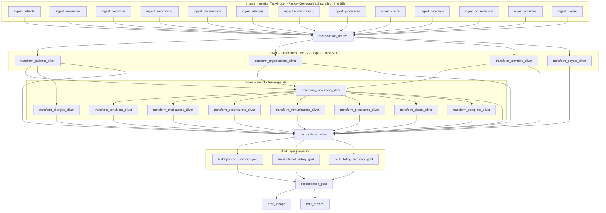

# Low-Level Design: Patient 360 Medallion Pipeline

| Field | Value |
|-------|-------|
| **Version** | 1.25 |
| **Created** | 2026-03-23 |
| **Last Modified** | 2026-06-22 |
| **Author** | Technical Lead Agent |
| **Status** | Updated - Pending Review |
| **DRD Reference** | DRD-2026-02-11-patient-360.md (v1.1) |
| **HLD Reference** | HLD-2026-03-17-patient-360-pipeline-v1.1.md (v1.2) |
| **DMS Reference** | DMS-2026-03-18-patient-360.md (v1.1) |
| **STM Reference** | STM-2026-03-21-patient-360.xlsx (v2.0) |
| **DQS Reference** | DQS-2026-03-21-patient-360.md (v2.0) |
| **Target Scaffold** | `inputs/lld/v1/templates/cookiecutter-chapter/` |
| **Chapter** | chapter-5 (cookiecutter `chapter_name`) |
| **Project Name** | patient_360 (cookiecutter `project_name`) |

---

## 1. Design Overview

The Patient 360 pipeline is implemented as a three-layer Medallion architecture (Bronze, Silver, Gold) orchestrated by Apache Airflow, processing 13 Synthea Healthcare EHR source tables (7.9M Phase 1 rows, 636 MB raw) on an hourly schedule to meet the 1-hour clinical data freshness SLA [DRD §4.4]. The implementation project is scaffolded from the **`cookiecutter-chapter` template** at `inputs/lld/v1/templates/cookiecutter-chapter/` (defaults: `chapter_name=chapter-5`, `project_name=patient_360`, `python_version=3.12`), which fixes the canonical layout for the source package, Airflow DAGs, table contracts, DQ rules, plain `.sql` DDL migrations (`ddl/migrations/`), infra config, and the developer plugin. All environments (DEV, STAGING, PROD) run locally with **Unity Catalog OSS as the runtime catalog and metastore** for Delta table registration and governance [infrastructure-specs.md §4, HLD §5.1]. UC is wired as a **named side catalog**: `spark.sql.catalog.spark_catalog=org.apache.spark.sql.delta.catalog.DeltaCatalog` plus `spark.sql.catalog.unity=io.unitycatalog.spark.UCSingleCatalog` (with `.uri`/`.token`/`.warehouse`) and `spark.sql.defaultCatalog=unity` (see §13 Decision 12, re-adopted 2026-06-18). Tables are **pre-created as EXTERNAL Delta** from plain dated `.sql` migrations under `ddl/migrations/` (`CREATE TABLE IF NOT EXISTS unity.<schema>.<table> (...) USING DELTA LOCATION '<warehouse path>'`), applied in lexical order by a **beeline one-shot** (`_infra/docker/ddl-apply.sh`) against a Spark Thrift Server (HiveServer2 on port 10000) — the `.sql` files are the DDL source of truth; there is no Liquibase (removed because it cannot connect on OSS components — see §13 Decision 12); pipeline tasks write into these pre-created UC tables via `insertInto` (Bronze, Silver facts, Gold) and SCD2 dimensions `MERGE INTO unity.silver.<dim>`. The processing engine is Apache Spark 4.1.1 (PySpark pinned to the exact patch `4.1.1`, the ceiling imposed by delta-spark 4.3.0) with Delta Lake 4.1.x running on Java 17 and Scala 2.13, using PySpark for all transformation logic, against **Unity Catalog OSS 0.5.0**. Spark Expectations writes its `_error` and `_stats` audit tables as **MANAGED Unity Catalog tables** addressed by a per-table 3-part FQN (`unity.<schema>.<table>_error` / `_stats`) — SE creates them via `saveAsTable` on first run; only the **business** tables (Bronze/Silver/Gold) are EXTERNAL Delta pre-created by Liquibase (see §13 Decision 12, corrected 2026-06-20). The Bronze layer uses a **config-driven ingestion framework**: 13 per-table YAML configuration files (one per Bronze table under `airflow/configs/` with table contracts in `contracts/` and DQ rules in `dq_rules/`) define source, schema, DQ rules, and empty-input behavior; a TaskGroup factory function reads these configs and generates an Airflow TaskGroup with one SparkSubmitOperator wrapper per table, eliminating boilerplate code across ingestion modules. DQ rules are auto-discovered by table name convention from the per-table `dq_rules/{table}.yml` files [DQS §2-4]. Silver and Gold layers remain as dedicated transformation modules under `src/patient_360/{silver,gold}/`. Data quality is enforced via **inline Spark Expectations** within each task (row_dq and agg_dq checks using action_if_failed: fail/drop/ignore) plus lightweight **reconciliation tasks** at each layer boundary for cross-table query_dq checks (row count reconciliation, freshness, completeness) [DQS §2-4]. The pipeline writes Delta Lake tables with Snappy compression, partitioned by ingestion date (`ds`), with SCD Type 2 change tracking on four dimension tables (patients, providers, payers, organizations) using SHA-256 hash comparison and Delta MERGE INTO. Three Gold tables serve distinct consumer groups: `patient_summary` (350 clinical users), `patient_clinical_history` (physicians and nurses), and `patient_billing_summary` (50 billing staff). Rollback uses Delta RESTORE for immediate recovery with pipeline re-run for correctness verification. A companion **`developer-plugin`** (scaffolded from the same cookiecutter under `developer-plugin/`) automates DAG and CI/CD generation/validation via skills `create-dag`, `update-dag`, `validate-dag`, `create-pipeline`, `update-pipeline`, `validate-pipeline`.

---

## 2. Code Architecture

### 2.1 Project Structure

The implementation project is generated from `inputs/lld/v1/templates/cookiecutter-chapter/` with defaults `chapter_name=chapter-5`, `project_name=patient_360`, `python_version=3.12`. The generated layout (rendered values shown) is the **source of truth** for code organization; development-standards.md §2.1 conventions apply within it.

```
chapter-5/                                         # cookiecutter chapter root
+-- inputs/                                        # approved chapter-4 artifacts (DRD, HLD, DMS, STM, DQS, LLD)
+-- outputs/                                       # chapter-5 generated outputs
+-- developer-plugin/                              # AI developer agent plugin (DAG + CI/CD skills)
|   +-- .claude-plugin/plugin.json
|   +-- agents/
|   +-- hooks/hooks.json                           # PostToolUse: validate-output-hook.py
|   +-- scripts/
|   +-- skills/
|       +-- airflow/{create-dag,update-dag,validate-dag}/SKILL.md
|       +-- cicd/{create-pipeline,update-pipeline,validate-pipeline}/SKILL.md
+-- patient_360/                                   # main Python project (the implementation)
    +-- pyproject.toml                             # hatchling build, ruff, pytest config; uv-managed
    +-- Makefile                                   # make dev-setup | test | lint | clean
    +-- CLAUDE.md                                  # project instructions for the developer plugin
    +-- src/
    |   +-- patient_360/                           # importable package (replaces former src/pipelines)
    |       +-- __init__.py
    |       +-- bronze/
    |       |   +-- __init__.py
    |       |   +-- config/                        # bronze ingestion-runtime helpers
    |       |   |   +-- __init__.py
    |       |   +-- utils/                         # bronze-local utilities
    |       |       +-- __init__.py
    |       +-- silver/__init__.py                 # 1 module per target Silver table (13)
    |       +-- gold/__init__.py                   # 1 module per Gold consumer table (3)
    |       +-- utils/__init__.py                  # cross-layer utilities (logging, metrics, delta_helpers)
    +-- tests/                                     # mirrors src/ structure
    |   +-- conftest.py
    |   +-- bronze/__init__.py
    |   +-- silver/__init__.py
    |   +-- gold/__init__.py
    +-- airflow/
    |   +-- dags/__init__.py                       # patient360_hourly_v1.py lives here
    |   +-- configs/                               # per-table ingestion YAML configs (13 files)
    +-- contracts/                                 # table contracts (DDL + DQ pointers)
    |   +-- table_name.yml                         # one per table -- rename to {table}.yml
    |   +-- dq/
    |       +-- table_name.yml                     # DQ contract pointer with thresholds
    +-- dq_rules/                                  # actual DQ rule definitions
    |   +-- table_name.yml                         # one per table; SE rule schema (row_dq, agg_dq)
    +-- ddl/
    |   +-- migrations/                            # plain dated .sql DDL migrations (<YYYYMMDD>_<NNN>_<table>.sql)
    +-- _infra/
    |   +-- docker/                                # docker-compose / Dockerfiles
    |   +-- ci/                                    # GitHub Actions workflows
    |   +-- cd/                                    # deploy manifests (local make-driven)
    +-- scripts/                                   # one-off utility scripts
    +-- ui/                                        # placeholder for any operator UI
```

**Module-to-template mapping** (where each LLD construct lives in the rendered project):

| LLD Construct | Template Location |
|---------------|-------------------|
| Generic ingestion runner | `src/patient_360/bronze/ingestion_runner.py` |
| TaskGroup factory | `src/patient_360/bronze/ingestion_factory.py` |
| SparkSubmitOperator wrapper | `src/patient_360/bronze/spark_submit_wrapper.py` |
| Per-table ingestion YAML configs (13) | `airflow/configs/{table}.yml` |
| Per-table table contracts (13) | `contracts/{table}.yml` (with `ddl_path` + `dq_path` pointers) |
| Per-table DQ contract pointers | `contracts/dq/{table}.yml` (thresholds; points to `dq_rules/{table}.yml`) |
| Per-table DQ rules (Bronze/Silver/Gold) | `dq_rules/{table}.yml` (SE row_dq/agg_dq rule schema) |
| Schema migrations / DDL | `ddl/migrations/<YYYYMMDD>_<NNN>_{table}.sql` |
| Silver transforms (13 modules) | `src/patient_360/silver/transform_{table}.py` |
| Gold builders (3 modules) | `src/patient_360/gold/build_{table}.py` |
| Shared SCD2 / derived fields / code systems | `src/patient_360/utils/{scd2,derived_fields,code_systems}.py` |
| SE runner + reconciliation | `src/patient_360/utils/{se_runner,reconciliation}.py` |
| Logging / metrics / delta helpers | `src/patient_360/utils/{logging_config,metrics,delta_helpers}.py` |
| Pipeline config loader | `src/patient_360/utils/pipeline_config.py` |
| Airflow DAG | `airflow/dags/patient360_hourly_v1.py` (imports `ingestion_factory`) |
| Tests (unit + integration) | `tests/{bronze,silver,gold}/test_*.py` (mirrors src) |
| CI workflows | `_infra/ci/.github/workflows/*.yml` |
| Local infra | `_infra/docker/docker-compose.yml` (UC OSS, Marquez, Grafana) |

**Build & dependency management** (per template `pyproject.toml`):
- Build backend: `hatchling`; package = `src/patient_360`
- Runtime deps: `pyyaml>=6.0`, `jinja2>=3.1`
- Dev extras: `apache-airflow>=2.9.0`, `pytest>=8.0`, `pytest-cov>=5.0`, `ruff>=0.4`
- Python: `>=3.12` (cookiecutter default)
- Install: `make dev-setup` -> `uv sync --all-extras`

### 2.2 Coding Conventions

Per development-standards.md §2.2:

| Element | Convention | Example |
|---------|-----------|---------|
| Module files | `snake_case.py` | `ingest_patients.py` |
| Classes | `PascalCase` | `BronzeIngestionTask` |
| Functions | `snake_case` | `load_encounters()` |
| Constants | `UPPER_SNAKE_CASE` | `MAX_RETRY_COUNT` |
| Config keys | `dot.separated` | `pipeline.bronze.batch_size` |

### 2.3 Module Interface Contracts

For naming conventions and coding standards, see development-standards.md §2-3.

**`src/patient_360/bronze/ingestion_runner.py`** -- Generic Ingestion Runner
- **Input**: Per-table YAML config path (resolved via `AIRFLOW_CONFIGS_DIR` env, default `${PATIENT360_PROJECT_ROOT}/airflow/configs`), Spark session built with the **named UC side catalog** — `spark.sql.catalog.spark_catalog=org.apache.spark.sql.delta.catalog.DeltaCatalog`, `spark.sql.catalog.unity=io.unitycatalog.spark.UCSingleCatalog` (with `.uri`=`${UC_URI}`, `.token`, `.warehouse`), and `spark.sql.defaultCatalog=unity` (see §13 Decision 12, re-adopted 2026-06-18). The session also sets `spark.sql.sources.partitionOverwriteMode=dynamic`, which is what makes the `insertInto` write replace only the in-DataFrame `ds` partition(s) (the idempotency mechanism — see §13 Decision 15; `replaceWhere` is NOT used because `insertInto` silently ignores it). The metastore is Unity Catalog OSS, reached at write time through the UC side catalog; the `unity.bronze.<table>` tables are pre-created as EXTERNAL Delta from the plain `.sql` migrations (`ddl/migrations/<YYYYMMDD>_<NNN>_<table>.sql`, applied by the `ddl-apply` beeline one-shot) against the Spark Thrift Server (HiveServer2 :10000). Pipeline run context.
- **Output**: UC-registered EXTERNAL Delta table `unity.bronze.<table>` (Decision 12 & 15, re-adopted 2026-06-18). The table is pre-created by the `.sql` migrations; the runner does **not** create it. Unity Catalog OSS is the runtime catalog and participates in the write path.
- **Responsibility**: Reads YAML config to determine source (CSV by default; DuckDB only for source tables < 100 MB — see §5.1), column contract, DQ rule references (resolved via `DQ_RULES_DIR` env, defaulting to `${PATIENT360_PROJECT_ROOT}/dq_rules`, then `dq_rules/{table}.yml` by table name convention), and empty-input behavior. Executes the standard ingestion pattern: read source, add metadata columns, enforce the source-derived column contract (no inference), call SE inline for row_dq/agg_dq validation, write via `df.write.mode("overwrite").insertInto("unity.bronze.<table>")` into the pre-created UC table with the Spark session set to `spark.sql.sources.partitionOverwriteMode=dynamic` (replaces only the `ds` partition(s) present in the DataFrame; other partitions preserved; idempotent re-runs). **No `.option("replaceWhere", ...)`** — `replaceWhere` is silently ignored by `insertInto` (it only applies to `.save()`/`.saveAsTable()`), so it must not appear with `insertInto`; idempotency comes from dynamic partition overwrite instead. **No `saveAsTable`-create anywhere** — `UCSingleCatalog` rejects RTAS/CTAS; table creation is owned by Liquibase DDL, the runner only `insertInto`s.

  **Bronze column contract source = the source system, not the DMS.** Bronze runners build their column list dynamically from the source itself: for DuckDB sources via `DESCRIBE synthea.<table>`; for CSV sources via the header row plus an inferred-then-pinned type pass on a small sample. The DMS owns Silver/Gold contracts only — Bronze is intentionally a permissive landing zone that reflects whatever the source emits. This avoids the schema-drift class of failure where a new source column would fail Bronze ingest before any Silver transform had a chance to drop it. Contract snapshots are persisted at `contracts/{table}.yml` for traceability but are produced by introspection, not hand-written from DMS §2.

  Adds **four** metadata columns to every Bronze table before writing Delta — `ds` (partition date, string `YYYY-MM-DD`), `_ingested_at` (ingestion timestamp, `TimestampType`), `_source_batch_id` (deterministic `{table}:{ds}`, `StringType`), and `_source_file` (source path/filename the row was ingested from, `StringType`) — read from the per-table YAML `source.path` (e.g. `data/raw_delta/careplans.csv`) for source lineage. The `add_metadata_columns` helper MUST emit all four; `_source_file` matches the `_source_file STRING` column already present in the Bronze DDL migration (`ddl/migrations/<YYYYMMDD>_<NNN>_{table}.sql`). Emitting only three causes a `DELTA_INSERT_COLUMN_ARITY_MISMATCH` on `insertInto` (the pre-created UC table has `_source_file`, the runner DataFrame does not), failing Bronze ingestion. SE rules in `dq_rules/{table}.yml` reference these column names verbatim; renaming them requires a matching SE rules update.

**`src/patient_360/bronze/ingestion_factory.py`** -- TaskGroup Factory
- **Input**: Config directory path (string, default `airflow/configs/`), Airflow DAG reference
- **Output**: Airflow TaskGroup (`bronze_ingestion`) containing one SparkSubmitOperator wrapper task per YAML file
- **Responsibility**: Scans `airflow/configs/*.yml` at DAG parse time, creates one task per file. Eliminates the need for 13 individual bronze modules.

**`src/patient_360/bronze/spark_submit_wrapper.py`** -- SparkSubmit Wrapper
- **Input**: YAML config path (string), pipeline config (compute parameters)
- **Output**: SparkSubmitOperator configured with standard Spark parameters and `--config-path` argument
- **Responsibility**: Thin wrapper that delegates ingestion logic to the Spark cluster. Sets memory, cores, executors from pipeline config.

**`airflow/configs/{table}.yml`** -- Per-Table Ingestion Config (13 files)
- **Input**: N/A (declarative config)
- **Output**: N/A (consumed by ingestion_runner and ingestion_factory)
- **Responsibility**: Declares source table, schema_ref, output_path, empty_input_behavior, dq_rules_table (defaults to table name; resolved to `dq_rules/{table}.yml`), metadata columns, timeout, and retries for one source table. Critical tables override empty_input_behavior to `fail`: patients, encounters, allergies [DRD §1.3], organizations, providers, payers. All others default to `write_empty`.

**`contracts/{table}.yml` and `contracts/dq/{table}.yml`** -- Per-Table Table Contracts (13 + 13 files)
- **Input**: N/A (declarative)
- **Output**: N/A (consumed by validation tooling and developer plugin)
- **Responsibility**: `contracts/{table}.yml` is the authoritative contract per table -- declares `layer`, `schema`, owner, tags, column-level annotations, and pointers `ddl_path` (-> `ddl/migrations/<YYYYMMDD>_<NNN>_{table}.sql`) and `dq_path` (-> `dq_rules/{table}.yml`). `contracts/dq/{table}.yml` is the DQ contract pointer carrying severity thresholds (`completeness_min`, `validity_min`, `freshness_max_hours`) used by reconciliation tasks.

**`dq_rules/{table}.yml`** -- Per-Table DQ Rules (13 Bronze + 13 Silver + 3 Gold files)
- **Input**: N/A (declarative SE rule schema)
- **Output**: N/A (consumed by `se_runner.py` via convention-based discovery)
- **Responsibility**: Holds the actual Spark Expectations rules (`rule_type: row_dq | agg_dq`, `rule`, `description`, `error_drop_threshold`) for a single table. Replaces the prior monolithic `bronze_rules.yaml` / `silver_rules.yaml` / `gold_rules.yaml` files; granularity now matches `airflow/configs/` and `contracts/`.

**`ddl/migrations/<YYYYMMDD>_<NNN>_{table}.sql`** -- Schema DDL (per table)
- **Input**: N/A (plain dated `.sql` migration)
- **Output**: N/A (consumed by the `ddl-apply` beeline one-shot, `_infra/docker/ddl-apply.sh`)
- **Responsibility**: Source of truth for table DDL across Bronze/Silver/Gold. Each file is a `CREATE TABLE IF NOT EXISTS unity.<schema>.<table> (...) USING DELTA PARTITIONED BY (ds) LOCATION '${PATIENT360_WAREHOUSE_ROOT}/...'` with `-- migration:` / `-- layer:` / `-- rollback:` header comments (the `-- rollback:` line carries the `DROP TABLE IF EXISTS` for manual reversal). Filenames are dated + zero-padded sequence, so a plain lexical sort gives the bronze → silver → gold apply order. Schema evolution is a **new dated migration** (no Liquibase changeset/changelog tracking; `IF NOT EXISTS` makes re-apply idempotent). Referenced from `contracts/{table}.yml` via `ddl_path`. See §13 Decision 12.

**`src/patient_360/utils/scd2.py`** -- SCD Type 2 Merge
- **Input**: DataFrame (incoming records), target_table (str -- named UC FQN `unity.silver.<dim>`), natural key column(s) (list[str]), hash columns (list[str]), effective date (date)
- **Output**: `dict[str, int]` -- `{"rows_inserted", "rows_closed", "rows_unchanged"}` from the Delta MERGE
- **Responsibility**: Generic SCD2 merge using SHA-256 hash comparison and Delta MERGE INTO with matched/unmatched logic. For SCD2 strategy details, see DMS §6.

  **Interface contract** (`src/patient_360/utils/scd2.py`):

  ```python
  def apply_scd2(
      df: DataFrame,
      target_table: str,
      natural_keys: list[str],
      hash_columns: list[str],
      effective_date,
  ) -> dict[str, int]:
      """Generic named-table SCD Type 2 merge.

      target_table is a NAMED Unity Catalog table FQN (unity.silver.<dim>)
      that has been PRE-CREATED as EXTERNAL Delta by Liquibase at deploy-time.
      The helper MERGEs into the existing table via
      DeltaTable.forName(spark, target_table) and NEVER creates the table /
      issues saveAsTable at runtime.

      Caller is responsible for running DQ checks BEFORE invoking this
      function — the SCD2 helper trusts every row it receives.

      Returns: {"rows_inserted": int, "rows_closed": int, "rows_unchanged": int}
      """
  ```

**`src/patient_360/utils/se_runner.py`** -- Spark Expectations Runner
- **Input**: DataFrame, table (str), env (str), action_if_failed (str), dq_rules_dir (Path) — locates `dq_rules/{table}.yml`
- **Output**: Validated DataFrame (rows passing DQ), quarantine DataFrame (rows failing DQ), pass/fail metrics
- **Responsibility**: Wraps spark-expectations for inline SE validation. Loads per-table YAML rules from `dq_rules/{table}.yml` (convention-based discovery using `dq_rules_dir / f"{table}.yml"`), executes row_dq and agg_dq checks with configurable action_if_failed (fail/drop/ignore), routes rejections to `quarantine_path` (from per-table YAML config in §7), emits pass/fail metrics. For rule definitions, see DQS §2-4.

  **`dq_env` mapping** (`env` parameter → SE `dq_env`):

  | runtime `--env` | SE `dq_env` |
  |-----------------|-------------|
  | `DEV`           | `DEV`       |
  | `STAGING`       | `QA`        |
  | `PROD`          | `PROD`      |

  `run_dq` accepts an `env` parameter and passes the mapped `dq_env` value to spark-expectations.

  **SE rule-matching & isolation contract** (added 2026-06-19, §13 Decision 16 class — silent-DQ no-op).
  The inline SE gate had never actually executed: `se_runner` passed mismatched
  identifiers, so Spark Expectations matched **zero** rules and silently validated
  nothing for any Bronze or Silver table (every "green" run reported `0 rules
  evaluated`). `run_dq` MUST honor the following wiring so SE selects the intended
  rule set, resolves cross-table SQL, and isolates per-table outputs:

  1. **Rule-matching identifiers.** SE filters its rule set on the tuple
     `(product_id, table_name)`. `run_dq` MUST pass:
     - SparkExpectations `product_id` = the rules YAML file's top-level
       `product_id` field (e.g. `patient-360`), **not** the physical table name.
     - `with_expectations(target_table=...)` = the `dq_env.<ENV>.table_name`
       value from the resolved YAML. `generate-se-rules` now emits `table_name`
       **BARE** (the physical table name with no catalog/schema prefix, e.g.
       `synthea_patients`), so `run_dq` MUST pass that bare name — the same value
       SE will match against. Passing the bare *physical* table name for **both**
       `product_id` and `target_table` (the prior bug) selects **zero** rules and
       the DQ gate silently does nothing. `product_id` comes from the YAML's
       `product_id`; `target_table` comes from the YAML's `dq_env.<ENV>.table_name`.

  2. **Bare-name temp views for cross-table `query_dq`.** Before invoking
     `with_expectations`, `run_dq` MUST register a bare-name **TEMP VIEW** for
     every `unity.{bronze,silver,gold}.<t>` table referenced by the rule set,
     then register the in-flight DataFrame **last** under its own bare name.
     Cross-table `query_dq` (referential) SQL is authored against bare table
     names; with `spark.sql.defaultCatalog=unity` the views resolve those
     unqualified identifiers. Without the views, `query_dq` SQL raises
     `TABLE_OR_VIEW_NOT_FOUND` and the referential checks never run.

  3. **Per-table MANAGED SE stats & error UC tables (UC 0.5.0).** `run_dq` MUST
     address the SE stats table AND the SE error table by a **per-table 3-part
     fully-qualified name** derived from the FQN `target_table`:
     `unity.<schema>.<table>_error` and `unity.<schema>.<table>_stats`. SE
     derives the `_error` name as `f"{target_table}_error"`; passing the FQN
     `target_table` makes that a well-formed 3-part name. The stats table is
     passed as an FQN too (`stats_table=f"{se_target_table}_stats"`) — **NOT** a
     `` delta.`<path>` `` identifier and **NOT** a path-based
     `.option("path", ...)` writer. Both writers are MANAGED — a
     `WrappedDataFrameWriter().mode("append").format("delta")` with **no**
     `.option("path", ...)`. SE creates both as **managed `catalogManaged`
     tables** via `saveAsTable` on first run (they live in the schema's
     `storage_root` set by `scripts/uc_init.py`); they are **SE-owned — do NOT
     pre-create them in the DDL migrations**. Both tables carry the per-table source
     schema, so a single shared `bronze_se_stats` / `bronze_se_error` name
     collides across tables (`DELTA_*` schema merge conflict) — the per-table
     FQN derivation prevents this. `se.enable.error.table` and
     `se.enable.stats.table` MUST stay `True`. The MANAGED `_error` table is now
     the **primary rejected-row audit trail**; the legacy `quarantine_path`
     becomes an optional secondary sink (see §8.2). Business Bronze/Silver/Gold
     tables remain EXTERNAL by design (Decision 15) — only the SE audit tables
     are MANAGED.

     > **Why managed (corrected 2026-06-20, §13 Decision 12).** The earlier
     > path-based design (`warehouse/{env}/_se/<table>/`) was adopted on UC
     > 0.4.0 under the mistaken belief that `UCSingleCatalog` refuses RTAS/CTAS.
     > The true 0.4.0 failure was an **empty-namespace defect**: a BARE error
     > name (`synthea_patients_error`) under spark-submit (empty session
     > current-database) made `fullTableNameForApi` split a length-0 namespace
     > and crash with `ArrayIndexOutOfBoundsException`. UC **0.5.0** fixes the
     > namespace handling AND supports managed `saveAsTable` creates, so an FQN
     > target makes SE's `<target>_error`/`_stats` managed-table writes succeed.
     > Requires UC server 0.5.0 + delta-spark 4.1+ coordinated commits (see
     > LIBRARIES.md / `library-imports.yaml`).

  This is an interface-contract clarification only. The existing `run_dq`
  signature, the `dq_env` mapping table above (`_DQ_ENV_MAP`), and the
  fail-closed import contract (§8.6 / Decision 14) are unchanged. The downstream
  `create-ingestion` / `update-ingestion` Area-G generator regenerates
  `se_runner.py` against this contract.

**`src/patient_360/utils/reconciliation.py`** -- Reconciliation Runner
- **Input**: Pipeline run context (env, ds), list of reconciliation rules (query_dq from DQS §4), thresholds from `contracts/dq/{table}.yml`
- **Output**: Reconciliation results (pass/fail per rule), alert payloads for failures
- **Responsibility**: Executes cross-table query_dq checks (row count reconciliation, freshness, completeness) that require all upstream tasks in a layer to complete. Reads thresholds (`completeness_min`, `validity_min`, `freshness_max_hours`) from `contracts/dq/{table}.yml`. See §5.5 for details.

### 2.4 Testing Strategy

Per development-standards.md §5. The cookiecutter template provides `tests/conftest.py` with a session-scoped `project_name` fixture and a layer-mirrored test layout (`tests/{bronze,silver,gold}/`). Unit and integration tests live in the same layer directories distinguished by file name (`test_*_unit.py` vs `test_*_integration.py`); there is no separate `tests/unit/` or `tests/integration/` tree.

| Category | Coverage Target | Framework | Scope | Location |
|----------|----------------|-----------|-------|----------|
| Unit tests | >= 90% line coverage | pytest | Transformation logic, derived fields, SCD2 merge logic | `tests/{bronze,silver,gold}/test_*_unit.py` |
| Integration tests | All pipeline paths | pytest + Unity Catalog OSS | End-to-end Bronze-Silver-Gold with test data | `tests/{bronze,silver,gold}/test_*_integration.py` |
| DQ rule tests | 100% of CRITICAL rules | pytest | All CRITICAL SE rules from DQS §2-4 | `tests/{layer}/test_dq_*.py` |
| Contract tests | Every table contract parses + DQ pointer resolves | pytest | `contracts/{table}.yml` -> `ddl/migrations/<YYYYMMDD>_<NNN>_{table}.sql` and `dq_rules/{table}.yml` | `tests/test_contracts.py` |

Test naming convention: `test_{layer}_{operation}_{scenario}` (e.g., `test_bronze_ingest_patients_null_id_rejected`). Test runner: `make test` -> `uv run pytest tests/ -v` (all tests) or `uv run pytest tests/{layer}/ -v` (layer-scoped).

---

## 3. File Formats & Storage Layout

### 3.1 Storage Format

| Property | Value | Rationale |
|----------|-------|-----------|
| Table format | Delta Lake 4.1.x (delta-spark 4.3.0) | ACID writes, time travel, MERGE INTO for SCD2; aligned with Spark 4.1.1 [HLD §5.1, §7 Decision 4]. Tables registered in Unity Catalog OSS (local) as EXTERNAL Delta (pre-created from plain `.sql` migrations via beeline) — UC is the runtime catalog/metastore and participates in the write path [infrastructure-specs.md §4, §13 Decision 12] |
| Compression | Snappy | Fast decompression; default for Spark + Delta [infrastructure-specs.md §2.2] |
| Target file size | 128 MB | Optimal for Spark read parallelism [infrastructure-specs.md §2.2] |
| Row group size | 128 MB | Aligned with target file size for single-pass reads |
| Auto-compact | Enabled (PROD only) | Prevents small-file proliferation [infrastructure-specs.md §2.2] |
| Vacuum retention | 168 hours (7 days) | Time travel rollback window [infrastructure-specs.md §2.2] |

### 3.2 Storage Directory Layout

Per infrastructure-specs.md §2.1. The physical Delta files live on the local filesystem under `warehouse/{env}/` (the `LOCATION` of each EXTERNAL UC table). Unity Catalog OSS is the runtime catalog: tables are addressed as `unity.<schema>.<table>` and registered as EXTERNAL Delta pointing at these paths. The plain `.sql` migrations under `ddl/migrations/` pre-create the tables against the Spark Thrift Server (`CREATE TABLE IF NOT EXISTS unity.<schema>.<table> ... USING DELTA LOCATION '<warehouse path>'`, applied by the `ddl-apply` beeline one-shot); the pipeline writes into them via `insertInto` / `MERGE INTO`. The tree below shows the physical `LOCATION` layout.

```
warehouse/{env}/
+-- bronze/
|   +-- synthea_patients/ds=2026-03-23/
|   +-- synthea_encounters/ds=2026-03-23/
|   +-- synthea_conditions/ds=2026-03-23/
|   +-- synthea_medications/ds=2026-03-23/
|   +-- synthea_observations/ds=2026-03-23/
|   +-- synthea_allergies/ds=2026-03-23/
|   +-- synthea_immunizations/ds=2026-03-23/
|   +-- synthea_procedures/ds=2026-03-23/
|   +-- synthea_claims/ds=2026-03-23/
|   +-- synthea_careplans/ds=2026-03-23/
|   +-- synthea_organizations/ds=2026-03-23/
|   +-- synthea_providers/ds=2026-03-23/
|   +-- synthea_payers/ds=2026-03-23/
+-- silver/
|   +-- clinical/
|   |   +-- clinical_patients/          # SCD2 -- no ds partition
|   |   +-- clinical_encounters/
|   |   +-- clinical_conditions/
|   |   +-- clinical_medications/
|   |   +-- clinical_observations/
|   |   +-- clinical_allergies/
|   |   +-- clinical_immunizations/
|   |   +-- clinical_procedures/
|   |   +-- clinical_careplans/
|   +-- reference/
|   |   +-- reference_organizations/    # SCD2 -- no ds partition
|   |   +-- reference_providers/        # SCD2 -- no ds partition
|   |   +-- reference_payers/           # SCD2 -- no ds partition
|   +-- billing/
|       +-- billing_claims/
+-- gold/
|   +-- patient_summary/
|   +-- patient_clinical_history/
|   +-- patient_billing_summary/
+-- dead-letter/
|   +-- {table}/{date}/                 # Parquet, 30-day retention
+-- quarantine/
|   +-- bronze/
|       +-- {table}/                    # SE drop-action rejections (Parquet); path = warehouse/{env}/quarantine/bronze/{table}/
+-- checkpoints/
    +-- patient360_hourly_v1/           # JSON, 7-day retention
```

### 3.3 Partitioning Strategy

| Layer | Table Type | Partition Column | Write Strategy | Rationale |
|-------|-----------|-----------------|----------------|-----------|
| Bronze | All 13 tables | `ds` (DATE) | `insertInto` + dynamic partition overwrite | Idempotent reruns [HLD §5.7]; `partitionOverwriteMode=dynamic` (Decision 15) |
| Silver | SCD2 dimensions (4 tables) | None | Delta MERGE INTO | SCD2 requires full-table merge; small tables (max 5,767 rows) |
| Silver | Fact tables (9 tables) | `ds` (DATE) | `insertInto` + dynamic partition overwrite | Idempotent partition overwrite; `partitionOverwriteMode=dynamic` (Decision 15) |
| Gold | All 3 tables | None | Full overwrite | Consumer tables rebuilt each run; small output |

### 3.4 Retention Policy

| Layer | Retention Period | Rationale |
|-------|-----------------|-----------|
| Bronze | 90 days | Audit trail; re-processable from source [infrastructure-specs.md §2.1] |
| Silver | 1 year | Business history including SCD2 versions [infrastructure-specs.md §2.1] |
| Gold | 7 years | HIPAA minimum for patient records [DRD §7.3] |
| Dead Letter | 30 days | Investigation window for rejected records [infrastructure-specs.md §2.1] |
| Checkpoints | 7 days | Pipeline state recovery [infrastructure-specs.md §2.1] |

---

## 4. DAG Specification

### 4.1 Airflow DAG Configuration

| Parameter | Value | Rationale |
|-----------|-------|-----------|
| DAG ID | `patient360_hourly_v1` | Per orchestration-patterns.md §1 naming convention |
| Schedule | `0 * * * *` (hourly) | Meets 1-hour clinical SLA [DRD §4.4] |
| Timezone | UTC | Per orchestration-patterns.md §2 |
| Catchup | **DEV: False**; STAGING/PROD: True | DEV default is `catchup=False` — an educational single-laptop deployment cannot afford to backfill the gap from `start_date` on first un-pause. STAGING/PROD enable backfill for missed runs. |
| Max active runs | 1 | Prevent overlapping hourly runs |
| Max active tasks | **DEV: 1**; STAGING: 8; PROD: 16 | DEV default is `max_active_tasks=1` — 8 GB laptop cannot run 13 SparkSubmit tasks in parallel without OOM. STAGING/PROD scale up with infra. |
| Concurrency | DEV: 1; STAGING: 8; PROD: 16 | Mirrors `max_active_tasks`. |
| Default timeout | 60 min (DEV), 120 min (PROD) | Per infrastructure-specs.md §1.2 |

### 4.2 Task Inventory

**Spark-touching tasks MUST use `SparkSubmitOperator`** (mandatory, no exceptions). Airflow 3.x runs every task inside the scheduler/worker process by default; embedding `pyspark.sql.SparkSession.builder.getOrCreate()` inside a `PythonOperator` causes the Airflow worker JVM and the Spark driver JVM to collide on classloaders, native libraries, and `SPARK_HOME`, producing intermittent hangs and `JavaPackage object is not callable` failures that never reproduce locally outside Airflow. Every task in the table below whose `Type` mentions "Spark" or "PySpark" runs as a `SparkSubmitOperator` (in chapter-5, wrapped by the project's thin `spark_submit_wrapper.py`); reconciliation tasks that only execute SQL against the UC catalog (`unity.<schema>.<table>`) are exempt and use `PythonOperator` or `SQLExecuteQueryOperator`.

**Bronze TaskGroup** (`bronze_ingestion`): Generated by the ingestion factory function (`src/patient_360/bronze/ingestion_factory.py`). The factory scans all YAML files in `airflow/configs/`, creates one SparkSubmitOperator wrapper task per file, and groups them into an Airflow TaskGroup. The TaskGroup respects `max_active_tasks` from §4.1 (DEV: 1, STAGING: 8, PROD: 16) — in DEV the 13 tasks run sequentially, in STAGING/PROD they fan out.

| Task ID | Type | Layer | Dependencies | Timeout | Retries | Retry Delay | Config File |
|---------|------|-------|-------------|---------|---------|-------------|-------------|
| `bronze_ingestion.ingest_patients` | SparkSubmitWrapper | Bronze | None | 30 min | 3 | 60s exp | `airflow/configs/patients.yml` |
| `bronze_ingestion.ingest_encounters` | SparkSubmitWrapper | Bronze | None | 30 min | 3 | 60s exp | `airflow/configs/encounters.yml` |
| `bronze_ingestion.ingest_conditions` | SparkSubmitWrapper | Bronze | None | 30 min | 3 | 60s exp | `airflow/configs/conditions.yml` |
| `bronze_ingestion.ingest_medications` | SparkSubmitWrapper | Bronze | None | 30 min | 3 | 60s exp | `airflow/configs/medications.yml` |
| `bronze_ingestion.ingest_observations` | SparkSubmitWrapper | Bronze | None | 30 min | 3 | 60s exp | `airflow/configs/observations.yml` |
| `bronze_ingestion.ingest_allergies` | SparkSubmitWrapper | Bronze | None | 30 min | 3 | 60s exp | `airflow/configs/allergies.yml` |
| `bronze_ingestion.ingest_immunizations` | SparkSubmitWrapper | Bronze | None | 30 min | 3 | 60s exp | `airflow/configs/immunizations.yml` |
| `bronze_ingestion.ingest_procedures` | SparkSubmitWrapper | Bronze | None | 30 min | 3 | 60s exp | `airflow/configs/procedures.yml` |
| `bronze_ingestion.ingest_claims` | SparkSubmitWrapper | Bronze | None | 30 min | 3 | 60s exp | `airflow/configs/claims.yml` |
| `bronze_ingestion.ingest_careplans` | SparkSubmitWrapper | Bronze | None | 30 min | 3 | 60s exp | `airflow/configs/careplans.yml` |
| `bronze_ingestion.ingest_organizations` | SparkSubmitWrapper | Bronze | None | 30 min | 3 | 60s exp | `airflow/configs/organizations.yml` |
| `bronze_ingestion.ingest_providers` | SparkSubmitWrapper | Bronze | None | 30 min | 3 | 60s exp | `airflow/configs/providers.yml` |
| `bronze_ingestion.ingest_payers` | SparkSubmitWrapper | Bronze | None | 30 min | 3 | 60s exp | `airflow/configs/payers.yml` |
| `reconciliation_bronze` | SQL (query_dq) | Reconciliation | All bronze_ingestion tasks | 20 min | 1 | 60s fixed | -- |
| `transform_patients_silver` | PySpark+SCD2+SE | Silver | `reconciliation_bronze` | 45 min | 2 | 120s exp |
| `transform_organizations_silver` | PySpark+SCD2+SE | Silver | `reconciliation_bronze` | 45 min | 2 | 120s exp |
| `transform_providers_silver` | PySpark+SCD2+SE | Silver | `reconciliation_bronze` | 45 min | 2 | 120s exp |
| `transform_payers_silver` | PySpark+SCD2+SE | Silver | `reconciliation_bronze` | 45 min | 2 | 120s exp |
| `transform_encounters_silver` | PySpark+SE | Silver | `transform_patients_silver`, `transform_organizations_silver`, `transform_providers_silver` | 45 min | 2 | 120s exp |
| `transform_conditions_silver` | PySpark+SE | Silver | `transform_encounters_silver` | 45 min | 2 | 120s exp |
| `transform_medications_silver` | PySpark+SE | Silver | `transform_encounters_silver` | 45 min | 2 | 120s exp |
| `transform_observations_silver` | PySpark+SE | Silver | `transform_encounters_silver` | 45 min | 2 | 120s exp |
| `transform_allergies_silver` | PySpark+SE | Silver | `transform_patients_silver` | 45 min | 2 | 120s exp |
| `transform_immunizations_silver` | PySpark+SE | Silver | `transform_encounters_silver` | 45 min | 2 | 120s exp |
| `transform_procedures_silver` | PySpark+SE | Silver | `transform_encounters_silver` | 45 min | 2 | 120s exp |
| `transform_claims_silver` | PySpark+SE | Silver | `transform_encounters_silver` | 45 min | 2 | 120s exp |
| `transform_careplans_silver` | PySpark+SE | Silver | `transform_encounters_silver` | 45 min | 2 | 120s exp |
| `reconciliation_silver` | SQL (query_dq) | Reconciliation | All silver tasks | 20 min | 1 | 60s fixed |
| `build_patient_summary_gold` | PySpark+SE | Gold | `reconciliation_silver` | 30 min | 2 | 120s exp |
| `build_clinical_history_gold` | PySpark+SE | Gold | `reconciliation_silver` | 30 min | 2 | 120s exp |
| `build_billing_summary_gold` | PySpark+SE | Gold | `reconciliation_silver` | 30 min | 2 | 120s exp |
| `reconciliation_gold` | SQL (query_dq) | Reconciliation | All gold tasks | 20 min | 1 | 60s fixed |
| `emit_lineage` | OpenLineage | Observability | `reconciliation_gold` | 10 min | 2 | 30s exp |
| `emit_metrics` | OpenTelemetry | Observability | `reconciliation_gold` | 10 min | 2 | 30s exp |

**DQ Architecture Note**: Row-level (`row_dq`) and aggregate (`agg_dq`) DQ checks from DQS §2-3 are executed **inline** within each ingestion/transformation task via spark-expectations `action_if_failed` (see §5 for details). The reconciliation tasks run only cross-table `query_dq` checks (row count reconciliation, freshness, completeness) from DQS §4 that require all upstream tasks in a layer to complete before evaluation.

### 4.3 DAG Dependency Diagram



### 4.4 Critical Path Analysis

The critical path determines the minimum pipeline runtime:

```
ingest_observations_bronze (longest bronze, ~5 min, inline SE row_dq+agg_dq)
  --> reconciliation_bronze (~2 min, query_dq cross-table checks)
    --> transform_patients_silver (~3 min SCD2, inline SE)
      --> transform_encounters_silver (~4 min, inline SE)
        --> transform_observations_silver (~8 min, largest table, inline SE)
          --> reconciliation_silver (~2 min, query_dq cross-table checks)
            --> build_patient_summary_gold (~3 min, inline SE)
              --> reconciliation_gold (~2 min, query_dq cross-table checks)
                --> emit_lineage + emit_metrics (~1 min)
```

**Estimated critical path**: ~30 minutes (reduced from ~33 minutes by eliminating standalone DQ gate overhead; inline SE adds negligible latency to each task since row_dq/agg_dq checks execute within the same Spark action).

### 4.5 Idempotency Guarantees

| Layer | Idempotency Method | Behavior on Re-run |
|-------|-------------------|-------------------|
| Bronze | `insertInto` + `partitionOverwriteMode=dynamic` | Overwrites only the `ds` partition(s) in the DataFrame |
| Silver (facts) | `insertInto` + `partitionOverwriteMode=dynamic` | Overwrites only the `ds` partition(s) in the DataFrame |
| Silver (SCD2 dims) | Delta MERGE INTO with hash comparison | No-op if source unchanged; new version row if changed |
| Gold | Full table overwrite | Complete rebuild from current Silver state |

---

## 5. Task Implementation Details

### 5.1 Bronze Tasks (Config-Driven Ingestion Framework)

All Bronze tasks are generated by the ingestion factory from per-table YAML configs in `airflow/configs/`. Each task uses the generic `ingestion_runner.py` via a SparkSubmitOperator wrapper (mandatory per §4.2 — every Spark-touching task is SparkSubmit). The runner reads the YAML config, executes the standard ingestion pattern, and calls **spark-expectations inline** for row_dq and agg_dq validation within the same Spark action [DQS §2]. DQ rules are discovered by table name convention from per-table `dq_rules/{table}.yml` files.

**Source selection rule (Bronze default = CSV)**: The Bronze layer reads from CSV by default. DuckDB is reserved as a source only for the small reference tables whose raw CSV is < 100 MB (`organizations`, `providers`, `payers`, `careplans`, `allergies`, `immunizations`) — these fit comfortably in DuckDB's in-process memory and benefit from its pushdown filters. Large fact tables (`observations` 800 MB, `procedures` 150 MB, `encounters` 80 MB, `medications` 60 MB, `claims` 50 MB, `conditions` 40 MB, `patients` 5 MB at this scale but grouped with facts for consistency) read directly from CSV at `${PATIENT360_PROJECT_ROOT}/data/raw/<table>.csv` so the JVM heap is not asked to hold the entire DuckDB result set in memory at once.

Per-table YAML configs declare `source.kind: csv | duckdb` and `source.path` (CSV path) or `source.connection` + `source.query` (DuckDB). The runner branches on `source.kind`; the rest of the pipeline (schema enforcement, SE inline, Delta write) is identical regardless of source. Inputs columns in the table below show the resolved source per table.

**Inline SE Validation**: Each Bronze ingestion task calls `se_runner.py` inline after reading source data and before writing to Delta. The SE runner applies row_dq checks (field-level validation) and agg_dq checks (table-level aggregates) using the `action_if_failed` parameter from the per-table YAML config:
- `fail`: Task fails immediately on any CRITICAL rule violation (used for patients, encounters, allergies, organizations, providers, payers)
- `drop`: Failing rows are quarantined to the dead-letter path; passing rows proceed to Delta write
- `ignore`: Violations are logged and metrics emitted, but all rows proceed

This is how spark-expectations is designed to work -- the decorator/inline pattern executes DQ checks within the task's Spark job, eliminating the need for a separate DQ gate task.

**Empty-Input Behavior**: The global default is `write_empty` (write an empty partition and continue). Critical tables override this to `fail` in their per-table YAML config. See §2.3 for the full default+override specification.

| Task ID | Layer | Module Path | Contract File | DQ Rules File | DAG Task Node | Inputs | Outputs | Transform Ref | DQ Check |
|---------|-------|-------------|---------------|---------------|---------------|--------|---------|---------------|----------|
| `ingest_patients` | Bronze | src/patient_360/bronze/ingestion_runner.py (generic; see §2.3) | contracts/patients.yml | dq_rules/patients.yml | `bronze_ingestion.ingest_patients` (factory-generated) | synthea.patients (DuckDB read-only); ingestion config `airflow/configs/patients.yml` | `unity.bronze.synthea_patients` (UC EXTERNAL Delta, pre-created by the `.sql` migrations; Decision 12 & 15 re-adopted, 2026-06-18) | STM Tab:Source-to-Bronze (identical for all 13) | Inline SE: row_dq + agg_dq from `dq_rules/patients.yml` (DQ-FLD-001 to DQ-FLD-012); empty-input: **fail** -- required for downstream |
| `ingest_encounters` | Bronze | src/patient_360/bronze/ingestion_runner.py (generic; see §2.3) | contracts/encounters.yml | dq_rules/encounters.yml | `bronze_ingestion.ingest_encounters` (factory-generated) | synthea.encounters; ingestion config `airflow/configs/encounters.yml` | `unity.bronze.synthea_encounters` (UC EXTERNAL Delta, pre-created by the `.sql` migrations; Decision 12 & 15 re-adopted, 2026-06-18) | STM Tab:Source-to-Bronze (identical for all 13) | Inline SE: row_dq + agg_dq from `dq_rules/encounters.yml` (DQ-FLD-013 to DQ-FLD-021); empty-input: **fail** -- required for Gold |
| `ingest_conditions` | Bronze | src/patient_360/bronze/ingestion_runner.py (generic; see §2.3) | contracts/conditions.yml | dq_rules/conditions.yml | `bronze_ingestion.ingest_conditions` (factory-generated) | synthea.conditions; ingestion config `airflow/configs/conditions.yml` | `unity.bronze.synthea_conditions` (UC EXTERNAL Delta, pre-created by the `.sql` migrations; Decision 12 & 15 re-adopted, 2026-06-18) | STM Tab:Source-to-Bronze (identical for all 13) | Inline SE: row_dq + agg_dq from `dq_rules/conditions.yml` (DQ-FLD-022 to DQ-FLD-025); empty-input: write_empty (default) |
| `ingest_medications` | Bronze | src/patient_360/bronze/ingestion_runner.py (generic; see §2.3) | contracts/medications.yml | dq_rules/medications.yml | `bronze_ingestion.ingest_medications` (factory-generated) | synthea.medications; ingestion config `airflow/configs/medications.yml` | `unity.bronze.synthea_medications` (UC EXTERNAL Delta, pre-created by the `.sql` migrations; Decision 12 & 15 re-adopted, 2026-06-18) | STM Tab:Source-to-Bronze (identical for all 13) | Inline SE: row_dq + agg_dq from `dq_rules/medications.yml` (DQ-FLD-026 to DQ-FLD-030); empty-input: write_empty (default) |
| `ingest_observations` | Bronze | src/patient_360/bronze/ingestion_runner.py (generic; see §2.3) | contracts/observations.yml | dq_rules/observations.yml | `bronze_ingestion.ingest_observations` (factory-generated) | synthea.observations; ingestion config `airflow/configs/observations.yml` | `unity.bronze.synthea_observations` (UC EXTERNAL Delta, pre-created by the `.sql` migrations; Decision 12 & 15 re-adopted, 2026-06-18) | STM Tab:Source-to-Bronze (identical for all 13) | Inline SE: row_dq + agg_dq from `dq_rules/observations.yml` (DQ-FLD-031 to DQ-FLD-033); empty-input: write_empty (default) |
| `ingest_allergies` | Bronze | src/patient_360/bronze/ingestion_runner.py (generic; see §2.3) | contracts/allergies.yml | dq_rules/allergies.yml | `bronze_ingestion.ingest_allergies` (factory-generated) | synthea.allergies; ingestion config `airflow/configs/allergies.yml` | `unity.bronze.synthea_allergies` (UC EXTERNAL Delta, pre-created by the `.sql` migrations; Decision 12 & 15 re-adopted, 2026-06-18) | STM Tab:Source-to-Bronze (identical for all 13) | Inline SE: row_dq + agg_dq from `dq_rules/allergies.yml` (DQ-FLD-034 to DQ-FLD-035); empty-input: **fail** -- safety critical [DRD §1.3] |
| `ingest_immunizations` | Bronze | src/patient_360/bronze/ingestion_runner.py (generic; see §2.3) | contracts/immunizations.yml | dq_rules/immunizations.yml | `bronze_ingestion.ingest_immunizations` (factory-generated) | synthea.immunizations; ingestion config `airflow/configs/immunizations.yml` | `unity.bronze.synthea_immunizations` (UC EXTERNAL Delta, pre-created by the `.sql` migrations; Decision 12 & 15 re-adopted, 2026-06-18) | STM Tab:Source-to-Bronze (identical for all 13) | Inline SE: row_dq + agg_dq from `dq_rules/immunizations.yml` (DQ-FLD-038 to DQ-FLD-039); empty-input: write_empty (default) |
| `ingest_procedures` | Bronze | src/patient_360/bronze/ingestion_runner.py (generic; see §2.3) | contracts/procedures.yml | dq_rules/procedures.yml | `bronze_ingestion.ingest_procedures` (factory-generated) | synthea.procedures; ingestion config `airflow/configs/procedures.yml` | `unity.bronze.synthea_procedures` (UC EXTERNAL Delta, pre-created by the `.sql` migrations; Decision 12 & 15 re-adopted, 2026-06-18) | STM Tab:Source-to-Bronze (identical for all 13) | Inline SE: row_dq + agg_dq from `dq_rules/procedures.yml` (DQ-FLD-036 to DQ-FLD-037); empty-input: write_empty (default) |
| `ingest_claims` | Bronze | src/patient_360/bronze/ingestion_runner.py (generic; see §2.3) | contracts/claims.yml | dq_rules/claims.yml | `bronze_ingestion.ingest_claims` (factory-generated) | synthea.claims; ingestion config `airflow/configs/claims.yml` | `unity.bronze.synthea_claims` (UC EXTERNAL Delta, pre-created by the `.sql` migrations; Decision 12 & 15 re-adopted, 2026-06-18) | STM Tab:Source-to-Bronze (identical for all 13) | Inline SE: row_dq + agg_dq from `dq_rules/claims.yml` (DQ-FLD-040 to DQ-FLD-041); empty-input: write_empty (default) |
| `ingest_careplans` | Bronze | src/patient_360/bronze/ingestion_runner.py (generic; see §2.3) | contracts/careplans.yml | dq_rules/careplans.yml | `bronze_ingestion.ingest_careplans` (factory-generated) | synthea.careplans; ingestion config `airflow/configs/careplans.yml` | `unity.bronze.synthea_careplans` (UC EXTERNAL Delta, pre-created by the `.sql` migrations; Decision 12 & 15 re-adopted, 2026-06-18) | STM Tab:Source-to-Bronze (identical for all 13) | Inline SE: row_dq + agg_dq from `dq_rules/careplans.yml` (DQ-FLD-042); empty-input: write_empty (default) |
| `ingest_organizations` | Bronze | src/patient_360/bronze/ingestion_runner.py (generic; see §2.3) | contracts/organizations.yml | dq_rules/organizations.yml | `bronze_ingestion.ingest_organizations` (factory-generated) | synthea.organizations; ingestion config `airflow/configs/organizations.yml` | `unity.bronze.synthea_organizations` (UC EXTERNAL Delta, pre-created by the `.sql` migrations; Decision 12 & 15 re-adopted, 2026-06-18) | STM Tab:Source-to-Bronze (identical for all 13) | Inline SE: row_dq + agg_dq from `dq_rules/organizations.yml` (DQ-FLD-043); empty-input: **fail** -- FK dimension |
| `ingest_providers` | Bronze | src/patient_360/bronze/ingestion_runner.py (generic; see §2.3) | contracts/providers.yml | dq_rules/providers.yml | `bronze_ingestion.ingest_providers` (factory-generated) | synthea.providers; ingestion config `airflow/configs/providers.yml` | `unity.bronze.synthea_providers` (UC EXTERNAL Delta, pre-created by the `.sql` migrations; Decision 12 & 15 re-adopted, 2026-06-18) | STM Tab:Source-to-Bronze (identical for all 13) | Inline SE: row_dq + agg_dq from `dq_rules/providers.yml` (DQ-FLD-044); empty-input: **fail** -- FK dimension |
| `ingest_payers` | Bronze | src/patient_360/bronze/ingestion_runner.py (generic; see §2.3) | contracts/payers.yml | dq_rules/payers.yml | `bronze_ingestion.ingest_payers` (factory-generated) | synthea.payers; ingestion config `airflow/configs/payers.yml` | `unity.bronze.synthea_payers` (UC EXTERNAL Delta, pre-created by the `.sql` migrations; Decision 12 & 15 re-adopted, 2026-06-18) | STM Tab:Source-to-Bronze (identical for all 13) | Inline SE: row_dq + agg_dq from `dq_rules/payers.yml` (DQ-FLD-045); empty-input: **fail** -- FK dimension |

All Transform Refs: STM Tab:Source-to-Bronze (identical for all 13 tasks; transformation logic embedded in the generic ingestion runner).

### 5.2 Silver Tasks

| Task ID | Layer | Module Path | Contract File | DQ Rules File | DAG Task Node | Inputs | Outputs | Transform Ref | DQ Check |
|---------|-------|-------------|---------------|---------------|---------------|--------|---------|---------------|----------|
| `transform_patients_silver` | Silver | src/patient_360/silver/transform_patients.py | contracts/clinical_patients.yml | dq_rules/clinical_patients.yml | `transform_patients_silver` (group: silver_dimensions or silver_facts) | `unity.bronze.synthea_patients` (UC EXTERNAL Delta, pre-created by the `.sql` migrations; Decision 12 & 15 re-adopted, 2026-06-18) | `unity.silver.clinical_patients` (UC EXTERNAL Delta, pre-created by the `.sql` migrations; SCD2 MERGE INTO target) | STM Tab:Bronze-to-Silver (patients) | Inline SE: DQ-FLD-046 to DQ-FLD-059, DQ-FLD-102 to DQ-FLD-104 from `dq_rules/clinical_patients.yml`; empty-input: Fail task -- patients required |
| `transform_encounters_silver` | Silver | src/patient_360/silver/transform_encounters.py | contracts/clinical_encounters.yml | dq_rules/clinical_encounters.yml | `transform_encounters_silver` (group: silver_dimensions or silver_facts) | `unity.bronze.synthea_encounters` (UC EXTERNAL Delta, pre-created by the `.sql` migrations; Decision 12 & 15 re-adopted, 2026-06-18) | `unity.silver.clinical_encounters` (UC EXTERNAL Delta, pre-created by the `.sql` migrations; insertInto target) | STM Tab:Bronze-to-Silver (encounters) | Inline SE: DQ-FLD-060 to DQ-FLD-065 from `dq_rules/clinical_encounters.yml`; empty-input: Fail task -- encounters required |
| `transform_conditions_silver` | Silver | src/patient_360/silver/transform_conditions.py | contracts/clinical_conditions.yml | dq_rules/clinical_conditions.yml | `transform_conditions_silver` (group: silver_dimensions or silver_facts) | `unity.bronze.synthea_conditions` (UC EXTERNAL Delta, pre-created by the `.sql` migrations; Decision 12 & 15 re-adopted, 2026-06-18) | `unity.silver.clinical_conditions` (UC EXTERNAL Delta, pre-created by the `.sql` migrations; insertInto target) | STM Tab:Bronze-to-Silver (conditions) | Inline SE: DQ-FLD-066 to DQ-FLD-070 from `dq_rules/clinical_conditions.yml`; empty-input: Write empty -- conditions optional |
| `transform_medications_silver` | Silver | src/patient_360/silver/transform_medications.py | contracts/clinical_medications.yml | dq_rules/clinical_medications.yml | `transform_medications_silver` (group: silver_dimensions or silver_facts) | `unity.bronze.synthea_medications` (UC EXTERNAL Delta, pre-created by the `.sql` migrations; Decision 12 & 15 re-adopted, 2026-06-18) | `unity.silver.clinical_medications` (UC EXTERNAL Delta, pre-created by the `.sql` migrations; insertInto target) | STM Tab:Bronze-to-Silver (medications) | Inline SE: DQ-FLD-071 to DQ-FLD-076 from `dq_rules/clinical_medications.yml`; empty-input: Write empty -- medications optional |
| `transform_observations_silver` | Silver | src/patient_360/silver/transform_observations.py | contracts/clinical_observations.yml | dq_rules/clinical_observations.yml | `transform_observations_silver` (group: silver_dimensions or silver_facts) | `unity.bronze.synthea_observations` (UC EXTERNAL Delta, pre-created by the `.sql` migrations; Decision 12 & 15 re-adopted, 2026-06-18) | `unity.silver.clinical_observations` (UC EXTERNAL Delta, pre-created by the `.sql` migrations; insertInto target) | STM Tab:Bronze-to-Silver (observations) | Inline SE: DQ-FLD-077 to DQ-FLD-079 from `dq_rules/clinical_observations.yml`; empty-input: Write empty -- observations optional |
| `transform_allergies_silver` | Silver | src/patient_360/silver/transform_allergies.py | contracts/clinical_allergies.yml | dq_rules/clinical_allergies.yml | `transform_allergies_silver` (group: silver_dimensions or silver_facts) | `unity.bronze.synthea_allergies` (UC EXTERNAL Delta, pre-created by the `.sql` migrations; Decision 12 & 15 re-adopted, 2026-06-18) | `unity.silver.clinical_allergies` (UC EXTERNAL Delta, pre-created by the `.sql` migrations; insertInto target) | STM Tab:Bronze-to-Silver (allergies) | Inline SE: DQ-FLD-080 to DQ-FLD-083 from `dq_rules/clinical_allergies.yml`; empty-input: Fail task -- safety critical [DRD §1.3] |
| `transform_immunizations_silver` | Silver | src/patient_360/silver/transform_immunizations.py | contracts/clinical_immunizations.yml | dq_rules/clinical_immunizations.yml | `transform_immunizations_silver` (group: silver_dimensions or silver_facts) | `unity.bronze.synthea_immunizations` (UC EXTERNAL Delta, pre-created by the `.sql` migrations; Decision 12 & 15 re-adopted, 2026-06-18) | `unity.silver.clinical_immunizations` (UC EXTERNAL Delta, pre-created by the `.sql` migrations; insertInto target) | STM Tab:Bronze-to-Silver (immunizations) | Inline SE: DQ-FLD-088 to DQ-FLD-090 from `dq_rules/clinical_immunizations.yml`; empty-input: Write empty |
| `transform_procedures_silver` | Silver | src/patient_360/silver/transform_procedures.py | contracts/clinical_procedures.yml | dq_rules/clinical_procedures.yml | `transform_procedures_silver` (group: silver_dimensions or silver_facts) | `unity.bronze.synthea_procedures` (UC EXTERNAL Delta, pre-created by the `.sql` migrations; Decision 12 & 15 re-adopted, 2026-06-18) | `unity.silver.clinical_procedures` (UC EXTERNAL Delta, pre-created by the `.sql` migrations; insertInto target) | STM Tab:Bronze-to-Silver (procedures) | Inline SE: DQ-FLD-084 to DQ-FLD-087 from `dq_rules/clinical_procedures.yml`; empty-input: Write empty |
| `transform_claims_silver` | Silver | src/patient_360/silver/transform_claims.py | contracts/billing_claims.yml | dq_rules/billing_claims.yml | `transform_claims_silver` (group: silver_dimensions or silver_facts) | `unity.bronze.synthea_claims` (UC EXTERNAL Delta, pre-created by the `.sql` migrations; Decision 12 & 15 re-adopted, 2026-06-18) | `unity.silver.billing_claims` (UC EXTERNAL Delta, pre-created by the `.sql` migrations; insertInto target) | STM Tab:Bronze-to-Silver (claims) | Inline SE: DQ-FLD-093 to DQ-FLD-094 from `dq_rules/billing_claims.yml`; empty-input: Write empty |
| `transform_careplans_silver` | Silver | src/patient_360/silver/transform_careplans.py | contracts/clinical_careplans.yml | dq_rules/clinical_careplans.yml | `transform_careplans_silver` (group: silver_dimensions or silver_facts) | `unity.bronze.synthea_careplans` (UC EXTERNAL Delta, pre-created by the `.sql` migrations; Decision 12 & 15 re-adopted, 2026-06-18) | `unity.silver.clinical_careplans` (UC EXTERNAL Delta, pre-created by the `.sql` migrations; insertInto target) | STM Tab:Bronze-to-Silver (careplans) | Inline SE: DQ-FLD-091 to DQ-FLD-092 from `dq_rules/clinical_careplans.yml`; empty-input: Write empty |
| `transform_organizations_silver` | Silver | src/patient_360/silver/transform_organizations.py | contracts/reference_organizations.yml | dq_rules/reference_organizations.yml | `transform_organizations_silver` (group: silver_dimensions or silver_facts) | `unity.bronze.synthea_organizations` (UC EXTERNAL Delta, pre-created by the `.sql` migrations; Decision 12 & 15 re-adopted, 2026-06-18) | `unity.silver.reference_organizations` (UC EXTERNAL Delta, pre-created by the `.sql` migrations; SCD2 MERGE INTO target) | STM Tab:Bronze-to-Silver (organizations) | Inline SE: DQ-FLD-095 to DQ-FLD-096 from `dq_rules/reference_organizations.yml`; empty-input: Fail task -- FK dimension |
| `transform_providers_silver` | Silver | src/patient_360/silver/transform_providers.py | contracts/reference_providers.yml | dq_rules/reference_providers.yml | `transform_providers_silver` (group: silver_dimensions or silver_facts) | `unity.bronze.synthea_providers` (UC EXTERNAL Delta, pre-created by the `.sql` migrations; Decision 12 & 15 re-adopted, 2026-06-18) | `unity.silver.reference_providers` (UC EXTERNAL Delta, pre-created by the `.sql` migrations; SCD2 MERGE INTO target) | STM Tab:Bronze-to-Silver (providers) | Inline SE: DQ-FLD-097 to DQ-FLD-099 from `dq_rules/reference_providers.yml`; empty-input: Fail task -- FK dimension |
| `transform_payers_silver` | Silver | src/patient_360/silver/transform_payers.py | contracts/reference_payers.yml | dq_rules/reference_payers.yml | `transform_payers_silver` (group: silver_dimensions or silver_facts) | `unity.bronze.synthea_payers` (UC EXTERNAL Delta, pre-created by the `.sql` migrations; Decision 12 & 15 re-adopted, 2026-06-18) | `unity.silver.reference_payers` (UC EXTERNAL Delta, pre-created by the `.sql` migrations; SCD2 MERGE INTO target) | STM Tab:Bronze-to-Silver (payers) | Inline SE: DQ-FLD-100 to DQ-FLD-101 from `dq_rules/reference_payers.yml`; empty-input: Fail task -- FK dimension |

**SCD Type 2 processing notes** (for patients, organizations, providers, payers):

- Change detection via SHA-256 hash on tracked columns (see DMS §6 for hash column list)
- On match with changed hash: close existing row (`effective_to = current_date - 1`, `is_current = FALSE`), insert new row (`effective_from = current_date`, `is_current = TRUE`)
- On no match (new record): insert with `effective_from = current_date`, `effective_to = DATE '9999-12-31'` (open-end sentinel; NOT NULL), `is_current = TRUE`
- SCD2 dimensions must join to fact tables using `is_current = TRUE` for current-state queries and date range overlap for point-in-time queries
- SCD2 implications for join strategy: when building Gold tables, always filter `WHERE is_current = TRUE` on dimension joins to get the latest version; for historical analysis, use `effective_from <= event_date AND effective_to >= event_date` (the `9999-12-31` sentinel makes an `IS NULL` branch unnecessary)

### 5.3 Gold Tasks

| Task ID | Layer | Module Path | Contract File | DQ Rules File | DAG Task Node | Inputs | Outputs | Transform Ref | DQ Check |
|---------|-------|-------------|---------------|---------------|---------------|--------|---------|---------------|----------|
| `build_patient_summary_gold` | Gold | src/patient_360/gold/build_patient_summary.py | contracts/patient_summary.yml | dq_rules/patient_summary.yml | `build_patient_summary_gold` (group: gold_build) | `clinical_patients` (current), `clinical_encounters`, `clinical_conditions`, `clinical_medications`, `clinical_allergies` | `unity.gold.patient_summary` (UC EXTERNAL Delta, pre-created by the `.sql` migrations; insertInto target) | STM Tab:Silver-to-Gold (patient_summary) | Inline SE: DQS §2 Gold (DQ-FLD-105 to DQ-FLD-140) from `dq_rules/patient_summary.yml`; empty-input: Fail task -- consumer table must have data |
| `build_clinical_history_gold` | Gold | src/patient_360/gold/build_patient_clinical_history.py | contracts/patient_clinical_history.yml | dq_rules/patient_clinical_history.yml | `build_clinical_history_gold` (group: gold_build) | `clinical_patients` (current), `clinical_encounters`, `clinical_conditions`, `clinical_medications`, `clinical_observations`, `clinical_procedures`, `clinical_immunizations`, `clinical_careplans` | `unity.gold.patient_clinical_history` (UC EXTERNAL Delta, pre-created by the `.sql` migrations; insertInto target) | STM Tab:Silver-to-Gold (patient_clinical_history) | Inline SE: DQS §2 Gold (patient_clinical_history rules) from `dq_rules/patient_clinical_history.yml`; empty-input: Fail task -- consumer table must have data |
| `build_billing_summary_gold` | Gold | src/patient_360/gold/build_patient_billing_summary.py | contracts/patient_billing_summary.yml | dq_rules/patient_billing_summary.yml | `build_billing_summary_gold` (group: gold_build) | `clinical_patients` (current), `clinical_encounters`, `billing_claims`, `reference_payers` (current) | `unity.gold.patient_billing_summary` (UC EXTERNAL Delta, pre-created by the `.sql` migrations; insertInto target) | STM Tab:Silver-to-Gold (patient_billing_summary) | Inline SE: DQS §2 Gold (patient_billing_summary rules) from `dq_rules/patient_billing_summary.yml`; empty-input: Fail task -- consumer table must have data |

### 5.4 Inline SE Validation (All Tasks)

Row-level (`row_dq`) and aggregate (`agg_dq`) DQ checks from DQS §2-3 are executed **inline** within each ingestion and transformation task via spark-expectations. Each task calls `se_runner.py` with the appropriate rules file and `action_if_failed` configuration:

| action_if_failed | Behavior | Used When |
|------------------|----------|-----------|
| `fail` | Task fails immediately; no data written; Airflow marks task as FAILED and triggers retry/alerting | CRITICAL rule violations on safety-critical or required tables (patients, encounters, allergies, FK dimensions) |
| `drop` | Failing rows quarantined to `warehouse/{env}/quarantine/bronze/{table}/`; passing rows written to Delta | Non-critical tables where partial data is acceptable (conditions, medications, observations, etc.) |
| `ignore` | All rows written; violations logged as metrics and to SE output tables | WARNING-level rules for observability without blocking |

**`se_action_if_failed` semantics**: The per-table YAML `se_action_if_failed` field is the **fail-closed default** for any rule that does not declare its own `action_if_failed`. Per-rule declarations take precedence.

**`dq_env` mapping**: The pipeline's runtime `--env` flag (`DEV | STAGING | PROD`) is mapped to the SE `dq_env` value (`DEV | QA | PROD`) before passing to spark-expectations:

| runtime `--env` | SE `dq_env` |
|-----------------|-------------|
| `DEV`           | `DEV`       |
| `STAGING`       | `QA`        |
| `PROD`          | `PROD`      |

`run_dq` accepts an `env` parameter and performs this mapping before calling spark-expectations. See §2.3 `se_runner.py` for the full call signature.

**Inline SE flow within each task**:
1. Read input DataFrame
2. Apply transformations (schema enforcement for Bronze, SCD2/derived fields for Silver, denormalization for Gold)
3. Call `se_runner.py` with row_dq + agg_dq rules for this table [DQS §2-3]
4. SE evaluates rules and applies `action_if_failed` per rule
5. If `fail`: task raises exception, Airflow retries per retry policy (§8.1)
6. If `drop`: quarantine rows written to dead-letter; clean rows proceed
7. Write validated DataFrame to Delta output path
8. Emit DQ pass/fail metrics via OpenTelemetry

### 5.5 Reconciliation Tasks (Cross-Table query_dq)

Reconciliation tasks run **only** `query_dq` rules from DQS §4 -- cross-table checks that require all upstream tasks in a layer to complete before evaluation. These are lightweight SQL-based tasks that query Delta tables.

| Task | Input | Checks Performed | Action on Failure | Alert Channel |
|------|-------|------------------|-------------------|---------------|
| `reconciliation_bronze` | All Bronze tables for current `ds` | Row count reconciliation (source vs bronze), data freshness, completeness per table [DQS §4] | Block Silver processing; alert data-ops [orchestration-patterns.md §4.3] | PagerDuty `p360-critical` |
| `reconciliation_silver` | All Silver tables | Row count reconciliation (bronze vs silver), FK orphan cross-checks, SCD2 version count sanity [DQS §4] | Block Gold processing; alert data-ops | PagerDuty `p360-critical` |
| `reconciliation_gold` | All Gold tables | Row count reconciliation (silver vs gold), patient completeness assertion (= 5,767), allergy completeness [DQS §4] | Block consumer access; alert clinical-ops | PagerDuty `p360-critical` + Clinical Ops Director for allergy failures [DQS §1] |

---

## 6. Performance & Optimization

### 6.1 Compute & Local Executor Mode

Chapter-5 is an educational, single-laptop deployment. Spark runs in-process inside the Airflow worker — no external Spark cluster is provisioned.

```yaml
local_executor_mode: in-airflow-local[*]
spark_master_url: "local[*]"
spark_version: "4.1.1"
provider_pin: "apache-airflow-providers-apache-spark==5.4.0"
```

Spark/PySpark is pinned to the **exact patch `4.1.1`** (not a `4.1.x` range). `delta-spark 4.3.0` — the Delta version targeting the Spark 4.1 ABI (Scala 2.13) used here — caps its runtime to `pyspark<=4.1.1`, so `4.1.1` is the highest PySpark wheel compatible with the rest of the JAR stack. The UC 0.5.0 Spark connector (`unitycatalog-spark_4.1_2.13:0.5.0`) and delta-spark must share this Spark major.minor.patch; the floor is enforced in `library-imports.yaml` (`pyspark.min_version: 4.1.0`, delta-spark `io.delta:delta-spark_2.13:4.3.0`).

**Build-time Ivy/Maven JAR pre-resolution (Airflow worker image)**: beyond baking JDK 17 + PySpark + Delta + Spark Expectations, the Airflow worker image MUST **pre-resolve the three Spark JAR coordinates into the image's Ivy cache (`/home/airflow/.ivy2`) at BUILD time** so that runtime `spark-submit --packages` resolves **offline** from a warm, populated cache — no network round-trip and no cross-task race. The coordinates to warm are:

- `io.delta:delta-spark_2.13:4.3.0`
- `io.unitycatalog:unitycatalog-spark_4.1_2.13:0.5.0`
- `io.openlineage:openlineage-spark_2.13:1.50.0`

**Why this is mandatory, not an optimization**: the Bronze TaskGroup launches up to `max_active_tasks` parallel `SparkSubmitOperator` jobs (STAGING=8, PROD=16 per §4.1), each spawning `spark-submit --packages` with the same three coordinates. Against a **cold** `~/.ivy2` cache these concurrent Ivy resolutions race and corrupt each other, failing non-deterministically with `unresolved dependency ... not found / download failed` and forcing retries. Pre-resolving at build time means every parallel task reads from an already-populated, read-mostly cache — resolution is offline and race-free. The coordinate list above MUST stay in **lockstep** with the version pins already declared in §6.1, `library-imports.yaml`, and `spark_submit_wrapper.py`'s `DEFAULT_PACKAGES`; any version bump there must be mirrored into the image's build-time warm-up step (and vice versa).

> **Scaffold sync reminder**: re-run `developer-plugin:create-scaffold` so `_infra/docker/Dockerfile.airflow` renders the build-time Ivy warm-up step that pre-resolves these three coordinates into `/home/airflow/.ivy2`.

The `sidecar-spark` and `external-cluster` modes are documented as future options; the cookiecutter baseline ships only `in-airflow-local[*]`.

Per infrastructure-specs.md §1.1:

| Parameter | DEV | STAGING | PROD |
|-----------|-----|---------|------|
| Driver memory | **1g** | 4g | 8g |
| Driver cores | 1 | 2 | 4 |
| Executor memory | **1g** | 4g | 8g |
| Executor cores | 1 | 2 | 4 |
| Number of executors | 1 | 2 | 4 |
| Dynamic allocation | Off | On (max 4) | On (max 8) |
| Spark version | 4.1.1 | 4.1.1 | 4.1.1 |
| Java version | 17 | 17 | 17 |
| Scala version | 2.13 | 2.13 | 2.13 |
| Total cluster memory | **2g** | 12g | 40g |

**DEV memory rationale (revised 2026-05-12)**: 2g driver / 2g executor (the prior default) consistently OOM-killed Airflow on an 8 GB Docker host once UC OSS, Marquez, Postgres, and the Airflow scheduler/webserver were also resident. The new DEV default is 1g/1g — sufficient for the Synthea sample volume (the largest Bronze partition, observations at 4.4M rows, fits well within 1g executor heap when read as a streaming Delta write) and leaves headroom for the rest of the compose stack on a single laptop.

### 6.2 Join Strategy

| Join Type | When Used | Tables | Strategy | Rationale |
|-----------|----------|--------|----------|-----------|
| Broadcast small dims | Dimension-to-fact joins | patients (5.7K rows), providers (1K), payers (10), organizations (1K) | `broadcast()` hint on dimension DataFrame | Small dimensions fit in driver/executor memory; eliminates shuffle [user decision] |
| Sort-merge | Fact-to-fact joins | encounters-to-observations (340K x 4.4M), encounters-to-conditions (340K x 210K) | Default Spark sort-merge join | Large tables require distributed sort-merge; too large for broadcast |
| SCD2-aware joins | Gold table builds | `clinical_patients WHERE is_current = TRUE` joined to fact tables | Filter `is_current = TRUE` before broadcast | Only current dimension version needed for Gold consumer tables; historical joins use date range overlap |

**SCD2 join considerations**: Since dimension tables use SCD Type 2, the join strategy must account for versioned rows. For current-state Gold builds, always pre-filter dimensions with `is_current = TRUE` before broadcasting -- this keeps the broadcast payload at the natural key count (5,767 patients, not 5,767 x N versions). For point-in-time analysis (future use), use range joins on `effective_from`/`effective_to` columns without broadcast.

**Broadcast threshold**: Set `spark.sql.autoBroadcastJoinThreshold` to 50 MB (sufficient for all dimension tables at current scale). Explicit `broadcast()` hints used in Gold task code for clarity.

### 6.3 Parallelism Settings

| Setting | Value | Rationale |
|---------|-------|-----------|
| `spark.sql.sources.partitionOverwriteMode` | `dynamic` (all envs) | Required for idempotent Bronze/Silver-fact `insertInto` writes — replaces only the in-DataFrame `ds` partition(s) (Decision 15). Never combine with `replaceWhere`. |
| `spark.sql.shuffle.partitions` | 8 (DEV), 16 (STAGING), 32 (PROD) | Tuned for dataset size; default 200 would create many small files |
| `spark.default.parallelism` | 2 (DEV), 4 (STAGING), 16 (PROD) | Matches executor cores x executors |
| Bronze parallel ingestion | 13 tasks in parallel | All source tables independent [orchestration-patterns.md §4.2] |
| Silver dimension parallel | 4 SCD2 tasks in parallel | patients, organizations, providers, payers are independent |
| Silver fact parallel | 8 tasks after encounters | conditions, medications, observations, etc. depend on encounters FK |

### 6.4 Caching Strategy

| Cached DataFrame | When | Why | Memory Estimate |
|-----------------|------|-----|-----------------|
| `clinical_patients` (current) | Gold builds | Used by all 3 Gold tasks; 5,767 rows | ~2 MB |
| `clinical_encounters` | Gold builds | Used by all 3 Gold tasks; 340K rows | ~50 MB |
| `reference_payers` (current) | `build_billing_summary_gold` | Small dim (10 rows); broadcast and cache | <1 MB |

### 6.5 Partition Tuning

| Table | Row Count | Estimated Size (Delta) | Target Partitions | Target File Size |
|-------|-----------|----------------------|-------------------|-----------------|
| synthea_observations (Bronze) | 4,366,447 | ~800 MB | 8 | ~100 MB each |
| synthea_encounters (Bronze) | 340,532 | ~80 MB | 1 | ~80 MB |
| synthea_conditions (Bronze) | 209,767 | ~40 MB | 1 | ~40 MB |
| synthea_medications (Bronze) | 290,136 | ~60 MB | 1 | ~60 MB |
| synthea_procedures (Bronze) | 946,498 | ~150 MB | 2 | ~75 MB each |
| All other Bronze | <100K each | <20 MB each | 1 | <20 MB |
| clinical_observations (Silver) | ~4.3M | ~600 MB | 8 | ~75 MB each |
| patient_summary (Gold) | ~5,767 | ~5 MB | 1 | ~5 MB |

---

## 7. Configuration Schema

### 7.1 Parameter Inventory

| Parameter | Type | Default | Description | Per-Environment |
|-----------|------|---------|-------------|----------------|
| `scheduling.cron` | string | `0 * * * *` | Airflow schedule interval | No |
| `scheduling.timezone` | string | `UTC` | Schedule timezone | No |
| `scheduling.max_active_runs` | int | `1` | Max concurrent DAG runs | No |
| `scheduling.catchup` | boolean | `true` | Enable backfill | No |
| `compute.spark_driver_memory` | string | `1g` | Spark driver memory (DEV default; STAGING 4g, PROD 8g) | Yes |
| `compute.spark_driver_cores` | int | `1` | Spark driver cores | Yes |
| `compute.spark_executor_memory` | string | `1g` | Spark executor memory (DEV default; STAGING 4g, PROD 8g) | Yes |
| `compute.spark_executor_cores` | int | `1` | Spark executor cores | Yes |
| `compute.spark_num_executors` | int | `1` | Initial executor count | Yes |
| `compute.spark_dynamic_allocation` | boolean | `false` | Enable dynamic allocation | Yes |
| `compute.spark_max_executors` | int | `1` | Max executors (dynamic) | Yes |
| `compute.spark_shuffle_partitions` | int | `8` | Shuffle partition count | Yes |
| `compute.spark_broadcast_threshold` | string | `50m` | Auto-broadcast threshold | No |
| `storage.base_path` | string | `warehouse/dev` | Root storage path | Yes |
| `storage.format` | string | `delta` | Table format | No |
| `storage.compression` | string | `snappy` | Compression codec | No |
| `storage.target_file_size_mb` | int | `128` | Target file size | No |
| `storage.vacuum_retention_hours` | int | `168` | Time travel window | No |
| `storage.auto_compact` | boolean | `false` | Auto compaction | Yes |
| `storage.dead_letter_path` | string | `warehouse/dev/dead-letter` | Dead-letter path for schema/FK rejection records | Yes |
| `storage.quarantine_path` | string | `warehouse/dev/quarantine` | SE drop-action quarantine root; per-table path = `{quarantine_path}/bronze/{table}/` | Yes |
| `storage.checkpoint_path` | string | `warehouse/dev/checkpoints` | Checkpoint path | Yes |
| `retry.bronze_max_attempts` | int | `3` | Bronze task max retries | No |
| `retry.bronze_delay_seconds` | int | `60` | Bronze retry delay | No |
| `retry.silver_max_attempts` | int | `2` | Silver task max retries | No |
| `retry.silver_delay_seconds` | int | `120` | Silver retry delay | No |
| `retry.gold_max_attempts` | int | `2` | Gold task max retries | No |
| `retry.gold_delay_seconds` | int | `120` | Gold retry delay | No |
| `retry.backoff_multiplier` | float | `2.0` | Exponential backoff factor | No |
| `alerting.critical_channel` | string | `p360-critical` | PagerDuty service | Yes |
| `alerting.warning_channel` | string | `#data-alerts-dev` | Slack channel | Yes |
| `alerting.pagerduty_enabled` | boolean | `false` | Enable PagerDuty alerts | Yes |
| `alerting.allergy_escalation` | boolean | `true` | Allergy elevated path | No |
| `monitoring.opentelemetry_endpoint` | string | `http://localhost:4317` | OTel collector endpoint | Yes |
| `monitoring.marquez_endpoint` | string | `http://localhost:5001` | Marquez API endpoint | Yes |
| `monitoring.grafana_endpoint` | string | `http://localhost:3000` | Grafana endpoint | Yes |
| `pipeline.timeout_minutes` | int | `60` | Pipeline-level timeout | Yes |
| `pipeline.source_schema` | string | `synthea` | Source schema name | No |
| `catalog.unity_catalog_url` | string | `http://localhost:8080/api/2.1/unity-catalog` | Unity Catalog OSS REST API endpoint (local, all envs) [infrastructure-specs.md §4] | Yes |
| `catalog.default_catalog` | string | `unity` | `spark.sql.defaultCatalog` — the named UC side catalog (Decision 12). The Spark session also registers `spark_catalog=DeltaCatalog` and `unity=UCSingleCatalog`. | No |
| `catalog.warehouse_path` | string | `warehouse/dev` | Local filesystem path backing the EXTERNAL Delta `LOCATION` of each UC table | Yes |
| `catalog_uc_uri` | string | `http://unity-catalog:8080` | UC OSS service URI; consumed by the Bronze runner via the `UC_URI` env var and passed to `spark.sql.catalog.unity.uri` | Yes |
| `catalog_uc_token` | string | `""` | UC auth token (empty for local OSS); passed to `spark.sql.catalog.unity.token` | Yes |
| `catalog_bronze_catalog_name` | string | `unity` | UC catalog name housing the Bronze/Silver/Gold schemas | No |
| `catalog_bronze_schema` | string | `bronze` | UC schema name for Bronze Delta tables (Silver=`silver`, Gold=`gold`) | No |
| `catalog.partition_overwrite_mode` | string | `dynamic` | Sets `spark.sql.sources.partitionOverwriteMode=dynamic` on every pipeline Spark session. **Required** for idempotent Bronze/Silver-fact `insertInto` writes — replaces only the `ds` partition(s) in the DataFrame instead of truncating the table. Must NOT be combined with `replaceWhere` (Decision 15). | No |
| `catalog.thrift_server_host` | string | `spark-thrift-server` | Spark Thrift Server (HiveServer2) host — the beeline `ddl-apply` one-shot executes Delta DDL (`CREATE TABLE ... USING DELTA LOCATION`) against this endpoint | Yes |
| `catalog.thrift_server_port` | int | `10000` | Spark Thrift Server HiveServer2 port for the beeline DDL apply | No |
| `catalog.ddl_apply_jdbc_url` | string | `jdbc:hive2://spark-thrift-server:10000/unity` | JDBC URL targeting the Spark Thrift Server, consumed by the beeline `ddl-apply` one-shot via `make ddl-apply` (formerly `catalog.liquibase_jdbc_url`; the Liquibase CLI is no longer the applier — see Decision 12) | Yes |
| `ingestion.config_dir` | string | `airflow/configs` | Directory containing per-table YAML configs | No |
| `ingestion.default_empty_input_behavior` | string | `write_empty` | Global default when source returns 0 rows | No |
| `ingestion.dq_rules_dir` | string | `dq_rules` | Per-table DQ rules directory (one `{table}.yml` per table) for convention-based discovery | No |
| `ingestion.dq_rules_convention` | string | `table_name` | How DQ rules are matched to tables (by table name tag) | No |
| `ingestion.spark_submit_class` | string | `patient_360.bronze.ingestion_runner` | Entry point module for SparkSubmitOperator | No |
| `ingestion.quarantine_path` | string | `warehouse/{env}/quarantine/bronze/{table}/` | Per-table SE drop-action quarantine path; resolved at runtime by `se_runner.py` using `storage.quarantine_path` root | Yes |

### 7.2 Environment Overrides

See `outputs/lld/v1/config/config-template.yaml` for the complete YAML configuration with DEV, STAGING, and PROD profiles.

---

## 8. Error Handling

Error handling is organized around the **four failure classes** that a Medallion pipeline must distinguish. Spark Expectations (SE) owns row-level DQ rejections and writes them to a Delta `<target>_error` table automatically (`se.enable.error.table=true`) — the LLD relies entirely on this SE-managed path and does not add a parallel writer. The term **"dead letter"** in this LLD refers ONLY to the **ingest DLQ**, which captures pre-validation parse/schema/encoding failures that SE never sees.

| Failure Class | Owner | Destination | Covered In |
|---|---|---|---|
| Transient task/infra failure | Airflow retry policy | n/a (re-run) | §8.1 |
| Row-level DQ rejection (row_dq `action_if_failed: drop`) | Spark Expectations | MANAGED UC table `unity.<schema>.<table>_error` (auto-written by SE) | §8.2 |
| Aggregate/query DQ outcome (agg_dq, query_dq) | Spark Expectations | MANAGED UC `unity.<schema>.<table>_stats` + `*_agg_dq_detailed` / `*_query_dq_detailed` Delta tables | §8.3 |
| Pre-validation parse/schema/encoding failure | Ingest DLQ | `warehouse/{env}/dead-letter/{table}/{ds}/` (Parquet) | §8.4 |

Notifications that arise from any of the four classes are routed per §8.5. §8.6 covers the temporary SE bootstrap mode; §8.7 is the escalation path.

### 8.1 Retry Policies

Per orchestration-patterns.md §3:

| Task Type | Max Retries | Initial Delay | Backoff Strategy | Timeout |
|-----------|-------------|---------------|-----------------|---------|
| Bronze ingestion (with inline SE) | 3 | 60 seconds | Exponential (2x): 60s, 120s, 240s | 30 min |
| Silver transformation (with inline SE) | 2 | 120 seconds | Exponential (2x): 120s, 240s | 45 min |
| Gold denormalization (with inline SE) | 2 | 120 seconds | Exponential (2x): 120s, 240s | 30 min |
| Reconciliation (query_dq) | 1 | 60 seconds | Fixed | 20 min |

**Inline SE failure propagation (`action_if_failed: fail`)**: When a task's inline SE check triggers `action_if_failed: fail` (row_dq, agg_dq, or query_dq), the task raises an exception within the Spark job. Airflow treats this as a task failure and applies the retry policy above. If the failure persists after all retries, the task is marked FAILED and downstream tasks are skipped. An inline DQ failure on `ingest_patients` (action_if_failed: fail) will therefore block all Silver and Gold processing after 3 retries — equivalent to the previous `dq_gate_bronze` blocking behavior but with faster feedback (failure detected during ingestion, not in a separate gate task).

**Drop vs Fail vs Ignore behavior**:
- `action_if_failed: fail` — raises; retries and eventual task failure apply.
- `action_if_failed: drop` — rejected rows are routed by SE to `<target>_error` (see §8.2); the task **succeeds** with the remaining rows; **no retry** is triggered by DQ drops.
- `action_if_failed: ignore` — rejections are counted into the SE stats table (see §8.3) but do not affect row flow or task outcome; **no retry** is triggered.

**Circuit breakers for external dependencies**: When a dependency is unavailable, continuing would either fail downstream tasks or silently lose observability. We fail-closed for state stores and fail-open for observability-only services:

| External Dependency | Circuit Breaker Condition | Action |
|--------------------|--------------------------|--------|
| Unity Catalog OSS | REST API (`http://localhost:8080`) connection failure after 3 retries | Halt pipeline; alert PagerDuty `p360-critical`; wait for next scheduled run (UC OSS is the catalog/metastore for all envs) |
| Marquez / OpenLineage | Connection failure | Log warning; continue pipeline (lineage is non-blocking) |
| Grafana / Prometheus | Push failure | Log warning; continue pipeline (metrics are non-blocking) |

### 8.2 SE `_error` Table (row_dq)

For every Bronze and Silver table that runs row-level SE validation, Spark Expectations automatically creates and writes to a companion **MANAGED Unity Catalog Delta error table** named by the per-table 3-part FQN `unity.<schema>.<table>_error` (SE derives it as `f"{target_table}_error"` from the FQN `target_table`). SE creates it via `saveAsTable` on first run as a `catalogManaged` table in the schema's `storage_root` (UC 0.5.0) — it is **SE-owned, NOT pre-created in the `.sql` migrations**. This table is the single destination for any row that fails a `row_dq` rule with `action_if_failed: drop`. **The SE-managed `_error` table is the only destination for row_dq drops** — adding a parallel implementation would duplicate SE behavior and create two divergent sources of truth. (The legacy path-based `warehouse/{env}/_se/<table>/errors` design is retired as of 2026-06-20 — see §13 Decision 12.)

**Enablement**: The SE writer is enabled in `se_runner.py` via the SE config options below (passed through `WrappedDataFrameWriter` and `target_and_error_table_writer`):

| SE Option | Value | Purpose |
|---|---|---|
| `se.enable.error.table` | `true` | Turns on the `_error` companion table |
| `target_and_error_table_writer` | Delta (Snappy) | Writes both the target and error tables in the same transaction |
| `error_table_write_mode` | `append` | Accumulates rejections across runs |
| `dq_env` | `DEV` / `QA` / `PROD` | Selects the per-env target table name from SE rule YAMLs (DEV→DEV, STAGING→QA, PROD→PROD) |

**Error table naming convention** (derived from DQS §2-4 rule YAMLs at `outputs/dqs/v2/se-rules/`):

| Target Table | Error Table | Owner |
|---|---|---|
| `dev_clinical.clinical_encounters` (DEV) / `qa_clinical.clinical_encounters` (STAGING) / `clinical.clinical_encounters` (PROD) | `<target>_error` (same schema + SE metadata columns) | SE (auto-written) |
| Applies to all 13 Bronze tables and all 9 Silver fact tables + 4 Silver dimensions | `<target>_error` per table | SE (auto-written) |

**SE-managed error table schema** (SE adds these metadata columns automatically — no manual schema definition required):
- Original target columns
- `meta_dq_run_id` (STRING) — SE run identifier
- `meta_dq_run_date` (DATE)
- `meta_dq_run_datetime` (TIMESTAMP)
- `dq_rules` (STRING) — rule id(s) that failed for this row
- `action_if_failed` (STRING)
- `row_dq_error_threshold_exceeded` (BOOLEAN)

**Retention**: Bronze `*_error` tables follow Bronze retention (90 days). Silver `*_error` tables follow Silver retention (1 year). Extended retention (90 days) for the `clinical_allergies_error` table is enforced at the Delta VACUUM job per DRD §1.3 safety-critical requirement.

**Rule set reference**: DQS §2 (field-level row_dq rules) and DQS §4 (Silver row_dq). The per-table SE YAMLs at `outputs/dqs/v2/se-rules/se-rules-*.yaml` are the authoritative definitions.

**Critical anti-pattern to avoid**: Do NOT introduce a parallel Parquet dead-letter writer for row-level DQ rejections. SE already owns this. A second writer would double-count failures, split investigation across two formats, and drift away from SE's schema.

### 8.3 SE Stats & Detailed Tables (agg_dq, query_dq)

Aggregate and query-level checks (`agg_dq`, `query_dq`) do NOT produce rejected rows — they produce **metrics and pass/fail outcomes**. SE writes these to a stats table and optionally to per-rule detailed tables. These tables carry **measurements, not data payloads**.

| Table | Type | Content | Written By |
|---|---|---|---|
| `unity.<schema>.<table>_stats` | MANAGED UC Delta (append) | Per-run aggregate stats: rules evaluated, pass/fail counts, row counts, runtime; one row per (run_id, rule_type) — **one stats table per source table** (FQN derived as `f"{target_table}_stats"`) | SE stats writer |
| `*_agg_dq_detailed` | Delta (append, optional per rule) | Per-rule agg_dq detail (metric name, observed value, threshold, pass/fail); enabled when rule sets `enable_agg_dq_detailed_result: true` | SE detailed writer |
| `*_query_dq_detailed` | Delta (append, optional per rule) | Per-rule query_dq detail (source vs target row counts, diff, pass/fail); enabled when rule sets `enable_query_dq_detailed_result: true` | SE detailed writer |

The stats table is **per-table and MANAGED** (UC 0.5.0), not a single shared `{layer}_se_stats` table — a shared name collides on the per-table source schema (`DELTA_*` schema merge). SE creates each `unity.<schema>.<table>_stats` via `saveAsTable` on first run.

**Enablement** (set in `se_runner.py` via SE config):

| SE Option | Value | Purpose |
|---|---|---|
| `se.enable.stats.table` | `true` | Writes per-run stats rows |
| `stats_table` | `unity.<schema>.<table>_stats` | Per-table MANAGED UC stats table (FQN derived from `target_table`); NOT a shared `{layer}_se_stats` name |
| `enable_agg_dq_detailed_result` | per-rule (default false; enable for reconciliation query_dq) | Adds per-rule detail rows to `*_agg_dq_detailed` |
| `enable_query_dq_detailed_result` | per-rule (default true for reconciliation rules) | Adds per-rule detail rows to `*_query_dq_detailed` |

**Consumers**: Stats tables back the §10 Monitoring dashboards (DQ pass rate, rule-level pass/fail trend, error drop rate per table). Detailed tables back root-cause investigation.

**Rule set reference**: DQS §3 (statistical tests — agg_dq) and DQS §5 (reconciliation — query_dq). Detailed result flags are set per rule in `outputs/dqs/v2/se-rules/se-rules-*.yaml`.

### 8.4 Ingest DLQ (pre-validation only)

The ingest DLQ captures failures that happen **before** Spark Expectations gets to run — the file never becomes a parseable DataFrame row, so SE has nothing to validate. These are the only failures that belong in `warehouse/{env}/dead-letter/`. Row-level DQ drops never land here (those go to the SE `_error` table, see §8.2).

**Scope (pre-validation failures only)**:

| Failure Scenario | Example | Destination | Format | Retention |
|---|---|---|---|---|
| File-level parse failure | Corrupt CSV, truncated Parquet, BOM/encoding mismatch | `warehouse/{env}/dead-letter/{table}/{ds}/` | Parquet | 30 days (90 days for `clinical_allergies` per DRD §1.3) |
| Missing required column | Source column absent from header/schema before cast | `warehouse/{env}/dead-letter/{table}/{ds}/` | Parquet | 30 days |
| Pre-validation cast failure | Non-numeric value in an IntegerType column detected during schema enforcement at read | `warehouse/{env}/dead-letter/{table}/{ds}/` | Parquet | 30 days |
| Encoding / character set error | Invalid UTF-8 byte sequence | `warehouse/{env}/dead-letter/{table}/{ds}/` | Parquet | 30 days |

**DLQ row schema** (pre-validation records have no parsed schema, so we capture raw bytes plus provenance):

| Column | Type | Description |
|---|---|---|
| `_raw_record` | STRING (or BINARY for non-text) | Original row/record content |
| `_rejection_reason` | STRING | Parse / schema / encoding error message |
| `_rejected_at` | TIMESTAMP | UTC timestamp of rejection |
| `_rejected_by_rule` | STRING | Pre-validation check name (e.g., `schema_enforcement`, `utf8_decode`) |
| `_source_file` | STRING | Source file path/URI |
| `_pipeline_run_id` | STRING | Airflow DAG run id |

**What does NOT go in the ingest DLQ**:
- Row-level DQ rejections (SE `row_dq` drops) — those go to `<target>_error` per §8.2.
- Aggregate / query DQ failures — those surface as stats rows and task exceptions per §8.3.
- FK orphan rows detected by `row_dq` — those go to `<target>_error`, NOT the DLQ (they are parseable rows failing a DQ rule).

**Scope note for Patient 360**: Synthea source CSVs arrive with a known schema. Expected ingest-DLQ volume is near-zero in steady state. The DLQ exists as a safety net so a malformed source file does not silently drop records or crash the whole Bronze task; if rows appear there, it is a source-system or encoding regression to investigate.

### 8.5 Alerting Thresholds

Alert routing covers all four failure classes. The `p360-critical` PagerDuty service and `#data-alerts-{env}` Slack channel are defined in orchestration-patterns.md §5.

| Condition | Failure Class | Severity | Channel | Response Time |
|-----------|--------------|----------|---------|---------------|
| Pipeline task failure after all retries | Transient/infra (§8.1) | CRITICAL | PagerDuty `p360-critical` | 15 min |
| UC OSS unreachable after circuit-breaker retries | Transient/infra (§8.1) | CRITICAL | PagerDuty `p360-critical` | 15 min |
| Pipeline runtime > 45 min | Transient/infra (§8.1) | WARNING | Slack `#data-alerts-{env}` | 1 hour |
| SE `row_dq` error drop rate > `error_drop_threshold` (per rule YAML) | SE `_error` (§8.2) | WARNING / CRITICAL per rule priority | Slack (WARNING), PagerDuty (CRITICAL) | 1 hour / 15 min |
| `action_if_failed: fail` on any rule (row_dq/agg_dq/query_dq) | SE `_error` or stats (§8.2/§8.3) | CRITICAL | PagerDuty `p360-critical` | 15 min |
| Allergy DQ failure (any `clinical_allergies` rule) | SE `_error` (§8.2) | CRITICAL (elevated) | PagerDuty + Clinical Ops Director | 10 min [DQS §1] |
| Agg_dq threshold breach (e.g., null rate > X%) | SE stats (§8.3) | WARNING | Slack `#data-alerts-{env}` | 1 hour |
| Row count drop > 5% from baseline (query_dq) | SE stats (§8.3) | CRITICAL | PagerDuty `p360-critical` | 15 min [DQS §3] |
| Row count drop > 2% for patients/allergies (query_dq) | SE stats (§8.3) | CRITICAL | PagerDuty `p360-critical` | 15 min [DQS §3] |
| SCD2 mid-batch change detected (query_dq) | SE stats (§8.3) | WARNING | Slack `#data-alerts-{env}` | 4 hours [DQS §2 DQ-053/054/055] |
| Gold table overwrite failure | Transient/infra (§8.1) | CRITICAL | PagerDuty `p360-critical` | 15 min [DQS §2 DQ-056] |
| Ingest DLQ row count > 0 | Ingest DLQ (§8.4) | WARNING | Slack `#data-alerts-{env}` | 1 hour |
| Ingest DLQ row count > 0.5% of source | Ingest DLQ (§8.4) | CRITICAL | PagerDuty `p360-critical` | 15 min |
| SE `ImportError` at runtime | Missing-SE (§8.6) | CRITICAL | PagerDuty `p360-critical` | 15 min |

### 8.6 SE Import Contract (Fail-Closed)

`se_runner.py` is shipped and required. `ingestion_runner.py` wraps `from patient_360.utils import se_runner` in a `try / except ImportError` block **for diagnostic logging only** — on ImportError it logs `se_runner not available — fail-closed; deployment is broken: <error>` at ERROR level and **re-raises**. There is no soft-degradation path. A missing or broken `patient_360.utils.se_runner` is a deployment error, not a runtime condition.

| Condition | Behavior | Severity | Alert |
|-----------|----------|----------|-------|
| `se_runner` import succeeds | DQ runs inline per §5.4; row_dq / agg_dq actions follow `action_if_failed` | — | — |
| `se_runner` import fails (ImportError) | Diagnostic log emitted at ERROR level, then re-raised; ingestion task fails closed | CRITICAL | PagerDuty `p360-critical` |

**Rationale**: bronze ingestion without inline DQ on clinical data is unacceptable risk. Failing closed surfaces deploy regressions immediately rather than allowing silent unvalidated loads. See §13 Decision 14.

#### 8.6.1 SE-RUN-EVIDENCE (MANDATORY)

Importing Spark Expectations is **not** the gate — actually running it is. Spokane (2026-04-26) shipped a Bronze pipeline where every unit test passed (against mocked SE), `se_runner.py` was fail-closed wired, the package imported cleanly — and yet `WrappedDataFrameWriter(...).with_expectations(...)` was never invoked end-to-end against a real Spark session. DQ silently did nothing for the entire green run. Decision 16 reverses that policy: SE execution is now mandatory and verifiable, parallel to the DAG-must-run mandate.

**Run-evidence contract.** Every Bronze (and post-bootstrap Silver/Gold) DAG run MUST persist runtime evidence that SE actually executed:

| Artifact | Producer | Consumer | Failure mode |
|----------|----------|----------|--------------|
| Per-table MANAGED UC SE stats table `unity.<schema>.<table>_stats` with >=1 row where `meta_dq_run_date = <ds>`, for at least one Bronze table | SE `se.enable.stats.table=true` (auto-written by `with_expectations` as a managed UC table per §2.3 / §8.3) | reconciliation_bronze | `reconciliation_bronze` iterates every Bronze table's `_stats` UC table at end of layer and sums rows matching `meta_dq_run_date = <ds>`; if the total across all existing per-table `_stats` tables is 0, the task fails-closed with `SE_RUN_MISSING_FOR_DS=<ds>` |
| Per-table MANAGED UC SE error table `unity.<schema>.<table>_error` (or empty for clean runs) | SE `se.enable.error.table=true` (auto-written as a managed UC table per §2.3 / §8.2) | DQ dashboards | Absent table is a runtime fault; reconciliation surfaces it as CRITICAL |
| `dq_pass_rate` gauge in Marquez run facets / Grafana | OpenLineage SE listener | Grafana DQ board | If the gauge is missing for a run, the dashboard surfaces a "DQ silently skipped" alert |

**Evidence-query keying note (revised 2026-05-12):** Earlier revisions of this gate keyed the evidence query on `meta_dq_run_id = '${run_id}'` *and* `meta_dq_run_date = '${ds}'`. That was incorrect — Spark Expectations generates its own `meta_dq_run_id` internally and does NOT accept an override from Airflow's `ts_nodash`. Filtering on a run_id that the pipeline tries to inject from `ts_nodash` always returned 0 rows, false-failing the gate even on clean runs. The fixed query filters on `meta_dq_run_date` only — `ds` is what the rest of the pipeline uses as its idempotency key, and SE's own `meta_dq_run_id` is opaque to the gate.

**Per-table stats-table note (revised 2026-06-20):** Both the shared `bronze.bronze_se_stats` catalog table AND the interim path-based `warehouse/{env}/_se/<table>/stats` location are **retired**. Per §2.3 / §8.3, on **UC 0.5.0** `se_runner` writes SE stats (and error) tables as **per-table MANAGED Unity Catalog tables** — `unity.<schema>.<table>_stats` and `unity.<schema>.<table>_error` — addressed by 3-part FQN, because a single shared stats/error table collides on per-table schema. The evidence check **iterates the Bronze table list** (from §5.1 / the per-table `airflow/configs/<table>.yaml`) and counts `meta_dq_run_date = '${ds}'` rows across each existing per-table `_stats` UC table, requiring the aggregate total to be >= 1.

`reconciliation_bronze` MUST evaluate evidence equivalent to the following — for each Bronze table `<t>` resolve its managed stats table `unity.bronze.<t>_stats`, skip tables that do not yet exist (first run before SE created them), and sum the matching row counts:

```sql
-- per Bronze table <t> (FQN resolved from §5.1 / airflow/configs/<t>.yaml; defaultCatalog=unity):
SELECT count(*) FROM unity.bronze.<t>_stats
 WHERE meta_dq_run_date = '${ds}'
-- aggregate the per-table counts; require SUM(...) >= 1 across all existing _stats tables
```

and fail-closed with `SE_RUN_MISSING_FOR_DS=<ds>` if the aggregate total across all existing per-table `_stats` tables is 0. Do NOT add `AND meta_dq_run_id = ...` — SE owns the run_id and the gate cannot predict it. This eliminates the silent-DQ failure mode (§13 Decision 16 silent-DQ-skip guard) without re-introducing the false-failure mode. The bootstrap story's `## How to Test (User)` block exercises this gate end-to-end (`make smoke-se` or pytest equivalent) so a human reviewer SEES `>= 1 SE stats row for the run ds` (across the per-table managed `_stats` UC tables) before approving Done. The scrum-master rules `STORIES-SE-COVERAGE-001` and `STORIES-INTEGRATION-SE-001` enforce this requirement at backlog generation time; a backlog without the SE run-evidence ACs is rejected before the developer-plugin reads it.

**No opt-out.** Environment variables like `BRONZE_SKIP_SE=1` are explicitly forbidden in chapter-5. If SE 2.10 truly cannot run in a given environment, the pipeline must be redesigned (e.g., use a different DQ engine), not bypassed. The runtime-bootstrap story's How-to-Test runbook MUST exercise SE end-to-end.

### 8.7 Escalation Path

Per orchestration-patterns.md §5.1:

1. Primary on-call data engineer -- 15 minutes
2. Secondary on-call senior data engineer -- 30 minutes
3. Engineering manager -- 1 hour
4. For allergy DQ failures: Clinical Ops Director -- 10 minutes (elevated path per DQS §1)

---

## 9. Deployment

### 9.1 Scaffold Infrastructure Layout

**`PATIENT360_PROJECT_ROOT` anchors every relative path in the runtime.** Every path the pipeline resolves at runtime — config dirs, DQ rules dirs, warehouse roots, dead-letter/quarantine paths, contracts dirs, DDL dirs — is computed as `${PATIENT360_PROJECT_ROOT}/<relative-path>`. There is no implicit "current working directory" assumption anywhere in the runtime. The env var MUST be exported by `_infra/docker/docker-compose.yml` for every service that runs pipeline code (airflow scheduler, airflow worker, airflow webserver), and by `_infra/cd/{dev,stage,prod}/promote.sh` for non-docker invocations.

```yaml
# _infra/docker/docker-compose.yml (excerpt)
x-airflow-common: &airflow-common
  environment:
    PATIENT360_PROJECT_ROOT: /opt/patient_360
    AIRFLOW_CONFIGS_DIR: ${PATIENT360_PROJECT_ROOT}/airflow/configs
    DQ_RULES_DIR: ${PATIENT360_PROJECT_ROOT}/dq_rules
    PATIENT360_WAREHOUSE_ROOT: ${PATIENT360_PROJECT_ROOT}/warehouse
  volumes:
    - ../..:/opt/patient_360
```

`generate_config_template` and the developer-plugin `create-scaffold` / `update-scaffold` skills both read this anchor and emit absolute paths in generated `config/{env}.yaml`. The `validate-dag DAG-PATHS-001/002` rules accept either `${PATIENT360_PROJECT_ROOT}/<path>` or `os.environ["PATIENT360_PROJECT_ROOT"] / <path>` as the canonical form; hardcoded literals like `/opt/airflow/configs` or `airflow/configs` are rejected.

All deployment artifacts live under the cookiecutter scaffold's `_infra/` and `ddl/` directories:

| Scaffold Path | Purpose | Owner | Key Files |
|---------------|---------|-------|-----------|
| `_infra/ci/` | Continuous Integration -- GitHub Actions workflows for lint + unit + integration tests on every PR and `main` push | Platform Engineering | `_infra/ci/.github/workflows/lint.yml`, `unit-test.yml`, `integration-test.yml` |
| `_infra/cd/` | Continuous Deployment -- local-execution promotion runbooks; Airflow DAG sync; environment-specific config bundles | Data Engineering | `_infra/cd/{dev,staging,prod}/promote.sh` (calls `make`); `_infra/cd/airflow-sync.sh` |
| `_infra/docker/` | Local development containers -- `docker-compose.yml` for Unity Catalog OSS, Marquez, Airflow, OTEL collector (observability extensions per §9.1.1) | Platform Engineering | `_infra/docker/docker-compose.yml`, `_infra/docker/uc-oss/`, `_infra/docker/observability/` |
| `ddl/migrations/` | Schema migrations -- plain dated `.sql` files that **pre-create the UC EXTERNAL Delta tables** (`CREATE TABLE IF NOT EXISTS unity.<schema>.<table> ... USING DELTA LOCATION`) for all Bronze/Silver/Gold tables; referenced from `contracts/{table}.yml` via `ddl_path`. The `.sql` files are the DDL **source of truth** (no Liquibase XML, no changelog tracking); applied in lexical order by a **beeline one-shot** (`_infra/docker/ddl-apply.sh`) via `make ddl-apply` against the Spark Thrift Server (HiveServer2 :10000) before the first pipeline run (Decision 12). | Data Engineering | `ddl/migrations/<YYYYMMDD>_<NNN>_{table}.sql` (one per table, dated + zero-padded sequence) |

The `_infra/` and `ddl/` directories are scaffolded by the cookiecutter template (`inputs/lld/v1/templates/cookiecutter-chapter/`) and are version-controlled with the rest of the project.

**UC table pre-creation deploy step (Decision 12).** The business Bronze/Silver/Gold tables are EXTERNAL Delta and pre-created by design (no pipeline task creates them via `saveAsTable`) — every `unity.<schema>.<table>` must already exist as an EXTERNAL Delta table before the pipeline writes. (SE's `_error`/`_stats` audit tables are the exception — MANAGED UC tables SE creates itself by FQN; see §8.2/§8.3 and the Decision 12 2026-06-20 correction.) This is the `make ddl-apply` step: a **beeline one-shot** (`_infra/docker/ddl-apply.sh`) connects to the `spark-thrift-server` container (`beeline -u jdbc:hive2://spark-thrift-server:10000/unity -f <file.sql>`) and executes each plain `.sql` migration under `ddl/migrations/` in lexical order (the `.sql` files are the DDL source of truth; there is no Liquibase — see §13 Decision 12). `make dev-up` orders this after `spark-thrift-server` reports healthy and before any DAG trigger; `_infra/cd/{dev,stage,prod}/promote.sh` runs `make ddl-apply` as its first deploy action. A pipeline run against a missing UC table fails fast (the runner only `insertInto`s).

**UC catalog/schema bootstrap deploy step (`make uc-init`).** Before `make ddl-apply` can pre-create EXTERNAL tables, the `unity` catalog and the `bronze`/`silver`/`gold` schemas must exist. `make uc-init` (running `scripts/uc_init.py`) creates them idempotently after `unity-catalog` reports healthy, and — critically for the MANAGED SE audit tables — sets each schema's **managed `storage_root`** to `file:///tmp/uc-warehouse/<schema>` (override via `UC_STORAGE_ROOT`). That managed location lives in the shared `uc-warehouse` volume the UC server now mounts (§9.1.1), so SE's `catalogManaged` `_error`/`_stats` `saveAsTable` writes commit through UC and resolve on both the server and Spark sides. `make dev-up` ordering is: `unity-catalog` healthy → `make uc-init` → `spark-thrift-server` healthy → `make ddl-apply` → DAG trigger.

#### 9.1.1 Compose Services

The set of services that MUST appear in `_infra/docker/docker-compose.yml` for local development. `developer-plugin:validate-scaffold` Area 5 reads this table at runtime and asserts each service name appears as a top-level key under `services:` in the compose file. Compose entries beyond this list are acceptable (over-provisioning is reported as INFO, not FAIL).

| Service | Image | Role | Port(s) |
|---|---|---|---|
| `unity-catalog` | `ghcr.io/rdewai/redefining-dataengineering-with-ai:uc-server-v0.5.0` (PULL the prebuilt UC 0.5.0 server from ghcr — no from-source build on fresh machines; the repo-owned, one-time-built artifact, since UC 0.5.0 publishes no upstream server image) | Unity Catalog OSS server -- catalog/metastore for Delta tables; 0.5.0 fixes the bare-name namespace defect and supports MANAGED `saveAsTable` (Decision 12 correction). **Mounts the shared `../../uc-warehouse:/tmp/uc-warehouse` volume** (same in-container path the airflow / spark-thrift-server / ddl-apply services use) so the UC server and the Spark writers see identical managed-table files — the prerequisite for coordinated commits on the MANAGED SE `_error`/`_stats` audit tables (§8.2/§8.3, Decision 12). | 8080 |
| `unity-catalog-ui` | **build from source** (`_infra/docker/uc-source/ui/`, pinned to upstream tag `v0.5.0`) | Unity Catalog browser UI -- mirrors upstream `compose.yaml` build pattern | 3000 |

> **Upstream-reality note (v1.10):** the Unity Catalog project does not publish a versioned Docker image for its UI — only the server image is released to Docker Hub. The official `compose.yaml` at `github.com/unitycatalog/unitycatalog/compose.yaml` builds the UI from `ui/` in the source tree (`build.context: ui/`). We mirror that: `_infra/docker/uc-source/` is a shallow clone of `unitycatalog/unitycatalog` pinned to tag `v0.5.0`, and the `unity-catalog-ui` compose service declares `build: { context: _infra/docker/uc-source/ui/, dockerfile: Dockerfile }`. Port mapping changes from `3001` to `3000` to match the upstream UI default. A prior pin to `unitycatalog/unitycatalog-ui:v0.5.0` failed at `docker compose up` because that tag does not exist on Docker Hub (only `main` / rolling tags exist).
>
> **Operational owner (v1.11):** the upstream clone is performed by the `uc-ui-source` Make target (idempotent — detects a missing or placeholder `uc-source/ui/Dockerfile` and runs `git clone --depth 1 --branch $(UC_UI_REF) $(UC_UI_REPO) $(UC_UI_DIR)`; otherwise skips). `make dev-up` declares `uc-ui-source` as a prerequisite, so a fresh checkout of the scaffold reaches a fully-up stack with **no manual `git clone` step**. The cookiecutter Makefile ships the `uc-ui-source` target by default; `create-scaffold` MUST NOT emit a `process.exit(1)` placeholder Dockerfile under `_infra/docker/uc-source/ui/` — leave the directory absent and let `uc-ui-source` populate it on first `dev-up`.
| `marquez-db` | `postgres:14` | Postgres backing Marquez (OpenLineage backend) | 5432 (internal) |
| `marquez` | `marquezproject/marquez:0.51.1` | OpenLineage backend -- lineage tracking from Spark + Airflow | 5001 (API), 5002 (admin) |
| `airflow` | `ghcr.io/rdewai/redefining-dataengineering-with-ai:airflow-3.2.1` (KEEP the `build:` (`Dockerfile.airflow`) block — registry pull is for fresh-machine/CI speed + exact-digest reproducibility; local build remains the default fallback) | Airflow 3.2.1 standalone (LocalExecutor; Spark embedded as `local[2]`) | 8081 |
| `spark-thrift-server` | `ghcr.io/rdewai/redefining-dataengineering-with-ai:thrift-spark4.1.1` (Spark 4.1.1 + delta-spark 4.3.0 + UC 0.5.0 jars; KEEP the `build:` (`Dockerfile.thrift`) block as the local-dev fallback — building is the default, pulling the registry image is optional for fresh-machine/CI speed) | Spark Thrift Server (HiveServer2) — the Spark SQL endpoint the `ddl-apply` beeline one-shot targets to execute Delta DDL (`CREATE TABLE unity.<schema>.<table> ... USING DELTA LOCATION`) so UC tables are pre-created before pipeline writes (Decision 12). Also ships the `beeline` client used by the `ddl-apply` container. | 10000 |
| `ddl-apply` | `ghcr.io/rdewai/redefining-dataengineering-with-ai:thrift-spark4.1.1` (shares the `spark-thrift-server` image — same `beeline` client; KEEP the `build:` block as the local-dev fallback) | One-shot beeline DDL applier (`_infra/docker/ddl-apply.sh`) — applies each plain `.sql` migration under `ddl/migrations/` in lexical order via `beeline -u jdbc:hive2://spark-thrift-server:10000/unity -f <file.sql>` against the Spark Thrift Server; exits 0 on success (`depends_on: spark-thrift-server` service_healthy). Replaces the former `liquibase/liquibase:4.29` container, which cannot connect (Liquibase 4.x `getURL()` is unimplemented by the Apache Hive JDBC driver — see §13 Decision 12). The `.sql` files are the DDL source of truth; no Liquibase. | n/a (one-shot) |
| `otel-collector` | `otel/opentelemetry-collector-contrib:0.107.0` | OpenTelemetry collector (OTLP gRPC + HTTP) -- metrics + traces from Bronze runners | 4317, 4318 |

**Managed-table storage & coordinated commits (v1.22, Decision 12).** The MANAGED SE
`_error`/`_stats` audit tables (§2.3 item 3, §8.2, §8.3) are written by SE via
`saveAsTable` into each schema's **managed `storage_root`**. Two infra invariants make
this work and MUST hold in the scaffold:

1. **Shared warehouse volume on the UC server.** The `unity-catalog` service binds
   `../../uc-warehouse:/tmp/uc-warehouse` — the **same** in-container path
   (`/tmp/uc-warehouse`) the `airflow`, `spark-thrift-server`, and `ddl-apply` services
   already mount. Coordinated commits require the UC server and the Spark writer to
   resolve the same physical managed-table files; a managed `storage_root` the server
   cannot see leaves the commit dangling. `validate-scaffold` Area 5 asserts the
   `unity-catalog` service carries this bind mount.
2. **Per-schema `storage_root` set at bootstrap by `scripts/uc_init.py`.** `make dev-up`
   runs `scripts/uc_init.py` after `unity-catalog` reports healthy. The script creates
   the `unity` catalog and the `bronze`/`silver`/`gold` schemas, passing
   `properties.storage_root = file:///tmp/uc-warehouse/<schema>` on each
   `POST /api/2.1/unity-catalog/schemas` (override via `--storage-root` /
   `UC_STORAGE_ROOT`, default `file:///tmp/uc-warehouse`). This is the managed location
   SE's `catalogManaged` `<table>_error`/`_stats` writes land in. Without a schema
   `storage_root`, UC 0.5.0 rejects the MANAGED `saveAsTable` (no managed location), and
   the SE audit tables cannot be created. The EXTERNAL business Bronze/Silver/Gold tables
   are unaffected — they carry an explicit `LOCATION` from the `.sql` migration DDL and do not
   depend on `storage_root` (Decision 15).

**Registry-hosted images (v1.23, ghcr.io/rdewai).** Three services pin images from the
RDEWAI GitHub Container Registry package `ghcr.io/rdewai/redefining-dataengineering-with-ai`:

- **`unity-catalog` → `:uc-server-v0.5.0` (PULL, no local build).** UC 0.5.0 publishes
  no upstream server image, so we build it from source **once** and push it to ghcr
  (ship-it-ourselves pattern). Fresh machines pull the repo-owned, exact-digest artifact
  instead of rebuilding — there is no `build:` fallback for this service.
- **`spark-thrift-server` / `ddl-apply` → `:thrift-spark4.1.1` (shared image).** Built on a
  public Docker Hub Spark base; registry-hosting is for fresh-machine/CI speed and
  exact-digest reproducibility. The `build:` (`Dockerfile.thrift`) block is **kept** as the
  local-dev fallback — building is the default, pulling is optional.
- **`airflow` → `:airflow-3.2.1`.** Built on a public Airflow base; same rationale as the
  thrift image. The `build:` (`Dockerfile.airflow`) block is **kept**.

The package is **org-scoped (RDEWAI)**; its visibility MUST be set so CI runners and
teammates can pull. `developer-plugin:create-scaffold` Branch E renders the
`image:`/`build:` pairing per this table when it (re)generates
`_infra/docker/docker-compose.yml`.

**Observability extensions** (Grafana, Prometheus, Loki) are referenced in §10 (Monitoring) and HLD §5.1 as the target dashboard / metrics / log stack. They are not yet provisioned in `docker-compose.yml`; when a future iteration ships them, add a row per service to this table — `developer-plugin:create-scaffold` Branch E will then append the service blocks during scaffold generation per the cookiecutter baseline + LLD diff rule.

### 9.2 Environment Definitions

| Environment | Purpose | Resource Profile | Access |
|-------------|---------|-----------------|--------|
| DEV | Development and unit testing | 1 executor, 2g memory, local Spark | Developers |
| STAGING | Integration testing, pre-prod validation | 2 executors, 4g memory each | Dev + QA |
| PROD | Production workloads, clinical users | 4 executors, 8g memory each, dynamic scaling to 8 | Data Engineering + service accounts |

### 9.3 Promotion Process

Per infrastructure-specs.md §3.1-§3.2. All environments are local-only; deployment is via Make targets, not containers.

```
Feature Branch --> PR (lint + unit tests via GitHub Actions) --> Merge to main
  --> Local DEV execution (make run-pipeline)
    --> Manual approval --> STAGING validation (make test-integration)
      --> Manual approval + 2 reviewers --> PROD execution
```

**GitHub Actions CI Stages** (run on PR/merge; no container build/deploy):

| Stage | Trigger | Gate | Action |
|-------|---------|------|--------|
| Lint | PR opened/updated | `ruff check src/ tests/` | `make lint` |
| Unit Test | PR opened/updated | `pytest tests/` >= 90% line coverage | `make test` (unit subset via `pytest tests/ -m "not integration"`) |
| Integration Test | PR to `main` | `pytest tests/` (integration markers) all green with UC OSS | `make test` |

**Local Make Targets** (provided by the cookiecutter template `Makefile`; per infrastructure-specs.md §3.2):

| Target | Command | Purpose |
|--------|---------|---------|
| `make dev-setup` | `uv sync --all-extras` | Install runtime + dev dependencies via UV |
| `make uc-init` | `UC_HOST=… UC_CATALOG=… UC_SCHEMAS=… UC_STORAGE_ROOT=… uv run python scripts/uc_init.py` | Create the `unity` catalog and `bronze`/`silver`/`gold` schemas, each with a managed `storage_root` (`file:///tmp/uc-warehouse/<schema>` by default) so SE's MANAGED `_error`/`_stats` audit tables have a coordinated-commit managed location (§9.1.1, §13 Decision 12). Idempotent ("already exists" = success). Run by `make dev-up` after `unity-catalog` is healthy and **before** `make ddl-apply`. |
| `make ddl-apply` | beeline one-shot (`_infra/docker/ddl-apply.sh`) — applies each plain `.sql` migration under `ddl/migrations/` in lexical order via `beeline -u jdbc:hive2://spark-thrift-server:10000/unity -f <file.sql>` against the Spark Thrift Server (no Liquibase — see Decision 12) | Pre-create all UC EXTERNAL Delta tables (`unity.<schema>.<table>`) against the Spark Thrift Server **before** the first pipeline run (Decision 12). Run by `make dev-up` after `spark-thrift-server` is healthy. |
| `make lint` | `uv run ruff check src/ tests/` | Lint check |
| `make test` | `uv run pytest tests/ -v` | Run all tests (unit + integration; integration tagged via pytest markers) |
| `make clean` | Remove `__pycache__`, `*.egg-info`, `*.pyc` | Cleanup build artifacts |
| `airflow dags trigger patient360_hourly_v1` | Airflow CLI | Run the full pipeline locally |

**Environment Promotion** (local execution, no containers):

| Stage | Trigger | Gate |
|-------|---------|------|
| DEV | `airflow dags trigger patient360_hourly_v1` after merge | `make test` passes locally |
| STAGING | Manual approval | `make test` (integration markers) passes against STAGING config + UC OSS |
| PROD | Manual + 2 reviewers | STAGING tests + DQ scores above threshold |

### 9.4 Rollback Procedure

The rollback strategy uses both Delta RESTORE for immediate recovery and pipeline re-run for correctness verification (user decision).

**Step 1: Detection**
- Grafana alerts on pipeline failure, DQ score drop, or runtime anomaly
- PagerDuty notifies on-call engineer within 15 minutes

**Step 2: Immediate Recovery (Delta RESTORE)**
```sql
-- Restore Gold tables to last known good version (UC-registered EXTERNAL Delta)
RESTORE TABLE unity.gold.patient_summary TO VERSION AS OF {last_good_version};
RESTORE TABLE unity.gold.patient_clinical_history TO VERSION AS OF {last_good_version};
RESTORE TABLE unity.gold.patient_billing_summary TO VERSION AS OF {last_good_version};
```
- Delta time travel window: 7 days (168 hours vacuum retention)
- RESTORE is instant -- uses Delta transaction log metadata, no data copy

**Step 3: Root Cause Analysis**
- Review Airflow task logs for the failed run
- Check DQ gate results in Spark Expectations output tables
- Review quarantine/dead-letter tables for rejected records
- Check Marquez lineage for upstream data issues

**Step 4: Correctness Verification (Re-run)**
```bash
# Re-run pipeline for affected date(s) after fix is deployed
airflow dags trigger patient360_hourly_v1 --conf '{"ds": "2026-03-23"}'
```
- Pipeline is idempotent -- re-run overwrites only the affected `ds` partition
- Compare re-run DQ scores with baseline to confirm fix

**Step 5: Notification**
- Update incident channel with root cause and resolution
- For allergy-related failures: notify Clinical Ops Director of resolution

### 9.5 Health Checks

| Check | Endpoint/Method | Frequency | Failure Action |
|-------|----------------|-----------|----------------|
| Spark driver health | SparkSession validation on pipeline start | Every pipeline run | Fail pipeline; alert on-call |
| Airflow scheduler health | Airflow health check API | Every 60 seconds | Alert on-call |
| Unity Catalog OSS connectivity | `GET http://localhost:8080/api/2.1/unity-catalog/catalogs` | Every pipeline run | Fail pipeline; alert (UC is the runtime catalog — blocking) |
| Spark Thrift Server (DDL endpoint) | HiveServer2 TCP probe on `:10000`; `SHOW DATABASES` | At `make ddl-apply` / dev-up | Block DDL apply; alert (UC tables cannot be pre-created without it) |
| UC schema managed `storage_root` | `GET /api/2.1/unity-catalog/schemas/{catalog}.{schema}` returns a non-null `storage_root` | At `make uc-init` / dev-up | Block bootstrap; alert — SE MANAGED `_error`/`_stats` `saveAsTable` writes fail without a managed location (§9.1.1) |
| UC table existence (pre-created) | `unity.<schema>.<table>` resolves in catalog before write | Every pipeline run | Fail pipeline; alert -- DDL apply (`make ddl-apply`) was not run |
| Delta table accessibility | List tables in warehouse via UC OSS | Every pipeline run | Fail pipeline; alert |
| Marquez connectivity | API ping | Every 5 minutes | Log warning; non-blocking |

---

## 10. Monitoring

### 10.1 Metrics

| Metric | Type | Collection Method | Threshold | Alert Channel |
|--------|------|------------------|-----------|---------------|
| `pipeline.runtime_seconds` | Gauge | OpenTelemetry | > 2700s (45 min) WARNING, > 3600s (60 min) CRITICAL | Slack / PagerDuty |
| `pipeline.task_duration_seconds` | Histogram | OpenTelemetry per task | > 80% of timeout | Slack |
| `pipeline.rows_processed` | Counter | OpenTelemetry per table per layer | Drop > 5% from baseline | PagerDuty |
| `pipeline.rows_rejected` | Counter | OpenTelemetry per table | > 1% of input rows | Slack |
| `dq.pass_rate` | Gauge | Spark Expectations output | < 99% WARNING, < 95% CRITICAL | PagerDuty |
| `dq.critical_failures` | Counter | Spark Expectations output | > 0 | PagerDuty |
| `dq.allergy_failures` | Counter | Spark Expectations output | > 0 | PagerDuty + Clinical Ops |
| `scd2.versions_created` | Counter | Custom metric in SCD2 module | Spike > 10% of dim size | Slack |
| `storage.delta_file_count` | Gauge | Delta table metadata | > 1000 files per table | Slack |
| `storage.dead_letter_rows` | Counter | Dead letter table count | > 0 | Slack |

### 10.2 Dashboard Specifications

| Dashboard | Panels | Refresh | Audience |
|-----------|--------|---------|----------|
| Pipeline Health | Runtime trend, task status, success/failure rate | 1 minute | Data Engineering |
| Data Quality Scores | DQ pass rates by layer, by table, by rule severity | 5 minutes | Data Engineering, Clinical Ops |
| SLA Tracking | Data freshness (time since last Gold write), query response p90 | 1 minute | Engineering Management |
| Capacity Planning | Row counts trend, storage growth, executor utilization | 15 minutes | Platform Engineering |

### 10.3 Alerting Rules

| Rule | Condition | Severity | Routing |
|------|-----------|----------|---------|
| Pipeline failure | DAG run status = FAILED after all retries | CRITICAL | PagerDuty `p360-critical` |
| Pipeline SLA miss | Pipeline not completed within 60 minutes of schedule | CRITICAL | PagerDuty `p360-critical` |
| Allergy data failure | Any allergy-related DQ rule fails | CRITICAL | PagerDuty + Clinical Ops Director [DQS §1] |
| Row count anomaly | > 5% drop from 7-day rolling average (> 2% for patients/allergies) | CRITICAL | PagerDuty `p360-critical` [DQS §3] |
| High rejection rate | > 1% of records quarantined in any layer | WARNING | Slack `#data-alerts-{env}` |
| Storage growth | Delta table exceeds 10 GB | WARNING | Slack `#data-alerts-{env}` |
| Small file proliferation | > 1000 files in single Delta table | WARNING | Slack `#data-alerts-{env}` |

### 10.4 SLA Tracking

| SLA | Source | Metric | Target | Measurement |
|-----|--------|--------|--------|-------------|
| Data freshness (clinical) | DRD §4.4 | Time since last Gold table write | <= 1 hour | Grafana panel: `current_time - max(_ingested_at)` from `patient_summary` |
| Query response time | DRD §4.3 | Gold table read latency at p90 | < 2 seconds | Application-layer APM (Phase 2) |
| Data completeness | DRD §4.3 | Patient count in `patient_summary` | = 5,767 (100%) | DQ assertion DQ-FLD-106 + reconciliation check |
| Zero missed allergies | DRD §1.3 | Allergy DQ pass rate | 100% | Spark Expectations allergy rule pass rate |

---

## 11. Upstream Artifact References

This LLD is a hub document. It references upstream artifacts by section number rather than duplicating their content.

| Topic | Upstream Artifact | Section(s) | How Referenced in LLD |
|-------|-------------------|-----------|----------------------|
| Business requirements, success criteria | DRD | §1.1-SS1.3 | §1 Design Overview, §10.4 SLA Tracking |
| Data consumers and access patterns | DRD | §4.1-SS4.2 | §5.3 Gold Tasks, §10.4 SLA Tracking |
| SLAs (2s response, 1h freshness) | DRD | §4.3-SS4.4 | §1, §4.1, §10.4 |
| Data volumes and source tables | DRD | §2.2-SS2.3 | §1, §6.5 Partition Tuning |
| Data masking rules | DRD | §3.5 | §5.2 Silver Tasks (PHI drop at boundary) |
| HIPAA compliance, retention | DRD | §7.1-SS7.3 | §3.4 Retention Policy |
| Allergy safety requirements | DRD | §1.3, §5.4 | §5.1, §5.2, §8.5, §10.3 |
| Architecture pattern (Medallion) | HLD | §4.1-SS4.3 | §1 Design Overview |
| Technology stack | HLD | §5.1 | §1, §6.1 |
| CDC strategy (Full Snapshot) | HLD | §5.2 | §4.2 Bronze Tasks |
| SCD Type 2 strategy | HLD | §4.5 | §5.2 Silver Tasks, §6.2 Join Strategy |
| Observability stack | HLD | §5.6 | §10 Monitoring |
| Reliability targets (RTO/RPO) | HLD | §5.5 | §9.4 Rollback |
| Bronze layer schemas (13 tables) | DMS | §2 | §5.1 Bronze Tasks (schema enforcement) |
| Silver layer schemas (13 tables) | DMS | §3 | §5.2 Silver Tasks (transform targets) |
| Gold layer schemas (3 tables) | DMS | §4 | §5.3 Gold Tasks (consumer tables) |
| SCD2 hash columns, merge logic | DMS | §6 | §5.2 SCD2 processing notes |
| Physical design (partitioning) | DMS | §7 | §3.3 Partitioning Strategy |
| Source-to-Bronze mappings | STM | Tab:Source-to-Bronze | §5.1 Bronze Tasks (Transform Ref) |
| Bronze-to-Silver mappings | STM | Tab:Bronze-to-Silver | §5.2 Silver Tasks (Transform Ref) |
| Silver-to-Gold mappings | STM | Tab:Silver-to-Gold | §5.3 Gold Tasks (Transform Ref) |
| Code system mappings (HL7, SNOMED) | STM | Tab:Code Systems | §2.1 `src/patient_360/utils/code_systems.py` |
| Null handling rules | STM | Tab:Null Handling | §5.1, §5.2 (DQ checks) |
| Edge case handling | STM | Tab:Edge Cases | §8.2 SE `_error` Table (row_dq drops), §8.4 Ingest DLQ (pre-validation) |
| Field-level DQ rules (Bronze) | DQS | §2 (Bronze) | §5.1 Bronze Tasks (DQ Check column) |
| Field-level DQ rules (Silver) | DQS | §2 (Silver) | §5.2 Silver Tasks (DQ Check column) |
| Field-level DQ rules (Gold) | DQS | §2 (Gold) | §5.3 Gold Tasks (DQ Check column) |
| Referential integrity rules | DQS | §3 | §5.2 Silver Tasks |
| Statistical distribution baselines | DQS | §3 | §8.3 SE Stats Tables (agg_dq/query_dq), §8.5 Alerting (row count thresholds) |
| Reconciliation checks | DQS | §4 | §4.2 `reconciliation_check` task |
| Alert/escalation framework | DQS | §5 | §8.5 Alerting Thresholds, §8.7 Escalation Path |
| SE rule YAML files | DQS | SE Rules (v2/) | §2.1 `dq_rules/{table}.yml` (per-table) |
| Compute resources | infrastructure-specs.md | §1.1-§1.2 | §6.1 Compute Resource Allocation |
| Storage layout & Delta settings | infrastructure-specs.md | §2.1-§2.2 | §3.1-§3.4 File Formats & Storage |
| CI/CD pipeline & Make targets | infrastructure-specs.md (updated v1.3) | §3.1-§3.2 | §9.3 Promotion Process (local Make targets, no containers); §9.1 scaffold `_infra/ci/`, `_infra/cd/`, `_infra/docker/`; `ddl/liquibase/` for DDL migrations |
| Networking & UC OSS access | infrastructure-specs.md (updated v1.3) | §4 | §1 (UC OSS local-only), §7.1 (catalog params), §8.1 (circuit breaker), §9.5 (health checks) |
| Monitoring infrastructure | infrastructure-specs.md | §5 | §10 Monitoring |
| Project scaffold (cookiecutter) | inputs/lld/v1/templates/cookiecutter-chapter/ | `cookiecutter.json` + `{{cookiecutter.chapter_name}}/{{cookiecutter.project_name}}/*` | §1 Design Overview, §2.1 Project Structure, §2.3 Module Interface Contracts, §2.4 Testing Strategy, §4.2 Bronze TaskGroup factory, §7.1 ingestion params, §9.1 scaffold infra layout, §9.3 Make targets, §13 Decision 13 |
| Developer plugin (DAG + CI/CD skills) | inputs/lld/v1/templates/cookiecutter-chapter/{{cookiecutter.chapter_name}}/developer-plugin/ | `.claude-plugin/plugin.json`, `skills/airflow/*`, `skills/cicd/*`, `hooks/hooks.json` | §1 Design Overview (companion plugin reference) |

---

## 12. Traceability Matrix

### 12.1 Functional Requirements to Implementation

| Requirement | DRD Ref | LLD Implementation | LLD Section |
|-------------|---------|-------------------|-------------|
| FR-1: Unified patient search | DRD §1.1 | `build_patient_summary_gold` task; Gold `patient_summary` table | §5.3 |
| FR-2: Full encounter/clinical history | DRD §4.2 | `build_clinical_history_gold` task; Gold `patient_clinical_history` table | §5.3 |
| FR-3: Billing summary (isolated) | DRD §5.5 | `build_billing_summary_gold` task; Gold `patient_billing_summary` table (separate from clinical) | §5.3 |
| FR-4: Ingest 13 Phase 1 tables | DRD §2.2 | 13 Bronze ingestion tasks running in parallel | §5.1 |
| FR-5: Track demographic changes (SCD2) | DRD §1.2 | `transform_patients_silver` with SCD Type 2 via Delta MERGE INTO | §5.2 |
| FR-6: Derived fields | DRD §5.2 | `src/patient_360/utils/derived_fields.py` in Silver tasks | §2.1 |
| FR-7: Referential integrity | DRD §3.3 | `dq_gate_silver` with FK checks from DQS §3 | §5.4 |
| FR-8: Allergy never suppressed | DRD §5.4 | Gold DQ assertion DQ-FLD-138 (cross-field), allergy elevated alerting | §5.3, §8.5 |
| FR-9: Default values (NULL costs=0) | DRD §5.1 | Silver transformations per STM Tab:Null Handling | §5.2 |
| FR-10: Data lineage | DRD §7.5 | `emit_lineage` task; OpenLineage events to Marquez | §4.2 |

### 12.2 Non-Functional Requirements to Implementation

| Requirement | DRD/HLD Ref | LLD Implementation | LLD Section |
|-------------|-------------|-------------------|-------------|
| NFR-1: < 2s query response | DRD §4.3 | Gold denormalization with ARRAY<STRUCT>; Delta columnar reads | §5.3, §6.2 |
| NFR-2: <= 1 hour data freshness | DRD §4.4 | Hourly Airflow schedule `0 * * * *`; ~33 min critical path | §4.1, §4.4 |
| NFR-3: <= 24 hour billing freshness | DRD §4.4 | Hourly schedule exceeds daily SLA | §4.1 |
| NFR-4: 100% patient completeness | DRD §4.3 | DQ assertion DQ-FLD-106 + reconciliation check | §5.4 |
| NFR-5: Pipeline idempotency | HLD §5.7 | `insertInto` + `partitionOverwriteMode=dynamic` for Bronze/Silver facts; MERGE INTO for SCD2; full overwrite for Gold | §4.5 |
| NFR-6: §N masking | DRD §3.5 | PHI columns (SSN, DRIVERS, PASSPORT) dropped at Silver boundary per DMS §3 | §5.2 |
| NFR-7: HIPAA audit trail | DRD §7.5 | OpenLineage job-level lineage to Marquez | §4.2 |
| NFR-8: 6-year patient retention | DRD §7.3 | Gold retention = 7 years | §3.4 |
| NFR-9: 7-year claims retention | DRD §7.3 | Gold retention = 7 years | §3.4 |
| NFR-10: RTO <= 4 hours | HLD §5.5 | Delta RESTORE (instant) + pipeline re-run | §9.4 |
| NFR-11: RPO <= 24 hours | HLD §5.5 | Hourly batch; source EHR is system of record | §9.4 |
| NFR-12: Read-only source access | DRD §1.5 | All queries use `-readonly` flag | §5.1 |

### 12.3 HLD Technology Decisions to LLD Specifications

| HLD Decision | HLD Ref | LLD Specification | LLD Section |
|-------------|---------|-------------------|-------------|
| Apache Spark (PySpark) | HLD §5.1 | Spark 4.1.1 (exact patch; PySpark capped at 4.1.1 by delta-spark 4.3.0), Java 17, Scala 2.13, PySpark | §6.1 |
| Delta Lake | HLD §5.1, §7 D4 | Delta Lake 4.1.x, Snappy compression, 128 MB files | §3.1 |
| Unity Catalog OSS | HLD §5.1 | Runtime catalog/metastore; named side catalog `unity=UCSingleCatalog` + `spark.sql.defaultCatalog=unity`; tables pre-created as EXTERNAL Delta from plain `.sql` migrations via Spark Thrift Server (no Liquibase); local REST API at `http://localhost:8080/api/2.1/unity-catalog` for all envs [infrastructure-specs.md §4, §13 Decision 12] | §1, §7.1, §8.1 (circuit breaker), §9.1, §9.5 |
| OpenLineage + Marquez | HLD §5.1 | `emit_lineage` task; port 5001 | §4.2, §10.1 |
| Spark Expectations | HLD §5.1, §7 D8 | SE YAML rules per layer; `se_runner.py` wrapper | §2.1, §5.4 |
| Grafana | HLD §5.1 | 4 dashboards; alerting rules; Prometheus backend | §10.2, §10.3 |
| Local execution + Make | infrastructure-specs.md §3.2 | `make dev-setup`, `make test`, `make lint`, `make clean` (per template `Makefile`); no containers | §9.3 |
| Full Snapshot CDC | HLD §5.2, §7 D2 | All 13 tables hourly full scan | §5.1 |
| SCD Type 2 | HLD §4.5, §7 D3 | 4 dimension tables; SHA-256 hash; MERGE INTO | §5.2 |

---

## 13. Decision Log

### Decision 1: Pipeline Scheduling -- Hourly Full Pipeline

**Options Considered**:
1. Hourly -- Run the full pipeline (Bronze, Silver, Gold) every hour to meet the 1-hour clinical SLA
2. Daily with hourly Bronze -- Bronze hourly, Silver/Gold daily
3. Event-driven -- Trigger on source data arrival

**Selected**: Option 1 (Hourly full pipeline)

**Rationale**: The DRD [SS4.4] specifies a maximum 1-hour data freshness SLA for clinical users. Running the full pipeline hourly ensures Gold tables are refreshed within each hour. The estimated critical path of ~33 minutes provides comfortable headroom within the 60-minute window.

**Trade-off**: Higher compute utilization from running Silver SCD2 merges and Gold rebuilds every hour. Acceptable because the dataset is small (7.9M rows) and local Spark handles the load within 33 minutes. If compute costs become a concern, the scheduling can be adjusted to run Silver/Gold less frequently while keeping Bronze hourly.

### Decision 2: Orchestration Tool -- Apache Airflow

**Options Considered**:
1. Apache Airflow -- Industry standard, DAG-based, rich ecosystem
2. Dagster -- Modern, asset-centric, built-in observability
3. Prefect -- Python-native, dynamic task graphs
4. Cron + custom scripts -- Minimal infrastructure

**Selected**: Option 1 (Apache Airflow)

**Rationale**: Airflow is the industry standard for batch pipeline orchestration with mature community support, extensive operator library, and proven production reliability. The team has existing Airflow expertise. DAG-based design maps directly to the Bronze-Silver-Gold layer dependencies.

**Trade-off**: Airflow's scheduler can be resource-heavy and its UI is less modern than Dagster/Prefect. Acceptable because operational maturity and team familiarity outweigh UI polish.

### Decision 3: Spark Version -- Spark 4.1.1 (exact patch) with Delta Lake 4.1.x (delta-spark 4.3.0)

**Options Considered**:
1. Spark 3.5.x with Delta Lake 3.2.x -- Stable, well-tested, Java 11
2. Spark 4.0.0 with Delta Lake 4.0.x -- Java 17 / Scala 2.13 (the prior pin)
3. Spark 4.1.1 with Delta Lake 4.1.x (delta-spark 4.3.0) -- Latest; Java 17 / Scala 2.13; required for UC 0.5.0 coordinated commits (MANAGED SE audit tables)

**Selected**: Option 3 (Spark/PySpark **exact patch `4.1.1`** with Delta Lake 4.1.x / delta-spark 4.3.0), upgraded from Option 2 on 2026-06-20.

**Rationale**: Spark 4.1.1 + Delta 4.1.x pair with **Unity Catalog OSS 0.5.0** and provide the **coordinated commits** support that lets Spark Expectations create its `_error`/`_stats` audit tables as MANAGED UC tables via `saveAsTable` by FQN (Decision 12 correction). The patch is pinned **exactly** to `4.1.1` — not a `4.1.x` range — because `delta-spark 4.3.0` (the Delta build targeting the Spark 4.1 ABI / Scala 2.13) caps its runtime dependency at `pyspark<=4.1.1`; `4.1.1` is therefore the highest PySpark wheel compatible with delta-spark 4.3.0 and the UC 0.5.0 Spark connector (`unitycatalog-spark_4.1_2.13:0.5.0`). Java 17 is the current LTS. The HLD [SS5.1] mandates Delta Lake.

**Trade-off**: Pinning to the exact patch `4.1.1` forecloses transparent uptake of later 4.1.x patches until delta-spark publishes a build that lifts the `pyspark<=4.1.1` cap. Spark 4.1.1 is newer with potentially fewer community resources for troubleshooting; requires Java 17 (not Java 11) and Scala 2.13 JARs. Acceptable because the pipeline uses standard PySpark APIs and the connector/delta-spark/pyspark trio must stay lockstep on the same Spark major.minor.patch. Version floors are pinned in LIBRARIES.md / `library-imports.yaml` (`pyspark.min_version: 4.1.0`, `io.delta:delta-spark_2.13:4.3.0`).

### Decision 4: Join Strategy -- Broadcast Small Dims with SCD2 Awareness

**Options Considered**:
1. Broadcast small dims -- Broadcast dimension tables (patients 5.7K, providers 1K, payers 10) and use sort-merge for fact-to-fact joins
2. Sort-merge all -- Use Spark default sort-merge for all joins
3. Bucket joins -- Pre-bucket tables by join key

**Selected**: Option 1 (Broadcast small dims)

**Rationale**: Dimension tables are small enough to broadcast (patients: 5.7K rows ~2 MB, providers: 1K rows, payers: 10 rows). Broadcasting eliminates shuffle for dimension-to-fact joins, which are the most common join pattern in Silver and Gold. SCD2 dimensions are pre-filtered to `is_current = TRUE` before broadcasting to keep payload at natural key count. Sort-merge is used for fact-to-fact joins (e.g., encounters-to-observations at 340K x 4.4M).

**Trade-off**: If patient count grows significantly (beyond ~100K), broadcast may need to be reconverted to sort-merge. At current scale (5,767 patients), broadcast is optimal. SCD2 versioning adds rows to dimension tables, but the `is_current = TRUE` filter keeps broadcast size at the natural key count.

### Decision 5: Rollback Strategy -- Delta RESTORE + Re-run

**Options Considered**:
1. Delta RESTORE only -- Instant rollback via Delta time travel
2. Re-run only -- Re-execute pipeline for affected dates
3. Both -- Delta RESTORE for immediate recovery, then re-run for correctness verification

**Selected**: Option 3 (Both)

**Rationale**: Delta RESTORE provides instant recovery (no data copy, metadata-only operation) to restore consumer-facing Gold tables to the last known good version while the team investigates. The subsequent re-run after fix deployment provides correctness verification by processing the data through the corrected pipeline. This two-phase approach minimizes consumer impact while ensuring data integrity.

**Trade-off**: Two-phase recovery is more operationally complex than a single approach. Acceptable because the RESTORE step is automated and instant, and the re-run step is already part of normal pipeline operations (idempotent by design).

### Decision 6: Ingestion Framework Scope -- Bronze Only

**Options Considered**:
1. Bronze only -- Config-driven ingestion for the 13 source-to-bronze tasks; Silver and Gold remain as dedicated modules
2. Full pipeline -- Config-driven framework spanning Bronze, Silver, and Gold
3. Bronze + Silver -- Config-driven for Bronze and Silver fact tables; Gold remains dedicated

**Selected**: Option 1 (Bronze only)

**Rationale**: The 13 Bronze ingestion tasks are structurally identical (read source, add metadata, enforce schema, write Delta via `insertInto` with dynamic partition overwrite). This uniformity makes them ideal candidates for a config-driven approach. Silver transformations involve diverse logic (SCD Type 2, derived fields, FK validation, domain-specific rules) that resist a single generic pattern. Gold builds are denormalization joins unique to each consumer table. Keeping Silver and Gold as dedicated modules preserves clarity and maintainability.

**Trade-off**: Silver and Gold tasks still require per-module boilerplate. Acceptable because their transformation logic is sufficiently varied that a generic framework would add complexity without reducing code volume.

### Decision 7: YAML Config Granularity -- One File Per Table

**Options Considered**:
1. One file per table -- e.g., `config/tables/patients.yaml`, `config/tables/encounters.yaml` (13 files)
2. Single config file -- One `bronze_tables.yaml` with all 13 table configs
3. Grouped by domain -- `clinical_tables.yaml`, `reference_tables.yaml`, `billing_tables.yaml`

**Selected**: Option 1 (One file per table)

**Rationale**: Per-table files allow independent modification of individual table configs without merge conflicts. Each file is self-contained and can be reviewed, tested, and promoted independently. The file naming convention (`{table_name}.yaml`) makes it trivial to locate the config for any table. The factory function simply scans the directory, so adding a new table requires only adding a new YAML file -- no changes to existing code or config.

**Trade-off**: 13 files instead of 1 creates more filesystem entries. Acceptable because each file is small (~20 lines) and the directory structure is intuitive. Phase 2 table additions (if any) require only a new YAML file.

### Decision 8: DAG Task Generation -- TaskGroup with Factory

**Options Considered**:
1. Static tasks -- 13 individually coded Airflow tasks in the DAG definition
2. Dynamic task mapping -- Use Airflow `expand()` dynamic task mapping
3. TaskGroup with factory -- A factory function reads YAML configs and creates a TaskGroup per table

**Selected**: Option 3 (TaskGroup with factory)

**Rationale**: The TaskGroup factory pattern (`src/patient_360/bronze/ingestion_factory.py`) provides the best balance of visibility and automation. TaskGroups appear as collapsible groups in the Airflow UI, making it easy to monitor individual table ingestion while keeping the DAG view clean. The factory reads all YAML files from the config directory at DAG parse time, creating one SparkSubmitOperator wrapper task per file. Unlike dynamic task mapping (`expand()`), TaskGroups produce stable task IDs that are predictable for downstream dependencies and Airflow CLI commands.

**Trade-off**: TaskGroups are generated at DAG parse time, not at runtime. Adding a new table config requires a DAG re-parse (Airflow scheduler picks this up automatically). Unlike `expand()`, the task count is fixed at parse time rather than runtime. Acceptable because the table inventory changes infrequently and predictable task IDs are more valuable than runtime flexibility.

### Decision 9: Generic Ingestion Operator -- SparkSubmitOperator Wrapper

**Options Considered**:
1. PythonOperator -- Execute ingestion logic inline in the Airflow worker
2. Custom operator -- Build a purpose-built Airflow operator for ingestion
3. SparkSubmitOperator wrapper -- A thin wrapper that passes the YAML config path as a Spark job argument

**Selected**: Option 3 (SparkSubmitOperator wrapper)

**Rationale**: The SparkSubmitOperator wrapper (`src/patient_360/bronze/spark_submit_wrapper.py`) delegates all ingestion logic to the Spark cluster, keeping the Airflow worker lightweight. The wrapper sets standard Spark parameters (memory, cores, executors) from the pipeline config and passes `--config-path airflow/configs/{table}.yml` as the sole job argument. The actual ingestion logic runs in `ingestion_runner.py` on the Spark cluster. This separation means Airflow only manages scheduling/orchestration while Spark handles data processing.

**Trade-off**: SparkSubmitOperator adds Spark submit overhead (~10-15 seconds per task) compared to running PySpark inline. Acceptable because the overhead is amortized across the 30-minute task timeout and all 13 tasks run in parallel, so the submit latency does not extend the critical path.

### Decision 10: DQ Rules Integration -- Convention-Based Discovery

**Options Considered**:
1. Explicit config -- Each per-table YAML lists its DQ rule IDs explicitly
2. Separate mapping file -- A DQ-to-table mapping file maintained alongside the per-table `dq_rules/{table}.yml` files
3. Convention-based -- DQ rules auto-discovered by table name convention (one `dq_rules/{table}.yml` file per table; SE runner resolves by table name)

**Selected**: Option 3 (Convention-based)

**Rationale**: Convention-based discovery eliminates the need to maintain explicit DQ rule mappings in each of the 13 per-table ingestion YAML configs. The SE runner looks up rules in `dq_rules/{table}.yml` where `{table}` matches the `dq_rules_table` field in the ingestion YAML (which defaults to the table name). When the DQ Engineer adds or changes rules in `dq_rules/{table}.yml`, they are automatically picked up on the next pipeline run -- no ingestion config changes required [DQS §2].

**Trade-off**: Convention-based discovery relies on consistent naming between per-table ingestion YAMLs in `airflow/configs/` and per-table rule files in `dq_rules/`. A missing or misnamed `dq_rules/{table}.yml` would silently skip DQ rules. Mitigated by a contract test (`tests/test_contracts.py`) that asserts every table in `airflow/configs/` has a matching `dq_rules/{table}.yml` with at least one rule, and that `contracts/{table}.yml`'s `dq_path` resolves.

### Decision 11: Empty-Input Behavior -- Default + Per-Table Override

**Options Considered**:
1. Uniform fail -- All tables fail on empty input
2. Uniform write_empty -- All tables write empty partitions on empty input
3. Default + override -- A global default (`write_empty`) with per-table overrides for critical tables

**Selected**: Option 3 (Default + override)

**Rationale**: Most Bronze tables are optional for downstream processing (conditions, medications, observations, immunizations, procedures, claims, careplans). These can safely write empty partitions when the source has no new data, allowing the pipeline to continue. However, six critical tables must fail on empty input to prevent data integrity issues: `patients` (required for all downstream joins), `encounters` (required for Gold builds), `allergies` (safety critical per DRD §1.3), `organizations`, `providers`, and `payers` (FK dimensions required for referential integrity). The default+override approach keeps the common case simple (just omit the override) while explicitly marking critical tables.

**Trade-off**: Developers must remember to set `empty_input_behavior: fail` for any newly added critical table. Mitigated by documenting the override convention in §2.3 and by the per-table YAML template which includes the field with a comment.

### Decision 12: Unity Catalog OSS as the Runtime Catalog — Named Side-Catalog Wiring + Plain-SQL-Precreated EXTERNAL Delta

**Status**: Re-adopted (2026-06-18); **corrected 2026-06-20** for UC OSS 0.5.0 / Spark 4.1.1; **DDL applier finalized 2026-06-20** — Liquibase removed entirely in favor of plain dated `.sql` migrations applied by beeline (see the "DDL applier" sub-decision below). This supersedes the 2026-05-12 revocation that demoted UC to a UI-demo and reverted to Derby + path-based Delta. A debug session empirically proved a working UC runtime wiring: UC is restored as the runtime catalog and metastore for all environments, re-aligning the LLD with the HLD (HLD §5.1 specifies Unity Catalog). The earlier failure on UC 0.4.0 was caused by wiring UC **as** `spark_catalog` (which does not work); the corrected wiring below uses UC as a **named side catalog** instead.

> **DDL applier sub-decision (2026-06-20) — Liquibase REMOVED; DDL is plain dated `.sql`.**
> Earlier revisions of this decision retained the Liquibase XML changelogs as the
> "DDL source of truth" and applied them via a beeline one-shot. That half-measure is
> **dropped**: Liquibase is removed entirely. On Unity Catalog OSS + Spark Thrift there
> is **no working Liquibase path** — core Liquibase ships no Spark SQL dialect, the
> Apache Hive JDBC driver is too incomplete to connect or host the
> `DATABASECHANGELOG`/`DATABASECHANGELOGLOCK` tracking tables (it throws
> `SQLFeatureNotSupportedException` on `getURL()`), and the only Delta/UC-aware option
> (the `liquibase-databricks` extension) is welded to the Databricks JDBC driver, which
> NPEs in `DatabricksConnectionContext.buildCompute()` without a Databricks `httpPath`
> (it requires Databricks compute, not a local Spark Thrift). Proven empirically
> (developer-plugin learning L-015). **DDL now lives as plain `.sql` under
> `ddl/migrations/<YYYYMMDD>_<NNN>_<table>.sql`** — no Liquibase XML, no
> `master-changelog.xml`, no regex-on-XML extraction, no `DATABASECHANGELOG` tracking.
> Each migration is a `CREATE TABLE IF NOT EXISTS ... USING DELTA ... LOCATION` with
> `-- migration:` / `-- layer:` / `-- rollback:` header comments (ignored by beeline)
> and a `${PATIENT360_WAREHOUSE_ROOT}` placeholder. They are applied in lexical order
> (= dated + zero-padded sequence ⇒ bronze → silver → gold) by `_infra/docker/ddl-apply.sh`
> (`beeline -u jdbc:hive2://spark-thrift-server:10000/unity -f <file.sql>`), wired as the
> one-shot `ddl-apply` compose service and `make ddl-apply`. `IF NOT EXISTS` makes
> re-apply naturally idempotent without changelog tracking.

> **Correction (2026-06-20) — `saveAsTable` is NOT universally rejected.** Earlier
> revisions of this decision asserted that `UCSingleCatalog` "rejects RTAS/CTAS /
> `saveAsTable`" and therefore SE's `_error`/`_stats` tables had to be path-based.
> That root-cause was **wrong**. On UC 0.4.0 the SE error table was written under a
> **BARE** name (`synthea_patients_error`); under `spark-submit` the session
> current-database is empty, so `UCSingleCatalog.fullTableNameForApi`
> (`UCSingleCatalog.scala:346`) split a length-0 namespace and crashed with
> `ArrayIndexOutOfBoundsException: Index 0 out of bounds for length 0`. That is an
> **empty-namespace defect on bare names**, NOT a deliberate RTAS/CTAS refusal (a
> deliberate refusal throws a NAMED `UnsupportedOperationException`). Setting the
> session current-database removed the AIOOBE on 0.4.0 (it became
> `SCHEMA_NOT_FOUND`), proving the empty namespace was the cause. **UC 0.5.0** fixes
> the namespace handling AND supports MANAGED `saveAsTable` creates, so addressing
> SE's `<target>_error`/`_stats` by a 3-part **FQN** lets SE create them as managed
> `catalogManaged` tables. The blanket "no `saveAsTable` anywhere" rule still holds
> for the **business** Bronze/Silver/Gold tables (they are EXTERNAL by design,
> pre-created from the `.sql` migrations), but the SE audit tables are the documented exception.

**Options Considered (revised)**:
1. UC **as** `spark.sql.catalog.spark_catalog=UCSingleCatalog` with pipeline `saveAsTable`-create for the business tables (the original 2026-05-12-revoked attempt — UC-as-`spark_catalog` does not work; rejected for that reason, not because `saveAsTable` is universally unsupported — see the 2026-06-20 correction).
2. Derby embedded Hive metastore + path-based Delta, UC as UI-demo only (the 2026-05-12 stance — now reversed; diverged from the HLD).
3. **UC as a named SIDE catalog** (`spark.sql.catalog.unity=UCSingleCatalog`, `spark.sql.defaultCatalog=unity`) alongside `spark_catalog=DeltaCatalog`, with tables **pre-created as EXTERNAL Delta from plain `.sql` migrations** applied by beeline against a Spark Thrift Server, and pipeline writes restricted to `insertInto` / `MERGE INTO` (never `saveAsTable`-create).

**Selected**: Option 3 (UC named side catalog + plain-SQL-precreated EXTERNAL Delta). Empirically validated this session.

**Rationale & contract**:
- **Spark wiring**: `spark.sql.catalog.spark_catalog=org.apache.spark.sql.delta.catalog.DeltaCatalog` **plus** `spark.sql.catalog.unity=io.unitycatalog.spark.UCSingleCatalog` (with `spark.sql.catalog.unity.uri=${UC_URI}`, `.token`, `.warehouse`) and `spark.sql.defaultCatalog=unity`, plus `spark.sql.sources.partitionOverwriteMode=dynamic` (required for idempotent `insertInto` partition replacement — see Decision 15). UC as `spark_catalog` does NOT work; the named side-catalog wiring is required and proven.
- **Table creation**: tables are PRE-CREATED as EXTERNAL Delta from **plain dated `.sql` migrations** under `ddl/migrations/<YYYYMMDD>_<NNN>_<table>.sql` (each a `CREATE TABLE IF NOT EXISTS unity.<schema>.<table> (...) USING DELTA ... LOCATION '${PATIENT360_WAREHOUSE_ROOT}/...'`), applied by a **`beeline` one-shot** against the **Spark Thrift Server** container (HiveServer2 :10000). There is **no Liquibase** anywhere in the path — no XML changelogs, no `master-changelog.xml`, no CLI. The `.sql` files are the DDL source of truth; the applier is `_infra/docker/ddl-apply.sh` (beeline `-f`, lexical apply order, `${VAR}` substitution). Applied by `make ddl-apply`.

  > **Empirical finding (2026-06-19/20, this session):** Liquibase cannot apply DDL against the Spark Thrift Server with open-source components, so it was removed (developer-plugin L-015). Liquibase 4.x calls `DatabaseMetaData.getURL()` on connect, and every Apache Hive JDBC driver (through 4.0.1) throws `SQLFeatureNotSupportedException` for `getURL()`; the only driver implementing it is Cloudera's proprietary one (not on Maven Central). The community `liquibase-hive` extensions (maketubo 3.8.4, xiananliu 4.8.0) don't intercept the call; the only Delta/UC-aware extension (`liquibase-databricks`) is welded to the Databricks JDBC driver, which NPEs in `DatabricksConnectionContext.buildCompute()` without a Databricks `httpPath` (it requires Databricks compute, not a local Spark Thrift); and Spark SQL cannot host Liquibase's `DATABASECHANGELOG`/`DATABASECHANGELOGLOCK` tracking tables. Decision: drop Liquibase entirely and author DDL as plain `.sql` migrations applied via a beeline one-shot (the Spark image ships `beeline`, which speaks HiveServer2 natively). The migrations use `CREATE TABLE IF NOT EXISTS`, so re-apply is naturally idempotent without `DATABASECHANGELOG` tracking. `ddl-apply.sh` substitutes `${PATIENT360_WAREHOUSE_ROOT}` into each file's `LOCATION` before beeline runs (beeline does not expand env vars) and ignores the `-- migration:` / `-- layer:` / `-- rollback:` header comments.
- **Pipeline writes**: `insertInto` into the pre-created UC tables for Bronze, Silver facts, and Gold. SCD2 dimensions `MERGE INTO unity.silver.<dim>`. **NO `saveAsTable`-create for the business tables** — they are EXTERNAL Delta pre-created from the `.sql` migrations. (The SE `_error`/`_stats` audit tables ARE created by SE's `saveAsTable` as MANAGED UC tables addressed by FQN — the documented exception; see §8.2/§8.3 and the 2026-06-20 correction above.)
- **spark-expectations stats/error tables**: **MANAGED Unity Catalog tables** addressed by per-table 3-part FQN — `unity.<schema>.<table>_error` / `_stats` (UC 0.5.0). SE creates them via `saveAsTable` on first run as `catalogManaged` tables in the schema `storage_root` (a managed location set per-schema by `scripts/uc_init.py` to `file:///tmp/uc-warehouse/<schema>`, inside the shared `uc-warehouse` volume the UC server also mounts so coordinated commits resolve — see §9.1.1); they are SE-owned and NOT pre-created by the `.sql` migrations. This is the **exception** to the "no `saveAsTable`-create" rule, which still binds the EXTERNAL business tables — see the 2026-06-20 correction above and §8.2/§8.3.

**Trade-off**: The runtime now depends on the `spark-thrift-server` container plus a one-shot `ddl-apply` container (a beeline applier that reuses the Spark/`Dockerfile.thrift` image), and a mandatory `make ddl-apply` pre-create step before the first write. Liquibase is dropped entirely (it cannot connect on OSS components — see the empirical finding above); DDL is authored as plain dated `.sql` migrations under `ddl/migrations/` and applied via beeline. Acceptable: this is exactly what makes UC governance real (tables are first-class UC objects, browsable in the UI, with schema/lineage governance) and re-aligns the LLD with the HLD. DMS/STM/DQS are untouched — they are write-method-agnostic.

**Affected sections**: §1 (UC is the runtime catalog), §2.3 (Bronze runner writes `insertInto unity.bronze.<table>`; metastore = UC via Spark Thrift Server; DDL source = `ddl/migrations/{...}.sql`), §3.1 (storage format — EXTERNAL Delta registered in UC), §3.2 (UC is runtime catalog; warehouse paths are EXTERNAL `LOCATION`s), §5.1/§5.2/§5.3 (outputs become `unity.<schema>.<table>`), §7 (config schema — UC + Spark-Thrift-Server connection keys), §8.1 (UC is the blocking runtime dependency), §9.1/§9.1.1 (spark-thrift-server + `ddl-apply` containers — no Liquibase container, `make ddl-apply` deploy step), §9.5 (UC + Thrift Server are blocking health checks), §13 Decision 15 (re-adopted; see below).

### Decision 13: Project Scaffold -- Cookiecutter Template at `inputs/lld/v1/templates/cookiecutter-chapter/`

**Options Considered**:
1. Hand-rolled project layout per LLD §2.1 prose only -- developers create directories manually following the LLD as documentation
2. Cookiecutter template (chapter-scoped) -- a parameterised cookiecutter project lives in `inputs/lld/v1/templates/cookiecutter-chapter/` and is rendered into `chapter-5/patient_360/` via `cookiecutter` CLI; LLD §2.1 references the template as the source of truth
3. Plain copy of a reference project -- maintain a `_reference/` directory copy that developers clone and rename

**Selected**: Option 2 (Cookiecutter template)

**Rationale**: A cookiecutter template (`chapter_name`, `project_name`, `python_version`, `author_name` parameters) gives a single, executable, parameterised source of truth for the project scaffold. The template includes: source package layout (`src/{project_name}/{bronze,silver,gold,utils}/`), Airflow layout (`airflow/{dags,configs}/`), table contracts (`contracts/`, `contracts/dq/`), per-table DQ rules (`dq_rules/`), plain `.sql` DDL migrations (`ddl/migrations/`), infra config (`_infra/{docker,ci,cd}/`), tests mirroring src (`tests/{bronze,silver,gold}/`), `pyproject.toml` (hatchling + ruff + pytest, UV-managed), and the **developer-plugin** with skills for create/update/validate of DAGs and CI/CD pipelines. Pinning the layout in a template eliminates layout drift between environments and chapters, makes new chapter scaffolding a one-command operation (`cookiecutter inputs/lld/v1/templates/cookiecutter-chapter/`), and lets the LLD reference concrete, reproducible paths instead of describing structure in prose.

**Trade-off**: The LLD now has a hard dependency on the template's directory shape; any template change requires a coordinated LLD update (and vice versa). Module interface contracts in §2.3, the DAG file path in §4, the config-template parameters in §7, and the developer-plugin skill paths in §1 must remain in lock-step with the template. Mitigated by the contract test in §2.4 (`tests/test_contracts.py`) and by treating the cookiecutter template as a versioned input under `inputs/lld/v{N}/templates/`.

### Decision 15: Bronze Writes — Re-adopted UC-Managed EXTERNAL Delta via `insertInto` (Decision 12 Follow-Through)

**Status**: Re-adopted (2026-06-18). This supersedes the 2026-05-12 revocation. With Decision 12 re-adopting UC as the runtime catalog (named side catalog), the `unity.bronze.<table>` namespace exists again and Bronze writes target it.

**Revised Selection**: Bronze writes go into the **pre-created** `unity.bronze.<table>` EXTERNAL Delta table via `insertInto` with **dynamic partition overwrite** — the Spark session sets `spark.sql.sources.partitionOverwriteMode=dynamic` and the write is `df.write.mode("overwrite").insertInto("unity.bronze.<table>")` with **NO `.option("replaceWhere", ...)`**. This replaces only the `ds` partition(s) present in the DataFrame (idempotent re-runs; other `ds` partitions preserved). The table is created by the `.sql` migrations (`make ddl-apply`), never by the runner. Silver facts and Gold use the same `insertInto` + dynamic-overwrite pattern against `unity.silver.<table>` / `unity.gold.<table>`; SCD2 dimensions `MERGE INTO unity.silver.<dim>`. **No `saveAsTable`-create for the business tables** — they are EXTERNAL Delta pre-created from the `.sql` migrations. (SE's MANAGED `_error`/`_stats` audit tables are the documented exception — created by SE's `saveAsTable` by FQN on UC 0.5.0; see Decision 12 2026-06-20 correction and §8.2/§8.3.)

> **Why not `replaceWhere`**: An earlier version of this contract used `df.write.mode("overwrite").option("replaceWhere", "ds = '<ds>'").insertInto(...)`. This is a **bug**: `insertInto` **silently ignores** the `replaceWhere` option — `replaceWhere` only takes effect on `.save()` / `.saveAsTable()`, not `insertInto` — so every re-run **appended** instead of replacing the `ds` partition (empirically confirmed: Delta `DESCRIBE HISTORY` showed `numRemovedFiles=0` pure appends and data doubled on re-run). `replaceWhere` and `partitionOverwriteMode=dynamic` also cannot coexist (`DELTA_REPLACE_WHERE_WITH_DYNAMIC_PARTITION_OVERWRITE`). Do **not** reintroduce `replaceWhere` alongside `insertInto`; idempotency is provided solely by dynamic partition overwrite.

**Requirement**: The Spark session MUST set `spark.sql.sources.partitionOverwriteMode=dynamic` (see §7 config) for the `insertInto` writes to be idempotent. Without it, `mode("overwrite").insertInto(...)` falls back to static overwrite and truncates the whole table.

**Rationale**: This restores governed, UC-registered Bronze tables (the original goal of Decision 15) while avoiding the `saveAsTable`/UC-as-spark_catalog incompatibility that prompted the 2026-05-12 revert, and it fixes the silent-append idempotency bug introduced by the `replaceWhere`+`insertInto` combination (empirically verified idempotent against `UCSingleCatalog` with dynamic partition overwrite). Pre-creating tables from plain `.sql` migrations decouples DDL (one-time, against the Spark Thrift Server) from the per-run `insertInto` write path the runner uses. The `validate-dag UC-WIRING-001` rule is back in force: path-based Bronze writes (`.save("warehouse/...")`) are again a contradiction and must be rejected.

**Trade-off**: A `make ddl-apply` pre-create step is mandatory before the first run, and two extra containers (`spark-thrift-server`, `ddl-apply` — the beeline one-shot; no Liquibase container) join the compose stack. Acceptable — Bronze tables are now first-class UC objects, browsable and governed, with no manual external-table registration. The "Delta files invisible in UC" gap that motivated the original Decision 15 is fully closed.

**Affected sections**: §2.3 (Bronze runner contract — `.insertInto("unity.bronze.<table>")` replaces `.save("warehouse/{env}/bronze/<table>/")`), §5.1 (Output column = `unity.bronze.<table>`), §7 (UC + Spark-Thrift-Server connection keys; `catalog_uc_uri` / `catalog_bronze_catalog_name` / `catalog_bronze_schema` are runtime-active again).

---

### Decision 16: SE Execution & Run-Evidence Are Mandatory (No Opt-Out)

**Context**: spokane's first green Bronze run (2026-04-26) exposed a category of silent failure that no existing rule caught. Every unit test passed (mocked SE), `se_runner.py` was fail-closed wired, the `spark-expectations` package imported cleanly, and 16/16 DAG tasks ran green — yet `WrappedDataFrameWriter(...).with_expectations(...)` was never invoked against a real Spark session. DQ silently did nothing for the entire run. The user explicitly directed: "Running spark expectations and validating that it has run have to be mandatory and providing user the feedback also. That is no opt out, like unittests and integration tests. How we are mandating dag run, spark expectations also have to run."

**Options Considered**:
1. Trust unit tests + import smokes. Status quo before this decision; spokane proved this insufficient.
2. Add a backlog-time validator that flags SE-using build stories without an SE end-to-end bootstrap AC, plus an integration-test rule requiring SE runtime artifacts. Mirrors how the DAG-run mandate is enforced (`BOOTSTRAP-COVERAGE-001`, `INTEGRATION-AUTOMATED-001`).
3. Add a runtime gate in reconciliation tasks that fails-closed when `bronze_se_stats` has no row for the current `meta_dq_run_id`.

**Selected**: 2 + 3 (both layers).

**Rationale**: Backlog-time validation (option 2) catches the gap before code is generated; runtime fail-closed (option 3) catches it on the rare backlog that slipped through. Together they make SE execution a hard gate parallel to "DAG ran" — there is no path through the lifecycle where DQ can silently skip. The user-facing feedback loop is the bootstrap story's How-to-Test (`make smoke-se` shows `bronze_se_stats >= 1 row`) plus the integration-test story's AC asserting the same in CI.

**Trade-off**: Slightly more verbose runtime-bootstrap and integration-test stories (extra ACs for SE evidence). Reconciliation tasks need a SQL gate against `bronze_se_stats`. Cookiecutter scaffold needs a `tests/bootstrap/test_se_smoke.py::test_with_expectations_runs_end_to_end` test that exercises SE against a 1-row DataFrame. All worth it: the alternative is the spokane regression repeating.

**Affected sections**: §8.6.1 SE-RUN-EVIDENCE (NEW), §5.5 Reconciliation (add `bronze_se_stats` SQL gate), runtime-bootstrap story standards, scrum-master rules `STORIES-SE-COVERAGE-001` + `STORIES-INTEGRATION-SE-001`.

> **Update (2026-06-19, v1.18):** The fail-closed run-evidence semantics and the `SE_RUN_MISSING_FOR_DS=<ds>` marker are unchanged, but the *storage shape* of the evidence has moved. Per §2.3 v1.17, SE stats/error tables are now **per-table path-based** Delta tables (`warehouse/{env}/_se/<table>/stats|errors`); the shared `bronze_se_stats` catalog table referenced in options 3 and the trade-off above is **retired**. The `reconciliation_bronze` gate now iterates the Bronze table list and requires `SUM(count of meta_dq_run_date = '${ds}' rows)` across the existing per-table stats paths to be >= 1. See §8.6.1 for the current evidence-query contract.
>
> **Update (2026-06-20):** On **UC 0.5.0** the per-table SE stats/error tables are now **MANAGED Unity Catalog tables** addressed by 3-part FQN — `unity.<schema>.<table>_stats` / `_error` — superseding the path-based shape above (the path-based design was a UC-0.4.0 workaround; the Decision 12 2026-06-20 correction explains why managed creates are now supported). The `reconciliation_bronze` evidence gate iterates each Bronze table's `unity.bronze.<t>_stats` UC table; semantics are otherwise unchanged. See §8.6.1.

---

### Decision 14: `se_runner.py` and `reconciliation.py` — Fail-Closed Import Contract (Resolved)

**Status**: Resolved (2026-05-11).

**Context**: Earlier revisions of this decision tracked a transitional bootstrap-mode lifecycle in which `ingestion_runner.py` soft-imported `se_runner` and degraded silently if the import failed. That lifecycle is closed: both `se_runner.py` and `reconciliation.py` are implemented and shipped under `patient_360/src/patient_360/utils/`.

**Resolution**: `ingestion_runner.py` wraps `from patient_360.utils import se_runner` in a `try / except ImportError` block **for diagnostic logging only** — on ImportError it logs `se_runner not available — fail-closed; deployment is broken: <error>` at ERROR level and re-raises. There is no soft-degradation path. Bronze ingestion fails closed on any missing-SE condition.

**Verification gates** (all met):
1. `patient_360/src/patient_360/utils/se_runner.py` exists with the signature documented in §2.3.
2. `patient_360/src/patient_360/utils/reconciliation.py` exists per DQS §4.
3. `ingestion_runner.py` contains exactly one `try / except ImportError` around the `se_runner` import, logging at ERROR and re-raising (§8.6).
4. All `dq_rules/{table}.yml` files exist and match the SE rule schema.

---

## 14. Version History

| Version | Date | Author | Changes |
| 1.25 | 2026-06-22 | Technical Lead Agent | **§6.1 — build-time Ivy/Maven JAR pre-resolution added to the Airflow worker image spec.** The Bronze TaskGroup launches up to `max_active_tasks` parallel `SparkSubmitOperator` jobs (STAGING=8, PROD=16 per §4.1), each spawning `spark-submit --packages` with the same three coordinates. Against a **cold** `~/.ivy2` cache these concurrent Ivy resolutions race and corrupt each other (`unresolved dependency ... not found / download failed`), non-deterministically and retry-prone in STAGING/PROD. Added a **"Build-time Ivy/Maven JAR pre-resolution (Airflow worker image)"** paragraph under the §6.1 package-pinning note requiring the worker image to **PRE-RESOLVE** `io.delta:delta-spark_2.13:4.3.0`, `io.unitycatalog:unitycatalog-spark_4.1_2.13:0.5.0`, and `io.openlineage:openlineage-spark_2.13:1.50.0` into the image's Ivy cache (`/home/airflow/.ivy2`) at BUILD time, so runtime `spark-submit --packages` resolves **offline** from a warm cache with no network round-trip and no cross-task race. Coordinate list MUST stay in lockstep with the §6.1 / `library-imports.yaml` / `spark_submit_wrapper.py` `DEFAULT_PACKAGES` pins. Added a **Scaffold sync reminder** (re-run `developer-plugin:create-scaffold` so `Dockerfile.airflow` renders the build-time Ivy warm-up step). No version, §9.1.1 image-table, DAG, config, catalog-wiring, or DMS/STM/DQS change. Scenario C in-place update: v1.24 → v1.25. Status reset to `Updated - Pending Review` — re-approval required before downstream stories re-cut. |
| 1.24 | 2026-06-20 | Technical Lead Agent | Status changed to Approved |
| 1.24 | 2026-06-20 | Technical Lead Agent | **Liquibase removed entirely — DDL is now plain dated `.sql` migrations applied by beeline (Decision 12 DDL-applier finalized).** Prior revisions kept the Liquibase XML changelogs as the "DDL source of truth" and applied them via a beeline one-shot; that half-measure is dropped. On Unity Catalog OSS + Spark Thrift there is no working Liquibase path (core Liquibase has no Spark SQL dialect; the Apache Hive JDBC driver can't connect or host `DATABASECHANGELOG` tracking; the only Delta/UC-aware extension `liquibase-databricks` NPEs without Databricks compute). Proven empirically (developer-plugin L-015). DDL now lives as plain `.sql` under `ddl/migrations/<YYYYMMDD>_<NNN>_<table>.sql` (`CREATE TABLE IF NOT EXISTS ... USING DELTA ... LOCATION`, `-- migration:`/`-- layer:`/`-- rollback:` headers, `${PATIENT360_WAREHOUSE_ROOT}` placeholder), applied in lexical order by `_infra/docker/ddl-apply.sh` (`beeline -f`). **Sections edited**: §1 overview; §2.1 project tree (`ddl/liquibase/` → `ddl/migrations/`) + module-to-template map; §2.3 Bronze runner I/O + the per-table DDL module entry (`ddl/migrations/<...>.sql`) + `ddl_path` pointer + metadata-column note; §2.4 contract-test path; §3.1 storage-format row; §3.2 storage-layout prose; §5 STM-tag cross-refs (all "pre-created by Liquibase" → "pre-created by the `.sql` migrations", 42 occurrences); §8 SE error-table "NOT pre-created in Liquibase" note; §9.1 scaffold-path table (`ddl/migrations/` row) + pre-creation deploy prose; §9.1.1 `ddl-apply` compose-service row; §9.3 `make ddl-apply` target; §11 UC upstream-ref row; §13 Decision 12 title + DDL-applier sub-decision callout + options/selected/table-creation/empirical-finding/pipeline-writes/trade-off/affected-sections, Decision 13 cookiecutter-contents rationale, Decision 15 table-creation references. §7 catalog block (`ddl_apply_jdbc_url`, `thrift_server_host/port`, `partition_overwrite_mode`) and the §2.3 `insertInto`/dynamic-overwrite write pattern unchanged. DMS/STM/DQS untouched. **Scaffold sync still pending** (cookiecutter `ddl/liquibase/` → `ddl/migrations/`) and `validate-lld` §9-directory check updated from `ddl/liquibase` to `ddl/migrations`. Scenario C in-place update: v1.23 → v1.24. Status reset to `Updated - Pending Review`. |
| 1.20 | 2026-06-20 | Technical Lead Agent | **UC 0.5.0 / Spark 4.1 upgrade + MANAGED spark-expectations audit tables + corrected Decision 12.** **(1) Version upgrade**: Spark `4.0.0`→`4.1.0`, Delta Lake `4.x`→`4.1.x`, Unity Catalog OSS `v0.4.0`→`v0.5.0` across §1, §3.1, §6.1 (fenced YAML `spark_version` + compute table), §9.1.1 compose images (`unity-catalog`, `unity-catalog-ui` build tag, `spark-thrift-server` Dockerfile.thrift jars), §12.3 traceability, §13 Decision 3. **(2) MANAGED SE audit tables**: §2.3 item 3, §8.2, §8.3, and §8.6.1 SE-RUN-EVIDENCE flipped from path-based `warehouse/{env}/_se/<table>/stats|errors` (`.option("path")`) to **per-table MANAGED UC tables** addressed by 3-part FQN `unity.<schema>.<table>_error` / `_stats` (SE creates them via `saveAsTable` on first run as `catalogManaged` tables in the schema `storage_root`; SE-owned, NOT in Liquibase). `stats_table` passed as FQN; `se.enable.{error,stats}.table=True`. reconciliation_bronze evidence query now iterates `unity.bronze.<t>_stats` instead of per-table Delta paths. **(3) Corrected Decision 12**: removed the incorrect blanket claim that `UCSingleCatalog` "rejects RTAS/CTAS / `saveAsTable`". The true UC-0.4.0 failure was an **empty-namespace `fullTableNameForApi` defect on bare names** (AIOOBE on a length-0 namespace under spark-submit), NOT an RTAS refusal; UC 0.5.0 fixes namespace handling AND supports managed creates. Added a 2026-06-20 correction callout to Decision 12; scoped the "no `saveAsTable`-create" rule to the EXTERNAL **business** tables (Bronze/Silver/Gold) with the MANAGED SE audit tables as the documented exception (Decision 12 SE bullet, Decision 15 write-pattern line, §9.1 pre-creation deploy note). DMS/STM/DQS untouched. Requires UC 0.5.0 + delta-spark 4.1 coordinated commits (floors in LIBRARIES.md / `library-imports.yaml`). Scenario C in-place update: v1.19 → v1.20. Status reset to `Updated - Pending Review` — re-approval required before downstream stories re-cut. |
| 1.21 | 2026-06-20 | Technical Lead Agent | **Spark/PySpark patch pinned to exact `4.1.1`** (was `4.1.0`). `delta-spark 4.3.0` — the Delta build targeting the Spark 4.1 ABI (Scala 2.13) already shipped in `library-imports.yaml` — caps its runtime at `pyspark<=4.1.1`, so `4.1.1` is the highest compatible PySpark wheel and the connector/delta-spark/pyspark trio must stay lockstep on the same Spark major.minor.patch. **§6.1** — fenced-YAML `spark_version: "4.1.0"`→`"4.1.1"`, added the exact-patch + delta-spark 4.3.0 cap note under the block, compute table `Spark version` row → `4.1.1` for DEV/STAGING/PROD. **§9.1.1** — `spark-thrift-server` compose image label → `Spark 4.1.1 + delta-spark 4.3.0 + UC 0.5.0 jars`. **§1 / §3.1 / §12.3 traceability** — engine patch references → `4.1.1` with the delta-spark cap noted. **§13 Decision 3** — heading/options/Selected/Rationale/Trade-off rewritten for the exact `4.1.1` pin and the `pyspark<=4.1.1` ceiling; Decision 12 status callout `Spark 4.1.0`→`4.1.1`. No change to Delta Lake 4.1.x line, UC 0.5.0, Java 17 / Scala 2.13, DAG, configs catalog block, or DMS/STM/DQS. Scenario B update: v1.20 → v1.21, new filename `LLD-2026-06-20-patient-360.md`, prior file archived to `LLD-2026-06-18-patient-360.md.bak`. Status reset to `Updated - Pending Review` — re-approval required before downstream stories re-cut. |
| 1.21 | 2026-06-20 | Technical Lead Agent | Status changed to Approved |
| 1.22 | 2026-06-20 | Technical Lead Agent | **Managed-table infra for the SE `_error`/`_stats` audit tables (§9 only).** The MANAGED SE audit tables (§2.3 item 3, §8.2, §8.3, Decision 12) referenced a schema `storage_root` "set by `scripts/uc_init.py`", but §9 never specified the supporting infra and the script did not actually set it. **(1) §9.1.1** — `unity-catalog` service now mounts the shared `../../uc-warehouse:/tmp/uc-warehouse` volume (same in-container path as airflow/spark-thrift-server/ddl-apply) so the UC server and Spark writers see identical managed-table files — the prerequisite for coordinated commits; added a "Managed-table storage & coordinated commits" callout under the §9.1.1 table documenting the two invariants (shared volume + per-schema `storage_root`). **(2) §9.1** — added the `make uc-init` bootstrap deploy step + explicit dev-up ordering (`unity-catalog` healthy → `uc-init` → `spark-thrift-server` healthy → `ddl-apply` → DAG). **(3) §9.3** — added a `make uc-init` row to the Make-targets table (creates catalog + schemas with managed `storage_root`). **(4) §9.5** — added a UC schema managed `storage_root` health check. **(5) §13 Decision 12 SE bullet** — `storage_root` now names the concrete managed location (`file:///tmp/uc-warehouse/<schema>`) and cross-references §9.1.1. **Scaffold sync**: `_infra/docker/docker-compose.yml` UC server gains the `uc-warehouse` bind mount; `scripts/uc_init.py` now sends `properties.storage_root` per schema (`--storage-root`/`UC_STORAGE_ROOT`, default `file:///tmp/uc-warehouse`); `Makefile` gains `UC_STORAGE_ROOT ?=` var and threads it into `uc-init`. No change to §2.3 Bronze runner write pattern (still `insertInto unity.bronze.<table>`), §4 DAG, §7 catalog block, configs, or DMS/STM/DQS. Scenario C in-place update: v1.21 → v1.22. Status reset to `Updated - Pending Review` — re-approval required before downstream stories re-cut. |
| 1.22 | 2026-06-20 | Technical Lead Agent | Status changed to Approved |
| 1.23 | 2026-06-20 | Technical Lead Agent | **§9.1.1 compose images pinned to the RDEWAI ghcr package (`ghcr.io/rdewai/redefining-dataengineering-with-ai`).** In-place image-reference edits to four §9.1.1 rows: **(1) `unity-catalog`** image → `:uc-server-v0.5.0` — PULL the prebuilt UC 0.5.0 server (UC 0.5.0 has no released upstream server image, so it is built from source once and pushed to ghcr; ship-it-ourselves pattern, no `build:` fallback). Shared `uc-warehouse` volume + managed `storage_root` note retained. **(2) `spark-thrift-server`** image → `:thrift-spark4.1.1`, **KEEP** the `build:` (`Dockerfile.thrift`) block as the local-dev fallback (build default, pull optional). **(3) `airflow`** image → `:airflow-3.2.1`, **KEEP** the `build:` (`Dockerfile.airflow`) block. **(4) `ddl-apply`** image → `:thrift-spark4.1.1` (shares the thrift image), `build:` block kept. Added a "Registry-hosted images" rationale callout under the §9.1.1 table: UC server is repo-owned/exact-digest because no upstream image exists; thrift/airflow build on public Docker Hub bases so registry-hosting is for fresh-machine/CI speed + exact-digest reproducibility; the package is org-scoped (RDEWAI) and its visibility must be set so CI/teammates can pull. No change to §2.3 write pattern, §4 DAG, §6 compute, §7 catalog block, configs, or DMS/STM/DQS. Scenario C in-place update: v1.22 → v1.23. Status reset to `Updated - Pending Review` — re-approval required before downstream stories re-cut. **Scaffold sync reminder**: re-run `developer-plugin:create-scaffold` (Branch E) so `_infra/docker/docker-compose.yml` renders the `image:`/`build:` pairing for these four services. |
| 1.23 | 2026-06-20 | Technical Lead Agent | Status changed to Approved |
| 1.20 | 2026-06-20 | Technical Lead Agent | Status changed to Approved |
| 1.19 | 2026-06-19 | Technical Lead Agent | **§2.3 Bronze runner contract**: changed `add_metadata_columns` from three to **four** metadata columns — added `_source_file` (`StringType`, source path/filename from per-table YAML `source.path`) for source lineage. Aligns the runner DataFrame with the `_source_file STRING` column already in the Bronze Liquibase changelog DDL, fixing `DELTA_INSERT_COLUMN_ARITY_MISMATCH` on `insertInto`. `insertInto` / dynamic-partition-overwrite / SE-inline / no-`saveAsTable` behavior unchanged. |
| 1.18 | 2026-06-19 | Technical Lead Agent | Status changed to Approved |
|---------|------|--------|---------|
| 1.17 | 2026-06-19 | Technical Lead Agent | Status changed to Approved |
| 1.15 | 2026-06-19 | Technical Lead Agent | Status changed to Approved |
| 1.14 | 2026-06-18 | Technical Lead Agent | Status changed to Approved |
| 1.0 | 2026-03-23 | Technical Lead Agent | Initial LLD: Hourly Airflow-orchestrated pipeline; Spark 4.0.0 + Delta Lake 4.x; broadcast dim joins with SCD2 awareness; Delta RESTORE + re-run rollback; 33-task DAG with DQ gates; config template with DEV/STAGING/PROD profiles |
| 1.1 | 2026-03-23 | Technical Lead Agent | Added config-driven Bronze ingestion framework: per-table YAML configs (13 files), TaskGroup factory, SparkSubmitOperator wrapper, convention-based DQ rule discovery, default+override empty-input behavior. Updated §1, §2, §4, §5, §7, §13. Added Decisions 6-11. Silver/Gold layers unchanged. |
| 1.2 | 2026-03-23 | Technical Lead Agent | **Change A**: Bumped unit test coverage target from 80% to 90%; changed integration test framework from pytest+DuckDB to pytest+Unity Catalog OSS; updated CI/CD unit test gate to >= 90% (§2.4, §9.2). **Change B**: Replaced 3 standalone dq_gate_* tasks with inline SE validation (action_if_failed: fail/drop/ignore) within each task plus 3 slim reconciliation tasks (reconciliation_bronze/silver/gold) for cross-table query_dq checks only; updated DAG diagram and critical path (§4, §5, §8). **Change C**: Replaced code template pseudocode in §2.3 with module interface contracts (input types, output types, responsibility); references development-standards.md for conventions. |
| 1.3 | 2026-03-23 | Technical Lead Agent | **Local-only UC OSS architecture**: All environments (DEV, STAGING, PROD) now local-only with Unity Catalog OSS as catalog/metastore (§1, §3.1-§3.2). Replaced Docker/container deployment with local Make targets (`make lint`, `make test-unit`, `make test-integration`, `make run-pipeline`); GitHub Actions retained for CI only (§9.2, §9.4). Updated configuration schema: removed `pipeline.source_db_path`, added `catalog.unity_catalog_url`, `catalog.catalog_name`, `catalog.warehouse_path` (§7.1). Updated circuit breaker from DuckDB to UC OSS (§8.5). Updated upstream artifact references for infrastructure-specs.md v1.3 changes (§11). Added Decision 12: Local-Only Architecture with UC OSS (§13). |
| 1.4 | 2026-04-17 | Technical Lead Agent | **Cookiecutter scaffold alignment**: New input `inputs/lld/v1/templates/cookiecutter-chapter/` defines the chapter-5 implementation project. Updated §1 (Design Overview) to reference the template + developer-plugin. Restructured §2.1 (Project Structure) to mirror the rendered cookiecutter layout: `src/patient_360/{bronze,silver,gold,utils}/`, `airflow/{dags,configs}/`, `contracts/{table}.yml` + `contracts/dq/{table}.yml`, `dq_rules/{table}.yml` (per-table -- replaces monolithic `*_rules.yaml`), `ddl/liquibase/`, `_infra/{docker,ci,cd}/`, `tests/{bronze,silver,gold}/`. Added module-to-template mapping table and build/dependency notes (`pyproject.toml`, hatchling, UV). Updated §2.3 module interface contracts to use new paths and added contracts/DDL/dq_rules contract entries. Updated §2.4 testing strategy: layer-mirrored tests, added contract-test category. Updated §4.2 Bronze TaskGroup factory path and per-table config file column to `airflow/configs/{table}.yml`. Updated §5.1 to reference per-table `dq_rules/{table}.yml`. Updated §7 parameters: `ingestion.config_dir` -> `airflow/configs`, replaced `ingestion.dq_rules_file` with `ingestion.dq_rules_dir` -> `dq_rules`, updated `ingestion.spark_submit_class` to `patient_360.bronze.ingestion_runner`. Rewrote §9.2 CI/Make targets to match template `Makefile` (`make dev-setup | test | lint | clean` via `uv run`). Updated §11 upstream references to add the cookiecutter template input. Updated §13 Decisions 8/9/10 prose for new paths. Added Decision 13: Project Scaffold -- Cookiecutter Template. Re-generated all 4 derived artifacts. |
| 1.5 | 2026-04-21 | Technical Lead Agent | **SE runner interface gaps** (7 gaps from `inputs/lld/v1/se-runner-change-brief.md`): **§2.3** — updated `ingestion_runner.py` Responsibility to name all three metadata columns (`ds`, `_ingested_at`, `_source_batch_id`); updated `se_runner.py` Input signature to include `env (str)` and `dq_rules_dir (Path)`; added `dq_env` mapping table (DEV→DEV, STAGING→QA, PROD→PROD); added bootstrap mode note (soft-import WARNING + fail-closed post-implementation requirement); added `[PENDING IMPLEMENTATION]` markers to `se_runner.py` and `reconciliation.py`. **§3** — added `warehouse/{env}/quarantine/bronze/{table}/` directory to storage layout. **§5.4** — updated `drop` action quarantine path to `warehouse/{env}/quarantine/bronze/{table}/`; added `se_action_if_failed` semantics (fail-closed default; per-rule takes precedence); added `dq_env` mapping table. **§7** — added `storage.quarantine_path` parameter; added `ingestion.quarantine_path` parameter; clarified `storage.dead_letter_path` description. **§8** — added §8.5 SE Bootstrap Mode Degradation (WARNING in bootstrap, CRITICAL post-implementation); renumbered former §8.5 to §8.6. **§13** — added Decision 14: `se_runner.py` and `reconciliation.py` pending implementation open item with STAGING promotion checklist. |
| 1.6 | 2026-04-23 | Technical Lead Agent | **§8 Error Handling restructure** (per updated create-lld/update-lld/validate-lld skills, Apr 23 change). Rebuilt §8 around the four failure classes: **§8.1 Retry Policies** — merged former §8.6 Circuit Breaker Patterns (UC OSS, Marquez, Grafana) into §8.1 as "Circuit breakers for external dependencies"; expanded drop/fail/ignore behavior to cover all three action_if_failed modes. **§8.2 SE `_error` Table (row_dq)** — NEW: names the SE-managed `<target>_error` Delta tables auto-written by Spark Expectations via `se.enable.error.table=true`; lists SE metadata columns (`meta_dq_run_id`, `meta_dq_run_date`, `dq_rules`, `action_if_failed`, `row_dq_error_threshold_exceeded`); retention per layer (90d Bronze, 1y Silver, 90d for allergies); points to DQS §2/§4 rule set. **§8.3 SE Stats & Detailed Tables (agg_dq, query_dq)** — NEW: names `{layer}_se_stats` stats tables plus per-rule `*_agg_dq_detailed` / `*_query_dq_detailed` tables; documents `se.enable.stats.table`, `stats_table_name`, `enable_agg_dq_detailed_result`, `enable_query_dq_detailed_result`; monitoring consumers. **§8.4 Ingest DLQ (pre-validation ONLY)** — rewrote: restricted scope to file-level parse, missing required column, pre-validation cast failure, and encoding errors; added explicit "What does NOT go here" list (row_dq drops go to §8.2, agg/query_dq outcomes to §8.3, FK orphans to SE `_error`); kept `warehouse/{env}/dead-letter/{table}/{ds}/` path and schema. **§8.5 Alerting Thresholds** — expanded to route by failure class; added SE error drop threshold, agg_dq breach, ingest DLQ thresholds, bootstrap-mode-in-STAGING/PROD critical. **§8.6 SE Bootstrap Mode Degradation** — preserved (renumbered from §8.5). **§8.7 Escalation Path** — preserved (renumbered from §8.4). Removed anti-pattern: the former §8.2 Dead Letter/Quarantine Strategy that conflated row_dq rejections, FK orphans, schema failures, and allergy DQ into one "dead letter" table — SE owns `<target>_error`. Updated Decision 14 cross-reference from §8.5 to §8.6 for the new section numbering. Everything else in the LLD is unchanged. Scenario B update: v1.5 → v1.6, new filename `LLD-2026-04-23-patient-360.md`, prior file archived to `LLD-2026-04-21-patient-360.md.bak`. |
| 1.6 | 2026-04-23 | Technical Lead Agent | Status changed to Approved |
| 1.7 | 2026-04-26 | Technical Lead Agent | **§2.3 phased-contract cleanup**: replaced the verbose bootstrap-mode paragraph on `se_runner.py` (which read like a permanent contract and triggered contradictory ACs in spokane's STORY-02-001 vs STORY-02-004) with a `TEMP — bootstrap phase only (Decision 14, §8.6)` callout that defers the full lifecycle to §8.6. §8.6 stays the single source of truth for the SE Bootstrap Mode Degradation lifecycle. Adds an explicit instruction that downstream stories MUST treat bootstrap and fail-closed as an ordered pair (Depends-On link), enforced by scrum-master `STORIES-AC-CONTRADICTION-001`. No semantic change to §8.6 itself. |
| 1.8 | 2026-04-26 | Technical Lead Agent | **§8.6.1 SE-RUN-EVIDENCE (NEW)**: SE execution is now mandatory and verifiable. Every Bronze DAG run MUST persist a row in `bronze_se_stats` keyed by `meta_dq_run_id`; reconciliation_bronze fails-closed if missing. `<table>_error` tables and `dq_pass_rate` gauge are companion evidence. `BRONZE_SKIP_SE=1` and similar bypasses explicitly forbidden. Backed by scrum-master rules `STORIES-SE-COVERAGE-001` (CRITICAL — bootstrap must verify SE runs end-to-end, not just imports) and `STORIES-INTEGRATION-SE-001` (CRITICAL — integration-test stories must assert SE runtime artifacts on layer epics). Decision 16 added to §13 with full rationale + spokane regression context. Closes the silent-DQ failure mode where every unit test passed but `with_expectations` was never invoked end-to-end. |
| 1.9 | 2026-04-27 | Technical Lead Agent | **§9.1.1 Compose Services (NEW)**: added a structured table enumerating every service in `_infra/docker/docker-compose.yml` (Service / Image / Role / Port(s)). The `developer-plugin:validate-scaffold` Area 5 check (post Apr-27 plugin update) now reads this table at runtime by heading text — a service in the LLD table missing from compose is FAIL; a compose service absent from the LLD table is INFO (over-provisioning OK). Initial roster: `unity-catalog`, `unity-catalog-ui`, `marquez-db`, `marquez`, `airflow`, `otel-collector` — matches the cookiecutter baseline. Observability extensions (Grafana, Prometheus, Loki) noted as future additions in §10 and HLD §5.1; add rows here when shipped. Updated §9.1 docker row prose to point at §9.1.1 instead of inline service list. Scenario B update: v1.8 → v1.9, new filename `LLD-2026-04-27-patient-360.md`, prior file archived to `LLD-2026-04-23-patient-360.md.bak`. |
| 1.9 | 2026-05-09 | Technical Lead Agent | Status changed to Approved |
| 1.11 | 2026-05-11 | Technical Lead Agent | **SE bootstrap-mode lifecycle retired**: `se_runner.py` and `reconciliation.py` are now shipped under `patient_360/src/patient_360/utils/`, so the transitional two-state bootstrap lifecycle is closed. **§2.3** — removed `[PENDING IMPLEMENTATION]` markers from `se_runner.py` and `reconciliation.py`; deleted the bootstrap-phase callout block (lifecycle prose was triggering contradictory ACs between STORY-01-009 and STORY-01-010). **§8.5** alert table — replaced the `SE bootstrap mode active in STAGING/PROD` row with a single `SE ImportError at runtime → CRITICAL / PagerDuty` row; missing-SE is a deploy error, not a runtime condition. **§8.6** rewritten as `SE Import Contract (Fail-Closed)`: single-state contract where `ingestion_runner.py` wraps `from patient_360.utils import se_runner` in `try / except ImportError` purely for diagnostic logging (`se_runner not available — fail-closed; deployment is broken: <error>` at ERROR level) and re-raises. No soft-degradation path. **§13 Decision 14** — marked Resolved (2026-05-11); replaced "open item / STAGING promotion checklist" prose with the fail-closed import contract + verification gates that have already been met. **§6.1** — added the missing `local_executor_mode: in-airflow-local[*]` fenced YAML block (with `spark_master_url`, `spark_version`, `provider_pin`) to clear a long-standing CRITICAL validator finding unrelated to SE. **§7.1** — added the three UC catalog parameters consumed by the Bronze runner via `UC_URI` (`catalog_uc_uri`, `catalog_bronze_catalog_name`, `catalog_bronze_schema`), clearing the §7 validator warning. Scenario B update: v1.10 → v1.11, new filename `LLD-2026-05-11-patient-360.md`, prior file archived to `LLD-2026-05-10-patient-360.md.bak`. Status reset to `Updated - Pending Review` — re-approval required before downstream stories can re-cut. |
| 1.11 | 2026-05-11 | Technical Lead Agent | Status changed to Approved |
| 1.12 | 2026-05-12 | Technical Lead Agent | **7 architectural pivots from 2026-05-12 debug session.** **(1)** §13 **Decision 12 revoked & replaced**: UCSingleCatalog as Spark catalog is incompatible with Airflow 3.x embedded Spark on local-FS — reverted to default `spark_catalog` + Delta + Hive metastore (Derby). UC OSS server + UI remain in compose for UI-demo only, no longer in the read/write path. **(2)** §13 **Decision 15 revoked**: with UC removed from the runtime, Bronze writes revert to path-based Delta against `warehouse/{env}/bronze/<table>/`. All 13 Bronze rows in §5.1 Output column flipped from `unity.bronze.<table>` to `warehouse/{env}/bronze/<table>/`. **(3)** §5.1 source-selection rule added: Bronze default = CSV; DuckDB reserved for tables whose raw CSV is < 100 MB (organizations, providers, payers, careplans, allergies, immunizations). Large facts read CSV directly to avoid JVM heap pressure. **(4)** §2.3 Bronze column-contract source changed: contracts derived from source itself (DuckDB `DESCRIBE`, CSV header) — DMS owns Silver/Gold contracts only. Bronze is a permissive landing zone. **(5)** §4.1 DEV defaults revised: `max_active_tasks=1`, `catchup=False`. STAGING/PROD scale up as before. **(6)** §4.2 Spark mandate: any task touching Spark MUST use SparkSubmitOperator (Airflow 3.x in-process PySpark hangs on classloader collisions). Reconciliation SQL-only tasks exempt. **(7)** §6.1 DEV memory revised: 1g driver / 1g executor (was 2g/2g — OOM on 8GB Docker host with UC + Marquez + Postgres + Airflow co-resident). §7 default `compute.spark_driver_memory` / `spark_executor_memory` bumped to `1g`. **(8)** §9.1 new prose: `PATIENT360_PROJECT_ROOT` env var anchors every relative path at runtime. docker-compose excerpt shows how the env var is exported. **(9)** §8.6.1 SE evidence query revised: filter on `meta_dq_run_date` only — SE generates its own `meta_dq_run_id` and rejects any Airflow `ts_nodash` override, so the prior `AND meta_dq_run_id = '${run_id}'` clause was a guaranteed false-fail. Validator `check_bronze_uc_wiring` updated to honor an explicit Decision 12/15 revocation marker. Scenario B update: v1.11 → v1.12, new filename `LLD-2026-05-12-patient-360.md`, prior file archived to `LLD-2026-05-11-patient-360.md.bak`. Status reset to `Updated - Pending Review` — re-approval required before downstream stories re-cut. |
| 1.10 | 2026-05-10 | Technical Lead Agent | **§9.1.1 `unity-catalog-ui` repinned to build-from-source**: upstream Unity Catalog project does not publish a versioned `-ui` Docker image (only `main` / `main-aadc6fc` rolling tags on Docker Hub); the prior pin `unitycatalog/unitycatalog-ui:v0.4.0` failed at `docker compose up` with `failed to resolve reference`. Mirrored upstream `compose.yaml` pattern: `unity-catalog-ui` now declares `build: { context: _infra/docker/uc-source/ui/, dockerfile: Dockerfile }` against a shallow clone of `github.com/unitycatalog/unitycatalog` pinned to tag `v0.4.0`. Port mapping changed `3001` → `3000` to match upstream UI default. Added upstream-reality callout under the §9.1.1 table explaining the constraint. Scenario B update: v1.9 → v1.10, new filename `LLD-2026-05-10-patient-360.md`, prior file archived to `LLD-2026-04-27-patient-360.md.bak`. Status reset to `Updated - Pending Review` — re-approval required before downstream stories can re-cut. |
| 1.12 | 2026-06-15 | Technical Lead Agent | Status changed to Approved |
| 1.13 | 2026-06-18 | Technical Lead Agent | **Unity Catalog OSS re-adopted as the runtime catalog (directed decision reversal).** Reverses the 2026-05-12 Derby + path-based stance, re-aligning the LLD with the HLD. **§13 Decision 12 & 15 rewritten** (supersede the 2026-05-12 revocations): UC is the runtime catalog via a **named SIDE catalog** — `spark_catalog=DeltaCatalog` PLUS `unity=UCSingleCatalog` (`.uri`/`.token`/`.warehouse`) with `spark.sql.defaultCatalog=unity` (UC-as-spark_catalog does not work). Tables are **pre-created as EXTERNAL Delta by Liquibase** (`CREATE TABLE unity.<schema>.<table> ... USING DELTA LOCATION`) against a new **Spark Thrift Server** container (HiveServer2 :10000). Pipeline writes use `insertInto` (Bronze, Silver facts, Gold) and `MERGE INTO` (SCD2 dims); **no `saveAsTable`-create** (UCSingleCatalog rejects RTAS/CTAS). spark-expectations stats/error tables stay path-based via `.option("path")`, outside UC. **§1, §3.1, §3.2** — UC is the runtime catalog. **§2.3** — Bronze runner writes `insertInto unity.bronze.<table>`; metastore = UC via Spark Thrift Server. **§5.1/§5.2/§5.3** — all 13 Bronze + 13 Silver + 3 Gold outputs flipped from path-based to `unity.<schema>.<table>`. **§7** — replaced Derby/`spark_catalog` keys with UC + Spark-Thrift-Server connection keys (`catalog.default_catalog=unity`, `catalog_uc_token`, `catalog.thrift_server_host/port`, `catalog.liquibase_jdbc_url`). **§8.1/§8.5/§9.5** — UC + Spark Thrift Server are blocking runtime dependencies. **§9.1/§9.1.1** — added `spark-thrift-server` + `liquibase` compose services and the `make ddl-apply` deploy step (UC table pre-creation). **§9.3** — added `make ddl-apply` Make target. **§9.4** — RESTORE statements use `unity.gold.<table>`. **§12.3** — UC decision row updated to side-catalog wiring. DMS/STM/DQS untouched (write-method-agnostic). Scenario B update: v1.12 → v1.13, new filename `LLD-2026-06-18-patient-360.md`, prior file archived to `LLD-2026-05-12-patient-360.md.bak`. Status reset to `Updated - Pending Review` — re-approval required before downstream stories re-cut. |
| 1.13 | 2026-06-18 | Technical Lead Agent | Status changed to Approved |
| 1.14 | 2026-06-18 | Technical Lead Agent | **Bronze/Silver write-idempotency bug fix — dynamic partition overwrite replaces `replaceWhere`+`insertInto`.** The prior contract `df.write.mode("overwrite").option("replaceWhere", "ds = '<ds>'").insertInto(...)` was a bug: `insertInto` **silently ignores** `replaceWhere` (it only applies to `.save()`/`.saveAsTable()`), so every re-run **appended** instead of replacing the `ds` partition (confirmed via Delta `DESCRIBE HISTORY`: `numRemovedFiles=0` pure appends; data doubled on re-run); `replaceWhere` + dynamic overwrite also cannot coexist (`DELTA_REPLACE_WHERE_WITH_DYNAMIC_PARTITION_OVERWRITE`). **Corrected contract**: Spark session sets `spark.sql.sources.partitionOverwriteMode=dynamic` and the write becomes `df.write.mode("overwrite").insertInto("unity.<schema>.<table>")` with NO `replaceWhere` — replaces only the in-DataFrame `ds` partition(s), idempotent re-runs, other partitions preserved (empirically verified against `UCSingleCatalog`). Governs Bronze and Silver cleansed-fact writes. **§2.3** — Bronze runner write line + Spark-session conf updated. **§13 Decision 15** — write expression corrected; added "Why not `replaceWhere`" callout + `partitionOverwriteMode=dynamic` requirement; **Decision 12** wiring bullet adds the conf key. **§7** — added `catalog.partition_overwrite_mode=dynamic` parameter. **§6.3** — added `spark.sql.sources.partitionOverwriteMode` row. **§3.3/§4.5/§12** — partition write-strategy cells flipped from `replaceWhere ds` to `insertInto` + dynamic overwrite. Scenario C in-place update: v1.13 → v1.14. Status reset to `Updated - Pending Review` — re-approval required before downstream stories re-cut. |
| 1.15 | 2026-06-19 | Technical Lead Agent | **DDL applier swapped from the Liquibase CLI to a `beeline` one-shot** (changelog format unchanged). Empirically proved this session that the Liquibase CLI cannot apply DDL against the Spark Thrift Server with OSS components: Liquibase 4.x calls `DatabaseMetaData.getURL()` on connect, which every Apache Hive JDBC driver (≤4.0.1) throws `SQLFeatureNotSupportedException` for (only Cloudera's proprietary driver implements it, not on Maven Central); the community `liquibase-hive` extensions don't intercept it, and Spark SQL can't host Liquibase's `DATABASECHANGELOG`/`LOCK` tables. **Decision**: keep the Liquibase XML changelogs as the DDL **source of truth**, but apply them via a `beeline` one-shot (the Spark image ships `beeline`, which speaks HiveServer2 natively); changelogs use `CREATE TABLE IF NOT EXISTS`, so re-apply is idempotent without DB-changelog tracking. **§13 Decision 12** — Rationale/contract `Table creation` bullet + Trade-off amended; added empirical-finding sub-note; the `liquibase` container becomes a `ddl-apply` one-shot. **§9.1.1** — replaced the `liquibase/liquibase:4.29` compose row with `ddl-apply` (local-built, reuses the Thrift image's beeline; `depends_on: spark-thrift-server` service_healthy); `spark-thrift-server` row notes it ships the beeline client. **§9 deploy-artifacts table + §9.1 prose** — DDL applied by a beeline one-shot, not the Liquibase CLI. **§9.3** — `make ddl-apply` command changed from the `liquibase ... update` invocation to the beeline applier. **§7** — `catalog.liquibase_jdbc_url` renamed to `catalog.ddl_apply_jdbc_url` (same value, now consumed by beeline); `thrift_server_host/port` descriptions updated. **§1** — prose at the UC-wiring summary + §2.3 input note clarify the changelogs are applied via beeline. Changelog file format/location, UC side-catalog wiring, insertInto/MERGE semantics, `partitionOverwriteMode=dynamic`, and DMS/STM/DQS content all unchanged. Scenario C in-place update: v1.14 → v1.15. Status reset to `Updated - Pending Review` — re-approval required before downstream stories re-cut. |
| 1.16 | 2026-06-19 | Technical Lead Agent | Status changed to Approved |
| 1.17 | 2026-06-19 | Technical Lead Agent | **§2.3 `se_runner` / `run_dq` SE rule-matching & isolation contract added — fixes the silent-DQ no-op (§13 Decision 16 class).** The inline Spark-Expectations gate had never actually executed: `se_runner` passed mismatched identifiers, so SE matched **zero** rules and validated nothing for any Bronze or Silver table (every green run reported `0 rules evaluated`). Added an explicit "SE rule-matching & isolation contract" subsection to the `se_runner.py` / `run_dq` Module Interface Contract requiring `run_dq` to: **(1)** pass SE `product_id` = the rules YAML's `product_id` field (e.g. `patient-360`) and `with_expectations(target_table=...)` = the `dq_env.<ENV>.table_name` value (now emitted **BARE** by `generate-se-rules`); SE filters on `(product_id, table_name)`, so passing the bare physical table name for BOTH selects zero rules; **(2)** register bare-name TEMP VIEWS for every `unity.{bronze,silver,gold}.<t>` table referenced by the rule set (in-flight df registered last under its own bare name) so cross-table `query_dq` referential SQL resolves under `spark.sql.defaultCatalog=unity`; **(3)** write SE stats AND error Delta tables to **per-table** paths (`warehouse/{env}/_se/<table>/stats` and `.../<table>/errors`) — a single shared `bronze_se_stats`/`_error` path collides on per-table schema. The `run_dq` signature, `_DQ_ENV_MAP`, path-based SE design (Decision 12/15), and fail-closed import contract (Decision 14, §8.6) are unchanged; no other sections touched. Downstream `create-ingestion`/`update-ingestion` (Area G) regenerates `se_runner.py` against this contract. Scenario C in-place update: v1.16 → v1.17. Status reset to `Updated - Pending Review` — re-approval required before downstream stories re-cut. |
| 1.18 | 2026-06-19 | Technical Lead Agent | **§8.6.1 SE-RUN-EVIDENCE evidence-query contract updated to read PER-TABLE path-based SE stats — fixes a fail-closed false-fail introduced by §2.3 v1.17.** v1.17 moved SE stats/error tables to per-table path-based Delta locations (`warehouse/{env}/_se/<table>/stats|errors`), retiring the shared `bronze.bronze_se_stats` catalog table. But §8.6.1 still pinned the reconciliation_bronze evidence query to `SELECT count(*) FROM bronze_se_stats WHERE meta_dq_run_date = '{ds}'`, which now always returns table-not-found / 0 — `reconciliation_bronze` would fail closed with `SE_RUN_MISSING_FOR_DS=<ds>` on every run even when SE actually executed, blocking the pipeline. **(1)** Rewrote the SE-RUN-EVIDENCE run-evidence-contract table: the stats row and `<table>_error` table now reference per-table paths (`warehouse/{env}/_se/<table>/stats` and `.../errors`, addressed path-based as `` delta.`<abs path>` ``). **(2)** Replaced the single-table SQL gate with a per-table iteration: for the run `ds`, iterate the Bronze table list (§5.1 / per-table `airflow/configs/<table>.yaml`), count `meta_dq_run_date = '{ds}'` rows across each existing per-table stats path, skip non-existent paths, and require the aggregate `SUM(...) >= 1`. **(3)** Added a "per-table stats-path note (2026-06-19)" documenting the retirement of the shared table. Fail-closed semantics, the `SE_RUN_MISSING_FOR_DS=<ds>` marker, the §13 Decision 16 silent-DQ-skip guard, and PagerDuty `p360-critical` routing are all preserved. Added a superseding pointer under §13 Decision 16. No other sections touched. Scenario C in-place update: v1.17 → v1.18. Status reset to `Updated - Pending Review` — re-approval required before downstream stories re-cut. |
| 1.16 | 2026-06-19 | Technical Lead Agent | **§5.2 SCD2 open-end convention aligned to the `9999-12-31` sentinel.** Two §5.2 prose notes still described open/current rows with `effective_to = NULL`, contradicting DMS §3, the create-silver skill, and the committed `scd2.py`, which all use `effective_to = DATE '9999-12-31'` (NOT NULL). **(1)** "On no match (new record)" bullet — `effective_to = NULL` → `effective_to = DATE '9999-12-31'` (open-end sentinel; NOT NULL). **(2)** "SCD2 implications for join strategy" bullet — point-in-time predicate simplified from `effective_from <= event_date AND (effective_to IS NULL OR effective_to >= event_date)` to `effective_from <= event_date AND effective_to >= event_date` (the sentinel makes the `IS NULL` branch unnecessary). Prevents Gold joins being written against an `IS NULL` convention the data never uses. Close-row rule (`effective_to = current_date - 1`), `is_current = TRUE` filter guidance, broadcast notes, and all other sections unchanged. Scenario C in-place update: v1.15 → v1.16. Status reset to `Updated - Pending Review` — re-approval required before downstream stories re-cut. |
