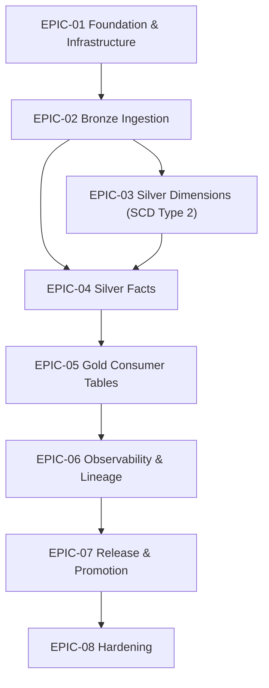

# Sprint Backlog: Patient 360 Medallion Pipeline

| Field | Value |
|-------|-------|
| **Version** | 3.4 |
| **Created** | 2026-05-09 |
| **Last Modified** | 2026-07-18 |
| **Author** | Scrum Master Agent |
| **Status** | Approved |
| **LLD Reference** | LLD-2026-06-20-patient-360.md (v1.24) |

---

## 1. Executive Summary

This sprint backlog decomposes the Patient 360 Medallion Pipeline LLD into 8 epics and 57 stories totaling 222 story points across 12 two-week sprints. The backlog targets a 3-FTE team at 25-30 pts/sprint velocity. EPIC-01 is the foundation (scaffold wired to `spark_catalog=DeltaCatalog` **plus** a named side catalog `spark.sql.catalog.unity=UCSingleCatalog` with `defaultCatalog=unity` per LLD §13 Decision 12 — re-adopted 2026-06-18; cross-layer utilities; docker-compose with `PATIENT360_PROJECT_ROOT` exported per LLD §9.1, now including a `spark-thrift-server` container and a `make ddl-apply` target; runtime bootstrap; SE fail-closed import contract). The local stack runs **Unity Catalog OSS 0.5.0** on **Spark 4.1.1 / delta-spark 4.3.0 / `unitycatalog-spark_4.1_2.13:0.5.0`** (UPGRADE-NOTES UC 0.5.0 / Spark 4.1); `uc_init.py` creates each schema with a top-level `storage_root` managed location and the stack shares a `_delta_log` volume so SE can write MANAGED audit tables. EPIC-02 through EPIC-05 are the medallion layers; each layer epic closes with perf-optimization → local integration-test. Unity Catalog OSS is the **runtime catalog** for all layers: tables are pre-created as EXTERNAL Delta by **plain beeline-applied `.sql` DDL migrations** (`CREATE TABLE IF NOT EXISTS unity.<schema>.<table> ... USING DELTA LOCATION`) against the Spark Thrift Server via `make ddl-apply` (Liquibase retired), and pipeline writes are `insertInto unity.<schema>.<table>` (Bronze, Silver facts, Gold) / `MERGE INTO unity.silver.<dim>` (SCD2 dims) — never path-based `.save` (LLD §13 Decisions 12 & 15, re-adopted 2026-06-18). spark-expectations stats/error tables are per-table MANAGED Unity Catalog tables addressed by 3-part FQN (`unity.<schema>.<table>_stats` / `_error`), SE-created via `saveAsTable` on UC 0.5.0 — the only `saveAsTable`-created tables (SE-owned, not pre-created by the DDL migrations); the earlier path-based `.option("path")` design is retired (LLD §13 Decision 12, corrected 2026-06-20; UPGRADE-NOTES §1, §6). Bronze reconciliation runs as a `SparkSubmitOperator` per LLD §4.2. EPIC-02 also carries a deploy-validation story since LLD §9.1 prescribes per-table DDL (now beeline-applied `.sql` UC EXTERNAL Delta pre-create) at the Bronze boundary. EPIC-06 wires OpenLineage / OTel / Grafana. EPIC-07 carries system-wide release work (CI, promotion, rollback, E2E benchmark). EPIC-08 hardens (PHI audit, docs/coverage, Delta maintenance).

---

## 2. Epic Overview

| Epic | Title | Scope | Stories | Points | Sprints | LLD Section | Perf | Int-Test | Deploy |
|------|-------|-------|---------|--------|---------|-------------|------|----------|--------|

| EPIC-01 | Foundation & Infrastructure | foundation | 10 | 37 | 1-3 | §2.1, §6.1, §9.1, §8.6 | — | — | — |

| EPIC-02 | Bronze Ingestion | layer | 10 | 47 | 3-5 | §5.1, §6.5, §9.1 | Yes | Yes | Yes |

| EPIC-03 | Silver Dimensions (SCD Type 2) | layer | 7 | 30 | 5-6 | §5.2 | Yes | Yes | N/A |

| EPIC-04 | Silver Facts | layer | 13 | 45 | 6-7 | §5.2 | Yes | Yes | N/A |

| EPIC-05 | Gold Consumer Tables | layer | 6 | 25 | 8 | §5.3 | Yes | Yes | N/A |

| EPIC-06 | Observability & Lineage | crosscut | 4 | 12 | 9-10 | §4.2, §10 | — | — | — |

| EPIC-07 | Release & Promotion | crosscut | 4 | 18 | 10-11 | §9.3, §9.4 | — | — | — |

| EPIC-08 | Hardening | crosscut | 3 | 8 | 11-12 | §9.5, §10.3 | — | — | — |

**Total**: 57 stories, 222 points across 12 sprints

<!--
  Closure columns (Perf / Int-Test / Deploy) report per-epic closure-sequence coverage:
    - For `layer` epics: must show ≥1 for Perf and Int-Test; Deploy may be "N/A" when layer completes at integration-test.
    - For `foundation` / `crosscut` epics: leave dashes ("—"); closure-sequence rule does not apply.
-->

---

## 3. Dependency Graph

---

## 4. Sprint Plan

### Sprint 1: Foundation scaffold + utilities

| Story ID | Title | Points | Epic |
|----------|-------|--------|------|

| STORY-01-001 | Scaffold patient_360 project from cookiecutter template | 3 | EPIC-01 |

| STORY-01-002 | Implement cross-layer utilities (config loader, logging, metrics, delta_helpers) | 5 | EPIC-01 |

**Sprint Total**: 8 points

### Sprint 2: Contracts, docker-compose, runtime bootstrap

| Story ID | Title | Points | Epic |
|----------|-------|--------|------|

| STORY-01-003 | Implement shared SCD2, derived_fields, and code_systems utilities | 5 | EPIC-01 |

| STORY-01-004 | Author table contracts and DQ rule pointers for all 13+13+3 tables | 5 | EPIC-01 |

| STORY-01-005 | docker-compose service block — Unity Catalog OSS + unity-catalog-ui (with uc_init.py) | 2 | EPIC-01 |

| STORY-01-006 | docker-compose service block — Marquez + marquez-db (postgres) | 2 | EPIC-01 |

| STORY-01-007 | docker-compose service block — Airflow (Dockerfile.airflow) + otel-collector + Makefile dev-up/dev-down | 3 | EPIC-01 |

| STORY-01-008 | Bootstrap local dev runtime (JDK / Docker / UC / Spark / SE end-to-end) | 5 | EPIC-01 |

**Sprint Total**: 22 points

### Sprint 3: SE runner + Bronze ingestion runner

| Story ID | Title | Points | Epic |
|----------|-------|--------|------|

| STORY-01-009 | SE runner — diagnostic ImportError try/except (log + re-raise) | 2 | EPIC-01 |

| STORY-01-010 | SE runner & reconciliation modules — fail-closed implementation | 5 | EPIC-01 |

| STORY-02-001 | Implement generic Bronze ingestion runner | 8 | EPIC-02 |

| STORY-02-002 | Implement Bronze TaskGroup factory + SparkSubmit wrapper | 5 | EPIC-02 |

| STORY-02-003 | Author 13 per-table Bronze ingestion YAML configs | 5 | EPIC-02 |

**Sprint Total**: 25 points

### Sprint 4: Bronze configs/DDL/SE rules + DAG

| Story ID | Title | Points | Epic |
|----------|-------|--------|------|

| STORY-02-004 | Author plain .sql DDL migrations for 13 Bronze tables | 3 | EPIC-02 |

| STORY-02-005 | Author 13 per-table Bronze SE rule YAMLs | 5 | EPIC-02 |

| STORY-02-006 | Wire Bronze TaskGroup + reconciliation_bronze into the Airflow DAG | 5 | EPIC-02 |

**Sprint Total**: 13 points

### Sprint 5: Bronze closure + Silver dimensions

| Story ID | Title | Points | Epic |
|----------|-------|--------|------|

| STORY-02-010 | Fix SE runner so inline DQ actually executes | 5 | EPIC-02 |

| STORY-02-007 | Performance: dynamic partition overwrite pruning + shuffle.partitions + observations 8-partition tuning | 3 | EPIC-02 |

| STORY-02-008 | Local integration test: trigger Bronze DAG against Unity Catalog OSS local | 5 | EPIC-02 |

| STORY-02-009 | Deploy validation: apply Bronze .sql DDL migrations locally + DAG deploy smoke | 3 | EPIC-02 |

| STORY-03-001 | Implement transform_patients_silver (SCD2 dimension) | 5 | EPIC-03 |

| STORY-03-002 | Implement transform_organizations_silver (SCD2 dimension) | 5 | EPIC-03 |

| STORY-03-003 | Implement transform_providers_silver (SCD2 dimension) | 5 | EPIC-03 |

| STORY-03-004 | Implement transform_payers_silver (SCD2 dimension) | 5 | EPIC-03 |

**Sprint Total**: 36 points

### Sprint 6: Silver facts (encounters)

| Story ID | Title | Points | Epic |
|----------|-------|--------|------|

| STORY-03-005 | Performance: broadcast small dims + SCD2-aware filter pushdown | 2 | EPIC-03 |

| STORY-03-007 | Wire the silver_dimensions TaskGroup into patient360_hourly_v1 | 3 | EPIC-03 |

| STORY-03-006 | Local integration test: trigger Silver dim tasks against UC OSS | 5 | EPIC-03 |

| STORY-04-001 | Implement transform_encounters_silver (fact) | 5 | EPIC-04 |

**Sprint Total**: 15 points

### Sprint 7: Silver facts (dependents) + closure

| Story ID | Title | Points | Epic |
|----------|-------|--------|------|

| STORY-04-002 | Implement transform_conditions_silver (fact) | 3 | EPIC-04 |

| STORY-04-003 | Implement transform_medications_silver (fact) | 3 | EPIC-04 |

| STORY-04-004 | Implement transform_observations_silver (fact) | 5 | EPIC-04 |

| STORY-04-005 | Implement transform_allergies_silver (fact) | 3 | EPIC-04 |

| STORY-04-006 | Implement transform_immunizations_silver (fact) | 3 | EPIC-04 |

| STORY-04-007 | Implement transform_procedures_silver (fact) | 3 | EPIC-04 |

| STORY-04-008 | Implement transform_claims_silver (fact) | 3 | EPIC-04 |

| STORY-04-009 | Implement transform_careplans_silver (fact) | 3 | EPIC-04 |

| STORY-04-013 | Wire the silver_facts TaskGroup into patient360_hourly_v1 | 3 | EPIC-04 |

| STORY-04-010 | Implement reconciliation_silver task (cross-table query_dq) | 3 | EPIC-04 |

| STORY-04-011 | Performance: shuffle.partitions tuning + observations 8-partition repartition | 3 | EPIC-04 |

| STORY-04-012 | Local integration test: trigger Silver fact tasks against Unity Catalog OSS | 5 | EPIC-04 |

**Sprint Total**: 40 points

### Sprint 8: Gold layer + closure

| Story ID | Title | Points | Epic |
|----------|-------|--------|------|

| STORY-05-001 | Implement build_patient_summary_gold | 5 | EPIC-05 |

| STORY-05-002 | Implement build_patient_clinical_history_gold | 5 | EPIC-05 |

| STORY-05-003 | Implement build_patient_billing_summary_gold | 5 | EPIC-05 |

| STORY-05-004 | Performance: cache shared Silver inputs + broadcast small dims for Gold builds | 2 | EPIC-05 |

| STORY-05-006 | Implement reconciliation_gold task (silver-vs-gold row counts + patient/allergy completeness) | 3 | EPIC-05 |

| STORY-05-005 | Local integration test: trigger Gold tasks against Unity Catalog OSS local | 5 | EPIC-05 |

**Sprint Total**: 25 points

### Sprint 9: Observability wiring

| Story ID | Title | Points | Epic |
|----------|-------|--------|------|

| STORY-06-001 | Wire OpenLineage Spark listener + Marquez emit_lineage task | 3 | EPIC-06 |

| STORY-06-002 | Wire OpenTelemetry metrics + emit_metrics task | 3 | EPIC-06 |

| STORY-06-003 | Build Grafana dashboards: Pipeline Health, DQ, SLA, Capacity | 3 | EPIC-06 |

**Sprint Total**: 9 points

### Sprint 10: Alerts + CI + promotion

| Story ID | Title | Points | Epic |
|----------|-------|--------|------|

| STORY-06-004 | Wire alerting rules + PagerDuty / Slack channels per LLD §10.3 | 3 | EPIC-06 |

| STORY-07-001 | Build CI pipeline (GitHub Actions: lint + unit + integration) | 5 | EPIC-07 |

| STORY-07-002 | Build DEV→STAGING→PROD promotion runbooks | 5 | EPIC-07 |

**Sprint Total**: 13 points

### Sprint 11: Rollback + E2E + hardening start

| Story ID | Title | Points | Epic |
|----------|-------|--------|------|

| STORY-07-003 | Implement rollback procedure (Delta RESTORE + re-run) | 3 | EPIC-07 |

| STORY-07-004 | Full-pipeline E2E load test (Bronze → Gold) on staging-equivalent data | 5 | EPIC-07 |

| STORY-08-001 | Security & PHI audit (NFR-6 masking, NFR-7 audit trail) | 3 | EPIC-08 |

| STORY-08-002 | Documentation & coverage audit | 3 | EPIC-08 |

**Sprint Total**: 14 points

### Sprint 12: Maintenance

| Story ID | Title | Points | Epic |
|----------|-------|--------|------|

| STORY-08-003 | Schedule Delta VACUUM / OPTIMIZE maintenance | 2 | EPIC-08 |

**Sprint Total**: 2 points

---

## 5. Traceability Matrix

| Epic / Story | LLD | DMS | STM | DQS | DRD | HLD |
|-------------|-----|-----|-----|-----|-----|-----|

| EPIC-01 | §2.1, §6.1, §9.1, §8.6 | §2-4 | all | §2-5 | §1-7 | §4-5 |

| EPIC-02 | §5.1, §6.5, §9.1 | §2-4 | all | §2-5 | §1-7 | §4-5 |

| EPIC-03 | §5.2 | §2-4 | all | §2-5 | §1-7 | §4-5 |

| EPIC-04 | §5.2 | §2-4 | all | §2-5 | §1-7 | §4-5 |

| EPIC-05 | §5.3 | §2-4 | all | §2-5 | §1-7 | §4-5 |

| EPIC-06 | §4.2, §10 | §2-4 | all | §2-5 | §1-7 | §4-5 |

| EPIC-07 | §9.3, §9.4 | §2-4 | all | §2-5 | §1-7 | §4-5 |

| EPIC-08 | §9.5, §10.3 | §2-4 | all | §2-5 | §1-7 | §4-5 |

---

## 6. Risks & Assumptions

- **Runtime catalog re-baselined back to Unity Catalog OSS (named side-catalog wiring)**: LLD v1.13 (2026-06-18) re-adopted Decision 12 (UC as the runtime catalog) and Decision 15 (UC-managed writes), superseding the 2026-05-12 Derby/path-based revert. UC is wired as a NAMED side catalog (`spark.sql.catalog.unity=UCSingleCatalog`, `defaultCatalog=unity`) alongside `spark_catalog=DeltaCatalog` — `spark_catalog` is **never** UCSingleCatalog (the original failure mode). Tables are pre-created as EXTERNAL Delta by **beeline-applied plain dated `ddl/migrations/*.sql` migrations** (applied in lexical order) against a Spark Thrift Server (`make ddl-apply`; Liquibase retired per UPGRADE-NOTES); all business-table pipeline writes are `insertInto` / `MERGE INTO` the `unity.<schema>.<table>` namespace; the only `saveAsTable` is SE creating its MANAGED `_stats`/`_error` audit tables on UC 0.5.0. _(Mitigation: STORY-01-001 / -01-002 / -01-007 ACs enforce DeltaCatalog + named-unity side-catalog wiring, the `spark-thrift-server` container (no Liquibase), and the beeline `make ddl-apply` target; STORY-02-001 / -02-003 / -02-008 / -02-009 + all EPIC-03/04/05 build stories require `unity.<schema>.<table>` insertInto/MERGE and forbid path-based `.save`.)_

- **UC 0.5.0 / Spark 4.1 upgrade (enables SE MANAGED audit tables)**: The stack was raised from UC 0.4.0 / Spark 4.0.x to **UC 0.5.0 + Spark 4.1.1 + delta-spark 4.3.0 + `unitycatalog-spark_4.1_2.13:0.5.0` + openlineage-spark 1.50.0** (UPGRADE-NOTES). UC 0.4.0 could not create SE's MANAGED `_error`/`_stats` tables (empty-namespace `fullTableNameForApi` AIOOBE on bare names + no managed storage location); 0.5.0 fixes name qualification and supports `catalogManaged` tables with coordinated commits. Operational requirements: UC 0.5.0 server image built from source with the `/root/.cache` Dockerfile fix; schemas created with a top-level `storage_root`; a shared `_delta_log` volume; fully-qualified 3-part names in all contracts/DQ rules; PySpark pinned to 4.1.1 (delta-spark 4.3.0 ceiling). _(Mitigation: STORY-01-005 ACs pin UC 0.5.0 + `storage_root` + `_delta_log`; STORY-01-007 ACs pin Spark 4.1.1 + the 0.5.0 connector jars; STORY-01-008 bootstrap runs against the 0.5.0 stack and proves SE MANAGED audit tables populate.)_

- **SE import contract is fail-closed (single state)**: STORY-01-009 wires the diagnostic `try/except ImportError` (logs at ERROR and re-raises); STORY-01-010 ships `se_runner.py` + `reconciliation.py`. Neither story may introduce a soft-degradation path — missing-SE is a deploy error per LLD §8.6 + §13 Decision 14. _(Mitigation: STORY-01-010 AC asserts the ImportError still propagates; STORY-01-009 AC asserts the diagnostic line is at ERROR level and re-raise is in place.)_

- **Local stack drift**: docker-compose stack must match LLD §9.1.1 versions exactly. _(Mitigation: Pin images per service-grouped story (STORY-01-005 / -006 / -007); STORY-01-008 bootstrap ACs verify versions; each docker-compose story DoD requires `docker compose ps healthy` + service-specific probe evidence.)_

- **Shared docker-compose.yml co-authorship**: STORY-01-005, -01-006, and -01-007 all edit the same file; sprint-2 must merge them serially in dependency order to avoid conflicts. _(Mitigation: Auto-Depends-On chain 005→007 and 006→007; only STORY-01-007 declares `make dev-up` against the full seven-service stack.)_

- **DuckDB read concurrency**: 13 Bronze tasks running parallel may saturate the source DB. _(Mitigation: LLD §6.3 caps Bronze parallelism at 13; tune DuckDB connections.)_

- **Sam R. at 50% allocation**: Cannot be assigned blocking stories per team-capacity.md. _(Mitigation: Assign Sam to non-critical-path stories; senior engineer Alex M. owns SE-runner work.)_

### Assumptions

- Sprint length = 2 weeks; team velocity = 25-30 pts/sprint per team-capacity.md.

- All upstream artifacts (DRD, HLD, DMS, STM, DQS, LLD) are Approved as of 2026-05-09.

- Dev laptops have Docker Desktop and JDK 17 available — STORY-01-008 verifies prerequisites fail-closed.

- Synthea Phase-1 dataset (13 tables, 7.9M rows, 636 MB) is available for staging-equivalent E2E tests.

- Plain beeline-applied `.sql` DDL migrations pre-create UC EXTERNAL Delta tables for all layers (Bronze + Silver + Gold = 29 tables; LLD §9.1 + §13 Decision 12, applied via `make ddl-apply` against the Spark Thrift Server; Liquibase retired per UPGRADE-NOTES — each migration is idempotent `CREATE TABLE IF NOT EXISTS`). EPIC-02 carries the only layer-scoped deploy-validation story (Bronze boundary); Silver and Gold rely on `make ddl-apply` run from EPIC-01 bootstrap / their integration tests; system-wide deploy lives in EPIC-07.

- Local stack runs UC OSS 0.5.0 + Spark 4.1.1 + delta-spark 4.3.0 + `unitycatalog-spark_4.1_2.13:0.5.0` + openlineage-spark 1.50.0 (PySpark pinned to 4.1.1 per the delta-spark 4.3.0 `pyspark<=4.1.1` ceiling). UC 0.5.0 schemas carry a top-level `storage_root` managed location and the stack shares a `_delta_log` volume (UPGRADE-NOTES §4.5, §7).

---

## 7. Version History

| Version | Date | Author | Changes |
|---------|------|--------|---------|

| 1.0 | 2026-05-09 | Scrum Master Agent | Initial backlog generated from LLD v1.9. |
| 1.1 | 2026-05-09 | Scrum Master Agent | Split STORY-01-005 (docker-compose stack) into 3 service-grouped stories: STORY-01-005 (UC OSS + UI + uc_init.py), STORY-01-006 (Marquez + marquez-db), STORY-01-007 (Airflow + otel-collector + Makefile dev-up/dev-down). Renumbered downstream EPIC-01 stories: bootstrap-runtime 006→008, se-runner-bootstrap 007→009, se-runner-fail-closed 008→010. Updated cross-epic Depends-On in EPIC-02 (STORY-02-001, STORY-02-005, STORY-02-008) and EPIC-04 (STORY-04-010 reference). Added DoD requirement to all 3 docker-compose stories: `docker compose ps healthy` + service-specific HTTP/CLI probe evidence captured in verification block. EPIC-01 grew from 8 stories / 35 pts to 10 stories / 37 pts. |
| 1.2 | 2026-05-11 | Scrum Master Agent | Re-baselined against LLD v1.11 (LLD-2026-05-11-patient-360.md). **SE bootstrap-mode lifecycle retired upstream (LLD §8.6 + §13 Decision 14 Resolved)** — STORY-01-009 reframed from "bootstrap soft-import + WARNING log" to "diagnostic `try/except ImportError` (log at ERROR + re-raise)"; STORY-01-010 reframed from "remove soft-import" to "ship `se_runner.py` + `reconciliation.py` with fail-closed import contract". No story added/removed (still 53 stories / 208 pts). Updated Executive Summary, Risks (SE bootstrap-to-fail-closed transition row), and EPIC-01 Objective wording to match the single-state contract. Updated LLD alert routing references for missing-SE to PagerDuty CRITICAL per LLD §8.5 (was Slack WARNING). Scenario B update: v1.1 → v1.2, new filename `BACKLOG-2026-05-11-patient-360.md`, prior file archived to `BACKLOG-2026-05-09-patient-360.md.bak`. Status reset to `Updated - Pending Review`. |
| 1.3 | 2026-05-11 | Scrum Master Agent | STORY-02-005 AC text + Verification globs fixed to per-table convention `dq_rules/{table}.yml` (was `dq_rules/synthea_*.yml`) per LLD §5.1 and `patient_360/CLAUDE.md`. The 13 per-table YAML files already exist on disk and satisfy content; only AC1/AC3 wording and the `How to Test` ls command were updated. No story added/removed, no point changes. Scenario C in-place edit (same-version same-date). |
| 1.4 | 2026-05-11 | Scrum Master Agent | STORY-02-005 Verification block: switched AC2 (`row_dq` grep_count) and AC3 (`action_if_failed: fail` grep_count) from `equals` to `min` (AC2 `min: 13`, AC3 `min: 6`). Spec defect: original `equals` thresholds under-counted because per-table YAMLs legitimately contain multiple row_dq rules each (actual matches: 45 row_dq, 53 fail). Implementation already correct; no story added/removed, no point changes. Scenario C in-place edit (same-version same-date). |
| 1.5 | 2026-05-11 | Scrum Master Agent | STORY-02-004 re-scoped AC2 + Verification to match LLD §9.1: `master-changelog.xml` is **project-wide** (Bronze + Silver + Gold = 29 tables across DMS §2/§3/§4), not Bronze-only. AC1 unchanged (13 Bronze per-table changelogs). AC2 now asserts the project-wide master-changelog exists and includes all 13 Bronze entries (Silver/Gold includes added by their own stories; total reaches 29). Verification AC2 switched the `<include file=` grep from `equals: 13` to `greater_or_equal: 13` so the same assertion still holds after downstream Silver + Gold layer stories extend the master file; added a second grep asserting `changelogs/synthea_` appears at least 13 times to keep Bronze coverage tight. Description prose updated to explain the project-wide vs layer-scoped split. No story added/removed, no point changes. Scenario C in-place edit (same-version same-date). |
| 1.6 | 2026-05-11 | Scrum Master Agent | STORY-02-008 Verification YAML + Testing + How-to-Test test paths switched from flat `tests/integration/test_bronze_uc.py` and `tests/integration/test_bronze_se_evidence.py` to layer-scoped `tests/integration/bronze/test_bronze_uc.py` and `tests/integration/bronze/test_bronze_se_evidence.py`, matching the `developer-plugin:create-integration-test` skill's emitted layout. AC text wording unchanged; only pytest node paths updated. No story added/removed, no point changes. Scenario C in-place edit (same-version same-date). |
| 1.7 | 2026-05-12 | Scrum Master Agent | Re-baselined against LLD v1.12 (LLD-2026-05-12-patient-360.md) — 8 architectural pivots applied across EPIC-01 / EPIC-02 stories. **(1)** Stripped 3-part `unity.bronze.<table>` FQNs → 2-part `bronze.<table>` (path-based Delta against `warehouse/{env}/bronze/<table>/` via Hive metastore) in STORY-02-001, STORY-02-003, STORY-02-008. **(2)** STORY-02-006 reconciliation_bronze re-spec'd as `SparkSubmitOperator` (was `PythonOperator`); DAG defaults set to `max_active_tasks=1` and `catchup=False` per LLD §4.1 DEV. **(3)** STORY-02-007 compute defaults bumped from 2g/2g → 1g/1g (driver/executor) per LLD §6.1. **(4)** STORY-02-009 deploy-validation drops UC-managed write expectations; Bronze writes are path-based Delta verified by directory + `_delta_log/` checks. **(5)** STORY-02-001 + STORY-02-003 default `source.type=csv`; DuckDB now reserved for tables whose raw CSV is < 100 MB per LLD §5.1 source-selection rule. **(6)** STORY-02-008 SE evidence query AC + Verification filter on `meta_dq_run_date` only (dropped `meta_dq_run_id = run_id` clause — SE rejects Airflow-supplied run_id overrides). **(7)** EPIC-01 scaffold (STORY-01-001 / STORY-01-002 / STORY-01-007) wires `spark_catalog=DeltaCatalog` + Hive metastore (Derby) with persistent JDBC URL replacing `UCSingleCatalog`; `PATIENT360_PROJECT_ROOT` env var exported by `_infra/docker/docker-compose.yml` for every Airflow service. Preserved already-correct ACs (e.g., docker-compose service-block ACs, scaffold render ACs, smoke/probe evidence) — they remain checked. No story added/removed; point totals unchanged (53 stories / 208 pts). Scenario B update: v1.6 → v1.7, new filename `BACKLOG-2026-05-12-patient-360.md`, prior file archived to `BACKLOG-2026-05-11-patient-360.md.bak`. Status reset to `Updated - Pending Review`. |
| 1.7 | 2026-06-15 | Scrum Master Agent | Status changed to Approved |
| 1.8 | 2026-06-15 | Scrum Master Agent | STORY-03-001 (EPIC-03) AC1 stale-reference fix — the v1.7 re-baseline touched only EPIC-01/EPIC-02 stories and left this Silver story carrying the revoked 3-part FQN. AC1 changed from "reads `unity.bronze.synthea_patients` (UC-managed; LLD §13 Decision 15)" to: reads the bronze `synthea_patients` table as path-based external Delta (`warehouse/{env}/bronze/synthea_patients/`) via the `read_bronze_delta` helper — NOT `unity.bronze.synthea_patients`. Removed the "UC-managed; LLD §13 Decision 15" parenthetical; traceability tag updated `[LLD §5.2, §13]` → `[LLD §5.2]` noting Decisions 12 & 15 revoked 2026-05-12 (UC registration is deploy-time only). Synced the AC1 Verification grep (was `unity.bronze.synthea_patients`), the User Story + Description read-path prose, and the Technical Notes upstream-references line for consistency. No other ACs, deliverables, dependencies, stories, or point totals changed. Scenario B: v1.7 → v1.8, new filename `BACKLOG-2026-06-15-patient-360.md`, prior file archived to `BACKLOG-2026-05-12-patient-360.md.bak`. Status reset to `Updated - Pending Review`. |
| 1.8 | 2026-06-15 | Scrum Master Agent | Status changed to Approved |
| 1.9 | 2026-06-15 | Scrum Master Agent | **Closed the Silver DAG-wiring traceability gap** — Bronze had a dedicated DAG-wiring story (STORY-02-006) but the Silver layer integration tests (STORY-03-006, STORY-04-012) triggered `silver_dimensions` / `silver_facts` tasks that no build story actually created. Added **STORY-03-007** (wire `silver_dimensions` TaskGroup — 4 `transform_*_silver` dim tasks, `SparkSubmitOperator`-only per LLD §4.2, downstream of `reconciliation_bronze`; 3 pts, Sprint 6) and **STORY-04-013** (wire `silver_facts` TaskGroup — 9 fact tasks with `encounters` as fan-in/fan-out hub, `allergies` ← `patients`; 3 pts, Sprint 7), grounded in LLD §4.2/§4.3. Ripple: STORY-03-006 now depends on STORY-03-007; STORY-04-010 (`reconciliation_silver`) and STORY-04-013 now sit downstream/upstream so `reconciliation_silver` gates on the full silver TaskGroup. EPIC-03 6→7 stories / 27→30 pts; EPIC-04 12→13 / 42→45 pts; backlog 53→55 stories / 208→214 pts. Sprint 6 12→15 pts, Sprint 7 37→40 pts. Gold DAG-wiring (analogous gap in EPIC-05) deferred — silver-layer scope only. Status reset to `Updated - Pending Review`. |
| 1.9 | 2026-06-15 | Scrum Master Agent | Status changed to Approved |
| 2.0 | 2026-06-16 | Scrum Master Agent | **EPIC-03 stale UC-managed bronze-read re-sync across STORY-03-002 / -03-003 / -03-004** — the v1.7 LLD-v1.12 re-baseline touched only EPIC-01/EPIC-02, and the v1.8 fix corrected only STORY-03-001, leaving the other three Silver dimension build stories (organizations, providers, payers) still carrying the revoked 3-part `unity.bronze.synthea_<table>` FQN. Applied the STORY-03-001 v1.8 pattern to all three: (1) User Story read-path prose → "transform the bronze `synthea_<table>` table (path-based external Delta under `warehouse/{env}/bronze/synthea_<table>/`) …"; (2) Description read-path → reads via the `read_bronze_delta` helper (Decision 12 & 15 revoked 2026-05-12; UC registration is deploy-time only); (3) AC1 → reads path-based external Delta via `read_bronze_delta` — NOT `unity.bronze.synthea_<table>`, trace tag `[LLD §5.2, §13]` → `[LLD §5.2]`; (4) Upstream references line dropped §13 from the LLD list and appended the path-based-external-Delta note; (5) AC1 Verification grep `unity.bronze.synthea_<table>` → `read_bronze_delta|warehouse/.*bronze/synthea_<table>|bronze/synthea_<table>`. No other ACs, points, dependencies, stories, or DAG-wiring stories (STORY-03-007 / STORY-04-013) changed. Status reset to `Updated - Pending Review`. |
| 2.0 | 2026-06-16 | Scrum Master Agent | Status changed to Approved |
| 2.1 | 2026-06-18 | Scrum Master Agent | **Re-baselined against LLD v1.13 (LLD-2026-06-18-patient-360.md) — Unity Catalog OSS RE-ADOPTED as the runtime catalog (Decisions 12 & 15 reversed the 2026-05-12 Derby/path-based revert).** New wiring: `spark_catalog=DeltaCatalog` + NAMED side catalog `spark.sql.catalog.unity=UCSingleCatalog` (`defaultCatalog=unity`); `spark_catalog` is NEVER UCSingleCatalog. Tables pre-created as EXTERNAL Delta by Liquibase (`CREATE TABLE unity.<schema>.<table> ... USING DELTA LOCATION`) against a new `spark-thrift-server` container via `make ddl-apply`; runtime writes are `insertInto unity.<schema>.<table>` (Bronze/Silver-facts/Gold) and `MERGE INTO unity.silver.<dim>` (SCD2 dims); no `saveAsTable`/path-based `.save` anywhere; SE stats tables stay path-based. **Stories reconciled:** EPIC-01 STORY-01-001/-002 (DeltaCatalog + named-unity side catalog, drop Derby), STORY-01-007 (added `spark-thrift-server`+`liquibase` services, `Dockerfile.thrift`, `make ddl-apply` target — now an eight-service stack; DoD ACs reset for re-verification), STORY-01-008 (bootstrap runs `make ddl-apply`); EPIC-02 STORY-02-001/-003/-004/-008/-009 (insertInto unity.bronze.* into Liquibase-pre-created tables, DDL emits `USING DELTA LOCATION`, deploy-validation targets Spark Thrift Server, verification grep blocks flipped); EPIC-03 STORY-03-001..004 (read `unity.bronze.synthea_*`, SCD2 MERGE into `unity.silver.<dim>`, dropped the path-based `read_bronze_delta`/`NOT unity.bronze` ACs); EPIC-04 STORY-04-001..009 (write target flipped to `insertInto unity.silver.<table>`); EPIC-05 STORY-05-001..003 (full-overwrite `insertInto unity.gold.<table>`). EPIC-03/04/05 integration tests run `make ddl-apply` before DAG trigger. Executive Summary + Risks + Assumptions updated. **STORY-03-007 (silver_dimensions DAG wiring) left intact — orchestration-only, unaffected.** No story added/removed; point totals unchanged (55 stories / 214 pts). Scenario B: new filename `BACKLOG-2026-06-18-patient-360.md`, prior file archived to `BACKLOG-2026-06-15-patient-360.md.bak`. Status reset to `Updated - Pending Review`. |
| 2.1 | 2026-06-18 | Scrum Master Agent | Status changed to Approved |
| 2.2 | 2026-06-18 | Scrum Master Agent | **Targeted SE-stats path-based AC refinement against LLD v1.13 (§8.2/§8.3, §13 Decision 12/15)** — captured the UC architecture's spark-expectations write contract at the story-AC level so `update-ingestion` has an explicit contract. **STORY-01-010** (SE runner, owns `se_runner.py`): added AC7 — SE STATS and ERROR tables are written PATH-BASED via `.option("path", <warehouse path>)` OUTSIDE the UC catalog (never `saveAsTable` into a catalog table; UCSingleCatalog rejects saveAsTable-create); stats_writer must carry `.option("path", ...)` like the error_writer; NO `CREATE TABLE ... USING DELTA LOCATION` registration and NO `spark.catalog.tableExists` gating in `se_runner.py`; `SE_STATS_TABLE`/`SE_ERROR_TABLE` resolve to warehouse filesystem paths (e.g. `warehouse/{env}/_se/bronze_se_stats`), not 2-part catalog FQNs. Added matching AC7 Verification (grep `.option("path"`; forbidden_grep `saveAsTable`, `CREATE TABLE .* USING DELTA`, `tableExists`); updated Technical Notes + Estimation upstream refs (+§8.2/§8.3/§13 Dec 12/15). **STORY-02-001** (bronze runner): added AC9 cross-referencing that `se_runner` writes SE stats path-based, with no runner write-method change (business data still `insertInto unity.bronze.<table>`); added AC9 Verification. Narrow scope — did NOT alter the already-correct insertInto/unity.*/Liquibase-LOCATION ACs on STORY-02-002/-003/-004 or any Silver/Gold stories. No story added/removed; point totals unchanged (55 stories / 214 pts). Scenario C in-place edit (same-version same-date). Status reset to `Updated - Pending Review`. Re-approval to follow. |
| 2.2 | 2026-06-18 | Scrum Master Agent | Status changed to Approved |
| 2.3 | 2026-06-18 | Scrum Master Agent | **Targeted deploy-runtime AC added to STORY-01-007 (Spark Thrift Server jar resolution) — fixes Thrift Server boot failure.** Added AC11 + matching Verification: `Dockerfile.thrift` MUST resolve the Delta + Unity Catalog jars at BUILD time INTO Spark's classpath `/opt/spark/jars/` (copied as root before `USER spark`), so the Thrift Server starts with no network access and no ivy resolution at runtime; the generated `spark-defaults.conf` MUST NOT contain a `spark.jars.packages` line (runtime resolution fails — the `spark` user's `HOME=/nonexistent` cannot write the ivy cache → `java.io.FileNotFoundException /nonexistent/.ivy2...`); `spark-defaults.conf` keeps only `spark.sql.extensions` + catalog wiring (`spark_catalog=DeltaCatalog`, `unity=UCSingleCatalog`, `.uri`, `.token`, `defaultCatalog=unity`). Verification greps `/opt/spark/jars` jar-copy and `forbidden_grep` on `spark.jars.packages`. Basis LLD §9.1.1 (Spark Thrift Server service), §13 Decision 12. Narrow scope — only this one new AC on STORY-01-007; no other STORY-01-007 ACs, no other stories, no point totals (still 55 stories / 214 pts) changed. Scenario C in-place edit (same-version same-date). Status reset to `Updated - Pending Review`. Re-approval to follow. |
| 2.3 | 2026-06-18 | Scrum Master Agent | Status changed to Approved |
| 2.4 | 2026-06-18 | Scrum Master Agent | **Write-idempotency AC correction against LLD v1.14 §2.3 / §13 Decision 15 — Bronze + Silver-fact writes switched from `insertInto`+`replaceWhere` (a confirmed BUG: `insertInto` silently ignores `replaceWhere`, so re-runs append/double the data) to DYNAMIC PARTITION OVERWRITE.** **STORY-02-001** (bronze runner): write AC + Description now require `df.write.mode("overwrite").insertInto("unity.bronze.<table>")` with NO `.option("replaceWhere", ...)`; SparkSession AC (AC7) now requires `spark.sql.sources.partitionOverwriteMode=dynamic`; Verification AC4 flipped — `replaceWhere` grep → `mode("overwrite").insertInto` grep + `forbidden_grep` on `replaceWhere`; AC7 adds a `partitionOverwriteMode=dynamic` grep. **STORY-01-002** (cross-layer utils / `build_spark_session`): SparkSession AC + Verification now require `spark.sql.sources.partitionOverwriteMode=dynamic`. **STORY-02-007** (bronze perf): title/Description/AC3 re-worded from "`replaceWhere` partition pruning" to "dynamic partition overwrite pruning" (mechanism reference only). **EPIC-04 STORY-04-001..009** (Silver cleansed facts): each write AC + Description now require `df.write.mode("overwrite").insertInto("unity.silver.<table>")` under dynamic partition overwrite with NO `replaceWhere`; Verification flipped to `mode("overwrite").insertInto` grep + `forbidden_grep` on `replaceWhere`. EPIC-02 objective + epic story-table titles synced. **NOT touched:** EPIC-03 STORY-03-001..004 SCD2 dimensions (correctly use `DeltaTable.forName` MERGE). No story added/removed; point totals unchanged (55 stories / 214 pts). Scenario C in-place edit (same-version same-date). Status reset to `Updated - Pending Review`. Re-approval to follow. |
| 2.4 | 2026-06-18 | Scrum Master Agent | Status changed to Approved |
| 2.5 | 2026-06-19 | Scrum Master Agent | **Added STORY-02-010 (EPIC-02) — "Fix SE runner so inline DQ actually executes" — capturing the SE-runner DQ-execution fix mandated by LLD v1.17 §2.3 "SE rule-matching & isolation contract" (§13 Decision 12/14/15/16 silent-DQ no-op class).** The inline Spark-Expectations gate had never executed: `se_runner` passed mismatched identifiers, so SE matched ZERO rules and silently validated nothing on every Bronze/Silver run. New build story (owner Data Engineering, 5 pts, Sprint 5), deliverable `src/patient_360/utils/se_runner.py`, depends on STORY-01-010 / STORY-02-001 / STORY-02-005. Six ACs (each with Verification grep globs over `se_runner.py`): AC1 `SparkExpectations(product_id=<rules YAML product_id>)` not the bare table name; AC2 `with_expectations(target_table=<dq_env.<ENV>.table_name>)` (now emitted BARE by `generate-se-rules`); AC3 bare-name `createOrReplaceTempView` for every `unity.{bronze,silver,gold}.<t>` plus the in-flight df last, so referential `query_dq` resolves under `defaultCatalog=unity`; AC4 PER-TABLE SE stats + error Delta paths `warehouse/{env}/_se/<table>/{stats,errors}` (forbids shared `bronze_se_stats`); AC5 integration smoke proves SE selects >0 rules and a `row_dq` drop rule physically removes rows; AC6 preserves `run_dq` signature, `_DQ_ENV_MAP`, path-based design, fail-closed import. EPIC-02 9→10 stories / 42→47 pts; backlog 55→56 stories / 214→219 pts; Sprint 5 31→36 pts. LLD Reference bumped to v1.17. No other stories/epics touched. Scenario B: new filename `BACKLOG-2026-06-19-patient-360.md`, prior file archived to `BACKLOG-2026-06-18-patient-360.md.bak`. Status reset to `Updated - Pending Review`. Re-approval to follow. |
| 2.5 | 2026-06-19 | Scrum Master Agent | Status changed to Approved |
| 2.6 | 2026-06-19 | Scrum Master Agent | **Added AC7 to STORY-02-010 (EPIC-02) — disable the SE error / rejected-rows table under the UC side-catalog.** With inline DQ now actually executing (the AC1-AC6 rule-matching fix), Spark Expectations attempts to write its error (rejected-rows) table via `saveAsTable`, which `UCSingleCatalog` rejects (`defaultCatalog=unity`; RTAS/CTAS unsupported per LLD §13 Decision 12) — aborting the run with `ArrayIndexOutOfBoundsException`. SE offers no path-based override for the error table (unlike the stats table), so it must be disabled. AC7 requires `run_dq` to set `user_conf["se.enable.error.table"] = False` while keeping `se.enable.stats.table = True` (stats stays path-based via `delta.\`<path>\``); the `row_dq` `drop` still removes failing rows from the output — only the rejected-row audit table is omitted. Added matching AC7 Verification greps over `se_runner.py` (`se.enable.error.table` → False, `se.enable.stats.table` → True), updated Technical Notes + Estimation upstream refs (LLD §2.3 v1.17, §13 Decision 12). AC1-AC6 unchanged. No story added/removed; point totals unchanged (56 stories / 219 pts). Scenario C in-place edit (same-version same-date). Status reset to `Updated - Pending Review`. Re-approval to follow. |
| 2.6 | 2026-06-19 | Scrum Master Agent | Status changed to Approved |
| 2.7 | 2026-06-19 | Scrum Master Agent | Status changed to Approved |
| 2.7 | 2026-06-19 | Scrum Master Agent | **Added AC8 to STORY-02-010 (EPIC-02) — make `run_dq` column-stable.** Now that AC1-AC6 make inline DQ actually execute, spark-expectations' `with_expectations` APPENDS run-tracking columns (`meta_dq_run_id`, `meta_dq_run_datetime`) to the DataFrame it returns. Callers that write the `run_dq` result straight to a pre-created target table (e.g. Bronze `write_bronze` → `insertInto(unity.bronze.<table>)`) then fail with Delta `_LEGACY_ERROR_TEMP_DELTA_0007` (schema mismatch — target has neither column); Silver dodged it only by re-`select(OUTPUT_COLUMNS)`. AC8 fixes it at the single source: `run_dq` captures `input_cols = df.columns` before `with_expectations` and returns `validated.select(*input_cols)`, dropping SE's appended columns so the returned schema equals the input schema and any caller writes straight to the pre-created table; run-tracking values persist in the SE stats table, not the data table. Added matching AC8 Verification greps over `se_runner.py` (`input_cols = df.columns`; `.select(*input_cols)`) and updated Technical Notes. Basis LLD §2.3 (v1.17), §13 Decision 12/16. AC1-AC7 unchanged. No story added/removed; point totals unchanged (56 stories / 219 pts). Scenario C in-place edit (same-version same-date). Status reset to `Updated - Pending Review`. Re-approval to follow. |
| 2.8 | 2026-06-20 | Scrum Master Agent | **Fixed STORY-02-010 (EPIC-02) error-table AC against corrected LLD v1.20 §2.3 / §13 Decision 12 — MANAGED FQN SE error table RE-ENABLED on UC 0.5.0; RTAS/CTAS misdiagnosis removed.** The earlier story revisions (v2.5-v2.6) wrote the SE stats/error tables PATH-BASED (`warehouse/{env}/_se/<table>/{stats,errors}`) and DISABLED the error table (`se.enable.error.table=False`) on the false premise that `UCSingleCatalog` "rejects RTAS/CTAS `saveAsTable`". The corrected LLD (v1.20, §13 Decision 12 correction 2026-06-20) establishes the true root cause: an **empty-namespace `fullTableNameForApi` defect on BARE names** under spark-submit (AIOOBE on a length-0 namespace), NOT an RTAS refusal — and UC **0.5.0** fixes namespace handling AND supports MANAGED `saveAsTable` creates. **AC4** flipped: SE stats AND error tables are now per-table **MANAGED UC tables** by 3-part FQN (`unity.<schema>.<table>_stats` / `_error`, `format("delta")` no `.option("path")`); forbidden_grep now blocks BOTH the shared `bronze_se_stats` name AND the path-based `_se/<table>` / `.option("path")` shape. **AC7** flipped: `se.enable.error.table` `False`→`True` (stats stays `True`); RTAS misdiagnosis prose withdrawn and replaced with the empty-namespace explanation; forbidden_grep added blocking `error.table=False`. **AC6** no longer claims the path-based SE design is "preserved" (it is superseded). Synced Description item 4, Technical Notes (root cause + implementation hints), Estimation/upstream refs, How-to-Test expected outcome, Documentation Updates, and all `(v1.17)`→`(v1.20)` traceability tags. AC1/2/3/5/8 (rule-matching, temp views, column stability) unchanged in substance. LLD Reference bumped v1.17→v1.20. Executive Summary SE-storage line corrected (path-based→MANAGED FQN). No story added/removed; point totals unchanged (56 stories / 219 pts). **Ripple flagged (not auto-applied — outside STORY-02-010 scope):** STORY-01-010 AC7 (v2.2) still mandates PATH-BASED SE writes + forbids `saveAsTable`/`CREATE TABLE USING DELTA` in `se_runner.py`, and STORY-02-001 AC9 cross-references it — both now contradict the MANAGED-FQN contract and should be reconciled in a follow-up update. Scenario B: new filename `BACKLOG-2026-06-20-patient-360.md`, prior file archived to `BACKLOG-2026-06-19-patient-360.md.bak`. Status reset to `Updated - Pending Review`. Re-approval to follow. |
| 2.9 | 2026-06-20 | Scrum Master Agent | **Reconciled the v2.8 ripple — STORY-01-010 AC7 + STORY-02-001 AC9 brought in line with the MANAGED-FQN SE audit-table contract (LLD §2.3 v1.20 / §13 Decision 12 corrected 2026-06-20).** v2.8 corrected STORY-02-010 to write the SE stats AND error tables as per-table MANAGED UC tables by 3-part FQN (`unity.<schema>.<table>_stats` / `_error`, SE-created via `saveAsTable` on UC 0.5.0), withdrawing the path-based `.option("path", warehouse/{env}/_se/...)` design and the "UCSingleCatalog rejects RTAS/CTAS" misdiagnosis (true root cause: empty-namespace `fullTableNameForApi` AIOOBE on bare names, fixed by the FQN `target_table` + UC 0.5.0). **STORY-01-010 (owns `se_runner.py`):** AC7 flipped from "SE STATS/ERROR PATH-BASED via `.option('path', ...)`, NEVER `saveAsTable`" to "per-table MANAGED UC tables by 3-part FQN, MANAGED `format('delta')` with NO `.option('path')`, SE-created via `saveAsTable`"; AC7 Verification flipped — required-grep `.option("path")`/`SE_STATS_TABLE` → `stats_table=...{target_table}_stats` + `unity.<schema>` + `_stats`/`_error`; forbidden-grep set changed from `saveAsTable`/`CREATE TABLE USING DELTA`/`tableExists` → `bronze_se_stats` (shared name)/`_se/<table>` (path-based)/`.option("path")`; Description + Technical Notes (upstream refs, impl hints) re-worded to the MANAGED-FQN contract and `(v1.20)` / §13 Decision 12 corrected 2026-06-20 tags. **STORY-02-001 (bronze runner, cross-references it):** AC9 text flipped from "se_runner writes SE tables path-based" to "se_runner writes them as MANAGED UC tables by FQN via `saveAsTable`"; the runner-scoped `forbidden_grep: saveAsTable` is RETAINED (the runner itself still never creates tables — only `se_runner` does) with its reason string + cross-ref corrected. No story added/removed; no point/sprint/dependency changes (56 stories / 219 pts). Scenario C in-place edit (same-version same-date). Status reset to `Updated - Pending Review`. Re-approval to follow. |
| 2.9 | 2026-06-20 | Scrum Master Agent | Status changed to Approved |
| 3.0 | 2026-06-22 | Scrum Master Agent | **Re-baselined against LLD v1.24 + the UC 0.5.0 / Spark 4.1 upgrade (UPGRADE-NOTES-UC-0.5.0-Spark-4.1.md). Two coupled changes:** **(1) Liquibase → plain beeline-applied `.sql` DDL.** STORY-02-004 re-scoped in place (ID + 3 pts kept, title "Author Liquibase DDL changelogs..." → "Author plain .sql DDL migrations for 13 Bronze tables"): authors `ddl/bronze/synthea_{table}.sql` files issuing idempotent `CREATE TABLE IF NOT EXISTS unity.bronze.synthea_{table} ... USING DELTA LOCATION`, applied by `make ddl-apply` (beeline against `jdbc:hive2://spark-thrift-server:10000/unity`); no `master-changelog.xml`, no `<changeSet>`/`<rollback>` XML. Verification flipped to `ddl/bronze/*.sql` globs + forbidden_grep on Liquibase artifacts. Reconciled the Liquibase references across the coupled stories: STORY-02-009 (deploy-validation title + ACs + tests → beeline `.sql`), STORY-02-008/-02-001/-02-003 (`Liquibase-pre-created` → beeline-pre-created; runner saveAsTable forbidden_grep reason corrected — runner never creates business tables, the .sql migrations do), STORY-02-010 ("NOT pre-created in Liquibase" → "by the `ddl/*.sql` migrations"), EPIC-01 STORY-01-001 (`ddl/liquibase/` → `ddl/bronze/` in scaffold tree), STORY-01-004 (wording), EPIC-01/EPIC-02 objectives + epic-AC + risks/assumptions. STORY-01-007: dropped the `liquibase/liquibase:4.29` container (stack 8→7 services), `ddl-apply` target now runs beeline over `ddl/*.sql`, forbidden_grep on `liquibase` in compose + Makefile. **(2) UC 0.4.0 → 0.5.0 / Spark 4.0.x → 4.1.1.** Folded into existing EPIC-01 ACs (no new story per confirmed decision Q2): STORY-01-005 (UC image v0.4.0 → 0.5.0 built-from-source with the `/root/.cache` Dockerfile fix; `uc_init.py` schemas now carry a top-level `storage_root` managed location; shared `_delta_log` volume; uc-source clone tag v0.5.0; verification greps storage_root + `_delta_log` + 0.5.0), STORY-01-007 (Dockerfile.airflow + Dockerfile.thrift Spark 4.0.0 → 4.1.1, delta-spark 4.3.0 + `unitycatalog-spark_4.1_2.13:0.5.0` + openlineage-spark 1.50.0 jars; shared `_delta_log` volume), STORY-01-008 (bootstrap creates schemas with `storage_root`, runs against UC 0.5.0, proves SE MANAGED `_stats`/`_error` audit tables populate). Reopened the previously-`[x]` EPIC-01 epic-level ACs and the touched STORY-01-005/-007/-008 ACs for re-verification against the upgraded stack. Added an Executive-Summary upgrade line, a new Risks row (UC 0.5.0 upgrade rationale + operational requirements), and two new Assumptions rows. LLD Reference bumped v1.20 → v1.24. No story added/removed; point totals unchanged (56 stories / 219 pts). Scenario B: new filename `BACKLOG-2026-06-22-patient-360.md`, prior file archived to `BACKLOG-2026-06-20-patient-360.md.bak`. Status reset to `Updated - Pending Review`. Re-approval to follow. |
| 3.1 | 2026-06-22 | Scrum Master Agent | **Corrected the v3.0 DDL-migration path: `ddl/bronze/` → flat `ddl/migrations/` plain DATED `.sql` files applied in LEXICAL order (LLD v1.24 §intro / §9.1 / §13 Decision 12 DDL-applier sub-decision).** v3.0 placed the beeline-applied DDL under per-layer `ddl/bronze/` (and implied `ddl/silver/`/`ddl/gold/`); the LLD actually specifies a single flat `ddl/migrations/` directory holding plain dated `<YYYYMMDD>_<NNN>_<table>.sql` migrations applied in lexical order by the beeline one-shot `_infra/docker/ddl-apply.sh` / `make ddl-apply` (the dated + zero-padded filename prefix gives the bronze → silver → gold apply order — there are no per-layer subdirs). Swept every story/epic/BACKLOG reference: STORY-02-004 title/User-Story/Description/ACs/Verification re-scoped to plain dated `ddl/migrations/*.sql` EXTERNAL Delta with `LOCATION` (file_count/grep_count globs → `ddl/migrations/*synthea_*.sql`; Makefile grep + forbidden_grep point at `ddl/migrations`); STORY-02-001/-02-003/-02-008/-02-009 + STORY-01-001 (scaffold tree `ddl/bronze/` → `ddl/migrations/`) / -01-007 (Makefile `ddl-apply` description + AC + Verification grep + How-to-Test) / -01-008 (Description + AC), EPIC-01/EPIC-02 objectives + epic-AC, and the BACKLOG Risks row all flipped to `ddl/migrations/*.sql` (lexical order). STORY-02-010 SE-table note `ddl/*.sql` → `ddl/migrations/*.sql`. Scenario C in-place edit (same-version same-date, minor bump 3.0 → 3.1). No story added/removed; point totals unchanged (56 stories / 219 pts). Status reset to `Updated - Pending Review`. Re-approval to follow. |
| 3.3 | 2026-07-14 | Scrum Master Agent | **Closed the Gold reconciliation traceability gap (analogous to the v1.9 Silver DAG-wiring fix, EPIC-05 scope).** LLD §4.2 / §6.5.3 + DQS §4 define a `reconciliation_gold` task (Reconciliation; depends on ALL Gold build tasks; feeds `emit_lineage`/`emit_metrics`) performing silver-vs-gold row-count reconciliation, patient completeness = 5,767 (NFR-4 / DQ-FLD-106), and allergy completeness (DQ-FLD-138) — but EPIC-05 had NO story that BUILDS it; STORY-05-005 (integration-test) only *asserted* it succeeds, making 05-005 unimplementable. Added **STORY-05-006** "Implement reconciliation_gold task (silver-vs-gold row counts + patient/allergy completeness)" (`build`, 3 pts, Sprint 8, P1; deliverables `src/patient_360/gold/reconciliation.py`, `airflow/jobs/run_gold_recon.py`, `reconciliation_gold` DAG wiring with `gold_build >> reconciliation_gold`, unit tests under `tests/gold/`; mirrors the Bronze reconciliation module). Depends on STORY-05-001/-002/-003 (the 3 builders). Ripple: STORY-05-005 Dependencies STORY-05-004 → STORY-05-004, STORY-05-006 (integration-test now gates on reconciliation existing; topo order builders → {05-004, 05-006} → 05-005). EPIC-05 5→6 stories / 22→25 pts; backlog 56→57 stories / 219→222 pts; Sprint 8 22→25 pts. Updated EPIC-05.md (Stories/Points, story table, In-Scope, Layer Closure Sequence). No code, DMS/STM/DQS/LLD, or other stories touched. Scenario B: new filename `BACKLOG-2026-07-14-patient-360.md`, prior file archived to `BACKLOG-2026-06-22-patient-360.md.bak`. Status reset to `Updated - Pending Review`. Re-approval to follow. |
| 3.2 | 2026-06-22 | Scrum Master Agent | **Continued the LLD v1.24 re-baseline — fixed residual drift the v3.0/v3.1 sweeps missed.** Six surgical corrections, all matching LLD v1.24: **(1) Liquibase sweep** — every remaining `Liquibase-pre-created` / `pre-created by Liquibase` / `NOT pre-created in Liquibase` reference replaced with the beeline-applied `ddl/migrations/*.sql` mechanism (Decision 12, Liquibase retired): EPIC-03 STORY-03-001/-002/-003/-004 (lines 32 + 51), EPIC-04 STORY-04-001..009 (line 32), EPIC-05 STORY-05-001/-002/-003 (line 32), STORY-01-010 (line 49), EPIC-07 (line 40 "only Bronze has Liquibase" → "only Bronze has a layer-scoped DDL deploy-validation story"). **(2) Spark version** — STORY-01-008 AC "reports Spark 4.0.0" → "reports Spark 4.1.1". **(3) Marquez port** — STORY-01-006 host API port 5000 → 5001 (6 occurrences) to match LLD §9.1.1 / EPIC-06 STORY-06-001. **(4) SE stats name** — shared `bronze_se_stats` → per-table MANAGED FQN `unity.bronze.synthea_<table>_stats` in STORY-01-008 (53/137), STORY-01-010 (47/49), STORY-02-008 (32); `meta_dq_run_id` matching logic preserved. **(5) Bronze metadata column** — added the 4th column `_source_file STRING` (LLD §2.3, prevents `DELTA_INSERT_COLUMN_ARITY_MISMATCH`) to the runner spec (STORY-02-001 Description + AC) and the DDL migration column list (STORY-02-004). **(6) Service count** — BACKLOG Risks row "six-service stack" → "seven-service stack" to match EPIC-01 line 92 / STORY-01-007. Scenario C in-place edit (same-version same-date, minor bump 3.1 → 3.2). No story added/removed; point totals unchanged (56 stories / 219 pts). chapter-5 untouched. Status reset to `Updated - Pending Review`. Re-approval to follow. |
| 3.3 | 2026-07-14 | Scrum Master Agent | Status changed to Approved |
| 3.4 | 2026-07-18 | Scrum Master Agent | STORY-05-005 (Gold integration-test) Verification YAML + Testing table + How-to-Test test paths resynced from the flat `tests/integration/test_gold_uc.py` / `tests/integration/test_gold_dq_evidence.py` layout to the layer-scoped `tests/integration/gold/test_gold_uc.py` / `tests/integration/gold/test_gold_se_evidence.py` files actually emitted by `developer-plugin:create-integration-test` (direct analog of the v1.6 Bronze STORY-02-008 fix). Also renamed the DQ-evidence file reference `test_gold_dq_evidence.py` → `test_gold_se_evidence.py`. AC semantics unchanged — pytest node names (`test_dag_runs`, `test_3_gold_tables_in_uc`, `test_patient_summary_count_5767`, `test_allergy_completeness`), row counts (5,767), table names, and rule ids (DQ-FLD-106/-138) all preserved. No story added/removed, no point changes. Scenario B: new filename `BACKLOG-2026-07-18-patient-360.md`, prior file archived to `BACKLOG-2026-07-14-patient-360.md.bak`. Status reset to `Updated - Pending Review`. Re-approval to follow. |
| 3.4 | 2026-07-18 | Scrum Master Agent | Status changed to Approved |

